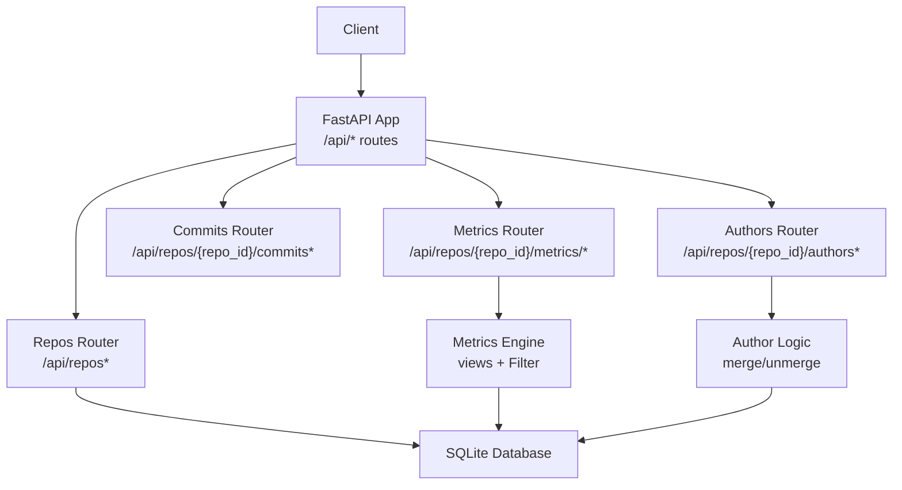
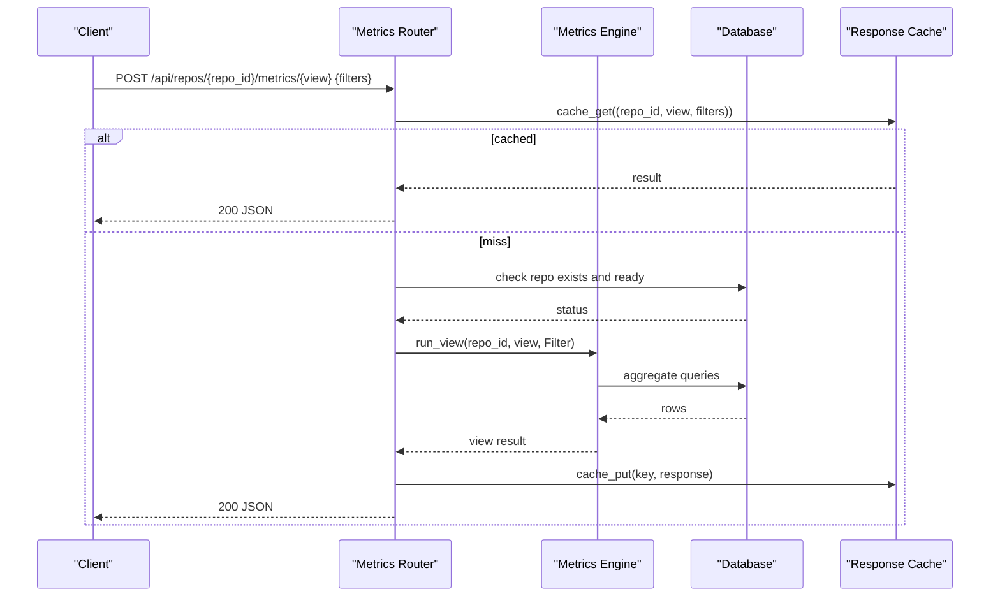
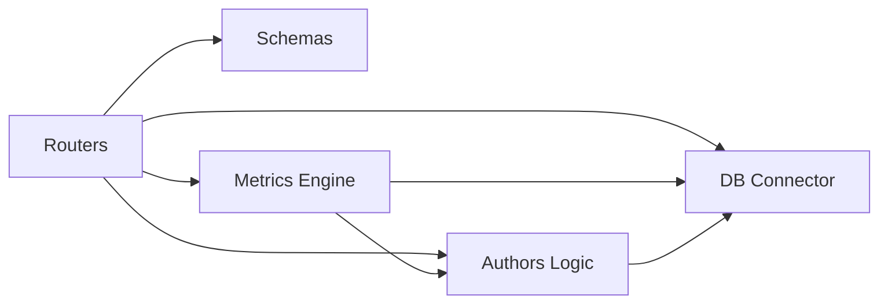

# API Reference

<cite>
**Referenced Files in This Document**
- [main.py](file://backend/app/main.py)
- [repos.py](file://backend/app/routers/repos.py)
- [authors.py](file://backend/app/routers/authors.py)
- [commits.py](file://backend/app/routers/commits.py)
- [metrics_router.py](file://backend/app/routers/metrics.py)
- [schemas.py](file://backend/app/schemas.py)
- [metrics_logic.py](file://backend/app/metrics.py)
- [authors_logic.py](file://backend/app/authors.py)
- [test_api.py](file://backend/tests/test_api.py)
- [README.md](file://README.md)
</cite>

## Table of Contents
1. [Introduction](#introduction)
2. [Project Structure](#project-structure)
3. [Core Components](#core-components)
4. [Architecture Overview](#architecture-overview)
5. [Detailed Component Analysis](#detailed-component-analysis)
6. [Dependency Analysis](#dependency-analysis)
7. [Performance Considerations](#performance-considerations)
8. [Troubleshooting Guide](#troubleshooting-guide)
9. [Conclusion](#conclusion)
10. [Appendices](#appendices)

## Introduction
This document describes the RESTful API exposed by RAT (Repo Analysis Tool). It covers repository management, author operations, commit search, and metric queries. The API is implemented with FastAPI under the `/api` namespace. Authentication is not enforced; clients should treat endpoints as internal or protect them through a reverse proxy if needed.

Key capabilities:
- Ingest repositories via zip upload or remote clone.
- List, inspect, and delete repositories.
- Manage author identities and manual merge groups.
- Search commits and paths for dashboard filters.
- Query metrics across files, directories, authors, timeseries, and commit sets.

The backend uses SQLite with WAL mode, streamed git indexing, and a short-lived response cache for expensive metric views.

**Section sources**
- [README.md:1-15](file://README.md#L1-L15)
- [main.py:13-27](file://backend/app/main.py#L13-L27)

## Project Structure
RAT’s API is organized into FastAPI routers grouped by feature:
- Repository ingestion and lifecycle: `GET /api/repos`, `POST /api/repos/upload`, `POST /api/repos/clone`, `GET /api/repos/{id}`, `DELETE /api/repos/{id}`
- Author identity and merging: `GET /api/repos/{repo_id}/authors`, `POST /api/repos/{repo_id}/author-merges`, `DELETE /api/repos/{repo_id}/author-merges/{identity}`, `DELETE /api/repos/{repo_id}/author-groups/{group_id}`
- Commit and path pickers: `GET /api/repos/{repo_id}/commits`, `GET /api/repos/{repo_id}/paths`
- Metric queries: `POST /api/repos/{repo_id}/metrics/{view}`

**Diagram sources**
- [main.py:24-27](file://backend/app/main.py#L24-L27)
- [repos.py:16-113](file://backend/app/routers/repos.py#L16-L113)
- [authors.py:9-49](file://backend/app/routers/authors.py#L9-L49)
- [commits.py:10-102](file://backend/app/routers/commits.py#L10-L102)
- [metrics_router.py:10-40](file://backend/app/routers/metrics.py#L10-L40)
- [metrics_logic.py:43-396](file://backend/app/metrics.py#L43-L396)
- [authors_logic.py:15-131](file://backend/app/authors.py#L15-L131)

**Section sources**
- [main.py:24-27](file://backend/app/main.py#L24-L27)
- [README.md:109-140](file://README.md#L109-L140)

## Core Components
- Repository router: handles listing, uploading zips, cloning URLs, retrieving status, and deleting repositories.
- Author router: lists identities/groups and supports merging/unmerging identities and groups.
- Commits router: provides paged commit search and file/directory path picker results.
- Metrics router: validates view names, caches responses, checks repository readiness, builds a filter object, runs the selected view, and returns standardized responses.
- Schemas: Pydantic models for request bodies (`CloneRequest`, `MetricsFilters`, `MergeRequest`).
- Metrics engine: defines the `Filter` dataclass and implements all metric views (`summary`, `files`, `dirs`, `authors`, `timeseries`, `commits`) plus a TTL cache.
- Author logic: computes effective author keys/names and manages manual merges.

**Section sources**
- [repos.py:16-113](file://backend/app/routers/repos.py#L16-L113)
- [authors.py:9-49](file://backend/app/routers/authors.py#L9-L49)
- [commits.py:10-102](file://backend/app/routers/commits.py#L10-L102)
- [metrics_router.py:10-40](file://backend/app/routers/metrics.py#L10-L40)
- [schemas.py:9-29](file://backend/app/schemas.py#L9-L29)
- [metrics_logic.py:43-396](file://backend/app/metrics.py#L43-L396)
- [authors_logic.py:15-131](file://backend/app/authors.py#L15-L131)

## Architecture Overview
The API follows a thin-router pattern:
- Routers validate inputs and delegate to domain modules.
- Domain modules perform SQL aggregation over SQLite.
- A small in-process cache stores recent metric responses keyed by repo, view, and serialized filter.

**Diagram sources**
- [metrics_router.py:13-40](file://backend/app/routers/metrics.py#L13-L40)
- [metrics_logic.py:389-435](file://backend/app/metrics.py#L389-L435)

## Detailed Component Analysis

### Repository Management Endpoints

#### List Repositories
- Method: `GET`
- Path: `/api/repos`
- Description: Returns all repositories ordered by creation time.
- Response: Array of repository objects.
- Status codes:
  - `200`: Success.

Repository object fields:
- `id`: integer
- `name`: string
- `source_type`: string (`zip` or `clone`)
- `source`: string (filename or URL)
- `ref`: string
- `status`: string (`pending`, `cloning`, `ingesting`, `ready`, `error`)
- `progress`: number
- `progress_detail`: string
- `error`: string
- `head_sha`: string
- `commit_count`: integer
- `have_mailmap`: boolean
- `created_at`: integer timestamp
- `path`: string

**Section sources**
- [repos.py:18-47](file://backend/app/routers/repos.py#L18-L47)

#### Upload Repository Zip
- Method: `POST`
- Path: `/api/repos/upload`
- Request: multipart/form-data with field `file`.
- Accepted formats: `.zip` archives only.
- Behavior: Validates archive, creates a repository row with status `pending`, starts background ingestion thread, and returns initial repository metadata.
- Response: Repository object.
- Status codes:
  - `200`: Upload accepted and ingestion started.
  - `400`: Missing filename or invalid archive type/format.
  - `500`: Storage error.

Example call:
- Upload a zip file named `example.zip` using multipart form data with key `file`.

**Section sources**
- [repos.py:50-78](file://backend/app/routers/repos.py#L50-L78)

#### Clone Remote Repository
- Method: `POST`
- Path: `/api/repos/clone`
- Request body: `CloneRequest`
  - `url`: string (must start with `http://`, `https://`, `git://`, `ssh://`, or `git@`)
  - `name`: optional string; defaults derived from URL tail
- Behavior: Creates repository row with status `pending`, starts background clone and ingestion, returns initial repository metadata.
- Response: Repository object.
- Status codes:
  - `200`: Clone accepted and ingestion started.
  - `400`: Invalid URL format.

Example request body:
- `{ "url": "https://github.com/user/repo.git", "name": "repo" }`

**Section sources**
- [repos.py:81-94](file://backend/app/routers/repos.py#L81-L94)
- [schemas.py:9-12](file://backend/app/schemas.py#L9-L12)

#### Get Repository
- Method: `GET`
- Path: `/api/repos/{repo_id}`
- Path parameter: `repo_id` (integer)
- Response: Repository object.
- Status codes:
  - `200`: Success.
  - `404`: Repository not found.

**Section sources**
- [repos.py:97-100](file://backend/app/routers/repos.py#L97-L100)

#### Delete Repository
- Method: `DELETE`
- Path: `/api/repos/{repo_id}`
- Path parameter: `repo_id` (integer)
- Behavior: Deletes database row and on-disk repository directory, invalidates related metric cache entries.
- Response: `{ "ok": true }`
- Status codes:
  - `200`: Deleted successfully.
  - `404`: Repository not found.

**Section sources**
- [repos.py:103-113](file://backend/app/routers/repos.py#L103-L113)

### Author Operations

#### List Authors and Groups
- Method: `GET`
- Path: `/api/repos/{repo_id}/authors`
- Path parameter: `repo_id` (integer)
- Response: Object containing:
  - `have_mailmap`: boolean indicating whether a mailmap was applied at ingest.
  - `authors`: array of identity records with fields:
    - `identity`: lowercase email used as identity key
    - `email`: original email
    - `name`: resolved name
    - `commits`: count
    - `group_id`: integer or null
    - `group_name`: string or null
    - `raw_names`: concatenated raw author names
  - `groups`: array of merge groups with fields:
    - `id`: integer
    - `name`: string
    - `identities`: array of identity strings

- Status codes:
  - `200`: Success.
  - `404`: Repository not found.

**Section sources**
- [authors.py:12-16](file://backend/app/routers/authors.py#L12-L16)
- [authors_logic.py:28-60](file://backend/app/authors.py#L28-L60)

#### Merge Authors
- Method: `POST`
- Path: `/api/repos/{repo_id}/author-merges`
- Path parameter: `repo_id` (integer)
- Request body: `MergeRequest`
  - `identities`: array of lowercase identity strings
  - `name`: canonical group name (optional; defaults to first identity)
- Behavior: Unifies existing merge groups if any, updates merged author name, inserts mapping for each identity, removes empty groups, invalidates metric cache, and returns updated authors list.
- Response: Same structure as list authors endpoint.
- Status codes:
  - `200`: Merge successful.
  - `400`: Validation error (e.g., empty identities).
  - `404`: Repository not found.

Example request body:
- `{ "identities": ["bob@example.com", "carol@example.com"], "name": "Dev Team" }`

**Section sources**
- [authors.py:19-29](file://backend/app/routers/authors.py#L19-L29)
- [schemas.py:27-29](file://backend/app/schemas.py#L27-L29)
- [authors_logic.py:63-110](file://backend/app/authors.py#L63-L110)

#### Unmerge Identity
- Method: `DELETE`
- Path: `/api/repos/{repo_id}/author-merges/{identity}`
- Path parameters:
  - `repo_id`: integer
  - `identity`: lowercase identity string
- Behavior: Removes identity from merge mappings, cleans up empty groups, invalidates metric cache, returns updated authors list.
- Response: Same structure as list authors endpoint.
- Status codes:
  - `200`: Unmerged successfully.
  - `404`: Repository not found.

**Section sources**
- [authors.py:32-39](file://backend/app/routers/authors.py#L32-L39)
- [authors_logic.py:112-121](file://backend/app/authors.py#L112-L121)

#### Unmerge Group
- Method: `DELETE`
- Path: `/api/repos/{repo_id}/author-groups/{group_id}`
- Path parameters:
  - `repo_id`: integer
  - `group_id`: integer
- Behavior: Removes all mappings for the group, deletes empty group record, invalidates metric cache, returns updated authors list.
- Response: Same structure as list authors endpoint.
- Status codes:
  - `200`: Unmerged successfully.
  - `404`: Repository not found.

**Section sources**
- [authors.py:42-49](file://backend/app/routers/authors.py#L42-L49)
- [authors_logic.py:124-131](file://backend/app/authors.py#L124-L131)

### Commit Search and Path Picker

#### List Commits
- Method: `GET`
- Path: `/api/repos/{repo_id}/commits`
- Path parameter: `repo_id` (integer)
- Query parameters:
  - `q`: string; searches SHA prefix, subject, author name, and author email
  - `start`: integer UNIX timestamp (inclusive); filters by committer date
  - `end`: integer UNIX timestamp (exclusive); filters by committer date
  - `limit`: integer; default 100; range 1–500
  - `offset`: integer; default 0; must be ≥ 0
- Response: Object with:
  - `total`: integer total matching commits
  - `items`: array of commit objects with fields:
    - `sha`: full SHA
    - `short`: first 10 characters
    - `committer_ts`: integer UNIX timestamp
    - `author`: resolved author name
    - `author_key`: identifier like `i:<email>` or `m:<group_id>`
    - `subject`: commit message

- Status codes:
  - `200`: Success.
  - `404`: Repository not found.

Example call:
- `GET /api/repos/1/commits?q=c2&limit=50&offset=0`

**Section sources**
- [commits.py:13-60](file://backend/app/routers/commits.py#L13-L60)

#### List Paths
- Method: `GET`
- Path: `/api/repos/{repo_id}/paths`
- Path parameter: `repo_id` (integer)
- Query parameters:
  - `q`: string; filters files and directories by substring match
  - `limit`: integer; default 50; range 1–500
- Response: Object with:
  - `items`: array of path objects with fields:
    - `path`: string path
    - `type`: string (`dir` or `file`)
    - `label`: display label (adds trailing slash for directories)

- Status codes:
  - `200`: Success.
  - `404`: Repository not found.

Example call:
- `GET /api/repos/1/paths?q=x.py&limit=50`

**Section sources**
- [commits.py:63-102](file://backend/app/routers/commits.py#L63-L102)

### Metric Queries

#### Metric View Endpoint
- Method: `POST`
- Path: `/api/repos/{repo_id}/metrics/{view}`
- Path parameters:
  - `repo_id`: integer
  - `view`: one of `summary`, `files`, `dirs`, `authors`, `timeseries`, `commits`
- Request body: `MetricsFilters`
  - `start`: integer UNIX timestamp (inclusive)
  - `end`: integer UNIX timestamp (exclusive)
  - `commits`: array of SHA strings (manual selection; overrides time range)
  - `authors`: array of author keys (`i:<email>` or `m:<group_id>`)
  - `path`: string (file or directory scope)
  - `object_type`: `"file"` or `"dir"`
  - `granularity`: `"day"`, `"week"`, or `"month"` (default `"month"`)
  - `limit`: integer (default 500; clamped per view)
  - `offset`: integer (default 0)
  - `only_changed`: boolean (applies to commits view to include only commits touching the current object)
- Response envelope:
  - `repo_id`: integer
  - `view`: string
  - view-specific payload

- Status codes:
  - `200`: Success.
  - `404`: Unknown view or repository not found.
  - `409`: Repository not ready yet (status is not `ready`).

Common response fields across views:
- `commit_count`: integer size of commit set H
- Derived metrics where applicable:
  - `added`, `removed`, `growth`, `churn`, `modifications`
  - `modification_frequency`: modifications / |H| (0 when |H|=0)
  - `churn_rate`: churn / |H| (0 when |H|=0)

View-specific responses:

- `summary`
  - Fields: added, removed, growth, churn, modifications, modification_frequency, churn_rate, commit_count, object:
    - `path`: string
    - `type`: `"root"` when no path, otherwise inferred from `object_type`

- `files`
  - Fields: commit_count, items: array of file objects with fields:
    - `path`: string
    - added, removed, growth, churn, modifications, modification_frequency, churn_rate

- `dirs`
  - Fields: commit_count, items: array of directory objects with fields:
    - `path`: string
    - `depth`: integer
    - added, removed, growth, churn, modifications, modification_frequency, churn_rate

- `authors`
  - Fields: commit_count, churn_total, items: array of author objects with fields:
    - `author_key`: string
    - `author`: string
    - `commits`: integer
    - `modifications`: integer
    - `churn`: integer
    - `ownership`: float (author churn / churn_total; 0 when churn_total=0)

- `timeseries`
  - Fields: commit_count, granularity, items: array of bucket objects with fields:
    - `bucket`: string (date or month string)
    - `bucket_ts`: integer UNIX timestamp
    - added, removed, growth, churn, commits, modifications

- `commits`
  - Fields: commit_count, total, items: array of commit objects with fields:
    - `sha`, `short`, `committer_ts`, `author`, `author_key`, `subject`
    - `added`, `removed`, `churn`

Examples:

- Summary for entire repository:
  - `POST /api/repos/1/metrics/summary` with body `{}`

- Files under directory scope:
  - `POST /api/repos/1/metrics/files` with body `{ "path": "src", "object_type": "dir" }`

- Timeseries by day:
  - `POST /api/repos/1/metrics/timeseries` with body `{ "granularity": "day" }`

- Paged commit-set rows scoped to a directory and only changed commits:
  - `POST /api/repos/1/metrics/commits` with body `{ "path": "src", "object_type": "dir", "only_changed": true, "limit": 50, "offset": 0 }`

**Section sources**
- [metrics_router.py:13-40](file://backend/app/routers/metrics.py#L13-L40)
- [schemas.py:14-24](file://backend/app/schemas.py#L14-L24)
- [metrics_logic.py:135-396](file://backend/app/metrics.py#L135-L396)

### Authentication and Security
- No built-in authentication middleware is present.
- CORS allows requests from local frontend origins.
- Clients should deploy behind an authenticated gateway if external access is required.

**Section sources**
- [main.py:15-20](file://backend/app/main.py#L15-L20)

## Dependency Analysis
High-level dependencies between components:

- Routers depend on schemas for validation and on domain modules for business logic.
- Metrics engine depends on author logic for effective author resolution and on the database for aggregation.
- Author logic depends on the database for identity and merge state.

**Diagram sources**
- [repos.py:11-14](file://backend/app/routers/repos.py#L11-L14)
- [authors.py:6-7](file://backend/app/routers/authors.py#L6-L7)
- [commits.py:6-8](file://backend/app/routers/commits.py#L6-L8)
- [metrics_router.py:8-9](file://backend/app/routers/metrics.py#L8-L9)
- [metrics_logic.py:37-38](file://backend/app/metrics.py#L37-L38)
- [authors_logic.py:15-25](file://backend/app/authors.py#L15-L25)

**Section sources**
- [repos.py:11-14](file://backend/app/routers/repos.py#L11-L14)
- [authors.py:6-7](file://backend/app/routers/authors.py#L6-L7)
- [commits.py:6-8](file://backend/app/routers/commits.py#L6-L8)
- [metrics_router.py:8-9](file://backend/app/routers/metrics.py#L8-L9)
- [metrics_logic.py:37-38](file://backend/app/metrics.py#L37-L38)
- [authors_logic.py:15-25](file://backend/app/authors.py#L15-L25)

## Performance Considerations
- Ingestion runs once per repository using a streaming subprocess; query-time performance relies on indexed SQLite tables.
- Directory metrics de-duplicate modifications per commit during aggregation.
- Response caching uses a 30-second TTL and a maximum entry limit; cache invalidation occurs after author merges and repository deletion.
- Recommended pagination:
  - Use `limit` and `offset` for large datasets, especially for `files`, `dirs`, and `commits` views.
  - For commit search, keep `limit` within 1–500 and use `offset` to page through results.
- Time-range filtering reduces workload significantly; prefer `start`/`end` when possible.
- Manual commit selection (`commits`) is efficient for small sets but can increase query complexity.

[No sources needed since this section provides general guidance]

## Troubleshooting Guide
Common issues and resolutions:

- Repository not ready:
  - Symptom: `409 Conflict` with detail indicating repository status is not `ready`.
  - Resolution: Poll `/api/repos/{repo_id}` until status becomes `ready`; avoid querying metrics until then.

- Unknown metric view:
  - Symptom: `404 Not Found` with detail naming the unknown view.
  - Resolution: Use one of the supported views: `summary`, `files`, `dirs`, `authors`, `timeseries`, `commits`.

- Invalid clone URL:
  - Symptom: `400 Bad Request` when cloning.
  - Resolution: Ensure URL starts with `http://`, `https://`, `git://`, `ssh://`, or `git@`.

- Invalid upload:
  - Symptom: `400 Bad Request` for missing filename or non-zip content.
  - Resolution: Upload a valid `.zip` archive containing the repository.

- Empty commit set:
  - Symptom: Views return zero counts and empty item arrays.
  - Resolution: Adjust `start`/`end` or `commits` to include relevant commits.

- Author merge errors:
  - Symptom: `400 Bad Request` due to empty identities.
  - Resolution: Provide at least one identity in the merge request.

**Section sources**
- [metrics_router.py:14-30](file://backend/app/routers/metrics.py#L14-L30)
- [repos.py:50-94](file://backend/app/routers/repos.py#L50-L94)
- [authors.py:23-26](file://backend/app/routers/authors.py#L23-L26)

## Conclusion
RAT’s API provides a concise surface for repository ingestion, author management, commit/path discovery, and rich metric queries. Clients should handle asynchronous ingestion by polling repository status, paginate large result sets, and leverage time-range and manual commit filters for performance. Author merges are applied at query time, enabling instant reflection across all metrics without re-indexing.

[No sources needed since this section summarizes without analyzing specific files]

## Appendices

### HTTP Methods and URL Patterns Summary
- `GET /api/repos`
- `POST /api/repos/upload`
- `POST /api/repos/clone`
- `GET /api/repos/{repo_id}`
- `DELETE /api/repos/{repo_id}`
- `GET /api/repos/{repo_id}/authors`
- `POST /api/repos/{repo_id}/author-merges`
- `DELETE /api/repos/{repo_id}/author-merges/{identity}`
- `DELETE /api/repos/{repo_id}/author-groups/{group_id}`
- `GET /api/repos/{repo_id}/commits`
- `GET /api/repos/{repo_id}/paths`
- `POST /api/repos/{repo_id}/metrics/{view}`

**Section sources**
- [README.md:109-140](file://README.md#L109-L140)

### Example Calls

- Repository ingestion via zip:
  - `POST /api/repos/upload` with multipart form data including `file`.

- Repository ingestion via clone:
  - `POST /api/repos/clone` with body `{ "url": "https://github.com/user/repo.git" }`.

- Author merging:
  - `POST /api/repos/1/author-merges` with body `{ "identities": ["bob@example.com", "carol@example.com"], "name": "Dev Team" }`.

- Metric queries:
  - `POST /api/repos/1/metrics/summary` with body `{}`.
  - `POST /api/repos/1/metrics/files` with body `{ "path": "src", "object_type": "dir" }`.
  - `POST /api/repos/1/metrics/timeseries` with body `{ "granularity": "day" }`.
  - `POST /api/repos/1/metrics/commits` with body `{ "path": "src", "object_type": "dir", "only_changed": true, "limit": 50, "offset": 0 }`.

**Section sources**
- [test_api.py:29-96](file://backend/tests/test_api.py#L29-L96)