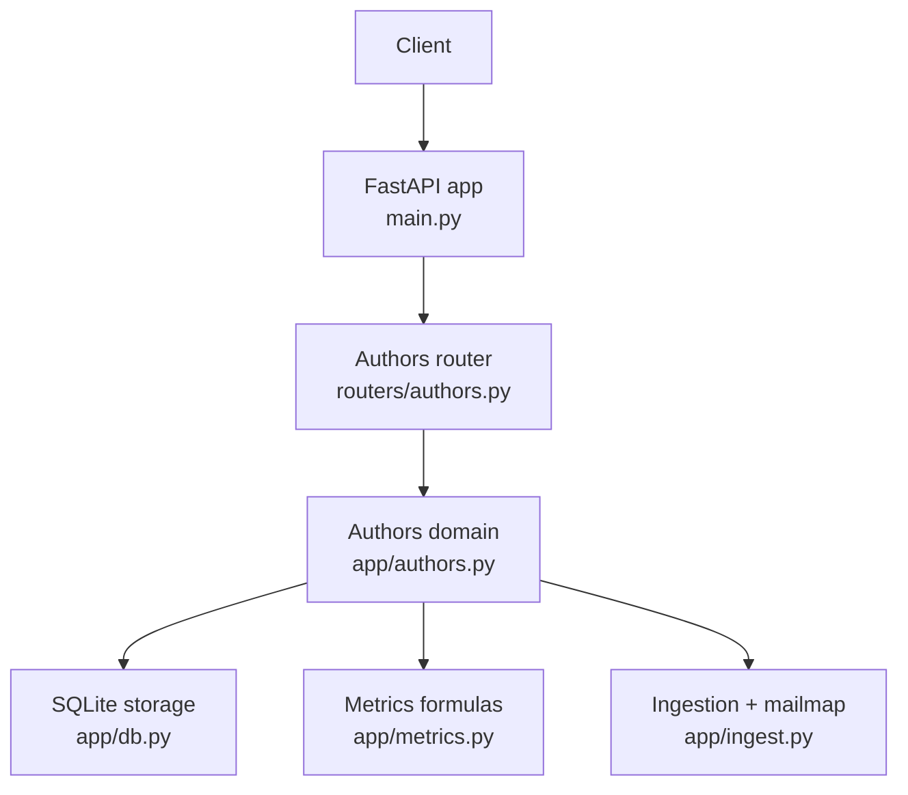
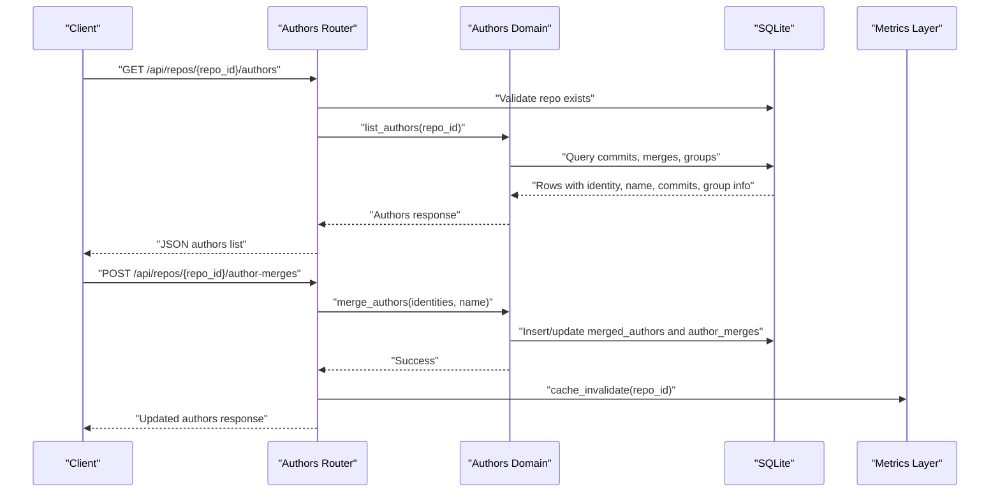
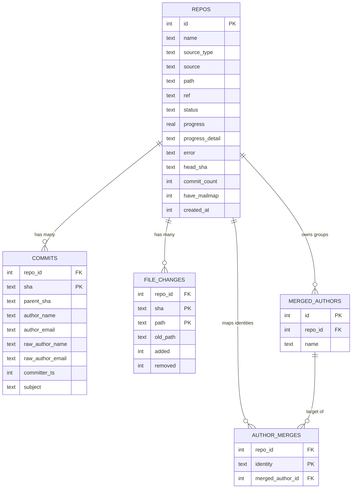
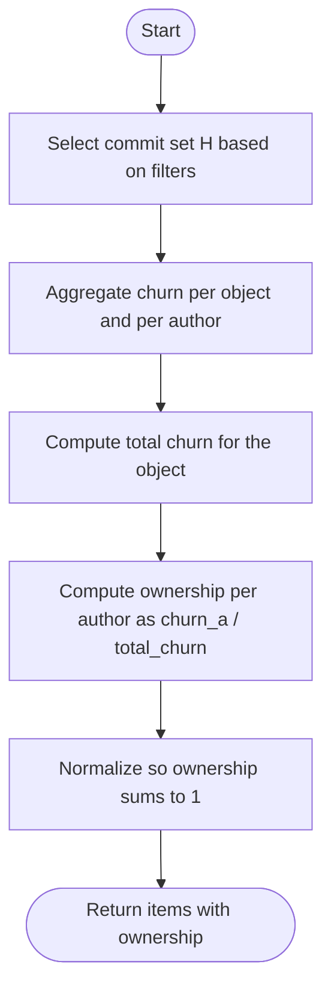
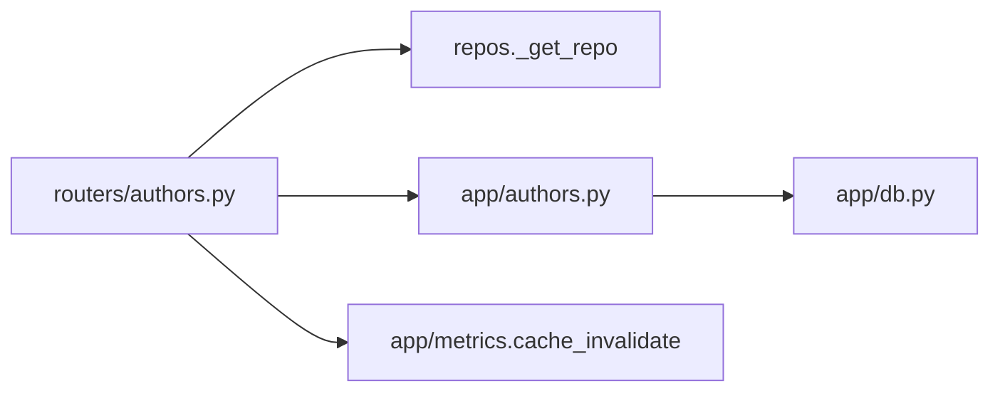

# Author Management API

<cite>
**Referenced Files in This Document**
- [authors.py](file://backend/app/routers/authors.py)
- [authors.py](file://backend/app/authors.py)
- [schemas.py](file://backend/app/schemas.py)
- [db.py](file://backend/app/db.py)
- [main.py](file://backend/app/main.py)
- [metrics.py](file://backend/app/metrics.py)
- [ingest.py](file://backend/app/ingest.py)
- [test_api.py](file://backend/tests/test_api.py)
- [test_metrics.py](file://backend/tests/test_metrics.py)
</cite>

## Table of Contents
1. [Introduction](#introduction)
2. [Project Structure](#project-structure)
3. [Core Components](#core-components)
4. [Architecture Overview](#architecture-overview)
5. [Detailed Component Analysis](#detailed-component-analysis)
6. [Dependency Analysis](#dependency-analysis)
7. [Performance Considerations](#performance-considerations)
8. [Troubleshooting Guide](#troubleshooting-guide)
9. [Conclusion](#conclusion)

## Introduction
This document specifies the author management APIs for the repository analysis tool. It focuses on:
- Listing authors with identity and ownership metrics for a repository.
- Merging multiple author identities into a single logical author.
- Unmerging individual identities or entire merge groups.
- How mailmap processing, commit attribution, and manual merges interact to compute ownership percentages.

The endpoints are implemented as FastAPI routes under `/api/repos/{repo_id}/...`, backed by SQLite tables that store commits, file changes, and manual author merge mappings.

## Project Structure
Author-related functionality is split across:
- Router layer: HTTP route definitions and request validation.
- Domain layer: author listing, merging, unmerging, and query-time identity resolution.
- Schema layer: Pydantic models for requests.
- Storage layer: SQLite schema and connection helpers.
- Metrics layer: shared formulas for churn, modifications, and ownership.
- Ingestion layer: mailmap extraction and commit indexing.

**Diagram sources**
- [main.py:24-27](file://backend/app/main.py#L24-L27)
- [authors.py:12-29](file://backend/app/routers/authors.py#L12-L29)
- [authors.py:28-104](file://backend/app/authors.py#L28-L104)
- [db.py:13-70](file://backend/app/db.py#L13-L70)
- [metrics.py:251-279](file://backend/app/metrics.py#L251-L279)
- [ingest.py:287-326](file://backend/app/ingest.py#L287-L326)

**Section sources**
- [main.py:24-27](file://backend/app/main.py#L24-L27)
- [authors.py:12-29](file://backend/app/routers/authors.py#L12-L29)

## Core Components
- GET /api/repos/{repo_id}/authors
  - Returns a list of author identities, their raw names, commit counts, and the current manual merge groups for the repository.
  - Includes whether the repository has an applied mailmap.
- POST /api/repos/{repo_id}/author-merges
  - Merges one or more lowercased email identities into a single logical author group.
  - Validates input and returns updated author listings including merged groups.
- DELETE /api/repos/{repo_id}/author-merges/{identity}
  - Removes a single identity from any merge group.
- DELETE /api/repos/{repo_id}/author-groups/{group_id}
  - Removes all identities associated with a specific merge group.

These endpoints share the same data model:
- Identity: lowercased email address used as the stable key for an author when not manually merged.
- Group: a named logical author created by merging identities; identified by an integer group id.
- Ownership: computed per object (file/directory/root) as the fraction of total churn attributable to an author within the selected commit set.

**Section sources**
- [authors.py:12-29](file://backend/app/routers/authors.py#L12-L29)
- [authors.py:28-104](file://backend/app/authors.py#L28-L104)
- [schemas.py:27-29](file://backend/app/schemas.py#L27-L29)

## Architecture Overview
The author management flow combines ingestion-time normalization with query-time merging:
- During ingestion, Git log output is parsed with optional `.mailmap` support. Both resolved and raw author fields are stored per commit.
- Manual merges are recorded separately and joined at query time so that lists and metrics reflect merged identities without re-indexing.
- Ownership is calculated using churn totals over the active commit set.

**Diagram sources**
- [authors.py:12-29](file://backend/app/routers/authors.py#L12-L29)
- [authors.py:28-104](file://backend/app/authors.py#L28-L104)
- [metrics.py:251-279](file://backend/app/metrics.py#L251-L279)

## Detailed Component Analysis

### Endpoint: GET /api/repos/{repo_id}/authors
Purpose:
- Retrieve the effective author list for a repository, including:
  - Identity and display name.
  - Raw author names observed in commits.
  - Commit count per identity.
  - Current manual merge groups and their member identities.
  - Whether a mailmap was applied during ingestion.

Response structure:
- have_mailmap: boolean indicating if a repository-level mailmap was detected and applied during ingestion.
- authors: array of author objects.
- groups: array of merge groups with their ids, names, and member identities.

Author object fields:
- identity: lowercased email address used as the base identity key.
- email: original email value stored in commits.
- name: display name, typically mailmap-resolved unless overridden by a merge group.
- commits: number of commits attributed to this identity.
- group_id: integer id of the merge group if the identity belongs to one; null otherwise.
- group_name: name of the merge group if present; null otherwise.
- raw_names: comma-separated list of distinct raw author names seen for this identity.

Notes:
- The endpoint does not compute ownership directly; it provides identity metadata and commit counts. Ownership is computed by the metrics endpoints for a given object scope.

Error handling:
- If the repository does not exist, the route raises a 404 via the shared repository validator.

Example response shape:
- {
    "have_mailmap": true,
    "authors": [
      {
        "identity": "alice@w.com",
        "email": "Alice <alice@w.com>",
        "name": "Alice",
        "commits": 4,
        "group_id": null,
        "group_name": null,
        "raw_names": "Alice,Alicia"
      }
    ],
    "groups": [
      {
        "id": 1,
        "name": "Dev Team",
        "identities": ["bob@w.com", "carol@w.com"]
      }
    ]
  }

**Section sources**
- [authors.py:12-16](file://backend/app/routers/authors.py#L12-L16)
- [authors.py:28-60](file://backend/app/authors.py#L28-L60)
- [db.py:31-45](file://backend/app/db.py#L31-L45)
- [test_api.py:55-57](file://backend/tests/test_api.py#L55-L57)

### Endpoint: POST /api/repos/{repo_id}/author-merges
Purpose:
- Merge one or more lowercased email identities into a single logical author group.
- If any identity already belongs to a merge group, all affected groups are unified into one group carrying the requested name.
- After merging, returns the updated authors listing including groups.

Request schema:
- identities: required array of strings representing lowercased email addresses.
- name: optional string for the resulting group name; defaults to the first identity if empty.

Validation rules:
- Empty or whitespace-only identities are ignored.
- At least one non-empty identity must be supplied; otherwise, a 400 error is returned.
- The name is trimmed; if empty, the first identity is used as the group name.

Behavior:
- Existing merge groups are unified into a single target group.
- New identities are inserted or replaced in the mapping table.
- Orphaned groups with no members are removed.

Response:
- Same structure as GET /api/repos/{repo_id}/authors, reflecting the new merge state.

Conflict resolution patterns:
- Duplicate identities are deduplicated before processing.
- Multiple existing groups are collapsed into one target group.
- The group name is overwritten by the request name when unifying groups.

Cache invalidation:
- After a successful merge, the repository’s metrics cache is invalidated so subsequent metrics queries reflect the new grouping.

Example request:
- {
    "identities": ["bob@w.com", "carol@w.com"],
    "name": "Dev Team"
  }

Example response:
- {
    "have_mailmap": true,
    "authors": [...],
    "groups": [
      {
        "id": 1,
        "name": "Dev Team",
        "identities": ["bob@w.com", "carol@w.com"]
      }
    ]
  }

**Section sources**
- [authors.py:19-29](file://backend/app/routers/authors.py#L19-L29)
- [authors.py:63-104](file://backend/app/authors.py#L63-L104)
- [schemas.py:27-29](file://backend/app/schemas.py#L27-L29)
- [test_api.py:59-66](file://backend/tests/test_api.py#L59-L66)

### Endpoint: DELETE /api/repos/{repo_id}/author-merges/{identity}
Purpose:
- Remove a single identity from any merge group.
- If removal leaves a group empty, the group record is cleaned up.

Behavior:
- The identity is normalized to lowercase and stripped.
- After deletion, orphaned groups are removed.
- The response includes the updated authors listing.

**Section sources**
- [authors.py:32-39](file://backend/app/routers/authors.py#L32-L39)
- [authors.py:112-121](file://backend/app/authors.py#L112-L121)

### Endpoint: DELETE /api/repos/{repo_id}/author-groups/{group_id}
Purpose:
- Remove all identities associated with a specific merge group.
- Deletes the group record after removing its mappings.
- The response includes the updated authors listing.

**Section sources**
- [authors.py:42-49](file://backend/app/routers/authors.py#L42-L49)
- [authors.py:124-130](file://backend/app/authors.py#L124-L130)

### Data Model and Relationships
The author system relies on several database tables:
- repos: repository metadata, including whether a mailmap was applied.
- commits: commit records with both resolved and raw author fields.
- file_changes: per-commit file change statistics used for churn calculations.
- merged_authors: named logical author groups.
- author_merges: mapping from lowercased email identities to a merged author group id.

**Diagram sources**
- [db.py:13-70](file://backend/app/db.py#L13-L70)

**Section sources**
- [db.py:13-70](file://backend/app/db.py#L13-L70)

### Ownership Calculation and Metrics Integration
Ownership is defined per object (file, directory, root) and per author within a selected commit set:
- Churn per commit per object: added lines plus removed lines.
- Modifications per commit per object: indicator of whether churn is positive.
- For a commit set H and object o:
  - Total churn lambda_H,o is the sum of churn across commits in H.
  - Author churn lambda_H,o,a is the sum of churn attributed to author a.
  - Ownership omega_H,o,a = lambda_H,o,a / lambda_H,o when lambda_H,o > 0; otherwise 0.

The metrics layer computes these values and normalizes them so that ownership fractions sum to 1 across authors contributing churn.

**Diagram sources**
- [metrics.py:1-28](file://backend/app/metrics.py#L1-L28)
- [metrics.py:251-279](file://backend/app/metrics.py#L251-L279)

**Section sources**
- [metrics.py:1-28](file://backend/app/metrics.py#L1-L28)
- [metrics.py:251-279](file://backend/app/metrics.py#L251-L279)
- [test_metrics.py:212-233](file://backend/tests/test_metrics.py#L212-L233)

### Mailmap Processing Integration
During ingestion:
- The system probes for a `.mailmap` file in the repository reference.
- If found, Git is invoked with `mailmap.file` configured so that author fields are normalized according to the mailmap.
- Both resolved and raw author fields are persisted per commit.
- The repository’s `have_mailmap` flag is set to indicate that normalization occurred.

Impact on author management:
- The GET authors endpoint reflects mailmap-resolved identities.
- Manual merges operate on top of mailmap-resolved identities, allowing further consolidation.

**Section sources**
- [ingest.py:141-157](file://backend/app/ingest.py#L141-L157)
- [ingest.py:287-326](file://backend/app/ingest.py#L287-L326)
- [db.py:13-29](file://backend/app/db.py#L13-L29)
- [test_metrics.py:43-47](file://backend/tests/test_metrics.py#L43-L47)

### Example Workflows

#### List Authors
- Call GET /api/repos/{repo_id}/authors.
- Inspect `have_mailmap` to determine whether author names/emails were normalized.
- Use `authors[].identity` and `authors[].group_id` to understand current grouping.

#### Merge Two Identities Into One Group
- Call POST /api/repos/{repo_id}/author-merges with identities and a desired group name.
- Verify the response contains a group with the specified name and member identities.
- Query metrics endpoints to confirm combined churn and ownership.

#### Bulk Author Management
- Identify identities to merge by scanning the authors list.
- Batch merge operations where appropriate, ensuring each request consolidates related identities.
- After merges, invalidate caches implicitly by calling the merge endpoint; then refresh metrics views.

#### Unmerge Operations
- To remove a single identity, call DELETE /api/repos/{repo_id}/author-merges/{identity}.
- To remove an entire group, call DELETE /api/repos/{repo_id}/author-groups/{group_id}.
- Confirm the group disappears from the authors listing and metrics no longer attribute churn to the group.

**Section sources**
- [test_api.py:55-71](file://backend/tests/test_api.py#L55-L71)
- [test_metrics.py:236-253](file://backend/tests/test_metrics.py#L236-L253)

## Dependency Analysis
The author management endpoints depend on:
- Repository existence validation through the shared repos router helper.
- Database connections managed by the SQLite layer.
- Metrics cache invalidation to ensure consistency after merges.

**Diagram sources**
- [authors.py:12-29](file://backend/app/routers/authors.py#L12-L29)
- [authors.py:28-104](file://backend/app/authors.py#L28-L104)
- [db.py:74-81](file://backend/app/db.py#L74-L81)

**Section sources**
- [authors.py:12-29](file://backend/app/routers/authors.py#L12-L29)
- [authors.py:28-104](file://backend/app/authors.py#L28-L104)
- [db.py:74-81](file://backend/app/db.py#L74-L81)

## Performance Considerations
- Query-time merging avoids re-indexing repositories when identities are merged or unmerged.
- SQLite indexes on commit timestamps and author emails improve filtering and aggregation performance.
- Cache invalidation after mutations ensures metrics remain consistent without full recomputation.

[No sources needed since this section provides general guidance]

## Troubleshooting Guide
Common issues and resolutions:
- 400 Bad Request on merge:
  - Cause: No valid identities provided or malformed request body.
  - Resolution: Ensure identities is a non-empty array of strings and name is trimmed appropriately.
- Missing merged group in metrics:
  - Cause: Metrics cache not invalidated after merge.
  - Resolution: Rely on the merge endpoint’s automatic cache invalidation; then re-query metrics.
- Unexpected identity casing:
  - Cause: Identities must be lowercased.
  - Resolution: Normalize identities to lowercase before sending requests.
- Mailmap not applied:
  - Cause: No `.mailmap` file present or ingestion did not detect it.
  - Resolution: Check `have_mailmap` in the authors response and verify ingestion logs.

**Section sources**
- [authors.py:19-29](file://backend/app/routers/authors.py#L19-L29)
- [authors.py:63-104](file://backend/app/authors.py#L63-L104)
- [test_api.py:90-92](file://backend/tests/test_api.py#L90-L92)

## Conclusion
The author management API provides robust tools for listing authors, merging identities, and computing ownership metrics. By combining ingestion-time mailmap normalization with query-time manual merges, the system maintains accurate attribution without costly re-indexing. Clients should use lowercased identities, leverage group names for logical authorship, and rely on the metrics endpoints for precise ownership calculations.

[No sources needed since this section summarizes without analyzing specific files]