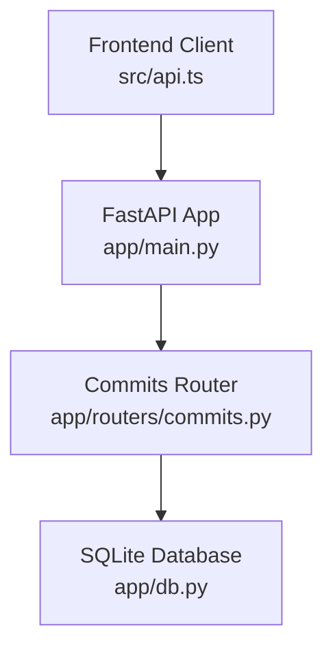
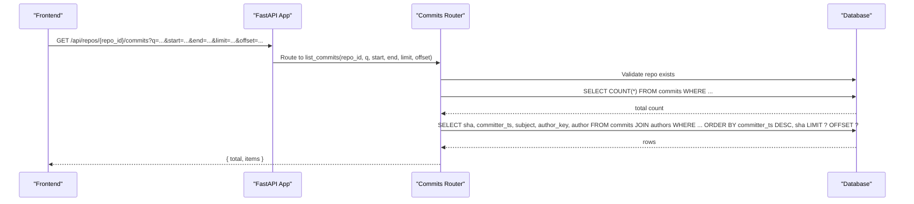
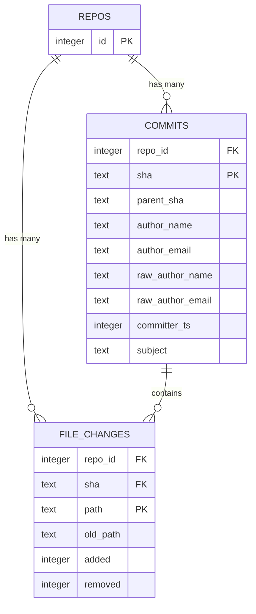
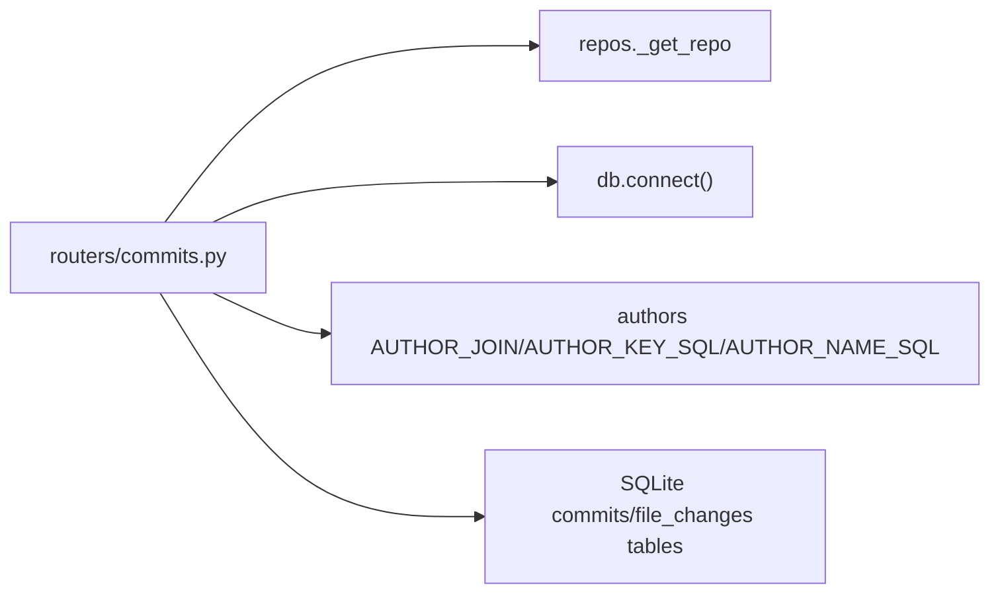

# Commit Search API

<cite>
**Referenced Files in This Document**
- [commits.py](file://backend/app/routers/commits.py)
- [main.py](file://backend/app/main.py)
- [db.py](file://backend/app/db.py)
- [test_api.py](file://backend/tests/test_api.py)
- [api.ts](file://frontend/src/api.ts)
</cite>

## Table of Contents
1. [Introduction](#introduction)
2. [Project Structure](#project-structure)
3. [Core Components](#core-components)
4. [Architecture Overview](#architecture-overview)
5. [Detailed Component Analysis](#detailed-component-analysis)
6. [Dependency Analysis](#dependency-analysis)
7. [Performance Considerations](#performance-considerations)
8. [Troubleshooting Guide](#troubleshooting-guide)
9. [Conclusion](#conclusion)

## Introduction
This document describes the commit search and path discovery endpoints used by the dashboard filters:
- GET /api/repos/{repo_id}/commits: search commits by message patterns, date ranges, and author fields with pagination.
- GET /api/repos/{repo_id}/paths: discover files and directories for the path picker.

The documentation covers query parameters, response shapes, filtering behavior, timestamp handling, and performance best practices for large repositories.

## Project Structure
The commit search endpoint is implemented in the backend FastAPI application and registered at application startup. The frontend includes a typed client that calls these endpoints.

**Diagram sources**
- [main.py:24-27](file://backend/app/main.py#L24-L27)
- [commits.py:10-13](file://backend/app/routers/commits.py#L10-L13)
- [db.py:31-45](file://backend/app/db.py#L31-L45)

**Section sources**
- [main.py:13-27](file://backend/app/main.py#L13-L27)
- [commits.py:1-13](file://backend/app/routers/commits.py#L1-L13)

## Core Components
- Commits router defines:
  - GET /api/repos/{repo_id}/commits
  - GET /api/repos/{repo_id}/paths
- Database schema defines the commits table and indexes used by the search queries.
- Frontend client provides getCommits and getPaths helpers.

Key responsibilities:
- Commits router: parameter parsing, SQL construction, pagination, result mapping.
- Database layer: persistence of commits, file changes, and indexes for efficient querying.
- Frontend client: URL building and typed responses.

**Section sources**
- [commits.py:13-60](file://backend/app/routers/commits.py#L13-L60)
- [commits.py:63-102](file://backend/app/routers/commits.py#L63-L102)
- [db.py:31-45](file://backend/app/db.py#L31-L45)
- [api.ts:87-105](file://frontend/src/api.ts#L87-L105)

## Architecture Overview
The commit search flow validates repository access, builds filtered SQL based on query parameters, counts matching rows, retrieves paginated results, and returns a standardized envelope.

**Diagram sources**
- [commits.py:13-60](file://backend/app/routers/commits.py#L13-L60)
- [main.py:24-27](file://backend/app/main.py#L24-L27)

## Detailed Component Analysis

### Endpoint: GET /api/repos/{repo_id}/commits
Searches commits within a repository using text search across multiple fields and optional date range filters. Supports pagination via limit and offset.

#### Path and Method
- Method: GET
- Path: /api/repos/{repo_id}/commits

#### Path Parameters
- repo_id (integer): Repository identifier. Must exist; otherwise, the request fails during repository validation.

#### Query Parameters
- q (string, default ""): Free-text search term. Matches against commit SHA prefix, subject, author name, and author email. Matching uses substring logic.
- start (integer, optional): Inclusive lower bound for committer timestamp (UNIX seconds).
- end (integer, optional): Exclusive upper bound for committer timestamp (UNIX seconds).
- limit (integer, default 100, range 1–500): Maximum number of items per page.
- offset (integer, default 0, minimum 0): Number of items to skip before returning results.

#### Filtering Behavior
- Text search:
  - If q is provided, the server searches:
    - SHA prefix match
    - Subject substring match
    - Author name substring match
    - Author email substring match
- Date range:
  - start: inclusive lower bound on committer_ts
  - end: exclusive upper bound on committer_ts
- Ordering:
  - Results are ordered by committer_ts descending, then by sha ascending.

#### Response Schema
- Object:
  - total (integer): Total number of commits matching the filter criteria.
  - items (array of commit objects): Paginated subset of matching commits.

- Commit object fields:
  - sha (string): Full commit SHA.
  - short (string): First 10 characters of sha.
  - committer_ts (integer): UNIX timestamp (seconds) when the commit was committed.
  - author (string): Display author name (mailmap-resolved).
  - author_key (string): Author identity key used for grouping and metrics.
  - subject (string): Commit subject line.

#### Example Requests
- Search by subject containing “c2”:
  - GET /api/repos/1/commits?q=c2
- Search by date range (inclusive start, exclusive end):
  - GET /api/repos/1/commits?start=1700000000&end=1700086400
- Pagination:
  - GET /api/repos/1/commits?limit=50&offset=100

#### Example Responses
- Basic success:
  - { "total": 12, "items": [ { "sha": "...", "short": "...", "committer_ts": 1700000000, "author": "...", "author_key": "...", "subject": "..." }, ... ] }
- Empty results:
  - { "total": 0, "items": [] }

#### Validation and Errors
- Invalid or missing repo_id:
  - Repository validation occurs before querying; if the repository does not exist, the request fails.
- Parameter constraints:
  - limit must be between 1 and 500.
  - offset must be non-negative.
  - start and end are converted to integers; invalid values may cause conversion errors.

**Section sources**
- [commits.py:13-60](file://backend/app/routers/commits.py#L13-L60)
- [test_api.py:73-79](file://backend/tests/test_api.py#L73-L79)

### Endpoint: GET /api/repos/{repo_id}/paths
Discovers files and directories for the path picker UI. Returns both derived directory entries and actual file entries.

#### Path and Method
- Method: GET
- Path: /api/repos/{repo_id}/paths

#### Path Parameters
- repo_id (integer): Repository identifier. Must exist; otherwise, the request fails during repository validation.

#### Query Parameters
- q (string, default ""): Substring filter applied to paths. Case-insensitive matching.
- limit (integer, default 50, range 1–500): Maximum number of items returned.

#### Behavior
- Retrieves all distinct file paths from file_changes for the repository.
- Derives directory paths by splitting file paths on “/”.
- If q is empty:
  - Returns up to limit directories followed by up to limit files.
- If q is present:
  - Filters directories and files whose lowercase path contains q.
  - Returns up to limit directories and up to limit files.
- Each item includes:
  - path (string): File or directory path.
  - type (string): Either "dir" or "file".
  - label (string): Human-readable label; directories include a trailing slash.

#### Example Requests
- List top-level directories and files:
  - GET /api/repos/1/paths?limit=50
- Filter by substring:
  - GET /api/repos/1/paths?q=x.py&limit=100

#### Example Responses
- { "items": [ { "path": "", "type": "dir", "label": "/ (repository root)" }, { "path": "src", "type": "dir", "label": "src/" }, { "path": "src/x.py", "type": "file", "label": "src/x.py" }, ... ] }

**Section sources**
- [commits.py:63-102](file://backend/app/routers/commits.py#L63-L102)
- [test_api.py:78-79](file://backend/tests/test_api.py#L78-L79)

### Data Model: Commits Table and Indexes
The commits table stores commit metadata and relationships to authors. Indexes support efficient time-range and author-based queries.

- Primary keys and columns:
  - repo_id (integer): Foreign key to repos(id).
  - sha (text): Unique commit identifier.
  - parent_sha (text, nullable): First parent commit SHA.
  - author_name (text): Mailmap-resolved author name.
  - author_email (text): Mailmap-resolved author email.
  - raw_author_name (text): Raw author name.
  - raw_author_email (text): Raw author email.
  - committer_ts (integer): UNIX timestamp (seconds).
  - subject (text): Commit subject.
- Indexes:
  - idx_commits_ts: Optimizes time-range queries on (repo_id, committer_ts).
  - idx_commits_email: Optimizes author email lookups.

**Diagram sources**
- [db.py:31-55](file://backend/app/db.py#L31-L55)

**Section sources**
- [db.py:31-55](file://backend/app/db.py#L31-L55)

### Frontend Integration
The frontend client exposes typed methods for calling the commit search and path discovery endpoints. It constructs query strings and handles JSON responses.

- getCommits(repoId, options):
  - Options: q, start, end, limit, offset.
  - Builds URLSearchParams and calls GET /api/repos/{repoId}/commits.
- getPaths(repoId, q, limit):
  - Calls GET /api/repos/{repoId}/paths with q and limit.

**Section sources**
- [api.ts:87-105](file://frontend/src/api.ts#L87-L105)

## Dependency Analysis
The commit search endpoint depends on:
- FastAPI routing and query parameter validation.
- Repository existence check via _get_repo.
- SQLite database operations through db.connect().
- Author join and key/name SQL fragments imported from authors module.

**Diagram sources**
- [commits.py:6-8](file://backend/app/routers/commits.py#L6-L8)
- [commits.py:36-49](file://backend/app/routers/commits.py#L36-L49)
- [db.py:31-55](file://backend/app/db.py#L31-L55)

**Section sources**
- [commits.py:6-8](file://backend/app/routers/commits.py#L6-L8)
- [commits.py:36-49](file://backend/app/routers/commits.py#L36-L49)

## Performance Considerations
- Use index-friendly filters:
  - Prefer narrow date ranges using start and end to leverage idx_commits_ts.
  - Avoid overly broad q terms; they trigger substring scans across multiple fields.
- Page results efficiently:
  - Keep limit reasonable (e.g., 50–100) and use offset to paginate.
  - For very large offsets, consider cursor-style pagination based on last seen committer_ts and sha.
- Minimize payload size:
  - Only fetch necessary fields; the current implementation returns a fixed set of fields.
- Cache frequently accessed data:
  - Cache popular q filters and recent pages at the application level if appropriate.
- Monitor slow queries:
  - Profile COUNT(*) and SELECT queries under load; adjust indexes if needed.

[No sources needed since this section provides general guidance]

## Troubleshooting Guide
- No results returned:
  - Verify q spelling and case-insensitivity behavior.
  - Check date range boundaries; ensure start is less than end and timestamps are correct UNIX seconds.
- Unexpected ordering:
  - Results are ordered by committer_ts descending, then sha ascending.
- Pagination anomalies:
  - Ensure offset is non-negative and limit is within 1–500.
  - For stable pagination across updates, track last committer_ts and sha.
- Repository not found:
  - Confirm repo_id exists; repository validation occurs before querying.

**Section sources**
- [commits.py:13-60](file://backend/app/routers/commits.py#L13-L60)
- [test_api.py:73-79](file://backend/tests/test_api.py#L73-L79)

## Conclusion
The commit search API provides flexible filtering by text patterns and date ranges, with robust pagination and consistent response envelopes. The path discovery endpoint supports efficient file and directory selection. By applying index-friendly filters and sensible pagination strategies, clients can perform efficient queries even on large repositories.

[No sources needed since this section summarizes without analyzing specific files]