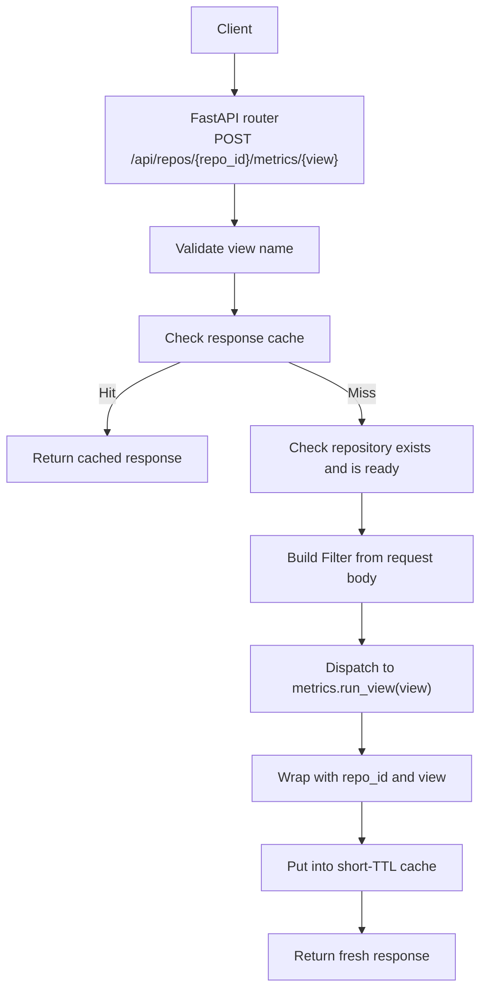
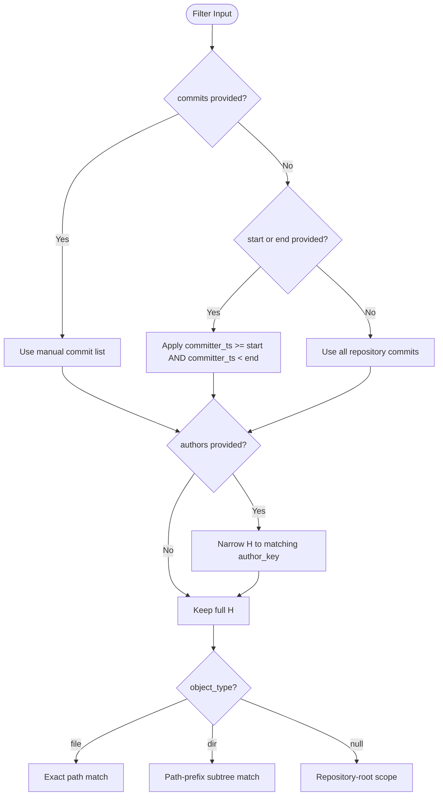
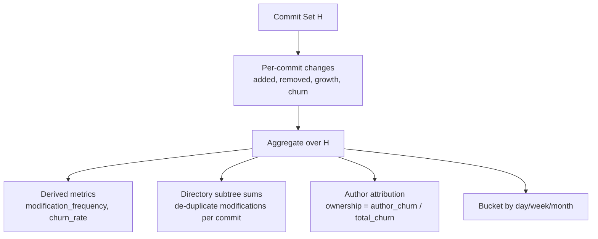
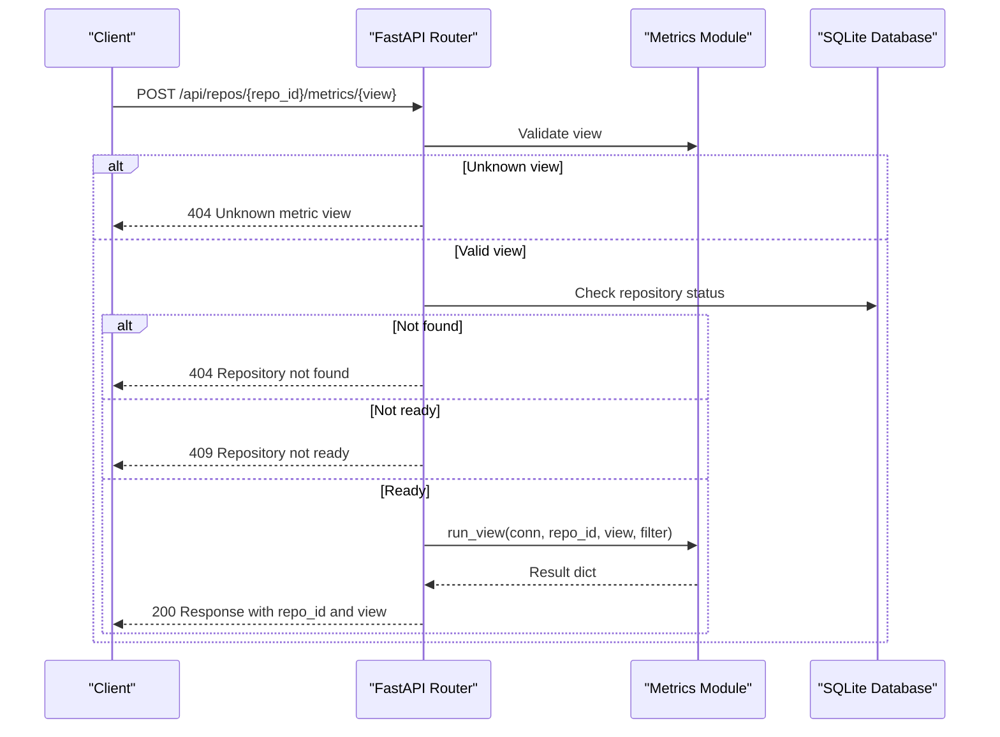
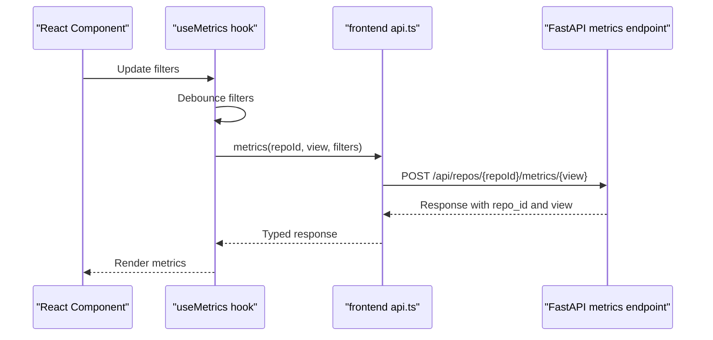

# Metrics Query API

<cite>
**Referenced Files in This Document**
- [metrics.py](file://backend/app/routers/metrics.py)
- [metrics_core.py](file://backend/app/metrics.py)
- [schemas.py](file://backend/app/schemas.py)
- [README.md](file://README.md)
- [test_metrics.py](file://backend/tests/test_metrics.py)
- [api.ts](file://frontend/src/api.ts)
- [hooks.ts](file://frontend/src/lib/hooks.ts)
</cite>

## Table of Contents
1. [Introduction](#introduction)
2. [Endpoint Summary](#endpoint-summary)
3. [Request Model](#request-model)
4. [Filter Semantics](#filter-semantics)
5. [Supported Views and Response Formats](#supported-views-and-response-formats)
6. [Metric Definitions and Aggregation Rules](#metric-definitions-and-aggregation-rules)
7. [Usage Examples](#usage-examples)
8. [Error Handling](#error-handling)
9. [Performance, Caching, and Rate Limiting](#performance-caching-and-rate-limiting)
10. [Frontend Integration Notes](#frontend-integration-notes)
11. [Troubleshooting Guide](#troubleshooting-guide)
12. [Conclusion](#conclusion)

## Introduction
This document describes the metrics query API used by the Repo Analysis Tool to compute repository-level, file-level, directory-level, author-level, time-series, and commit-set metrics. The core design is a single FastAPI endpoint that dispatches to view-specific aggregation logic based on a `view` path parameter and a shared filter body.

The implementation:
- Validates the requested view.
- Checks repository existence and readiness.
- Applies filters for time range, manual commits, authors, path scoping, granularity, pagination, and change-only filtering.
- Executes SQL-based aggregations over an indexed SQLite database.
- Wraps results with `repo_id` and `view`.
- Caches repeated queries for a short TTL.

**Section sources**
- [metrics.py:13-40](file://backend/app/routers/metrics.py#L13-L40)
- [README.md:111-142](file://README.md#L111-L142)

## Endpoint Summary
The metrics endpoint is:

| Method | Path | Purpose |
|---|---|---|
| POST | `/api/repos/{repo_id}/metrics/{view}` | Compute metrics for one of the supported views using a shared filter body. |

Supported views:
- `summary`: aggregate metrics for the selected object or repository root.
- `files`: per-file metrics under the selected scope.
- `dirs`: per-directory subtree metrics.
- `authors`: per-author modification and ownership metrics.
- `timeseries`: time-bucketed added/removed/growth/churn/commits/modifications.
- `commits`: paged commit-set rows with optional object-scoped change filtering.

Note: Although the documentation objective mentions GET, the implemented endpoint uses POST for the metrics query.



**Diagram sources**
- [metrics.py:13-40](file://backend/app/routers/metrics.py#L13-L40)
- [metrics_core.py:389-400](file://backend/app/metrics.py#L389-L400)
- [metrics_core.py:407-435](file://backend/app/metrics.py#L407-L435)

**Section sources**
- [metrics.py:13-40](file://backend/app/routers/metrics.py#L13-L40)
- [README.md:111-142](file://README.md#L111-L142)

## Request Model
All metric views share the same request model.

### Fields

| Field | Type | Default | Description |
|---|---|---:|---|
| `start` | integer or null | null | Inclusive UNIX timestamp for H membership. |
| `end` | integer or null | null | Exclusive UNIX timestamp for H membership. |
| `commits` | array of strings | empty list | Manual commit selection; overrides time range when present. |
| `authors` | array of strings | empty list | Author keys such as `i:<email>` or `m:<group id>`. |
| `path` | string or null | null | Object path for file or directory scoping. |
| `object_type` | `"file"` \| `"dir"` \| null | null | Whether `path` refers to a file or directory. |
| `granularity` | `"day"` \| `"week"` \| `"month"` | `"month"` | Time bucketing for `timeseries`. |
| `limit` | integer | 500 | Maximum number of items returned by list-style views. |
| `offset` | integer | 0 | Pagination offset for list-style views. |
| `only_changed` | boolean | false | For `commits`, return only commits touching the selected object. |

### Validation Behavior
- `granularity` defaults to `"month"` if not provided.
- `limit` is clamped between 1 and 20,000 for most views and between 1 and 1,000 for the commits view.
- `offset` must be non-negative.
- Unknown view names are rejected before database access.

**Section sources**
- [schemas.py:14-24](file://backend/app/schemas.py#L14-L24)
- [metrics_core.py:43-54](file://backend/app/metrics.py#L43-L54)
- [metrics_core.py:163-164](file://backend/app/metrics.py#L163-L164)
- [metrics_core.py:343-344](file://backend/app/metrics.py#L343-L344)

## Filter Semantics
The filter defines the commit set **H**, the object scope, and the aggregation behavior.

### Commit Set H
- If `commits` is provided, H is exactly the selected commit SHAs.
- Otherwise, H includes commits where `committer_ts >= start` and `committer_ts < end`.
- If both `commits` and `start`/`end` are provided, `commits` takes precedence.
- Author filtering narrows H to commits attributed to the specified merged author keys.

### Object Scope
- `path` selects a file or directory subtree.
- `object_type = "file"` restricts to exact path equality.
- `object_type = "dir"` restricts to files under the directory prefix.
- When no `path` is set, many views operate at repository-root level.

### Time-Based Buckets
- `granularity` controls how timestamps are grouped for `timeseries`.
- Supported buckets: day, week, month.
- Bucket boundaries use UTC committer timestamps.

### Pagination and Change Filtering
- `limit` and `offset` apply to `files`, `dirs`, and `commits`.
- `only_changed` applies to `commits` and filters to commits that touch the selected object.



**Diagram sources**
- [metrics_core.py:43-64](file://backend/app/metrics.py#L43-L64)
- [metrics_core.py:76-109](file://backend/app/metrics.py#L76-L109)

**Section sources**
- [metrics_core.py:43-64](file://backend/app/metrics.py#L43-L64)
- [metrics_core.py:76-109](file://backend/app/metrics.py#L76-L109)

## Supported Views and Response Formats

### Common Response Wrapper
Every response includes:
- `repo_id`: integer repository identifier.
- `view`: string view name.
- View-specific fields described below.

### `summary`
Aggregates metrics for the selected object or repository root.

| Field | Type | Description |
|---|---|---|
| `added` | integer | Total added lines. |
| `removed` | integer | Total removed lines. |
| `growth` | integer | `added - removed`. |
| `churn` | integer | `added + removed`. |
| `modifications` | integer | Distinct commits with any change. |
| `commit_count` | integer | Size of H. |
| `modification_frequency` | float | `modifications / commit_count`, zero when `commit_count` is zero. |
| `churn_rate` | float | `churn / commit_count`, zero when `commit_count` is zero. |
| `object.path` | string | Selected path or empty string for root. |
| `object.type` | string | `"file"`, `"dir"`, or `"root"`. |

**Section sources**
- [metrics_core.py:135-155](file://backend/app/metrics.py#L135-L155)

### `files`
Per-file metrics under the selected scope, sorted by churn descending then path.

| Field | Type | Description |
|---|---|---|
| `commit_count` | integer | Size of H. |
| `items` | array | File entries. |
| `items[].path` | string | File path. |
| `items[].added` | integer | Added lines. |
| `items[].removed` | integer | Removed lines. |
| `items[].growth` | integer | `added - removed`. |
| `items[].churn` | integer | `added + removed`. |
| `items[].modifications` | integer | Distinct commits changing this file. |
| `items[].modification_frequency` | float | Per-file frequency over `commit_count`. |
| `items[].churn_rate` | float | Per-file churn rate over `commit_count`. |

**Section sources**
- [metrics_core.py:158-183](file://backend/app/metrics.py#L158-L183)

### `dirs`
Per-directory subtree metrics with de-duplicated modifications per commit.

| Field | Type | Description |
|---|---|---|
| `commit_count` | integer | Size of H. |
| `items` | array | Directory entries. |
| `items[].path` | string | Directory path; empty string represents root. |
| `items[].depth` | integer | Depth derived from slash count. |
| `items[].added` | integer | Subtree added lines. |
| `items[].removed` | integer | Subtree removed lines. |
| `items[].growth` | integer | `added - removed`. |
| `items[].churn` | integer | `added + removed`. |
| `items[].modifications` | integer | Distinct commits touching any file in the subtree. |
| `items[].modification_frequency` | float | Per-directory frequency over `commit_count`. |
| `items[].churn_rate` | float | Per-directory churn rate over `commit_count`. |

Directory modification counting ensures that a commit touching multiple files in the same directory counts once for that directory.

**Section sources**
- [metrics_core.py:186-248](file://backend/app/metrics.py#L186-L248)

### `authors`
Per-author metrics including ownership.

| Field | Type | Description |
|---|---|---|
| `commit_count` | integer | Size of H. |
| `churn_total` | integer | Total churn across all authors. |
| `items` | array | Author entries. |
| `items[].author_key` | string | Merged author key. |
| `items[].author` | string | Display name. |
| `items[].commits` | integer | Distinct commits attributed to the author. |
| `items[].modifications` | integer | Distinct commits changing the selected object. |
| `items[].churn` | integer | Total churn attributed to the author. |
| `items[].ownership` | float | `author_churn / churn_total`, zero when total churn is zero. |

**Section sources**
- [metrics_core.py:251-279](file://backend/app/metrics.py#L251-L279)

### `timeseries`
Time-bucketed metrics.

| Field | Type | Description |
|---|---|---|
| `commit_count` | integer | Size of H. |
| `granularity` | string | Bucket granularity used. |
| `items` | array | Time buckets. |
| `items[].bucket` | string | Human-readable bucket value. |
| `items[].bucket_ts` | integer | Unix timestamp for the bucket start. |
| `items[].added` | integer | Added lines in bucket. |
| `items[].removed` | integer | Removed lines in bucket. |
| `items[].growth` | integer | `added - removed`. |
| `items[].churn` | integer | `added + removed`. |
| `items[].commits` | integer | Distinct commits in bucket. |
| `items[].modifications` | integer | Distinct changed commits in bucket. |

**Section sources**
- [metrics_core.py:282-329](file://backend/app/metrics.py#L282-L329)

### `commits`
Paged commit-set rows with optional object-scoped change filtering.

| Field | Type | Description |
|---|---|---|
| `commit_count` | integer | Size of H. |
| `total` | integer | Number of commits matching the view filters. |
| `items` | array | Commit entries. |
| `items[].sha` | string | Full commit SHA. |
| `items[].short` | string | First 10 characters of SHA. |
| `items[].committer_ts` | integer | Committer timestamp. |
| `items[].author` | string | Author name. |
| `items[].author_key` | string | Merged author key. |
| `items[].subject` | string | Commit subject. |
| `items[].added` | integer | Added lines for the selected object scope. |
| `items[].removed` | integer | Removed lines for the selected object scope. |
| `items[].churn` | integer | `added + removed`. |

When `only_changed` is true, only commits touching the selected object are included in the result set and total count.

**Section sources**
- [metrics_core.py:332-386](file://backend/app/metrics.py#L332-L386)

## Metric Definitions and Aggregation Rules

### Core Quantities
- `added`: `l⁺`, lines added.
- `removed`: `l⁻`, lines removed.
- `growth`: `δ = l⁺ − l⁻`.
- `churn`: `λ = l⁺ + l⁻`.
- `modifications`: number of distinct commits where `λ > 0`.

### Commit Set Metrics
For a commit set **H**:
- Aggregate `added`, `removed`, `growth`, `churn` over all commits in H.
- `modification_frequency = modifications / |H|`, zero when `|H| = 0`.
- `churn_rate = churn / |H|`, zero when `|H| = 0`.

### Directory Aggregation
Directory metrics are computed as recursive sums over files in the subtree. Modifications are de-duplicated per commit so that a commit touching multiple files in the same directory counts once for that directory.

### Authorship
Author attribution uses merged identities:
- `I(a,h)` indicates whether commit `h` is attributed to author `a`.
- Author modifications and churn are summed over H.
- Ownership is `author_churn / total_churn`, zero when total churn is zero.



**Diagram sources**
- [metrics_core.py:1-28](file://backend/app/metrics.py#L1-L28)
- [metrics_core.py:117-128](file://backend/app/metrics.py#L117-L128)
- [metrics_core.py:186-248](file://backend/app/metrics.py#L186-L248)
- [metrics_core.py:251-279](file://backend/app/metrics.py#L251-L279)
- [metrics_core.py:291-329](file://backend/app/metrics.py#L291-L329)

**Section sources**
- [metrics_core.py:1-28](file://backend/app/metrics.py#L1-L28)
- [metrics_core.py:117-128](file://backend/app/metrics.py#L117-L128)
- [metrics_core.py:186-248](file://backend/app/metrics.py#L186-L248)
- [metrics_core.py:251-279](file://backend/app/metrics.py#L251-L279)
- [metrics_core.py:291-329](file://backend/app/metrics.py#L291-L329)

## Usage Examples

### Basic Repository Summary
Compute repository-wide summary metrics without filters.

- Method: `POST`
- Path: `/api/repos/{repo_id}/metrics/summary`
- Body: `{}`

Expected highlights:
- `commit_count` equals the size of H.
- `modification_frequency` and `churn_rate` are derived from `commit_count`.

**Section sources**
- [metrics_core.py:135-155](file://backend/app/metrics.py#L135-L155)
- [test_metrics.py:81-91](file://backend/tests/test_metrics.py#L81-L91)

### Time-Ranged Query
Query commits from an inclusive start timestamp up to an exclusive end timestamp.

- Method: `POST`
- Path: `/api/repos/{repo_id}/metrics/summary`
- Body:
  ```json
  {
    "start": 1700000000,
    "end": 1700000010
  }
  ```

Behavior:
- H includes commits with `committer_ts >= start` and `committer_ts < end`.
- Boundary tests confirm inclusive start and exclusive end semantics.

**Section sources**
- [metrics_core.py:83-88](file://backend/app/metrics.py#L83-L88)
- [test_metrics.py:109-126](file://backend/tests/test_metrics.py#L109-L126)

### Manual Commit Selection
Select specific commits regardless of time range.

- Method: `POST`
- Path: `/api/repos/{repo_id}/metrics/summary`
- Body:
  ```json
  {
    "commits": ["<sha_1>", "<sha_2>"]
  }
  ```

Behavior:
- Manual commit list overrides time range.
- `commit_count` reflects the selected commit set.

**Section sources**
- [metrics_core.py:67-73](file://backend/app/metrics.py#L67-L73)
- [metrics_core.py:76-88](file://backend/app/metrics.py#L76-L88)
- [test_metrics.py:128-134](file://backend/tests/test_metrics.py#L128-L134)

### Author-Specific Analysis
Filter by author identity or merged group.

- Method: `POST`
- Path: `/api/repos/{repo_id}/metrics/authors`
- Body:
  ```json
  {
    "authors": ["i:bob@w.com", "m:3"]
  }
  ```

Behavior:
- `authors` accepts email-based keys and merged-group keys.
- Ownership is calculated relative to the filtered H.

**Section sources**
- [schemas.py:18](file://backend/app/schemas.py#L18)
- [metrics_core.py:103-108](file://backend/app/metrics.py#L103-L108)
- [metrics_core.py:251-279](file://backend/app/metrics.py#L251-L279)
- [test_metrics.py:147-153](file://backend/tests/test_metrics.py#L147-L153)

### Directory-Level Aggregation
Compute directory subtree metrics.

- Method: `POST`
- Path: `/api/repos/{repo_id}/metrics/dirs`
- Body:
  ```json
  {
    "path": "src",
    "object_type": "dir"
  }
  ```

Behavior:
- Results include directories under the selected scope.
- Modifications are de-duplicated per commit within each directory.

**Section sources**
- [metrics_core.py:186-248](file://backend/app/metrics.py#L186-L248)
- [test_metrics.py:181-206](file://backend/tests/test_metrics.py#L181-L206)

### Time-Series with Granularity
Get daily, weekly, or monthly time buckets.

- Method: `POST`
- Path: `/api/repos/{repo_id}/metrics/timeseries`
- Body:
  ```json
  {
    "granularity": "day"
  }
  ```

Behavior:
- Unsupported granularities fall back to `"month"`.
- Each item contains bucket label, bucket timestamp, and aggregated metrics.

**Section sources**
- [metrics_core.py:282-329](file://backend/app/metrics.py#L282-L329)
- [test_metrics.py:289-296](file://backend/tests/test_metrics.py#L289-L296)

### Paged Commit Set with Change Filtering
List commits with pagination and optional change-only filtering.

- Method: `POST`
- Path: `/api/repos/{repo_id}/metrics/commits`
- Body:
  ```json
  {
    "path": "src/x.py",
    "object_type": "file",
    "only_changed": true,
    "limit": 50,
    "offset": 0
  }
  ```

Behavior:
- `only_changed` filters to commits touching the selected object.
- `total` reflects the filtered count.
- Items are ordered by newest first.

**Section sources**
- [metrics_core.py:332-386](file://backend/app/metrics.py#L332-L386)
- [test_metrics.py:298-309](file://backend/tests/test_metrics.py#L298-L309)

### Complex Filter Combination
Combine time range, author filter, directory scope, and timeseries granularity.

- Method: `POST`
- Path: `/api/repos/{repo_id}/metrics/timeseries`
- Body:
  ```json
  {
    "start": 1700000000,
    "end": 1700000100,
    "authors": ["i:bob@w.com"],
    "path": "src",
    "object_type": "dir",
    "granularity": "week"
  }
  ```

Behavior:
- H is narrowed by time range and author.
- Aggregation is scoped to the `src` directory subtree.
- Results are bucketed by week.

**Section sources**
- [metrics_core.py:76-109](file://backend/app/metrics.py#L76-L109)
- [metrics_core.py:282-329](file://backend/app/metrics.py#L282-L329)

## Error Handling

| Condition | Status Code | Behavior |
|---|---:|---|
| Unknown view | 404 | Rejects unsupported view names before querying the database. |
| Repository not found | 404 | Returns error when the repository ID does not exist. |
| Repository not ready | 409 | Returns error when repository status is not `"ready"`. |
| Invalid request payload | 422 | Pydantic validation rejects invalid field types or values. |



**Diagram sources**
- [metrics.py:13-40](file://backend/app/routers/metrics.py#L13-L40)

**Section sources**
- [metrics.py:13-40](file://backend/app/routers/metrics.py#L13-L40)

## Performance, Caching, and Rate Limiting

### Performance Characteristics
- Metrics are computed as SQL aggregations over indexed tables.
- Directory metrics use an ordered scan with per-commit modification de-duplication.
- Path scoping uses index-friendly range conditions.
- Measured query latencies stay well under 500 ms for typical repositories.

### Caching Behavior
- Responses are cached in memory keyed by `(repo_id, view, serialized_filter_body)`.
- Cache TTL is 30 seconds.
- Cache capacity is limited; when exceeded, the cache is cleared.
- Cache can be invalidated globally or per repository after author merges.

### Rate Limiting
- No built-in rate limiting is implemented in the metrics endpoint.
- Heavy metric computations should be throttled at the deployment layer, for example through reverse proxy limits, API gateway policies, or application-level rate limiters.

### Optimization Recommendations
- Prefer time-range filters to reduce H size.
- Use `commits` for small, precise selections.
- Use `path` and `object_type` to scope queries.
- Use `granularity` appropriately; finer granularity increases bucket count.
- Debounce client-side requests to avoid redundant queries.
- Avoid repeatedly requesting large unbounded lists; use `limit` and `offset`.

**Section sources**
- [README.md:170-196](file://README.md#L170-L196)
- [metrics_core.py:407-435](file://backend/app/metrics.py#L407-L435)

## Frontend Integration Notes
The frontend calls the metrics endpoint through a typed API helper and debounces user-driven filter changes.

Key behaviors:
- The client sends a JSON body to `/api/repos/{repoId}/metrics/{view}`.
- Filters are debounced before sending requests.
- Stale data is kept while new queries are in flight to prevent chart flicker.
- Repository changes clear previously cached UI state.



**Diagram sources**
- [hooks.ts:51-95](file://frontend/src/lib/hooks.ts#L51-L95)
- [api.ts:107-125](file://frontend/src/api.ts#L107-L125)
- [metrics.py:13-40](file://backend/app/routers/metrics.py#L13-L40)

**Section sources**
- [hooks.ts:51-95](file://frontend/src/lib/hooks.ts#L51-L95)
- [api.ts:107-125](file://frontend/src/api.ts#L107-L125)

## Troubleshooting Guide

### Symptom: Empty Results
Possible causes:
- Time range excludes all commits.
- Manual commit list contains invalid SHAs.
- Author filter matches no commits.
- Path scoping excludes all files.

Checks:
- Verify `start` and `end` timestamps.
- Confirm `commits` list contains valid repository SHAs.
- Confirm author keys match merged identities.
- Confirm `path` and `object_type` match expected objects.

**Section sources**
- [metrics_core.py:67-109](file://backend/app/metrics.py#L67-L109)
- [test_metrics.py:137-144](file://backend/tests/test_metrics.py#L137-L144)

### Symptom: Unexpected Directory Modification Count
Possible causes:
- Multiple files in the same directory changed in one commit.
- Directory metrics de-duplicate modifications per commit.

Verification:
- Compare directory modification count against distinct commit count touching the subtree.

**Section sources**
- [metrics_core.py:186-248](file://backend/app/metrics.py#L186-L248)
- [test_metrics.py:181-206](file://backend/tests/test_metrics.py#L181-L206)

### Symptom: Ownership Does Not Sum to One
Possible causes:
- Zero total churn returns zero ownership for all authors.
- Author filter narrows H, changing ownership denominator.

Verification:
- Check `churn_total`.
- Ensure no author filter is unintentionally narrowing H.

**Section sources**
- [metrics_core.py:251-279](file://backend/app/metrics.py#L251-L279)
- [test_metrics.py:212-231](file://backend/tests/test_metrics.py#L212-L231)

### Symptom: Slow Queries
Possible causes:
- Large unfiltered H.
- Missing path scoping.
- Excessively fine granularity.
- Large `limit` without pagination.

Recommendations:
- Add time range or manual commit selection.
- Scope by `path` and `object_type`.
- Use appropriate `granularity`.
- Paginate with `limit` and `offset`.

**Section sources**
- [README.md:170-196](file://README.md#L170-L196)
- [metrics_core.py:163-164](file://backend/app/metrics.py#L163-L164)
- [metrics_core.py:343-344](file://backend/app/metrics.py#L343-L344)

## Conclusion
The metrics query API provides a unified, filter-driven interface for computing repository analytics. It supports flexible commit-set definitions, object scoping, author attribution, time-based aggregation, and paginated commit listings. The implementation emphasizes deterministic formulas, efficient SQL aggregation, short-lived in-memory caching, and clear error handling. For production deployments, consider adding explicit rate limiting and monitoring for heavy metric workloads.