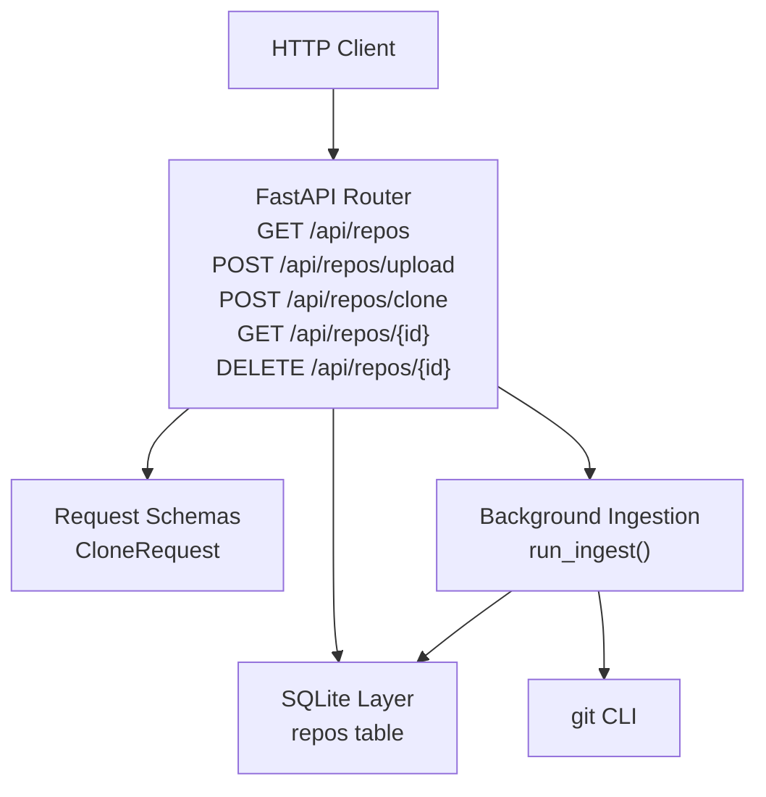
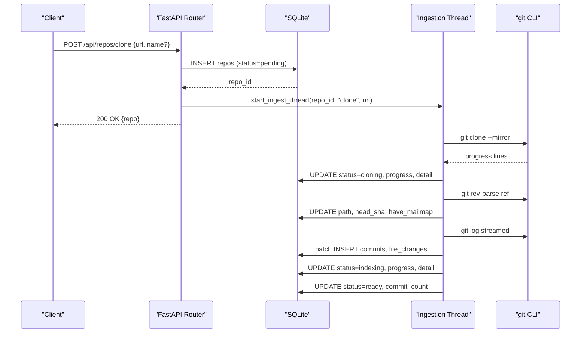
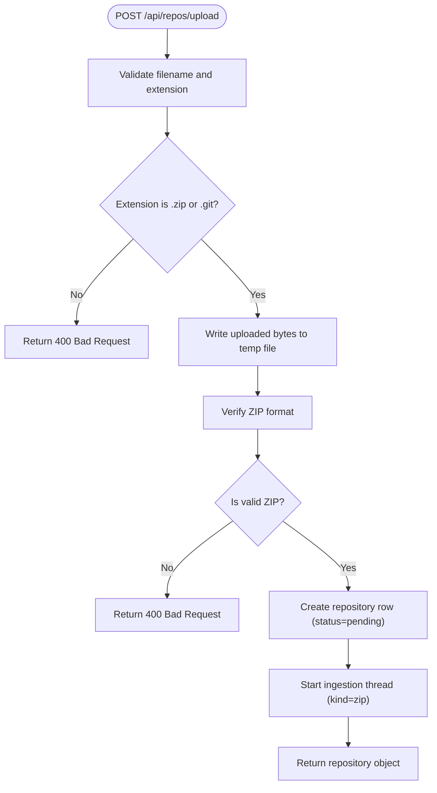
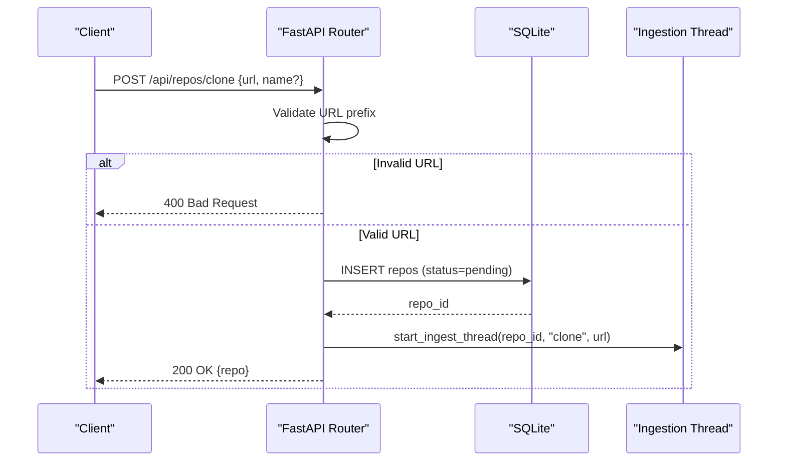
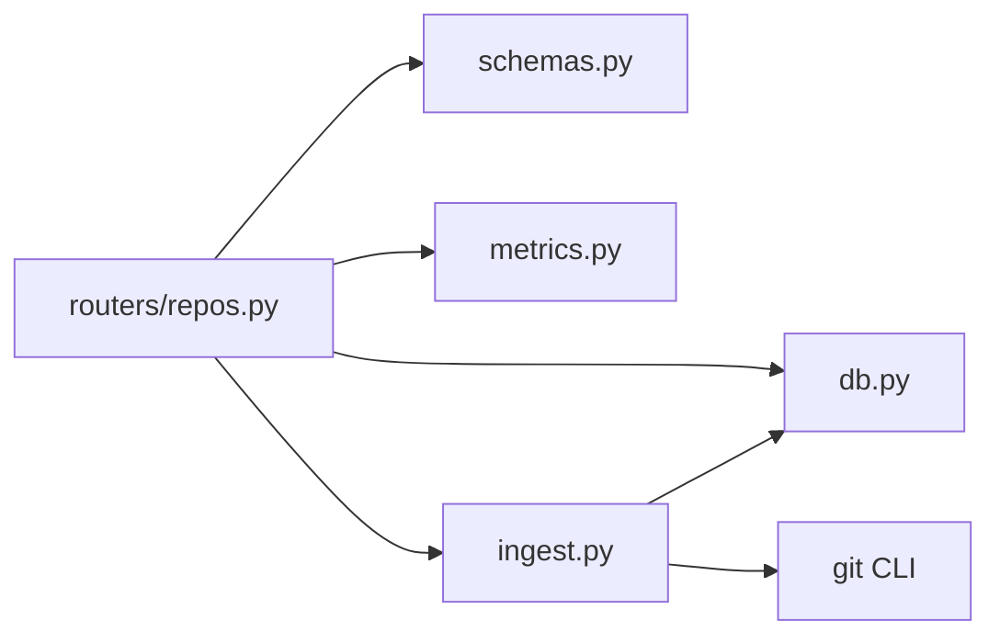

# Repository Management API

<cite>
**Referenced Files in This Document**
- [repos.py](file://backend/app/routers/repos.py)
- [schemas.py](file://backend/app/schemas.py)
- [ingest.py](file://backend/app/ingest.py)
- [db.py](file://backend/app/db.py)
- [README.md](file://README.md)
</cite>

## Table of Contents
1. [Introduction](#introduction)
2. [Project Structure](#project-structure)
3. [Core Components](#core-components)
4. [Architecture Overview](#architecture-overview)
5. [Detailed Component Analysis](#detailed-component-analysis)
6. [Dependency Analysis](#dependency-analysis)
7. [Performance Considerations](#performance-considerations)
8. [Troubleshooting Guide](#troubleshooting-guide)
9. [Conclusion](#conclusion)

## Introduction
This document describes the repository management API surface for ingesting, cloning, inspecting, and deleting repositories. The backend is a FastAPI application that exposes endpoints under `/api/repos`. Ingestion is asynchronous: upload and clone operations return immediately with a pending repository record, while background threads perform acquisition, extraction or cloning, and streamed indexing into SQLite.

The repository object returned by these endpoints includes lifecycle status, progress, error information, and metadata such as commit count and head SHA.

**Section sources**
- [README.md:111-127](file://README.md#L111-L127)
- [README.md:198-208](file://README.md#L198-L208)

## Project Structure
The repository management endpoints are implemented in the FastAPI router module. Request schemas are defined separately, ingestion logic runs in background threads, and persistence is handled through an SQLite schema layer.

**Diagram sources**
- [repos.py:16-113](file://backend/app/routers/repos.py#L16-L113)
- [schemas.py:9-12](file://backend/app/schemas.py#L9-L12)
- [ingest.py:362-438](file://backend/app/ingest.py#L362-L438)
- [db.py:13-29](file://backend/app/db.py#L13-L29)

**Section sources**
- [repos.py:1-114](file://backend/app/routers/repos.py#L1-L114)
- [schemas.py:1-30](file://backend/app/schemas.py#L1-L30)
- [ingest.py:1-439](file://backend/app/ingest.py#L1-L439)
- [db.py:1-87](file://backend/app/db.py#L1-L87)

## Core Components
- Repository router: defines the REST endpoints, request validation, database access helpers, and background ingestion triggers.
- Request schemas: Pydantic models for structured requests such as clone URLs.
- Ingestion engine: background thread that clones or extracts repositories, locates the git repository, parses history via `git log`, and updates repository status and progress.
- Database layer: SQLite schema and connection helper; the `repos` table stores repository metadata, status, progress, errors, and indexing results.

Key responsibilities:
- List repositories: returns all repositories ordered by creation time.
- Upload ZIP: validates archive type, writes to temporary storage, creates a pending repository, and starts ingestion.
- Clone URL: validates supported URL formats, derives a name when missing, creates a pending repository, and starts ingestion.
- Get repository: returns current repository state.
- Delete repository: removes the database row and on-disk repository data, then invalidates cached metrics.

**Section sources**
- [repos.py:18-47](file://backend/app/routers/repos.py#L18-L47)
- [repos.py:50-94](file://backend/app/routers/repos.py#L50-L94)
- [repos.py:97-113](file://backend/app/routers/repos.py#L97-L113)
- [schemas.py:9-12](file://backend/app/schemas.py#L9-L12)
- [ingest.py:362-438](file://backend/app/ingest.py#L362-L438)
- [db.py:13-29](file://backend/app/db.py#L13-L29)

## Architecture Overview
The repository management workflow combines synchronous HTTP handling with asynchronous background processing.

**Diagram sources**
- [repos.py:81-94](file://backend/app/routers/repos.py#L81-L94)
- [ingest.py:97-118](file://backend/app/ingest.py#L97-L118)
- [ingest.py:280-350](file://backend/app/ingest.py#L280-L350)
- [ingest.py:362-429](file://backend/app/ingest.py#L362-L429)

## Detailed Component Analysis

### GET /api/repos
Lists all repositories. Returns a list of repository objects sorted by creation time descending.

- Method: GET
- Path: `/api/repos`
- Authentication: Not specified by endpoint
- Query parameters: None
- Response body: Array of repository objects

Repository object fields:
- id: integer primary key
- name: string repository name
- source_type: string, one of `zip` or `clone`
- source: string original filename or remote URL
- ref: string reference used during indexing, default `HEAD`
- status: string lifecycle status
- progress: float between 0 and 1
- progress_detail: string human-readable progress message
- error: string error message if status is error
- head_sha: string latest commit SHA at the selected ref
- commit_count: integer number of indexed non-merge commits
- have_mailmap: integer flag indicating presence of `.mailmap`
- created_at: integer UNIX timestamp
- path: string on-disk repository root

Status transitions:
- pending: initial state after creation
- extracting: ZIP extraction phase
- cloning: remote clone phase
- indexing: streamed history parsing and database insertion
- ready: successful completion
- error: failure during any phase

Progress tracking:
- progress is updated incrementally during cloning and indexing
- progress_detail provides contextual messages such as clone percentage or commit counts

Error handling:
- If no rows exist, the response is an empty array
- Individual repository errors are stored per repository row

Example responses:
- Success: array of repository objects
- Empty: empty array

**Section sources**
- [repos.py:18-47](file://backend/app/routers/repos.py#L18-L47)
- [db.py:13-29](file://backend/app/db.py#L13-L29)

### POST /api/repos/upload
Accepts a ZIP archive containing a git repository and starts background ingestion.

- Method: POST
- Path: `/api/repos/upload`
- Content-Type: multipart/form-data
- Form field: file (required)

Validation rules:
- File must be present
- Filename must be provided
- Allowed extensions: `.zip`, `.git`
- Uploaded content must be a valid ZIP archive

Processing steps:
1. Validate filename and extension
2. Stream file contents to a temporary file
3. Verify ZIP validity
4. Create repository row with status `pending`
5. Start background ingestion thread with kind `zip`
6. Return the newly created repository object

Response:
- 200 OK: repository object with status `pending`

Errors:
- 400 Bad Request: missing filename, unsupported extension, invalid ZIP
- 500 Internal Server Error: failure writing upload to disk

Example workflows:
- Upload a ZIP named `my-project.zip`:
  - Request form field: `file=my-project.zip`
  - Response: repository with `source_type=zip`, `source="my-project.zip"`, `status=pending`
- Upload a bare `.git` archive:
  - Request form field: `file=repo.git`
  - Response: repository with `source_type=zip`, `source="repo.git"`, `status=pending`

**Diagram sources**
- [repos.py:50-78](file://backend/app/routers/repos.py#L50-L78)
- [ingest.py:362-429](file://backend/app/ingest.py#L362-L429)

**Section sources**
- [repos.py:50-78](file://backend/app/routers/repos.py#L50-L78)
- [ingest.py:121-138](file://backend/app/ingest.py#L121-L138)
- [ingest.py:362-429](file://backend/app/ingest.py#L362-L429)

### POST /api/repos/clone
Clones a remote git repository and starts background ingestion.

- Method: POST
- Path: `/api/repos/clone`
- Content-Type: application/json
- Request body: CloneRequest

Request schema:
- url: string, required
- name: string, optional

Validation rules:
- URL must start with `http://`, `https://`, `git://`, `ssh://`, or `git@`
- Name is trimmed; if omitted, derived from the URL tail (removing `.git` suffix if present)

Processing steps:
1. Trim and validate URL format
2. Derive repository name if not provided
3. Create repository row with status `pending`
4. Start background ingestion thread with kind `clone`
5. Return the newly created repository object

Supported URL formats:
- HTTPS: `https://github.com/org/repo.git`
- SSH: `ssh://git@host/path/repo.git`
- SCP-like: `git@host:path/repo.git`

Response:
- 200 OK: repository object with status `pending`

Errors:
- 400 Bad Request: invalid URL format

Example requests:
- HTTPS clone:
  - Body: `{ "url": "https://github.com/DaveGamble/cJSON.git" }`
- SSH clone:
  - Body: `{ "url": "ssh://git@gitlab.example.com/group/project.git" }`
- SCP-like clone:
  - Body: `{ "url": "git@github.com:DaveGamble/cJSON.git" }`

**Diagram sources**
- [repos.py:81-94](file://backend/app/routers/repos.py#L81-L94)
- [schemas.py:9-12](file://backend/app/schemas.py#L9-L12)

**Section sources**
- [repos.py:81-94](file://backend/app/routers/repos.py#L81-L94)
- [schemas.py:9-12](file://backend/app/schemas.py#L9-L12)

### GET /api/repos/{repo_id}
Returns the current state of a specific repository.

- Method: GET
- Path: `/api/repos/{repo_id}`
- Path parameter: repo_id (integer)

Response:
- 200 OK: repository object
- 404 Not Found: repository does not exist

Use cases:
- Polling repository status during ingestion
- Inspecting head SHA, commit count, and error details

**Section sources**
- [repos.py:97-100](file://backend/app/routers/repos.py#L97-L100)

### DELETE /api/repos/{repo_id}
Deletes a repository’s database row and on-disk data.

- Method: DELETE
- Path: `/api/repos/{repo_id}`
- Path parameter: repo_id (integer)

Processing steps:
1. Verify repository exists
2. Delete database row
3. Remove on-disk repository directory if present
4. Invalidate metrics cache for the repository
5. Return success

Response:
- 200 OK: `{ "ok": true }`
- 404 Not Found: repository does not exist

Lifecycle implications:
- Deletion is irreversible
- Background ingestion should be considered before deletion; the ingestion thread checks repository existence and stops updating if deleted

**Section sources**
- [repos.py:103-113](file://backend/app/routers/repos.py#L103-L113)

## Dependency Analysis
The repository management endpoints depend on several modules:

Coupling and cohesion:
- The router encapsulates HTTP concerns and delegates ingestion to a dedicated module
- The ingestion module manages subprocesses and database updates
- The database module centralizes schema and connection configuration

Potential circular dependencies:
- Metrics cache invalidation is imported lazily inside ingestion to avoid cycles

External integration points:
- git CLI for cloning, rev-parse, cat-file, and log streaming
- SQLite for persistence
- Filesystem for temporary uploads and repository directories

**Diagram sources**
- [repos.py:11-14](file://backend/app/routers/repos.py#L11-L14)
- [ingest.py:35-38](file://backend/app/ingest.py#L35-L38)
- [ingest.py:421-422](file://backend/app/ingest.py#L421-L422)

**Section sources**
- [repos.py:11-14](file://backend/app/routers/repos.py#L11-L14)
- [ingest.py:35-38](file://backend/app/ingest.py#L35-L38)
- [ingest.py:421-422](file://backend/app/ingest.py#L421-L422)

## Performance Considerations
- Upload ingestion streams file chunks to a temporary file, then verifies ZIP format before creating the repository row
- Cloning uses `git clone --mirror` with stderr progress parsing for real-time progress updates
- Indexing streams `git log` output and batches inserts into SQLite to reduce overhead
- WAL mode and tuned pragmas improve concurrency and write performance
- Metrics cache invalidation occurs after successful indexing to keep dashboard queries fast

[No sources needed since this section provides general guidance]

## Troubleshooting Guide
Common issues and resolutions:

- Missing file name during upload:
  - Cause: form field without filename
  - Resolution: ensure multipart form includes a file with a filename
- Unsupported file extension:
  - Cause: uploading files other than `.zip` or `.git`
  - Resolution: compress repository into a ZIP archive or provide a `.git` bundle
- Invalid ZIP archive:
  - Cause: corrupted or non-ZIP content
  - Resolution: verify archive integrity before upload
- Invalid clone URL:
  - Cause: URL does not start with allowed prefixes
  - Resolution: use HTTPS, SSH, git protocol, or SCP-like format
- Repository not found:
  - Cause: requesting a non-existent ID
  - Resolution: list repositories first and use a valid ID
- Ingestion errors:
  - Cause: network failures, authentication issues, or invalid references
  - Resolution: check repository URL credentials and ref availability; inspect repository error field

Status and progress inspection:
- Use GET `/api/repos/{repo_id}` to monitor status transitions and read error messages
- Progress values range from 0 to 1; progress_detail contains contextual messages

**Section sources**
- [repos.py:50-78](file://backend/app/routers/repos.py#L50-L78)
- [repos.py:81-94](file://backend/app/routers/repos.py#L81-L94)
- [ingest.py:97-118](file://backend/app/ingest.py#L97-L118)
- [ingest.py:362-429](file://backend/app/ingest.py#L362-L429)

## Conclusion
The repository management API provides a clear interface for listing, uploading, cloning, inspecting, and deleting repositories. Upload and clone operations are non-blocking and return immediate repository records with pending status. Background ingestion handles acquisition, extraction, cloning, and streamed indexing, updating repository status and progress throughout the process. Clients should poll repository details to track lifecycle transitions and handle errors surfaced in the repository object.

[No sources needed since this section summarizes without analyzing specific files]