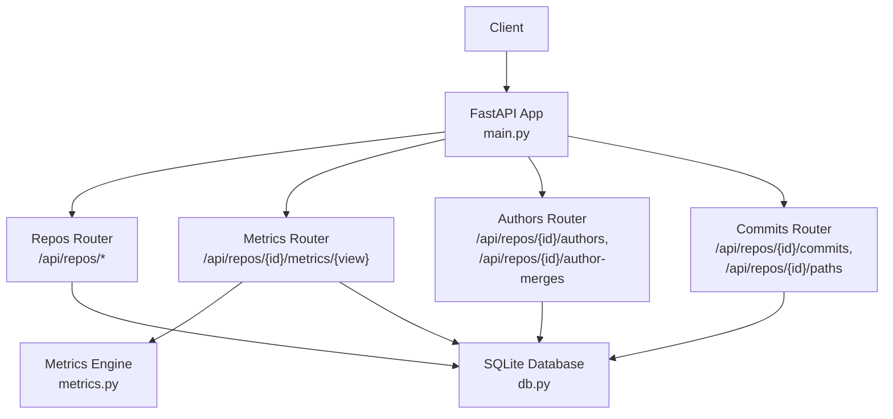
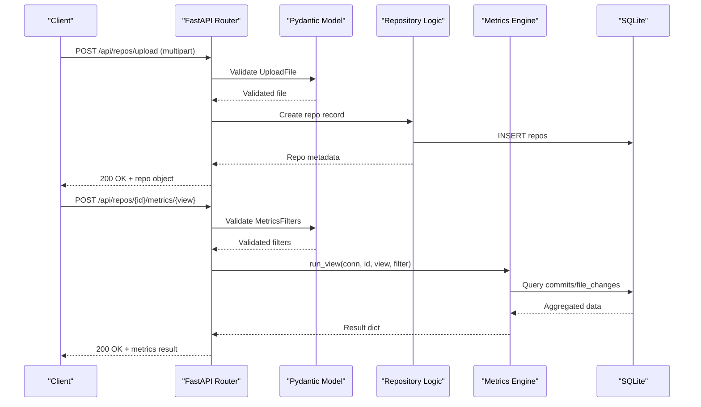
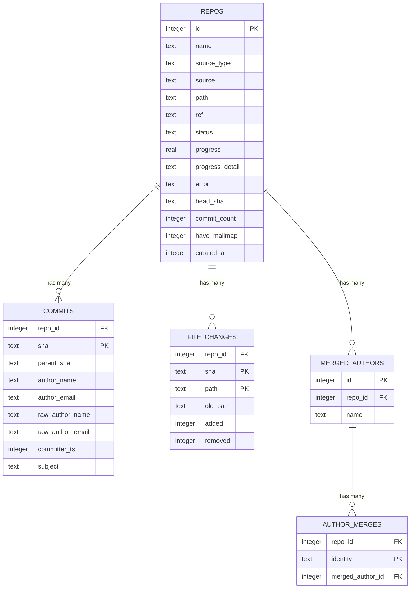

# API Endpoints

<cite>
**Referenced Files in This Document**
- [main.py](file://backend/app/main.py)
- [repos.py](file://backend/app/routers/repos.py)
- [metrics.py](file://backend/app/routers/metrics.py)
- [authors.py](file://backend/app/routers/authors.py)
- [commits.py](file://backend/app/routers/commits.py)
- [schemas.py](file://backend/app/schemas.py)
- [metrics_engine.py](file://backend/app/metrics.py)
- [db.py](file://backend/app/db.py)
- [config.py](file://backend/app/config.py)
- [requirements.txt](file://backend/requirements.txt)
</cite>

## Table of Contents
1. [Introduction](#introduction)
2. [Project Structure](#project-structure)
3. [Core Components](#core-components)
4. [Architecture Overview](#architecture-overview)
5. [Detailed Endpoint Documentation](#detailed-endpoint-documentation)
6. [Request and Response Schemas](#request-and-response-schemas)
7. [Authentication, Security, and Rate Limiting](#authentication-security-and-rate-limiting)
8. [Error Handling and Status Codes](#error-handling-and-status-codes)
9. [Performance Considerations](#performance-considerations)
10. [Troubleshooting Guide](#troubleshooting-guide)
11. [Conclusion](#conclusion)

## Introduction
This document describes the RESTful API exposed by RAT’s FastAPI backend. It covers repository management, metrics queries, author identity management, and commit search functionality. For each endpoint, it specifies HTTP methods, URL patterns, request and response schemas, validation rules, error responses, and operational behavior such as ingestion status checks and caching.

The API is served under the `/api` path prefix. The application also serves a frontend SPA, but all `/api/*` routes are reserved for the backend API.

## Project Structure
The backend is organized around FastAPI routers:
- Repository endpoints live under `/api/repos`.
- Metrics endpoints live under `/api/repos/{repo_id}/metrics/{view}`.
- Author management endpoints live under `/api/repos/{repo_id}/authors` and `/api/repos/{repo_id}/author-merges`.
- Commit search and path picker endpoints live under `/api/repos/{repo_id}/commits` and `/api/repos/{repo_id}/paths`.

**Diagram sources**
- [main.py:13-27](file://backend/app/main.py#L13-L27)
- [repos.py:16-114](file://backend/app/routers/repos.py#L16-L114)
- [metrics.py:10-41](file://backend/app/routers/metrics.py#L10-L41)
- [authors.py:9-50](file://backend/app/routers/authors.py#L9-L50)
- [commits.py:10-103](file://backend/app/routers/commits.py#L10-L103)
- [db.py:13-87](file://backend/app/db.py#L13-L87)
- [metrics_engine.py:389-400](file://backend/app/metrics.py#L389-L400)

**Section sources**
- [main.py:1-49](file://backend/app/main.py#L1-L49)
- [config.py:1-15](file://backend/app/config.py#L1-L15)

## Core Components
- FastAPI application entry point initializes CORS middleware, database schema, and includes routers.
- Routers define REST endpoints and delegate to business logic modules.
- Pydantic models validate requests.
- SQLite database stores repositories, commits, file changes, and author merge mappings.
- Metrics engine computes aggregates and timeseries over filtered commit sets.

Key responsibilities:
- Repository lifecycle: list, upload zip, clone from Git URL, get details, delete.
- Metrics: summary, files, dirs, authors, timeseries, commits views with filters.
- Authors: list identities and groups, merge identities, unmerge identity or group.
- Commits: search commits and browse paths.

**Section sources**
- [main.py:13-27](file://backend/app/main.py#L13-L27)
- [repos.py:16-114](file://backend/app/routers/repos.py#L16-L114)
- [metrics.py:10-41](file://backend/app/routers/metrics.py#L10-L41)
- [authors.py:9-50](file://backend/app/routers/authors.py#L9-L50)
- [commits.py:10-103](file://backend/app/routers/commits.py#L10-L103)
- [db.py:13-87](file://backend/app/db.py#L13-L87)
- [metrics_engine.py:43-55](file://backend/app/metrics.py#L43-L55)

## Architecture Overview
The API follows a layered design:
- Presentation layer: FastAPI routers handle HTTP requests and responses.
- Validation layer: Pydantic models enforce request constraints.
- Business layer: Metrics computation and author merging logic.
- Persistence layer: SQLite database accessed via connection helpers.

**Diagram sources**
- [repos.py:50-78](file://backend/app/routers/repos.py#L50-L78)
- [metrics.py:13-41](file://backend/app/routers/metrics.py#L13-L41)
- [metrics_engine.py:399-400](file://backend/app/metrics.py#L399-L400)
- [db.py:74-81](file://backend/app/db.py#L74-L81)

## Detailed Endpoint Documentation

### Repository Management

#### List Repositories
- Method: GET
- URL: `/api/repos`
- Authentication: None
- Rate Limiting: Not configured
- Request Body: None
- Response Schema: Array of repository objects
- Error Responses: None defined for this endpoint

Response fields include repository identifiers, source information, status, progress, head SHA, commit count, mailmap flag, creation time, and on-disk path.

**Section sources**
- [repos.py:43-47](file://backend/app/routers/repos.py#L43-L47)
- [repos.py:18-24](file://backend/app/routers/repos.py#L18-L24)

#### Upload Repository Archive
- Method: POST
- URL: `/api/repos/upload`
- Content-Type: multipart/form-data
- Authentication: None
- Rate Limiting: Not configured
- Request Parameters:
  - `file`: Required; must be a `.zip` archive containing the repository.
- Response Schema: Repository object
- Error Responses:
  - 400 Bad Request if filename is missing or file is not a valid zip.
  - 500 Internal Server Error if storage fails.

Behavior:
- Validates filename suffix and zip integrity.
- Creates a temporary file, streams upload chunks, validates zip format.
- Inserts a pending repository record and starts an asynchronous ingest thread.

**Section sources**
- [repos.py:50-78](file://backend/app/routers/repos.py#L50-L78)

#### Clone Repository from Git URL
- Method: POST
- URL: `/api/repos/clone`
- Content-Type: application/json
- Authentication: None
- Rate Limiting: Not configured
- Request Body:
  - `url`: Required; Git URL supporting http(s), git, ssh, or SSH-style `git@...`.
  - `name`: Optional; repository name. If omitted, derived from URL tail.
- Response Schema: Repository object
- Error Responses:
  - 400 Bad Request if URL scheme is invalid.

Behavior:
- Strips whitespace from URL and name.
- Derives name from URL when not provided.
- Inserts a pending repository record and starts an asynchronous ingest thread.

**Section sources**
- [repos.py:81-94](file://backend/app/routers/repos.py#L81-L94)
- [schemas.py:9-12](file://backend/app/schemas.py#L9-L12)

#### Get Repository Details
- Method: GET
- URL: `/api/repos/{repo_id}`
- Authentication: None
- Rate Limiting: Not configured
- Path Parameters:
  - `repo_id`: Integer repository identifier.
- Response Schema: Repository object
- Error Responses:
  - 404 Not Found if repository does not exist.

**Section sources**
- [repos.py:97-100](file://backend/app/routers/repos.py#L97-L100)
- [repos.py:27-31](file://backend/app/routers/repos.py#L27-L31)

#### Delete Repository
- Method: DELETE
- URL: `/api/repos/{repo_id}`
- Authentication: None
- Rate Limiting: Not configured
- Path Parameters:
  - `repo_id`: Integer repository identifier.
- Response Schema: `{ "ok": true }`
- Error Responses:
  - 404 Not Found if repository does not exist.

Behavior:
- Deletes repository record from database.
- Removes on-disk repository directory if present.
- Invalidates metrics cache for the repository.

**Section sources**
- [repos.py:103-113](file://backend/app/routers/repos.py#L103-L113)

### Metrics Queries

#### Metric View Endpoint
- Method: POST
- URL: `/api/repos/{repo_id}/metrics/{view}`
- Authentication: None
- Rate Limiting: Not configured
- Path Parameters:
  - `repo_id`: Integer repository identifier.
  - `view`: One of `summary`, `files`, `dirs`, `authors`, `timeseries`, `commits`.
- Request Body: `MetricsFilters` schema
- Response Schema: Object including `repo_id`, `view`, and view-specific results
- Error Responses:
  - 404 Not Found if view is unknown or repository does not exist.
  - 409 Conflict if repository is not ready yet.

Supported views:
- `summary`: Aggregate added/removed/growth/churn/modifications/frequency/churn-rate for an object or repository root.
- `files`: Per-file metrics under the selected object.
- `dirs`: Per-directory subtree metrics with de-duplicated modifications per commit.
- `authors`: Per-author modifications, churn, and ownership.
- `timeseries`: Time-bucketed metrics with day/week/month granularity.
- `commits`: Paged commit set with object-level stats.

Filter parameters:
- `start`: Inclusive UNIX timestamp.
- `end`: Exclusive UNIX timestamp.
- `commits`: Manual commit selection overriding range.
- `authors`: Author keys (`i:<email>` or `m:<group id>`).
- `path`: File or directory path.
- `object_type`: `file` or `dir`.
- `granularity`: `day`, `week`, or `month`.
- `limit`: Maximum items returned.
- `offset`: Pagination offset.
- `only_changed`: Filter commits that changed the object.

Caching:
- Results are cached in-memory with TTL and invalidated on repository deletion or author merges.

**Section sources**
- [metrics.py:13-41](file://backend/app/routers/metrics.py#L13-L41)
- [metrics_engine.py:389-400](file://backend/app/metrics.py#L389-L400)
- [metrics_engine.py:135-155](file://backend/app/metrics.py#L135-L155)
- [metrics_engine.py:158-183](file://backend/app/metrics.py#L158-L183)
- [metrics_engine.py:186-248](file://backend/app/metrics.py#L186-L248)
- [metrics_engine.py:251-279](file://backend/app/metrics.py#L251-L279)
- [metrics_engine.py:291-329](file://backend/app/metrics.py#L291-L329)
- [metrics_engine.py:332-386](file://backend/app/metrics.py#L332-L386)
- [metrics_engine.py:407-435](file://backend/app/metrics.py#L407-L435)

### Author Management

#### List Authors and Groups
- Method: GET
- URL: `/api/repos/{repo_id}/authors`
- Authentication: None
- Rate Limiting: Not configured
- Path Parameters:
  - `repo_id`: Integer repository identifier.
- Response Schema:
  - `have_mailmap`: Boolean indicating whether mailmap was used during ingestion.
  - `authors`: Array of author identities with commit counts, group membership, and raw names.
  - `groups`: Array of merged author groups with members.
- Error Responses:
  - 404 Not Found if repository does not exist.

Author identity model:
- Raw identities are stored per commit.
- Effective identity key is either `i:<lowercased email>` or `m:<group id>` for manually merged authors.
- Group name falls back to mailmap-resolved name when no manual merge exists.

**Section sources**
- [authors.py:12-16](file://backend/app/routers/authors.py#L12-L16)
- [authors.py:28-60](file://backend/app/authors.py#L28-L60)
- [authors.py:15-25](file://backend/app/authors.py#L15-L25)

#### Merge Authors
- Method: POST
- URL: `/api/repos/{repo_id}/author-merges`
- Authentication: None
- Rate Limiting: Not configured
- Path Parameters:
  - `repo_id`: Integer repository identifier.
- Request Body: `MergeRequest` schema
  - `identities`: Array of lowercased email identities to merge.
  - `name`: Optional display name for the merged group.
- Response Schema: Updated authors listing
- Error Responses:
  - 400 Bad Request if no identities supplied or validation fails.

Behavior:
- Normalizes and deduplicates identities.
- Unifies existing merge groups into one target group.
- Updates merged author records and cleans up empty groups.
- Invalidates metrics cache after merge.

**Section sources**
- [authors.py:19-29](file://backend/app/routers/authors.py#L19-L29)
- [authors.py:63-110](file://backend/app/authors.py#L63-L110)
- [schemas.py:27-29](file://backend/app/schemas.py#L27-L29)

#### Unmerge Identity
- Method: DELETE
- URL: `/api/repos/{repo_id}/author-merges/{identity}`
- Authentication: None
- Rate Limiting: Not configured
- Path Parameters:
  - `repo_id`: Integer repository identifier.
  - `identity`: Lowercased email identity to remove from merge mapping.
- Response Schema: Updated authors listing
- Error Responses:
  - 404 Not Found if repository does not exist.

Behavior:
- Removes identity from merge mapping.
- Cleans up empty merged author groups.
- Invalidates metrics cache.

**Section sources**
- [authors.py:32-39](file://backend/app/routers/authors.py#L32-L39)
- [authors.py:112-121](file://backend/app/authors.py#L112-L121)

#### Unmerge Group
- Method: DELETE
- URL: `/api/repos/{repo_id}/author-groups/{group_id}`
- Authentication: None
- Rate Limiting: Not configured
- Path Parameters:
  - `repo_id`: Integer repository identifier.
  - `group_id`: Integer merged author group identifier.
- Response Schema: Updated authors listing
- Error Responses:
  - 404 Not Found if repository does not exist.

Behavior:
- Removes all mappings for the group.
- Deletes the group if no members remain.
- Invalidates metrics cache.

**Section sources**
- [authors.py:42-49](file://backend/app/routers/authors.py#L42-L49)
- [authors.py:124-130](file://backend/app/authors.py#L124-L130)

### Commit Search and Path Picker

#### List Commits
- Method: GET
- URL: `/api/repos/{repo_id}/commits`
- Authentication: None
- Rate Limiting: Not configured
- Query Parameters:
  - `q`: Free-text search across SHA, subject, author name, and author email.
  - `start`: Inclusive UNIX timestamp filter.
  - `end`: Exclusive UNIX timestamp filter.
  - `limit`: Page size between 1 and 500, default 100.
  - `offset`: Offset starting at 0.
- Response Schema:
  - `total`: Total number of matching commits.
  - `items`: Array of commit objects with SHA, short SHA, timestamp, author, author key, and subject.
- Error Responses:
  - 404 Not Found if repository does not exist.

Search behavior:
- Applies LIKE searches across multiple fields when query is provided.
- Joins author merge mappings to resolve effective author identity and name.

**Section sources**
- [commits.py:13-60](file://backend/app/routers/commits.py#L13-L60)
- [commits.py:7-8](file://backend/app/routers/commits.py#L7-L8)

#### List Paths
- Method: GET
- URL: `/api/repos/{repo_id}/paths`
- Authentication: None
- Rate Limiting: Not configured
- Query Parameters:
  - `q`: Case-insensitive substring search across file and directory paths.
  - `limit`: Maximum items returned, between 1 and 500, default 50.
- Response Schema:
  - `items`: Array of path entries with `path`, `type` (`file` or `dir`), and `label`.
- Error Responses:
  - 404 Not Found if repository does not exist.

Path picker behavior:
- Builds directory hierarchy from file paths.
- Returns both directories and files, sorted and limited.
- Includes repository root entry.

**Section sources**
- [commits.py:63-102](file://backend/app/routers/commits.py#L63-L102)

## Request and Response Schemas

### Pydantic Models
- `CloneRequest`:
  - `url`: Required string.
  - `name`: Optional string.
- `MetricsFilters`:
  - `start`: Optional integer UNIX timestamp (inclusive).
  - `end`: Optional integer UNIX timestamp (exclusive).
  - `commits`: Array of commit SHAs.
  - `authors`: Array of author keys (`i:<email>` or `m:<group id>`).
  - `path`: Optional string path.
  - `object_type`: Literal `file` or `dir`; optional.
  - `granularity`: Literal `day`, `week`, or `month`; default `month`.
  - `limit`: Integer; default 500.
  - `offset`: Integer; default 0.
  - `only_changed`: Boolean; default false.
- `MergeRequest`:
  - `identities`: Required array of strings.
  - `name`: String; default empty.

Validation rules:
- URL schemes for cloning are enforced at router level.
- Zip uploads require `.zip` suffix and valid zip content.
- Metrics views are restricted to known view names.
- Query parameter limits and ranges are enforced by FastAPI `Query` constraints.

**Section sources**
- [schemas.py:9-29](file://backend/app/schemas.py#L9-L29)
- [repos.py:81-94](file://backend/app/routers/repos.py#L81-L94)
- [metrics.py:13-41](file://backend/app/routers/metrics.py#L13-L41)
- [commits.py:13-19](file://backend/app/routers/commits.py#L13-L19)

### Data Models and Relationships

**Diagram sources**
- [db.py:13-71](file://backend/app/db.py#L13-L71)

## Authentication, Security, and Rate Limiting
- Authentication: No authentication middleware is configured. All endpoints are publicly accessible.
- Authorization: No role-based access control is implemented.
- CORS: Allowed origins include local development URLs.
- Rate Limiting: No rate limiting middleware is configured.
- Input Validation: Pydantic models and FastAPI query constraints enforce request structure and ranges.
- File Uploads: Only `.zip` archives are accepted; zip validity is checked before ingestion.

Recommendations:
- Add authentication middleware (e.g., JWT or session-based).
- Implement rate limiting using FastAPI middleware or reverse proxy configuration.
- Restrict allowed origins to production domains.
- Add input sanitization and size limits for uploads.

**Section sources**
- [main.py:15-20](file://backend/app/main.py#L15-L20)
- [requirements.txt:1-6](file://backend/requirements.txt#L1-L6)

## Error Handling and Status Codes
Common status codes:
- 200 OK: Successful operation.
- 400 Bad Request: Invalid input (missing file, invalid zip, invalid URL scheme, empty identities).
- 404 Not Found: Unknown metric view, missing repository, or unsupported resource.
- 409 Conflict: Repository not ready yet for metrics queries.
- 500 Internal Server Error: Storage failure during upload.

Error response bodies:
- JSON objects with `detail` field describing the error.

Operational notes:
- Metrics queries check repository status and reject non-ready repositories.
- Author operations invalidate metrics cache to ensure consistency.
- Deletion removes both database records and on-disk repository data.

**Section sources**
- [metrics.py:13-41](file://backend/app/routers/metrics.py#L13-L41)
- [repos.py:50-78](file://backend/app/routers/repos.py#L50-L78)
- [authors.py:19-29](file://backend/app/routers/authors.py#L19-L29)

## Performance Considerations
- Caching: Metrics results are cached in-memory with a TTL of 30 seconds and maximum size of 256 entries. Cache keys include repository ID, view, and serialized filters.
- Database: SQLite with WAL mode and tuned pragmas for concurrency and durability.
- Indexes: Commits indexed by repository and timestamp/email; file changes indexed by repository and path.
- Pagination: Commit lists and metrics views support limit and offset to control payload size.
- Asynchronous Ingestion: Repository ingestion runs in background threads to avoid blocking API responses.

Optimization opportunities:
- Use connection pooling for high-concurrency scenarios.
- Add query result pagination for large datasets.
- Consider external caching (Redis) for multi-process deployments.
- Profile expensive views and add materialized summaries for hot paths.

**Section sources**
- [metrics_engine.py:407-435](file://backend/app/metrics.py#L407-L435)
- [db.py:74-81](file://backend/app/db.py#L74-L81)
- [db.py:44-57](file://backend/app/db.py#L44-L57)

## Troubleshooting Guide
Common issues:
- Repository not found: Ensure the repository was successfully uploaded or cloned and the correct `repo_id` is used.
- Repository not ready: Wait until ingestion completes; metrics endpoints reject non-ready repositories.
- Invalid zip upload: Verify the uploaded file is a valid zip archive.
- Unknown metric view: Use one of the supported views: `summary`, `files`, `dirs`, `authors`, `timeseries`, `commits`.
- Empty author identities: Provide at least one identity when merging authors.

Debugging steps:
- Check repository status via `/api/repos/{repo_id}`.
- Inspect ingestion logs if available.
- Validate request payloads against Pydantic schemas.
- Use small page sizes and offsets to isolate pagination issues.

**Section sources**
- [repos.py:27-31](file://backend/app/routers/repos.py#L27-L31)
- [metrics.py:13-41](file://backend/app/routers/metrics.py#L13-L41)
- [authors.py:63-73](file://backend/app/authors.py#L63-L73)

## Conclusion
RAT’s API provides a comprehensive interface for managing repositories, querying metrics, managing author identities, and searching commits. The design emphasizes clear separation of concerns, strict input validation, and efficient aggregation through SQLite and in-memory caching. While authentication and rate limiting are not currently implemented, the modular architecture allows straightforward integration of security and performance enhancements.