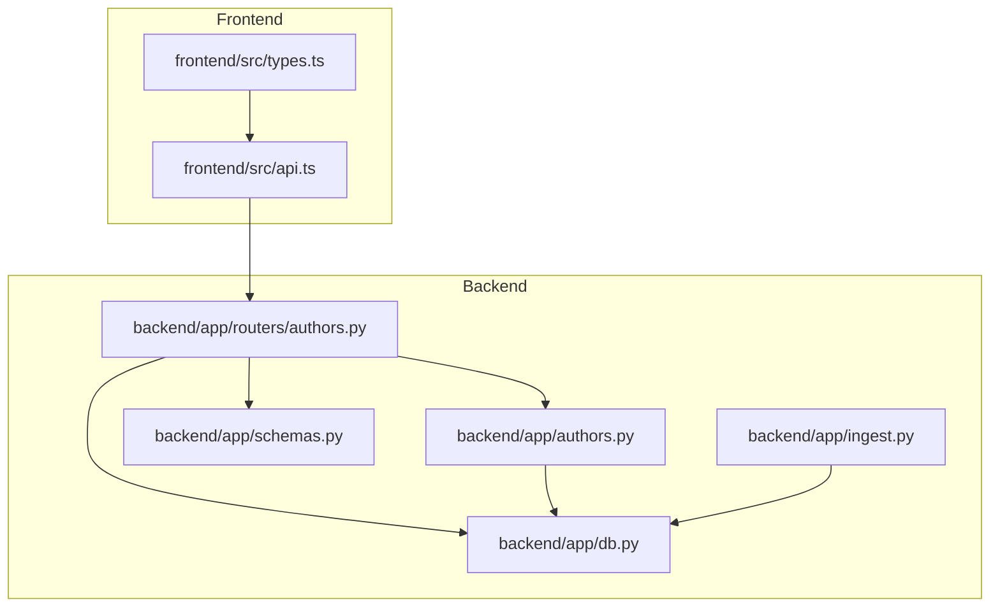
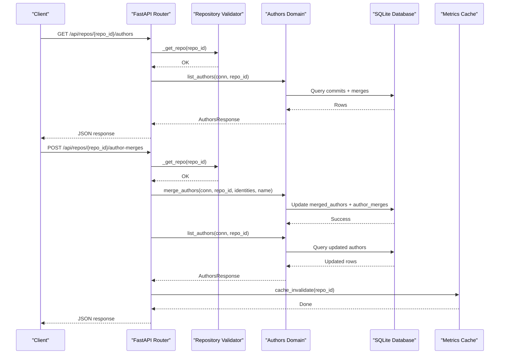
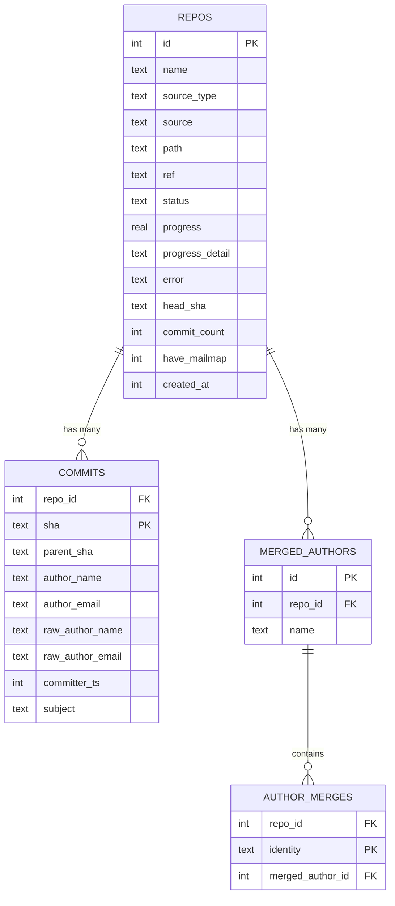
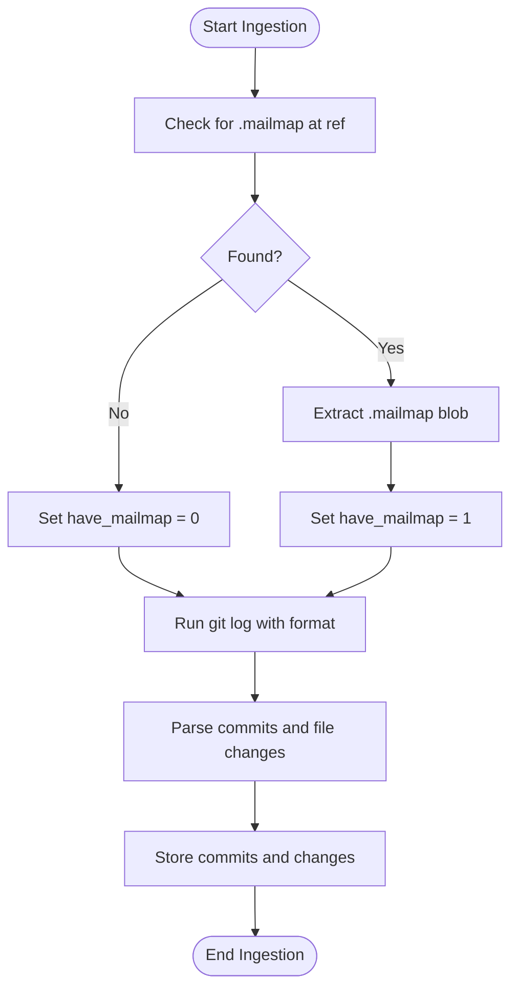
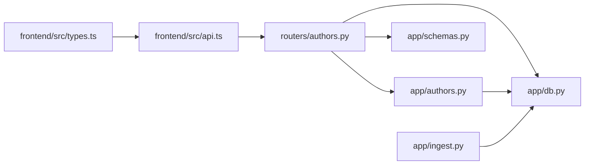

# Author Management

<cite>
**Referenced Files in This Document**
- [authors.py](file://backend/app/routers/authors.py)
- [authors.py](file://backend/app/authors.py)
- [schemas.py](file://backend/app/schemas.py)
- [db.py](file://backend/app/db.py)
- [ingest.py](file://backend/app/ingest.py)
- [api.ts](file://frontend/src/api.ts)
- [types.ts](file://frontend/src/types.ts)
</cite>

## Table of Contents
1. [Introduction](#introduction)
2. [Project Structure](#project-structure)
3. [Core Components](#core-components)
4. [Architecture Overview](#architecture-overview)
5. [Detailed Component Analysis](#detailed-component-analysis)
6. [Dependency Analysis](#dependency-analysis)
7. [Performance Considerations](#performance-considerations)
8. [Troubleshooting Guide](#troubleshooting-guide)
9. [Conclusion](#conclusion)

## Introduction
This document provides detailed API documentation for author management endpoints focused on:
- Listing authors with contribution statistics
- Managing author identity merges to consolidate duplicate identities
- Understanding how `.mailmap` files influence author identity resolution
- Practical workflows for author analysis and identity resolution

The endpoints are part of a FastAPI backend that exposes repository-scoped author data, while the frontend uses typed TypeScript clients to interact with these APIs.

## Project Structure
Author-related functionality is implemented across backend routers, domain logic, database schema, ingestion pipeline, and frontend client types.



**Diagram sources**
- [authors.py:12-29](file://backend/app/routers/authors.py#L12-L29)
- [authors.py:28-60](file://backend/app/authors.py#L28-L60)
- [schemas.py:27-29](file://backend/app/schemas.py#L27-L29)
- [db.py:13-70](file://backend/app/db.py#L13-L70)
- [ingest.py:141-157](file://backend/app/ingest.py#L141-L157)
- [api.ts:68-84](file://frontend/src/api.ts#L68-L84)
- [types.ts:30-50](file://frontend/src/types.ts#L30-L50)

**Section sources**
- [authors.py:12-29](file://backend/app/routers/authors.py#L12-L29)
- [authors.py:28-60](file://backend/app/authors.py#L28-L60)
- [schemas.py:27-29](file://backend/app/schemas.py#L27-L29)
- [db.py:13-70](file://backend/app/db.py#L13-L70)
- [ingest.py:141-157](file://backend/app/ingest.py#L141-L157)
- [api.ts:68-84](file://frontend/src/api.ts#L68-L84)
- [types.ts:30-50](file://frontend/src/types.ts#L30-L50)

## Core Components
- GET /api/repos/{repo_id}/authors
  - Lists all authors with contribution statistics and merge groups.
  - Returns whether the repository has a `.mailmap`, the list of authors, and manual merge groups.
- POST /api/repos/{repo_id}/author-merges
  - Merges multiple author identities into one group.
  - Accepts a list of lowercased email identities and an optional display name.
- DELETE /api/repos/{repo_id}/author-merges/{identity}
  - Removes a single identity from any merge group.
- DELETE /api/repos/{repo_id}/author-groups/{group_id}
  - Deletes an entire merge group.

These endpoints share common behavior:
- Validate repository existence before processing.
- Apply manual merges at query time without re-indexing.
- Invalidate metrics cache after mutation operations.

**Section sources**
- [authors.py:12-29](file://backend/app/routers/authors.py#L12-L29)
- [authors.py:28-60](file://backend/app/authors.py#L28-L60)
- [authors.py:63-131](file://backend/app/authors.py#L63-L131)
- [db.py:59-70](file://backend/app/db.py#L59-L70)

## Architecture Overview
The author management flow integrates repository validation, author listing, and merge operations.



**Diagram sources**
- [authors.py:12-29](file://backend/app/routers/authors.py#L12-L29)
- [authors.py:28-60](file://backend/app/authors.py#L28-L60)
- [authors.py:63-131](file://backend/app/authors.py#L63-L131)

## Detailed Component Analysis

### GET /api/repos/{repo_id}/authors
Lists authors with commit counts, raw names, and merge group membership. It also returns whether the repository has a `.mailmap`.

Request
- Method: GET
- Path: `/api/repos/{repo_id}/authors`
- Path Parameters:
  - `repo_id`: integer repository identifier

Response Schema
- `have_mailmap`: boolean indicating presence of `.mailmap`
- `authors`: array of author objects
  - `identity`: string (lowercased email used as stable key)
  - `email`: string (original resolved email)
  - `name`: string (display name; may be overridden by merge group)
  - `commits`: integer (commit count)
  - `group_id`: integer or null (merge group id if merged)
  - `group_name`: string or null (merge group name if merged)
  - `raw_names`: string or null (comma-separated raw author names)
- `groups`: array of merge group objects
  - `id`: integer
  - `name`: string
  - `identities`: array of strings (lowercased emails belonging to the group)

Behavior Notes
- Authors are grouped by lowercased email.
- Manual merges take precedence over email-based keys.
- Raw names are aggregated to help identify duplicates.
- The response includes merge groups and their member identities.

Example Response
```json
{
  "have_mailmap": true,
  "authors": [
    {
      "identity": "alice@example.com",
      "email": "Alice <alice@example.com>",
      "name": "Alice",
      "commits": 120,
      "group_id": null,
      "group_name": null,
      "raw_names": "Alice,Alicia"
    }
  ],
  "groups": []
}
```

**Section sources**
- [authors.py:12-16](file://backend/app/routers/authors.py#L12-L16)
- [authors.py:28-60](file://backend/app/authors.py#L28-L60)
- [types.ts:30-50](file://frontend/src/types.ts#L30-L50)

### POST /api/repos/{repo_id}/author-merges
Merges multiple author identities into a single group. If any selected identity already belongs to a merge group, affected groups are unified under the provided name.

Request
- Method: POST
- Path: `/api/repos/{repo_id}/author-merges`
- Path Parameters:
  - `repo_id`: integer repository identifier
- Request Body:
  - `identities`: array of strings (lowercased email addresses)
  - `name`: string (optional display name; defaults to first identity if empty)

Validation Rules
- At least one non-empty identity must be supplied.
- Identities are normalized: trimmed and lowercased.
- Duplicate identities are deduplicated.

Response Schema
- Same as GET /api/repos/{repo_id}/authors.

Error Handling
- Invalid input raises HTTP 400 with a descriptive message.

Example Request
```json
{
  "identities": ["alice@example.com", "alicia@example.com"],
  "name": "Alice"
}
```

Example Response
```json
{
  "have_mailmap": true,
  "authors": [
    {
      "identity": "alice@example.com",
      "email": "Alice <alice@example.com>",
      "name": "Alice",
      "commits": 120,
      "group_id": 1,
      "group_name": "Alice",
      "raw_names": "Alice,Alicia"
    },
    {
      "identity": "alicia@example.com",
      "email": "Alicia <alicia@example.com>",
      "name": "Alice",
      "commits": 15,
      "group_id": 1,
      "group_name": "Alice",
      "raw_names": "Alicia"
    }
  ],
  "groups": [
    {
      "id": 1,
      "name": "Alice",
      "identities": ["alice@example.com", "alicia@example.com"]
    }
  ]
}
```

**Section sources**
- [authors.py:19-29](file://backend/app/routers/authors.py#L19-L29)
- [authors.py:63-110](file://backend/app/authors.py#L63-L110)
- [schemas.py:27-29](file://backend/app/schemas.py#L27-L29)
- [types.ts:30-50](file://frontend/src/types.ts#L30-L50)

### DELETE /api/repos/{repo_id}/author-merges/{identity}
Removes a specific identity from any merge group.

Request
- Method: DELETE
- Path: `/api/repos/{repo_id}/author-merges/{identity}`
- Path Parameters:
  - `repo_id`: integer repository identifier
  - `identity`: string (lowercased email address)

Response Schema
- Same as GET /api/repos/{repo_id}/authors.

**Section sources**
- [authors.py:32-39](file://backend/app/routers/authors.py#L32-L39)
- [authors.py:112-121](file://backend/app/authors.py#L112-L121)

### DELETE /api/repos/{repo_id}/author-groups/{group_id}
Deletes an entire merge group.

Request
- Method: DELETE
- Path: `/api/repos/{repo_id}/author-groups/{group_id}`
- Path Parameters:
  - `repo_id`: integer repository identifier
  - `group_id`: integer merge group identifier

Response Schema
- Same as GET /api/repos/{repo_id}/authors.

**Section sources**
- [authors.py:42-49](file://backend/app/routers/authors.py#L42-L49)
- [authors.py:124-131](file://backend/app/authors.py#L124-L131)

### Data Models and Relationships
The author system relies on several tables and relationships:



**Diagram sources**
- [db.py:13-70](file://backend/app/db.py#L13-L70)

**Section sources**
- [db.py:13-70](file://backend/app/db.py#L13-L70)

### Email Mapping Through .mailmap Files
During ingestion, the system checks for a `.mailmap` file in the repository reference and applies it to normalize author identities.

Key Behaviors
- If `.mailmap` exists, the ingestion process sets `have_mailmap = 1`.
- Commits store both mailmap-resolved fields (`author_name`, `author_email`) and raw fields (`raw_author_name`, `raw_author_email`).
- The authors endpoint reports `have_mailmap` to indicate whether normalization was applied.

Ingestion Flow


**Diagram sources**
- [ingest.py:141-157](file://backend/app/ingest.py#L141-L157)
- [ingest.py:287-306](file://backend/app/ingest.py#L287-L306)
- [ingest.py:404-406](file://backend/app/ingest.py#L404-L406)

**Section sources**
- [ingest.py:141-157](file://backend/app/ingest.py#L141-L157)
- [ingest.py:287-306](file://backend/app/ingest.py#L287-L306)
- [ingest.py:404-406](file://backend/app/ingest.py#L404-L406)

### Frontend Integration
The frontend provides typed methods to call author endpoints and consume responses.

- `getAuthors(repoId)` calls GET `/api/repos/{repo_id}/authors`
- `mergeAuthors(repoId, identities, name)` calls POST `/api/repos/{repo_id}/author-merges`
- `unmergeIdentity(repoId, identity)` calls DELETE `/api/repos/{repo_id}/author-merges/{identity}`
- `unmergeGroup(repoId, groupId)` calls DELETE `/api/repos/{repo_id}/author-groups/{groupId}`

Types
- `AuthorIdentity`: represents each author row returned by the authors endpoint
- `MergeGroup`: represents a manual merge group
- `AuthorsResponse`: top-level response structure

**Section sources**
- [api.ts:68-84](file://frontend/src/api.ts#L68-L84)
- [types.ts:30-50](file://frontend/src/types.ts#L30-L50)

## Dependency Analysis
The author management endpoints depend on repository validation, domain logic, and database operations.



**Diagram sources**
- [authors.py:12-29](file://backend/app/routers/authors.py#L12-L29)
- [authors.py:28-60](file://backend/app/authors.py#L28-L60)
- [schemas.py:27-29](file://backend/app/schemas.py#L27-L29)
- [db.py:13-70](file://backend/app/db.py#L13-L70)
- [ingest.py:141-157](file://backend/app/ingest.py#L141-L157)
- [api.ts:68-84](file://frontend/src/api.ts#L68-L84)
- [types.ts:30-50](file://frontend/src/types.ts#L30-L50)

**Section sources**
- [authors.py:12-29](file://backend/app/routers/authors.py#L12-L29)
- [authors.py:28-60](file://backend/app/authors.py#L28-L60)
- [schemas.py:27-29](file://backend/app/schemas.py#L27-L29)
- [db.py:13-70](file://backend/app/db.py#L13-L70)
- [ingest.py:141-157](file://backend/app/ingest.py#L141-L157)
- [api.ts:68-84](file://frontend/src/api.ts#L68-L84)
- [types.ts:30-50](file://frontend/src/types.ts#L30-L50)

## Performance Considerations
- Query-time merging avoids re-indexing repositories when identities change.
- SQLite indexes on `commits(repo_id, author_email)` and `commits(repo_id, committer_ts)` support efficient aggregation and filtering.
- Bulk operations use parameterized queries and batch inserts to reduce overhead.
- Metrics cache invalidation ensures downstream analytics reflect updated author merges promptly.

[No sources needed since this section provides general guidance]

## Troubleshooting Guide
Common Issues and Resolutions
- Empty identities list in merge request
  - Cause: No valid identities were supplied.
  - Resolution: Ensure at least one non-empty identity is included; identities are trimmed and lowercased.
- Identity not appearing in merge group
  - Cause: Identity case mismatch or missing normalization.
  - Resolution: Use lowercased email addresses; verify the identity matches the stored `identity` field.
- Merge group persists after deletion
  - Cause: Group still contains members.
  - Resolution: Remove all identities from the group or delete the group only after clearing its members.
- Incorrect author name after merge
  - Cause: Merge group name not set explicitly.
  - Resolution: Provide a meaningful `name` in the merge request; otherwise, the first identity is used.

**Section sources**
- [authors.py:63-73](file://backend/app/authors.py#L63-L73)
- [authors.py:112-131](file://backend/app/authors.py#L112-L131)

## Conclusion
The author management endpoints provide robust tools for listing authors, analyzing contributions, and consolidating duplicate identities through manual merges. The integration with `.mailmap` during ingestion ensures consistent normalization, while query-time merging allows flexible identity resolution without costly re-indexing. Together, these features enable effective author analysis workflows and reliable identity resolution processes.

[No sources needed since this section summarizes without analyzing specific files]