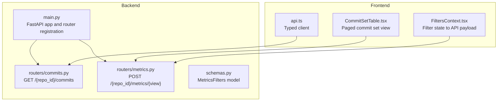
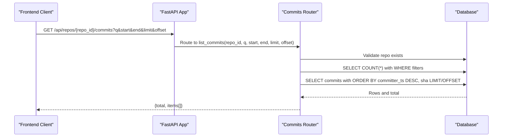
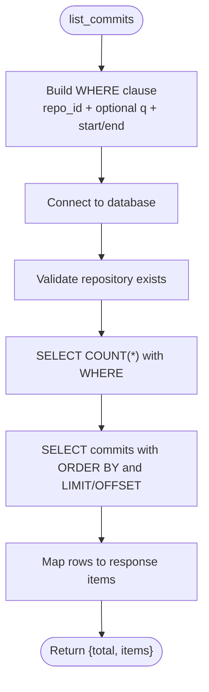

# Commit Search

<cite>
**Referenced Files in This Document**
- [commits.py](file://backend/app/routers/commits.py)
- [metrics.py](file://backend/app/routers/metrics.py)
- [schemas.py](file://backend/app/schemas.py)
- [main.py](file://backend/app/main.py)
- [api.ts](file://frontend/src/api.ts)
- [FiltersContext.tsx](file://frontend/src/state/FiltersContext.tsx)
- [CommitSetTable.tsx](file://frontend/src/components/CommitSetTable.tsx)
- [test_metrics.py](file://backend/tests/test_metrics.py)
</cite>

## Table of Contents
1. [Introduction](#introduction)
2. [Project Structure](#project-structure)
3. [Core Components](#core-components)
4. [Architecture Overview](#architecture-overview)
5. [Detailed Component Analysis](#detailed-component-analysis)
6. [Dependency Analysis](#dependency-analysis)
7. [Performance Considerations](#performance-considerations)
8. [Troubleshooting Guide](#troubleshooting-guide)
9. [Conclusion](#conclusion)

## Introduction
This document provides detailed API documentation for commit search and discovery, focusing on the GET endpoint that lists commits for a repository with filtering by date ranges, text search, and pagination. It also explains how this endpoint integrates with the broader filtering system used by metrics queries and the frontend components.

The primary endpoint is:
- GET /api/repos/{repo_id}/commits

It supports:
- Text search across commit identifiers, subjects, and author information
- Date range filtering using UNIX timestamps
- Pagination via limit and offset

## Project Structure
The commit search functionality is implemented in the backend FastAPI application and consumed by the frontend client. The relevant parts are:

- Backend router defining the commit list endpoint
- Metrics router defining shared filters and views
- Frontend API client exposing typed methods to call the endpoints
- Filters context translating UI state into backend-compatible filter payloads
- Tests validating behavior of related metric views

**Diagram sources**
- [main.py:24-27](file://backend/app/main.py#L24-L27)
- [commits.py:10-13](file://backend/app/routers/commits.py#L10-L13)
- [metrics.py:10-14](file://backend/app/routers/metrics.py#L10-L14)
- [api.ts:86-125](file://frontend/src/api.ts#L86-L125)
- [FiltersContext.tsx:93-104](file://frontend/src/state/FiltersContext.tsx#L93-L104)

**Section sources**
- [main.py:1-49](file://backend/app/main.py#L1-L49)
- [commits.py:1-103](file://backend/app/routers/commits.py#L1-L103)
- [metrics.py:1-41](file://backend/app/routers/metrics.py#L1-L41)
- [api.ts:1-127](file://frontend/src/api.ts#L1-L127)
- [FiltersContext.tsx:43-118](file://frontend/src/state/FiltersContext.tsx#L43-L118)

## Core Components
- Commit list endpoint: GET /api/repos/{repo_id}/commits
  - Purpose: List commits for a repository with optional text search and date range filters, returning paginated results.
  - Key behaviors:
    - Validates repository existence
    - Applies WHERE clauses for repo ID, optional text search, and optional timestamp range
    - Returns total count and paged items
- Metrics filter model: MetricsFilters
  - Purpose: Shared filter contract for metrics views (time range, commit list, authors, path, object type, granularity, pagination, only changed).
  - Relevance: Demonstrates how commit search complements the broader filtering system used by metrics queries.

**Section sources**
- [commits.py:13-60](file://backend/app/routers/commits.py#L13-L60)
- [schemas.py:14-24](file://backend/app/schemas.py#L14-L24)

## Architecture Overview
The commit search endpoint is part of the FastAPI application’s routers. The frontend uses a typed client to call it, while the metrics subsystem shares a common filter schema for consistent filtering across views.

**Diagram sources**
- [commits.py:13-60](file://backend/app/routers/commits.py#L13-L60)
- [main.py:24-27](file://backend/app/main.py#L24-L27)

## Detailed Component Analysis

### Endpoint: GET /api/repos/{repo_id}/commits
Purpose:
- Retrieve a paged list of commits for a given repository.
- Support filtering by:
  - Text pattern across commit SHA, subject, author name, and author email
  - Date range using UNIX timestamps (inclusive start, exclusive end)
- Return metadata including commit identifiers, short SHA, timestamp, author info, and subject.

Request parameters:
- Path parameter:
  - repo_id: integer, required
- Query parameters:
  - q: string, optional; text search pattern applied to SHA, subject, author name, and author email
  - start: integer, optional; inclusive lower bound for committer timestamp (UNIX seconds)
  - end: integer, optional; exclusive upper bound for committer timestamp (UNIX seconds)
  - limit: integer, default 100; page size, constrained between 1 and 500
  - offset: integer, default 0; number of records to skip

Response format:
- Object with:
  - total: integer; total number of matching commits
  - items: array of commit objects, each containing:
    - sha: string; full commit identifier
    - short: string; first 10 characters of sha
    - committer_ts: integer; UNIX timestamp of commit
    - author: string; display name
    - author_key: string; normalized author identity key
    - subject: string; commit message subject

Behavior details:
- Repository validation: Ensures the repository exists before querying commits.
- Text search: When provided, applies a case-insensitive substring match across multiple fields.
- Date range: Uses committer timestamp with inclusive start and exclusive end semantics.
- Ordering: Results are ordered by descending committer timestamp, then by SHA.
- Pagination: Uses SQL LIMIT and OFFSET based on limit and offset parameters.

Practical examples:
- Find commits within a date range:
  - Provide start and end as UNIX timestamps to restrict results to a specific time window.
- Find commits by author activity:
  - Use q to search author names or emails to narrow down commits authored by a specific person.
- Find commits by content changes:
  - Use q to search commit subjects or SHAs to locate commits related to specific files or topics.

Notes:
- The endpoint returns commit metadata but not per-file change details. For file-level changes, use the metrics “commits” view with appropriate filters.

**Section sources**
- [commits.py:13-60](file://backend/app/routers/commits.py#L13-L60)

### Integration with Filtering System and Metrics Queries
Shared filter model:
- MetricsFilters defines a consistent filter contract used by metrics views:
  - start: inclusive UNIX timestamp
  - end: exclusive UNIX timestamp
  - commits: explicit list of commit SHAs
  - authors: list of author keys
  - path: path filter
  - object_type: “file” or “dir”
  - granularity: “day”, “week”, or “month”
  - limit and offset: pagination
  - only_changed: boolean to include only commits affecting selected paths

Metrics endpoint:
- POST /api/repos/{repo_id}/metrics/{view} accepts MetricsFilters and returns view-specific data.
- Views include summary, files, dirs, authors, timeseries, and commits.

Frontend integration:
- FiltersContext translates UI state into MetricsFilters, ensuring consistent semantics across components.
- CommitSetTable consumes the “commits” metrics view with pagination and optional only_changed flag.

Relationship to commit search:
- While GET /api/repos/{repo_id}/commits focuses on listing commits with simple query parameters, the metrics system provides richer filtering and aggregation capabilities.
- Both systems share concepts like time ranges and author identities, enabling cohesive user experiences across commit browsing and analytics.

**Section sources**
- [schemas.py:14-24](file://backend/app/schemas.py#L14-L24)
- [metrics.py:13-40](file://backend/app/routers/metrics.py#L13-L40)
- [FiltersContext.tsx:93-104](file://frontend/src/state/FiltersContext.tsx#L93-L104)
- [CommitSetTable.tsx:12-26](file://frontend/src/components/CommitSetTable.tsx#L12-L26)

### Example Requests and Responses
- Request example (date range):
  - GET /api/repos/123/commits?start=1700000000&end=1700086400&limit=50&offset=0
- Request example (text search):
  - GET /api/repos/123/commits?q=fix+auth&limit=100
- Response example:
  - {
      "total": 12,
      "items": [
        {
          "sha": "abcdef1234567890...",
          "short": "abcdef1234",
          "committer_ts": 1700000000,
          "author": "Jane Doe",
          "author_key": "i:jane@example.com",
          "subject": "Fix authentication flow"
        }
      ]
    }

Note:
- Replace placeholder values with actual repository IDs, timestamps, and search terms.

**Section sources**
- [commits.py:13-60](file://backend/app/routers/commits.py#L13-L60)

## Dependency Analysis
The commit search endpoint depends on:
- Database connection utilities for executing queries
- Author join logic to enrich commit rows with author identity and name
- Repository validation helper to ensure the repository exists

**Diagram sources**
- [commits.py:20-49](file://backend/app/routers/commits.py#L20-L49)

**Section sources**
- [commits.py:1-103](file://backend/app/routers/commits.py#L1-L103)

## Performance Considerations
- Pagination constraints:
  - limit is bounded between 1 and 500 to prevent excessive result sets.
  - offset allows deep paging but may be less efficient for very large offsets.
- Indexing:
  - Ensure indexes exist on committer_ts and repo_id to optimize range queries and filtering.
- Text search:
  - LIKE patterns can be expensive; consider full-text search extensions if performance becomes an issue.
- Ordering:
  - ORDER BY committer_ts DESC, sha ensures deterministic ordering; index on committer_ts helps performance.

[No sources needed since this section provides general guidance]

## Troubleshooting Guide
Common issues and resolutions:
- Repository not found:
  - The endpoint validates repository existence; ensure repo_id corresponds to an existing repository.
- Invalid parameters:
  - limit must be between 1 and 500; offset must be non-negative.
- Empty results:
  - Adjust q, start, or end parameters to broaden the search scope.
- Timestamp semantics:
  - start is inclusive; end is exclusive. Verify your timestamp boundaries when constructing queries.

Related tests:
- The metrics tests demonstrate expected behavior for commit-related views, including ordering and scoping by path and object type.

**Section sources**
- [commits.py:36-49](file://backend/app/routers/commits.py#L36-L49)
- [test_metrics.py:298-309](file://backend/tests/test_metrics.py#L298-L309)

## Conclusion
The GET /api/repos/{repo_id}/commits endpoint provides a straightforward way to search and paginate commits using text patterns and date ranges. It integrates seamlessly with the broader filtering system through shared concepts like timestamps and author identities, complementing the richer metrics views that support advanced filtering and aggregation. By leveraging pagination and careful parameterization, clients can efficiently explore commit histories and build powerful analytics dashboards.

[No sources needed since this section summarizes without analyzing specific files]