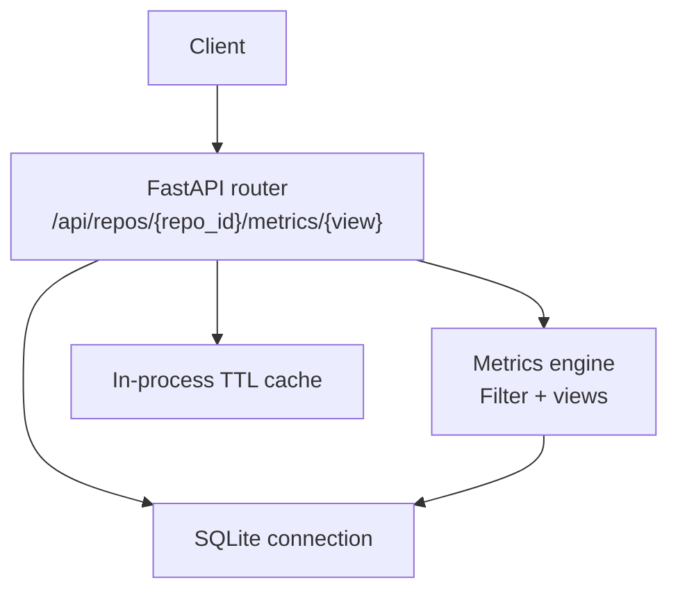
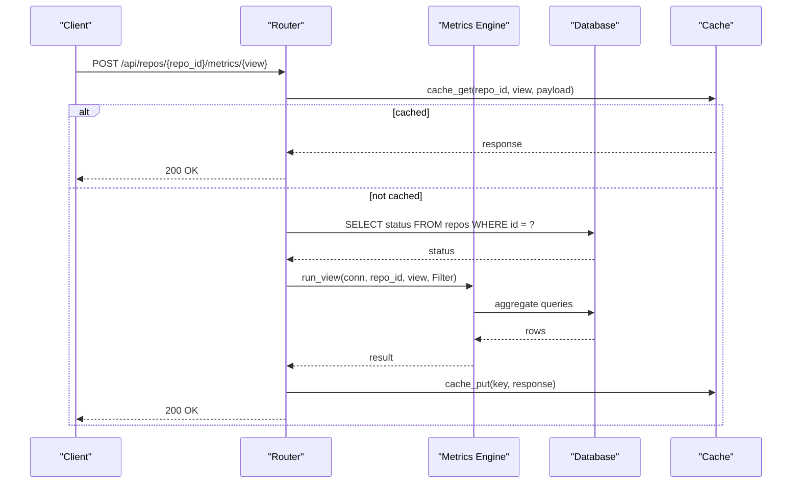
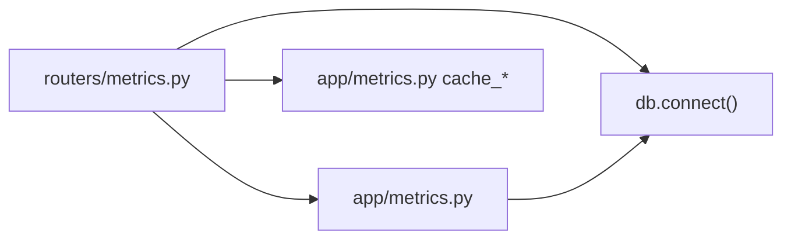

# Metrics Queries

<cite>
**Referenced Files in This Document**
- [metrics.py](file://backend/app/routers/metrics.py)
- [metrics.py](file://backend/app/metrics.py)
- [schemas.py](file://backend/app/schemas.py)
- [README.md](file://README.md)
</cite>

## Table of Contents
1. [Introduction](#introduction)
2. [Project Structure](#project-structure)
3. [Core Components](#core-components)
4. [Architecture Overview](#architecture-overview)
5. [Detailed Component Analysis](#detailed-component-analysis)
6. [Dependency Analysis](#dependency-analysis)
7. [Performance Considerations](#performance-considerations)
8. [Troubleshooting Guide](#troubleshooting-guide)
9. [Conclusion](#conclusion)
10. [Appendices](#appendices)

## Introduction
This document provides comprehensive API documentation for the metrics query endpoints that power repository analytics. It focuses on the single endpoint used to request metric views, its shared filter schema, supported view types, pagination behavior, response formats, performance characteristics, and caching strategy. The goal is to help both frontend developers and external consumers understand how to query file growth, author contributions, directory analysis, and time-series data with precise control over commit selection, author filtering, path scoping, and time ranges.

The system computes metrics over a commit set H defined either by:
- A time range using inclusive start and exclusive end timestamps, or
- A manually selected list of commits.

All metric formulas are implemented in one place and validated against golden values.

**Section sources**
- [README.md:39-65](file://README.md#L39-L65)
- [README.md:111-142](file://README.md#L111-L142)

## Project Structure
The metrics feature spans three backend files:
- Router layer: exposes the HTTP endpoint and validates the view name.
- Metrics engine: implements filters, SQL aggregation, derived metrics, and per-view logic.
- Schema layer: defines the request model for all metric queries.

**Diagram sources**
- [metrics.py:13-40](file://backend/app/routers/metrics.py#L13-L40)
- [metrics.py:43-396](file://backend/app/metrics.py#L43-L396)
- [metrics.py:407-435](file://backend/app/metrics.py#L407-L435)

**Section sources**
- [metrics.py:1-40](file://backend/app/routers/metrics.py#L1-L40)
- [metrics.py:1-435](file://backend/app/metrics.py#L1-L435)
- [schemas.py:14-25](file://backend/app/schemas.py#L14-L25)

## Core Components
- Endpoint: POST /api/repos/{repo_id}/metrics/{view}.
- Shared filter body: MetricsFilters.
- Supported views: summary, files, dirs, authors, timeseries, commits.
- Caching: short-TTL in-memory cache keyed by repo_id, view, and normalized payload.

Key responsibilities:
- Router validates view name, checks repository existence and readiness, builds Filter, runs the view, wraps the result, and caches it.
- Metrics engine materializes commit selection, constructs the commit-set CTE, applies object scoping, and returns typed results per view.
- Schemas define the request contract.

**Section sources**
- [metrics.py:13-40](file://backend/app/routers/metrics.py#L13-L40)
- [metrics.py:43-128](file://backend/app/metrics.py#L43-L128)
- [metrics.py:389-400](file://backend/app/metrics.py#L389-L400)
- [schemas.py:14-25](file://backend/app/schemas.py#L14-L25)

## Architecture Overview
The endpoint follows a layered flow: validation → cache lookup → repository check → filter construction → view execution → response wrapping → cache write.

**Diagram sources**
- [metrics.py:13-40](file://backend/app/routers/metrics.py#L13-L40)
- [metrics.py:399-400](file://backend/app/metrics.py#L399-L400)
- [metrics.py:407-435](file://backend/app/metrics.py#L407-L435)

## Detailed Component Analysis

### Endpoint Specification
- Method: POST
- Path: /api/repos/{repo_id}/metrics/{view}
- Path parameters:
  - repo_id: integer repository identifier.
  - view: string view name from the supported set.
- Request body: MetricsFilters (all fields optional unless otherwise noted).
- Success response: JSON object containing repo_id, view, and view-specific data.
- Error responses:
  - 404 when view is unknown or repository not found.
  - 409 when repository exists but is not ready.

Supported views:
- summary
- files
- dirs
- authors
- timeseries
- commits

Request schema: MetricsFilters
- start: integer or null; inclusive UNIX timestamp.
- end: integer or null; exclusive UNIX timestamp.
- commits: array of strings; manual commit SHA selection; overrides time range when present.
- authors: array of strings; author keys such as i:<email> or m:<group id>.
- path: string or null; file or directory path scope.
- object_type: "file" | "dir" | null; clarifies path semantics.
- granularity: "day" | "week" | "month"; default "month".
- limit: integer; default 500; capped internally per view.
- offset: integer; default 0.
- only_changed: boolean; affects commits view to include only commits touching the current object scope.

Response envelope:
- repo_id: integer
- view: string
- plus view-specific fields described below.

**Section sources**
- [metrics.py:13-40](file://backend/app/routers/metrics.py#L13-L40)
- [schemas.py:14-25](file://backend/app/schemas.py#L14-L25)
- [README.md:111-142](file://README.md#L111-L142)

### Filter Semantics and Object Scoping
Commit set H:
- If commits is provided, H equals the selected SHAs.
- Otherwise, H includes commits whose committer_ts falls within [start, end), where start is inclusive and end is exclusive.

Author filtering:
- When authors is provided, H is further restricted to commits attributed to those author keys after identity merging.

Object scoping:
- path selects a specific file or directory subtree.
- object_type=file restricts to exact path equality.
- object_type=dir uses prefix-based subtree scoping.
- When no path is set, metrics apply to the entire repository root.

Derived metrics:
- added, removed, growth (= added − removed), churn (= added + removed).
- modifications: number of distinct commits changing the object.
- modification_frequency: modifications / |H| (0 when |H|=0).
- churn_rate: churn / |H| (0 when |H|=0).

**Section sources**
- [metrics.py:43-64](file://backend/app/metrics.py#L43-L64)
- [metrics.py:76-128](file://backend/app/metrics.py#L76-L128)
- [README.md:39-65](file://README.md#L39-L65)

### View: summary
Purpose:
- Aggregate metrics for a single object (file, directory) or the whole repository when no path is set.

Input:
- Any valid MetricsFilters.

Output:
- commit_count: integer size of H.
- object: { path, type } where type is "file", "dir", or "root".
- Derived metrics: added, removed, growth, churn, modifications, modification_frequency, churn_rate.

Use cases:
- Repository-level overview.
- File-level snapshot of growth/churn.
- Directory subtree totals.

**Section sources**
- [metrics.py:135-155](file://backend/app/metrics.py#L135-L155)

### View: files
Purpose:
- Per-file metrics for every file under the selected object scope.

Input:
- Filters including optional path/object_type to scope to a directory.

Output:
- commit_count: integer size of H.
- items: array of file rows, each including path and derived metrics.
- Sorting: ordered by total churn descending, then path.
- Pagination: limited by limit (internally clamped between 1 and 20,000).

Practical example:
- Query files under src/ to see top churned files in a time window.

**Section sources**
- [metrics.py:158-183](file://backend/app/metrics.py#L158-L183)

### View: dirs
Purpose:
- Per-directory metrics computed as recursive sums across the subtree.
- Modifications are de-duplicated per commit: if a commit touches multiple files in the same directory, it counts once for that directory.

Input:
- Filters including path/object_type="dir" to scope to a directory.

Output:
- commit_count: integer size of H.
- items: array of directory rows including path, depth, and derived metrics.
- Includes the scope node itself even if empty.

Practical example:
- Analyze churn distribution across subdirectories of a project.

**Section sources**
- [metrics.py:186-248](file://backend/app/metrics.py#L186-L248)

### View: authors
Purpose:
- Per-author contribution metrics for the selected object scope.

Input:
- Optional authors filter to pre-select contributors; otherwise aggregates across all authors in H.

Output:
- commit_count: integer size of H.
- churn_total: total churn across all authors for the scope.
- items: array of author rows including author_key, author, commits, modifications, churn, ownership.
- ownership: fraction of churn attributable to the author relative to churn_total.

Practical example:
- Identify top owners of a directory’s churn.

**Section sources**
- [metrics.py:251-279](file://backend/app/metrics.py#L251-L279)

### View: timeseries
Purpose:
- Time-bucketed metrics showing added, removed, growth, churn, commits, and modifications over time.

Input:
- granularity: day, week, or month.
- start/end define the time window; commits can override the window.

Output:
- commit_count: integer size of H.
- granularity: bucket resolution used.
- items: array of buckets with bucket (string label), bucket_ts (UNIX timestamp), and derived metrics.

Bucketing details:
- day: calendar day boundaries.
- week: ISO-like week alignment.
- month: first day of each month.

Practical example:
- Plot monthly growth and churn for a repository or directory.

**Section sources**
- [metrics.py:282-329](file://backend/app/metrics.py#L282-L329)

### View: commits
Purpose:
- Paged listing of commits in H with their object-level stats.

Input:
- limit and offset for pagination.
- only_changed=true to include only commits that touch the current object scope.

Output:
- commit_count: total matching commits (may differ from H size when only_changed is true).
- total: alias for commit_count.
- items: array of commit entries including sha, short, committer_ts, author, author_key, subject, added, removed, churn.

Pagination:
- limit is clamped between 1 and 1000.
- offset defaults to 0.

Practical example:
- Browse commits affecting a directory, optionally filtered to only those that changed files in that directory.

**Section sources**
- [metrics.py:332-386](file://backend/app/metrics.py#L332-L386)

### Request Examples
Below are conceptual examples describing how to compose requests. Replace placeholders with actual values.

- File growth metrics for a directory:
  - POST /api/repos/{repo_id}/metrics/files
  - Body: { path: "src", object_type: "dir", start: <ts>, end: <ts>, limit: 500 }

- Author contributions for a file:
  - POST /api/repos/{repo_id}/metrics/authors
  - Body: { path: "src/lib/util.ts", object_type: "file", authors: ["i:alice@example.com"] }

- Directory analysis:
  - POST /api/repos/{repo_id}/metrics/dirs
  - Body: { path: "src", object_type: "dir" }

- Monthly time-series:
  - POST /api/repos/{repo_id}/metrics/timeseries
  - Body: { granularity: "month", start: <ts>, end: <ts> }

- Weekly time-series with author filter:
  - POST /api/repos/{repo_id}/metrics/timeseries
  - Body: { granularity: "week", authors: ["m:3"], start: <ts>, end: <ts> }

- Manual commit selection:
  - POST /api/repos/{repo_id}/metrics/files
  - Body: { commits: ["abc123def", "fedcba987"], limit: 1000 }

- Only-changed commits for a directory:
  - POST /api/repos/{repo_id}/metrics/commits
  - Body: { path: "docs", object_type: "dir", only_changed: true, limit: 50, offset: 0 }

**Section sources**
- [schemas.py:14-25](file://backend/app/schemas.py#L14-L25)
- [metrics.py:158-183](file://backend/app/metrics.py#L158-L183)
- [metrics.py:251-279](file://backend/app/metrics.py#L251-L279)
- [metrics.py:282-329](file://backend/app/metrics.py#L282-L329)
- [metrics.py:332-386](file://backend/app/metrics.py#L332-L386)

## Dependency Analysis
The endpoint depends on:
- FastAPI router for HTTP handling.
- Database connection helper for SQLite access.
- Metrics engine for filter application, SQL generation, and view computation.
- In-process cache for repeated queries.

**Diagram sources**
- [metrics.py:13-40](file://backend/app/routers/metrics.py#L13-L40)
- [metrics.py:399-400](file://backend/app/metrics.py#L399-L400)
- [metrics.py:407-435](file://backend/app/metrics.py#L407-L435)

**Section sources**
- [metrics.py:13-40](file://backend/app/routers/metrics.py#L13-L40)
- [metrics.py:399-435](file://backend/app/metrics.py#L399-L435)

## Performance Considerations
- Index usage:
  - Queries rely on indexes such as (repo_id, committer_ts), (repo_id, path), and primary key (repo_id, sha, path).
- Directory metrics:
  - Computed via a single ordered scan with per-commit modification de-duplication.
  - Path scoping uses index-friendly range conditions.
- Commit selection:
  - Manual commit lists are materialized into a temporary table to avoid expensive IN clauses.
- Limits and offsets:
  - Views clamp limits to safe bounds to prevent excessive payloads.
- Caching:
  - Responses are cached with a short TTL to absorb repeated dashboard queries.

Measured latencies demonstrate that views remain interactive even for large repositories.

**Section sources**
- [README.md:170-196](file://README.md#L170-L196)
- [metrics.py:67-74](file://backend/app/metrics.py#L67-L74)
- [metrics.py:163-176](file://backend/app/metrics.py#L163-L176)
- [metrics.py:195-248](file://backend/app/metrics.py#L195-L248)
- [metrics.py:343-360](file://backend/app/metrics.py#L343-L360)
- [metrics.py:407-435](file://backend/app/metrics.py#L407-L435)

## Troubleshooting Guide
Common issues and resolutions:

- Unknown view:
  - Symptom: 404 with detail about an unknown metric view.
  - Cause: view parameter not in the supported set.
  - Resolution: use one of summary, files, dirs, authors, timeseries, commits.

- Repository not found:
  - Symptom: 404 with repository not found.
  - Cause: repo_id does not exist.
  - Resolution: verify repo_id and ensure the repository was ingested.

- Repository not ready:
  - Symptom: 409 with repository not ready yet.
  - Cause: ingestion still in progress.
  - Resolution: wait until status becomes ready before querying metrics.

- Empty results:
  - Symptom: items arrays are empty.
  - Causes:
    - No commits match the time range or manual commit list.
    - Path scoping too narrow.
    - Authors filter excludes all commits.
  - Resolution: relax filters, remove path/object_type, or broaden time range.

- Large payloads:
  - Symptom: slow responses or large JSON bodies.
  - Causes: high limit values.
  - Resolution: reduce limit; use pagination for commits view.

- Stale data:
  - Symptom: metrics do not reflect recent changes.
  - Cause: in-process cache TTL.
  - Resolution: wait for TTL expiration or re-ingest repository to invalidate cache.

**Section sources**
- [metrics.py:13-40](file://backend/app/routers/metrics.py#L13-L40)
- [metrics.py:407-435](file://backend/app/metrics.py#L407-L435)

## Conclusion
The metrics query API provides a unified, efficient way to analyze repository history through a single endpoint with multiple views. By combining flexible filters—time ranges, manual commit selections, author scopes, and path scoping—with well-defined derived metrics, clients can build dashboards for file growth, author contributions, directory analysis, and time-series trends. The implementation emphasizes performance through indexed queries, careful aggregation, and short-TTL caching, ensuring responsive interactions even for large codebases.

[No sources needed since this section summarizes without analyzing specific files]

## Appendices

### Metric Definitions Summary
- added, removed: line deltas per commit.
- growth: added − removed.
- churn: added + removed.
- modifications: count of commits changing the object.
- modification_frequency: modifications / |H|.
- churn_rate: churn / |H|.
- ownership: author churn / total churn.

These definitions are enforced centrally and tested against golden values.

**Section sources**
- [README.md:39-65](file://README.md#L39-L65)