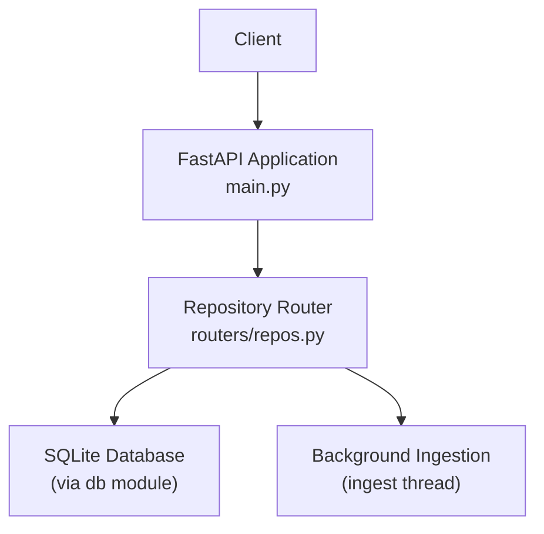
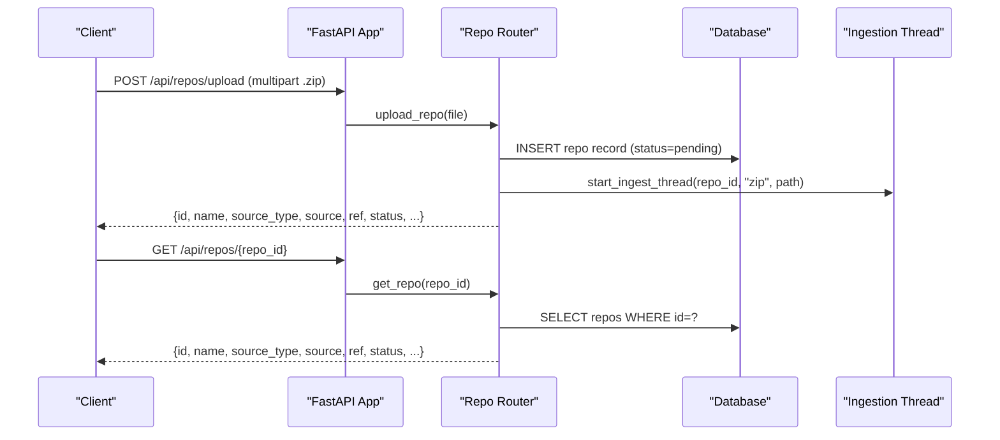
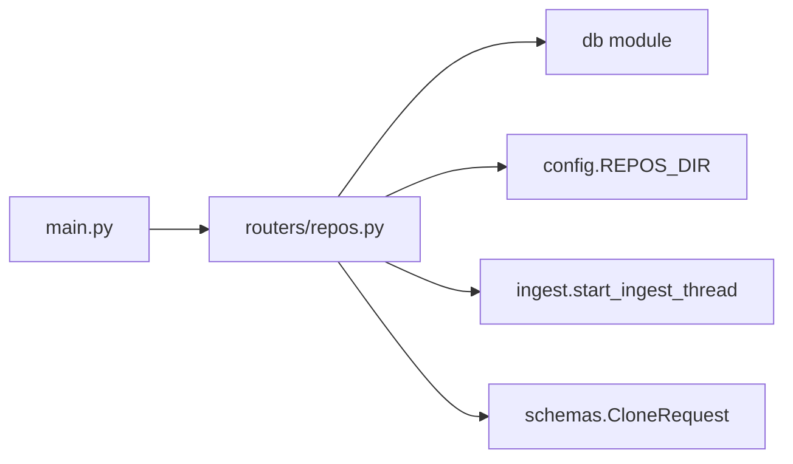

# Repository Management

<cite>
**Referenced Files in This Document**
- [repos.py](file://backend/app/routers/repos.py)
- [schemas.py](file://backend/app/schemas.py)
- [main.py](file://backend/app/main.py)
- [README.md](file://README.md)
</cite>

## Table of Contents
1. [Introduction](#introduction)
2. [Project Structure](#project-structure)
3. [Core Components](#core-components)
4. [Architecture Overview](#architecture-overview)
5. [Detailed Component Analysis](#detailed-component-analysis)
6. [Dependency Analysis](#dependency-analysis)
7. [Performance Considerations](#performance-considerations)
8. [Troubleshooting Guide](#troubleshooting-guide)
9. [Conclusion](#conclusion)

## Introduction
This document provides detailed API documentation for repository management endpoints. It covers listing repositories, uploading ZIP archives, cloning remote repositories from URLs, retrieving a specific repository’s details, and deleting a repository. It includes request/response schemas, validation rules, error handling, status codes, and practical examples for common operations such as uploading local repositories and cloning from GitHub.

## Project Structure
The repository management endpoints are implemented as a FastAPI router mounted under the application. The router defines routes for listing, uploading, cloning, retrieving, and deleting repositories. Request models are defined with Pydantic, and ingestion is performed asynchronously via background threads.

**Diagram sources**
- [main.py:24-27](file://backend/app/main.py#L24-L27)
- [repos.py:16-103](file://backend/app/routers/repos.py#L16-L103)

**Section sources**
- [main.py:1-49](file://backend/app/main.py#L1-L49)
- [repos.py:1-114](file://backend/app/routers/repos.py#L1-L114)

## Core Components
- Repository Router: Defines all repository-related endpoints under /api/repos.
- CloneRequest Model: Validates clone requests with URL and optional name fields.
- Background Ingestion: Starts an asynchronous ingestion process after upload or clone.
- Database Access: Reads/writes repository metadata and status.

Key responsibilities:
- Validate inputs (file type, ZIP integrity, URL format).
- Persist repository records and return minimal metadata.
- Trigger background ingestion to index repository history.
- Provide read/delete operations for repository lifecycle management.

**Section sources**
- [repos.py:16-114](file://backend/app/routers/repos.py#L16-L114)
- [schemas.py:9-12](file://backend/app/schemas.py#L9-L12)

## Architecture Overview
The repository management workflow follows these steps:
- Clients call repository endpoints through FastAPI.
- For uploads and clones, the server validates input, persists metadata, and starts a background ingestion thread.
- The ingestion process indexes repository data into SQLite; clients poll repository status until ready.

**Diagram sources**
- [repos.py:50-78](file://backend/app/routers/repos.py#L50-L78)
- [repos.py:97-100](file://backend/app/routers/repos.py#L97-L100)

## Detailed Component Analysis

### List Repositories
- Endpoint: GET /api/repos
- Purpose: Retrieve a list of all repositories with their current status and progress.
- Response: Array of repository objects containing fields such as id, name, source_type, source, ref, status, progress, progress_detail, error, head_sha, commit_count, have_mailmap, created_at, and path.
- Status Codes:
  - 200 OK: Successful retrieval.
- Notes:
  - Results are ordered by creation time and ID descending.
  - Use this endpoint to monitor ingestion progress and readiness.

Response schema (fields):
- id: integer
- name: string
- source_type: string ("zip" or "clone")
- source: string (filename or URL)
- ref: string
- status: string ("pending", "cloning", "indexing", "ready", "error")
- progress: number
- progress_detail: string
- error: string | null
- head_sha: string | null
- commit_count: integer
- have_mailmap: boolean
- created_at: integer (UNIX timestamp)
- path: string (on-disk path)

Example response:
[{"id": 1, "name": "example-repo", "source_type": "zip", "source": "example.zip", "ref": "HEAD", "status": "ready", "progress": 100, "progress_detail": "", "error": null, "head_sha": "abc123...", "commit_count": 1234, "have_mailmap": false, "created_at": 1710000000, "path": "/data/repos/1"}]

**Section sources**
- [repos.py:43-47](file://backend/app/routers/repos.py#L43-L47)
- [repos.py:18-24](file://backend/app/routers/repos.py#L18-L24)

### Upload Repository (ZIP)
- Endpoint: POST /api/repos/upload
- Purpose: Accept a ZIP archive of a repository and start background ingestion.
- Request:
  - Content-Type: multipart/form-data
  - Field: file (required)
  - Allowed formats: .zip only (validated by extension and ZIP integrity check)
- Validation Rules:
  - File must be present and have a filename.
  - Filename suffix must be .zip.
  - Uploaded content must pass zipfile.is_zipfile validation.
- Processing:
  - Streams chunks up to 1 MiB at a time to avoid large memory usage.
  - Persists a temporary file, validates ZIP integrity, then creates a repository record with status "pending".
  - Starts a background ingestion thread to index the repository.
- Response:
  - Returns the repository object with initial status "pending".
- Status Codes:
  - 200 OK: Upload accepted and ingestion started.
  - 400 Bad Request: Missing filename, invalid extension, or not a valid ZIP.
  - 500 Internal Server Error: Failure to store the uploaded file.

Request example (curl):
curl -X POST http://localhost:8000/api/repos/upload -F "file=@/path/to/repo.zip"

Response schema:
- Same as repository object described in List Repositories.

Error responses:
- 400: Missing file name.
- 400: Please upload a .zip archive of the repository.
- 400: The uploaded file is not a valid zip archive.
- 500: Could not store upload: <OS error>.

**Section sources**
- [repos.py:50-78](file://backend/app/routers/repos.py#L50-L78)

### Clone Remote Repository
- Endpoint: POST /api/repos/clone
- Purpose: Clone a remote Git repository using a provided URL and start background ingestion.
- Request Body:
  - url: string (required)
  - name: string | null (optional; if omitted, derived from URL tail)
- URL Validation Rules:
  - Must start with http://, https://, git://, ssh://, or git@.
  - If name is not provided, it is inferred from the last segment of the URL, stripping a trailing ".git" if present.
- Processing:
  - Creates a repository record with source_type "clone" and status "pending".
  - Starts a background ingestion thread to clone and index the repository.
- Response:
  - Returns the repository object with initial status "pending".
- Status Codes:
  - 200 OK: Clone initiated and ingestion started.
  - 400 Bad Request: Invalid URL format.

Request example (JSON):
{
  "url": "https://github.com/DaveGamble/cJSON.git",
  "name": "cJSON"
}

Response schema:
- Same as repository object described in List Repositories.

Error responses:
- 400: Provide a valid git URL (https://, ssh:// or git@…).

**Section sources**
- [repos.py:81-94](file://backend/app/routers/repos.py#L81-L94)
- [schemas.py:9-12](file://backend/app/schemas.py#L9-L12)

### Get Repository Details
- Endpoint: GET /api/repos/{repo_id}
- Purpose: Retrieve details for a specific repository, including status, progress, and errors.
- Path Parameter:
  - repo_id: integer (required)
- Response:
  - Single repository object.
- Status Codes:
  - 200 OK: Repository found.
  - 404 Not Found: Repository does not exist.

Example response:
{"id": 1, "name": "example-repo", "source_type": "zip", "source": "example.zip", "ref": "HEAD", "status": "ready", "progress": 100, "progress_detail": "", "error": null, "head_sha": "abc123...", "commit_count": 1234, "have_mailmap": false, "created_at": 1710000000, "path": "/data/repos/1"}

**Section sources**
- [repos.py:97-100](file://backend/app/routers/repos.py#L97-L100)
- [repos.py:27-31](file://backend/app/routers/repos.py#L27-L31)

### Delete Repository
- Endpoint: DELETE /api/repos/{repo_id}
- Purpose: Remove a repository’s database row and on-disk data.
- Path Parameter:
  - repo_id: integer (required)
- Behavior:
  - Verifies existence before deletion.
  - Deletes the repository directory on disk if present.
  - Invalidates any cached metrics for the repository.
- Response:
  - {"ok": true}
- Status Codes:
  - 200 OK: Deletion successful.
  - 404 Not Found: Repository does not exist.

Example response:
{"ok": true}

**Section sources**
- [repos.py:103-113](file://backend/app/routers/repos.py#L103-L113)

## Dependency Analysis
The repository management endpoints depend on:
- FastAPI Router and HTTP utilities for request handling and error responses.
- Database module for SQLite interactions.
- Configuration for repository storage directory.
- Ingestion module to start background processing.
- Schemas module for request validation.

**Diagram sources**
- [repos.py:9-14](file://backend/app/routers/repos.py#L9-L14)
- [main.py:24-27](file://backend/app/main.py#L24-L27)

**Section sources**
- [repos.py:9-14](file://backend/app/routers/repos.py#L9-L14)
- [main.py:24-27](file://backend/app/main.py#L24-L27)

## Performance Considerations
- Streaming Uploads: The upload endpoint reads files in 1 MiB chunks to limit memory usage during ingestion preparation.
- Background Ingestion: Cloning and indexing run asynchronously, allowing immediate responses while heavy work proceeds in the background.
- Database Operations: Repository metadata is persisted quickly; actual indexing occurs off the critical path.
- Cache Invalidation: Deleting a repository clears associated metric caches to ensure consistency.

[No sources needed since this section provides general guidance]

## Troubleshooting Guide
Common issues and resolutions:
- Missing file name: Ensure the multipart form includes a file field with a filename.
- Invalid file format: Only .zip archives are accepted; verify the file extension and that the content is a valid ZIP.
- Storage errors: If the server cannot write the temporary upload file, a 500 error will be returned; check filesystem permissions and available disk space.
- Invalid URL: For cloning, ensure the URL starts with http://, https://, git://, ssh://, or git@.
- Repository not found: When retrieving or deleting, confirm the repo_id exists.

Status code reference:
- 200 OK: Success for list, get, delete, and accepted upload/clone.
- 400 Bad Request: Input validation failures (missing file, invalid extension, invalid ZIP, invalid URL).
- 404 Not Found: Repository does not exist.
- 500 Internal Server Error: Server-side failure (e.g., unable to store upload).

**Section sources**
- [repos.py:50-78](file://backend/app/routers/repos.py#L50-L78)
- [repos.py:81-94](file://backend/app/routers/repos.py#L81-L94)
- [repos.py:97-113](file://backend/app/routers/repos.py#L97-L113)

## Conclusion
The repository management API provides a complete lifecycle for ingesting and managing repositories via ZIP uploads and remote cloning. Inputs are validated early, background ingestion ensures responsive operations, and consistent response schemas enable straightforward client integration. Use the list endpoint to monitor ingestion progress and the detail endpoint to inspect repository state. Errors are clearly categorized with appropriate status codes to facilitate robust client error handling.

[No sources needed since this section summarizes without analyzing specific files]