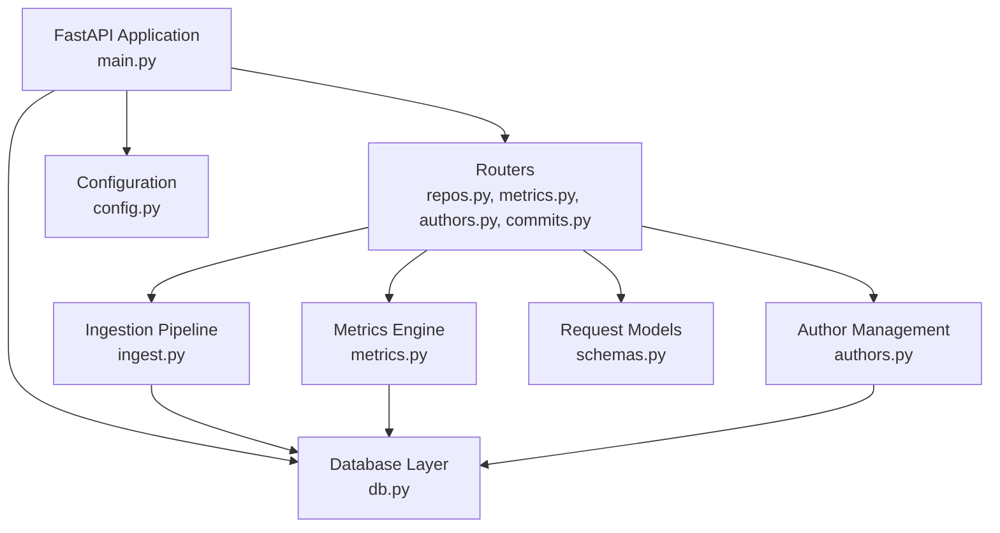
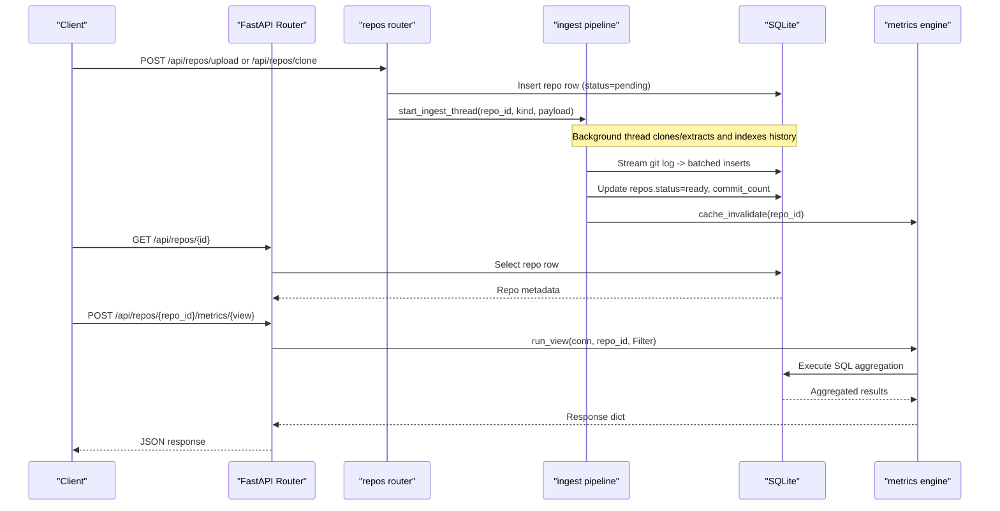
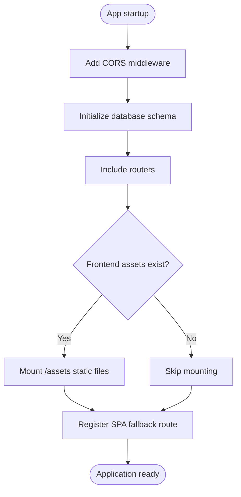
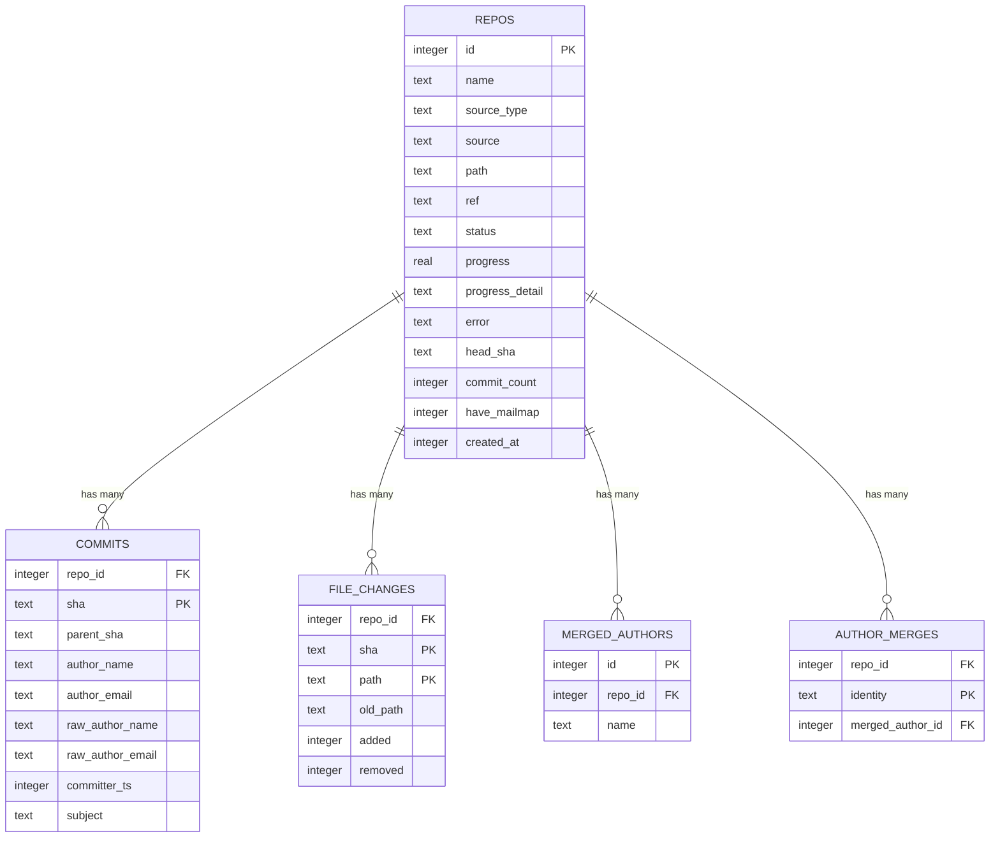
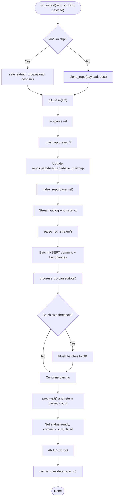
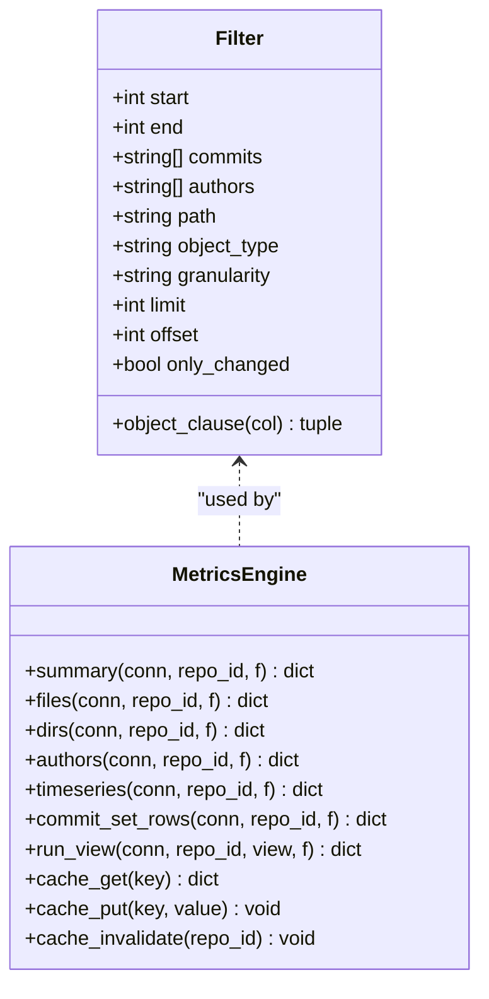
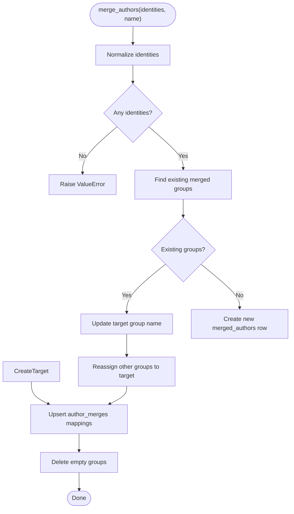
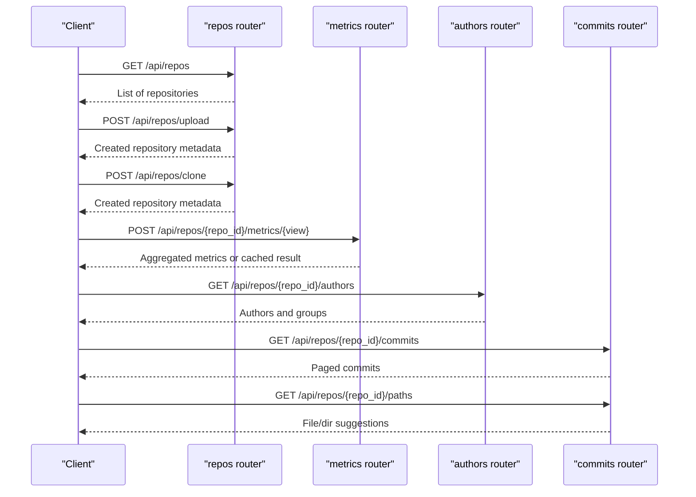
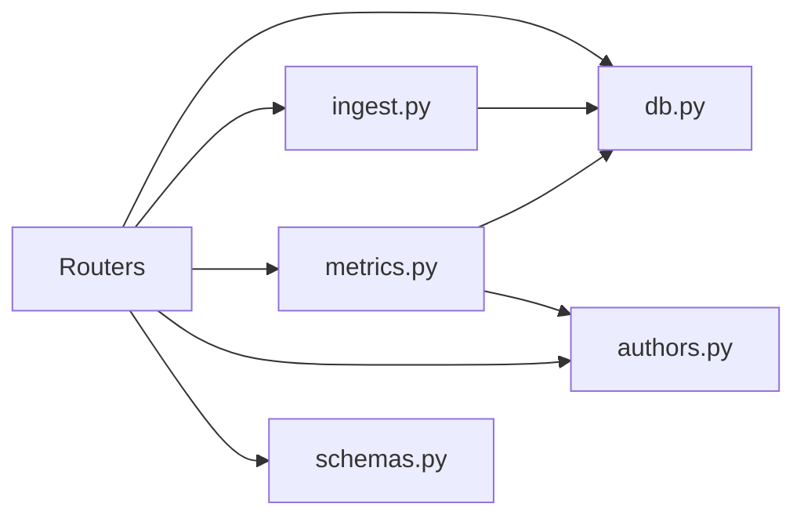

# Backend Documentation

<cite>
**Referenced Files in This Document**
- [main.py](file://backend/app/main.py)
- [config.py](file://backend/app/config.py)
- [db.py](file://backend/app/db.py)
- [ingest.py](file://backend/app/ingest.py)
- [metrics.py](file://backend/app/metrics.py)
- [schemas.py](file://backend/app/schemas.py)
- [authors.py](file://backend/app/authors.py)
- [routers/repos.py](file://backend/app/routers/repos.py)
- [routers/metrics.py](file://backend/app/routers/metrics.py)
- [routers/authors.py](file://backend/app/routers/authors.py)
- [routers/commits.py](file://backend/app/routers/commits.py)
</cite>

## Table of Contents
1. [Introduction](#introduction)
2. [Project Structure](#project-structure)
3. [Core Components](#core-components)
4. [Architecture Overview](#architecture-overview)
5. [Detailed Component Analysis](#detailed-component-analysis)
6. [Dependency Analysis](#dependency-analysis)
7. [Performance Considerations](#performance-considerations)
8. [Troubleshooting Guide](#troubleshooting-guide)
9. [Conclusion](#conclusion)
10. [Appendices](#appendices)

## Introduction
This document describes the backend of RAT, a Python FastAPI service that ingests Git repositories and exposes analysis APIs for commits, authors, paths, and metrics. The backend is organized around:

- A FastAPI application with modular routers per feature area.
- A centralized SQLite database layer with schema initialization and connection helpers.
- An ingestion pipeline that clones or extracts repositories and streams `git log` output into SQLite.
- A SQL-based metrics engine that computes file, directory, author, timeseries, and commit-set metrics.
- Configuration management through environment variables and path resolution.
- Error handling patterns using HTTP exceptions and ingestion-specific errors.
- Performance optimizations including WAL mode, indexes, batched inserts, streaming parsing, and an in-process TTL cache for expensive metric views.

The goal is to provide both high-level architectural understanding and code-level guidance for developers extending or debugging the system.

## Project Structure
The backend lives under `backend/app`. The main entry point initializes CORS, mounts static assets, registers routers, and ensures the database schema exists. Routers are split by domain: repositories, metrics, authors, and commits. Shared concerns like configuration, database access, ingestion, metrics computation, and request schemas live at the app level.

**Diagram sources**
- [main.py:13-27](file://backend/app/main.py#L13-L27)
- [config.py:7-14](file://backend/app/config.py#L7-L14)
- [db.py:13-87](file://backend/app/db.py#L13-L87)
- [ingest.py:1-439](file://backend/app/ingest.py#L1-L439)
- [metrics.py:1-435](file://backend/app/metrics.py#L1-L435)
- [authors.py:1-131](file://backend/app/authors.py#L1-L131)
- [schemas.py:1-30](file://backend/app/schemas.py#L1-L30)
- [routers/repos.py:1-114](file://backend/app/routers/repos.py#L1-L114)
- [routers/metrics.py:1-41](file://backend/app/routers/metrics.py#L1-L41)
- [routers/authors.py:1-50](file://backend/app/routers/authors.py#L1-L50)
- [routers/commits.py:1-103](file://backend/app/routers/commits.py#L1-L103)

**Section sources**
- [main.py:1-49](file://backend/app/main.py#L1-L49)
- [config.py:1-15](file://backend/app/config.py#L1-L15)

## Core Components
- Application bootstrap and routing:
  - Initializes FastAPI, adds CORS middleware, includes routers, serves frontend assets, and provides SPA fallback.
- Configuration:
  - Resolves base directories, data directory, repository storage, database path, and frontend distribution path from environment variables.
- Database layer:
  - Defines schema for repositories, commits, file changes, merged authors, and author merges.
  - Provides tuned SQLite connections with WAL mode, synchronous settings, and foreign key enforcement.
- Ingestion pipeline:
  - Clones repositories or extracts zip archives safely.
  - Streams `git log` output and parses it incrementally into commit records and file changes.
  - Batches writes to SQLite and updates repository status and progress.
- Metrics engine:
  - Implements filters, CTEs, and SQL queries for summary, files, directories, authors, timeseries, and commit sets.
  - Includes a small in-memory TTL cache keyed by repo, view, and serialized filter payload.
- Author management:
  - Lists identities, merges identities into groups, and unmerges identities or groups.
  - Applies merged-author logic via shared SQL fragments used across metrics queries.
- Request schemas:
  - Pydantic models for clone requests, metrics filters, and merge requests.

**Section sources**
- [main.py:13-49](file://backend/app/main.py#L13-L49)
- [config.py:7-14](file://backend/app/config.py#L7-L14)
- [db.py:13-87](file://backend/app/db.py#L13-L87)
- [ingest.py:45-439](file://backend/app/ingest.py#L45-L439)
- [metrics.py:43-435](file://backend/app/metrics.py#L43-L435)
- [authors.py:15-131](file://backend/app/authors.py#L15-L131)
- [schemas.py:9-30](file://backend/app/schemas.py#L9-L30)

## Architecture Overview
The backend follows a layered architecture:

- API layer (FastAPI routers):
  - Exposes REST endpoints for repository lifecycle, metrics queries, author management, and commit/path browsing.
- Service layer (domain modules):
  - Ingestion orchestrates acquisition and indexing.
  - Metrics computes aggregates using SQL and a small cache.
  - Authors manages identity merging and group membership.
- Data layer (SQLite):
  - Schema defines core entities and relationships.
  - Connection helper configures performance and integrity options.

**Diagram sources**
- [routers/repos.py:43-94](file://backend/app/routers/repos.py#L43-L94)
- [ingest.py:362-439](file://backend/app/ingest.py#L362-L439)
- [routers/metrics.py:13-41](file://backend/app/routers/metrics.py#L13-L41)
- [metrics.py:399-435](file://backend/app/metrics.py#L399-L435)
- [db.py:74-87](file://backend/app/db.py#L74-L87)

## Detailed Component Analysis

### Application Bootstrap and Routing
- Initializes FastAPI with title and version.
- Adds CORS middleware allowing local frontend origins.
- Calls database initialization to ensure schema exists.
- Registers routers for repos, metrics, authors, and commits.
- Mounts static assets if the frontend distribution exists.
- Provides a catch-all route serving the SPA while excluding `/api/*` paths.

**Diagram sources**
- [main.py:13-49](file://backend/app/main.py#L13-L49)

**Section sources**
- [main.py:13-49](file://backend/app/main.py#L13-L49)

### Configuration Management
- Base directory resolves to the backend root.
- Data directory defaults to `backend/data`, configurable via `RAT_DATA_DIR`.
- Repository storage defaults to `backend/data/repos`.
- Database path defaults to `backend/data/rat.db`.
- Frontend distribution path defaults to `frontend/dist`, configurable via `RAT_FRONTEND_DIST`.
- Ensures data and repos directories exist.

**Section sources**
- [config.py:7-14](file://backend/app/config.py#L7-L14)

### Database Layer
- Schema tables:
  - `repos`: repository metadata, source type, reference, status, progress, head SHA, commit count, mailmap flag, creation time.
  - `commits`: commit metadata keyed by `(repo_id, sha)`; includes resolved and raw author fields and timestamps.
  - `file_changes`: per-commit file diffs with added/removed lines and rename tracking.
  - `merged_authors`: manual author groups.
  - `author_merges`: mapping from lowercased email identity to merged author group.
- Indexes:
  - `idx_commits_ts` on `(repo_id, committer_ts)`.
  - `idx_commits_email` on `(repo_id, author_email)`.
  - `idx_fc_path` on `(repo_id, path)`.
- Connection helper:
  - Uses WAL journal mode, normal synchronous behavior, and enforces foreign keys.
  - Sets row factory to return dictionary-like rows.

**Diagram sources**
- [db.py:13-71](file://backend/app/db.py#L13-L71)

**Section sources**
- [db.py:13-87](file://backend/app/db.py#L13-L87)

### Ingestion Pipeline
Responsibilities:
- Clone repositories from URLs or extract uploaded zip archives safely.
- Locate a valid Git repository within extracted content.
- Stream `git log` output and parse it incrementally.
- Batch insert commits and file changes into SQLite.
- Track and update repository status and progress.
- Invalidate metrics cache after successful indexing.

Key implementation details:
- Safe extraction prevents absolute paths and traversal attacks.
- Streaming parser handles NUL-delimited tokens, binary files, renames, and headers.
- Batch flush thresholds prevent memory growth during large histories.
- Progress callbacks report parsed commit counts and allow cancellation checks.
- Background threading decouples ingestion from request handling.

**Diagram sources**
- [ingest.py:97-157](file://backend/app/ingest.py#L97-L157)
- [ingest.py:205-274](file://backend/app/ingest.py#L205-L274)
- [ingest.py:280-355](file://backend/app/ingest.py#L280-L355)
- [ingest.py:362-439](file://backend/app/ingest.py#L362-L439)

**Section sources**
- [ingest.py:45-439](file://backend/app/ingest.py#L45-L439)

### Metrics Calculation Engine
Responsibilities:
- Define filter parameters for time ranges, manual commit selection, author filtering, object path/type, granularity, pagination, and change-only filtering.
- Build CTEs representing the commit set H with merged-author resolution.
- Compute aggregate views:
  - Summary: total added/removed/growth/churn/modifications/frequency/rate.
  - Files: per-file metrics under a selected object.
  - Directories: subtree sums with de-duplicated modifications per commit.
  - Authors: per-author modifications, churn, and ownership.
  - Timeseries: bucketed metrics by day/week/month.
  - Commits: paged commit list with object-level stats.
- Provide a TTL cache keyed by repo, view, and serialized filter payload.

**Diagram sources**
- [metrics.py:43-128](file://backend/app/metrics.py#L43-L128)
- [metrics.py:135-396](file://backend/app/metrics.py#L135-L396)
- [metrics.py:407-435](file://backend/app/metrics.py#L407-L435)

**Section sources**
- [metrics.py:43-435](file://backend/app/metrics.py#L43-L435)

### Author Management
Responsibilities:
- List authors with commit counts and merge groups.
- Merge multiple identities into a single author group.
- Unmerge individual identities or entire groups.
- Apply merged-author logic via shared SQL fragments used across metrics queries.

Implementation highlights:
- Shared SQL fragments compute effective author key and name.
- Merge operation consolidates existing groups and cleans up empty groups.
- Unmerge operations remove mappings and orphaned groups.

**Diagram sources**
- [authors.py:63-110](file://backend/app/authors.py#L63-L110)

**Section sources**
- [authors.py:15-131](file://backend/app/authors.py#L15-L131)

### API Routers
- Repositories:
  - List, upload, clone, get, delete repositories.
  - Upload validates ZIP format and starts background ingestion.
  - Clone validates URL scheme and starts background ingestion.
  - Delete removes repository record and associated files, invalidates cache.
- Metrics:
  - Single endpoint per view with shared filter body.
  - Validates view existence, repository readiness, and applies caching.
- Authors:
  - List authors and manage merge groups.
  - Invalidates metrics cache after mutations.
- Commits:
  - List commits with search, time range, and pagination.
  - Path picker returns files and derived directories.

**Diagram sources**
- [routers/repos.py:43-114](file://backend/app/routers/repos.py#L43-L114)
- [routers/metrics.py:13-41](file://backend/app/routers/metrics.py#L13-L41)
- [routers/authors.py:12-50](file://backend/app/routers/authors.py#L12-L50)
- [routers/commits.py:13-103](file://backend/app/routers/commits.py#L13-L103)

**Section sources**
- [routers/repos.py:1-114](file://backend/app/routers/repos.py#L1-L114)
- [routers/metrics.py:1-41](file://backend/app/routers/metrics.py#L1-L41)
- [routers/authors.py:1-50](file://backend/app/routers/authors.py#L1-L50)
- [routers/commits.py:1-103](file://backend/app/routers/commits.py#L1-L103)

## Dependency Analysis
High-level dependencies:
- Routers depend on:
  - Database layer for persistence.
  - Ingestion pipeline for background processing.
  - Metrics engine for query execution.
  - Authors module for identity management.
  - Schemas for request validation.
- Ingestion depends on:
  - Database layer for state updates.
  - Configuration for repository storage paths.
- Metrics engine depends on:
  - Database layer for queries.
  - Authors module for merged-author SQL fragments.

**Diagram sources**
- [routers/repos.py:9-14](file://backend/app/routers/repos.py#L9-L14)
- [routers/metrics.py:6-9](file://backend/app/routers/metrics.py#L6-L9)
- [routers/authors.py:4-7](file://backend/app/routers/authors.py#L4-L7)
- [routers/commits.py:4-8](file://backend/app/routers/commits.py#L4-L8)
- [ingest.py:35-36](file://backend/app/ingest.py#L35-L36)
- [metrics.py:37-37](file://backend/app/metrics.py#L37-L37)

**Section sources**
- [routers/repos.py:1-114](file://backend/app/routers/repos.py#L1-L114)
- [routers/metrics.py:1-41](file://backend/app/routers/metrics.py#L1-L41)
- [routers/authors.py:1-50](file://backend/app/routers/authors.py#L1-L50)
- [routers/commits.py:1-103](file://backend/app/routers/commits.py#L1-L103)
- [ingest.py:1-439](file://backend/app/ingest.py#L1-L439)
- [metrics.py:1-435](file://backend/app/metrics.py#L1-L435)
- [authors.py:1-131](file://backend/app/authors.py#L1-L131)
- [schemas.py:1-30](file://backend/app/schemas.py#L1-L30)

## Performance Considerations
- Database tuning:
  - WAL journal mode improves concurrency.
  - Normal synchronous setting balances durability and speed.
  - Foreign key enforcement ensures referential integrity.
  - Indexes on commit timestamps, author emails, and file paths optimize common queries.
- Ingestion optimization:
  - Streaming parser avoids loading entire git log into memory.
  - Batched inserts reduce transaction overhead.
  - Progress reporting uses monotonic time and throttles callbacks.
- Metrics optimization:
  - SQL-based aggregation leverages SQLite’s optimizer.
  - Directory metrics de-duplicate modifications per commit to avoid double counting.
  - In-memory TTL cache reduces repeated expensive queries for identical filters.
- Frontend integration:
  - Static asset mounting avoids unnecessary server-side rendering.
  - SPA fallback simplifies deployment while keeping API routes separate.

[No sources needed since this section provides general guidance]

## Troubleshooting Guide
Common issues and resolutions:
- Repository not found:
  - Occurs when querying metrics or authors for a non-existent repository ID.
  - Resolution: Verify repository creation and ensure ingestion completed successfully.
- Repository not ready:
  - Metrics endpoints reject requests while repository status is not `ready`.
  - Resolution: Poll repository status until ingestion completes.
- Invalid archive or unsupported file type:
  - Upload endpoint rejects non-ZIP files and invalid archives.
  - Resolution: Ensure uploads are valid ZIP archives containing a Git repository.
- Git command failures:
  - Ingestion raises ingestion-specific errors for failed git operations.
  - Resolution: Check repository accessibility, credentials, and reference validity.
- Cache staleness:
  - After ingestion or author merges, caches should be invalidated.
  - Resolution: Ensure `cache_invalidate(repo_id)` is called after mutations.

**Section sources**
- [routers/metrics.py:13-41](file://backend/app/routers/metrics.py#L13-L41)
- [routers/repos.py:50-94](file://backend/app/routers/repos.py#L50-L94)
- [ingest.py:45-66](file://backend/app/ingest.py#L45-L66)
- [ingest.py:362-439](file://backend/app/ingest.py#L362-L439)
- [metrics.py:429-435](file://backend/app/metrics.py#L429-L435)

## Conclusion
RAT’s backend provides a robust, modular FastAPI service for repository ingestion and analysis. Its design emphasizes:

- Clear separation of concerns across routers, ingestion, metrics, and authors.
- Efficient SQLite usage with tuned connections, indexes, and batched writes.
- Streaming processing to handle large repositories without excessive memory consumption.
- SQL-driven metrics computation with optional caching for performance.
- Environment-driven configuration and safe file handling.

Developers can extend functionality by adding new routers, views, or ingestion steps while maintaining consistency with established patterns.

[No sources needed since this section summarizes without analyzing specific files]

## Appendices
- API surface overview:
  - Repositories: list, upload, clone, get, delete.
  - Metrics: summary, files, dirs, authors, timeseries, commits.
  - Authors: list, merge, unmerge identity/group.
  - Commits: list with search and pagination; paths for picker.
- Configuration variables:
  - `RAT_DATA_DIR`: Override default data directory.
  - `RAT_FRONTEND_DIST`: Override frontend distribution path.

[No sources needed since this section provides general guidance]