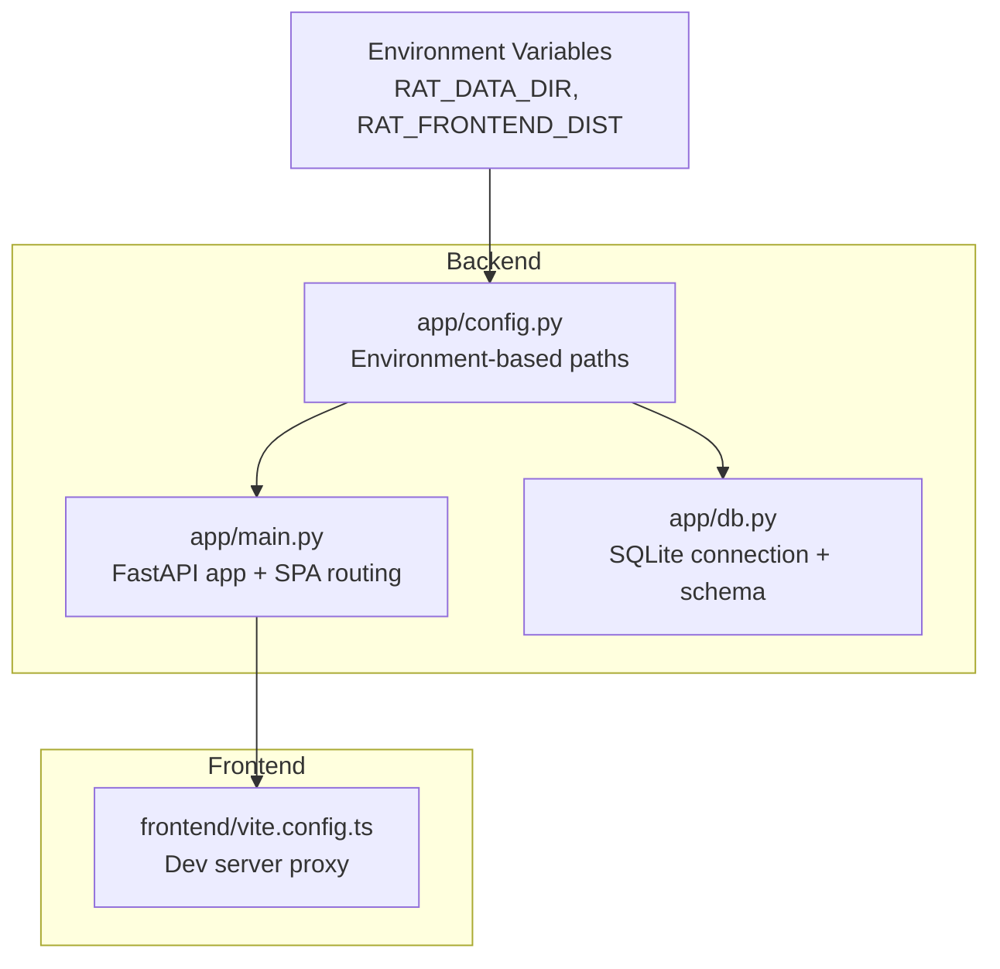
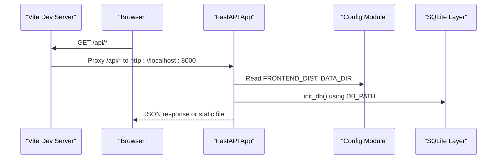
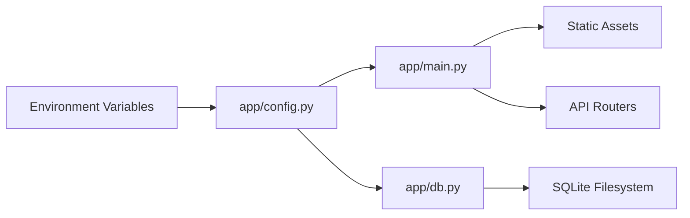

# Configuration Management

<cite>
**Referenced Files in This Document**
- [config.py](file://backend/app/config.py)
- [main.py](file://backend/app/main.py)
- [db.py](file://backend/app/db.py)
- [vite.config.ts](file://frontend/vite.config.ts)
- [requirements.txt](file://backend/requirements.txt)
- [.gitignore](file://.gitignore)
</cite>

## Table of Contents
1. [Introduction](#introduction)
2. [Project Structure](#project-structure)
3. [Core Components](#core-components)
4. [Architecture Overview](#architecture-overview)
5. [Detailed Component Analysis](#detailed-component-analysis)
6. [Dependency Analysis](#dependency-analysis)
7. [Performance Considerations](#performance-considerations)
8. [Troubleshooting Guide](#troubleshooting-guide)
9. [Conclusion](#conclusion)

## Introduction
This document explains RAT’s configuration management system. It focuses on the environment-based approach used by the backend, runtime settings for database connections and frontend asset paths, application behavior options, configuration validation and defaults, environment variable precedence, and how configuration values are accessed throughout the FastAPI application. It also includes examples of production versus development configurations and security considerations for sensitive settings such as database credentials and API keys.

RAT is a FastAPI-based backend with a React/Vite frontend. The backend reads runtime configuration from environment variables and exposes APIs; the frontend proxies API calls to the backend during development and serves static assets built by Vite.

## Project Structure
The configuration surface relevant to this document spans:
- Backend configuration module that loads environment variables and computes derived paths.
- Application entry point that mounts static assets and initializes the database.
- Database layer that uses the configured database path.
- Frontend build configuration that proxies API requests to the backend during development.

**Diagram sources**
- [config.py:7-14](file://backend/app/config.py#L7-L14)
- [main.py:9-30](file://backend/app/main.py#L9-L30)
- [db.py:11-11](file://backend/app/db.py#L11-L11)
- [vite.config.ts:6-13](file://frontend/vite.config.ts#L6-L13)

**Section sources**
- [config.py:1-14](file://backend/app/config.py#L1-L14)
- [main.py:1-49](file://backend/app/main.py#L1-L49)
- [db.py:1-87](file://backend/app/db.py#L1-L87)
- [vite.config.ts:1-27](file://frontend/vite.config.ts#L1-L27)

## Core Components
- Environment-based configuration module defines base directories and derives data, repository, database, and frontend distribution paths.
- FastAPI application imports configuration constants and uses them to mount static assets and serve the single-page application fallback.
- Database module imports the configured database path and opens SQLite connections with tuned pragmas.
- Frontend Vite configuration proxies `/api` requests to the backend during development.

Key responsibilities:
- Centralize environment-driven paths and ensure required directories exist.
- Provide consistent access points for database and frontend asset locations.
- Integrate with FastAPI to serve static assets and handle SPA routing.
- Configure development proxying for seamless frontend-backend interaction.

**Section sources**
- [config.py:7-14](file://backend/app/config.py#L7-L14)
- [main.py:9-30](file://backend/app/main.py#L9-L30)
- [db.py:11-81](file://backend/app/db.py#L11-L81)
- [vite.config.ts:6-13](file://frontend/vite.config.ts#L6-L13)

## Architecture Overview
RAT’s configuration architecture is simple and explicit:
- Environment variables drive runtime paths.
- The backend config module resolves absolute paths and creates directories if missing.
- The FastAPI app consumes these paths to mount static assets and initialize the database.
- The frontend dev server proxies API calls to the backend.

**Diagram sources**
- [vite.config.ts:6-13](file://frontend/vite.config.ts#L6-L13)
- [main.py:22-30](file://backend/app/main.py#L22-L30)
- [config.py:7-11](file://backend/app/config.py#L7-L11)
- [db.py:84-86](file://backend/app/db.py#L84-L86)

## Detailed Component Analysis

### Backend Configuration Module
The configuration module centralizes environment-driven paths:
- Base directory resolution relative to the module location.
- Data directory resolved from an environment variable with a default under the backend package.
- Repository data directory derived from the data directory.
- Database path derived from the data directory.
- Frontend distribution path resolved from an environment variable with a default pointing to the frontend build output.
- Automatic creation of data and repository directories at import time.

Configuration variables:
- `BASE_DIR`: Absolute path to the backend package root.
- `DATA_DIR`: Path to runtime data, configurable via `RAT_DATA_DIR`.
- `REPOS_DIR`: Subdirectory for cloned or extracted repositories.
- `DB_PATH`: SQLite database file path inside the data directory.
- `FRONTEND_DIST`: Directory containing the built frontend assets, configurable via `RAT_FRONTEND_DIST`.

Validation and defaults:
- No explicit type or value validation is performed beyond string-to-path conversion.
- Defaults provide sensible local development paths when environment variables are absent.
- Directories are created automatically to avoid runtime errors due to missing paths.

Environment variable precedence:
- If `RAT_DATA_DIR` is set, it overrides the default data directory.
- If `RAT_FRONTEND_DIST` is set, it overrides the default frontend distribution directory.
- Unset variables fall back to computed defaults.

Access pattern:
- Other modules import these constants directly (e.g., `from .config import DB_PATH`).

Security considerations:
- Sensitive values should be provided through secure environment injection rather than hard-coded defaults.
- Avoid committing secrets into version control; use `.env` files locally and secret managers in production.

**Section sources**
- [config.py:7-14](file://backend/app/config.py#L7-L14)

### FastAPI Application Entry Point
The application entry point integrates configuration with FastAPI:
- Imports `FRONTEND_DIST` from the configuration module.
- Initializes the database using the configured path.
- Mounts static assets from the frontend distribution if present.
- Provides a catch-all route to serve the SPA while excluding API routes.

Behavioral options:
- CORS middleware allows development origins and methods/headers broadly.
- Static assets are mounted only when the expected assets directory exists.
- SPA fallback serves `index.html` when no matching file is found.

Integration with configuration:
- Uses `FRONTEND_DIST` to determine where to serve static assets and how to resolve SPA routes.
- Calls `init_db()` which relies on `DB_PATH` from the configuration module.

Production vs development:
- Development: Vite dev server proxies `/api` to the backend; frontend assets may be served by Vite.
- Production: Build the frontend and set `RAT_FRONTEND_DIST` to the built directory so FastAPI can serve assets directly.

**Section sources**
- [main.py:9-49](file://backend/app/main.py#L9-L49)

### Database Layer
The database layer encapsulates SQLite storage:
- Imports `DB_PATH` from the configuration module.
- Defines schema for repositories, commits, file changes, merged authors, and author merges.
- Provides a connection helper that applies performance and safety pragmas.
- Initializes the schema once at application startup.

Runtime settings:
- Connection timeout is set to 60 seconds.
- WAL journal mode improves concurrency.
- Synchronous mode set to NORMAL for balanced durability/performance.
- Foreign key constraints enabled.

Configuration integration:
- Uses `DB_PATH` to locate the SQLite database file.
- Supports overriding the path per call, but defaults to the configured path.

Validation and error handling:
- No explicit validation of the database path beyond Python’s path handling.
- Errors from SQLite operations propagate to callers; application-level error handling is not implemented here.

**Section sources**
- [db.py:11-81](file://backend/app/db.py#L11-L81)

### Frontend Vite Configuration
The frontend configuration sets up the development server and build behavior:
- Development server runs on port 5173.
- Proxies `/api` requests to the backend running on `http://localhost:8000`.
- Enables `changeOrigin` to handle CORS during development.
- Builds chunked outputs for large dependencies like ECharts and React.

Development workflow:
- Developers run the Vite dev server and the FastAPI backend concurrently.
- API calls from the frontend are proxied to the backend transparently.

Production workflow:
- Build the frontend and configure the backend to serve the built assets via `FRONTEND_DIST`.

**Section sources**
- [vite.config.ts:6-13](file://frontend/vite.config.ts#L6-L13)
- [vite.config.ts:15-25](file://frontend/vite.config.ts#L15-L25)

## Dependency Analysis
The following diagram shows how configuration flows between components:

**Diagram sources**
- [config.py:7-14](file://backend/app/config.py#L7-L14)
- [main.py:9-30](file://backend/app/main.py#L9-L30)
- [db.py:11-81](file://backend/app/db.py#L11-L81)

Coupling and cohesion:
- Configuration is centralized in one module, improving cohesion.
- Main and database modules depend on configuration constants, creating clear coupling.
- No circular dependencies are introduced by this design.

External dependencies:
- FastAPI and Uvicorn are declared in requirements.
- SQLite is part of the Python standard library.

**Section sources**
- [requirements.txt:1-6](file://backend/requirements.txt#L1-L6)
- [config.py:7-14](file://backend/app/config.py#L7-L14)
- [main.py:9-30](file://backend/app/main.py#L9-L30)
- [db.py:11-81](file://backend/app/db.py#L11-L81)

## Performance Considerations
- SQLite WAL mode and synchronous NORMAL improve write throughput and concurrency.
- Chunked builds reduce initial load times for heavy libraries.
- Static asset serving is conditional on the presence of the assets directory, avoiding unnecessary overhead.

[No sources needed since this section provides general guidance]

## Troubleshooting Guide
Common issues and resolutions:
- Missing frontend assets: Ensure the frontend is built and `RAT_FRONTEND_DIST` points to the correct directory. The SPA fallback returns a 404 message indicating the frontend is not built yet.
- Database path issues: Verify `RAT_DATA_DIR` is writable and contains the expected structure. The configuration module creates directories automatically, but parent directories must exist.
- CORS errors during development: Confirm the Vite dev server proxies `/api` to the backend and that the backend’s CORS middleware allows the development origin.
- Port conflicts: Ensure the Vite dev server and FastAPI backend are running on different ports (default 5173 and 8000).

Operational checks:
- Validate that `backend/data/` is excluded from version control to prevent accidental commits of sensitive data.
- Confirm that `frontend/dist/` is excluded from version control to avoid shipping untracked build artifacts.

**Section sources**
- [main.py:33-48](file://backend/app/main.py#L33-L48)
- [config.py:13-14](file://backend/app/config.py#L13-L14)
- [vite.config.ts:6-13](file://frontend/vite.config.ts#L6-L13)
- [.gitignore:7-12](file://.gitignore#L7-L12)

## Conclusion
RAT’s configuration management is intentionally minimal and environment-driven. Environment variables control runtime paths for data and frontend assets, while defaults support local development out of the box. The FastAPI application integrates these settings to serve static assets and initialize the database. For production, build the frontend and configure the backend to serve the built assets securely. Sensitive settings should be injected via environment variables or secret managers, never hard-coded.

[No sources needed since this section summarizes without analyzing specific files]

## Appendices

### Environment Variables Reference
- `RAT_DATA_DIR`: Overrides the default data directory for repositories and the SQLite database.
- `RAT_FRONTEND_DIST`: Overrides the default frontend distribution directory for static assets.

Precedence:
- Explicit environment variables take precedence over defaults.
- If unset, defaults point to local development paths.

Security recommendations:
- Do not commit secrets into the repository.
- Use environment injection or secret managers in production environments.
- Restrict filesystem permissions for data directories and database files.

[No sources needed since this section provides general guidance]