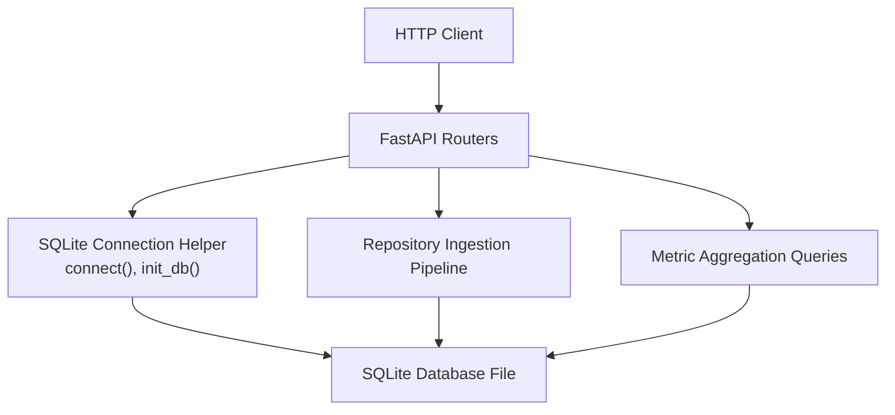
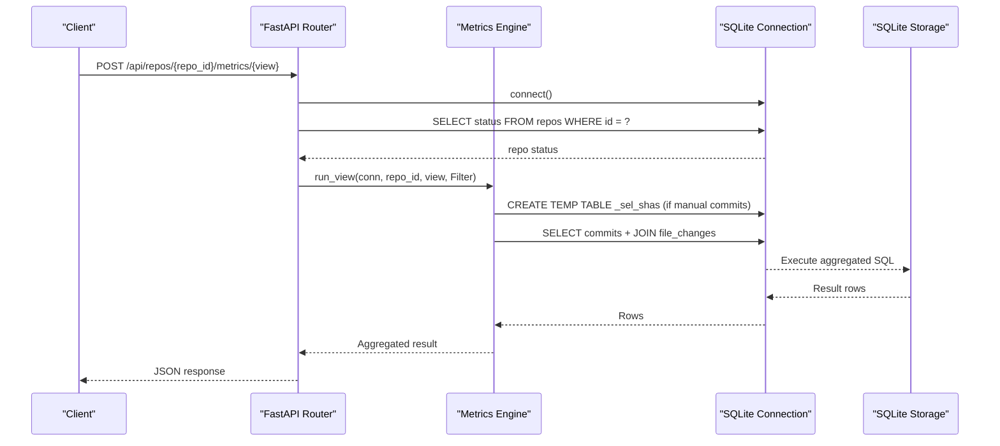
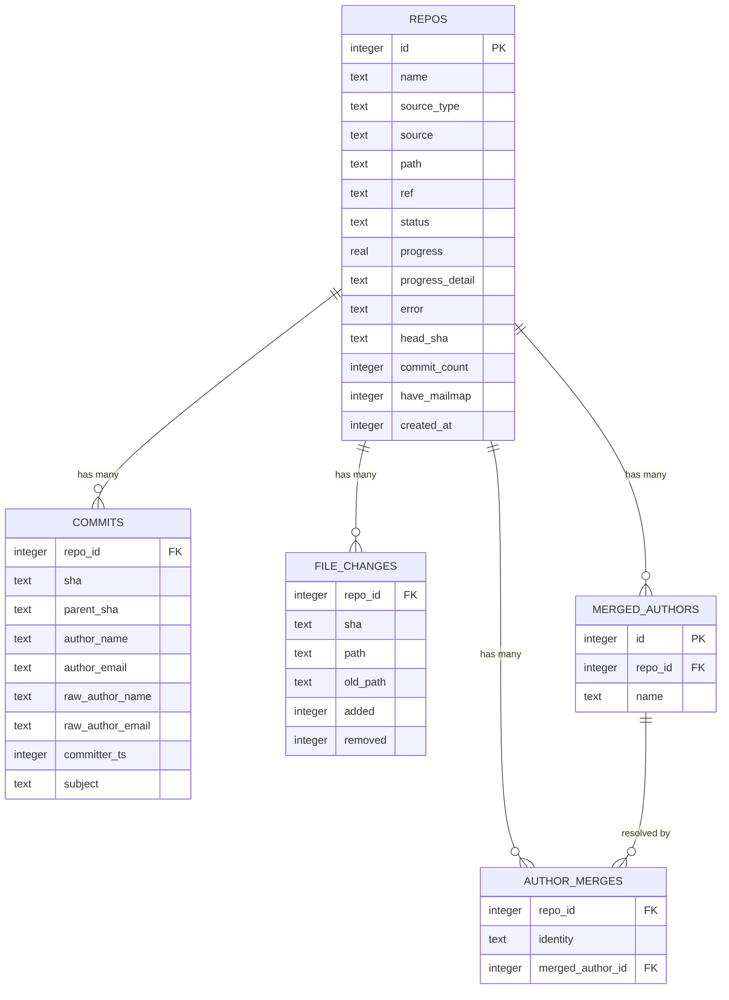
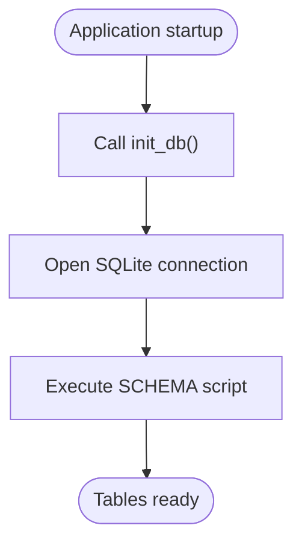
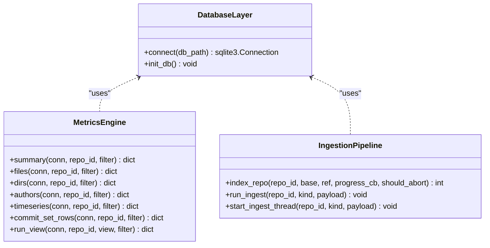
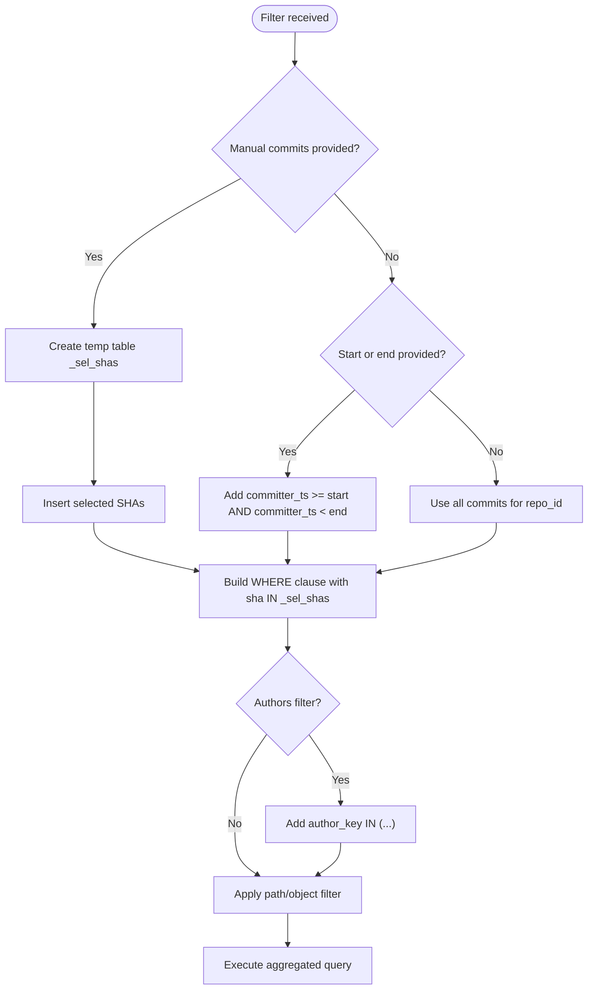
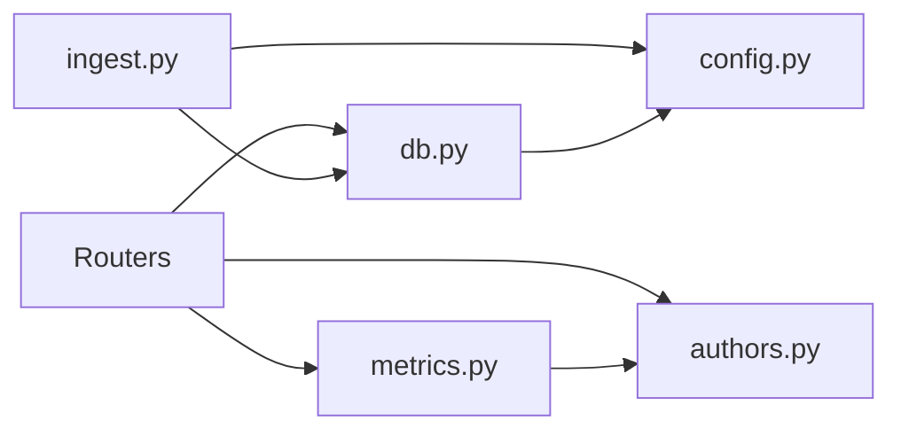

# Database Layer

<cite>
**Referenced Files in This Document**
- [db.py](file://backend/app/db.py)
- [config.py](file://backend/app/config.py)
- [ingest.py](file://backend/app/ingest.py)
- [metrics.py](file://backend/app/metrics.py)
- [routers/repos.py](file://backend/app/routers/repos.py)
- [routers/commits.py](file://backend/app/routers/commits.py)
- [routers/authors.py](file://backend/app/routers/authors.py)
- [routers/metrics.py](file://backend/app/routers/metrics.py)
</cite>

## Table of Contents
1. [Introduction](#introduction)
2. [Project Structure](#project-structure)
3. [Core Components](#core-components)
4. [Architecture Overview](#architecture-overview)
5. [Detailed Component Analysis](#detailed-component-analysis)
6. [Dependency Analysis](#dependency-analysis)
7. [Performance Considerations](#performance-considerations)
8. [Troubleshooting Guide](#troubleshooting-guide)
9. [Conclusion](#conclusion)

## Introduction
This document describes the SQLite database layer used by RAT for repository, commit, file, directory, and author metric storage. It explains the schema design, connection configuration, initialization process, ingestion pipeline, indexing strategy, transaction handling, query patterns, and how the database supports time-range filtering and manual commit selection.

The database is intentionally simple: a single SQLite file holds all repositories and their metrics. Every table is keyed by `repo_id`, so multi-repository support is implemented as a filter rather than through separate databases.

## Project Structure
The database-related code lives primarily under `backend/app`:

- `db.py` defines the schema, connection helper, and initialization function.
- `config.py` defines runtime paths, including the default SQLite file path.
- `ingest.py` streams Git history into SQLite during repository acquisition and indexing.
- `metrics.py` implements metric aggregation queries over the committed data.
- The FastAPI routers under `backend/app/routers` expose HTTP endpoints that use the database layer.

**Diagram sources**
- [db.py:74-86](file://backend/app/db.py#L74-L86)
- [routers/metrics.py:13-40](file://backend/app/routers/metrics.py#L13-L40)
- [ingest.py:280-354](file://backend/app/ingest.py#L280-L354)

**Section sources**
- [db.py:1-86](file://backend/app/db.py#L1-L86)
- [config.py:1-15](file://backend/app/config.py#L1-L15)
- [routers/metrics.py:1-41](file://backend/app/routers/metrics.py#L1-L41)

## Core Components
The core database components are:

| Component | Responsibility | Key Implementation Details |
|---|---|---|
| Schema definition | Declares tables, primary keys, foreign keys, and indexes | `SCHEMA` string with `repos`, `commits`, `file_changes`, `merged_authors`, `author_merges` |
| Connection helper | Opens tuned SQLite connections | WAL mode, synchronous NORMAL, foreign keys enabled, 60-second timeout |
| Initialization | Creates tables if missing | `init_db()` runs `executescript(SCHEMA)` |
| Ingestion pipeline | Streams Git log output into batched inserts | Uses `INSERT OR REPLACE` batches for commits and file changes |
| Metric engine | Computes aggregates over filtered commit sets | CTE-based commit set `h`, temporary selection table `_sel_shas`, bucketed time-series SQL |
| Router layer | Exposes repository, commit, author, and metric endpoints | Validates repository existence, applies filters, returns JSON responses |

**Section sources**
- [db.py:13-86](file://backend/app/db.py#L13-L86)
- [ingest.py:280-354](file://backend/app/ingest.py#L280-L354)
- [metrics.py:43-114](file://backend/app/metrics.py#L43-L114)
- [routers/metrics.py:13-40](file://backend/app/routers/metrics.py#L13-L40)

## Architecture Overview
RAT’s database architecture follows a layered pattern:

1. **HTTP layer**: FastAPI routers validate inputs and delegate to application logic.
2. **Application layer**: `metrics.py` builds parameterized SQL using shared filter logic; `authors.py` manages author merges.
3. **Storage layer**: `db.py` provides connections and schema; SQLite stores all data.
4. **Ingestion layer**: `ingest.py` streams Git history and writes normalized records into SQLite.

**Diagram sources**
- [routers/metrics.py:13-40](file://backend/app/routers/metrics.py#L13-L40)
- [metrics.py:67-114](file://backend/app/metrics.py#L67-L114)
- [metrics.py:291-329](file://backend/app/metrics.py#L291-L329)

## Detailed Component Analysis

### Schema Design
The schema models repositories, commits, file-level changes, and author identity merging.

#### Tables

| Table | Purpose | Primary Key | Important Columns | Notes |
|---|---|---|---|---|
| `repos` | Repository metadata and ingestion state | `id` | `name`, `source_type`, `source`, `path`, `ref`, `status`, `progress`, `commit_count`, `head_sha`, `have_mailmap`, `created_at` | Status values include `pending`, `cloning`, `extracting`, `indexing`, `ready`, `error` |
| `commits` | Non-merge commits reachable from the selected reference | `(repo_id, sha)` | `parent_sha`, `author_name`, `author_email`, `raw_author_name`, `raw_author_email`, `committer_ts`, `subject` | `WITHOUT ROWID`; indexed by `committer_ts` and `author_email` |
| `file_changes` | Per-commit per-file line additions and removals | `(repo_id, sha, path)` | `old_path`, `added`, `removed` | `WITHOUT ROWID`; indexed by `path` |
| `merged_authors` | Canonical author identities per repository | `id` | `repo_id`, `name` | Used for author grouping |
| `author_merges` | Maps raw author identity to canonical author | `(repo_id, identity)` | `identity`, `merged_author_id` | `identity` is lowercased author email |

**Diagram sources**
- [db.py:13-70](file://backend/app/db.py#L13-L70)

**Section sources**
- [db.py:13-70](file://backend/app/db.py#L13-L70)

### Connection Pooling and Tuning
The connection helper does not implement a traditional connection pool. Instead, it opens one tuned connection per call, which is appropriate for a request-per-thread model where each request gets its own connection.

Key tuning settings:

| Setting | Value | Effect |
|---|---:|---|
| `timeout` | 60 seconds | Prevents immediate lock failures under concurrent writers |
| `journal_mode` | `WAL` | Enables write-ahead logging for better concurrency and reduced locking |
| `synchronous` | `NORMAL` | Balances durability and performance |
| `foreign_keys` | `ON` | Enforces referential integrity between tables |

There is no explicit connection pooling configuration. If higher concurrency is required, an external connection pool wrapper could be introduced around `db.connect()`.

**Section sources**
- [db.py:74-81](file://backend/app/db.py#L74-L81)

### WAL Mode and Performance Optimizations
WAL mode is enabled on every connection. This improves read/write concurrency compared to the default rollback journal mode. Combined with `synchronous=NORMAL`, it reduces disk flush overhead while retaining reasonable durability guarantees.

Additional performance characteristics:

- `commits` and `file_changes` use `WITHOUT ROWID`, making the declared primary key the row storage order.
- Composite primary keys align with common query patterns: `(repo_id, sha)` for commits and `(repo_id, sha, path)` for file changes.
- Indexes exist for time-range queries (`idx_commits_ts`) and author-based queries (`idx_commits_email`).
- After successful ingestion, `ANALYZE` is executed to update SQLite statistics.
- A small in-process TTL cache avoids recomputing expensive aggregate views for repeated identical requests.

**Section sources**
- [db.py:74-86](file://backend/app/db.py#L74-L86)
- [ingest.py:419-422](file://backend/app/ingest.py#L419-L422)
- [metrics.py:407-435](file://backend/app/metrics.py#L407-L435)

### Database Initialization Process
Initialization is straightforward:

1. `init_db()` opens a connection using `connect()`.
2. It executes the full schema script via `executescript(SCHEMA)`.
3. Because all `CREATE TABLE` statements use `IF NOT EXISTS`, re-running initialization is safe.

The database file path defaults to `DATA_DIR / "rat.db"`, where `DATA_DIR` can be overridden by the `RAT_DATA_DIR` environment variable.

**Diagram sources**
- [db.py:74-86](file://backend/app/db.py#L74-L86)
- [config.py:7-10](file://backend/app/config.py#L7-L10)

**Section sources**
- [db.py:84-86](file://backend/app/db.py#L84-L86)
- [config.py:7-10](file://backend/app/config.py#L7-L10)

### Migration Strategy
The current implementation does not include a formal migration system. Schema evolution relies on:

- `CREATE TABLE IF NOT EXISTS` for new tables.
- Re-running `init_db()` to recreate or preserve existing tables.
- Adding new indexes or columns would require careful backward-compatible updates.

For production use, a migration tool such as Alembic or a versioned schema table should be considered to track schema versions and apply incremental changes safely.

**Section sources**
- [db.py:13-70](file://backend/app/db.py#L13-L70)

### Indexing Strategy for Time-Series Data
Time-series queries rely on `committer_ts`, stored as UNIX timestamps.

Relevant indexes:

| Index | Columns | Query Pattern Supported |
|---|---|---|
| `idx_commits_ts` | `repo_id`, `committer_ts` | Time-range filters on commits |
| `idx_commits_email` | `repo_id`, `author_email` | Author-based filtering and joins |
| `idx_fc_path` | `repo_id`, `path` | Path-based file/directory filtering |

Bucketing for time-series aggregation uses SQLite date functions:

- Day: formatted date string.
- Month: first day of month.
- Week: ISO-style week start computed from weekday arithmetic.

**Section sources**
- [db.py:44-57](file://backend/app/db.py#L44-L57)
- [metrics.py:282-288](file://backend/app/metrics.py#L282-L288)

### Repository Pattern and Centralized Database Access
RAT does not implement a classic repository class. Instead, centralized access is achieved through:

- `db.connect()`: centralizes connection creation and tuning.
- `db.init_db()`: centralizes schema initialization.
- Routers and services opening short-lived connections within context managers.
- Shared metric logic in `metrics.py` building parameterized queries.

Transaction management is handled implicitly:

- `with conn:` starts and commits transactions automatically when no exception occurs.
- Explicit `conn.commit()` is used in ingestion status updates and ingestion completion.
- Foreign key constraints are enforced at the connection level.

**Diagram sources**
- [db.py:74-86](file://backend/app/db.py#L74-L86)
- [metrics.py:135-400](file://backend/app/metrics.py#L135-L400)
- [ingest.py:280-439](file://backend/app/ingest.py#L280-L439)

**Section sources**
- [db.py:74-86](file://backend/app/db.py#L74-L86)
- [metrics.py:135-400](file://backend/app/metrics.py#L135-L400)
- [ingest.py:280-439](file://backend/app/ingest.py#L280-L439)

### Transaction Management
Transactions are managed in two main ways:

1. **Context-manager transactions**: `with db.connect() as conn:` ensures automatic commit on success.
2. **Explicit transactions**: Ingestion status updates and finalization use explicit `conn.commit()` calls.

Example patterns:

- Repository listing and deletion use context-managed connections.
- Ingestion updates repository status incrementally and commits after each major step.
- Final ingestion steps run `ANALYZE` and invalidate caches before committing.

**Section sources**
- [routers/repos.py:43-47](file://backend/app/routers/repos.py#L43-L47)
- [routers/repos.py:103-113](file://backend/app/routers/repos.py#L103-L113)
- [ingest.py:362-429](file://backend/app/ingest.py#L362-L429)

### Query Optimization Techniques
Several optimization techniques are used:

- **Parameterized queries**: All user-supplied values are passed as parameters to prevent injection and allow query plan reuse.
- **Temporary selection table**: Manual commit selections are materialized into `_sel_shas` to avoid large `IN (...)` lists.
- **CTE-based commit set**: The `h` CTE computes the filtered commit set once and reuses it across multiple views.
- **Batched inserts**: Ingestion batches commits and file changes to reduce round trips.
- **Limit enforcement**: View queries enforce upper bounds on limits to prevent excessive result sets.
- **Cache invalidation**: Cache is invalidated after ingestion and author merge changes.

**Section sources**
- [metrics.py:67-114](file://backend/app/metrics.py#L67-L114)
- [metrics.py:158-183](file://backend/app/metrics.py#L158-L183)
- [ingest.py:299-334](file://backend/app/ingest.py#L299-L334)
- [metrics.py:407-435](file://backend/app/metrics.py#L407-L435)

### Complex SQL Queries for Metric Aggregation
The metric engine defines several aggregation views:

| View | Aggregation Logic | Output |
|---|---|---|
| `summary` | Sums added/removed lines and counts distinct modified commits for one object | Added, removed, growth, churn, modifications, frequency, rate |
| `files` | Groups file changes by path within the commit set | Per-file metrics |
| `dirs` | Aggregates subtree metrics and de-duplicates modifications per commit | Per-directory metrics |
| `authors` | Joins commits with file changes and groups by author identity | Modifications, churn, ownership |
| `timeseries` | Buckets metrics by day, week, or month | Time-series points |
| `commits` | Lists commits with optional object-level stats | Paged commit list |

The core query pattern:

1. Build the commit set `h` using a CTE.
2. Join `file_changes` on `repo_id` and `sha`.
3. Apply object filters for files or directories.
4. Aggregate sums, counts, and derived metrics.

**Section sources**
- [metrics.py:135-155](file://backend/app/metrics.py#L135-L155)
- [metrics.py:158-183](file://backend/app/metrics.py#L158-L183)
- [metrics.py:186-248](file://backend/app/metrics.py#L186-L248)
- [metrics.py:251-279](file://backend/app/metrics.py#L251-L279)
- [metrics.py:291-329](file://backend/app/metrics.py#L291-L329)
- [metrics.py:332-386](file://backend/app/metrics.py#L332-L386)

### Filtering System: Time Ranges and Manual Commit Selection
The `Filter` dataclass supports:

- `start`: inclusive UNIX timestamp.
- `end`: exclusive UNIX timestamp.
- `commits`: manual SHA selection.
- `authors`: author identity filter.
- `path`: file or directory path.
- `object_type`: `file` or `dir`.
- `granularity`: time bucket size.
- `limit`, `offset`: pagination.
- `only_changed`: show only commits touching the selected object.

Time-range filtering uses `committer_ts >= start` and `committer_ts < end`. Manual commit selection overrides the time range by inserting SHAs into a temporary table and filtering `c.sha IN (SELECT sha FROM _sel_shas)`.

**Diagram sources**
- [metrics.py:43-64](file://backend/app/metrics.py#L43-L64)
- [metrics.py:67-114](file://backend/app/metrics.py#L67-L114)

**Section sources**
- [metrics.py:43-64](file://backend/app/metrics.py#L43-L64)
- [metrics.py:67-114](file://backend/app/metrics.py#L67-L114)

### Repository, Commit, and Author Endpoints
The routers provide REST endpoints that interact with the database:

- `/api/repos`: list, upload, clone, get, delete repositories.
- `/api/repos/{repo_id}/commits`: list commits with search, time-range, and pagination.
- `/api/repos/{repo_id}/paths`: list files and derived directories for path selection.
- `/api/repos/{repo_id}/authors`: list authors and manage author merges.
- `/api/repos/{repo_id}/metrics/{view}`: execute metric views with shared filter payloads.

Each endpoint validates repository existence and delegates to either direct SQL queries or the metric engine.

**Section sources**
- [routers/repos.py:43-113](file://backend/app/routers/repos.py#L43-L113)
- [routers/commits.py:13-102](file://backend/app/routers/commits.py#L13-L102)
- [routers/authors.py:12-49](file://backend/app/routers/authors.py#L12-L49)
- [routers/metrics.py:13-40](file://backend/app/routers/metrics.py#L13-L40)

## Dependency Analysis
The database layer has clear dependencies:

- Routers depend on `db`, `metrics`, `authors`, and `schemas`.
- `metrics.py` depends on `authors.py` for author join logic.
- `ingest.py` depends on `db.py` and `config.py`.
- `db.py` depends on `config.py` for the default database path.

**Diagram sources**
- [routers/metrics.py:1-41](file://backend/app/routers/metrics.py#L1-L41)
- [metrics.py:37-37](file://backend/app/metrics.py#L37-L37)
- [ingest.py:35-36](file://backend/app/ingest.py#L35-L36)
- [db.py:11-11](file://backend/app/db.py#L11-L11)

**Section sources**
- [routers/metrics.py:1-41](file://backend/app/routers/metrics.py#L1-L41)
- [metrics.py:37-37](file://backend/app/metrics.py#L37-L37)
- [ingest.py:35-36](file://backend/app/ingest.py#L35-L36)
- [db.py:11-11](file://backend/app/db.py#L11-L11)

## Performance Considerations
Recommended considerations:

- **Connection pooling**: Introduce a bounded connection pool if concurrent request volume increases beyond the current per-request connection model.
- **Index tuning**: Monitor query plans for complex filters; consider additional composite indexes if path prefix scans become bottlenecks.
- **WAL tuning**: Ensure the filesystem supports WAL efficiently; monitor WAL file growth under heavy ingestion.
- **Cache sizing**: Adjust `_CACHE_MAX` and `_CACHE_TTL` based on workload patterns.
- **Ingestion batching**: Current batch sizes are reasonable; tune if ingestion throughput becomes insufficient.
- **ANALYZE timing**: Running `ANALYZE` after bulk loads helps SQLite choose better query plans.

[No sources needed since this section provides general guidance]

## Troubleshooting Guide
Common issues and diagnostics:

| Issue | Symptom | Likely Cause | Resolution |
|---|---|---|---|
| Repository not found | 404 from metric or commit endpoints | Invalid `repo_id` or deleted repository | Verify repository exists before querying |
| Repository not ready | 409 conflict on metric queries | Ingestion still running | Poll repository status until `ready` |
| Ingestion fails | Error stored in `repos.error` | Git command failure, invalid archive, or cancelled ingestion | Check ingestion logs and repository state |
| Slow time-series queries | High latency on `timeseries` view | Missing or suboptimal indexes, large commit sets | Review `idx_commits_ts` usage and consider limiting time ranges |
| Lock timeouts | SQLite lock errors under concurrency | Too many concurrent writers without pooling | Reduce concurrency or add connection pooling |
| Stale metrics | Incorrect cached results after ingestion | Cache not invalidated | Ensure `cache_invalidate(repo_id)` is called after ingestion |

**Section sources**
- [routers/metrics.py:24-30](file://backend/app/routers/metrics.py#L24-L30)
- [ingest.py:423-429](file://backend/app/ingest.py#L423-L429)
- [metrics.py:429-435](file://backend/app/metrics.py#L429-L435)

## Conclusion
RAT’s SQLite database layer is a focused, single-file storage solution designed for repository metrics. The schema cleanly separates repository metadata, commit history, file changes, and author mappings. Connection tuning with WAL mode and foreign key enforcement provides a solid foundation for correctness and concurrency. The ingestion pipeline streams Git history efficiently, and the metric engine uses CTEs, temporary tables, and parameterized queries to support flexible filtering by time range, manual commit selection, author, and object path.

For future evolution, consider introducing a formal migration system, connection pooling, and index monitoring to support larger repositories and higher concurrency.

[No sources needed since this section summarizes without analyzing specific files]