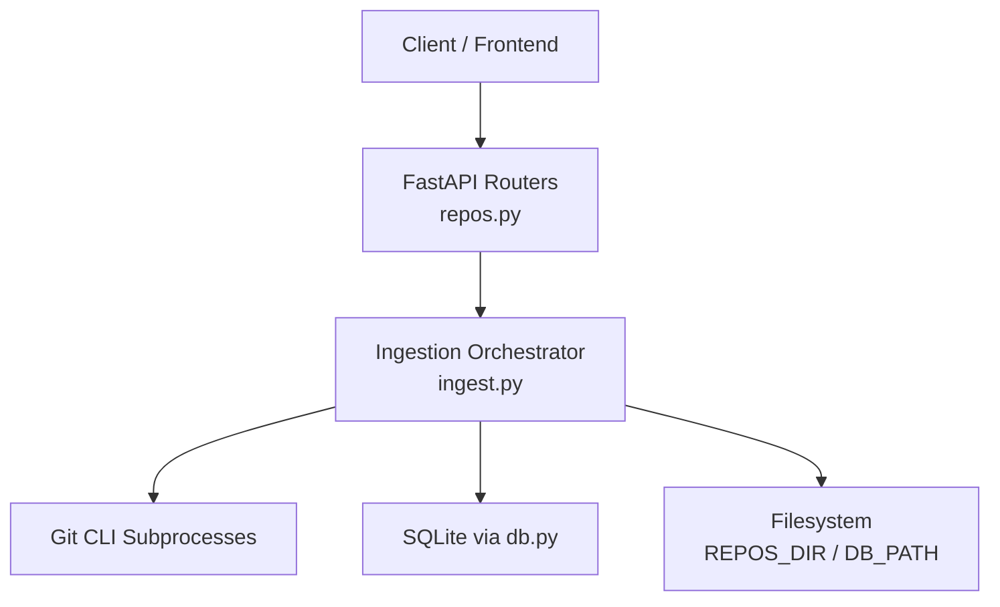
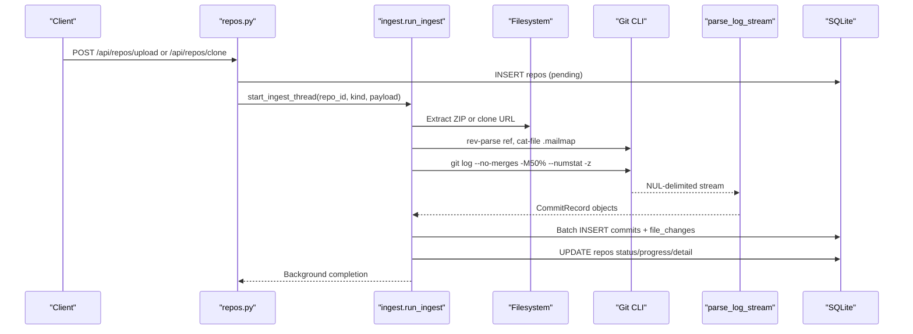
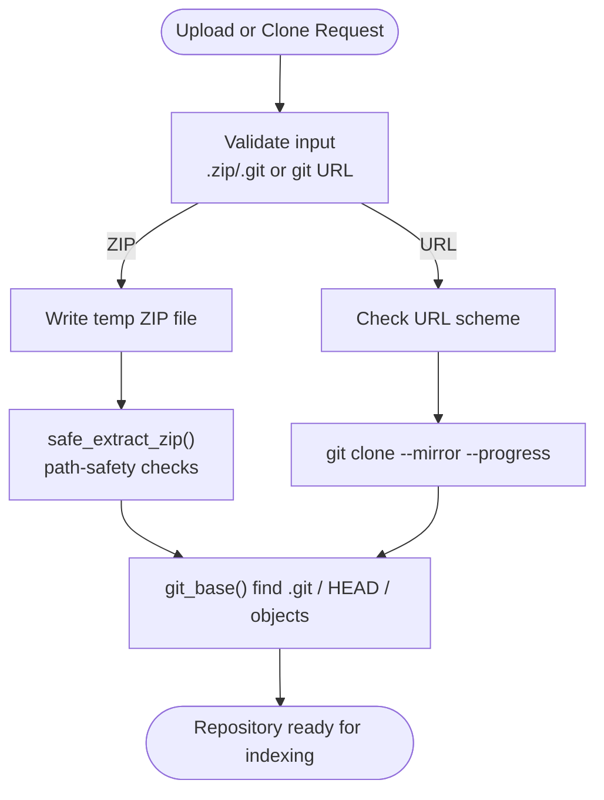
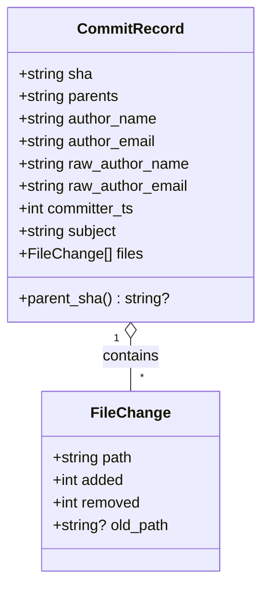
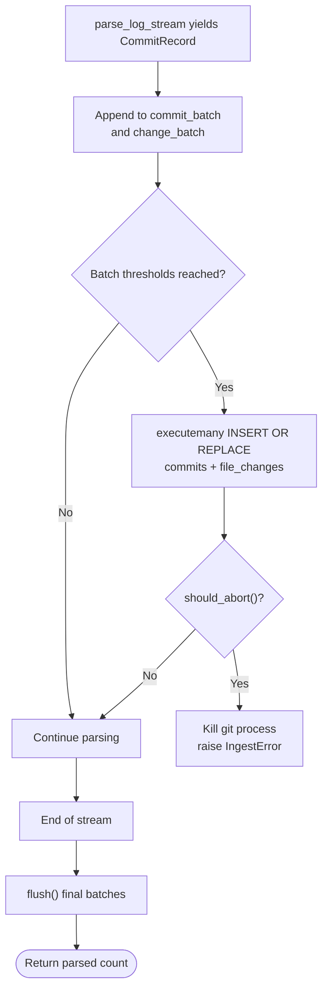
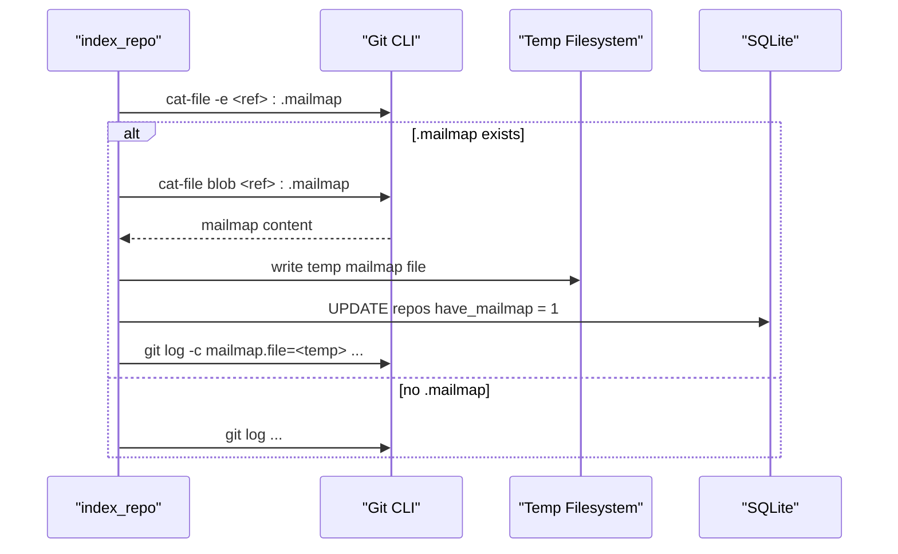
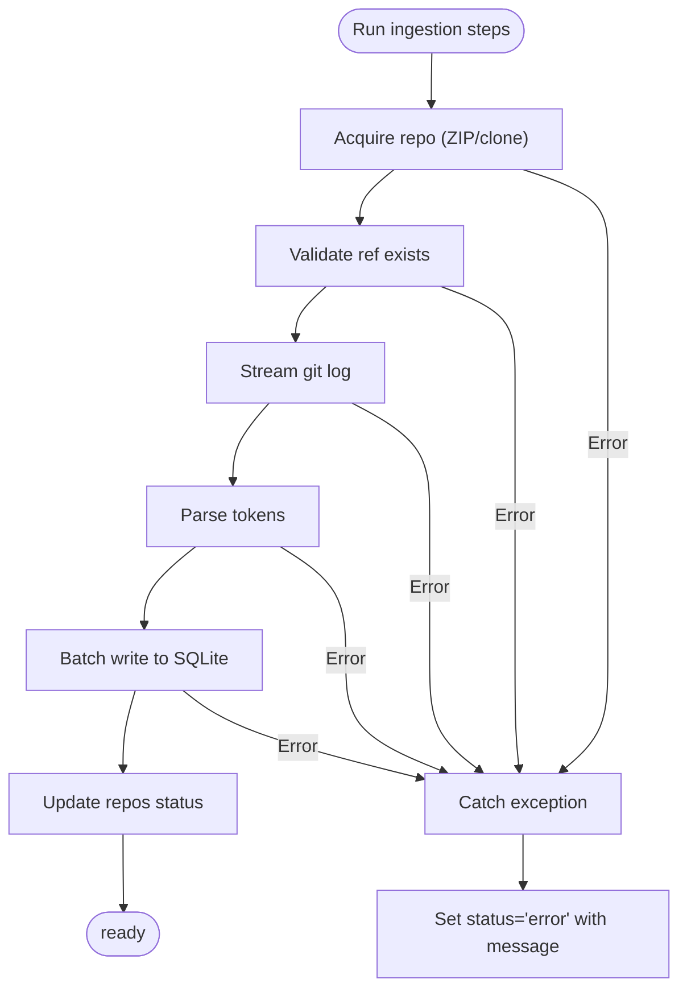
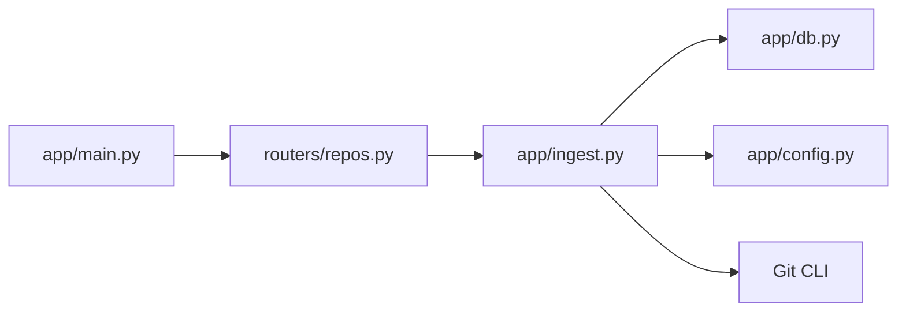

# Ingestion Pipeline

<cite>
**Referenced Files in This Document**
- [ingest.py](file://backend/app/ingest.py)
- [repos.py](file://backend/app/routers/repos.py)
- [db.py](file://backend/app/db.py)
- [config.py](file://backend/app/config.py)
- [main.py](file://backend/app/main.py)
- [README.md](file://README.md)
- [test_parser.py](file://backend/tests/test_parser.py)
- [conftest.py](file://backend/tests/conftest.py)
</cite>

## Table of Contents
1. [Introduction](#introduction)
2. [Project Structure](#project-structure)
3. [Core Components](#core-components)
4. [Architecture Overview](#architecture-overview)
5. [Detailed Component Analysis](#detailed-component-analysis)
6. [Dependency Analysis](#dependency-analysis)
7. [Performance Considerations](#performance-considerations)
8. [Troubleshooting Guide](#troubleshooting-guide)
9. [Conclusion](#conclusion)

## Introduction
This document explains RAT’s repository ingestion pipeline: how repositories are acquired from ZIP uploads or remote Git URLs, how the full history is parsed with a memory-efficient streaming parser, how changes are batched into SQLite, and how progress and errors are tracked. It also covers mailmap-based author identity resolution, Git CLI integration, and performance characteristics for large repositories.

The ingestion design intentionally keeps memory usage flat by delegating diffing to `git log` and parsing its NUL-delimited output incrementally. Database writes are grouped into batches so that even very large histories can be indexed without overwhelming SQLite.

**Section sources**
- [README.md:1-15](file://README.md#L1-L15)
- [ingest.py:1-20](file://backend/app/ingest.py#L1-L20)

## Project Structure
The ingestion logic lives primarily in the backend application:

- `backend/app/ingest.py`: Repository acquisition, streamed parsing, batching, indexing orchestration, background thread entry point.
- `backend/app/routers/repos.py`: HTTP endpoints for upload and clone; they create repository rows and start ingestion threads.
- `backend/app/db.py`: SQLite schema, connection helpers, and WAL tuning.
- `backend/app/config.py`: Paths for data directory, repository storage, database file, and frontend distribution.
- `backend/app/main.py`: FastAPI application setup and router registration.
- `backend/tests/test_parser.py`: Parser contract tests for the exact `git log --numstat -z` token format.
- `backend/tests/conftest.py`: Deterministic fixture repository builder used by tests.

**Diagram sources**
- [main.py:13-27](file://backend/app/main.py#L13-L27)
- [repos.py:43-94](file://backend/app/routers/repos.py#L43-L94)
- [ingest.py:362-439](file://backend/app/ingest.py#L362-L439)
- [db.py:74-87](file://backend/app/db.py#L74-L87)
- [config.py:7-15](file://backend/app/config.py#L7-L15)

**Section sources**
- [main.py:1-49](file://backend/app/main.py#L1-L49)
- [repos.py:1-114](file://backend/app/routers/repos.py#L1-L114)
- [ingest.py:1-439](file://backend/app/ingest.py#L1-L439)
- [db.py:1-87](file://backend/app/db.py#L1-L87)
- [config.py:1-15](file://backend/app/config.py#L1-L15)

## Core Components
- **Repository acquisition**: ZIP extraction with path-safety checks and deep mirror cloning from remote URLs.
- **Git plumbing helper**: A safe wrapper around `git` subprocess calls with environment isolation.
- **Streaming parser**: Incremental NUL-token reader that converts `git log --numstat -z` output into commit records.
- **Batch processor**: Accumulates commits and file changes and flushes them to SQLite in bounded batches.
- **Index orchestrator**: Counts total commits, extracts `.mailmap`, runs `git log`, streams parse, batch insert, and report progress.
- **Background runner**: Creates repository rows, starts ingestion in a daemon thread, updates status, and cleans up temporary files.

Key responsibilities:
- Keep memory usage constant regardless of repository size.
- Provide live progress feedback during cloning and indexing.
- Handle corrupted or incomplete repositories gracefully.
- Apply `.mailmap` when present to normalize author identities before indexing.

**Section sources**
- [ingest.py:45-90](file://backend/app/ingest.py#L45-L90)
- [ingest.py:97-157](file://backend/app/ingest.py#L97-L157)
- [ingest.py:190-274](file://backend/app/ingest.py#L190-L274)
- [ingest.py:280-355](file://backend/app/ingest.py#L280-L355)
- [ingest.py:362-439](file://backend/app/ingest.py#L362-L439)

## Architecture Overview
The ingestion pipeline is an asynchronous workflow triggered by HTTP requests. The FastAPI router creates a repository row and launches a background thread. The thread acquires the repository (ZIP or URL), validates the reference, optionally applies `.mailmap`, streams the entire history through `git log`, parses it line-by-line, and inserts data into SQLite in batches. Progress and error states are persisted in the `repos` table.

**Diagram sources**
- [repos.py:50-94](file://backend/app/routers/repos.py#L50-L94)
- [ingest.py:362-439](file://backend/app/ingest.py#L362-L439)
- [ingest.py:280-355](file://backend/app/ingest.py#L280-L355)
- [db.py:13-71](file://backend/app/db.py#L13-L71)

## Detailed Component Analysis

### Repository Acquisition: ZIP Uploads and Remote Cloning
- ZIP upload:
  - The endpoint accepts only `.zip` or `.git` archives.
  - The archive is streamed into a temporary file and validated as a ZIP.
  - Extraction uses a safety check that rejects absolute paths and traversal sequences (`..`) and ensures all targets remain under the destination root.
  - After extraction, the code searches for a valid Git repository structure at the root or one level down.
- Remote cloning:
  - Uses `git clone --mirror --progress` to perform a deep mirror clone.
  - Progress is parsed from stderr lines containing percentages.
  - Errors during cloning raise ingestion errors surfaced to the UI.

**Diagram sources**
- [repos.py:50-94](file://backend/app/routers/repos.py#L50-L94)
- [ingest.py:97-157](file://backend/app/ingest.py#L97-L157)
- [ingest.py:69-90](file://backend/app/ingest.py#L69-L90)

**Section sources**
- [repos.py:50-94](file://backend/app/routers/repos.py#L50-L94)
- [ingest.py:97-157](file://backend/app/ingest.py#L97-L157)
- [ingest.py:69-90](file://backend/app/ingest.py#L69-L90)

### Streaming Parser Implementation
The parser consumes the binary output of `git log --numstat -z`. It reads chunks and splits on NUL bytes without loading the entire stream into memory. Each token is either:
- A commit header matching a fixed pattern.
- A numstat change entry.
- A rename entry (old/new paths).
- A binary entry (skipped).

Data structures:
- `CommitRecord`: SHA, parents, author fields (both resolved and raw), timestamp, subject, and list of file changes.
- `FileChange`: path, added lines, removed lines, optional old path for renames.

Parsing rules:
- Binary files are skipped entirely.
- Pure renames produce zero-added/zero-removed entries with an `old_path`.
- Rename+edit entries are attributed to the new path.
- Unicode filenames are decoded safely.
- Empty commits still yield a record.

**Diagram sources**
- [ingest.py:164-188](file://backend/app/ingest.py#L164-L188)

**Section sources**
- [ingest.py:190-274](file://backend/app/ingest.py#L190-L274)
- [test_parser.py:1-72](file://backend/tests/test_parser.py#L1-L72)

### Batch Processor and Database Insertion Strategy
During indexing, parsed commits and their file changes are accumulated in two lists:
- `commit_batch`: up to 5,000 commits.
- `change_batch`: up to 10,000 file changes.

When either threshold is reached, both batches are flushed using `executemany` with `INSERT OR REPLACE`. This strategy:
- Reduces transaction overhead.
- Keeps memory bounded.
- Ensures idempotent writes if re-ingesting.

After processing completes, the final batch is flushed, the process exit code is checked, and progress is updated to completion.

**Diagram sources**
- [ingest.py:299-355](file://backend/app/ingest.py#L299-L355)

**Section sources**
- [ingest.py:299-355](file://backend/app/ingest.py#L299-L355)

### Mailmap Processing for Author Identity Resolution
Before running `git log`, the pipeline checks whether `.mailmap` exists at the specified reference. If present:
- It is materialized to a temporary file.
- The `git log` command is invoked with `-c mailmap.file=<temp>` so Git resolves author names and emails according to the map.
- The `have_mailmap` flag is set in the repository row.

This allows normalized author identities to be stored alongside raw identities, enabling later manual merging in the UI without re-indexing.

**Diagram sources**
- [ingest.py:141-157](file://backend/app/ingest.py#L141-L157)
- [ingest.py:287-292](file://backend/app/ingest.py#L287-L292)
- [ingest.py:296-298](file://backend/app/ingest.py#L296-L298)

**Section sources**
- [ingest.py:141-157](file://backend/app/ingest.py#L141-L157)
- [ingest.py:287-298](file://backend/app/ingest.py#L287-L298)

### Integration with Git CLI
All Git operations go through a small helper that:
- Copies the environment and disables interactive prompts.
- Forces locale to `C` for stable output.
- Disables system-wide Git config to avoid unexpected behavior.
- Raises ingestion errors when commands fail.

Common operations:
- `rev-parse --git-dir` to locate repositories.
- `rev-list --count` to estimate total commits for progress reporting.
- `cat-file` to probe `.mailmap`.
- `log` to stream history.
- `clone --mirror --progress` for remote acquisition.

**Section sources**
- [ingest.py:53-66](file://backend/app/ingest.py#L53-L66)
- [ingest.py:69-90](file://backend/app/ingest.py#L69-L90)
- [ingest.py:97-118](file://backend/app/ingest.py#L97-L118)
- [ingest.py:284-292](file://backend/app/ingest.py#L284-L292)

### Error Handling for Corrupted or Incomplete Repositories
Errors are raised as `IngestError` and caught by the background runner, which sets the repository status to `error` with the exception message. Specific cases include:
- No Git repository found in extracted archive.
- Invalid or unsafe archive entries.
- Clone failures.
- Missing or invalid reference.
- `git log` returning a non-zero exit code.
- Cancellation due to repository deletion or abort signals.

Temporary files (ZIP, mailmap) are cleaned up in `finally` blocks to avoid disk leaks.

**Diagram sources**
- [ingest.py:362-429](file://backend/app/ingest.py#L362-L429)
- [ingest.py:45-66](file://backend/app/ingest.py#L45-L66)

**Section sources**
- [ingest.py:45-66](file://backend/app/ingest.py#L45-L66)
- [ingest.py:362-429](file://backend/app/ingest.py#L362-L429)

### Progress Tracking Mechanisms
Progress is reported in two phases:
- Cloning: percentage parsed from `git clone --progress` stderr lines.
- Indexing: number of parsed commits divided by total non-merge commits.

The progress callback updates the repository row with current status, numeric progress, and detail text. Reporting is throttled to avoid excessive writes.

**Section sources**
- [ingest.py:97-118](file://backend/app/ingest.py#L97-L118)
- [ingest.py:284-286](file://backend/app/ingest.py#L284-L286)
- [ingest.py:339-342](file://backend/app/ingest.py#L339-L342)
- [ingest.py:348-350](file://backend/app/ingest.py#L348-L350)

## Dependency Analysis
The ingestion pipeline depends on:
- FastAPI routers for request handling.
- SQLite via `db.connect()` for persistence.
- Git CLI for repository operations and history streaming.
- Filesystem for repository storage and temporary artifacts.
- Configuration module for paths.

**Diagram sources**
- [main.py:13-27](file://backend/app/main.py#L13-L27)
- [repos.py:1-14](file://backend/app/routers/repos.py#L1-L14)
- [ingest.py:35-38](file://backend/app/ingest.py#L35-L38)
- [db.py:74-87](file://backend/app/db.py#L74-L87)
- [config.py:7-15](file://backend/app/config.py#L7-L15)

**Section sources**
- [main.py:13-27](file://backend/app/main.py#L13-L27)
- [repos.py:1-14](file://backend/app/routers/repos.py#L1-L14)
- [ingest.py:35-38](file://backend/app/ingest.py#L35-L38)
- [db.py:74-87](file://backend/app/db.py#L74-L87)
- [config.py:7-15](file://backend/app/config.py#L7-L15)

## Performance Considerations
- Single subprocess per repository for indexing; never per commit.
- NUL-delimited stream is parsed incrementally with bounded memory.
- Batched SQLite inserts reduce transaction overhead.
- WAL mode and tuned pragmas improve concurrency and durability.
- Rename detection cost is paid once at ingest; queries rely on indexes.
- Directory metrics use ordered scans with per-commit de-duplication.
- Response caching absorbs repeated dashboard queries.

Measured ingestion speeds demonstrate scalability:
- Small repositories index quickly.
- Medium repositories index at thousands of commits per second.
- Large repositories remain interactive after indexing.

**Section sources**
- [README.md:170-196](file://README.md#L170-L196)
- [db.py:74-81](file://backend/app/db.py#L74-L81)
- [ingest.py:299-355](file://backend/app/ingest.py#L299-L355)

## Troubleshooting Guide
Common ingestion failures and remedies:

- **No Git repository found in uploaded archive**:
  - Ensure the ZIP contains a `.git` directory at the root or one level down.
  - Verify the archive was created from a valid Git repository.

- **Unsafe archive entries**:
  - Archives containing absolute paths or traversal sequences are rejected for security.
  - Rebuild the archive ensuring relative paths only.

- **Clone failed**:
  - Check network connectivity and credentials.
  - Confirm the URL scheme is supported (`http://`, `https://`, `ssh://`, `git@...`).

- **Reference has no commits**:
  - Ensure the configured reference exists and points to a valid commit.

- **git log failed while indexing**:
  - Inspect the error detail stored in the repository row.
  - Check for corrupted history or unsupported Git versions.

- **Cancellation during ingestion**:
  - If the repository is deleted while indexing, the process is aborted and marked as cancelled.

- **Temporary files not cleaned up**:
  - Temporary ZIPs and mailmaps are removed in cleanup blocks; ensure the process exits normally or check logs for unhandled exceptions.

**Section sources**
- [ingest.py:69-90](file://backend/app/ingest.py#L69-L90)
- [ingest.py:121-139](file://backend/app/ingest.py#L121-L139)
- [ingest.py:117-118](file://backend/app/ingest.py#L117-L118)
- [ingest.py:399-407](file://backend/app/ingest.py#L399-L407)
- [ingest.py:345-347](file://backend/app/ingest.py#L345-L347)
- [ingest.py:423-429](file://backend/app/ingest.py#L423-L429)

## Conclusion
RAT’s ingestion pipeline is designed for scalability and reliability. It acquires repositories from ZIP uploads or remote URLs, applies `.mailmap` normalization, streams the entire history through `git log`, parses it incrementally, and writes data to SQLite in efficient batches. Progress tracking and robust error handling provide clear feedback, while configuration and filesystem safeguards ensure safe operation. For large repositories, the streaming architecture and batched writes keep memory usage low and indexing times practical, enabling interactive analysis after ingestion.