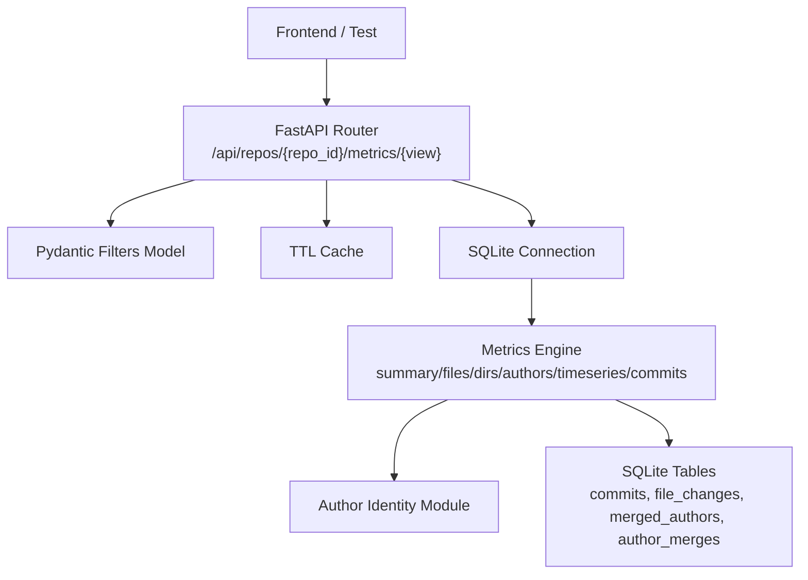
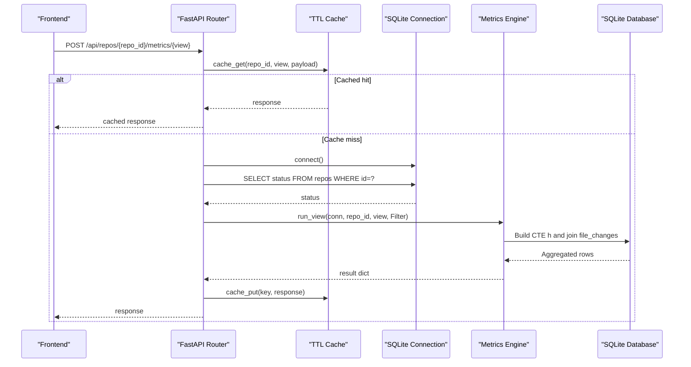
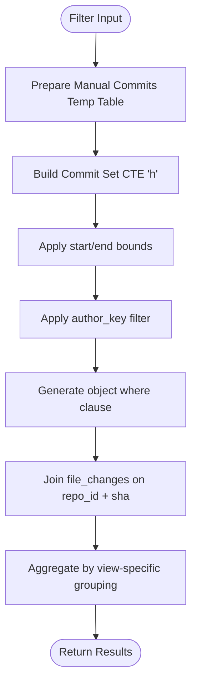
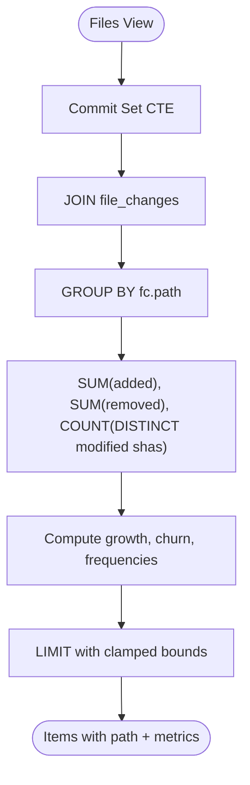
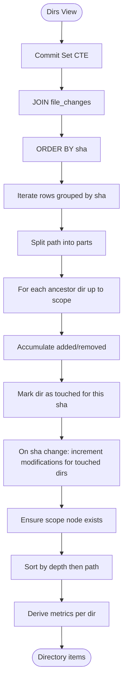
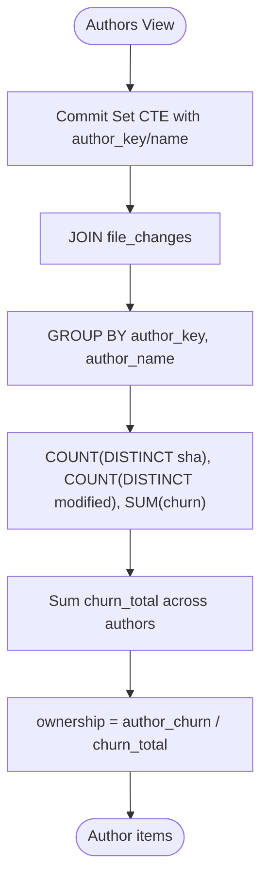
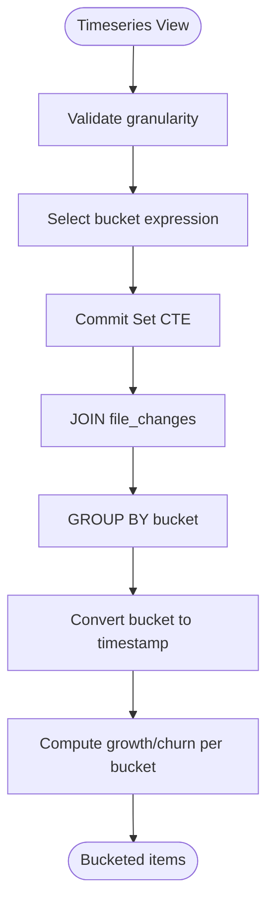
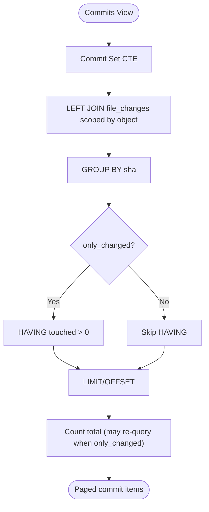
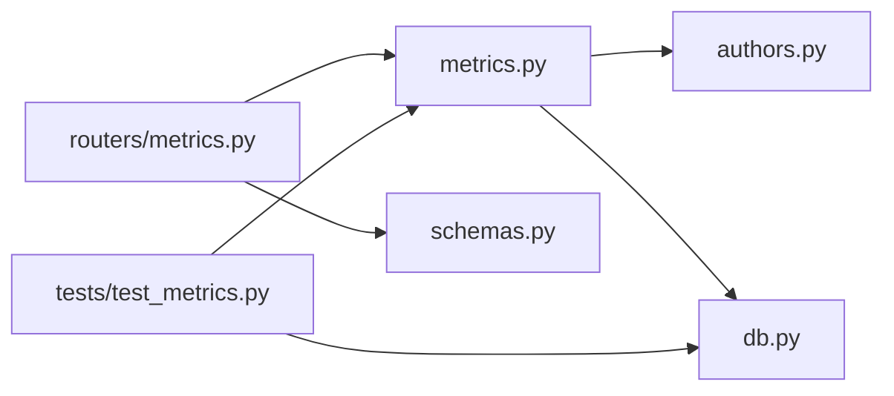

# Metrics Engine

<cite>
**Referenced Files in This Document**
- [metrics.py](file://backend/app/metrics.py)
- [routers/metrics.py](file://backend/app/routers/metrics.py)
- [schemas.py](file://backend/app/schemas.py)
- [db.py](file://backend/app/db.py)
- [authors.py](file://backend/app/authors.py)
- [test_metrics.py](file://backend/tests/test_metrics.py)
</cite>

## Table of Contents
1. [Introduction](#introduction)
2. [Project Structure](#project-structure)
3. [Core Components](#core-components)
4. [Architecture Overview](#architecture-overview)
5. [Detailed Component Analysis](#detailed-component-analysis)
6. [Dependency Analysis](#dependency-analysis)
7. [Performance Considerations](#performance-considerations)
8. [Troubleshooting Guide](#troubleshooting-guide)
9. [Conclusion](#conclusion)

## Introduction
This document explains the metrics calculation engine used by RAT to compute repository analytics. The engine computes file-level and directory-level metrics, author ownership, commit-set summaries, time-series aggregations, and per-commit object statistics. It is implemented as a SQL-driven aggregation layer over an SQLite database, with a small Python caching layer and FastAPI routing for request handling.

The engine supports multiple view types:
- Summary: aggregate metrics for one object or the whole repository.
- Files: per-file metrics under a selected object.
- Dirs: recursive directory metrics with de-duplicated modification counts.
- Authors: per-author modifications, churn, commits, and ownership.
- Timeseries: added/removed/growth/churn over time buckets.
- Commits: paged commit list with optional object-scoped change filtering.

## Project Structure
The metrics engine lives primarily in the backend application:
- `backend/app/metrics.py` defines the metric formulas, filters, views, and cache.
- `backend/app/routers/metrics.py` exposes a single POST endpoint that dispatches to the correct view.
- `backend/app/schemas.py` defines the shared request model for all metric queries.
- `backend/app/db.py` defines the schema and connection helpers.
- `backend/app/authors.py` provides author identity resolution and merge-group support.
- `backend/tests/test_metrics.py` contains golden tests validating formula correctness.

**Diagram sources**
- [routers/metrics.py:13-40](file://backend/app/routers/metrics.py#L13-L40)
- [metrics.py:389-400](file://backend/app/metrics.py#L389-L400)
- [db.py:13-71](file://backend/app/db.py#L13-L71)
- [authors.py:15-25](file://backend/app/authors.py#L15-L25)

**Section sources**
- [metrics.py:1-435](file://backend/app/metrics.py#L1-L435)
- [routers/metrics.py:1-41](file://backend/app/routers/metrics.py#L1-L41)
- [schemas.py:14-24](file://backend/app/schemas.py#L14-L24)
- [db.py:13-87](file://backend/app/db.py#L13-L87)
- [authors.py:1-131](file://backend/app/authors.py#L1-L131)
- [test_metrics.py:1-310](file://backend/tests/test_metrics.py#L1-L310)

## Core Components
- Filter: Encapsulates query constraints such as time range, manual commit selection, author filter, path/object type, granularity, pagination, and “only changed” mode.
- Views: Functions implementing each metric view (summary, files, dirs, authors, timeseries, commits).
- Commit set CTE: Builds the effective commit set H with merged-author resolution and applies filters.
- Derived metrics: Computes growth, churn, modification frequency, and churn rate from raw added/removed/modifications.
- Cache: A tiny TTL-based in-memory cache keyed by repo, view, and serialized filter payload.
- Router: Validates view names, checks repository readiness, constructs Filter objects, executes views, wraps responses, and caches results.

Key responsibilities:
- Formula correctness: All metric definitions are centralized in the module docstring and applied consistently across views.
- Object scoping: File and directory scoping use exact match and path-prefix semantics respectively.
- Modification counting: De-duplicates modifications per commit for directories and per-object aggregates.
- Author ownership: Uses merged-author keys and total churn to compute ownership fractions.
- Time bucketing: Supports day, week, and month buckets using SQLite date functions.

**Section sources**
- [metrics.py:43-54](file://backend/app/metrics.py#L43-L54)
- [metrics.py:117-128](file://backend/app/metrics.py#L117-L128)
- [metrics.py:135-155](file://backend/app/metrics.py#L135-L155)
- [metrics.py:158-183](file://backend/app/metrics.py#L158-L183)
- [metrics.py:186-248](file://backend/app/metrics.py#L186-L248)
- [metrics.py:251-279](file://backend/app/metrics.py#L251-L279)
- [metrics.py:291-329](file://backend/app/metrics.py#L291-L329)
- [metrics.py:332-386](file://backend/app/metrics.py#L332-L386)
- [metrics.py:407-435](file://backend/app/metrics.py#L407-L435)

## Architecture Overview
The metrics engine follows a layered architecture:
- API Layer: FastAPI router validates inputs and delegates to the engine.
- Query Layer: The engine builds a common commit set CTE and joins it with file changes to compute aggregates.
- Storage Layer: SQLite tables store commits, file changes, and author merges.
- Caching Layer: In-memory TTL cache avoids recomputation for identical requests within a short window.

**Diagram sources**
- [routers/metrics.py:13-40](file://backend/app/routers/metrics.py#L13-L40)
- [metrics.py:399-400](file://backend/app/metrics.py#L399-L400)
- [metrics.py:407-435](file://backend/app/metrics.py#L407-L435)
- [db.py:74-81](file://backend/app/db.py#L74-L81)

## Detailed Component Analysis

### Filter and Commit Set Construction
The Filter dataclass centralizes all query parameters. Its object_clause method generates where fragments for exact file matches or directory prefix ranges. The _prepare helper materializes manual commit selections into a temporary table so they can be referenced efficiently in SQL. The _h_cte function composes the commit set H with author merging and optional author filtering.

**Diagram sources**
- [metrics.py:43-64](file://backend/app/metrics.py#L43-L64)
- [metrics.py:67-109](file://backend/app/metrics.py#L67-L109)

**Section sources**
- [metrics.py:43-64](file://backend/app/metrics.py#L43-L64)
- [metrics.py:67-109](file://backend/app/metrics.py#L67-L109)

### File-Level Metrics View
The files view computes per-file added, removed, and modifications across the commit set H. It groups by file path and orders by total churn descending, then path. Each row is enriched with derived metrics via the shared derivation helper.

**Diagram sources**
- [metrics.py:158-183](file://backend/app/metrics.py#L158-L183)

**Section sources**
- [metrics.py:158-183](file://backend/app/metrics.py#L158-L183)

### Directory Metrics with Recursive Aggregation
The dirs view performs recursive directory aggregation by walking file paths and attributing changes to ancestor directories. It de-duplicates modifications per commit: if a commit touches multiple files in the same directory, it counts once for that directory. The implementation processes rows ordered by sha, tracks touched directories per commit, and accumulates added/removed totals.

**Diagram sources**
- [metrics.py:186-248](file://backend/app/metrics.py#L186-L248)

**Section sources**
- [metrics.py:186-248](file://backend/app/metrics.py#L186-L248)

### Author Ownership Calculations
The authors view aggregates per-author commits, modifications, and churn, then computes ownership as the fraction of total churn attributed to each author. Author identity uses merged-author keys when applicable; otherwise it falls back to email-based identities.

**Diagram sources**
- [metrics.py:251-279](file://backend/app/metrics.py#L251-L279)
- [authors.py:15-25](file://backend/app/authors.py#L15-L25)

**Section sources**
- [metrics.py:251-279](file://backend/app/metrics.py#L251-L279)
- [authors.py:15-25](file://backend/app/authors.py#L15-L25)

### Time-Series Analysis
The timeseries view aggregates metrics over configurable time buckets (day, week, month). It uses SQLite strftime/date functions to compute bucket labels and converts them to Unix timestamps for downstream charting.

**Diagram sources**
- [metrics.py:282-329](file://backend/app/metrics.py#L282-L329)

**Section sources**
- [metrics.py:282-329](file://backend/app/metrics.py#L282-L329)

### Commit Set Rows View
The commit_set_rows view returns paginated commits with their object-level stats. When only_changed is enabled, it filters out commits that do not touch the selected object. It also computes a separate total count when filtering by changes.

**Diagram sources**
- [metrics.py:332-386](file://backend/app/metrics.py#L332-L386)

**Section sources**
- [metrics.py:332-386](file://backend/app/metrics.py#L332-L386)

### Metric Validation System
Validation occurs at two layers:
- Request validation: Pydantic enforces field types and allowed literals for object_type and granularity.
- View validation: The router rejects unknown view names with a 404 error.

Repository readiness is checked before executing any view; non-ready repositories return a conflict response.

**Section sources**
- [schemas.py:14-24](file://backend/app/schemas.py#L14-L24)
- [routers/metrics.py:13-30](file://backend/app/routers/metrics.py#L13-L30)

### Response Formatting
Each view returns a dictionary containing computed fields. The router wraps the result with repo_id and view metadata. The cache stores the full response, including these wrapper fields.

Derived fields include:
- growth = added - removed
- churn = added + removed
- modification_frequency = modifications / commit_count
- churn_rate = churn / commit_count

**Section sources**
- [metrics.py:117-128](file://backend/app/metrics.py#L117-L128)
- [routers/metrics.py:38-40](file://backend/app/routers/metrics.py#L38-L40)

### Integration with Filtering Framework
The Filter class integrates with the broader filtering framework by:
- Supporting inclusive start and exclusive end timestamps for H_t and H_i,j.
- Accepting manual commit lists to override time ranges.
- Filtering by author keys, including merged-author group identifiers.
- Scoping by file or directory path.
- Enabling “only changed” mode for commit listings.

These filters are translated into SQL where clauses and CTEs, ensuring consistent behavior across all views.

**Section sources**
- [metrics.py:43-64](file://backend/app/metrics.py#L43-L64)
- [metrics.py:76-109](file://backend/app/metrics.py#L76-L109)

### Examples of Custom Metric Definitions
While the engine does not expose a dynamic plugin interface for custom metrics, new views can be added by:
- Implementing a function that accepts conn, repo_id, and Filter.
- Reusing _prepare, _h_cte, object_clause, and _derive helpers.
- Registering the function in the VIEWS mapping.
- Optionally adding cache key generation logic in the router if needed.

Existing examples demonstrate how to structure new views:
- summary: simple aggregation over one object.
- files: grouped aggregation by path.
- dirs: iterative aggregation with per-commit de-duplication.
- authors: grouped aggregation with ownership computation.
- timeseries: bucketed aggregation with timestamp conversion.
- commits: paginated listing with optional change filtering.

**Section sources**
- [metrics.py:135-155](file://backend/app/metrics.py#L135-L155)
- [metrics.py:158-183](file://backend/app/metrics.py#L158-L183)
- [metrics.py:186-248](file://backend/app/metrics.py#L186-L248)
- [metrics.py:251-279](file://backend/app/metrics.py#L251-L279)
- [metrics.py:291-329](file://backend/app/metrics.py#L291-L329)
- [metrics.py:332-386](file://backend/app/metrics.py#L332-L386)
- [metrics.py:389-400](file://backend/app/metrics.py#L389-L400)

## Dependency Analysis
The metrics engine depends on:
- SQLite database schema for commits, file_changes, merged_authors, and author_merges.
- Author identity module for merged-author resolution.
- Pydantic models for request validation.
- FastAPI router for HTTP endpoints.

**Diagram sources**
- [metrics.py:37-38](file://backend/app/metrics.py#L37-L38)
- [routers/metrics.py:8-9](file://backend/app/routers/metrics.py#L8-L9)
- [test_metrics.py:12-13](file://backend/tests/test_metrics.py#L12-L13)

**Section sources**
- [metrics.py:37-38](file://backend/app/metrics.py#L37-L38)
- [routers/metrics.py:8-9](file://backend/app/routers/metrics.py#L8-L9)
- [test_metrics.py:12-13](file://backend/tests/test_metrics.py#L12-L13)

## Performance Considerations
- SQL-driven aggregation: Most heavy lifting is delegated to SQLite, leveraging indexes on committer_ts, author_email, and file_changes path.
- Temporary tables: Manual commit selections are materialized in a temp table to avoid repeated subqueries.
- Limits and offsets: Views clamp limits to reasonable bounds to prevent excessive memory usage.
- De-duplication strategy: Directory metrics track touched directories per commit to avoid double-counting modifications.
- Cache eviction: The TTL cache clears entirely when exceeding a maximum size, preventing unbounded growth.
- Repository readiness check: Early rejection of non-ready repositories avoids unnecessary computation.

Optimization opportunities:
- Consider precomputing directory hierarchies for very deep trees to reduce string splitting overhead.
- Add composite indexes on (repo_id, sha, path) if file_changes scans become bottlenecks.
- Use streaming cursors for large result sets to reduce memory pressure.
- Introduce view-specific caching strategies beyond the generic TTL cache.

[No sources needed since this section provides general guidance]

## Troubleshooting Guide
Common issues and resolutions:
- Unknown view name: Ensure the view parameter matches one of the registered views (summary, files, dirs, authors, timeseries, commits).
- Repository not found: Verify the repo_id exists and is ready. Non-ready repositories return a conflict status.
- Empty results: Check filter boundaries (start/end), manual commit list, author keys, and path/object_type.
- Incorrect directory modification counts: Confirm that the dirs view de-duplicates modifications per commit; verify input data has distinct file paths per commit.
- Ownership sum not equal to 1.0: Ensure churn_total is computed correctly and no zero-churn edge cases are miscounted.

Relevant test cases validate:
- Root and scoped summary metrics.
- Time range boundaries and manual commit selection.
- Author filtering and merged-author behavior.
- Files and dirs view correctness.
- Timeseries bucketing and commits view pagination.

**Section sources**
- [routers/metrics.py:13-30](file://backend/app/routers/metrics.py#L13-L30)
- [test_metrics.py:81-103](file://backend/tests/test_metrics.py#L81-L103)
- [test_metrics.py:109-153](file://backend/tests/test_metrics.py#L109-L153)
- [test_metrics.py:160-206](file://backend/tests/test_metrics.py#L160-L206)
- [test_metrics.py:212-270](file://backend/tests/test_metrics.py#L212-L270)
- [test_metrics.py:289-310](file://backend/tests/test_metrics.py#L289-L310)

## Conclusion
RAT’s metrics engine provides a robust, SQL-centric approach to computing repository analytics. It centralizes metric formulas, supports multiple view types, and integrates author merging, filtering, and caching. The design emphasizes correctness through comprehensive tests and performance through efficient SQL aggregation and careful memory management. New views can be added by following the established patterns and leveraging shared helpers.

[No sources needed since this section summarizes without analyzing specific files]