# Data Processing

<cite>
**Referenced Files in This Document**
- [README.md](file://README.md)
- [main.py](file://backend/app/main.py)
- [ingest.py](file://backend/app/ingest.py)
- [metrics.py](file://backend/app/metrics.py)
- [db.py](file://backend/app/db.py)
- [authors.py](file://backend/app/authors.py)
- [routers/metrics.py](file://backend/app/routers/metrics.py)
- [verify_metrics.py](file://scripts/verify_metrics.py)
- [conftest.py](file://backend/tests/conftest.py)
- [test_metrics.py](file://backend/tests/test_metrics.py)
- [expected_example.json](file://scripts/expected_example.json)
</cite>

## Table of Contents
1. [Introduction](#introduction)
2. [Project Structure](#project-structure)
3. [Core Components](#core-components)
4. [Architecture Overview](#architecture-overview)
5. [Detailed Component Analysis](#detailed-component-analysis)
6. [Dependency Analysis](#dependency-analysis)
7. [Performance Considerations](#performance-considerations)
8. [Troubleshooting Guide](#troubleshooting-guide)
9. [Conclusion](#conclusion)
10. [Appendices](#appendices)

## Introduction
This document explains RAT’s data processing pipeline with a focus on git integration and metrics calculation. It covers how repository history is streamed from `git log`, how large repositories are processed with bounded memory, how changes are batched into SQLite, and how the metrics engine computes added/removed lines, growth, churn, modification frequency, ownership, directory recursion, time-series bucketing, and authorship. It also documents verification workflows and performance characteristics.

RAT ingests each repository once and then answers dashboard queries as fast SQL aggregations over an indexed SQLite database. The entire history is parsed in one streamed `git log` pass per repository, delegating rename detection and binary handling to git itself.

**Section sources**
- [README.md:1-15](file://README.md#L1-L15)
- [README.md:168-194](file://README.md#L168-L194)

## Project Structure
The backend implements ingestion, storage, author identity resolution, metric views, and FastAPI routers. The frontend is not part of this data-processing documentation.

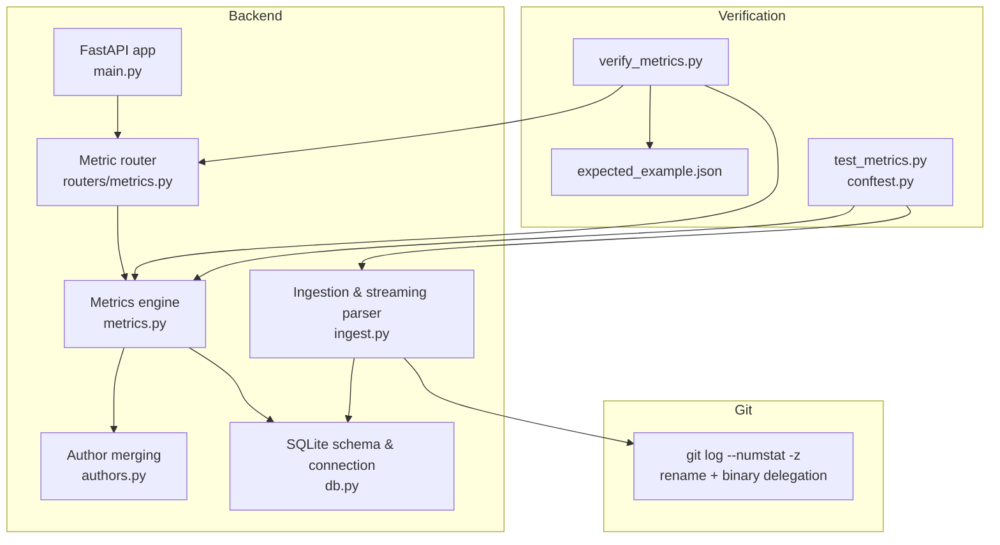

**Diagram sources**
- [main.py:1-49](file://backend/app/main.py#L1-L49)
- [routers/metrics.py:1-41](file://backend/app/routers/metrics.py#L1-L41)
- [ingest.py:1-439](file://backend/app/ingest.py#L1-L439)
- [metrics.py:1-435](file://backend/app/metrics.py#L1-L435)
- [authors.py:1-131](file://backend/app/authors.py#L1-L131)
- [db.py:1-87](file://backend/app/db.py#L1-L87)
- [verify_metrics.py:1-288](file://scripts/verify_metrics.py#L1-L288)
- [test_metrics.py:1-310](file://backend/tests/test_metrics.py#L1-L310)
- [conftest.py:1-175](file://backend/tests/conftest.py#L1-L175)
- [expected_example.json:1-37](file://scripts/expected_example.json#L1-L37)

**Section sources**
- [main.py:1-49](file://backend/app/main.py#L1-L49)
- [README.md:196-206](file://README.md#L196-L206)

## Core Components
- **Ingestion**: Acquires a repository via zip upload or clone, streams `git log`, parses NUL-delimited tokens incrementally, and inserts commits and file changes in batches.
- **Storage**: SQLite schema with multi-repository keys, indexes for time and path filtering, WAL mode, and foreign keys.
- **Metrics Engine**: Defines all formulas and provides SQL-backed views for summary, files, directories, authors, timeseries, and commit-set rows.
- **Author Resolution**: Applies `.mailmap` at ingest and supports manual merge groups resolved at query time without re-indexing.
- **Verification**: A script that runs standard views against a server or local process and compares results to expected values.

**Section sources**
- [ingest.py:1-20](file://backend/app/ingest.py#L1-L20)
- [db.py:13-58](file://backend/app/db.py#L13-L58)
- [metrics.py:1-28](file://backend/app/metrics.py#L1-L28)
- [authors.py:1-26](file://backend/app/authors.py#L1-L26)
- [verify_metrics.py:1-31](file://scripts/verify_metrics.py#L1-L31)

## Architecture Overview
The ingestion pipeline runs one subprocess per repository and streams the output of `git log`. The metrics pipeline reads from SQLite using prepared CTEs and indexes. Author merges are applied through shared SQL fragments.

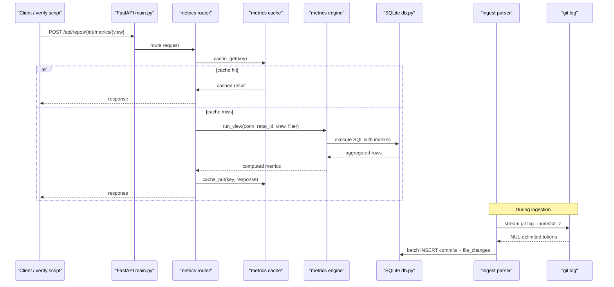

**Diagram sources**
- [main.py:13-27](file://backend/app/main.py#L13-L27)
- [routers/metrics.py:13-40](file://backend/app/routers/metrics.py#L13-L40)
- [metrics.py:399-435](file://backend/app/metrics.py#L399-L435)
- [ingest.py:280-354](file://backend/app/ingest.py#L280-L354)
- [db.py:74-81](file://backend/app/db.py#L74-L81)

## Detailed Component Analysis

### Git Integration and Streamed Parsing
RAT invokes `git log` once per repository with options that:
- Exclude merge commits.
- Delegate rename detection to git (`-M50%`).
- Emit numstat change counts.
- Use NUL-delimited records for safe incremental parsing.
- Include a structured header with SHA, parents, author fields, committer timestamp, and subject.

The parser splits the binary stream by NUL bytes and processes tokens incrementally. It recognizes:
- Commit headers.
- Normal file changes with added/removed line counts.
- Binary entries (skipped).
- Rename entries where the path token is empty; it captures old and new paths.

Memory usage remains bounded because the parser yields committed records rather than buffering the full history.

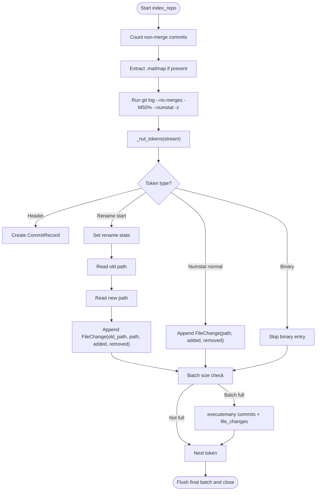

**Diagram sources**
- [ingest.py:280-354](file://backend/app/ingest.py#L280-L354)
- [ingest.py:190-273](file://backend/app/ingest.py#L190-L273)

Key implementation details:
- One subprocess per repository avoids per-commit overhead.
- Progress reporting uses monotonic timing and percentage estimates.
- Batches flush when either commit or change buffers exceed thresholds.
- Errors propagate as user-actionable exceptions.

**Section sources**
- [ingest.py:1-20](file://backend/app/ingest.py#L1-L20)
- [ingest.py:61-66](file://backend/app/ingest.py#L61-L66)
- [ingest.py:190-273](file://backend/app/ingest.py#L190-L273)
- [ingest.py:280-354](file://backend/app/ingest.py#L280-L354)

### Memory-Efficient Processing of Large Repositories
- Incremental NUL-token parsing prevents loading the entire git output into memory.
- Batched inserts use `executemany` for both commits and file changes.
- WAL mode and synchronous settings reduce write contention while maintaining durability.
- Temporary mailmap files are cleaned up after indexing.
- Background ingestion threads allow UI responsiveness.

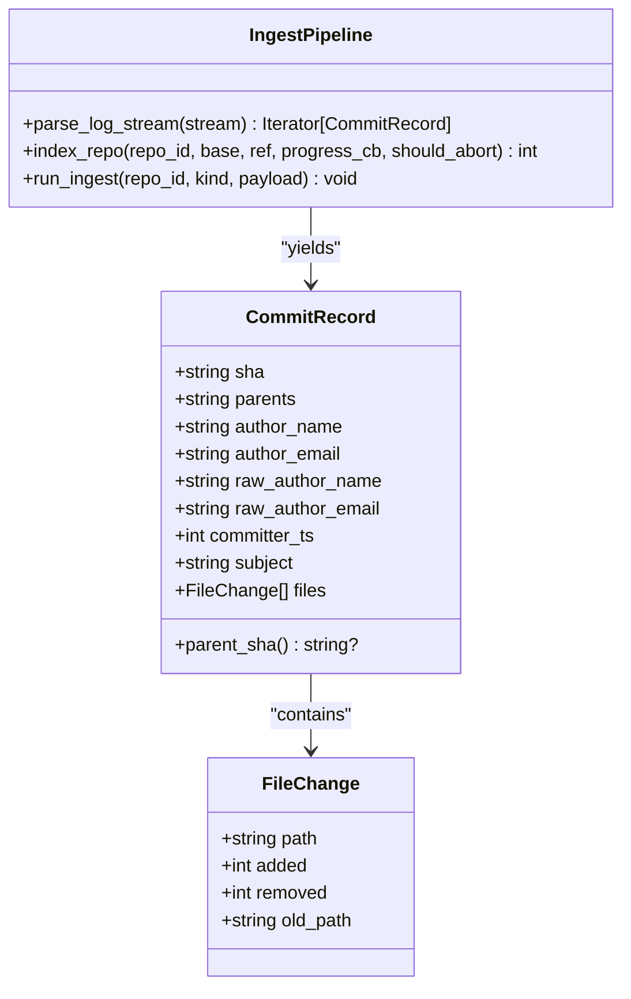

**Diagram sources**
- [ingest.py:164-188](file://backend/app/ingest.py#L164-L188)
- [ingest.py:205-273](file://backend/app/ingest.py#L205-L273)
- [ingest.py:280-354](file://backend/app/ingest.py#L280-L354)

**Section sources**
- [ingest.py:190-273](file://backend/app/ingest.py#L190-L273)
- [ingest.py:306-343](file://backend/app/ingest.py#L306-L343)
- [db.py:74-81](file://backend/app/db.py#L74-L81)

### Batched Database Insertion Strategies
- Commits and file changes are accumulated in lists until thresholds are reached.
- Inserts use `INSERT OR REPLACE` to support re-ingestion safely.
- After completion, `ANALYZE` updates SQLite statistics for better query plans.
- Cache invalidation is triggered after successful indexing.

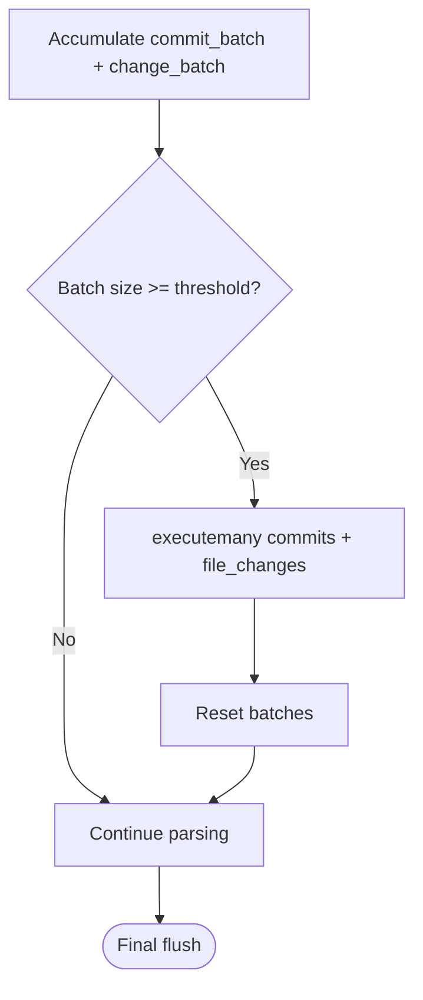

**Diagram sources**
- [ingest.py:306-343](file://backend/app/ingest.py#L306-L343)
- [ingest.py:419-422](file://backend/app/ingest.py#L419-L422)

**Section sources**
- [ingest.py:306-343](file://backend/app/ingest.py#L306-L343)
- [ingest.py:419-422](file://backend/app/ingest.py#L419-L422)

### Metrics Calculation Engine
The metrics engine defines the canonical formulas and implements them as SQL-backed views.

Formulas:
- Added/removed lines per commit vs first parent: `l⁺`, `l⁻`.
- Growth: `δ = l⁺ − l⁻`.
- Churn: `λ = l⁺ + l⁻`.
- Modification indicator: `I_n(h,o) = 1 ⇔ λ_h,o > 0`.
- Directory metrics: recursive sum over subtree files.
- Commit set H aggregation: sums of `l⁺`, `l⁻`, `δ`, `λ`; count of modified commits `n_H,o`.
- Modification frequency: `η = n_H,o / |H|` (0 when `|H| = 0`).
- Churn rate: `ρ = λ_H,o / |H|` (0 when `|H| = 0`).
- Authorship:
  - `I(a,h) = 1 ⇔ a == h[a]`.
  - `n_H,o,a = Σ_h I(a,h)·I_n(h,o)`.
  - `λ_H,o,a = Σ_h λ_h,o·I(a,h)`.
  - Ownership: `ω = λ_H,o,a / λ_H,o` (0 when `λ_H,o = 0`).

Views:
- Summary: aggregate totals and derived metrics for a scope.
- Files: per-file metrics under the selected object.
- Dirs: recursive directory metrics with per-commit de-duplication.
- Authors: per-author modifications, churn, and ownership.
- Timeseries: bucketed time series by day/week/month.
- Commits: paged commit-set rows with optional object-level stats.

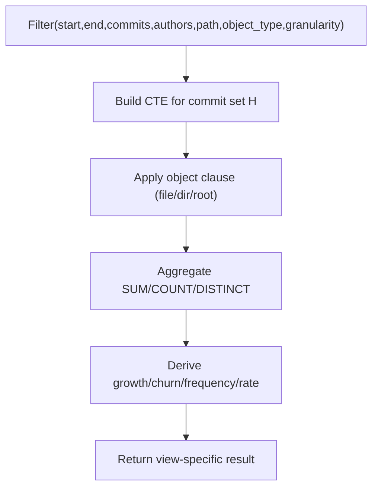

**Diagram sources**
- [metrics.py:43-128](file://backend/app/metrics.py#L43-L128)
- [metrics.py:135-183](file://backend/app/metrics.py#L135-L183)
- [metrics.py:186-248](file://backend/app/metrics.py#L186-L248)
- [metrics.py:251-279](file://backend/app/metrics.py#L251-L279)
- [metrics.py:282-329](file://backend/app/metrics.py#L282-L329)
- [metrics.py:332-386](file://backend/app/metrics.py#L332-L386)

**Section sources**
- [metrics.py:1-28](file://backend/app/metrics.py#L1-L28)
- [metrics.py:43-128](file://backend/app/metrics.py#L43-L128)
- [metrics.py:135-183](file://backend/app/metrics.py#L135-L183)
- [metrics.py:186-248](file://backend/app/metrics.py#L186-L248)
- [metrics.py:251-279](file://backend/app/metrics.py#L251-L279)
- [metrics.py:282-329](file://backend/app/metrics.py#L282-L329)
- [metrics.py:332-386](file://backend/app/metrics.py#L332-L386)

### SQL Aggregation Strategies
- Commit set H is materialized as a CTE with optional manual selection table `_sel_shas`.
- Object scoping uses exact match for files and prefix ranges for directories: `path >= 'dir/' AND path < 'dir0'`.
- Indexes used:
  - `(repo_id, committer_ts)` for time-range filters.
  - `(repo_id, path)` for directory/file scoping.
  - Primary key `(repo_id, sha, path)` for joins and deduplication.
- Directory metrics perform a single ordered scan and de-duplicate modifications per commit using a set of touched directories.

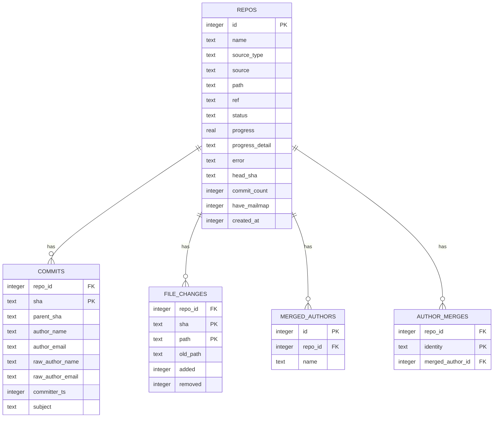

**Diagram sources**
- [db.py:13-71](file://backend/app/db.py#L13-L71)

**Section sources**
- [metrics.py:67-109](file://backend/app/metrics.py#L67-L109)
- [metrics.py:135-183](file://backend/app/metrics.py#L135-L183)
- [metrics.py:186-248](file://backend/app/metrics.py#L186-L248)
- [db.py:44-57](file://backend/app/db.py#L44-L57)

### Directory Recursive Calculations
Directory metrics compute subtree aggregates by iterating over file changes in commit order. For each changed file, it walks ancestor directories and accumulates added/removed lines. Modifications are counted once per commit per directory using a touched set.

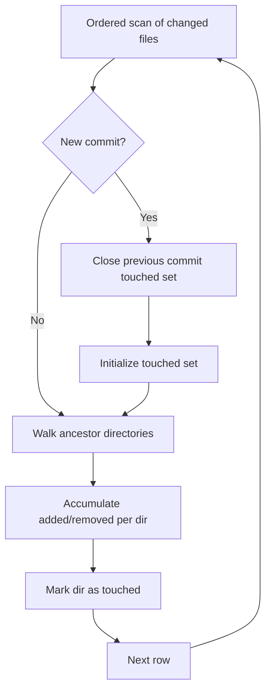

**Diagram sources**
- [metrics.py:186-248](file://backend/app/metrics.py#L186-L248)

**Section sources**
- [metrics.py:186-248](file://backend/app/metrics.py#L186-L248)

### Time-Series Bucketing
Time buckets are computed using SQLite date functions:
- Day: `%Y-%m-%d`.
- Month: `%Y-%m-01`.
- Week: ISO-like week starting Monday.

Each bucket aggregates added, removed, commits, and modifications, then converts bucket strings back to timestamps for the frontend.

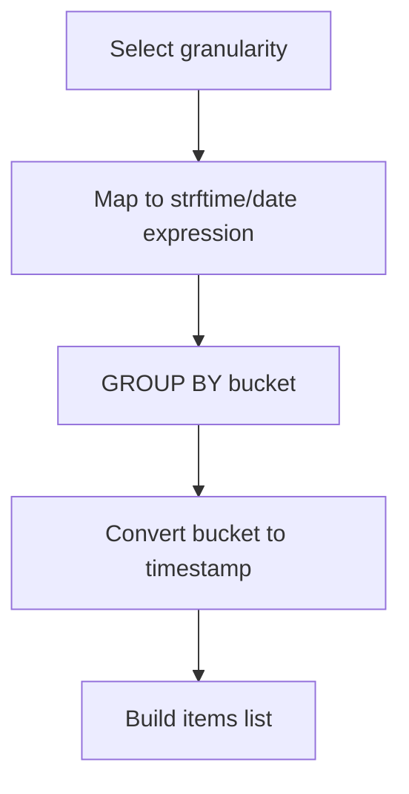

**Diagram sources**
- [metrics.py:282-329](file://backend/app/metrics.py#L282-L329)

**Section sources**
- [metrics.py:282-329](file://backend/app/metrics.py#L282-L329)

### Author Identity Resolution and Ownership
Author identities are resolved through:
- `.mailmap` applied during ingestion.
- Manual merge groups stored in `author_merges` and `merged_authors`.
- Shared SQL fragments computing effective author key and name at query time.

Ownership is calculated as the ratio of an author’s churn to total churn within the filtered commit set.

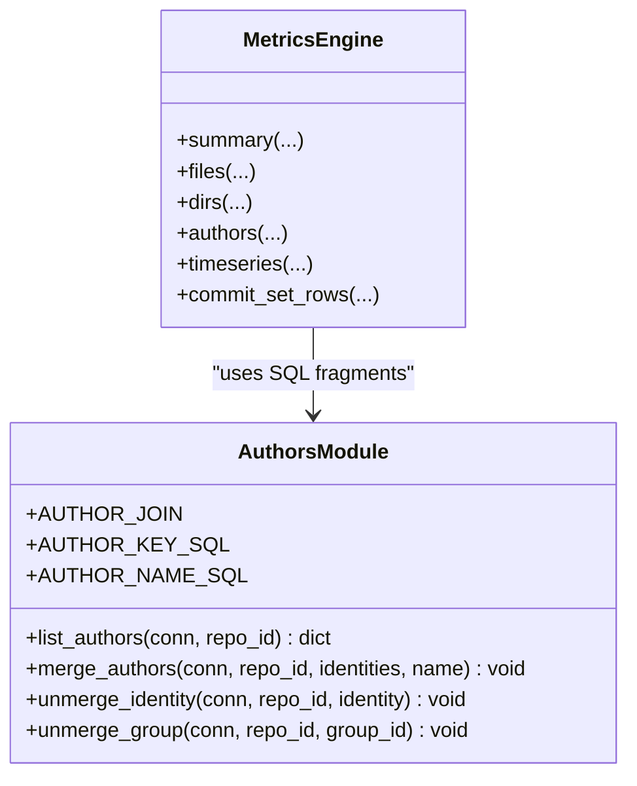

**Diagram sources**
- [authors.py:15-26](file://backend/app/authors.py#L15-L26)
- [authors.py:28-60](file://backend/app/authors.py#L28-L60)
- [authors.py:63-131](file://backend/app/authors.py#L63-L131)
- [metrics.py:251-279](file://backend/app/metrics.py#L251-L279)

**Section sources**
- [authors.py:1-26](file://backend/app/authors.py#L1-L26)
- [authors.py:28-60](file://backend/app/authors.py#L28-L60)
- [authors.py:63-131](file://backend/app/authors.py#L63-L131)
- [metrics.py:251-279](file://backend/app/metrics.py#L251-L279)

### API Integration and Caching
The metric router validates the view, builds a cache key from repository ID, view name, and sorted JSON payload, checks the TTL cache, executes the view, and stores the response.

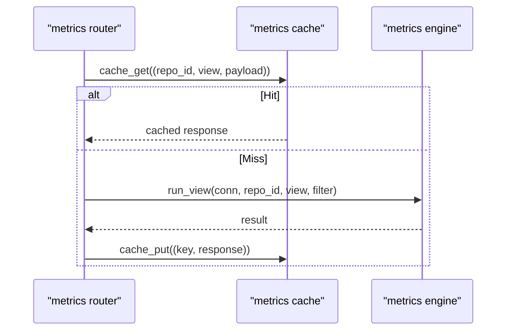

**Diagram sources**
- [routers/metrics.py:13-40](file://backend/app/routers/metrics.py#L13-L40)
- [metrics.py:407-435](file://backend/app/metrics.py#L407-L435)

**Section sources**
- [routers/metrics.py:13-40](file://backend/app/routers/metrics.py#L13-L40)
- [metrics.py:407-435](file://backend/app/metrics.py#L407-L435)

### Verification Processes
The verification script supports two modes:
- Server mode: calls the running API endpoints and collects results.
- Local mode: sets an isolated data directory, ingests in-process, and runs metric views directly.

It prints a report and optionally compares results to expected values with toleranced float matching.

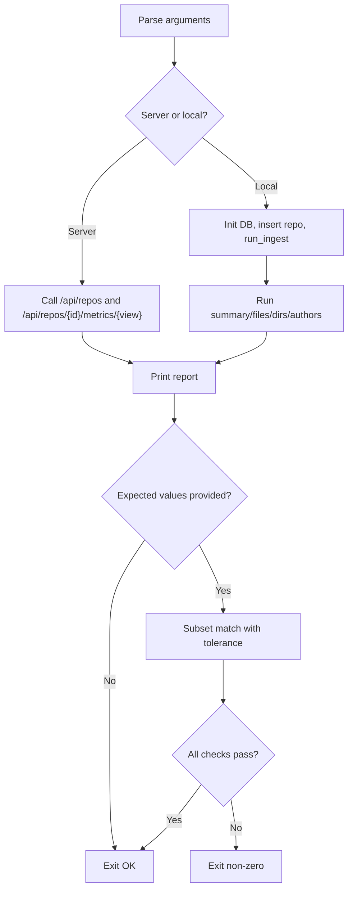

**Diagram sources**
- [verify_metrics.py:56-107](file://scripts/verify_metrics.py#L56-L107)
- [verify_metrics.py:114-150](file://scripts/verify_metrics.py#L114-L150)
- [verify_metrics.py:157-241](file://scripts/verify_metrics.py#L157-L241)
- [verify_metrics.py:246-288](file://scripts/verify_metrics.py#L246-L288)

**Section sources**
- [verify_metrics.py:1-31](file://scripts/verify_metrics.py#L1-L31)
- [verify_metrics.py:56-107](file://scripts/verify_metrics.py#L56-L107)
- [verify_metrics.py:114-150](file://scripts/verify_metrics.py#L114-L150)
- [verify_metrics.py:157-241](file://scripts/verify_metrics.py#L157-L241)
- [verify_metrics.py:246-288](file://scripts/verify_metrics.py#L246-L288)

## Dependency Analysis
The following diagram shows module dependencies relevant to data processing.

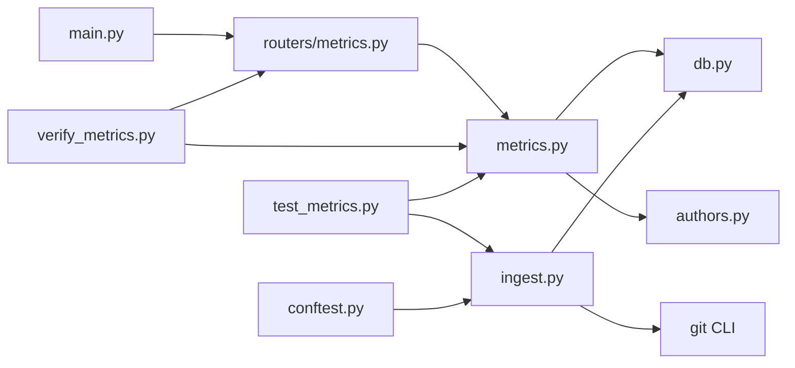

**Diagram sources**
- [main.py:1-49](file://backend/app/main.py#L1-L49)
- [routers/metrics.py:1-41](file://backend/app/routers/metrics.py#L1-L41)
- [metrics.py:1-435](file://backend/app/metrics.py#L1-L435)
- [db.py:1-87](file://backend/app/db.py#L1-L87)
- [authors.py:1-131](file://backend/app/authors.py#L1-L131)
- [ingest.py:1-439](file://backend/app/ingest.py#L1-L439)
- [verify_metrics.py:1-288](file://scripts/verify_metrics.py#L1-L288)
- [test_metrics.py:1-310](file://backend/tests/test_metrics.py#L1-L310)
- [conftest.py:1-175](file://backend/tests/conftest.py#L1-L175)

**Section sources**
- [main.py:1-49](file://backend/app/main.py#L1-L49)
- [routers/metrics.py:1-41](file://backend/app/routers/metrics.py#L1-L41)
- [metrics.py:1-435](file://backend/app/metrics.py#L1-L435)
- [db.py:1-87](file://backend/app/db.py#L1-L87)
- [authors.py:1-131](file://backend/app/authors.py#L1-L131)
- [ingest.py:1-439](file://backend/app/ingest.py#L1-L439)
- [verify_metrics.py:1-288](file://scripts/verify_metrics.py#L1-L288)
- [test_metrics.py:1-310](file://backend/tests/test_metrics.py#L1-L310)
- [conftest.py:1-175](file://backend/tests/conftest.py#L1-L175)

## Performance Considerations
- Streaming git log avoids loading entire histories into memory.
- Batched inserts reduce transaction overhead.
- Indexes on `(repo_id, committer_ts)` and `(repo_id, path)` optimize time-range and directory scoping.
- Directory metrics use a single ordered scan with per-commit de-duplication.
- Response cache with short TTL absorbs repeated dashboard queries.
- Rename detection cost is paid once at ingest; queries rely on indexes only.

Measured latencies demonstrate interactive performance even for large repositories.

**Section sources**
- [README.md:168-194](file://README.md#L168-L194)
- [ingest.py:306-343](file://backend/app/ingest.py#L306-L343)
- [metrics.py:407-435](file://backend/app/metrics.py#L407-L435)
- [db.py:44-57](file://backend/app/db.py#L44-L57)

## Troubleshooting Guide
Common issues and resolutions:
- Ingestion errors surface as actionable messages; check repository reference validity and archive safety.
- If cloning fails, ensure network access and credentials configuration.
- If metrics return “not ready,” wait for ingestion to complete or inspect repository status.
- Cache invalidation occurs automatically after successful indexing; manual invalidation can be triggered after author merges.

Use the verification script to reproduce issues locally or against a server and compare results to expected values.

**Section sources**
- [ingest.py:45-66](file://backend/app/ingest.py#L45-L66)
- [ingest.py:399-428](file://backend/app/ingest.py#L399-L428)
- [routers/metrics.py:24-30](file://backend/app/routers/metrics.py#L24-L30)
- [verify_metrics.py:68-81](file://scripts/verify_metrics.py#L68-L81)

## Conclusion
RAT’s data processing pipeline combines efficient git integration, streaming parsing, batched SQLite insertion, and precise SQL-based metrics computation. The design delegates expensive operations like rename detection to git, leverages indexes for fast queries, and maintains correctness through well-defined formulas and comprehensive tests. Verification tools enable confidence in metric accuracy across different repositories.

## Appendices

### Example Metric Calculations
Using the deterministic fixture:
- Repository root summary: added=19, removed=9, growth=10, churn=28, modifications=6, commit_count=9.
- File `src/x.py`: added=5, removed=2, growth=3, churn=7, modifications=2.
- Directory `src`: added=11, removed=2, growth=9, churn=13, modifications=4.
- Authors: Alice churn=13, Bob churn=13, Carol churn=2; ownership sums to 1.0.

These values are asserted by golden tests and can be reproduced via the verification script.

**Section sources**
- [test_metrics.py:81-102](file://backend/tests/test_metrics.py#L81-L102)
- [test_metrics.py:160-179](file://backend/tests/test_metrics.py#L160-L179)
- [test_metrics.py:181-206](file://backend/tests/test_metrics.py#L181-L206)
- [test_metrics.py:212-234](file://backend/tests/test_metrics.py#L212-L234)
- [conftest.py:1-21](file://backend/tests/conftest.py#L1-L21)