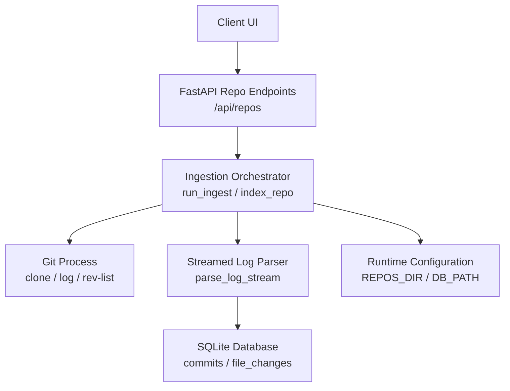
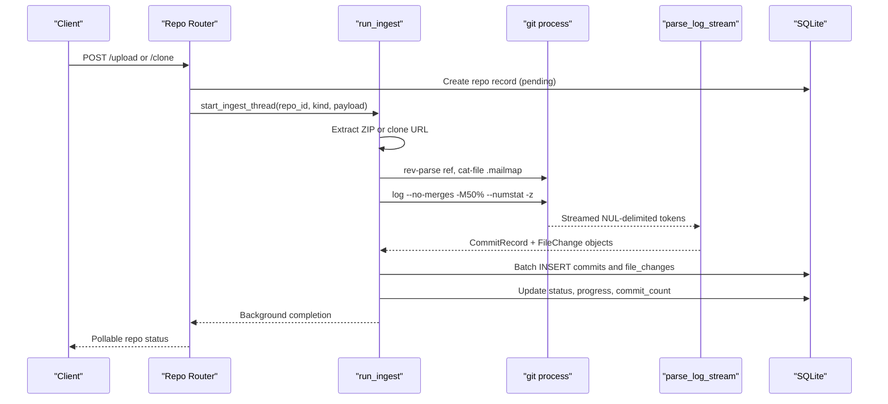
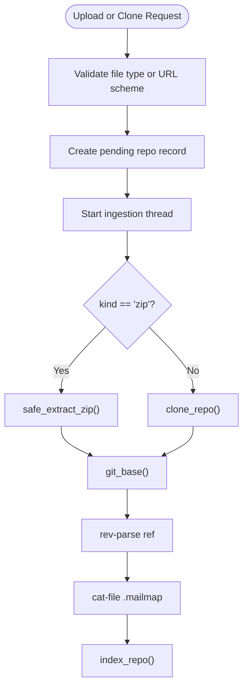
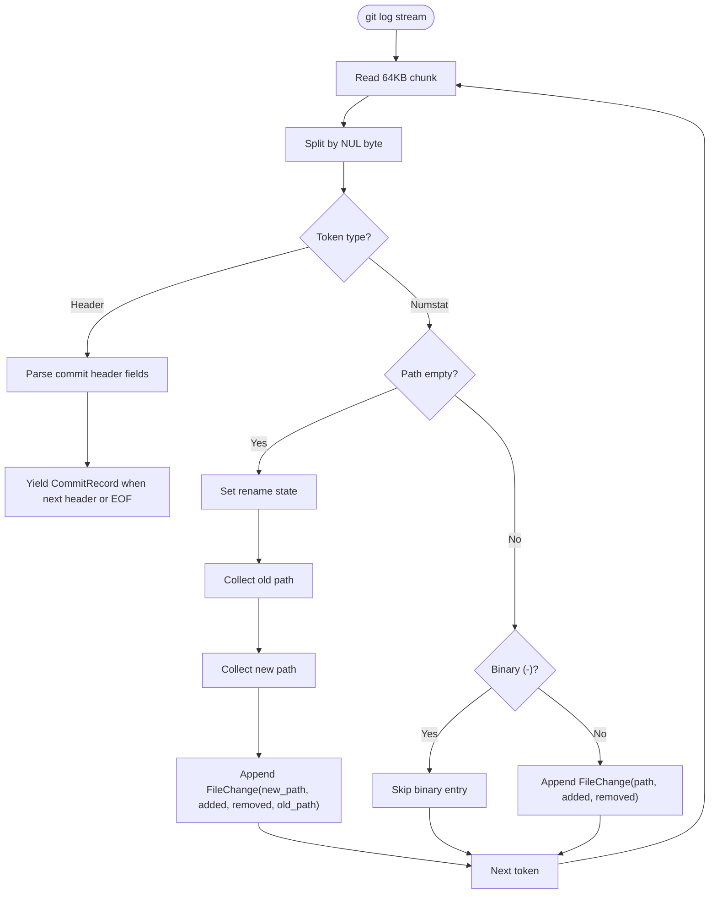
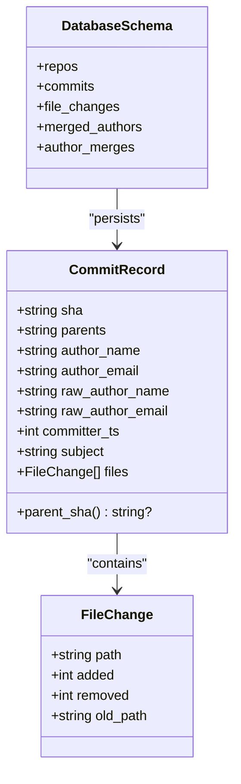
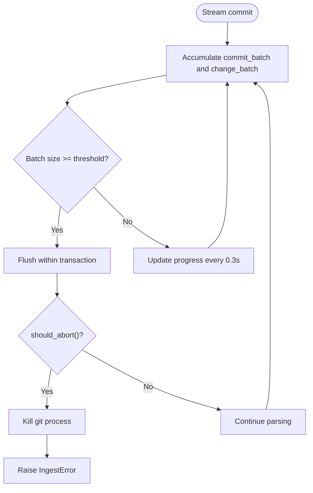
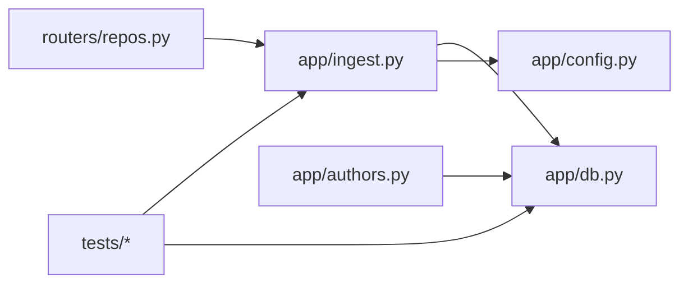

# Git Integration & Ingestion Pipeline

<cite>
**Referenced Files in This Document**
- [ingest.py](file://backend/app/ingest.py)
- [db.py](file://backend/app/db.py)
- [config.py](file://backend/app/config.py)
- [repos.py](file://backend/app/routers/repos.py)
- [authors.py](file://backend/app/authors.py)
- [test_parser.py](file://backend/tests/test_parser.py)
- [test_metrics.py](file://backend/tests/test_metrics.py)
</cite>

## Table of Contents
1. [Introduction](#introduction)
2. [Project Structure](#project-structure)
3. [Core Components](#core-components)
4. [Architecture Overview](#architecture-overview)
5. [Detailed Component Analysis](#detailed-component-analysis)
6. [Dependency Analysis](#dependency-analysis)
7. [Performance Considerations](#performance-considerations)
8. [Troubleshooting Guide](#troubleshooting-guide)
9. [Conclusion](#conclusion)

## Introduction
This document explains RAT’s git integration and ingestion pipeline. It focuses on how large repositories are acquired, parsed, and indexed without loading entire histories into memory. The pipeline supports:

- Cloning remote repositories via HTTP(S), SSH, or `git@` URLs.
- Uploading ZIP archives containing a repository with its `.git` directory.
- Streaming `git log` output to extract commits, parent relationships, file changes, author information, and timestamps.
- Applying repository-local mailmaps for author identity normalization.
- Handling merge commits by excluding them from indexing while preserving first-parent relationships.
- Batched SQLite insertion with progress tracking, cancellation support, and error recovery.

The design delegates diffing, rename detection, and binary handling to Git itself, keeping the Python side focused on streaming parsing and database persistence.

## Project Structure
The ingestion logic lives primarily in the backend application:

- Repository acquisition and background ingestion are exposed through FastAPI endpoints.
- A dedicated ingestion module orchestrates cloning, ZIP extraction, streamed parsing, and database writes.
- The database layer defines schema, connection tuning, and multi-repository isolation.
- Tests lock the expected Git output format and validate commit records, renames, and mailmap behavior.

**Diagram sources**
- [repos.py:50-94](file://backend/app/routers/repos.py#L50-L94)
- [ingest.py:362-429](file://backend/app/ingest.py#L362-L429)
- [ingest.py:280-354](file://backend/app/ingest.py#L280-L354)
- [ingest.py:205-273](file://backend/app/ingest.py#L205-L273)
- [db.py:13-71](file://backend/app/db.py#L13-L71)
- [config.py:7-15](file://backend/app/config.py#L7-L15)

**Section sources**
- [repos.py:1-114](file://backend/app/routers/repos.py#L1-L114)
- [ingest.py:1-439](file://backend/app/ingest.py#L1-L439)
- [db.py:1-87](file://backend/app/db.py#L1-L87)
- [config.py:1-15](file://backend/app/config.py#L1-L15)

## Core Components
- **Repository acquisition**: Handles ZIP uploads and remote URL cloning, including progress reporting and safe extraction.
- **Streamed log parser**: Parses NUL-delimited `git log --numstat -z` tokens incrementally into commit records and file changes.
- **Indexing orchestrator**: Coordinates Git commands, mailmap extraction, batched database inserts, progress callbacks, and cancellation.
- **Database schema**: Defines repositories, commits, file changes, and author merging tables with tuned SQLite settings.
- **Author identity handling**: Stores both mailmap-resolved and raw author fields; manual merges are applied at query time.

Key responsibilities:
- Avoid loading full history into memory by streaming Git output.
- Use Git’s built-in rename detection and binary handling.
- Normalize authors using repository-local mailmaps when present.
- Persist data efficiently with batched inserts and WAL mode.

**Section sources**
- [ingest.py:97-157](file://backend/app/ingest.py#L97-L157)
- [ingest.py:164-273](file://backend/app/ingest.py#L164-L273)
- [ingest.py:280-354](file://backend/app/ingest.py#L280-L354)
- [db.py:13-81](file://backend/app/db.py#L13-L81)
- [authors.py:1-25](file://backend/app/authors.py#L1-L25)

## Architecture Overview
The ingestion pipeline is a staged process:

1. **Request intake**: The API accepts either a ZIP upload or a clone URL.
2. **Acquisition**: Either extract the ZIP safely or mirror-clone the remote repository.
3. **Validation**: Resolve the requested reference and detect whether a mailmap exists.
4. **Streaming indexing**: Run `git log` once per repository, parse each token stream, and batch-insert records.
5. **Completion**: Update repository status, commit count, and invalidate caches.

**Diagram sources**
- [repos.py:50-94](file://backend/app/routers/repos.py#L50-L94)
- [ingest.py:362-429](file://backend/app/ingest.py#L362-L429)
- [ingest.py:280-354](file://backend/app/ingest.py#L280-L354)
- [ingest.py:205-273](file://backend/app/ingest.py#L205-L273)
- [db.py:13-71](file://backend/app/db.py#L13-L71)

## Detailed Component Analysis

### Repository Acquisition: ZIP Upload and Remote URL Support
The repository router validates inputs and starts background ingestion:

- ZIP upload endpoint accepts `.zip` files, streams chunks to a temporary file, validates ZIP integrity, creates a pending repository record, and launches ingestion.
- Clone endpoint accepts HTTP(S), SSH, `git://`, or `git@` URLs, derives a name if missing, creates a pending repository record, and launches ingestion.
- Deletion removes the repository row and associated on-disk repository directory.

Safety considerations:
- ZIP extraction rejects absolute paths and path traversal attempts.
- Git processes disable terminal prompts and system config to avoid interactive hangs.

**Diagram sources**
- [repos.py:50-94](file://backend/app/routers/repos.py#L50-L94)
- [ingest.py:121-157](file://backend/app/ingest.py#L121-L157)
- [ingest.py:97-119](file://backend/app/ingest.py#L97-L119)
- [ingest.py:69-90](file://backend/app/ingest.py#L69-L90)
- [ingest.py:362-429](file://backend/app/ingest.py#L362-L429)

**Section sources**
- [repos.py:50-94](file://backend/app/routers/repos.py#L50-L94)
- [ingest.py:97-157](file://backend/app/ingest.py#L97-L157)
- [ingest.py:61-90](file://backend/app/ingest.py#L61-L90)

### Streamed Git Log Parsing Architecture
RAT runs a single `git log` pass per repository and parses the output incrementally:

- Command: `git log --no-merges -M50% --numstat -z --format=<header> <ref>`
- Output is NUL-delimited (`-z`) and includes:
  - Commit header with SHA, parents, author fields, timestamp, and subject.
  - Change entries with added/removed lines and paths.
  - Rename entries where the path field is empty followed by old/new paths.
  - Binary entries marked with `-` for added/removed, which are skipped.

Parsing details:
- `_nul_tokens` reads fixed-size chunks and yields tokens split by NUL bytes.
- `parse_log_stream` maintains state for rename sequences and decodes UTF-8 with replacement for invalid sequences.
- Binary files are ignored; rename+edit changes are attributed to the new path; pure renames are recorded with zero additions/removals.

**Diagram sources**
- [ingest.py:190-273](file://backend/app/ingest.py#L190-L273)
- [test_parser.py:24-37](file://backend/tests/test_parser.py#L24-L37)

**Section sources**
- [ingest.py:190-273](file://backend/app/ingest.py#L190-L273)
- [test_parser.py:1-72](file://backend/tests/test_parser.py#L1-L72)

### Commit Record Extraction
Each parsed commit becomes a `CommitRecord`:

- Fields include SHA, parents string, resolved author name/email, raw author name/email, committer timestamp, and subject.
- Parent relationship: only the first parent is stored as `parent_sha`; initial commits have no parent.
- File changes are collected per commit as `FileChange` objects with path, added/removed counts, and optional old path for renames.

Data structures:
- `CommitRecord` provides a convenience property for extracting the first parent SHA.
- `FileChange` captures rename metadata when applicable.

Complexity:
- Parsing is linear in the number of tokens produced by Git.
- Memory usage remains bounded because records are yielded incrementally and batches are flushed promptly.

**Section sources**
- [ingest.py:164-188](file://backend/app/ingest.py#L164-L188)
- [ingest.py:205-273](file://backend/app/ingest.py#L205-L273)

### Mailmap Processing and Author Identity Normalization
RAT supports repository-local mailmaps:

- During indexing, it checks for `.mailmap` at the specified reference.
- If present, it materializes the mailmap blob to a temporary file and passes it to Git via `-c mailmap.file=...`.
- Git then resolves `%aN/%aE` using the mailmap while still exposing raw `%an/%ae`.
- Both resolved and raw author fields are persisted so that queries can show original identities alongside normalized ones.

Manual author merging:
- Additional tables store merged author groups and mappings from lowercased email identities to merged group IDs.
- Merging is applied at query time using shared SQL joins, avoiding re-indexing.

**Diagram sources**
- [ingest.py:164-188](file://backend/app/ingest.py#L164-L188)
- [db.py:13-71](file://backend/app/db.py#L13-L71)
- [authors.py:1-25](file://backend/app/authors.py#L1-L25)

**Section sources**
- [ingest.py:141-157](file://backend/app/ingest.py#L141-L157)
- [ingest.py:287-292](file://backend/app/ingest.py#L287-L292)
- [db.py:59-71](file://backend/app/db.py#L59-L71)
- [authors.py:1-25](file://backend/app/authors.py#L1-L25)
- [test_metrics.py:43-64](file://backend/tests/test_metrics.py#L43-L64)

### Merge Commit Handling
Merge commits are excluded from indexing:

- The `git log` command uses `--no-merges`, so only non-merge commits are streamed.
- First-parent relationships are preserved via the parents field; `parent_sha` extracts the first parent.
- This approach avoids complex merge graph traversal while retaining a clear ancestry chain for analysis.

Behavioral implications:
- Metrics and timelines are computed over non-merge commits.
- Parent chains reflect the primary development line rather than all merge edges.

**Section sources**
- [ingest.py:291-292](file://backend/app/ingest.py#L291-L292)
- [ingest.py:184-187](file://backend/app/ingest.py#L184-L187)

### Batched Database Insertion Strategy
Indexing persists data in batches:

- Commit records are batched up to 5,000.
- File change records are batched up to 10,000.
- Batches are flushed inside transactions using `executemany`.
- Progress callbacks report every ~0.3 seconds with parsed count versus total.
- Cancellation is supported via an abort callback that kills the Git process and raises an ingestion error.

Error handling:
- Non-zero Git return codes raise ingestion errors with stderr content.
- Temporary mailmap files are cleaned up in a finally block.
- Repository deletion cascades related rows due to foreign key constraints.

**Diagram sources**
- [ingest.py:306-350](file://backend/app/ingest.py#L306-L350)

**Section sources**
- [ingest.py:306-350](file://backend/app/ingest.py#L306-L350)

## Dependency Analysis
The ingestion pipeline depends on several modules:

- Router endpoints depend on ingestion orchestration and database schema.
- Ingestion depends on Git binaries, configuration paths, and database connections.
- Author identity handling relies on database tables and shared SQL joins.

**Diagram sources**
- [repos.py:1-114](file://backend/app/routers/repos.py#L1-L114)
- [ingest.py:1-439](file://backend/app/ingest.py#L1-L439)
- [db.py:1-87](file://backend/app/db.py#L1-L87)
- [authors.py:1-25](file://backend/app/authors.py#L1-L25)

**Section sources**
- [repos.py:1-114](file://backend/app/routers/repos.py#L1-L114)
- [ingest.py:1-439](file://backend/app/ingest.py#L1-L439)
- [db.py:1-87](file://backend/app/db.py#L1-L87)
- [authors.py:1-25](file://backend/app/authors.py#L1-L25)

## Performance Considerations
For repositories with millions of commits:

- **Streaming parsing**: The parser reads fixed-size chunks and yields tokens incrementally, preventing full-history memory consumption.
- **Single Git pass**: One `git log` invocation per repository minimizes overhead and leverages Git’s optimized traversal.
- **Batched inserts**: Large batches reduce transaction overhead while keeping memory bounded.
- **WAL mode**: SQLite is configured with WAL and synchronous=NORMAL for better write throughput.
- **Binary skipping**: Binary files are ignored, reducing unnecessary data processing.
- **Progress throttling**: Progress callbacks are rate-limited to avoid excessive UI updates.
- **Cache invalidation**: After successful indexing, metrics cache is invalidated to ensure fresh query results.

Optimization opportunities:
- Tune batch sizes based on workload characteristics (e.g., repositories with many small changes vs. few large changes).
- Monitor Git stderr for performance hints and adjust environment variables if needed.
- Consider parallel ingestion for multiple repositories if resource contention allows.

[No sources needed since this section provides general guidance]

## Troubleshooting Guide
Common issues and resolutions:

- **Cloning failures**: Check network connectivity, authentication, and URL scheme validation. Errors are surfaced as ingestion errors.
- **ZIP extraction errors**: Ensure the archive contains a valid repository structure; absolute paths and traversal attempts are rejected.
- **Reference resolution failures**: Verify that the requested ref exists; otherwise, ingestion reports an error indicating no commits at the reference.
- **Git command failures**: Non-zero return codes during `git log` raise ingestion errors with stderr content.
- **Cancellation**: If the repository is deleted during ingestion, the process is killed and an ingestion error is raised.
- **Mailmap not applied**: Confirm that `.mailmap` exists at the specified reference; ingestion marks repositories accordingly.

Recovery mechanisms:
- Status transitions track cloning, extraction, indexing, ready, and error states.
- Progress and detail fields provide human-readable feedback.
- Temporary files are cleaned up in finally blocks.

**Section sources**
- [ingest.py:97-119](file://backend/app/ingest.py#L97-L119)
- [ingest.py:121-139](file://backend/app/ingest.py#L121-L139)
- [ingest.py:399-407](file://backend/app/ingest.py#L399-L407)
- [ingest.py:345-350](file://backend/app/ingest.py#L345-L350)
- [ingest.py:423-429](file://backend/app/ingest.py#L423-L429)

## Conclusion
RAT’s git integration and ingestion pipeline is designed for scalability and reliability. By streaming Git output, delegating diffing to Git, and batching database writes, it efficiently handles large repositories without excessive memory use. The pipeline supports diverse input sources, normalizes author identities via mailmaps, excludes merge commits for clean lineage, and provides robust progress tracking and error recovery. These characteristics make it suitable for analyzing repositories with extensive histories while maintaining responsive user interfaces and consistent data quality.

[No sources needed since this section summarizes without analyzing specific files]