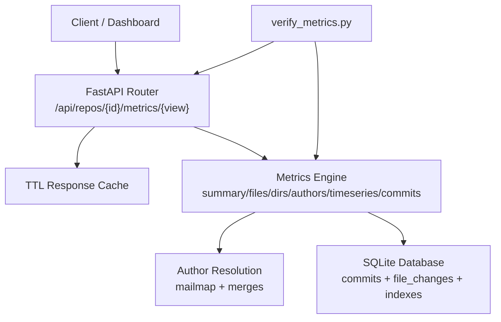
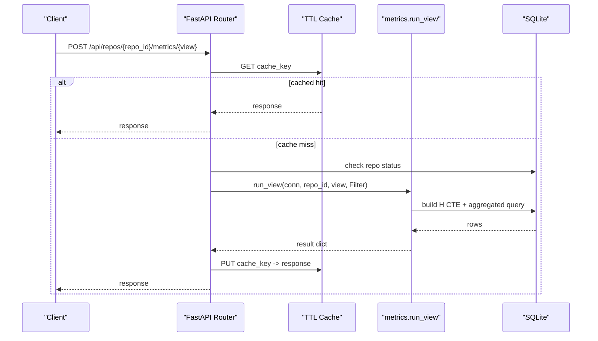
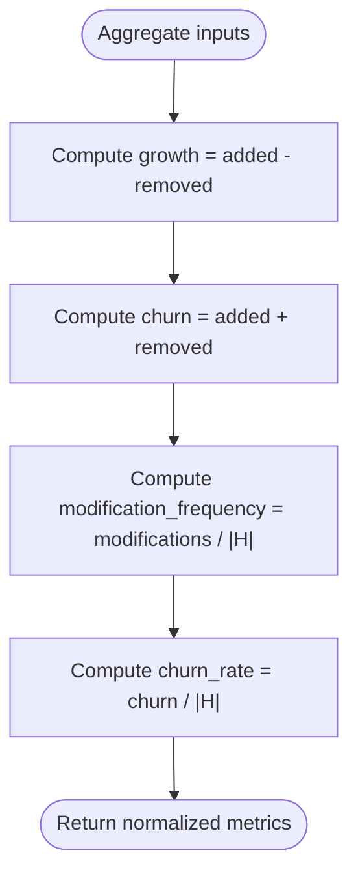
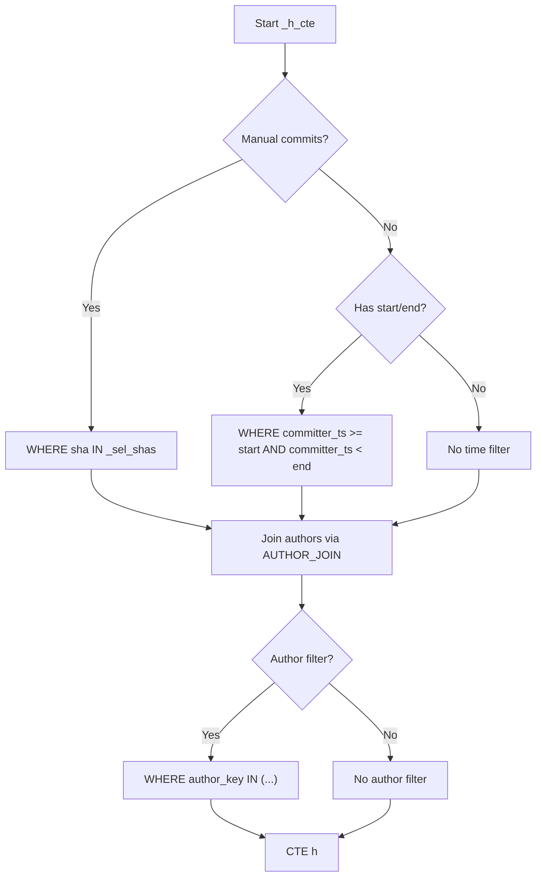
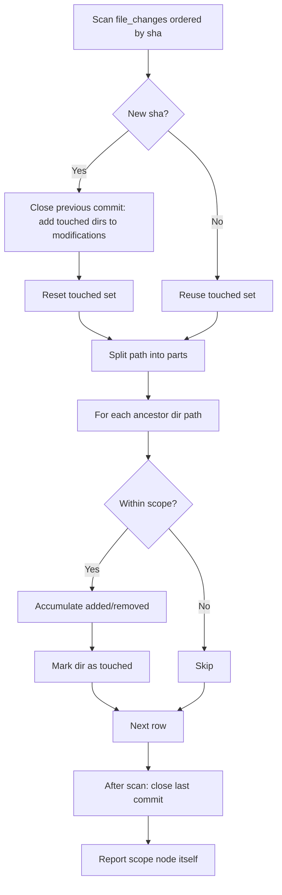
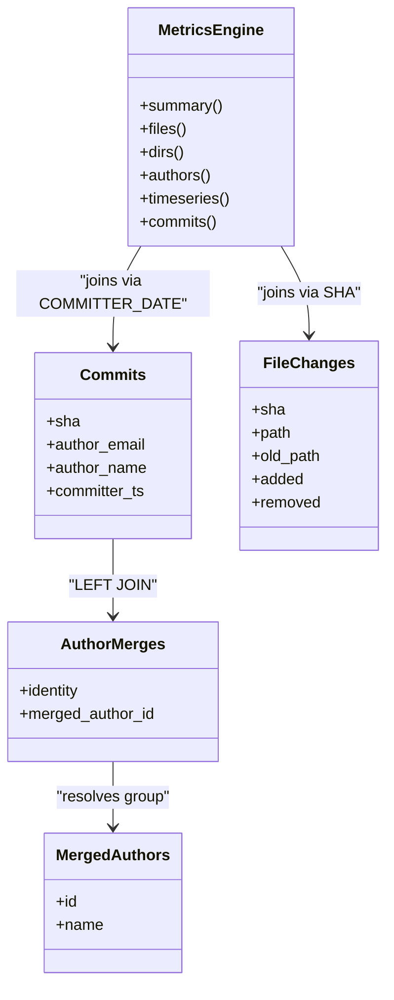
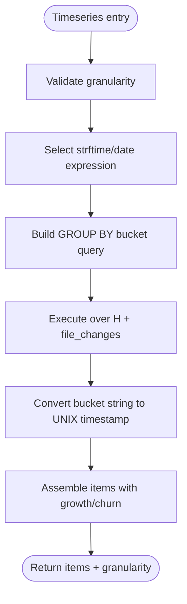
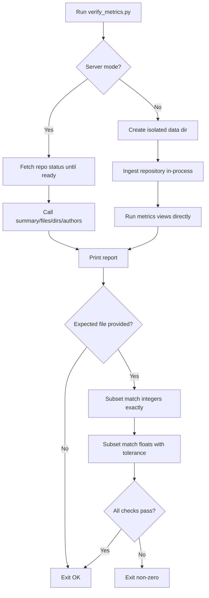
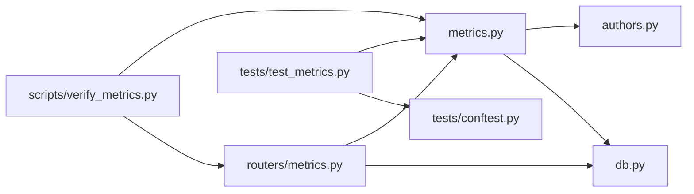

# Metrics Calculation Engine

<cite>
**Referenced Files in This Document**   
- [metrics.py](file://backend/app/metrics.py)
- [routers/metrics.py](file://backend/app/routers/metrics.py)
- [authors.py](file://backend/app/authors.py)
- [db.py](file://backend/app/db.py)
- [test_metrics.py](file://backend/tests/test_metrics.py)
- [conftest.py](file://backend/tests/conftest.py)
- [verify_metrics.py](file://scripts/verify_metrics.py)
- [expected_example.json](file://scripts/expected_example.json)
- [README.md](file://README.md)
</cite>

## Table of Contents
1. [Introduction](#introduction)
2. [Project Structure](#project-structure)
3. [Core Components](#core-components)
4. [Architecture Overview](#architecture-overview)
5. [Detailed Component Analysis](#detailed-component-analysis)
6. [Dependency Analysis](#dependency-analysis)
7. [Performance Considerations](#performance-considerations)
8. [Troubleshooting Guide](#troubleshooting-guide)
9. [Conclusion](#conclusion)
10. [Appendices](#appendices)

## Introduction
This document explains RAT’s metrics calculation engine: the exact formulas, SQL-based aggregation strategy, scope handling, time-series bucketing, author ownership, rename semantics, and verification system. The engine is designed so that every metric is a deterministic aggregation over an indexed SQLite database, with `backend/app/metrics.py` as the single source of truth for definitions and computation.

The core idea is simple: ingest each repository once into SQLite, then answer dashboard questions by running efficient SQL queries filtered by commit set H (time range or manual selection), object scope (file or directory), and author identity. Directory metrics are recursive subtree sums; author ownership is proportional churn; rename detection is delegated to git during ingestion.

**Section sources**
- [README.md:39-65](file://README.md#L39-L65)
- [metrics.py:1-28](file://backend/app/metrics.py#L1-L28)

## Project Structure
At the backend layer relevant to metrics:

- `backend/app/metrics.py`: formula definitions, filter model, SQL views, TTL cache.
- `backend/app/routers/metrics.py`: FastAPI endpoint that validates view names, builds filters, applies response caching, and calls the metrics engine.
- `backend/app/authors.py`: author identity resolution, mailmap integration, and manual merge groups used by metrics queries.
- `backend/app/db.py`: SQLite schema, indexes, connection helpers, WAL mode.
- `backend/tests/test_metrics.py`: golden-value tests locking the formulas.
- `backend/tests/conftest.py`: deterministic fixture history and expected aggregate values.
- `scripts/verify_metrics.py`: external spot-checker against a server or local index, with optional expected-values validation.
- `scripts/expected_example.json`: real-world expected values for a public repository.

**Diagram sources**
- [routers/metrics.py:13-40](file://backend/app/routers/metrics.py#L13-L40)
- [metrics.py:389-435](file://backend/app/metrics.py#L389-L435)
- [authors.py:15-25](file://backend/app/authors.py#L15-L25)
- [db.py:13-71](file://backend/app/db.py#L13-L71)

**Section sources**
- [README.md:191-196](file://README.md#L191-L196)
- [routers/metrics.py:1-41](file://backend/app/routers/metrics.py#L1-L41)
- [metrics.py:389-435](file://backend/app/metrics.py#L389-L435)

## Core Components
The engine exposes six views through one shared filter model:

| View | Purpose | Key Aggregation |
|---|---|---|
| `summary` | Repository/file/dir-level totals | added, removed, growth, churn, modifications, modification frequency, churn rate |
| `files` | Per-file metrics under the selected scope | grouped by path |
| `dirs` | Recursive directory metrics | ancestor path-prefix aggregation with per-commit de-duplication |
| `authors` | Author breakdown | commits, modifications, churn, ownership |
| `timeseries` | Temporal buckets | day/week/month aggregation |
| `commits` | Paged commit-set rows | per-commit stats scoped to object |

The shared `Filter` supports:

- Commit set H: `start` inclusive, `end` exclusive timestamps, or explicit `commits`.
- Author filtering: identity keys like `i:<email>` or merged group keys `m:<id>`.
- Object scope: `path` with `object_type` `file` or `dir`.
- Time-series granularity: `day`, `week`, `month`.
- Pagination: `limit`, `offset`.
- Optional “only changed” filtering for the commits view.

**Section sources**
- [metrics.py:43-54](file://backend/app/metrics.py#L43-L54)
- [metrics.py:135-155](file://backend/app/metrics.py#L135-L155)
- [metrics.py:158-183](file://backend/app/metrics.py#L158-L183)
- [metrics.py:186-248](file://backend/app/metrics.py#L186-L248)
- [metrics.py:251-279](file://backend/app/metrics.py#L251-L279)
- [metrics.py:291-329](file://backend/app/metrics.py#L291-L329)
- [metrics.py:332-386](file://backend/app/metrics.py#L332-L386)

## Architecture Overview
The metrics pipeline has three layers:

1. **Router layer**: validates the requested view, checks repository readiness, serializes the request body into a cache key, and wraps the result in a standard response shape.
2. **Metrics layer**: builds the commit-set CTE, applies object and author filters, runs the appropriate SQL aggregation, derives derived metrics, and returns structured results.
3. **Storage layer**: SQLite tables `commits` and `file_changes`, plus author merge tables, with indexes tuned for time-range scans, path scoping, and primary-key joins.

**Diagram sources**
- [routers/metrics.py:13-40](file://backend/app/routers/metrics.py#L13-L40)
- [metrics.py:399-400](file://backend/app/metrics.py#L399-L400)
- [metrics.py:407-435](file://backend/app/metrics.py#L407-L435)

**Section sources**
- [routers/metrics.py:13-40](file://backend/app/routers/metrics.py#L13-L40)
- [metrics.py:399-400](file://backend/app/metrics.py#L399-L400)

## Detailed Component Analysis

### Formula Definitions and Derived Metrics
The engine defines per-commit quantities relative to the first parent:

- Added lines: `l+`
- Removed lines: `l-`
- Growth: `δ = l+ - l-`
- Churn: `λ = l+ + l-`
- Modification indicator: `I_n(h,o) = 1` if `λ_h,o > 0`, else `0`

For a commit set H and object o:

- Summed added/removed/growth/churn across H.
- Modifications: count of commits where `λ > 0`.
- Modification frequency: `η = n_H,o / |H|`, zero when `|H| = 0`.
- Churn rate: `ρ = λ_H,o / |H|`, zero when `|H| = 0`.

These are implemented by `_derive`, which computes growth, churn, modification frequency, and churn rate from raw aggregates and commit count.

**Diagram sources**
- [metrics.py:117-128](file://backend/app/metrics.py#L117-L128)

**Section sources**
- [metrics.py:1-28](file://backend/app/metrics.py#L1-L28)
- [metrics.py:117-128](file://backend/app/metrics.py#L117-L128)

### Commit Set H Construction
The commit set H is built as a CTE that:

- Filters by repository.
- Optionally restricts to manually selected SHAs.
- Otherwise filters by committer timestamp range: `start` inclusive, `end` exclusive.
- Joins author resolution so that effective author keys and names reflect both `.mailmap` and manual merges.
- Optionally narrows H further by author identity keys.

**Diagram sources**
- [metrics.py:76-109](file://backend/app/metrics.py#L76-L109)
- [authors.py:15-25](file://backend/app/authors.py#L15-L25)

**Section sources**
- [metrics.py:76-109](file://backend/app/metrics.py#L76-L109)
- [authors.py:15-25](file://backend/app/authors.py#L15-L25)

### Object Scoping: Files and Directories
Object scoping uses `Filter.object_clause`:

- For files: exact path equality.
- For directories: prefix range using `path >= 'dir/' AND path < 'dir0'`, which is index-friendly and avoids expensive string operations.

Directory metrics recursively sum child metrics by walking ancestor paths and aggregating added/removed/modifications. Importantly, modifications are de-duplicated per commit: if a commit touches multiple files under the same directory, it counts once for that directory.

**Diagram sources**
- [metrics.py:56-64](file://backend/app/metrics.py#L56-L64)
- [metrics.py:186-248](file://backend/app/metrics.py#L186-L248)

**Section sources**
- [metrics.py:56-64](file://backend/app/metrics.py#L56-L64)
- [metrics.py:186-248](file://backend/app/metrics.py#L186-L248)

### Author Ownership and Identity Resolution
Author identity resolution combines:

- Mailmap-resolved identities at ingest time.
- Manual merge groups stored in `merged_authors` and `author_merges`.
- Query-time application of merges through `AUTHOR_JOIN`, producing stable keys like `i:<email>` or `m:<group id>`.

Ownership is defined as the proportion of total churn attributable to an author within the same filtered commit set H:

- Author churn: sum of `λ` over commits authored by `a`.
- Total churn: sum of `λ` over all authors in H.
- Ownership: `ω = λ_H,o,a / λ_H,o`, zero when total churn is zero.

**Diagram sources**
- [db.py:31-70](file://backend/app/db.py#L31-L70)
- [authors.py:15-25](file://backend/app/authors.py#L15-L25)
- [metrics.py:251-279](file://backend/app/metrics.py#L251-L279)

**Section sources**
- [authors.py:15-25](file://backend/app/authors.py#L15-L25)
- [metrics.py:251-279](file://backend/app/metrics.py#L251-L279)
- [db.py:31-70](file://backend/app/db.py#L31-L70)

### Time-Series Bucketing
Time-series aggregation groups commits by configurable granularity:

- Day: calendar date.
- Month: first day of month.
- Week: ISO-style week starting on Monday.

Each bucket reports added, removed, growth, churn, commit count, and modification count. Bucket timestamps are converted to UNIX seconds for charting.

**Diagram sources**
- [metrics.py:282-329](file://backend/app/metrics.py#L282-L329)

**Section sources**
- [metrics.py:282-329](file://backend/app/metrics.py#L282-L329)

### Rename Detection Delegation
Rename detection is not computed in Python; it is delegated to git during ingestion. The documented behavior is:

- Pure renames produce no metric change.
- Rename plus edit attributes changes to the new path.
- Binary-only changes are not measured.

The test fixture verifies this by asserting that pure rename entries have zero added/removed and that rename-plus-edit entries attribute edits to the new path.

**Section sources**
- [README.md:35-37](file://README.md#L35-L37)
- [test_metrics.py:54-68](file://backend/tests/test_metrics.py#L54-L68)

### Verification System: Golden Values and Expected Values
RAT uses two complementary verification mechanisms:

1. **Golden-value unit tests**: `backend/tests/test_metrics.py` asserts hand-computed values for the deterministic fixture repository. These lock the formulas for summary, files, dirs, authors, timeseries, and commits.
2. **External spot-checker**: `scripts/verify_metrics.py` can run against a live server or ingest locally, print a report, and optionally compare results against `scripts/expected_example.json`.

Expected values support subset matching:

- Exact integer comparison.
- Float comparison with tolerance based on absolute or relative error.

**Diagram sources**
- [verify_metrics.py:84-107](file://scripts/verify_metrics.py#L84-L107)
- [verify_metrics.py:114-150](file://scripts/verify_metrics.py#L114-L150)
- [verify_metrics.py:194-241](file://scripts/verify_metrics.py#L194-L241)

**Section sources**
- [test_metrics.py:1-5](file://backend/tests/test_metrics.py#L1-L5)
- [test_metrics.py:81-91](file://backend/tests/test_metrics.py#L81-L91)
- [test_metrics.py:160-179](file://backend/tests/test_metrics.py#L160-L179)
- [test_metrics.py:181-206](file://backend/tests/test_metrics.py#L181-L206)
- [test_metrics.py:212-234](file://backend/tests/test_metrics.py#L212-L234)
- [test_metrics.py:289-310](file://backend/tests/test_metrics.py#L289-L310)
- [conftest.py:1-21](file://backend/tests/conftest.py#L1-L21)
- [verify_metrics.py:194-241](file://scripts/verify_metrics.py#L194-L241)
- [expected_example.json:1-37](file://scripts/expected_example.json#L1-L37)

## Dependency Analysis
The metrics engine depends on:

- `Filter` and view functions in `metrics.py`.
- Author resolution expressions in `authors.py`.
- SQLite schema and indexes in `db.py`.
- Router caching and request validation in `routers/metrics.py`.
- Tests and fixtures in `tests/`.
- External verification script in `scripts/`.

**Diagram sources**
- [metrics.py:37-38](file://backend/app/metrics.py#L37-L38)
- [routers/metrics.py:8-9](file://backend/app/routers/metrics.py#L8-L9)
- [test_metrics.py:12-13](file://backend/tests/test_metrics.py#L12-L13)
- [verify_metrics.py:114-147](file://scripts/verify_metrics.py#L114-L147)

**Section sources**
- [metrics.py:37-38](file://backend/app/metrics.py#L37-L38)
- [routers/metrics.py:8-9](file://backend/app/routers/metrics.py#L8-L9)
- [test_metrics.py:12-13](file://backend/tests/test_metrics.py#L12-L13)
- [verify_metrics.py:114-147](file://scripts/verify_metrics.py#L114-L147)

## Performance Considerations
Key performance characteristics:

- Index utilization:
  - `(repo_id, committer_ts)` for time-range filtering.
  - `(repo_id, path)` for path-scoped queries.
  - Primary key `(repo_id, sha, path)` for efficient joins between commits and file changes.
- Directory metrics use a single ordered scan with per-commit modification de-duplication.
- Path scoping uses index-friendly range predicates for directories.
- Response cache:
  - In-memory TTL cache keyed by `(repo_id, view, serialized_filter)`.
  - Default TTL is short to balance freshness and repeated dashboard queries.
  - Cache invalidation supports clearing all or per-repo entries.

Measured latencies demonstrate that even large repositories remain interactive after indexing.

**Section sources**
- [db.py:44-57](file://backend/app/db.py#L44-L57)
- [metrics.py:407-435](file://backend/app/metrics.py#L407-L435)
- [README.md:170-180](file://README.md#L170-L180)
- [README.md:182-196](file://README.md#L182-L196)

## Troubleshooting Guide
Common issues and how to diagnose them:

| Symptom | Likely Cause | Diagnostic Action |
|---|---|---|
| Unknown metric view error | Invalid `view` parameter | Ensure the view is one of `summary`, `files`, `dirs`, `authors`, `timeseries`, `commits`. |
| Repository not found | Missing or wrong `repo_id` | Check `/api/repos/{id}` status before querying metrics. |
| Repository not ready yet | Ingestion still in progress | Wait until status is `ready`; the router returns conflict otherwise. |
| Empty results for time range | `start`/`end` excludes all commits | Verify committer timestamps and boundary inclusivity/exclusivity. |
| Directory modifications seem too low | Multiple files in one commit should count once | Confirm per-commit de-duplication logic; see directory view implementation. |
| Ownership does not sum to 1.0 | Total churn is zero or author filter changes H | Check `churn_total` and whether the author filter narrows H. |
| Cached stale results | TTL cache not invalidated after author merges | Call cache invalidation or restart service; tests invalidate cache after merges. |

**Section sources**
- [routers/metrics.py:13-30](file://backend/app/routers/metrics.py#L13-L30)
- [test_metrics.py:236-269](file://backend/tests/test_metrics.py#L236-L269)
- [metrics.py:186-248](file://backend/app/metrics.py#L186-L248)
- [metrics.py:429-435](file://backend/app/metrics.py#L429-L435)

## Conclusion
RAT’s metrics calculation engine centralizes all formula definitions in one module and implements them as efficient SQL aggregations over an indexed SQLite database. It supports precise commit-set filtering, recursive directory aggregation, author ownership, time-series bucketing, and rename semantics delegated to git. The verification system locks correctness through golden-value tests and optional expected-value comparisons, while the TTL cache and indexes keep dashboard queries fast.

## Appendices

### Concrete Metric Examples from Tests
The following examples illustrate how the engine behaves on the deterministic fixture:

- Root summary:
  - added, removed, growth, churn, modifications, commit_count, modification_frequency, churn_rate.
- Scoped summary:
  - File scope: specific added/removed/growth/churn/modifications.
  - Directory scope: recursive sums with correct modification count.
- Time boundaries:
  - Inclusive start, exclusive end yields the expected commit subset.
- Manual commit selection:
  - Single-commit summary matches hand-computed values.
- Files view:
  - Per-file metrics include rename-only and rename-plus-edit cases.
- Dirs view:
  - Root, src, src/sub, docs, and scoped directory results.
- Authors view:
  - Identity merging via mailmap and manual merges.
  - Ownership proportional to churn.
- Timeseries:
  - Single-day bucket with correct totals.
- Commits view:
  - Newest-first ordering, empty commits included, only_changed filtering.

**Section sources**
- [test_metrics.py:81-91](file://backend/tests/test_metrics.py#L81-L91)
- [test_metrics.py:94-103](file://backend/tests/test_metrics.py#L94-L103)
- [test_metrics.py:109-144](file://backend/tests/test_metrics.py#L109-L144)
- [test_metrics.py:160-179](file://backend/tests/test_metrics.py#L160-L179)
- [test_metrics.py:181-206](file://backend/tests/test_metrics.py#L181-L206)
- [test_metrics.py:212-234](file://backend/tests/test_metrics.py#L212-L234)
- [test_metrics.py:289-310](file://backend/tests/test_metrics.py#L289-L310)

### Example SQL Patterns Used by the Engine
While the engine constructs these queries programmatically, the patterns are:

- Commit-set CTE:
  - Builds H with optional manual commit list, time range, and author join.
- Summary aggregation:
  - Sums added/removed, counts distinct modified SHAs, divides by commit count for rates.
- Files aggregation:
  - Groups by path under the selected object scope.
- Dirs aggregation:
  - Ordered scan with per-commit de-duplication and ancestor path accumulation.
- Authors aggregation:
  - Groups by resolved author key/name, computes churn and ownership.
- Timeseries aggregation:
  - Groups by bucket expression, converts bucket strings to timestamps.
- Commits aggregation:
  - Left joins file changes, optional having clause for only_changed, paged ordering.

**Section sources**
- [metrics.py:76-109](file://backend/app/metrics.py#L76-L109)
- [metrics.py:141-155](file://backend/app/metrics.py#L141-L155)
- [metrics.py:164-183](file://backend/app/metrics.py#L164-L183)
- [metrics.py:195-248](file://backend/app/metrics.py#L195-L248)
- [metrics.py:256-279](file://backend/app/metrics.py#L256-L279)
- [metrics.py:299-329](file://backend/app/metrics.py#L299-L329)
- [metrics.py:345-386](file://backend/app/metrics.py#L345-L386)