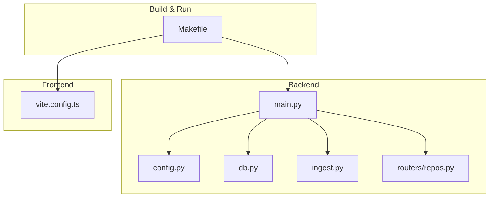
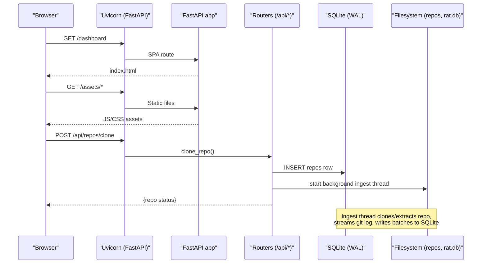
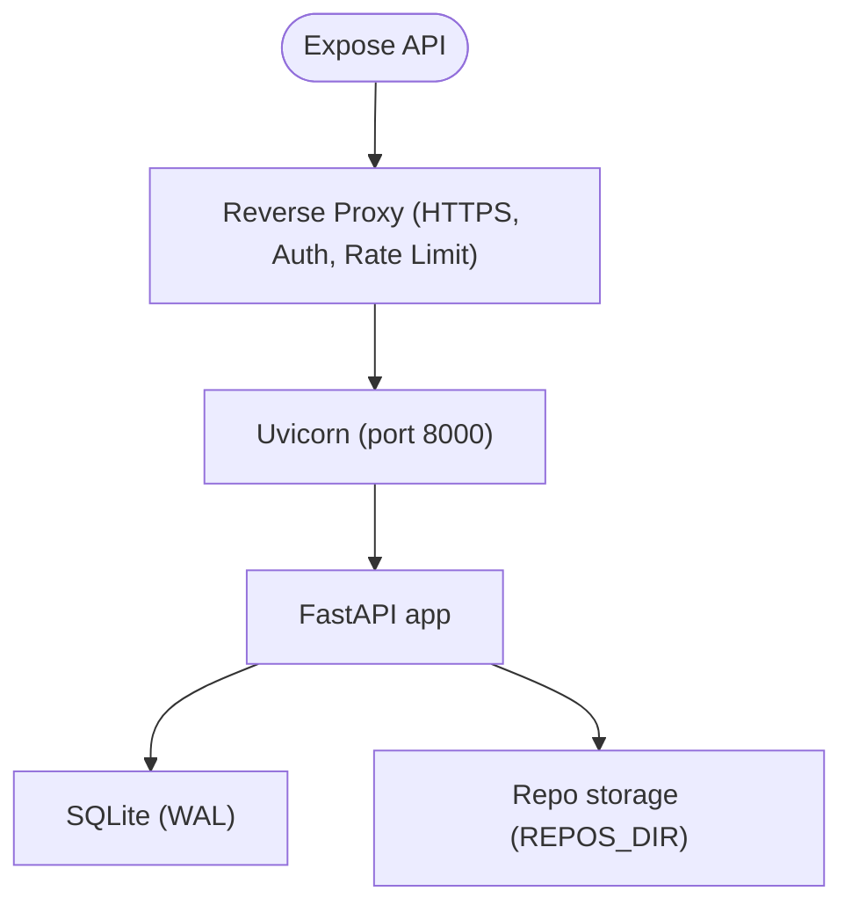
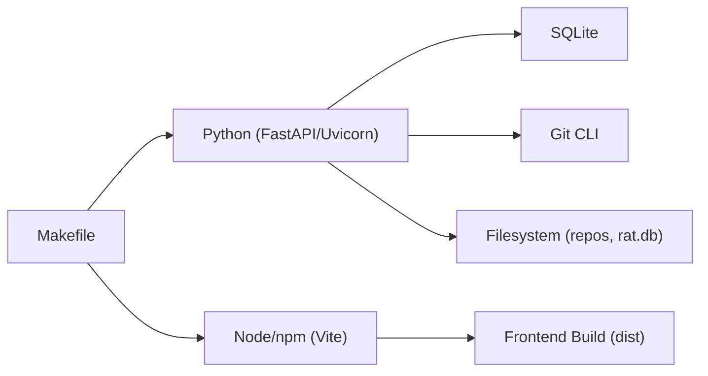

# Deployment Guide

<cite>
**Referenced Files in This Document**
- [README.md](file://README.md)
- [Makefile](file://Makefile)
- [backend/app/main.py](file://backend/app/main.py)
- [backend/app/config.py](file://backend/app/config.py)
- [backend/app/db.py](file://backend/app/db.py)
- [backend/app/ingest.py](file://backend/app/ingest.py)
- [backend/app/routers/repos.py](file://backend/app/routers/repos.py)
- [frontend/vite.config.ts](file://frontend/vite.config.ts)
</cite>

## Table of Contents
1. [Introduction](#introduction)
2. [Project Structure](#project-structure)
3. [Core Components](#core-components)
4. [Architecture Overview](#architecture-overview)
5. [Detailed Component Analysis](#detailed-component-analysis)
6. [Dependency Analysis](#dependency-analysis)
7. [Performance Considerations](#performance-considerations)
8. [Troubleshooting Guide](#troubleshooting-guide)
9. [Conclusion](#conclusion)
10. [Appendices](#appendices)

## Introduction
This guide explains how to deploy RAT, a multi-repository web dashboard that turns Git history into filterable metrics. It focuses on production deployment using the single-port mode, environment configuration, database setup with SQLite WAL mode, repository storage requirements, security considerations for exposing the API, monitoring and logging strategies, backup procedures, scaling across multiple repositories, and example deployments for local development, staging, and production environments.

RAT’s backend is a FastAPI application backed by SQLite, while the frontend is a React + TypeScript application built with Vite. The Makefile provides convenient commands for installation, development, building, running, testing, and verification.

**Section sources**
- [README.md:1-15](file://README.md#L1-L15)
- [README.md:67-76](file://README.md#L67-L76)

## Project Structure
At a high level, RAT consists of:
- Backend: Python FastAPI application under `backend/app`, including routers, ingestion logic, database schema, and configuration.
- Frontend: React + TypeScript application under `frontend/src`, built by Vite into a static distribution served by the backend in production.
- Scripts: Verification utilities under `scripts`.
- Makefile: Entry points for install, dev, build, run, test, verify, and clean.

**Diagram sources**
- [Makefile:1-63](file://Makefile#L1-L63)
- [backend/app/main.py:1-49](file://backend/app/main.py#L1-L49)
- [backend/app/config.py:1-15](file://backend/app/config.py#L1-L15)
- [backend/app/db.py:1-87](file://backend/app/db.py#L1-L87)
- [backend/app/ingest.py:1-439](file://backend/app/ingest.py#L1-L439)
- [backend/app/routers/repos.py:1-114](file://backend/app/routers/repos.py#L1-L114)
- [frontend/vite.config.ts:1-27](file://frontend/vite.config.ts#L1-L27)

**Section sources**
- [README.md:196-206](file://README.md#L196-L206)
- [Makefile:1-63](file://Makefile#L1-L63)

## Core Components
- Single-port production mode: `make run` builds the frontend and serves both API and static assets from one process on port 8000.
- Environment configuration:
  - `RAT_DATA_DIR`: Directory containing the SQLite database and repository data. Defaults to `backend/data`.
  - `RAT_FRONTEND_DIST`: Path to the built frontend distribution. Defaults to `frontend/dist`.
- Database: SQLite with WAL mode enabled at connection time; schema includes repositories, commits, file changes, author merges, and merge groups.
- Repository storage: Each repository is stored under `REPOS_DIR/repo_id`, created automatically.
- Ingestion: Background threads handle cloning or extracting archives, then stream-index the Git history via `git log --numstat -z`.

Key runtime paths:
- Database path: `DB_PATH = DATA_DIR / "rat.db"`
- Repositories directory: `REPOS_DIR = DATA_DIR / "repos"`
- Frontend distribution: `FRONTEND_DIST` (from environment or default)

**Section sources**
- [backend/app/config.py:1-15](file://backend/app/config.py#L1-L15)
- [backend/app/db.py:13-87](file://backend/app/db.py#L13-L87)
- [backend/app/ingest.py:35-39](file://backend/app/ingest.py#L35-L39)
- [backend/app/routers/repos.py:109-113](file://backend/app/routers/repos.py#L109-L113)

## Architecture Overview
The production deployment uses a single FastAPI process serving:
- REST API endpoints under `/api/*`
- Static frontend assets under `/assets`
- SPA fallback routes for client-side routing

**Diagram sources**
- [backend/app/main.py:13-48](file://backend/app/main.py#L13-L48)
- [backend/app/routers/repos.py:81-94](file://backend/app/routers/repos.py#L81-L94)
- [backend/app/ingest.py:362-439](file://backend/app/ingest.py#L362-L439)
- [backend/app/db.py:74-87](file://backend/app/db.py#L74-L87)

## Detailed Component Analysis

### Production Mode and Makefile Commands
- `make install`: Creates a Python virtual environment, installs backend dependencies, and installs frontend dependencies.
- `make dev`: Runs the API on `127.0.0.1:8000` with auto-reload and the Vite dev server on `:5173`.
- `make api`: Runs only the API on `0.0.0.0:8000` with auto-reload.
- `make build`: Builds the frontend into `frontend/dist`.
- `make run`: Builds the frontend and starts Uvicorn on `0.0.0.0:8000` without reload. This is the single-port production mode.
- `make test`: Runs pytest against the backend.
- `make verify`: Executes metric verification script with optional arguments.
- `make clean`: Removes runtime data, caches, and frontend build artifacts.

For production, prefer `make run` behind a reverse proxy. For development, use `make dev` or `make api` plus the Vite dev server.

**Section sources**
- [Makefile:12-23](file://Makefile#L12-L23)
- [Makefile:35-52](file://Makefile#L35-L52)
- [Makefile:54-62](file://Makefile#L54-L62)

### Environment Configuration
RAT reads runtime configuration from environment variables:
- `RAT_DATA_DIR`: Base directory for all persistent data (database and repositories). Default: `backend/data`.
- `RAT_FRONTEND_DIST`: Path to the built frontend distribution. Default: `frontend/dist`.

These are resolved at import time and directories are created if missing.

Recommended production settings:
- Set `RAT_DATA_DIR` to a dedicated, persistent volume (e.g., `/var/lib/rat`).
- Ensure the process user has read/write permissions to `RAT_DATA_DIR`.
- If deploying the frontend separately, set `RAT_FRONTEND_DIST` to the location where the backend can serve it.

**Section sources**
- [backend/app/config.py:7-15](file://backend/app/config.py#L7-L15)

### Database Setup and SQLite WAL Mode
RAT initializes its SQLite database at startup and enables WAL mode per connection:
- Journal mode: WAL
- Synchronous: NORMAL
- Foreign keys: ON

Schema highlights:
- `repos`: repository metadata and ingestion state
- `commits`: commit records keyed by `(repo_id, sha)`
- `file_changes`: per-commit file change deltas keyed by `(repo_id, sha, path)`
- `merged_authors` and `author_merges`: author identity merging

Indexes:
- `idx_commits_ts` on `(repo_id, committer_ts)`
- `idx_commits_email` on `(repo_id, author_email)`
- `idx_fc_path` on `(repo_id, path)`

Production recommendations:
- Place `rat.db` and `repos/` on fast, reliable storage (local SSD or network filesystem with consistent performance).
- Enable periodic `ANALYZE` after large ingests; the code already runs `ANALYZE` upon successful indexing.
- Monitor SQLite file sizes and disk usage growth as repositories accumulate.

**Section sources**
- [backend/app/db.py:13-87](file://backend/app/db.py#L13-L87)
- [backend/app/ingest.py:415-422](file://backend/app/ingest.py#L415-L422)

### File System Requirements for Repository Storage
Repository data is stored under `REPOS_DIR/repo_id`. During ingestion:
- Cloned repositories are mirrored to `REPOS_DIR/<repo_id>`.
- Uploaded zip archives are extracted to `REPOS_DIR/<repo_id>/src`.
- Temporary upload files are cleaned up after ingestion.

Security measures during extraction:
- Absolute paths and traversal attempts (`..`) are rejected.
- Extraction targets are validated to remain within the destination root.

Disk space planning:
- Estimate repository size based on Git mirror size.
- Account for SQLite database growth proportional to commit count and changed files.
- Plan for concurrent ingestion overhead (temporary files, batched inserts).

**Section sources**
- [backend/app/config.py:8-10](file://backend/app/config.py#L8-L10)
- [backend/app/ingest.py:97-139](file://backend/app/ingest.py#L97-L139)
- [backend/app/ingest.py:362-429](file://backend/app/ingest.py#L362-L429)
- [backend/app/routers/repos.py:103-113](file://backend/app/routers/repos.py#L103-L113)

### Security Considerations for Exposing the API
- CORS: By default, the application allows origins from the Vite dev server (`http://localhost:5173` and `http://127.0.0.1:5173`). In production, restrict allowed origins to your deployed frontend domain(s).
- Authentication and authorization: There is no built-in authentication. Protect the API with a reverse proxy (e.g., Nginx, Traefik, Cloudflare Access) or an auth gateway.
- Network exposure: Use HTTPS termination at the reverse proxy. Do not expose Uvicorn directly to the internet.
- Input validation: Uploads accept `.zip` and `.git` suffixes; ensure maximum payload size limits at the proxy layer.
- Secrets management: Avoid embedding credentials; rely on system-level secrets management and secure Git credential helpers or SSH keys for private repositories.

**Diagram sources**
- [backend/app/main.py:15-20](file://backend/app/main.py#L15-L20)
- [backend/app/main.py:29-48](file://backend/app/main.py#L29-L48)

**Section sources**
- [backend/app/main.py:15-20](file://backend/app/main.py#L15-L20)

### Monitoring and Logging Strategies
- Application logs: Uvicorn prints request logs and errors. Configure access logs and error logging through your reverse proxy and process manager.
- Ingestion progress: The ingestion pipeline updates repository status and progress fields in the database, which the UI polls.
- Metrics: RAT computes repository/file/directory/commit-set/author metrics; consider exporting health checks and custom metrics (e.g., ingestion duration, queue depth) via a metrics endpoint if you extend the app.
- Observability:
  - Track disk usage for `RAT_DATA_DIR`.
  - Monitor SQLite file sizes and WAL file growth.
  - Alert on ingestion failures and long-running jobs.

Operational tips:
- Use a process supervisor (systemd, Docker, Kubernetes) to restart failed processes.
- Centralize logs with a log aggregator (e.g., journald, Fluent Bit, CloudWatch).
- Add health check endpoints if needed for load balancers.

[No sources needed since this section provides general guidance]

### Backup Procedures for Repository Data
Backups should include:
- SQLite database file: `rat.db`
- SQLite WAL files: `rat.db-wal`, `rat.db-shm` (if present)
- Repository mirrors: `REPOS_DIR`

Backup best practices:
- Stop ingestion or pause new writes briefly, or use a snapshot tool that supports consistent snapshots.
- Prefer filesystem snapshots (LVM, ZFS, cloud snapshots) to ensure consistency.
- Validate backups periodically by restoring to a test environment and verifying repository integrity.
- Retain multiple generations of backups and encrypt them at rest.

Recovery steps:
- Restore `rat.db` and `REPOS_DIR` to the configured `RAT_DATA_DIR`.
- Restart the service; the app will initialize the schema and serve existing data.

**Section sources**
- [backend/app/config.py:8-10](file://backend/app/config.py#L8-L10)
- [backend/app/db.py:74-87](file://backend/app/db.py#L74-L87)

### Scaling Considerations for Multiple Repositories
- Concurrency: Ingestion runs in daemon threads per repository. Control concurrency at the orchestration layer (e.g., limit parallel ingests).
- Disk I/O: Large repositories increase I/O pressure; place `RAT_DATA_DIR` on fast storage.
- Database tuning: WAL mode improves read concurrency; monitor PRAGMA settings and consider periodic `ANALYZE`.
- Query cache: A short-TTL response cache absorbs repeated dashboard queries.
- Horizontal scaling: Since SQLite is file-based, horizontal scaling requires shared storage or sharding by repository. Alternatively, externalize the database later if needed.

[No sources needed since this section provides general guidance]

## Dependency Analysis
The main runtime dependencies are:
- FastAPI and Uvicorn for the web server
- SQLite (stdlib) for persistence
- Git CLI for cloning and streaming history
- Node.js/npm for building the frontend

**Diagram sources**
- [Makefile:4-8](file://Makefile#L4-L8)
- [backend/app/main.py:4-11](file://backend/app/main.py#L4-L11)
- [backend/app/ingest.py:23-31](file://backend/app/ingest.py#L23-L31)

**Section sources**
- [Makefile:1-63](file://Makefile#L1-L63)
- [backend/app/main.py:1-11](file://backend/app/main.py#L1-L11)
- [backend/app/ingest.py:1-40](file://backend/app/ingest.py#L1-L40)

## Performance Considerations
- One subprocess per repository for indexing; never per commit.
- Streamed parsing of `git log --numstat -z` with bounded memory.
- Batched SQLite inserts (10k rows) in WAL mode.
- Index-friendly queries and path scoping.
- Short-TTL response cache for repeated dashboard queries.

These characteristics make RAT suitable for interactive dashboards even with large histories.

**Section sources**
- [README.md:168-179](file://README.md#L168-L179)
- [backend/app/ingest.py:280-354](file://backend/app/ingest.py#L280-L354)

## Troubleshooting Guide
Common issues and resolutions:
- Frontend not served:
  - Ensure the frontend is built (`make build`) or run in dev mode (`make dev`).
  - Check that `FRONTEND_DIST` exists and contains `index.html`.
- API not reachable:
  - Verify Uvicorn is listening on the expected host/port.
  - Confirm reverse proxy forwards `/api` correctly.
- Ingestion fails:
  - Check repository URL validity and network access.
  - Inspect repository status and error messages via the API.
  - Ensure sufficient disk space and permissions for `RAT_DATA_DIR`.
- SQLite errors:
  - Confirm WAL mode is enabled and the database file is writable.
  - Monitor disk space and file locks.

Useful commands:
- `make test`: Run backend tests.
- `make verify ARGS='--api http://localhost:8000 --repo <name>'`: Spot-check metrics against a running server.

**Section sources**
- [backend/app/main.py:33-48](file://backend/app/main.py#L33-L48)
- [backend/app/routers/repos.py:50-78](file://backend/app/routers/repos.py#L50-L78)
- [backend/app/ingest.py:362-439](file://backend/app/ingest.py#L362-L439)
- [README.md:142-156](file://README.md#L142-L156)

## Conclusion
RAT’s production deployment centers around a single FastAPI process serving both API and static assets. Use `make run` for production, configure `RAT_DATA_DIR` and `RAT_FRONTEND_DIST` appropriately, protect the API with a reverse proxy, and back up both the SQLite database and repository mirrors. With WAL-enabled SQLite, streamed ingestion, and indexed queries, RAT scales well for multiple repositories when paired with proper resource planning and operational safeguards.

[No sources needed since this section summarizes without analyzing specific files]

## Appendices

### Deployment Examples

#### Local Development
- Install dependencies and run both API and frontend dev servers:
  - `make install`
  - `make dev`
- Open the frontend at `http://localhost:5173`; the API proxies `/api` to `http://localhost:8000`.

**Section sources**
- [Makefile:35-46](file://Makefile#L35-L46)
- [frontend/vite.config.ts:6-13](file://frontend/vite.config.ts#L6-L13)

#### Staging
- Build the frontend and run the single-port production server:
  - `make build`
  - `make run`
- Place behind a reverse proxy with HTTPS and basic access controls.
- Set `RAT_DATA_DIR` to a persistent volume.

**Section sources**
- [Makefile:48-52](file://Makefile#L48-L52)
- [backend/app/config.py:8-11](file://backend/app/config.py#L8-L11)

#### Production
- Build the frontend once and serve it via the backend:
  - `make build`
  - `make run`
- Reverse proxy configuration:
  - Terminate TLS at the proxy.
  - Restrict CORS to your frontend domain.
  - Enforce authentication and rate limiting.
- Operational hardening:
  - Run under a process supervisor.
  - Monitor disk usage and SQLite files.
  - Schedule regular backups of `RAT_DATA_DIR`.

**Section sources**
- [backend/app/main.py:15-20](file://backend/app/main.py#L15-L20)
- [backend/app/config.py:8-11](file://backend/app/config.py#L8-L11)