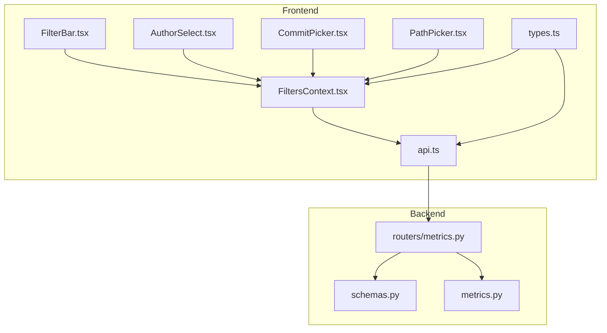
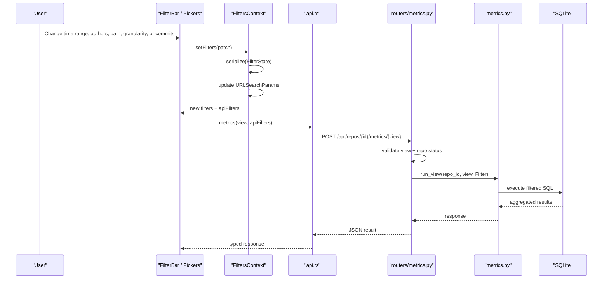
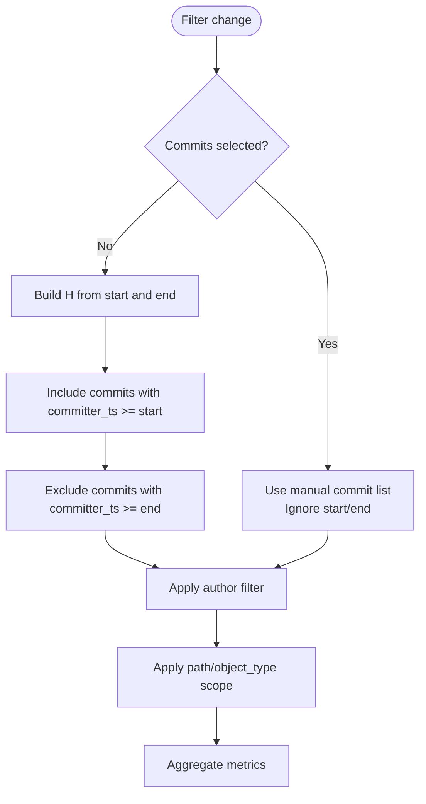
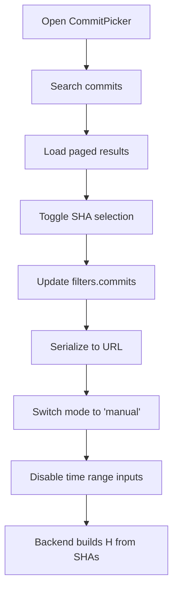
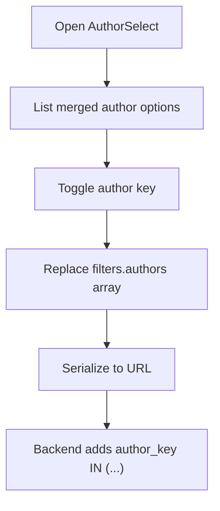
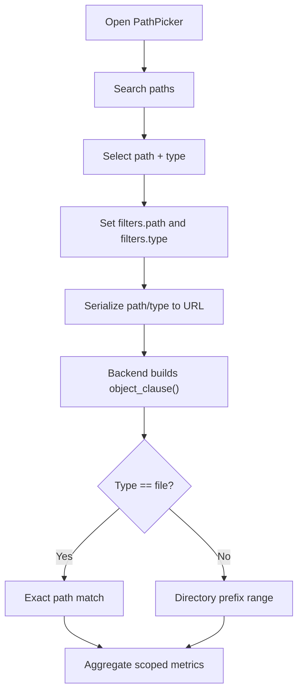
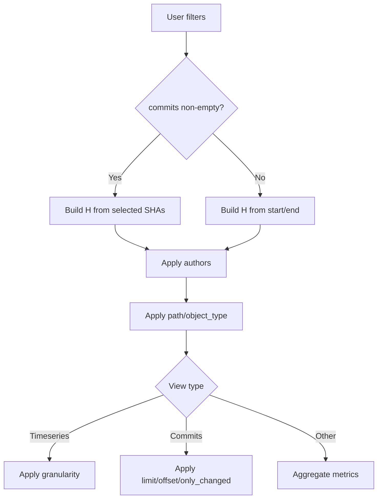
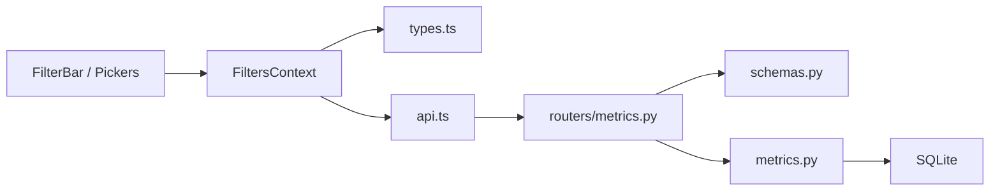

# Filtering System

<cite>
**Referenced Files in This Document**
- [FiltersContext.tsx](file://frontend/src/state/FiltersContext.tsx)
- [FilterBar.tsx](file://frontend/src/components/FilterBar.tsx)
- [AuthorSelect.tsx](file://frontend/src/components/AuthorSelect.tsx)
- [CommitPicker.tsx](file://frontend/src/components/CommitPicker.tsx)
- [PathPicker.tsx](file://frontend/src/components/PathPicker.tsx)
- [api.ts](file://frontend/src/api.ts)
- [types.ts](file://frontend/src/types.ts)
- [metrics.py](file://backend/app/metrics.py)
- [metrics router](file://backend/app/routers/metrics.py)
- [schemas.py](file://backend/app/schemas.py)
- [README.md](file://README.md)
</cite>

## Table of Contents
1. [Introduction](#introduction)
2. [Project Structure](#project-structure)
3. [Core Components](#core-components)
4. [Architecture Overview](#architecture-overview)
5. [Detailed Component Analysis](#detailed-component-analysis)
6. [Dependency Analysis](#dependency-analysis)
7. [Performance Considerations](#performance-considerations)
8. [Troubleshooting Guide](#troubleshooting-guide)
9. [Conclusion](#conclusion)

## Introduction
RAT’s filtering system is the central mechanism that turns a repository’s commit history into multi-dimensional, shareable metrics. A user can narrow analysis by:
- Time range (`H_t` or `H_i,j`)
- Manual commit selection (a list of SHAs)
- Author identity or merged author group
- File or directory path scope
- Timeseries granularity for time-based views

The filter state lives in the URL query string, so every dashboard view is bookmarkable and shareable. The frontend parses and serializes URL parameters into a typed filter object, while the backend validates the same contract and applies filters to SQL queries over an indexed SQLite database.

## Project Structure
The filtering system spans both layers:

- Frontend state and UI:
  - `frontend/src/state/FiltersContext.tsx`: URL-synced filter state, serialization, mode detection, and conversion to the backend API contract.
  - `frontend/src/components/FilterBar.tsx`: User-facing controls for time range, granularity, authors, manual commits, and path scope.
  - `frontend/src/components/AuthorSelect.tsx`, `CommitPicker.tsx`, `PathPicker.tsx`: specialized filter pickers.
  - `frontend/src/api.ts`: HTTP client that sends `MetricsFilters` to the backend.
  - `frontend/src/types.ts`: Shared TypeScript types mirroring backend schemas.

- Backend validation and execution:
  - `backend/app/schemas.py`: Pydantic model defining accepted filter fields and defaults.
  - `backend/app/routers/metrics.py`: FastAPI endpoint accepting `MetricsFilters`, validating the view name, checking repository readiness, caching responses, and invoking metric computation.
  - `backend/app/metrics.py`: Core filter dataclass, commit-set construction, object scoping, per-view aggregation, and a small TTL cache.

**Diagram sources**
- [FiltersContext.tsx:1-119](file://frontend/src/state/FiltersContext.tsx#L1-L119)
- [FilterBar.tsx:1-93](file://frontend/src/components/FilterBar.tsx#L1-L93)
- [AuthorSelect.tsx:1-153](file://frontend/src/components/AuthorSelect.tsx#L1-L153)
- [CommitPicker.tsx:1-162](file://frontend/src/components/CommitPicker.tsx#L1-L162)
- [PathPicker.tsx:1-127](file://frontend/src/components/PathPicker.tsx#L1-L127)
- [api.ts:107-126](file://frontend/src/api.ts#L107-L126)
- [types.ts:76-87](file://frontend/src/types.ts#L76-L87)
- [metrics router:13-40](file://backend/app/routers/metrics.py#L13-L40)
- [schemas.py:14-24](file://backend/app/schemas.py#L14-L24)
- [metrics.py:43-54](file://backend/app/metrics.py#L43-L54)

**Section sources**
- [FiltersContext.tsx:1-119](file://frontend/src/state/FiltersContext.tsx#L1-L119)
- [FilterBar.tsx:1-93](file://frontend/src/components/FilterBar.tsx#L1-L93)
- [metrics router:13-40](file://backend/app/routers/metrics.py#L13-L40)
- [schemas.py:14-24](file://backend/app/schemas.py#L14-L24)
- [metrics.py:43-54](file://backend/app/metrics.py#L43-L54)

## Core Components
This section explains the primary building blocks of the filtering system.

### Filter State Model
The frontend defines a `FilterState` with:
- `start`, `end`: date strings representing inclusive UTC boundaries.
- `commits`: array of SHA strings for manual selection.
- `authors`: array of author keys, including individual identities and merged groups.
- `path`, `type`: file or directory scope.
- `gran`: timeseries bucket granularity.

The backend defines `MetricsFilters` with equivalent fields, plus pagination and `only_changed`. Defaults include month granularity, empty lists, and null path/object type.

**Section sources**
- [FiltersContext.tsx:14-22](file://frontend/src/state/FiltersContext.tsx#L14-L22)
- [types.ts:76-87](file://frontend/src/types.ts#L76-L87)
- [schemas.py:14-24](file://backend/app/schemas.py#L14-L24)

### URL Synchronization
`FiltersContext` reads from `URLSearchParams` and writes back using React Router’s search params. It provides:
- `parse`: converts URL parameters into `FilterState`.
- `serialize`: converts `FilterState` back into URL parameters.
- `setFilters`: merges a patch into current state and replaces the URL without adding history entries.
- `reset`: clears all filters by replacing the URL with an empty query string.

Serialization rules:
- `start` and `end` are included only when present.
- `commits` and `authors` are comma-separated arrays.
- `path` and `type` are paired; `type` is set only when `path` is present.
- `gran` is omitted when it equals the default `"month"`.

**Section sources**
- [FiltersContext.tsx:24-55](file://frontend/src/state/FiltersContext.tsx#L24-L55)
- [FiltersContext.tsx:77-89](file://frontend/src/state/FiltersContext.tsx#L77-L89)

### Mode Detection: Range vs Manual
The filter system has two mutually exclusive modes:
- `range`: time-range-based selection.
- `manual`: explicit commit list selection.

Mode is derived from whether `commits` is non-empty. When `manual` is active:
- The time range inputs are disabled.
- The backend receives null `start` and `end`.
- The commit set `H` is built from the selected SHAs instead of committer timestamps.

**Section sources**
- [FiltersContext.tsx:91-104](file://frontend/src/state/FiltersContext.tsx#L91-L104)
- [FilterBar.tsx:26-46](file://frontend/src/components/FilterBar.tsx#L26-L46)
- [FilterBar.tsx:74-89](file://frontend/src/components/FilterBar.tsx#L74-L89)

### API Filter Conversion
`FiltersContext` exposes `apiFilters`, which translates the user-friendly state into the backend contract:
- In `range` mode, `start` becomes an inclusive UNIX timestamp and `end` becomes an exclusive UNIX timestamp at the end of the selected day.
- In `manual` mode, `start` and `end` are null.
- `commits`, `authors`, `path`, `object_type`, and `granularity` are passed through.

**Section sources**
- [FiltersContext.tsx:93-104](file://frontend/src/state/FiltersContext.tsx#L93-L104)

### Backend Filter Contract
The backend uses a `Filter` dataclass as the canonical representation:
- `start`: inclusive UNIX timestamp.
- `end`: exclusive UNIX timestamp.
- `commits`: manual SHA list.
- `authors`: author keys.
- `path`: optional object path.
- `object_type`: `"file"` or `"dir"`.
- `granularity`: `"day"`, `"week"`, or `"month"`.
- `limit`, `offset`, `only_changed`: pagination and commit-set options.

**Section sources**
- [metrics.py:43-54](file://backend/app/metrics.py#L43-L54)
- [schemas.py:14-24](file://backend/app/schemas.py#L14-L24)

## Architecture Overview
The filtering workflow connects UI interactions, URL state, API requests, backend validation, and SQL aggregation.

**Diagram sources**
- [FilterBar.tsx:1-93](file://frontend/src/components/FilterBar.tsx#L1-L93)
- [FiltersContext.tsx:77-111](file://frontend/src/state/FiltersContext.tsx#L77-L111)
- [api.ts:107-126](file://frontend/src/api.ts#L107-L126)
- [metrics router:13-40](file://backend/app/routers/metrics.py#L13-L40)
- [metrics.py:389-400](file://backend/app/metrics.py#L389-L400)

## Detailed Component Analysis

### Time Range Filtering
Time range filtering implements the `H_t` and `H_i,j` semantics described in the project documentation:
- `start` is inclusive.
- `end` is exclusive.
- Dates are interpreted as UTC days.
- When a manual commit list is active, the time range is ignored.

Frontend behavior:
- Date inputs are disabled when `mode === "manual"`.
- Changing either date clears any existing manual commit selection, returning to range mode.

Backend behavior:
- If `commits` is empty, the commit CTE includes `committer_ts >= start` and `committer_ts < end`.
- If `commits` is present, timestamp bounds are not applied.

**Diagram sources**
- [FilterBar.tsx:26-46](file://frontend/src/components/FilterBar.tsx#L26-L46)
- [FiltersContext.tsx:91-104](file://frontend/src/state/FiltersContext.tsx#L91-L104)
- [metrics.py:76-109](file://backend/app/metrics.py#L76-L109)

**Section sources**
- [FilterBar.tsx:26-46](file://frontend/src/components/FilterBar.tsx#L26-L46)
- [FiltersContext.tsx:91-104](file://frontend/src/state/FiltersContext.tsx#L91-L104)
- [metrics.py:76-109](file://backend/app/metrics.py#L76-L109)

### Manual Commit Selection
Manual selection lets users choose arbitrary commits regardless of time. This is useful for analyzing specific changes, releases, or bug fixes.

Key behaviors:
- Selecting one or more SHAs switches the filter mode to `manual`.
- The picker supports searching by SHA prefix, message, or author.
- Selected SHAs are stored in the URL as a comma-separated list.
- Clearing the selection returns to range mode.

Backend implementation:
- Selected SHAs are materialized into a temporary table `_sel_shas`.
- The commit CTE filters by `sha IN (SELECT sha FROM _sel_shas)` when manual selection exists.

**Diagram sources**
- [CommitPicker.tsx:14-60](file://frontend/src/components/CommitPicker.tsx#L14-L60)
- [CommitPicker.tsx:91-159](file://frontend/src/components/CommitPicker.tsx#L91-L159)
- [FiltersContext.tsx:91-104](file://frontend/src/state/FiltersContext.tsx#L91-L104)
- [metrics.py:67-88](file://backend/app/metrics.py#L67-L88)

**Section sources**
- [CommitPicker.tsx:1-162](file://frontend/src/components/CommitPicker.tsx#L1-L162)
- [FiltersContext.tsx:91-104](file://frontend/src/state/FiltersContext.tsx#L91-L104)
- [metrics.py:67-88](file://backend/app/metrics.py#L67-L88)

### Author Filtering
Author filtering narrows the commit set `H` to commits authored by selected identities or merged groups.

Frontend behavior:
- Authors are displayed with merged identities collapsed into a single option.
- Selection order is stable and matches the sorted option list.
- The selected author keys are serialized as a comma-separated list.

Backend behavior:
- Author keys can be individual identities or merged groups.
- The CTE adds a WHERE clause filtering by `author_key IN (...)` when authors are selected.

**Diagram sources**
- [AuthorSelect.tsx:15-40](file://frontend/src/components/AuthorSelect.tsx#L15-L40)
- [AuthorSelect.tsx:60-67](file://frontend/src/components/AuthorSelect.tsx#L60-L67)
- [metrics.py:103-109](file://backend/app/metrics.py#L103-L109)

**Section sources**
- [AuthorSelect.tsx:1-153](file://frontend/src/components/AuthorSelect.tsx#L1-L153)
- [metrics.py:103-109](file://backend/app/metrics.py#L103-L109)

### Path-Based Scoping
Path scoping restricts metrics to a specific file or directory subtree.

Frontend behavior:
- The picker searches files and directories.
- Selection stores both `path` and `type`.
- The label shows the current scope, including root when no path is selected.

Backend behavior:
- For a file, the object clause uses exact path equality.
- For a directory, the object clause uses an index-friendly range: `path >= dir/ AND path < dir0`.
- Directory metrics aggregate recursively over the subtree.

**Diagram sources**
- [PathPicker.tsx:46-54](file://frontend/src/components/PathPicker.tsx#L46-L54)
- [PathPicker.tsx:56-124](file://frontend/src/components/PathPicker.tsx#L56-L124)
- [metrics.py:56-64](file://backend/app/metrics.py#L56-L64)
- [metrics.py:186-248](file://backend/app/metrics.py#L186-L248)

**Section sources**
- [PathPicker.tsx:1-127](file://frontend/src/components/PathPicker.tsx#L1-L127)
- [metrics.py:56-64](file://backend/app/metrics.py#L56-L64)
- [metrics.py:186-248](file://backend/app/metrics.py#L186-L248)

### Granularity Filtering
Granularity controls how timeseries data is bucketed:
- Day
- Week
- Month

Frontend behavior:
- The granularity selector updates `filters.gran`.
- The default is `"month"`.

Backend behavior:
- Unknown granularities fall back to `"month"`.
- Bucketing uses SQL formatting functions based on the selected granularity.

**Section sources**
- [FilterBar.tsx:48-58](file://frontend/src/components/FilterBar.tsx#L48-L58)
- [FiltersContext.tsx:38-40](file://frontend/src/state/FiltersContext.tsx#L38-L40)
- [metrics.py:282-329](file://backend/app/metrics.py#L282-L329)

### Filter Combination Logic and Precedence
Filters combine along multiple dimensions:

| Dimension | Behavior |
|---|---|
| Time range vs manual commits | Manual commits override the time range. When `commits` is non-empty, `start` and `end` are null in the API payload. |
| Authors | Narrow `H` to selected author keys. |
| Path and object type | Restrict metrics to a file or directory subtree. |
| Granularity | Only affects timeseries and related views. |
| Pagination and `only_changed` | Affect commit-set and paginated views. |

Precedence rules:
1. Manual commit selection takes precedence over time range.
2. Author filtering further narrows the commit set after time/manual selection.
3. Path/object-type scoping restricts which file changes contribute to metrics.
4. Granularity determines time bucketing but does not change commit membership.
5. Pagination and `only_changed` apply to commit-set views.

**Diagram sources**
- [FiltersContext.tsx:91-104](file://frontend/src/state/FiltersContext.tsx#L91-L104)
- [metrics.py:76-109](file://backend/app/metrics.py#L76-L109)
- [metrics.py:282-329](file://backend/app/metrics.py#L282-L329)
- [metrics.py:332-386](file://backend/app/metrics.py#L332-L386)

**Section sources**
- [FiltersContext.tsx:91-104](file://frontend/src/state/FiltersContext.tsx#L91-L104)
- [metrics.py:76-109](file://backend/app/metrics.py#L76-L109)
- [metrics.py:282-329](file://backend/app/metrics.py#L282-L329)
- [metrics.py:332-386](file://backend/app/metrics.py#L332-L386)

### URL Encoding Patterns
The filter-to-URL contract is straightforward:
- `start=YYYY-MM-DD`
- `end=YYYY-MM-DD`
- `commits=sha1,sha2,...`
- `authors=key1,key2,...`
- `path=/some/path`
- `type=file|dir`
- `gran=day|week|month`

Examples of complex scenarios:
- Shareable time range: `/dashboard?start=2023-07-01&end=2023-07-31&gran=month`
- Manual commit selection: `/dashboard?commits=abc123def,456ghi789`
- Author-scoped directory analysis: `/dashboard?path=src&type=dir&authors=i:user@example.com,m:3`
- Mixed manual selection with author and granularity: `/dashboard?commits=a1,b2,c3&authors=i:x@y&gran=week`

Note:
- Committers use UTC day boundaries in the UI.
- The backend treats `end` as exclusive.
- Empty filters produce a clean URL with no query parameters.

**Section sources**
- [FiltersContext.tsx:24-55](file://frontend/src/state/FiltersContext.tsx#L24-L55)
- [README.md:28-31](file://README.md#L28-L31)
- [README.md:126-140](file://README.md#L126-L140)

### Programmatic Filter Manipulation
Components interact with filters through `useFilters()`:
- `setFilters(patch)`: merge partial updates and sync to URL.
- `reset()`: clear all filters.
- `filters`: current frontend state.
- `apiFilters`: backend-ready filter object.
- `mode`: `"range"` or `"manual"`.

Common programmatic patterns:
- Switch to manual mode: `setFilters({ commits: [...] })`
- Return to range mode: `setFilters({ commits: [] })`
- Clear authors: `setFilters({ authors: [] })`
- Scope to directory: `setFilters({ path: "/src", type: "dir" })`
- Reset everything: `reset()`

**Section sources**
- [FiltersContext.tsx:57-66](file://frontend/src/state/FiltersContext.tsx#L57-L66)
- [FiltersContext.tsx:114-118](file://frontend/src/state/FiltersContext.tsx#L114-L118)
- [FilterBar.tsx:63-89](file://frontend/src/components/FilterBar.tsx#L63-L89)
- [AuthorSelect.tsx:60-67](file://frontend/src/components/AuthorSelect.tsx#L60-L67)
- [PathPicker.tsx:50-54](file://frontend/src/components/PathPicker.tsx#L50-L54)

### Filter Validation and Defaults
Frontend validation:
- Granularity is validated against known values; unknown values fall back to `"month"`.
- Type defaults to `"dir"` unless explicitly `"file"`.

Backend validation:
- `MetricsFilters` enforces field types and allowed literals.
- Unknown metric views return 404.
- Repository must exist and have status `"ready"`.
- Granularity falls back to `"month"` if invalid.

Defaults:
- `granularity`: `"month"`
- `commits`: empty list
- `authors`: empty list
- `path`: null
- `object_type`: null
- `limit`: 500
- `offset`: 0
- `only_changed`: false

**Section sources**
- [FiltersContext.tsx:38-40](file://frontend/src/state/FiltersContext.tsx#L38-L40)
- [schemas.py:14-24](file://backend/app/schemas.py#L14-L24)
- [metrics router:13-30](file://backend/app/routers/metrics.py#L13-L30)
- [metrics.py:294-296](file://backend/app/metrics.py#L294-L296)

### User Interface Patterns
The filter bar follows consistent interaction patterns:
- Controls are grouped logically: object scope, time range, granularity, authors, manual commits.
- Disabled states communicate precedence: time inputs are disabled during manual selection.
- Badges and hints explain current mode and selection size.
- Clear actions are available at component level and globally.
- Popovers provide searchable multi-select for authors, commits, and paths.

**Section sources**
- [FilterBar.tsx:1-93](file://frontend/src/components/FilterBar.tsx#L1-L93)
- [AuthorSelect.tsx:71-150](file://frontend/src/components/AuthorSelect.tsx#L71-L150)
- [CommitPicker.tsx:64-159](file://frontend/src/components/CommitPicker.tsx#L64-L159)
- [PathPicker.tsx:56-124](file://frontend/src/components/PathPicker.tsx#L56-L124)

## Dependency Analysis
The filtering system has clear layering and minimal coupling:

**Diagram sources**
- [FilterBar.tsx:1-93](file://frontend/src/components/FilterBar.tsx#L1-L93)
- [FiltersContext.tsx:1-119](file://frontend/src/state/FiltersContext.tsx#L1-L119)
- [types.ts:76-87](file://frontend/src/types.ts#L76-L87)
- [api.ts:107-126](file://frontend/src/api.ts#L107-L126)
- [metrics router:13-40](file://backend/app/routers/metrics.py#L13-L40)
- [schemas.py:14-24](file://backend/app/schemas.py#L14-L24)
- [metrics.py:389-400](file://backend/app/metrics.py#L389-L400)

Key relationships:
- `FiltersContext` depends on React Router for URL synchronization and on `types.ts` for shared contracts.
- `api.ts` depends on `types.ts` and routes all metric queries through a single endpoint.
- The metrics router depends on `schemas.py` for request validation and on `metrics.py` for computation.
- `metrics.py` is the single source of truth for filter application and aggregation.

**Section sources**
- [FiltersContext.tsx:1-119](file://frontend/src/state/FiltersContext.tsx#L1-L119)
- [api.ts:1-127](file://frontend/src/api.ts#L1-L127)
- [metrics router:1-41](file://backend/app/routers/metrics.py#L1-L41)
- [metrics.py:1-435](file://backend/app/metrics.py#L1-L435)

## Performance Considerations
Filter combinations have different performance characteristics:

- Manual commit selection:
  - Small SHA lists are very fast because they reduce the commit set directly.
  - Large selections increase memory usage for the temporary SHA table and may slow aggregation.

- Time range filtering:
  - Narrow ranges reduce the number of commits scanned.
  - Wide ranges approach full-history cost.

- Author filtering:
  - Reduces the effective commit set before aggregation.
  - Works well combined with time range or manual selection.

- Path scoping:
  - Directory scoping uses an index-friendly range predicate.
  - File scoping uses exact match.
  - Directory aggregation de-duplicates modifications per commit.

- Granularity:
  - Does not affect commit membership.
  - Affects grouping cost in timeseries views.

- Caching:
  - Responses are cached by `(repo_id, view, serialized_filters)` with a short TTL.
  - Repeated dashboard queries benefit from this cache.

Recommended practices:
- Prefer manual selection for targeted analysis of known commits.
- Combine time range with author and path filters to reduce work.
- Avoid unnecessarily large commit lists.
- Use directory scoping when exploring subtrees.
- Leverage granularity appropriate to the analysis window.

**Section sources**
- [metrics.py:67-88](file://backend/app/metrics.py#L67-L88)
- [metrics.py:186-248](file://backend/app/metrics.py#L186-L248)
- [metrics.py:282-329](file://backend/app/metrics.py#L282-L329)
- [metrics.py:407-427](file://backend/app/metrics.py#L407-L427)
- [README.md:168-194](file://README.md#L168-L194)

## Troubleshooting Guide
Common issues and resolutions:

| Symptom | Likely Cause | Resolution |
|---|---|---|
| Time range inputs are disabled | Manual commit selection is active | Clear manual commits or click “Use the time range instead” |
| Metrics do not change after selecting a path | Path or type not persisted correctly | Verify URL contains `path` and `type`; reselect the path |
| Author filter has no effect | Invalid or unmerged author key | Confirm author key format and check merged identities |
| Manual commits appear ignored | Filters were reset or replaced by another control | Ensure `commits` remains non-empty |
| Backend returns 404 for metrics view | Unknown view name | Use one of the supported views: `summary`, `files`, `dirs`, `authors`, `timeseries`, `commits` |
| Backend returns 404 or 409 for repository | Repository missing or not ready | Wait until repository status is `ready` |
| Timeseries granularity looks wrong | Invalid granularity value | Use `day`, `week`, or `month`; unknown values fall back to `month` |
| URL becomes unreadable | Too many manual commits or long author/path lists | Reduce selection or use time range + author/path filters |

Debugging tips:
- Inspect the URL query string to verify serialized filters.
- Check browser network requests to confirm `MetricsFilters` sent to the backend.
- Use the backend’s interactive docs at `/docs` to inspect the expected request body.
- Clear all filters to return to a known baseline state.

**Section sources**
- [FilterBar.tsx:74-89](file://frontend/src/components/FilterBar.tsx#L74-L89)
- [metrics router:13-30](file://backend/app/routers/metrics.py#L13-L30)
- [metrics.py:294-296](file://backend/app/metrics.py#L294-L296)
- [README.md:126-140](file://README.md#L126-L140)

## Conclusion
RAT’s filtering system provides a robust, shareable foundation for multi-dimensional repository analysis. Its design cleanly separates:
- User interaction and URL synchronization in the frontend.
- Request validation and caching in the backend router.
- Canonical filter application and aggregation in the metrics engine.

By combining time range, manual commit selection, author filtering, path scoping, and granularity, users can explore repository metrics precisely. The URL-backed state ensures every meaningful analysis is bookmarkable and reproducible, while the backend’s index-friendly predicates and short-TTL cache keep queries responsive even for large repositories.