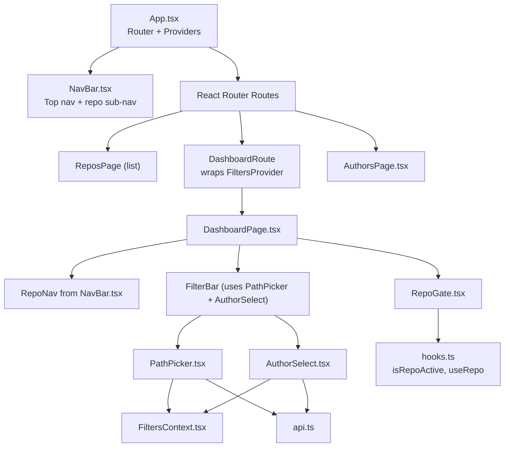
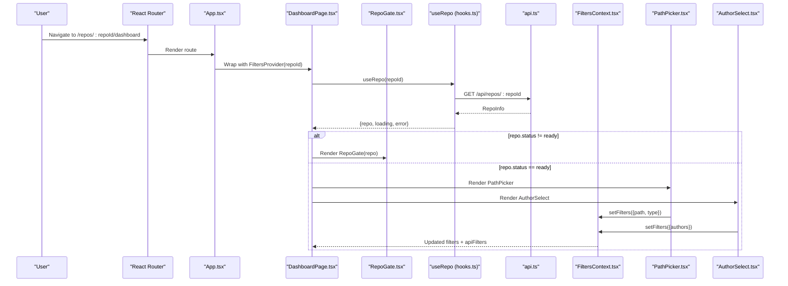
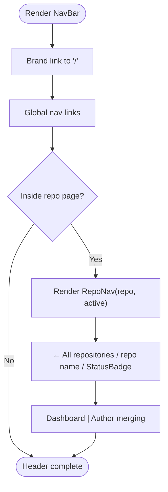
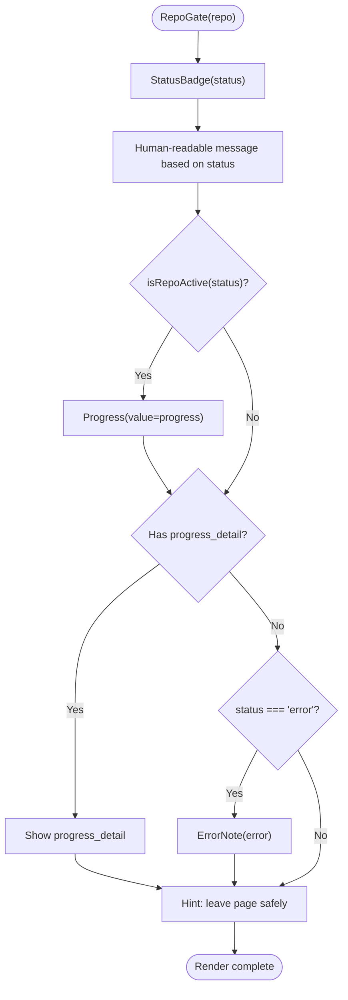
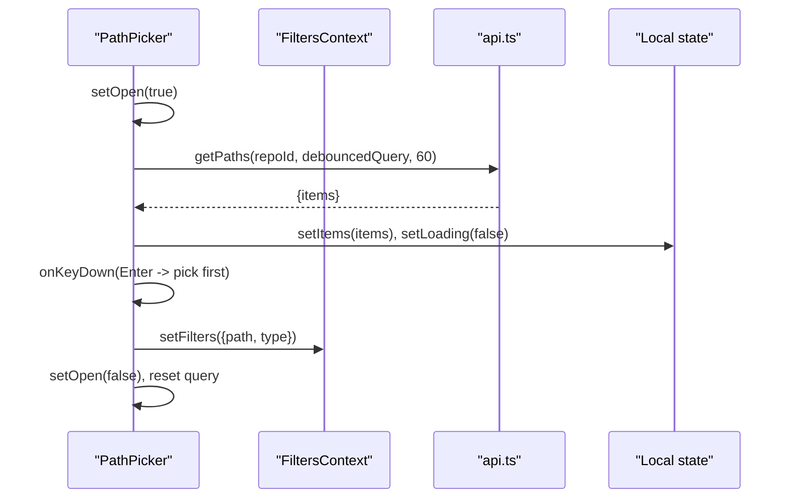
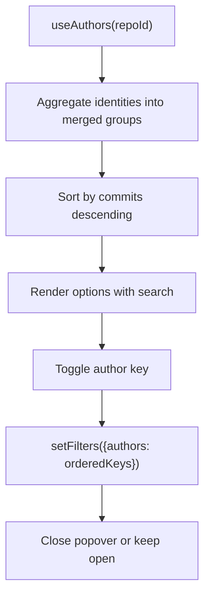
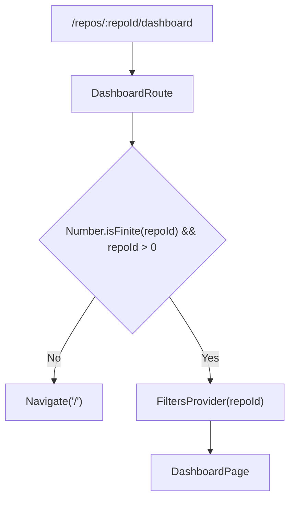
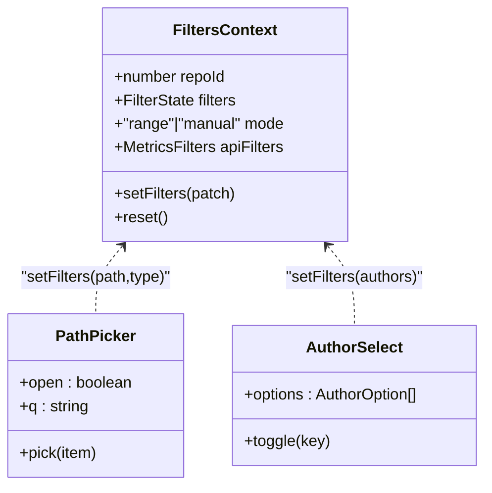
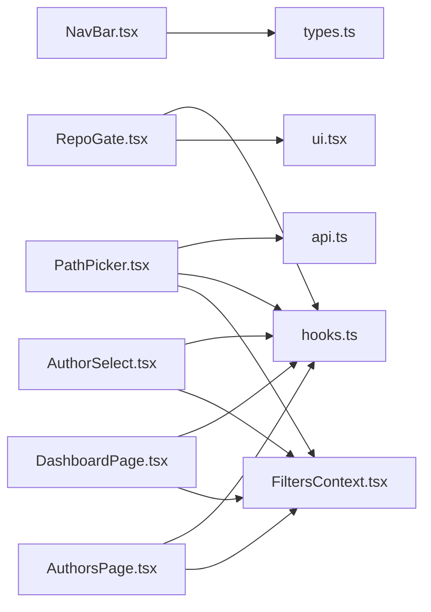

# Application Layout Components

<cite>
**Referenced Files in This Document**
- [App.tsx](file://frontend/src/App.tsx)
- [NavBar.tsx](file://frontend/src/components/NavBar.tsx)
- [RepoGate.tsx](file://frontend/src/components/RepoGate.tsx)
- [PathPicker.tsx](file://frontend/src/components/PathPicker.tsx)
- [AuthorSelect.tsx](file://frontend/src/components/AuthorSelect.tsx)
- [FiltersContext.tsx](file://frontend/src/state/FiltersContext.tsx)
- [hooks.ts](file://frontend/src/lib/hooks.ts)
- [api.ts](file://frontend/src/api.ts)
- [types.ts](file://frontend/src/types.ts)
- [DashboardPage.tsx](file://frontend/src/pages/DashboardPage.tsx)
- [AuthorsPage.tsx](file://frontend/src/pages/AuthorsPage.tsx)
- [ui.tsx](file://frontend/src/components/ui.tsx)
</cite>

## Table of Contents
1. [Introduction](#introduction)
2. [Project Structure](#project-structure)
3. [Core Components](#core-components)
4. [Architecture Overview](#architecture-overview)
5. [Detailed Component Analysis](#detailed-component-analysis)
6. [Dependency Analysis](#dependency-analysis)
7. [Performance Considerations](#performance-considerations)
8. [Troubleshooting Guide](#troubleshooting-guide)
9. [Conclusion](#conclusion)
10. [Appendices](#appendices)

## Introduction
This document explains the application layout and navigation components used by RAT: NavBar, RepoGate, PathPicker, and AuthorSelect. It covers routing integration, state synchronization with the URL, repository loading and ingestion states, error handling, and user experience considerations. It also provides guidance for extending navigation, implementing custom guards, and managing application-wide filter state through these layout components.

## Project Structure
The frontend is a React application using React Router for navigation. The top-level shell mounts the global NavBar and defines routes for repositories, per-repository dashboards, and author merging. Repository-scoped pages wrap their content in a FiltersProvider so that filters are scoped to a single repository and synchronized with the URL query string.

**Diagram sources**
- [App.tsx:1-38](file://frontend/src/App.tsx#L1-L38)
- [NavBar.tsx:1-53](file://frontend/src/components/NavBar.tsx#L1-L53)
- [DashboardPage.tsx:1-95](file://frontend/src/pages/DashboardPage.tsx#L1-L95)
- [AuthorsPage.tsx:1-312](file://frontend/src/pages/AuthorsPage.tsx#L1-L312)
- [RepoGate.tsx:1-41](file://frontend/src/components/RepoGate.tsx#L1-L41)
- [PathPicker.tsx:1-127](file://frontend/src/components/PathPicker.tsx#L1-L127)
- [AuthorSelect.tsx:1-153](file://frontend/src/components/AuthorSelect.tsx#L1-L153)
- [FiltersContext.tsx:1-119](file://frontend/src/state/FiltersContext.tsx#L1-L119)
- [hooks.ts:1-142](file://frontend/src/lib/hooks.ts#L1-L142)
- [api.ts:1-127](file://frontend/src/api.ts#L1-L127)

**Section sources**
- [App.tsx:1-38](file://frontend/src/App.tsx#L1-L38)

## Core Components
- NavBar: Provides the global header link to repositories and a repository-scoped sub-navigation showing breadcrumb links to dashboard and author merging views.
- RepoGate: Displays repository ingestion status, progress, auto-refresh hints, and errors.
- PathPicker: Lets users search and select a file or directory path to scope metrics within a repository.
- AuthorSelect: Multi-select control for filtering commits by merged author identities.

These components integrate with:
- React Router for navigation and URL-based state.
- FiltersContext for shared, URL-synced filter state.
- hooks.ts for data fetching and polling.
- api.ts for typed backend calls.
- ui.tsx for presentational primitives like StatusBadge and Progress.

**Section sources**
- [NavBar.tsx:1-53](file://frontend/src/components/NavBar.tsx#L1-L53)
- [RepoGate.tsx:1-41](file://frontend/src/components/RepoGate.tsx#L1-L41)
- [PathPicker.tsx:1-127](file://frontend/src/components/PathPicker.tsx#L1-L127)
- [AuthorSelect.tsx:1-153](file://frontend/src/components/AuthorSelect.tsx#L1-L153)
- [FiltersContext.tsx:1-119](file://frontend/src/state/FiltersContext.tsx#L1-L119)
- [hooks.ts:1-142](file://frontend/src/lib/hooks.ts#L1-L142)
- [api.ts:1-127](file://frontend/src/api.ts#L1-L127)
- [ui.tsx:1-65](file://frontend/src/components/ui.tsx#L1-L65)

## Architecture Overview
The application uses a layered architecture:
- Routing layer: App.tsx configures routes and wraps repository-scoped pages with FiltersProvider.
- Layout layer: NavBar renders global and per-repo navigation; RepoGate shows ingestion state.
- Interaction layer: PathPicker and AuthorSelect update FiltersContext via setFilters.
- Data layer: hooks.ts and api.ts fetch repository metadata, authors, paths, and metrics.

**Diagram sources**
- [App.tsx:10-31](file://frontend/src/App.tsx#L10-L31)
- [DashboardPage.tsx:17-95](file://frontend/src/pages/DashboardPage.tsx#L17-L95)
- [RepoGate.tsx:15-41](file://frontend/src/components/RepoGate.tsx#L15-L41)
- [hooks.ts:14-49](file://frontend/src/lib/hooks.ts#L14-L49)
- [api.ts:54-66](file://frontend/src/api.ts#L54-L66)
- [FiltersContext.tsx:70-112](file://frontend/src/state/FiltersContext.tsx#L70-L112)
- [PathPicker.tsx:46-54](file://frontend/src/components/PathPicker.tsx#L46-L54)
- [AuthorSelect.tsx:60-67](file://frontend/src/components/AuthorSelect.tsx#L60-L67)

## Detailed Component Analysis

### NavBar
Responsibilities:
- Global brand link to the repositories list.
- Top-level navigation link to repositories.
- Per-repository sub-navigation (RepoNav) with breadcrumb and active tab styling.

Key behaviors:
- Uses NavLink for active-state styling on both global and repo-scoped links.
- RepoNav displays repository name, status badge, and links to dashboard and author merging.

Extensibility:
- Add new top-level links inside the nav-links section.
- Extend RepoNav to include additional tabs for new repository features.

**Diagram sources**
- [NavBar.tsx:6-23](file://frontend/src/components/NavBar.tsx#L6-L23)
- [NavBar.tsx:26-52](file://frontend/src/components/NavBar.tsx#L26-L52)

**Section sources**
- [NavBar.tsx:1-53](file://frontend/src/components/NavBar.tsx#L1-L53)

### RepoGate
Responsibilities:
- Display repository ingestion status and human-readable messages.
- Show progress bar while ingestion is active.
- Surface detailed progress text and error messages.
- Indicate auto-refresh behavior during active ingestion.

State mapping:
- Active statuses: pending, cloning, extracting, indexing.
- Ready and error states are terminal.

UX considerations:
- Clear messaging about server-side continuation even if the user leaves the page.
- Spinner and “auto-refreshing” hint when ingestion is ongoing.

**Diagram sources**
- [RepoGate.tsx:6-13](file://frontend/src/components/RepoGate.tsx#L6-L13)
- [RepoGate.tsx:15-41](file://frontend/src/components/RepoGate.tsx#L15-L41)
- [hooks.ts:7-11](file://frontend/src/lib/hooks.ts#L7-L11)
- [ui.tsx:5-18](file://frontend/src/components/ui.tsx#L5-L18)

**Section sources**
- [RepoGate.tsx:1-41](file://frontend/src/components/RepoGate.tsx#L1-L41)
- [hooks.ts:7-11](file://frontend/src/lib/hooks.ts#L7-L11)
- [ui.tsx:5-18](file://frontend/src/components/ui.tsx#L5-L18)

### PathPicker
Responsibilities:
- Provide a searchable dropdown to select a file or directory path for scoping metrics.
- Debounce search input to reduce API calls.
- Update FiltersContext with selected path and object type.
- Handle open/close interactions and keyboard shortcuts.

Data flow:
- On open, fetches paths via api.getPaths(repoId, qDeb, limit).
- Updates local items, loading, and error state.
- On selection, sets filters.path and filters.type, then closes popover.

Error handling:
- Catches network errors and stores a user-facing message.
- Shows empty or no-match states appropriately.

Accessibility and UX:
- Auto-focuses input when opened.
- Supports Enter to pick first result and Escape to close.
- Click-outside-to-close behavior via useClickOutside.

**Diagram sources**
- [PathPicker.tsx:9-54](file://frontend/src/components/PathPicker.tsx#L9-L54)
- [PathPicker.tsx:81-123](file://frontend/src/components/PathPicker.tsx#L81-L123)
- [api.ts:100-105](file://frontend/src/api.ts#L100-L105)
- [FiltersContext.tsx:80-85](file://frontend/src/state/FiltersContext.tsx#L80-L85)

**Section sources**
- [PathPicker.tsx:1-127](file://frontend/src/components/PathPicker.tsx#L1-L127)
- [api.ts:100-105](file://frontend/src/api.ts#L100-L105)
- [FiltersContext.tsx:80-85](file://frontend/src/state/FiltersContext.tsx#L80-L85)

### AuthorSelect
Responsibilities:
- Display a multi-select list of authors, including merged groups.
- Debounce and filter options by name or email.
- Maintain stable ordering of selected keys matching option order.
- Update FiltersContext.authors array.

Data processing:
- useAuthorOptions aggregates author identities into merged groups, summing commit counts and collecting emails.
- Sorting by commit count ensures most active authors appear first.

Interaction model:
- Toggle individual authors to add/remove from selection.
- Clear button resets authors filter.
- Popover supports click-outside-to-close.

**Diagram sources**
- [AuthorSelect.tsx:15-40](file://frontend/src/components/AuthorSelect.tsx#L15-L40)
- [AuthorSelect.tsx:42-67](file://frontend/src/components/AuthorSelect.tsx#L42-L67)
- [hooks.ts:101-124](file://frontend/src/lib/hooks.ts#L101-L124)

**Section sources**
- [AuthorSelect.tsx:1-153](file://frontend/src/components/AuthorSelect.tsx#L1-L153)
- [hooks.ts:101-124](file://frontend/src/lib/hooks.ts#L101-L124)

### Routing Integration and Guards
Routing:
- App.tsx defines routes for repositories, per-repository dashboard, and per-repository authors.
- DashboardRoute validates repoId and wraps DashboardPage with FiltersProvider(repoId).
- Unknown routes redirect to /.

Guard pattern:
- DashboardRoute acts as a simple guard ensuring valid numeric repoId before rendering repository-specific content.
- Pages handle missing or invalid repository data by showing Loading or ErrorNote.

Extending navigation:
- Add new routes under Routes in App.tsx.
- Create a new route wrapper similar to DashboardRoute to inject FiltersProvider with a different repoId or additional context.
- Add new NavLink entries in NavBar for global navigation.

**Diagram sources**
- [App.tsx:10-31](file://frontend/src/App.tsx#L10-L31)

**Section sources**
- [App.tsx:1-38](file://frontend/src/App.tsx#L1-L38)

### State Synchronization Patterns
FiltersContext:
- Parses URLSearchParams into FilterState and serializes updates back to the URL with replace semantics.
- Exposes repoId, filters, mode ("range" vs "manual"), setFilters, reset, and apiFilters.
- Computes apiFilters for backend consumption, converting dates to timestamps and normalizing object_type.

Integration points:
- PathPicker updates filters.path and filters.type.
- AuthorSelect updates filters.authors.
- DashboardPage and AuthorsPage consume filters via useFilters().

URL parameters:
- start, end (YYYY-MM-DD), commits (comma-separated SHAs), authors (comma-separated keys), path + type, gran (day/week/month).

**Diagram sources**
- [FiltersContext.tsx:14-66](file://frontend/src/state/FiltersContext.tsx#L14-L66)
- [FiltersContext.tsx:70-112](file://frontend/src/state/FiltersContext.tsx#L70-L112)
- [PathPicker.tsx:46-54](file://frontend/src/components/PathPicker.tsx#L46-L54)
- [AuthorSelect.tsx:60-67](file://frontend/src/components/AuthorSelect.tsx#L60-L67)

**Section sources**
- [FiltersContext.tsx:1-119](file://frontend/src/state/FiltersContext.tsx#L1-L119)

### Error Handling Strategies
- api.ts centralizes HTTP error handling, throwing ApiError with status and detail.
- hooks.ts catches errors from API calls and exposes them to components.
- RepoGate surfaces ingestion errors via ErrorNote.
- PathPicker captures fetch errors and displays them in the popover.
- DashboardPage and AuthorsPage show ErrorNote for repository load failures.

Best practices:
- Always normalize errors to strings for display.
- Keep loading states separate from error states to avoid flashing empty charts.
- Use toast notifications for user actions like merges (AuthorsPage).

**Section sources**
- [api.ts:17-44](file://frontend/src/api.ts#L17-L44)
- [hooks.ts:19-49](file://frontend/src/lib/hooks.ts#L19-L49)
- [hooks.ts:71-99](file://frontend/src/lib/hooks.ts#L71-L99)
- [hooks.ts:106-124](file://frontend/src/lib/hooks.ts#L106-L124)
- [RepoGate.tsx:31-31](file://frontend/src/components/RepoGate.tsx#L31-L31)
- [PathPicker.tsx:31-33](file://frontend/src/components/PathPicker.tsx#L31-L33)
- [DashboardPage.tsx:21-34](file://frontend/src/pages/DashboardPage.tsx#L21-L34)
- [AuthorsPage.tsx:41-87](file://frontend/src/pages/AuthorsPage.tsx#L41-L87)

### User Experience Considerations
- Navigation clarity: NavLink active states help users understand current location.
- Ingestion feedback: RepoGate provides clear status, progress, and reassurance that indexing continues server-side.
- Search performance: Debounced queries in PathPicker reduce unnecessary requests.
- Keyboard support: Enter to select, Escape to close, click-outside to dismiss.
- Shareable state: URL-synced filters allow bookmarking and sharing specific views.

[No sources needed since this section summarizes UX patterns without analyzing specific files]

## Dependency Analysis
Components depend on shared utilities and contexts:
- NavBar depends on react-router-dom and types.RepoInfo.
- RepoGate depends on hooks.isRepoActive and ui.StatusBadge/Progress/ErrorNote.
- PathPicker depends on api.getPaths, useClickOutside, useDebouncedValue, and FiltersContext.
- AuthorSelect depends on hooks.useAuthors, FiltersContext, and formatting utilities.
- DashboardPage and AuthorsPage depend on hooks.useRepo, FiltersContext, and RepoGate.

**Diagram sources**
- [NavBar.tsx:1-53](file://frontend/src/components/NavBar.tsx#L1-L53)
- [RepoGate.tsx:1-41](file://frontend/src/components/RepoGate.tsx#L1-L41)
- [PathPicker.tsx:1-127](file://frontend/src/components/PathPicker.tsx#L1-L127)
- [AuthorSelect.tsx:1-153](file://frontend/src/components/AuthorSelect.tsx#L1-L153)
- [DashboardPage.tsx:1-95](file://frontend/src/pages/DashboardPage.tsx#L1-L95)
- [AuthorsPage.tsx:1-312](file://frontend/src/pages/AuthorsPage.tsx#L1-L312)
- [FiltersContext.tsx:1-119](file://frontend/src/state/FiltersContext.tsx#L1-L119)
- [hooks.ts:1-142](file://frontend/src/lib/hooks.ts#L1-L142)
- [api.ts:1-127](file://frontend/src/api.ts#L1-L127)
- [types.ts:1-172](file://frontend/src/types.ts#L1-L172)
- [ui.tsx:1-65](file://frontend/src/components/ui.tsx#L1-L65)

**Section sources**
- [NavBar.tsx:1-53](file://frontend/src/components/NavBar.tsx#L1-L53)
- [RepoGate.tsx:1-41](file://frontend/src/components/RepoGate.tsx#L1-L41)
- [PathPicker.tsx:1-127](file://frontend/src/components/PathPicker.tsx#L1-L127)
- [AuthorSelect.tsx:1-153](file://frontend/src/components/AuthorSelect.tsx#L1-L153)
- [DashboardPage.tsx:1-95](file://frontend/src/pages/DashboardPage.tsx#L1-L95)
- [AuthorsPage.tsx:1-312](file://frontend/src/pages/AuthorsPage.tsx#L1-L312)
- [FiltersContext.tsx:1-119](file://frontend/src/state/FiltersContext.tsx#L1-L119)
- [hooks.ts:1-142](file://frontend/src/lib/hooks.ts#L1-L142)
- [api.ts:1-127](file://frontend/src/api.ts#L1-L127)
- [types.ts:1-172](file://frontend/src/types.ts#L1-L172)
- [ui.tsx:1-65](file://frontend/src/components/ui.tsx#L1-L65)

## Performance Considerations
- Debouncing: PathPicker and metrics hooks debounce inputs to reduce API churn.
- Polling: useRepo polls repository status at intervals until ingestion completes.
- Stale data retention: useMetrics keeps previous data while new queries run to prevent chart flicker.
- Stable ordering: AuthorSelect maintains selection order matching option list to minimize re-renders.

Recommendations:
- Tune pollMs for large repositories to balance responsiveness and overhead.
- Consider increasing PathPicker limit or adding pagination if path lists grow significantly.
- Avoid deep nested memoization unless profiling indicates bottlenecks.

[No sources needed since this section provides general guidance]

## Troubleshooting Guide
Common issues and resolutions:
- Backend unreachable: ApiError thrown with a message indicating server connectivity. Ensure the backend is running and accessible.
- Invalid repository ID: DashboardRoute redirects to home if repoId is not a positive number. Verify URL params.
- Missing repository data: Pages show Loading or ErrorNote; check useRepo error state and backend logs.
- Ingestion errors: RepoGate displays error details; inspect server-side ingestion logs and retry after resolution.
- Path search returns no results: Confirm repo is indexed and query matches available paths; adjust search term.
- Author list empty: Check whether .mailmap was applied and whether authors were indexed; verify useAuthors response.

Operational tips:
- Use browser dev tools to inspect URL query parameters and ensure FiltersContext serialization is correct.
- Monitor network requests for api.getPaths and api.metrics to validate payload structure.
- For merge operations in AuthorsPage, confirm toast messages and updated author lists after API calls.

**Section sources**
- [api.ts:17-44](file://frontend/src/api.ts#L17-L44)
- [App.tsx:10-18](file://frontend/src/App.tsx#L10-L18)
- [DashboardPage.tsx:21-34](file://frontend/src/pages/DashboardPage.tsx#L21-L34)
- [RepoGate.tsx:31-31](file://frontend/src/components/RepoGate.tsx#L31-L31)
- [AuthorsPage.tsx:41-87](file://frontend/src/pages/AuthorsPage.tsx#L41-L87)

## Conclusion
RAT’s layout and navigation components provide a cohesive, URL-synced, and user-friendly interface for repository analysis. NavBar establishes global and per-repo navigation, RepoGate communicates ingestion lifecycle clearly, PathPicker enables precise metric scoping, and AuthorSelect simplifies contributor filtering. Together with FiltersContext and robust error handling, they form a scalable foundation for extending navigation, adding guards, and managing application-wide state.

[No sources needed since this section summarizes without analyzing specific files]

## Appendices

### Extending Navigation Structure
- Add a new top-level link in NavBar under nav-links.
- Create a new route in App.tsx and a corresponding page component.
- If the new route is repository-scoped, wrap it with FiltersProvider(repoId) similar to DashboardRoute.

**Section sources**
- [NavBar.tsx:13-17](file://frontend/src/components/NavBar.tsx#L13-L17)
- [App.tsx:27-31](file://frontend/src/App.tsx#L27-L31)

### Implementing Custom Guards
- Follow DashboardRoute pattern: validate params, redirect if invalid, and wrap content with appropriate providers.
- Place guard logic before rendering repository-specific components to prevent unnecessary data fetching.

**Section sources**
- [App.tsx:10-18](file://frontend/src/App.tsx#L10-L18)

### Managing Application-Wide State Through Layout Components
- Use FiltersContext.setFilters to update path, authors, time range, and granularity.
- Persist state via URL query parameters for shareability.
- Consume filters via useFilters() in any child component needing access to current state.

**Section sources**
- [FiltersContext.tsx:70-112](file://frontend/src/state/FiltersContext.tsx#L70-L112)
- [PathPicker.tsx:46-54](file://frontend/src/components/PathPicker.tsx#L46-L54)
- [AuthorSelect.tsx:60-67](file://frontend/src/components/AuthorSelect.tsx#L60-L67)