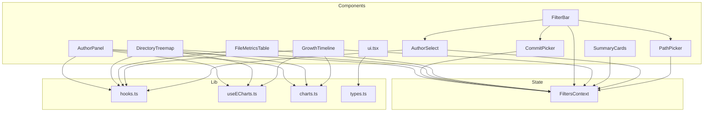
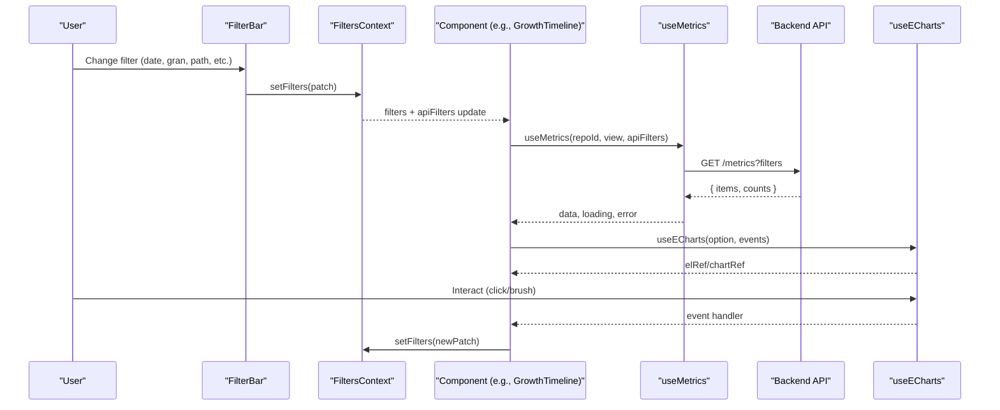
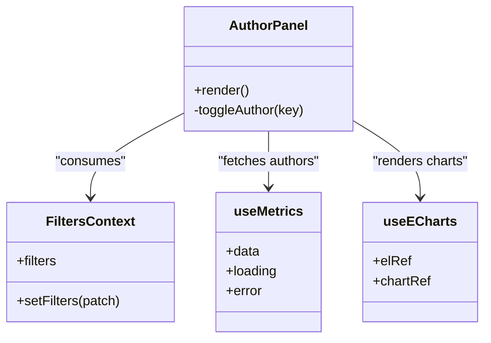
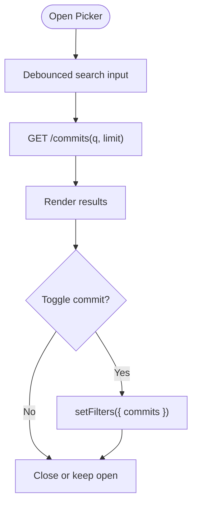
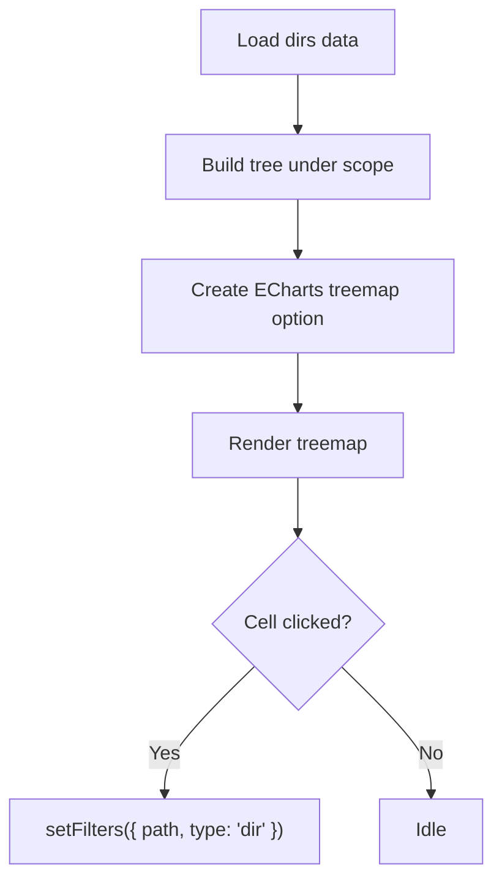
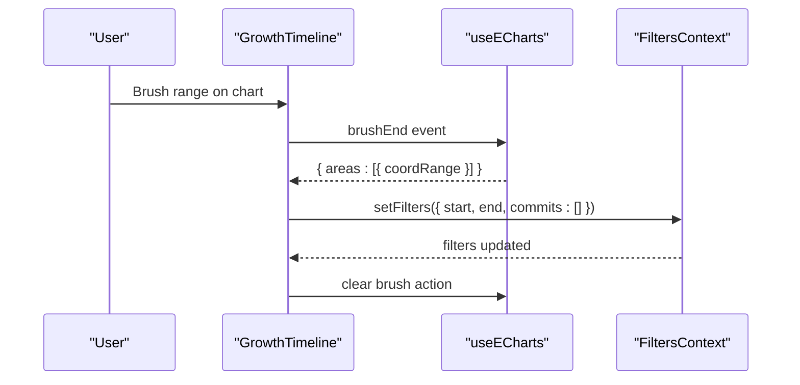
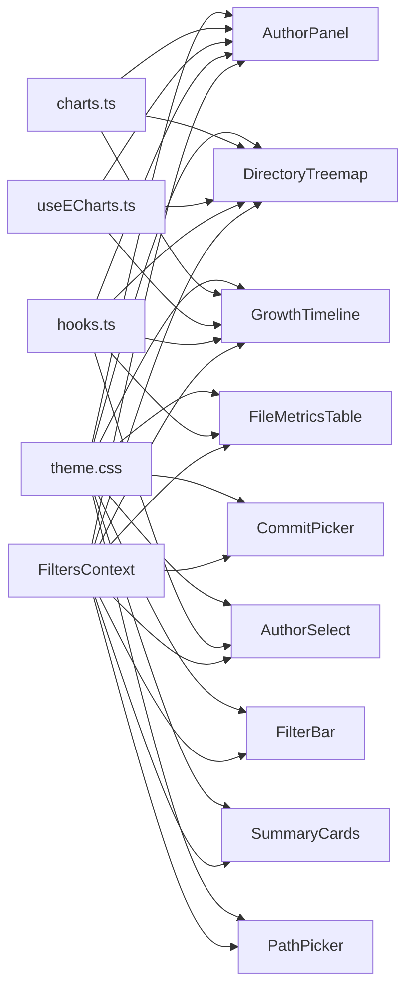

# Component Architecture

<cite>
**Referenced Files in This Document**
- [AuthorPanel.tsx](file://frontend/src/components/AuthorPanel.tsx)
- [CommitPicker.tsx](file://frontend/src/components/CommitPicker.tsx)
- [DirectoryTreemap.tsx](file://frontend/src/components/DirectoryTreemap.tsx)
- [FileMetricsTable.tsx](file://frontend/src/components/FileMetricsTable.tsx)
- [FilterBar.tsx](file://frontend/src/components/FilterBar.tsx)
- [GrowthTimeline.tsx](file://frontend/src/components/GrowthTimeline.tsx)
- [SummaryCards.tsx](file://frontend/src/components/SummaryCards.tsx)
- [AuthorSelect.tsx](file://frontend/src/components/AuthorSelect.tsx)
- [PathPicker.tsx](file://frontend/src/components/PathPicker.tsx)
- [ui.tsx](file://frontend/src/components/ui.tsx)
- [FiltersContext.tsx](file://frontend/src/state/FiltersContext.tsx)
- [hooks.ts](file://frontend/src/lib/hooks.ts)
- [useECharts.ts](file://frontend/src/lib/useECharts.ts)
- [charts.ts](file://frontend/src/lib/charts.ts)
- [theme.css](file://frontend/src/theme.css)
- [types.ts](file://frontend/src/types.ts)
</cite>

## Table of Contents
1. [Introduction](#introduction)
2. [Project Structure](#project-structure)
3. [Core Components](#core-components)
4. [Architecture Overview](#architecture-overview)
5. [Detailed Component Analysis](#detailed-component-analysis)
6. [Dependency Analysis](#dependency-analysis)
7. [Performance Considerations](#performance-considerations)
8. [Troubleshooting Guide](#troubleshooting-guide)
9. [Conclusion](#conclusion)

## Introduction
This document explains the React component architecture for RAT’s dashboard UI. It focuses on reusable components, their composition patterns, prop interfaces, event handling, and integration with ECharts. It also covers shared UI primitives, responsive design, accessibility considerations, state management via a URL-synced filter context, and the styling approach using CSS variables and utility classes.

## Project Structure
The frontend is organized by feature:
- components/: Reusable UI components (charts, tables, filters, panels).
- lib/: Shared hooks, chart helpers, formatting utilities, time helpers, and ECharts binding.
- state/: Global state providers (filters, toasts).
- pages/: Page-level containers that compose components.
- theme.css: Centralized dark theme, layout utilities, and component styles.

**Diagram sources**
- [AuthorPanel.tsx:1-199](file://frontend/src/components/AuthorPanel.tsx#L1-L199)
- [CommitPicker.tsx:1-162](file://frontend/src/components/CommitPicker.tsx#L1-L162)
- [DirectoryTreemap.tsx:1-167](file://frontend/src/components/DirectoryTreemap.tsx#L1-L167)
- [FileMetricsTable.tsx:1-152](file://frontend/src/components/FileMetricsTable.tsx#L1-L152)
- [FilterBar.tsx:1-93](file://frontend/src/components/FilterBar.tsx#L1-L93)
- [GrowthTimeline.tsx:1-167](file://frontend/src/components/GrowthTimeline.tsx#L1-L167)
- [SummaryCards.tsx:1-84](file://frontend/src/components/SummaryCards.tsx#L1-L84)
- [AuthorSelect.tsx:1-153](file://frontend/src/components/AuthorSelect.tsx#L1-L153)
- [PathPicker.tsx:1-127](file://frontend/src/components/PathPicker.tsx#L1-L127)
- [ui.tsx:1-52](file://frontend/src/components/ui.tsx#L1-L52)
- [FiltersContext.tsx:1-119](file://frontend/src/state/FiltersContext.tsx#L1-L119)
- [hooks.ts:1-142](file://frontend/src/lib/hooks.ts#L1-L142)
- [useECharts.ts:1-46](file://frontend/src/lib/useECharts.ts#L1-L46)
- [charts.ts:1-47](file://frontend/src/lib/charts.ts#L1-L47)
- [types.ts:1-172](file://frontend/src/types.ts#L1-L172)

**Section sources**
- [theme.css:1-289](file://frontend/src/theme.css#L1-L289)
- [types.ts:1-172](file://frontend/src/types.ts#L1-L172)

## Core Components
- AuthorPanel: Displays author ownership donut and top modification bars; clicking an item toggles author filters.
- CommitPicker: Manual commit selection with search, pagination, and multi-select; overrides time range when active.
- DirectoryTreemap: Treemap visualizing churn and growth per directory; clicking scopes metrics to a directory.
- FileMetricsTable: Per-file metrics table with client-side sorting and CSV export.
- FilterBar: Aggregates PathPicker, date range inputs, bucket selector, AuthorSelect, and CommitPicker; provides reset.
- GrowthTimeline: Timeseries chart with brush-to-filter interaction to set start/end dates.
- SummaryCards: Seven commit-set metrics plus |H|, with skeleton loading states.
- AuthorSelect: Multi-select dropdown for authors with merged identities and search.
- PathPicker: Object scope picker for files/directories with debounced search.
- ui.tsx: Presentational primitives (StatusBadge, Progress, Empty, ErrorNote, Loading, ChartState).

Key responsibilities:
- Data fetching: useMetrics hook for metrics endpoints; useAuthors for author list.
- State synchronization: FiltersContext keeps filters in sync with URL query parameters.
- Charting: useECharts binds ECharts instances to refs with resize observation and option diffing.
- Styling: theme.css provides a cohesive dark theme, grid/flex layouts, cards, buttons, popovers, and chart containers.

**Section sources**
- [AuthorPanel.tsx:1-199](file://frontend/src/components/AuthorPanel.tsx#L1-L199)
- [CommitPicker.tsx:1-162](file://frontend/src/components/CommitPicker.tsx#L1-L162)
- [DirectoryTreemap.tsx:1-167](file://frontend/src/components/DirectoryTreemap.tsx#L1-L167)
- [FileMetricsTable.tsx:1-152](file://frontend/src/components/FileMetricsTable.tsx#L1-L152)
- [FilterBar.tsx:1-93](file://frontend/src/components/FilterBar.tsx#L1-L93)
- [GrowthTimeline.tsx:1-167](file://frontend/src/components/GrowthTimeline.tsx#L1-L167)
- [SummaryCards.tsx:1-84](file://frontend/src/components/SummaryCards.tsx#L1-L84)
- [AuthorSelect.tsx:1-153](file://frontend/src/components/AuthorSelect.tsx#L1-L153)
- [PathPicker.tsx:1-127](file://frontend/src/components/PathPicker.tsx#L1-L127)
- [ui.tsx:1-52](file://frontend/src/components/ui.tsx#L1-L52)

## Architecture Overview
The dashboard uses a unidirectional data flow:
- FiltersContext centralizes user filters and serializes them to the URL.
- Components consume filters via useFilters and render accordingly.
- Data fetching is handled by useMetrics (debounced), which calls backend endpoints through api.
- Charts are rendered via useECharts, which manages lifecycle, events, and resizing.
- UI primitives from ui.tsx standardize empty/error/loading states.

**Diagram sources**
- [FilterBar.tsx:1-93](file://frontend/src/components/FilterBar.tsx#L1-L93)
- [FiltersContext.tsx:1-119](file://frontend/src/state/FiltersContext.tsx#L1-L119)
- [hooks.ts:51-99](file://frontend/src/lib/hooks.ts#L51-L99)
- [useECharts.ts:1-46](file://frontend/src/lib/useECharts.ts#L1-L46)
- [GrowthTimeline.tsx:1-167](file://frontend/src/components/GrowthTimeline.tsx#L1-L167)

## Detailed Component Analysis

### AuthorPanel
Purpose:
- Visualize author ownership distribution and top modifications.
- Toggle authors into/out of the filter on click.

Key behaviors:
- Computes top authors and aggregates “Other” group when needed.
- Builds ECharts options for pie (donut) and horizontal bar charts.
- Integrates with FiltersContext to toggle author keys.

Prop interface: None (reads repoId and filters from context).

Event handling:
- Click on chart segments updates filters.authors via setFilters.

Composition:
- Uses ChartState from ui.tsx for loading/error/empty states.
- Uses useMetrics for AuthorsMetricsResponse.
- Uses useECharts for chart instance management.

**Diagram sources**
- [AuthorPanel.tsx:1-199](file://frontend/src/components/AuthorPanel.tsx#L1-L199)
- [FiltersContext.tsx:1-119](file://frontend/src/state/FiltersContext.tsx#L1-L119)
- [hooks.ts:51-99](file://frontend/src/lib/hooks.ts#L51-L99)
- [useECharts.ts:1-46](file://frontend/src/lib/useECharts.ts#L1-L46)

**Section sources**
- [AuthorPanel.tsx:1-199](file://frontend/src/components/AuthorPanel.tsx#L1-L199)
- [ui.tsx:36-51](file://frontend/src/components/ui.tsx#L36-L51)
- [hooks.ts:51-99](file://frontend/src/lib/hooks.ts#L51-L99)
- [useECharts.ts:1-46](file://frontend/src/lib/useECharts.ts#L1-L46)

### CommitPicker
Purpose:
- Provide manual commit selection with search and pagination.
- When commits are selected, they override the time range.

Key behaviors:
- Debounced search input triggers API call for commits.
- Maintains local open/closed state and selected set.
- Updates filters.commits via setFilters.

Prop interface: None (uses FiltersContext).

Accessibility:
- Keyboard support for Escape to close.
- Read-only checkboxes indicate selection state.

**Diagram sources**
- [CommitPicker.tsx:1-162](file://frontend/src/components/CommitPicker.tsx#L1-L162)
- [FiltersContext.tsx:1-119](file://frontend/src/state/FiltersContext.tsx#L1-L119)

**Section sources**
- [CommitPicker.tsx:1-162](file://frontend/src/components/CommitPicker.tsx#L1-L162)
- [FiltersContext.tsx:1-119](file://frontend/src/state/FiltersContext.tsx#L1-L119)

### DirectoryTreemap
Purpose:
- Show directory churn and growth via treemap; clicking scopes metrics to a directory.

Key behaviors:
- Builds hierarchical tree from flat DirRow list.
- Colors cells based on growth using divergingColor helper.
- Disables nodeClick at ECharts level; handles click via useECharts callback to setFilters.

Prop interface: None (uses FiltersContext).

**Diagram sources**
- [DirectoryTreemap.tsx:1-167](file://frontend/src/components/DirectoryTreemap.tsx#L1-L167)
- [charts.ts:35-46](file://frontend/src/lib/charts.ts#L35-L46)
- [useECharts.ts:1-46](file://frontend/src/lib/useECharts.ts#L1-L46)

**Section sources**
- [DirectoryTreemap.tsx:1-167](file://frontend/src/components/DirectoryTreemap.tsx#L1-L167)
- [charts.ts:35-46](file://frontend/src/lib/charts.ts#L35-L46)

### FileMetricsTable
Purpose:
- Display per-file metrics with client-side sorting and CSV export.

Key behaviors:
- Sorts rows by key and direction.
- Exports current rows to CSV using downloadCsv utility.
- Uses ui.tsx primitives for empty/error/loading states.

Prop interface:
- repoName: string (used for safe CSV filename generation).

**Section sources**
- [FileMetricsTable.tsx:1-152](file://frontend/src/components/FileMetricsTable.tsx#L1-L152)
- [ui.tsx:20-34](file://frontend/src/components/ui.tsx#L20-L34)

### FilterBar
Purpose:
- Aggregate all dashboard filters: object scope, time range, granularity, authors, commits.
- Provide reset functionality and hint when manual mode is active.

Key behaviors:
- Composes PathPicker, AuthorSelect, CommitPicker.
- Date inputs disabled when manual commit selection is active.
- Detects default state to disable Clear all button.

**Section sources**
- [FilterBar.tsx:1-93](file://frontend/src/components/FilterBar.tsx#L1-L93)
- [AuthorSelect.tsx:1-153](file://frontend/src/components/AuthorSelect.tsx#L1-L153)
- [CommitPicker.tsx:1-162](file://frontend/src/components/CommitPicker.tsx#L1-L162)
- [PathPicker.tsx:1-127](file://frontend/src/components/PathPicker.tsx#L1-L127)

### GrowthTimeline
Purpose:
- Timeseries visualization of added, removed, growth, churn, and commits per bucket.
- Brush interaction sets the dashboard time range.

Key behaviors:
- Builds ECharts line chart with area fills and toolbox brush.
- brushEnd handler computes start/end dates and clears brush visually.

Prop interface: None (uses FiltersContext).

**Diagram sources**
- [GrowthTimeline.tsx:1-167](file://frontend/src/components/GrowthTimeline.tsx#L1-L167)
- [useECharts.ts:1-46](file://frontend/src/lib/useECharts.ts#L1-L46)
- [FiltersContext.tsx:1-119](file://frontend/src/state/FiltersContext.tsx#L1-L119)

**Section sources**
- [GrowthTimeline.tsx:1-167](file://frontend/src/components/GrowthTimeline.tsx#L1-L167)
- [useECharts.ts:1-46](file://frontend/src/lib/useECharts.ts#L1-L46)

### SummaryCards
Purpose:
- Display seven commit-set metrics plus |H| with skeleton loading placeholders.

Key behaviors:
- Renders Stat card with label, value, footnotes, and optional negative/positive coloring.
- Shows ErrorNote if error occurs without data.

Prop interface: None (uses FiltersContext).

**Section sources**
- [SummaryCards.tsx:1-84](file://frontend/src/components/SummaryCards.tsx#L1-L84)
- [ui.tsx:24-26](file://frontend/src/components/ui.tsx#L24-L26)

### AuthorSelect
Purpose:
- Multi-select dropdown for authors with merged identities and search.

Key behaviors:
- Merges identities into groups where applicable.
- Debounced filtering by name/email.
- Preserves stable ordering matching option list.

Prop interface: None (uses FiltersContext).

**Section sources**
- [AuthorSelect.tsx:1-153](file://frontend/src/components/AuthorSelect.tsx#L1-L153)

### PathPicker
Purpose:
- Object scope picker for files/directories with debounced search.

Key behaviors:
- Focuses input on open.
- Supports Enter to select first match and Escape to close.
- Updates filters.path and filters.type.

Prop interface: None (uses FiltersContext).

**Section sources**
- [PathPicker.tsx:1-127](file://frontend/src/components/PathPicker.tsx#L1-L127)

### UI Primitives (ui.tsx)
- StatusBadge: Color-coded badge for RepoStatus.
- Progress: Percentage progress bar.
- Empty: Generic empty state container.
- ErrorNote: Styled error message container.
- Loading: Spinner with label.
- ChartState: Conditional rendering for chart loading/error/empty states.

Accessibility:
- Progress includes title with percentage text.
- Loading and Empty provide consistent messaging.

**Section sources**
- [ui.tsx:1-52](file://frontend/src/components/ui.tsx#L1-L52)

## Dependency Analysis
High-level dependencies:
- Components depend on FiltersContext for global filter state.
- Components use useMetrics for data fetching and useECharts for chart rendering.
- Chart visuals rely on shared palette and helpers from charts.ts.
- All components are styled via theme.css.

**Diagram sources**
- [FiltersContext.tsx:1-119](file://frontend/src/state/FiltersContext.tsx#L1-L119)
- [hooks.ts:1-142](file://frontend/src/lib/hooks.ts#L1-L142)
- [useECharts.ts:1-46](file://frontend/src/lib/useECharts.ts#L1-L46)
- [charts.ts:1-47](file://frontend/src/lib/charts.ts#L1-L47)
- [theme.css:1-289](file://frontend/src/theme.css#L1-L289)
- [AuthorPanel.tsx:1-199](file://frontend/src/components/AuthorPanel.tsx#L1-L199)
- [CommitPicker.tsx:1-162](file://frontend/src/components/CommitPicker.tsx#L1-L162)
- [DirectoryTreemap.tsx:1-167](file://frontend/src/components/DirectoryTreemap.tsx#L1-L167)
- [FileMetricsTable.tsx:1-152](file://frontend/src/components/FileMetricsTable.tsx#L1-L152)
- [FilterBar.tsx:1-93](file://frontend/src/components/FilterBar.tsx#L1-L93)
- [GrowthTimeline.tsx:1-167](file://frontend/src/components/GrowthTimeline.tsx#L1-L167)
- [SummaryCards.tsx:1-84](file://frontend/src/components/SummaryCards.tsx#L1-L84)
- [AuthorSelect.tsx:1-153](file://frontend/src/components/AuthorSelect.tsx#L1-L153)
- [PathPicker.tsx:1-127](file://frontend/src/components/PathPicker.tsx#L1-L127)

**Section sources**
- [FiltersContext.tsx:1-119](file://frontend/src/state/FiltersContext.tsx#L1-L119)
- [hooks.ts:1-142](file://frontend/src/lib/hooks.ts#L1-L142)
- [useECharts.ts:1-46](file://frontend/src/lib/useECharts.ts#L1-L46)
- [charts.ts:1-47](file://frontend/src/lib/charts.ts#L1-L47)
- [theme.css:1-289](file://frontend/src/theme.css#L1-L289)

## Performance Considerations
- Debouncing:
  - useMetrics debounces filter changes to reduce redundant requests.
  - CommitPicker and PathPicker debounce search input to limit API calls.
- Chart performance:
  - useECharts initializes lazily and resizes via ResizeObserver.
  - Options are memoized in components to avoid unnecessary re-renders.
- Data handling:
  - Top-N aggregation in AuthorPanel reduces chart complexity.
  - DirectoryTreemap builds a tree once per dataset and sorts children efficiently.
- Rendering:
  - Skeleton placeholders in SummaryCards improve perceived performance during loading.

[No sources needed since this section provides general guidance]

## Troubleshooting Guide
Common issues and resolutions:
- No data shown:
  - Verify FiltersContext filters are valid (start/end format, gran values).
  - Check useMetrics enabled flag and ensure repoId is correct.
- Charts not updating:
  - Ensure option objects are memoized and passed to useECharts.
  - Confirm event handlers update FiltersContext to trigger re-fetch.
- Popover not closing:
  - Use useClickOutside hook to handle outside clicks.
- Accessibility:
  - Ensure interactive elements have appropriate labels and keyboard support (Escape to close, Enter to select).
- Styling anomalies:
  - Confirm theme.css is loaded and CSS variables are applied.
  - Use provided utility classes (card, btn, popover, etc.) for consistent appearance.

**Section sources**
- [hooks.ts:127-141](file://frontend/src/lib/hooks.ts#L127-L141)
- [theme.css:1-289](file://frontend/src/theme.css#L1-L289)

## Conclusion
RAT’s component architecture emphasizes composable, context-driven components with clear separation of concerns:
- FiltersContext centralizes and URL-syncs application state.
- useMetrics and useECharts encapsulate data fetching and chart lifecycle.
- ui.tsx provides consistent presentational primitives.
- theme.css delivers a cohesive, responsive, and accessible dark theme.
This structure enables scalable dashboard features while maintaining readability and performance.

[No sources needed since this section summarizes without analyzing specific files]