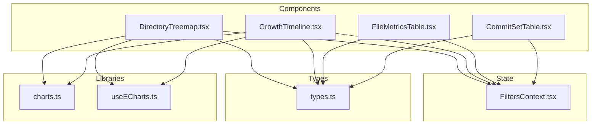
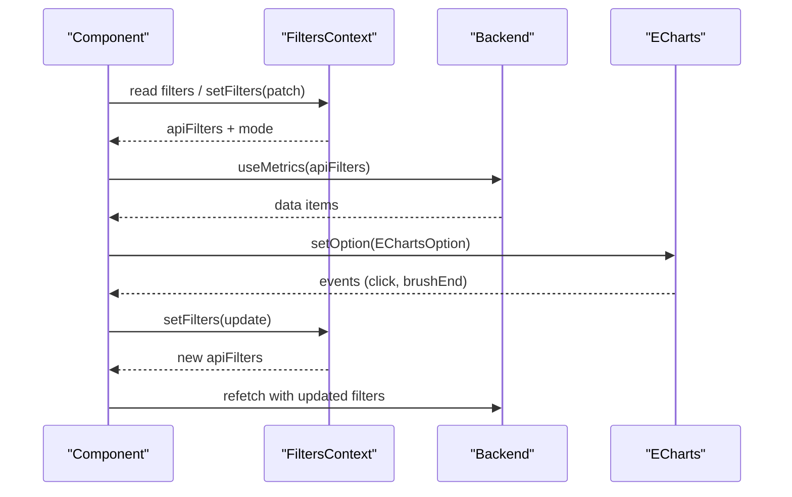
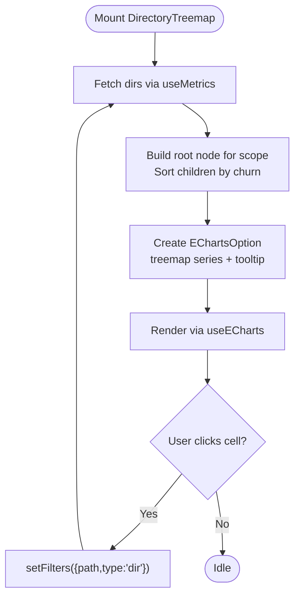
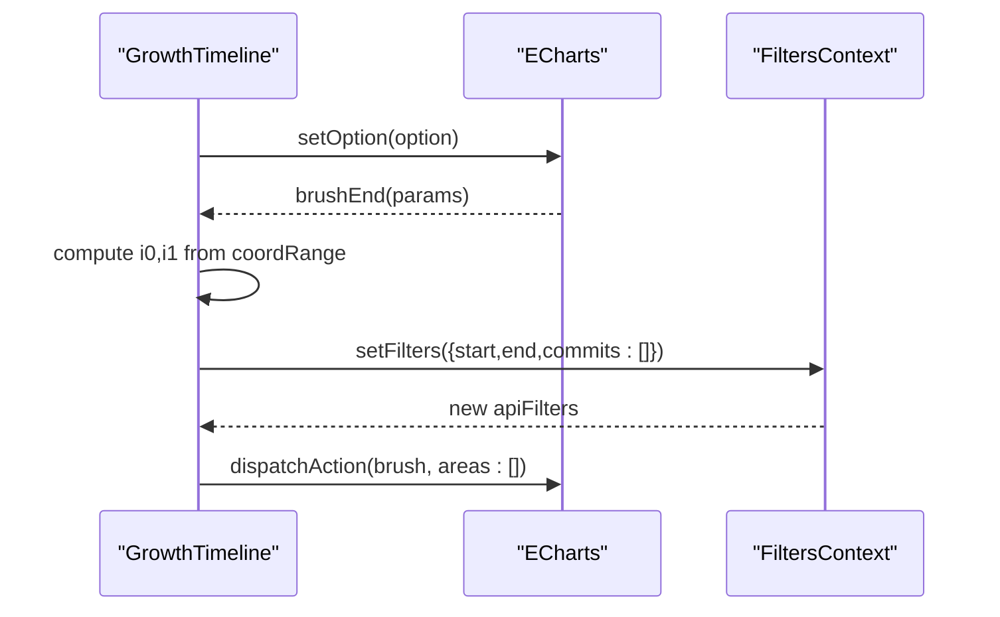
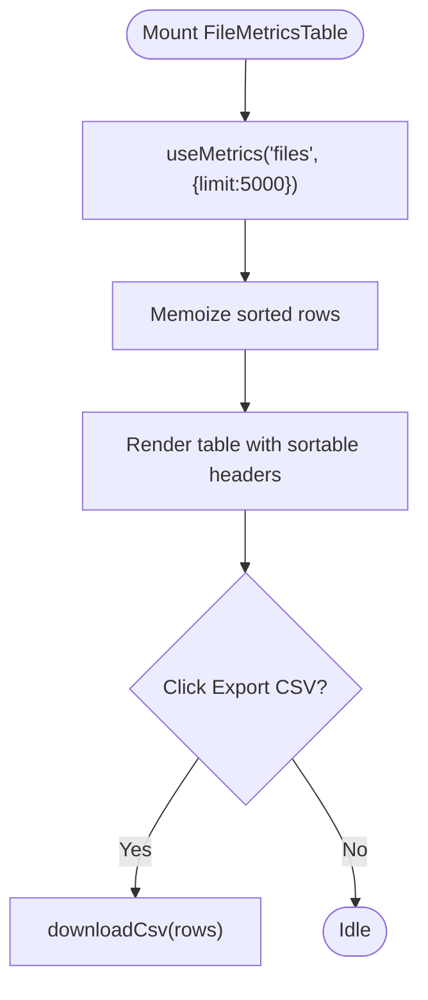
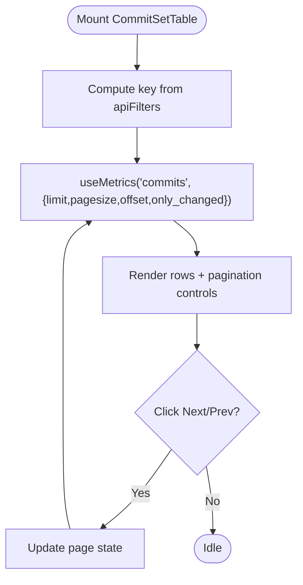
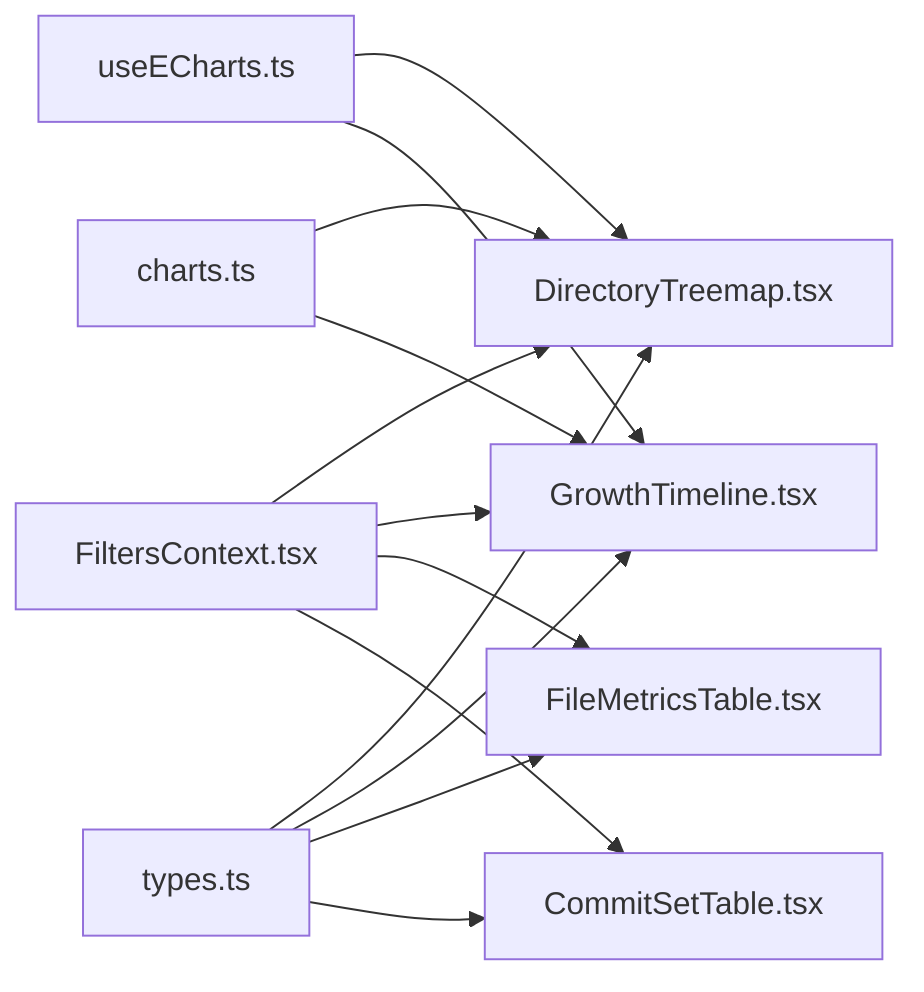

# Data Visualization Components

<cite>
**Referenced Files in This Document**
- [DirectoryTreemap.tsx](file://frontend/src/components/DirectoryTreemap.tsx)
- [GrowthTimeline.tsx](file://frontend/src/components/GrowthTimeline.tsx)
- [FileMetricsTable.tsx](file://frontend/src/components/FileMetricsTable.tsx)
- [CommitSetTable.tsx](file://frontend/src/components/CommitSetTable.tsx)
- [charts.ts](file://frontend/src/lib/charts.ts)
- [useECharts.ts](file://frontend/src/lib/useECharts.ts)
- [FiltersContext.tsx](file://frontend/src/state/FiltersContext.tsx)
- [types.ts](file://frontend/src/types.ts)
</cite>

## Table of Contents
1. [Introduction](#introduction)
2. [Project Structure](#project-structure)
3. [Core Components](#core-components)
4. [Architecture Overview](#architecture-overview)
5. [Detailed Component Analysis](#detailed-component-analysis)
6. [Dependency Analysis](#dependency-analysis)
7. [Performance Considerations](#performance-considerations)
8. [Troubleshooting Guide](#troubleshooting-guide)
9. [Conclusion](#conclusion)

## Introduction
This document explains RAT’s data visualization components: DirectoryTreemap, GrowthTimeline, FileMetricsTable, and CommitSetTable. It covers how each component binds to shared filter state, configures ECharts visualizations, handles user interactions such as brushing and clicking, supports responsive layouts, and optimizes performance for large datasets. It also provides guidance on customizing visuals, integrating with the filtering system, and troubleshooting common issues.

## Project Structure
The visualization layer lives under frontend/src/components and is supported by shared chart utilities, an ECharts React binding hook, a global filter context, and shared TypeScript types.

**Diagram sources**
- [DirectoryTreemap.tsx:1-198](file://frontend/src/components/DirectoryTreemap.tsx#L1-L198)
- [GrowthTimeline.tsx:1-174](file://frontend/src/components/GrowthTimeline.tsx#L1-L174)
- [FileMetricsTable.tsx:1-152](file://frontend/src/components/FileMetricsTable.tsx#L1-L152)
- [CommitSetTable.tsx:1-130](file://frontend/src/components/CommitSetTable.tsx#L1-L130)
- [charts.ts:1-47](file://frontend/src/lib/charts.ts#L1-L47)
- [useECharts.ts:1-55](file://frontend/src/lib/useECharts.ts#L1-L55)
- [FiltersContext.tsx:1-119](file://frontend/src/state/FiltersContext.tsx#L1-L119)
- [types.ts:1-172](file://frontend/src/types.ts#L1-L172)

**Section sources**
- [DirectoryTreemap.tsx:1-198](file://frontend/src/components/DirectoryTreemap.tsx#L1-L198)
- [GrowthTimeline.tsx:1-174](file://frontend/src/components/GrowthTimeline.tsx#L1-L174)
- [FileMetricsTable.tsx:1-152](file://frontend/src/components/FileMetricsTable.tsx#L1-L152)
- [CommitSetTable.tsx:1-130](file://frontend/src/components/CommitSetTable.tsx#L1-L130)
- [charts.ts:1-47](file://frontend/src/lib/charts.ts#L1-L47)
- [useECharts.ts:1-55](file://frontend/src/lib/useECharts.ts#L1-L55)
- [FiltersContext.tsx:1-119](file://frontend/src/state/FiltersContext.tsx#L1-L119)
- [types.ts:1-172](file://frontend/src/types.ts#L1-L172)

## Core Components
- DirectoryTreemap: Visualizes directory churn using an ECharts treemap; color encodes growth; clicking scopes metrics to a directory or switches to a tree view.
- GrowthTimeline: Renders time-series lines (added, removed, growth) per bucket; brush selection updates the dashboard time range; supports internal zooming.
- FileMetricsTable: Displays file-level metrics with client-side sorting and CSV export; integrates with filters to scope results.
- CommitSetTable: Shows paginated commit history for the current filter set, with optional “only changed” filtering relative to the selected object.

All components consume shared filter state via FiltersContext and use useMetrics to fetch data from the backend. Charts are rendered through useECharts, which manages lifecycle, resizing, and event wiring.

**Section sources**
- [DirectoryTreemap.tsx:58-123](file://frontend/src/components/DirectoryTreemap.tsx#L58-L123)
- [GrowthTimeline.tsx:14-135](file://frontend/src/components/GrowthTimeline.tsx#L14-L135)
- [FileMetricsTable.tsx:20-87](file://frontend/src/components/FileMetricsTable.tsx#L20-L87)
- [CommitSetTable.tsx:12-26](file://frontend/src/components/CommitSetTable.tsx#L12-L26)
- [FiltersContext.tsx:70-111](file://frontend/src/state/FiltersContext.tsx#L70-L111)
- [useECharts.ts:9-53](file://frontend/src/lib/useECharts.ts#L9-L53)

## Architecture Overview
The visualization layer follows a unidirectional data flow:
- FiltersContext holds URL-synced filter state and exposes apiFilters to components.
- Components call useMetrics to request data based on apiFilters.
- Chart components build EChartsOption objects and render via useECharts.
- User interactions update FiltersContext, causing downstream re-renders and API calls.

**Diagram sources**
- [FiltersContext.tsx:70-111](file://frontend/src/state/FiltersContext.tsx#L70-L111)
- [DirectoryTreemap.tsx:58-123](file://frontend/src/components/DirectoryTreemap.tsx#L58-L123)
- [GrowthTimeline.tsx:14-135](file://frontend/src/components/GrowthTimeline.tsx#L14-L135)
- [useECharts.ts:9-53](file://frontend/src/lib/useECharts.ts#L9-L53)

## Detailed Component Analysis

### DirectoryTreemap
Purpose
- Hierarchical directory visualization where area represents churn and color represents growth.
- Clicking a cell scopes metrics to that directory; switching between treemap and tree views.

Data Binding
- Reads repoId, apiFilters, filters, and setFilters from FiltersContext.
- Fetches directory metrics via useMetrics("dirs", apiFilters).
- Builds a nested tree rooted at the current scope and sorts children by value.

Chart Configuration
- Uses ECharts treemap series with fixed dimensions, no roam, disabled node click, and truncated labels.
- Tooltip displays path, churn, added/removed, growth, and modifications.
- Colors derived from divergingColor utility based on growth magnitude.

Interactions
- Click handler updates filters to scope to the clicked directory.
- Toggle between treemap and tree views.
- “Up” button navigates to parent directory.

Responsive Design
- Chart container uses percentage width/height; useECharts observes container size changes and resizes the chart automatically.

Performance Optimizations
- Disables animation for faster rendering.
- Memoizes tree building and EChartsOption to avoid unnecessary recomputation.
- Hides breadcrumb and disables roam to reduce interaction overhead.

Customization Examples
- Adjust label overflow behavior or font size in the series.label configuration.
- Change itemStyle border/gapWidth to control spacing between cells.
- Modify tooltip formatter to include additional fields from DirRow.

**Diagram sources**
- [DirectoryTreemap.tsx:26-56](file://frontend/src/components/DirectoryTreemap.tsx#L26-L56)
- [DirectoryTreemap.tsx:76-123](file://frontend/src/components/DirectoryTreemap.tsx#L76-L123)

**Section sources**
- [DirectoryTreemap.tsx:1-198](file://frontend/src/components/DirectoryTreemap.tsx#L1-L198)
- [charts.ts:35-46](file://frontend/src/lib/charts.ts#L35-L46)

### GrowthTimeline
Purpose
- Time-series chart showing added, removed, and growth per time bucket.
- Brushing sets the dashboard time range (H_i,j); internal zooming allows exploration.

Data Binding
- Reads repoId, apiFilters, filters, setFilters, and mode from FiltersContext.
- Fetches timeseries data via useMetrics("timeseries", apiFilters).
- Derives buckets array for the x-axis.

Chart Configuration
- Line series for added, removed (negative), and growth (dashed).
- Shared axisBase and tooltipBase for consistent styling.
- toolbox.brush configured for horizontal line selection; brush settings debounce updates.
- dataZoom inside enables mouse wheel/trackpad zoom along the x-axis.

Interactions
- brushEnd maps selected coordinate range to start/end dates and clears the brush visually.
- Clear range button resets filters and removes brush areas.
- Legend toggles series visibility.

Responsive Design
- Grid margins accommodate legend and axes; useECharts auto-resizes on container change.

Performance Optimizations
- Disables animation.
- Debounces brush updates to limit frequent filter updates.
- Memoizes option construction based on items, buckets, and granularity.

Customization Examples
- Add more series by mapping additional fields from TimeseriesPoint.
- Customize brush colors and titles in toolbox.feature.brush.
- Adjust axisLabel.formatter to show different date formats based on granularity.

**Diagram sources**
- [GrowthTimeline.tsx:25-116](file://frontend/src/components/GrowthTimeline.tsx#L25-L116)
- [GrowthTimeline.tsx:118-143](file://frontend/src/components/GrowthTimeline.tsx#L118-L143)

**Section sources**
- [GrowthTimeline.tsx:1-174](file://frontend/src/components/GrowthTimeline.tsx#L1-L174)
- [charts.ts:3-33](file://frontend/src/lib/charts.ts#L3-L33)

### FileMetricsTable
Purpose
- Displays per-file metrics with client-side sorting and CSV export.

Data Binding
- Reads repoId and apiFilters from FiltersContext.
- Fetches files via useMetrics("files", apiFilters with limit=5000).

Sorting and Filtering
- Client-side sort by any numeric or string column; default sort direction is descending except for path.
- Sorting state is local to the component; no server-side filtering is implemented here.

Export
- Exports current sorted rows to CSV with formatted rates.

Responsive Design
- Table wrapper and ellipsis styles ensure long paths remain readable.

Performance Optimizations
- useMemo computes sorted rows only when data or sort keys change.
- Limiting API response to 5000 rows prevents overwhelming the UI.

Customization Examples
- Add additional columns by extending SortKey and th() calls.
- Integrate a search/filter input that slices rows before sorting.

**Diagram sources**
- [FileMetricsTable.tsx:20-40](file://frontend/src/components/FileMetricsTable.tsx#L20-L40)
- [FileMetricsTable.tsx:62-87](file://frontend/src/components/FileMetricsTable.tsx#L62-L87)

**Section sources**
- [FileMetricsTable.tsx:1-152](file://frontend/src/components/FileMetricsTable.tsx#L1-L152)

### CommitSetTable
Purpose
- Paginated list of commits in the current filter set, optionally restricted to those touching the selected object.

Data Binding
- Reads repoId, apiFilters, and filters from FiltersContext.
- Fetches commits via useMetrics("commits", apiFilters with pagination and only_changed flag).

Pagination
- PAGE_SIZE = 50; page state controls offset.
- Resets to page 0 when filters or onlyChanged toggle changes.

Interactions
- Checkbox toggles only_changed to refine the commit set.
- Navigation buttons move between pages with disabled states based on bounds.

Responsive Design
- Ellipsis and max-width styles keep long subjects and authors readable.

Performance Optimizations
- Pagination reduces payload size.
- Only fetches when filters or onlyChanged changes due to useEffect dependency.

Customization Examples
- Increase PAGE_SIZE for fewer round trips if the backend supports it.
- Add client-side search over subject or author.

**Diagram sources**
- [CommitSetTable.tsx:12-26](file://frontend/src/components/CommitSetTable.tsx#L12-L26)
- [CommitSetTable.tsx:97-123](file://frontend/src/components/CommitSetTable.tsx#L97-L123)

**Section sources**
- [CommitSetTable.tsx:1-130](file://frontend/src/components/CommitSetTable.tsx#L1-L130)

## Dependency Analysis
Shared dependencies across components:
- FiltersContext: Centralized filter state synced to URL; provides apiFilters and mode.
- useECharts: ECharts lifecycle management, resize observation, and event wiring.
- charts: Shared palette, axis defaults, tooltip base, and diverging color helper.
- types: Strongly typed contracts for API responses and filters.

**Diagram sources**
- [FiltersContext.tsx:70-111](file://frontend/src/state/FiltersContext.tsx#L70-L111)
- [useECharts.ts:9-53](file://frontend/src/lib/useECharts.ts#L9-L53)
- [charts.ts:1-47](file://frontend/src/lib/charts.ts#L1-L47)
- [types.ts:76-172](file://frontend/src/types.ts#L76-L172)
- [DirectoryTreemap.tsx:1-198](file://frontend/src/components/DirectoryTreemap.tsx#L1-L198)
- [GrowthTimeline.tsx:1-174](file://frontend/src/components/GrowthTimeline.tsx#L1-L174)
- [FileMetricsTable.tsx:1-152](file://frontend/src/components/FileMetricsTable.tsx#L1-L152)
- [CommitSetTable.tsx:1-130](file://frontend/src/components/CommitSetTable.tsx#L1-L130)

**Section sources**
- [FiltersContext.tsx:1-119](file://frontend/src/state/FiltersContext.tsx#L1-L119)
- [useECharts.ts:1-55](file://frontend/src/lib/useECharts.ts#L1-L55)
- [charts.ts:1-47](file://frontend/src/lib/charts.ts#L1-L47)
- [types.ts:1-172](file://frontend/src/types.ts#L1-L172)

## Performance Considerations
- Disable animations for heavy charts to improve initial render speed.
- Use memoization (useMemo) for expensive computations like tree building and chart options.
- Debounce interactive events (e.g., brush) to reduce excessive filter updates.
- Paginate large lists (CommitSetTable) and cap API limits (FileMetricsTable).
- Leverage ResizeObserver-based auto-resizing to avoid manual resize logic.
- Avoid unnecessary re-renders by keeping stable option references and minimal state updates.

[No sources needed since this section provides general guidance]

## Troubleshooting Guide
Common issues and resolutions:
- Chart not resizing: Ensure the container div mounts before initialization; useECharts handles ResizeObserver but requires a valid DOM element.
- Brush does not update filters: Verify brushEnd handler receives coordRange and that buckets length is non-zero; check throttleDelay and debounce settings.
- Treemap shows empty: Confirm the current scope exists in the dataset; if a file is selected, the treemap is intentionally hidden.
- Table appears blank: Check loading/error states and whether the API returned items; verify limit and offset parameters.
- Filter state not reflected in URL: Ensure setFilters is called with partial updates and that FiltersProvider wraps the app.

**Section sources**
- [useECharts.ts:16-37](file://frontend/src/lib/useECharts.ts#L16-L37)
- [GrowthTimeline.tsx:118-135](file://frontend/src/components/GrowthTimeline.tsx#L118-L135)
- [DirectoryTreemap.tsx:166-191](file://frontend/src/components/DirectoryTreemap.tsx#L166-L191)
- [FileMetricsTable.tsx:107-147](file://frontend/src/components/FileMetricsTable.tsx#L107-L147)
- [CommitSetTable.tsx:53-63](file://frontend/src/components/CommitSetTable.tsx#L53-L63)
- [FiltersContext.tsx:80-85](file://frontend/src/state/FiltersContext.tsx#L80-L85)

## Conclusion
RAT’s visualization components provide a cohesive, filter-driven experience for exploring repository metrics. DirectoryTreemap offers hierarchical insights with interactive scoping, GrowthTimeline enables time-range selection through brushing, FileMetricsTable delivers sortable file-level metrics with export capabilities, and CommitSetTable presents paginated commit histories. All components integrate tightly with FiltersContext for shareable state, leverage useECharts for robust chart lifecycle management, and apply practical optimizations for large datasets. Customization points are exposed through ECharts options, shared chart utilities, and filter state patches, enabling flexible adaptation to diverse analytical needs.