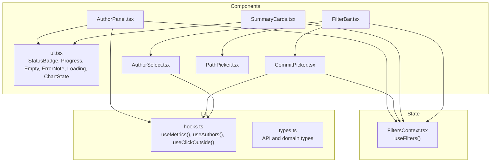
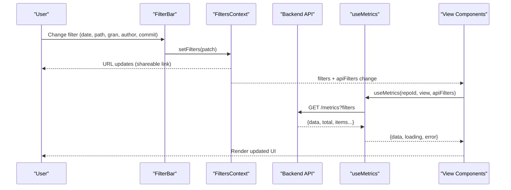
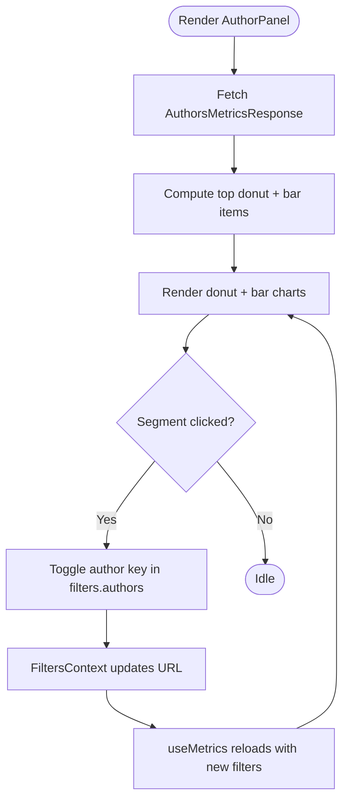
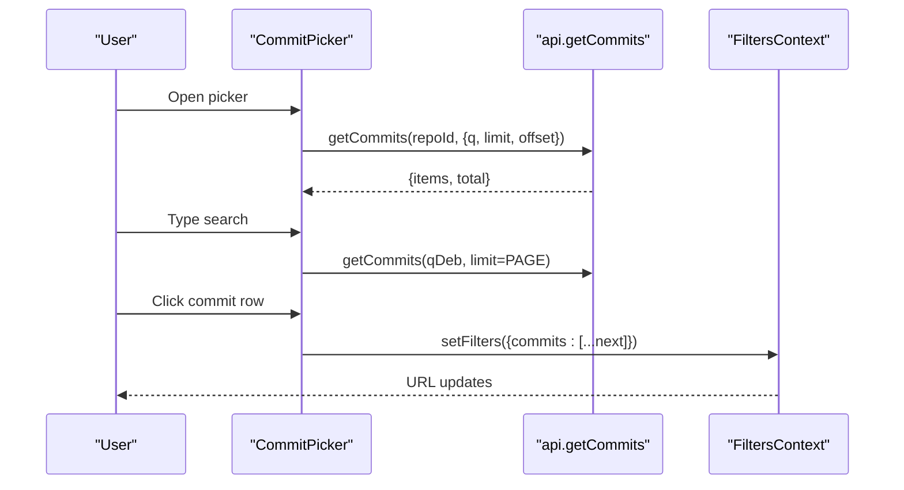
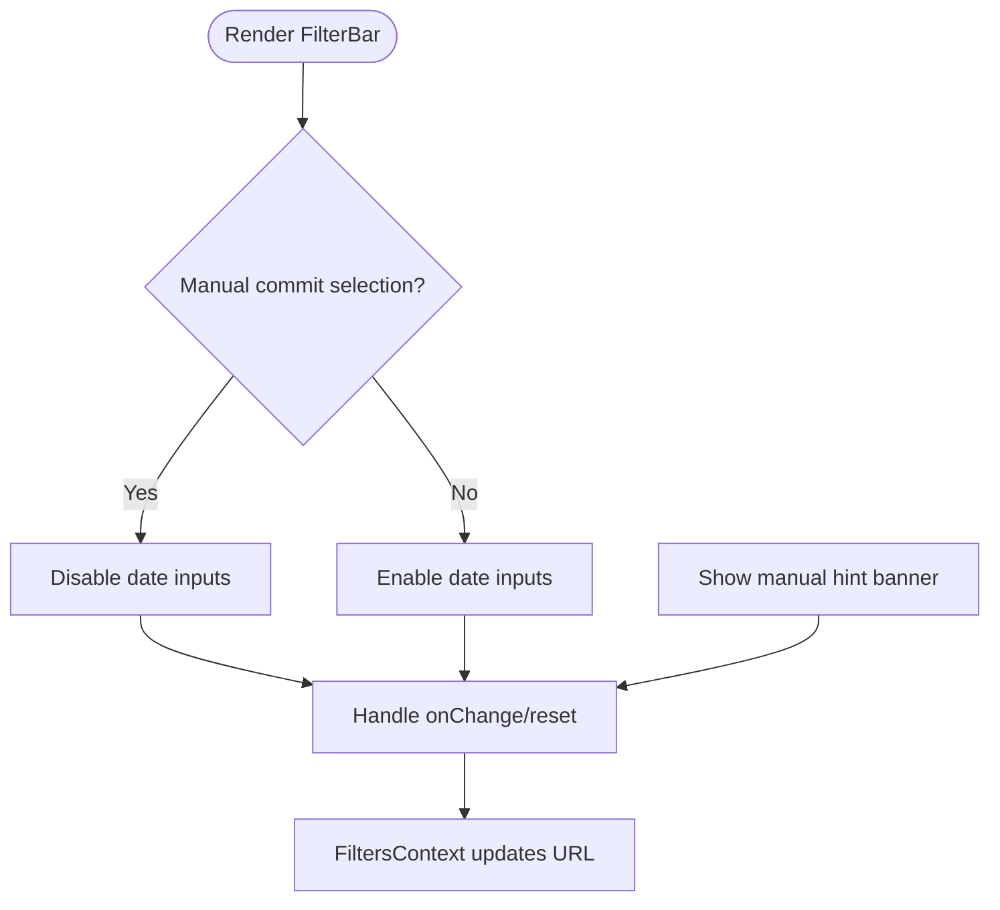
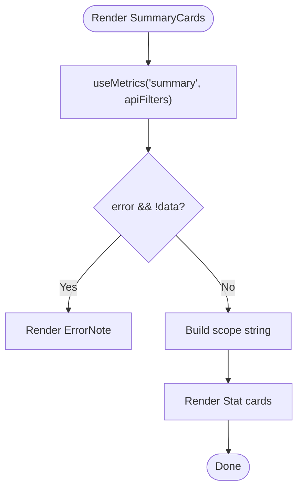
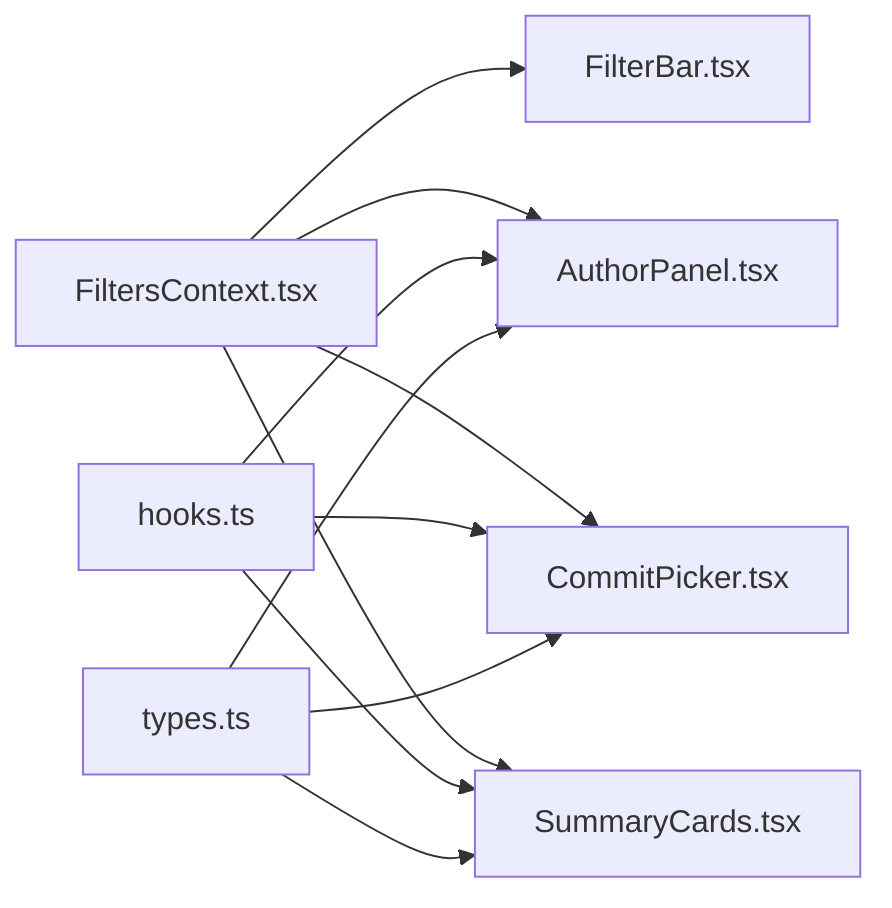

# Reusable UI Components

<cite>
**Referenced Files in This Document**
- [ui.tsx](file://frontend/src/components/ui.tsx)
- [AuthorPanel.tsx](file://frontend/src/components/AuthorPanel.tsx)
- [CommitPicker.tsx](file://frontend/src/components/CommitPicker.tsx)
- [FilterBar.tsx](file://frontend/src/components/FilterBar.tsx)
- [SummaryCards.tsx](file://frontend/src/components/SummaryCards.tsx)
- [FiltersContext.tsx](file://frontend/src/state/FiltersContext.tsx)
- [hooks.ts](file://frontend/src/lib/hooks.ts)
- [types.ts](file://frontend/src/types.ts)
- [AuthorSelect.tsx](file://frontend/src/components/AuthorSelect.tsx)
- [PathPicker.tsx](file://frontend/src/components/PathPicker.tsx)
</cite>

## Table of Contents
1. [Introduction](#introduction)
2. [Project Structure](#project-structure)
3. [Core Components](#core-components)
4. [Architecture Overview](#architecture-overview)
5. [Detailed Component Analysis](#detailed-component-analysis)
6. [Dependency Analysis](#dependency-analysis)
7. [Performance Considerations](#performance-considerations)
8. [Troubleshooting Guide](#troubleshooting-guide)
9. [Conclusion](#conclusion)

## Introduction
This document describes the reusable UI components that power RAT’s dashboard and analytics views. It focuses on:
- Foundational primitives in ui.tsx for status, progress, empty/error states, and chart overlays
- AuthorPanel for author ownership visualization and filtering
- CommitPicker for manual commit selection with search and pagination
- FilterBar as the central filter control surface
- SummaryCards for aggregated statistics over the selected commit set

It explains component props, event handling patterns, styling approach, accessibility considerations, and how these components integrate with application state via FiltersContext and data hooks.

## Project Structure
The frontend organizes reusable UI under src/components, shared state under src/state, data-fetching utilities under src/lib, and type contracts under src/types. The components discussed here compose together to form the main dashboard experience.

**Diagram sources**
- [ui.tsx:5-64](file://frontend/src/components/ui.tsx#L5-L64)
- [AuthorPanel.tsx:13-198](file://frontend/src/components/AuthorPanel.tsx#L13-L198)
- [CommitPicker.tsx:14-160](file://frontend/src/components/CommitPicker.tsx#L14-L160)
- [FilterBar.tsx:9-92](file://frontend/src/components/FilterBar.tsx#L9-L92)
- [SummaryCards.tsx:34-83](file://frontend/src/components/SummaryCards.tsx#L34-L83)
- [FiltersContext.tsx:14-118](file://frontend/src/state/FiltersContext.tsx#L14-L118)
- [hooks.ts:53-141](file://frontend/src/lib/hooks.ts#L53-L141)
- [types.ts:76-171](file://frontend/src/types.ts#L76-L171)

**Section sources**
- [ui.tsx:1-65](file://frontend/src/components/ui.tsx#L1-L65)
- [AuthorPanel.tsx:1-199](file://frontend/src/components/AuthorPanel.tsx#L1-L199)
- [CommitPicker.tsx:1-162](file://frontend/src/components/CommitPicker.tsx#L1-L162)
- [FilterBar.tsx:1-93](file://frontend/src/components/FilterBar.tsx#L1-L93)
- [SummaryCards.tsx:1-84](file://frontend/src/components/SummaryCards.tsx#L1-L84)
- [FiltersContext.tsx:1-119](file://frontend/src/state/FiltersContext.tsx#L1-L119)
- [hooks.ts:1-142](file://frontend/src/lib/hooks.ts#L1-L142)
- [types.ts:1-172](file://frontend/src/types.ts#L1-L172)

## Core Components
This section summarizes each component’s purpose, props, behavior, and integration points.

- ui.tsx
  - Provides small presentational primitives: StatusBadge, Progress, Empty, ErrorNote, Loading, and ChartState.
  - ChartState composes loading, error, and empty overlays while keeping chart children mounted to avoid expensive reinitialization.
  - Styling is class-based; no inline style logic beyond minimal sizing.

- AuthorPanel.tsx
  - Displays an ownership donut and a top-modifications bar for authors.
  - Clicking segments toggles author filters via FiltersContext.
  - Uses useMetrics for AuthorsMetricsResponse and useECharts for rendering charts.

- CommitPicker.tsx
  - Searchable, paged multi-select for commits.
  - Selected SHAs override time range (manual mode).
  - Debounced search, load-more pagination up to a window limit, and clear actions.

- FilterBar.tsx
  - Central control panel combining PathPicker, date range inputs, granularity selector, AuthorSelect, and CommitPicker.
  - Shows a hint when manual commit selection is active and provides reset/clear actions.

- SummaryCards.tsx
  - Renders seven commit-set metrics plus |H| using Stat cards.
  - Uses useMetrics for SummaryResponse and shows skeletons during loading.

**Section sources**
- [ui.tsx:5-64](file://frontend/src/components/ui.tsx#L5-L64)
- [AuthorPanel.tsx:13-198](file://frontend/src/components/AuthorPanel.tsx#L13-L198)
- [CommitPicker.tsx:14-160](file://frontend/src/components/CommitPicker.tsx#L14-L160)
- [FilterBar.tsx:9-92](file://frontend/src/components/FilterBar.tsx#L9-L92)
- [SummaryCards.tsx:34-83](file://frontend/src/components/SummaryCards.tsx#L34-L83)

## Architecture Overview
The components follow a unidirectional data flow:
- User interactions update FiltersContext via setFilters.
- FiltersContext serializes state to URL query parameters and exposes apiFilters to downstream consumers.
- Data hooks like useMetrics fetch backend metrics based on repoId and apiFilters.
- Presentational components render results and provide interactive controls.

**Diagram sources**
- [FilterBar.tsx:9-92](file://frontend/src/components/FilterBar.tsx#L9-L92)
- [FiltersContext.tsx:70-111](file://frontend/src/state/FiltersContext.tsx#L70-L111)
- [hooks.ts:53-99](file://frontend/src/lib/hooks.ts#L53-L99)

## Detailed Component Analysis

### Foundational Primitives (ui.tsx)
- StatusBadge(status): renders a colored badge reflecting RepoStatus.
- Progress(value): clamps value to [0,1] and renders a width-based progress bar.
- Empty(children), ErrorNote(children), Loading(label): semantic containers for common states.
- ChartState({loading, error, empty, emptyMessage, children}): overlays error/loading/empty messages above chart children without unmounting them.

Props interfaces:
- StatusBadge: status: RepoStatus
- Progress: value: number
- Empty/ErrorNote/Loading: children or label
- ChartState: boolean flags and optional message plus children

Event handling: none directly; delegates to parent.

Styling: CSS classes such as badge, pos/neg/warn, progress, empty, error-note, spinner, chart-state, chart-overlay.

Accessibility:
- Progress uses title for percentage.
- Loading includes visible text label.
- ChartState keeps underlying chart accessible by not detaching it.

Usage examples:
- Wrap chart content with ChartState to handle loading/error/empty consistently.
- Use Progress to visualize repository ingestion status.
- Display RepoStatus via StatusBadge.

**Section sources**
- [ui.tsx:5-64](file://frontend/src/components/ui.tsx#L5-L64)
- [types.ts:5-11](file://frontend/src/types.ts#L5-L11)

### AuthorPanel
Purpose:
- Visualize author ownership distribution and top modifications.
- Allow clicking chart segments to toggle author filters.

Key behaviors:
- Aggregates “Other” group when more than eight authors exist.
- Sorts items for donut (ownership) and bar (modifications).
- Toggles author keys in FiltersContext on click.

Data flow:
- Fetches AuthorsMetricsResponse via useMetrics(repoId, "authors", apiFilters).
- Composes ECharts options for pie and horizontal bar.
- Binds click handlers to toggle author selection.

Props: none (reads from context).

Event handling:
- Click on donut/bar segment toggles author key in filters.authors.
- Clear button resets authors filter.

Styling:
- Card layout with header/body.
- Chart wrappers with fixed heights.

Accessibility:
- Uses semantic section/header elements.
- Buttons have descriptive labels.
- Tooltip formatting provides numeric details.

**Diagram sources**
- [AuthorPanel.tsx:13-198](file://frontend/src/components/AuthorPanel.tsx#L13-L198)
- [FiltersContext.tsx:80-104](file://frontend/src/state/FiltersContext.tsx#L80-L104)

**Section sources**
- [AuthorPanel.tsx:13-198](file://frontend/src/components/AuthorPanel.tsx#L13-L198)
- [hooks.ts:53-99](file://frontend/src/lib/hooks.ts#L53-L99)
- [types.ts:123-136](file://frontend/src/types.ts#L123-L136)

### CommitPicker
Purpose:
- Provide a searchable, paginated list of commits for manual selection.
- When commits are selected, they define the commit set H, overriding time range.

Key behaviors:
- Debounced search input.
- Paginated results with “Load more” up to MAX_WINDOW.
- Multi-select with checkbox-like rows.
- Clear selection and close-on-outside-click.

Props: none (reads from context).

Event handling:
- Open/close picker via button.
- Toggle individual commit SHA in filters.commits.
- Clear selection resets filters.commits.
- Escape closes popover.

Styling:
- Field wrapper with popover overlay.
- Option rows with selected state.
- Footer with counts and actions.

Accessibility:
- Label associates with the control.
- Input placeholder guides search.
- Keyboard support for Escape.

**Diagram sources**
- [CommitPicker.tsx:14-160](file://frontend/src/components/CommitPicker.tsx#L14-L160)
- [FiltersContext.tsx:80-104](file://frontend/src/state/FiltersContext.tsx#L80-L104)

**Section sources**
- [CommitPicker.tsx:14-160](file://frontend/src/components/CommitPicker.tsx#L14-L160)
- [hooks.ts:127-141](file://frontend/src/lib/hooks.ts#L127-L141)
- [types.ts:52-64](file://frontend/src/types.ts#L52-L64)

### FilterBar
Purpose:
- Aggregate all user-facing filters into one card.
- Coordinate between PathPicker, date range inputs, granularity selector, AuthorSelect, and CommitPicker.

Key behaviors:
- Disables date inputs when manual commit selection is active.
- Computes whether filters are at default values to disable “Clear all”.
- Shows a hint banner when manual mode is active.

Props: none (reads from context).

Event handling:
- Date inputs update start/end and clear commits.
- Granularity selector updates gran.
- AuthorSelect and CommitPicker update their respective arrays.
- Reset clears all filters.

Styling:
- Card container with filter-bar layout.
- Hint banner with badge and action.

Accessibility:
- Labels for inputs.
- Titles explain behavior when manual mode is active.

**Diagram sources**
- [FilterBar.tsx:9-92](file://frontend/src/components/FilterBar.tsx#L9-L92)
- [FiltersContext.tsx:91-104](file://frontend/src/state/FiltersContext.tsx#L91-L104)

**Section sources**
- [FilterBar.tsx:9-92](file://frontend/src/components/FilterBar.tsx#L9-L92)
- [AuthorSelect.tsx:42-152](file://frontend/src/components/AuthorSelect.tsx#L42-L152)
- [CommitPicker.tsx:14-160](file://frontend/src/components/CommitPicker.tsx#L14-L160)
- [PathPicker.tsx:9-126](file://frontend/src/components/PathPicker.tsx#L9-L126)

### SummaryCards
Purpose:
- Display aggregated commit-set metrics: added, removed, growth, churn, modifications, modification frequency, churn rate, and commit count.

Key behaviors:
- Reads SummaryResponse via useMetrics(repoId, "summary", apiFilters).
- Shows skeleton placeholders while loading.
- Highlights negative growth.
- Indicates scope and mode in footnotes.

Props: none (reads from context).

Event handling: none directly.

Styling:
- Grid of stat cards with labels, values, and footnotes.
- Skeleton animation for loading state.

Accessibility:
- Semantic structure with labels and footnotes.
- Color-coded values for positive/negative indicators.

**Diagram sources**
- [SummaryCards.tsx:34-83](file://frontend/src/components/SummaryCards.tsx#L34-L83)
- [hooks.ts:53-99](file://frontend/src/lib/hooks.ts#L53-L99)

**Section sources**
- [SummaryCards.tsx:34-83](file://frontend/src/components/SummaryCards.tsx#L34-L83)
- [types.ts:99-102](file://frontend/src/types.ts#L99-L102)

## Dependency Analysis
Component relationships and coupling:
- All components except ui.tsx depend on FiltersContext for state and apiFilters.
- AuthorPanel and SummaryCards depend on useMetrics for data fetching.
- CommitPicker depends on api.getCommits and useClickOutside.
- FilterBar composes PathPicker, AuthorSelect, and CommitPicker.

External dependencies:
- ECharts via useECharts hook (used by AuthorPanel).
- React Router’s useSearchParams via FiltersContext.

Potential circular dependencies:
- None observed among the analyzed files.

Integration points:
- FiltersContext acts as the single source of truth for filters and URL sync.
- useMetrics abstracts network calls and debouncing for metrics endpoints.

**Diagram sources**
- [FiltersContext.tsx:70-111](file://frontend/src/state/FiltersContext.tsx#L70-L111)
- [hooks.ts:53-141](file://frontend/src/lib/hooks.ts#L53-L141)
- [types.ts:76-171](file://frontend/src/types.ts#L76-L171)

**Section sources**
- [FiltersContext.tsx:14-118](file://frontend/src/state/FiltersContext.tsx#L14-L118)
- [hooks.ts:53-141](file://frontend/src/lib/hooks.ts#L53-L141)
- [types.ts:76-171](file://frontend/src/types.ts#L76-L171)

## Performance Considerations
- Debouncing:
  - useMetrics debounces filter changes to reduce redundant requests.
  - CommitPicker and PathPicker debounce search input to limit API calls.
- Pagination:
  - CommitPicker loads up to a maximum window size to balance UX and performance.
- Chart stability:
  - ChartState avoids unmounting chart children to prevent costly reinitialization.
- Memoization:
  - AuthorPanel memoizes derived datasets for donut and bar charts.
- Stale data handling:
  - useMetrics retains previous data while a new request is in flight to avoid flashing empty states.

[No sources needed since this section provides general guidance]

## Troubleshooting Guide
Common issues and resolutions:
- No data displayed:
  - Verify FiltersContext is provided and URL params parse correctly.
  - Check useMetrics enabled flag and repoId validity.
- Charts not updating:
  - Ensure ChartState wraps chart elements so they remain mounted.
  - Confirm click handlers pass correct data keys to toggle filters.
- Manual selection overrides time range:
  - If dates appear disabled, confirm manual commit selection is active; clear commits to restore time range.
- Popover not closing:
  - Ensure useClickOutside ref is attached to the wrapper element.

**Section sources**
- [FiltersContext.tsx:24-41](file://frontend/src/state/FiltersContext.tsx#L24-L41)
- [hooks.ts:53-99](file://frontend/src/lib/hooks.ts#L53-L99)
- [ui.tsx:36-64](file://frontend/src/components/ui.tsx#L36-L64)
- [CommitPicker.tsx:91-158](file://frontend/src/components/CommitPicker.tsx#L91-L158)

## Conclusion
RAT’s reusable UI components provide a cohesive, state-driven dashboard experience. Foundational primitives standardize presentation, while AuthorPanel, CommitPicker, FilterBar, and SummaryCards compose to deliver powerful filtering and visualization. Integration through FiltersContext ensures shareable URLs and consistent state across the app. Following the documented patterns will help extend the UI with new features while maintaining clarity, performance, and accessibility.

[No sources needed since this section summarizes without analyzing specific files]