# Frontend Documentation

<cite>
**Referenced Files in This Document**
- [main.tsx](file://frontend/src/main.tsx)
- [App.tsx](file://frontend/src/App.tsx)
- [api.ts](file://frontend/src/api.ts)
- [types.ts](file://frontend/src/types.ts)
- [vite.config.ts](file://frontend/vite.config.ts)
- [package.json](file://frontend/package.json)
- [FiltersContext.tsx](file://frontend/src/state/FiltersContext.tsx)
- [ToastContext.tsx](file://frontend/src/state/ToastContext.tsx)
- [NavBar.tsx](file://frontend/src/components/NavBar.tsx)
- [DashboardPage.tsx](file://frontend/src/pages/DashboardPage.tsx)
- [AuthorsPage.tsx](file://frontend/src/pages/AuthorsPage.tsx)
- [ReposPage.tsx](file://frontend/src/pages/ReposPage.tsx)
- [FilterBar.tsx](file://frontend/src/components/FilterBar.tsx)
- [SummaryCards.tsx](file://frontend/src/components/SummaryCards.tsx)
- [GrowthTimeline.tsx](file://frontend/src/components/GrowthTimeline.tsx)
- [DirectoryTreemap.tsx](file://frontend/src/components/DirectoryTreemap.tsx)
- [FileMetricsTable.tsx](file://frontend/src/components/FileMetricsTable.tsx)
- [CommitSetTable.tsx](file://frontend/src/components/CommitSetTable.tsx)
</cite>

## Table of Contents
1. [Introduction](#introduction)
2. [Project Structure](#project-structure)
3. [Core Components](#core-components)
4. [Architecture Overview](#architecture-overview)
5. [Detailed Component Analysis](#detailed-component-analysis)
6. [Dependency Analysis](#dependency-analysis)
7. [Performance Considerations](#performance-considerations)
8. [Troubleshooting Guide](#troubleshooting-guide)
9. [Conclusion](#conclusion)

## Introduction
This document describes the frontend of RAT, a React 18 + TypeScript application built with Vite and ECharts. It explains the component architecture, routing, state management via context providers, API client integration, data flows, visualization components, responsive design patterns, user interaction flows, build configuration, development workflow, and performance optimizations.

## Project Structure
The frontend is organized by feature layers:
- Entry point and app shell: main entry, global providers, and router setup
- Pages: top-level views for repositories, dashboard, and authors
- Components: reusable UI pieces (charts, tables, filters, navigation)
- State: shared contexts for filters and toasts
- Library: utilities for formatting, time, CSV export, hooks, and ECharts helpers
- Types: shared TypeScript interfaces mirroring backend schemas
- Build: Vite configuration and package metadata

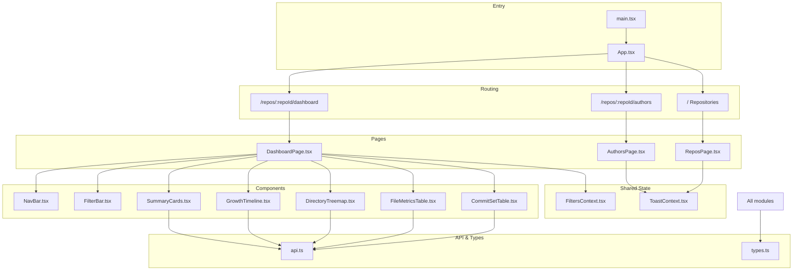

**Diagram sources**
- [main.tsx:1-14](file://frontend/src/main.tsx#L1-L14)
- [App.tsx:1-38](file://frontend/src/App.tsx#L1-L38)
- [ReposPage.tsx:1-287](file://frontend/src/pages/ReposPage.tsx#L1-L287)
- [DashboardPage.tsx:1-95](file://frontend/src/pages/DashboardPage.tsx#L1-L95)
- [AuthorsPage.tsx:1-312](file://frontend/src/pages/AuthorsPage.tsx#L1-L312)
- [FiltersContext.tsx:1-119](file://frontend/src/state/FiltersContext.tsx#L1-L119)
- [ToastContext.tsx:1-48](file://frontend/src/state/ToastContext.tsx#L1-L48)
- [NavBar.tsx:1-53](file://frontend/src/components/NavBar.tsx#L1-L53)
- [FilterBar.tsx:1-93](file://frontend/src/components/FilterBar.tsx#L1-L93)
- [SummaryCards.tsx:1-84](file://frontend/src/components/SummaryCards.tsx#L1-L84)
- [GrowthTimeline.tsx:1-167](file://frontend/src/components/GrowthTimeline.tsx#L1-L167)
- [DirectoryTreemap.tsx:1-167](file://frontend/src/components/DirectoryTreemap.tsx#L1-L167)
- [FileMetricsTable.tsx:1-152](file://frontend/src/components/FileMetricsTable.tsx#L1-L152)
- [CommitSetTable.tsx:1-130](file://frontend/src/components/CommitSetTable.tsx#L1-L130)
- [api.ts:1-127](file://frontend/src/api.ts#L1-L127)
- [types.ts:1-172](file://frontend/src/types.ts#L1-L172)

**Section sources**
- [main.tsx:1-14](file://frontend/src/main.tsx#L1-L14)
- [App.tsx:1-38](file://frontend/src/App.tsx#L1-L38)
- [package.json:1-25](file://frontend/package.json#L1-L25)

## Core Components
- App shell and routing:
  - Wraps the app in BrowserRouter, ToastProvider, and defines routes for repositories, per-repo dashboard, and authors. The dashboard route validates repoId and wraps DashboardPage with FiltersProvider.
- Pages:
  - ReposPage: repository list, upload/clone/delete, progress polling, navigation to repo pages.
  - DashboardPage: orchestrates filter bar, summary cards, growth timeline, directory treemap, author panel, file metrics table, and commit set table.
  - AuthorsPage: identity merging UI with merge/unmerge operations and toast feedback.
- Shared state:
  - FiltersContext: URL-synced filter state (time range, manual commits, authors, path/object type, granularity), mode derivation, and conversion to backend MetricsFilters.
  - ToastContext: simple notification system with auto-dismiss.
- API client:
  - Typed fetch wrapper with ApiError, JSON helper, and endpoints for repos, authors, commits/paths, and metrics views.
- Visualization:
  - GrowthTimeline: ECharts line chart with brush-to-set-time-range.
  - DirectoryTreemap: ECharts treemap for directory churn/growth; click to scope.
  - SummaryCards: aggregate metrics display.
  - FileMetricsTable: sortable table with CSV export.
  - CommitSetTable: paged commit list with optional “only changed” filter.
- Utilities:
  - Formatting, time helpers, CSV download, ECharts hook, charts color/tooltip bases.

**Section sources**
- [App.tsx:1-38](file://frontend/src/App.tsx#L1-L38)
- [ReposPage.tsx:1-287](file://frontend/src/pages/ReposPage.tsx#L1-L287)
- [DashboardPage.tsx:1-95](file://frontend/src/pages/DashboardPage.tsx#L1-L95)
- [AuthorsPage.tsx:1-312](file://frontend/src/pages/AuthorsPage.tsx#L1-L312)
- [FiltersContext.tsx:1-119](file://frontend/src/state/FiltersContext.tsx#L1-L119)
- [ToastContext.tsx:1-48](file://frontend/src/state/ToastContext.tsx#L1-L48)
- [api.ts:1-127](file://frontend/src/api.ts#L1-L127)
- [SummaryCards.tsx:1-84](file://frontend/src/components/SummaryCards.tsx#L1-L84)
- [GrowthTimeline.tsx:1-167](file://frontend/src/components/GrowthTimeline.tsx#L1-L167)
- [DirectoryTreemap.tsx:1-167](file://frontend/src/components/DirectoryTreemap.tsx#L1-L167)
- [FileMetricsTable.tsx:1-152](file://frontend/src/components/FileMetricsTable.tsx#L1-L152)
- [CommitSetTable.tsx:1-130](file://frontend/src/components/CommitSetTable.tsx#L1-L130)

## Architecture Overview
The application follows a layered architecture:
- Presentation layer: Pages compose multiple components to render dashboards and workflows.
- State layer: Contexts provide cross-cutting concerns (filters, toasts).
- Data layer: api.ts encapsulates HTTP calls and error handling.
- Types layer: types.ts mirrors backend contracts.

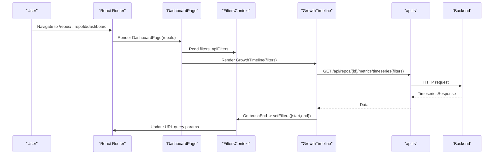

**Diagram sources**
- [App.tsx:10-31](file://frontend/src/App.tsx#L10-L31)
- [DashboardPage.tsx:17-95](file://frontend/src/pages/DashboardPage.tsx#L17-L95)
- [GrowthTimeline.tsx:14-167](file://frontend/src/components/GrowthTimeline.tsx#L14-L167)
- [FiltersContext.tsx:70-119](file://frontend/src/state/FiltersContext.tsx#L70-L119)
- [api.ts:107-123](file://frontend/src/api.ts#L107-L123)

## Detailed Component Analysis

### Routing and App Shell
- Routes:
  - `/` → Repositories page
  - `/repos/:repoId/dashboard` → Dashboard page wrapped with FiltersProvider
  - `/repos/:repoId/authors` → Authors page
  - `*` → Redirect to `/`
- Validation:
  - DashboardRoute ensures repoId is a positive integer; otherwise redirects to home.
- Providers:
  - ToastProvider wraps all routes for notifications.
  - FiltersProvider is scoped to dashboard route with repoId.

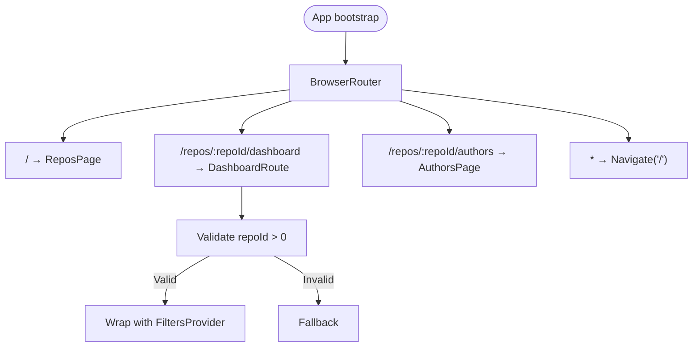

**Diagram sources**
- [App.tsx:10-31](file://frontend/src/App.tsx#L10-L31)

**Section sources**
- [App.tsx:1-38](file://frontend/src/App.tsx#L1-L38)

### Repository Management (ReposPage)
- Responsibilities:
  - List repositories, upload zip, clone from URL, delete, and navigate to repo pages.
  - Poll active repositories every 1.5 seconds until idle.
  - Provide user feedback via ToastContext.
- Key interactions:
  - Upload triggers validation (.zip only), then calls api.uploadRepo and updates local list.
  - Clone calls api.cloneRepo and clears inputs on success.
  - Delete prompts confirmation, calls api.deleteRepo, and removes item from list.

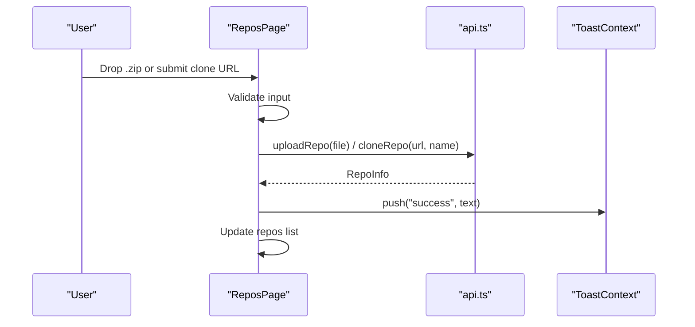

**Diagram sources**
- [ReposPage.tsx:45-78](file://frontend/src/pages/ReposPage.tsx#L45-L78)
- [api.ts:54-66](file://frontend/src/api.ts#L54-L66)
- [ToastContext.tsx:17-47](file://frontend/src/state/ToastContext.tsx#L17-L47)

**Section sources**
- [ReposPage.tsx:1-287](file://frontend/src/pages/ReposPage.tsx#L1-L287)

### Author Merging (AuthorsPage)
- Responsibilities:
  - Display identities and merge groups.
  - Allow selecting identities to merge into a canonical name.
  - Unmerge individual identities or entire groups.
- Data flow:
  - useAuthors provides data and setter; mutations call api.mergeAuthors, api.unmergeIdentity, api.unmergeGroup.
  - Success paths update data and show toasts; errors propagate messages.

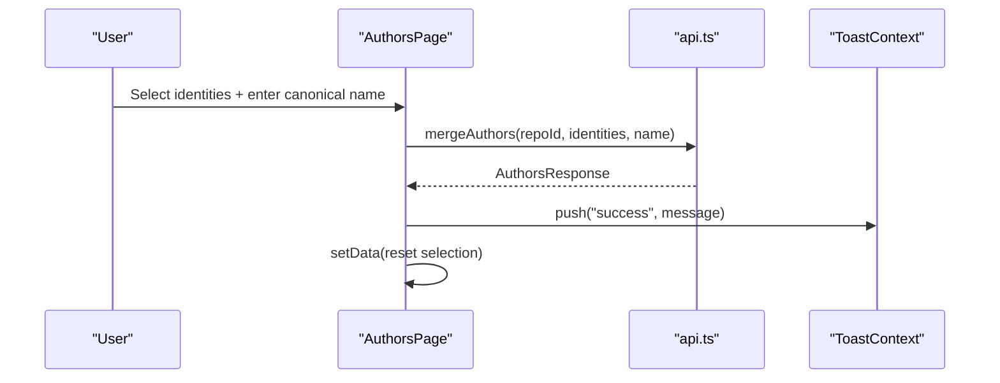

**Diagram sources**
- [AuthorsPage.tsx:41-60](file://frontend/src/pages/AuthorsPage.tsx#L41-L60)
- [api.ts:68-84](file://frontend/src/api.ts#L68-L84)
- [ToastContext.tsx:17-47](file://frontend/src/state/ToastContext.tsx#L17-L47)

**Section sources**
- [AuthorsPage.tsx:1-312](file://frontend/src/pages/AuthorsPage.tsx#L1-L312)

### Dashboard Orchestration (DashboardPage)
- Responsibilities:
  - Compose FilterBar, SummaryCards, GrowthTimeline, DirectoryTreemap, AuthorPanel, FileMetricsTable, CommitSetTable.
  - Show repository status gate when not ready.
  - Derive human-readable scope from filters.path and filters.type.
- Data access:
  - Reads repo via useRepo and filters via useFilters.

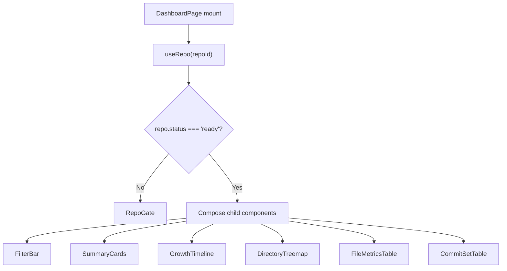

**Diagram sources**
- [DashboardPage.tsx:17-95](file://frontend/src/pages/DashboardPage.tsx#L17-L95)

**Section sources**
- [DashboardPage.tsx:1-95](file://frontend/src/pages/DashboardPage.tsx#L1-L95)

### Filter State and URL Synchronization (FiltersContext)
- Responsibilities:
  - Parse and serialize filter state to/from URLSearchParams.
  - Expose mode ("range" vs "manual") based on presence of commits.
  - Convert to backend MetricsFilters (UNIX timestamps, exclusive end day).
- Key behaviors:
  - setFilters merges patch and replaces URL without history push.
  - reset clears all filters.
  - apiFilters memoizes transformation for downstream consumers.

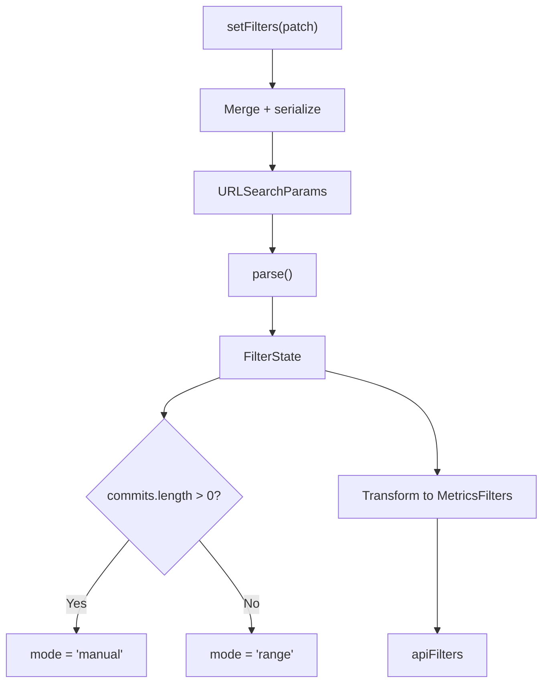

**Diagram sources**
- [FiltersContext.tsx:24-55](file://frontend/src/state/FiltersContext.tsx#L24-L55)
- [FiltersContext.tsx:91-104](file://frontend/src/state/FiltersContext.tsx#L91-L104)

**Section sources**
- [FiltersContext.tsx:1-119](file://frontend/src/state/FiltersContext.tsx#L1-L119)

### API Client Integration (api.ts)
- Responsibilities:
  - Centralized typed fetch wrapper with ApiError carrying HTTP status.
  - Helpers for JSON payloads and FormData uploads.
  - Endpoints grouped by domain: repositories, authors, commits/paths, metrics views.
- Error handling:
  - Network failures throw ApiError(0, ...).
  - Non-2xx responses parse optional JSON detail; fallback to status+statusText.

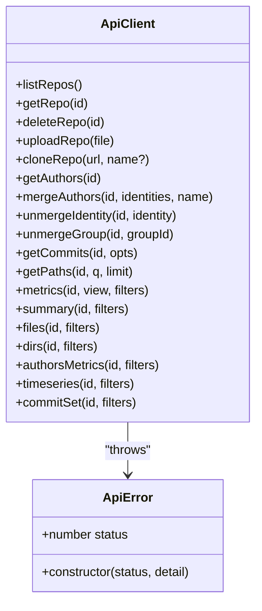

**Diagram sources**
- [api.ts:17-52](file://frontend/src/api.ts#L17-L52)
- [api.ts:54-127](file://frontend/src/api.ts#L54-L127)

**Section sources**
- [api.ts:1-127](file://frontend/src/api.ts#L1-L127)

### Visualization Components

#### GrowthTimeline
- Displays added, removed, and growth lines over time buckets.
- Brushing sets start/end dates and clears manual commit selection.
- Uses useECharts hook for lifecycle and event binding.

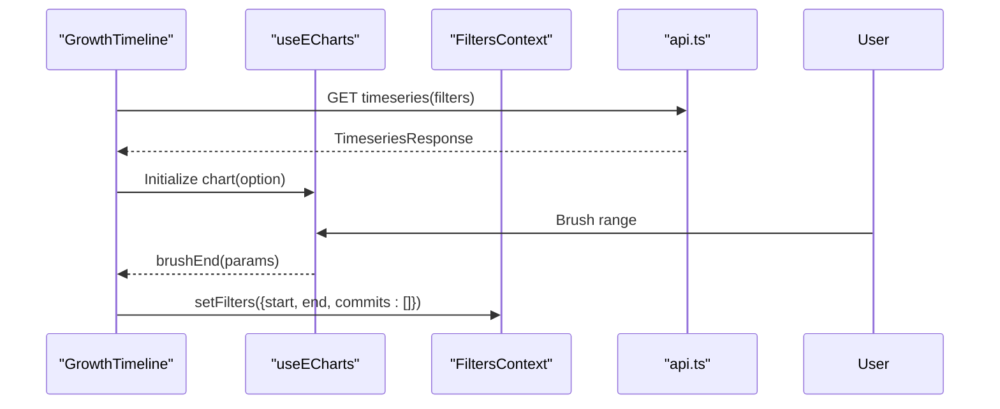

**Diagram sources**
- [GrowthTimeline.tsx:14-167](file://frontend/src/components/GrowthTimeline.tsx#L14-L167)
- [FiltersContext.tsx:70-119](file://frontend/src/state/FiltersContext.tsx#L70-L119)
- [api.ts:107-123](file://frontend/src/api.ts#L107-L123)

**Section sources**
- [GrowthTimeline.tsx:1-167](file://frontend/src/components/GrowthTimeline.tsx#L1-L167)

#### DirectoryTreemap
- Builds a hierarchical tree from dir rows; size=churn, color=growth.
- Clicking a node scopes filters to that directory; breadcrumb-like “Up” button navigates parent.

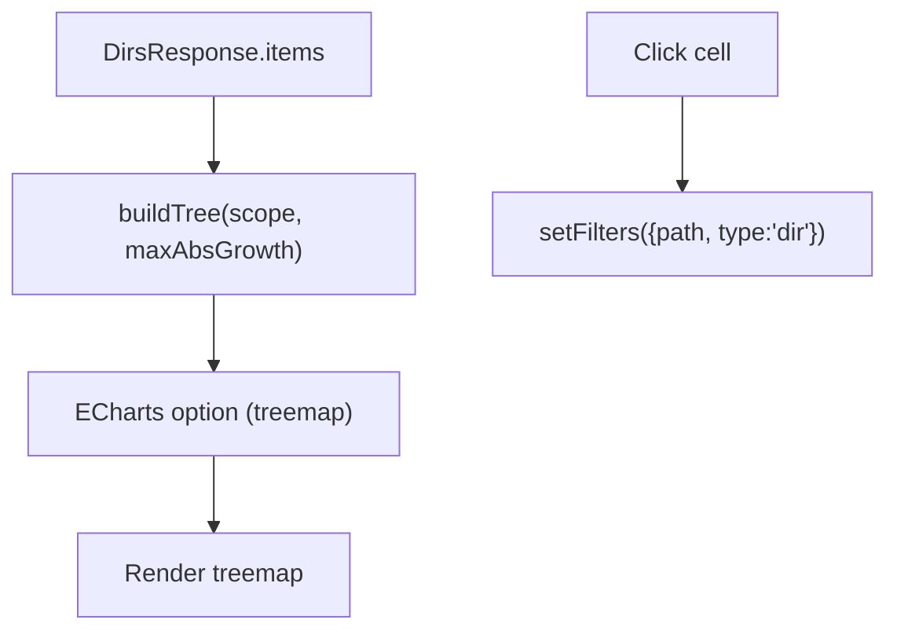

**Diagram sources**
- [DirectoryTreemap.tsx:31-61](file://frontend/src/components/DirectoryTreemap.tsx#L31-L61)
- [DirectoryTreemap.tsx:117-124](file://frontend/src/components/DirectoryTreemap.tsx#L117-L124)

**Section sources**
- [DirectoryTreemap.tsx:1-167](file://frontend/src/components/DirectoryTreemap.tsx#L1-L167)

#### SummaryCards
- Renders seven derived metrics plus commit count |H|.
- Shows skeleton placeholders while loading and footnotes explaining formulas.

**Section sources**
- [SummaryCards.tsx:1-84](file://frontend/src/components/SummaryCards.tsx#L1-L84)

#### FileMetricsTable
- Sortable table with client-side sorting and CSV export.
- Uses useMetrics with a higher limit to support export.

**Section sources**
- [FileMetricsTable.tsx:1-152](file://frontend/src/components/FileMetricsTable.tsx#L1-L152)

#### CommitSetTable
- Paged view of commit set H with optional “only changed” toggle.
- Resets page on filter changes.

**Section sources**
- [CommitSetTable.tsx:1-130](file://frontend/src/components/CommitSetTable.tsx#L1-L130)

### Navigation and Breadcrumbs (NavBar)
- Top-level nav links to repositories.
- Per-repo sub-navigation with active state styling and status badge.

**Section sources**
- [NavBar.tsx:1-53](file://frontend/src/components/NavBar.tsx#L1-L53)

## Dependency Analysis
High-level dependencies between modules:

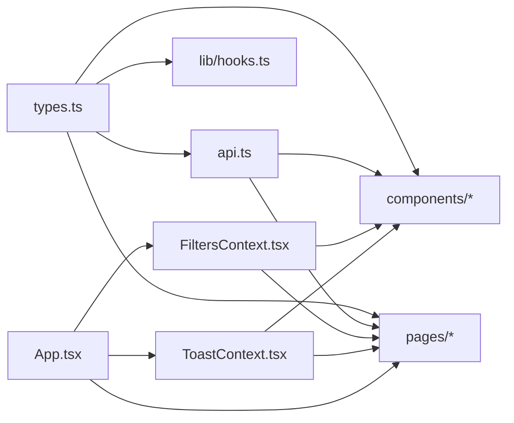

**Diagram sources**
- [types.ts:1-172](file://frontend/src/types.ts#L1-L172)
- [api.ts:1-127](file://frontend/src/api.ts#L1-L127)
- [FiltersContext.tsx:1-119](file://frontend/src/state/FiltersContext.tsx#L1-L119)
- [ToastContext.tsx:1-48](file://frontend/src/state/ToastContext.tsx#L1-L48)
- [App.tsx:1-38](file://frontend/src/App.tsx#L1-L38)

**Section sources**
- [types.ts:1-172](file://frontend/src/types.ts#L1-L172)
- [api.ts:1-127](file://frontend/src/api.ts#L1-L127)
- [FiltersContext.tsx:1-119](file://frontend/src/state/FiltersContext.tsx#L1-L119)
- [ToastContext.tsx:1-48](file://frontend/src/state/ToastContext.tsx#L1-L48)
- [App.tsx:1-38](file://frontend/src/App.tsx#L1-L38)

## Performance Considerations
- Build optimization:
  - Vite splits echarts and react/router into separate chunks via manualChunks to improve caching and initial load.
  - chunkSizeWarningLimit tuned to reduce bundle bloat warnings.
- Runtime efficiency:
  - Memoization: useMemo for parsed filters, serialized URL, apiFilters, chart options, and tree building.
  - Debounced brush events on charts to avoid excessive filter updates.
  - Pagination for commit set table to limit DOM nodes.
  - Conditional rendering of heavy charts when out-of-scope (e.g., treemap disabled for file scope).
- Network:
  - Centralized API client reduces duplicate fetch logic and centralizes error handling.
  - Polling interval only active when any repository is in an active state.

[No sources needed since this section provides general guidance]

## Troubleshooting Guide
Common issues and resolutions:
- Backend unreachable:
  - The API client throws ApiError with status 0 and a message indicating the backend may be down. Verify the dev server proxy or production endpoint.
- Invalid repository ID:
  - DashboardRoute redirects to home if repoId is non-positive. Ensure URLs include a valid numeric id.
- Empty datasets:
  - Tables and charts show empty states when no data matches current filters. Adjust time range, path scope, or disable “only changed”.
- Toast visibility:
  - Toasts auto-dismiss after ~5.2 seconds. Use info/success/error kinds to distinguish outcomes.

**Section sources**
- [api.ts:17-44](file://frontend/src/api.ts#L17-L44)
- [App.tsx:10-18](file://frontend/src/App.tsx#L10-L18)
- [CommitSetTable.tsx:53-62](file://frontend/src/components/CommitSetTable.tsx#L53-L62)
- [ToastContext.tsx:17-47](file://frontend/src/state/ToastContext.tsx#L17-L47)

## Conclusion
RAT’s frontend combines a clear routing structure, URL-synced filter state, and a typed API client to deliver interactive analytics dashboards. ECharts visualizations are integrated through a dedicated hook, and component composition keeps pages readable and maintainable. Vite-based builds optimize bundle splitting, while runtime techniques like memoization and pagination ensure smooth user experiences.