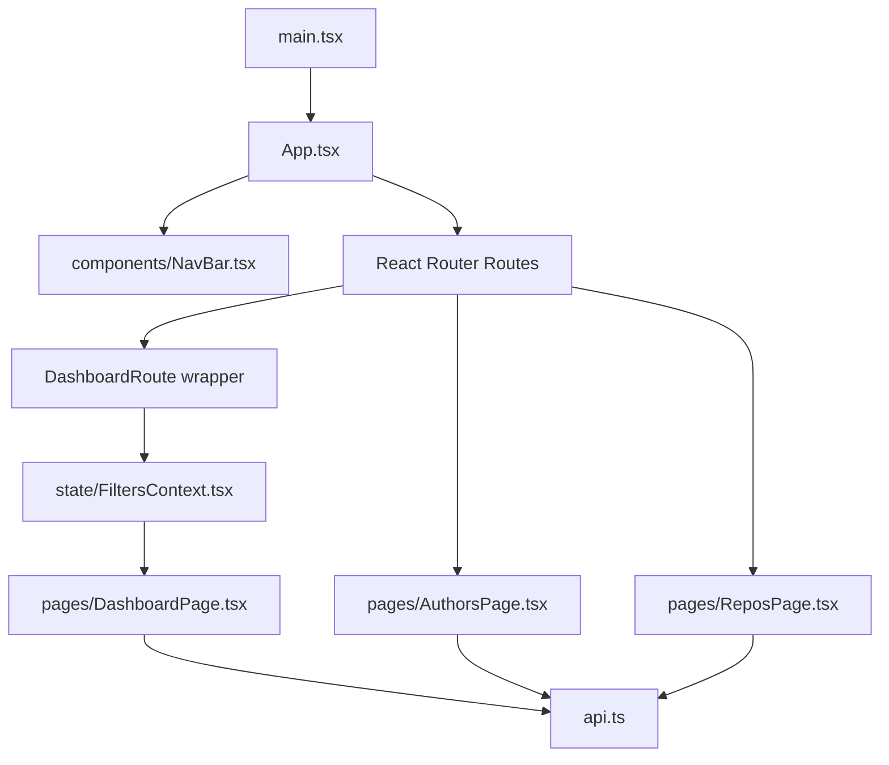
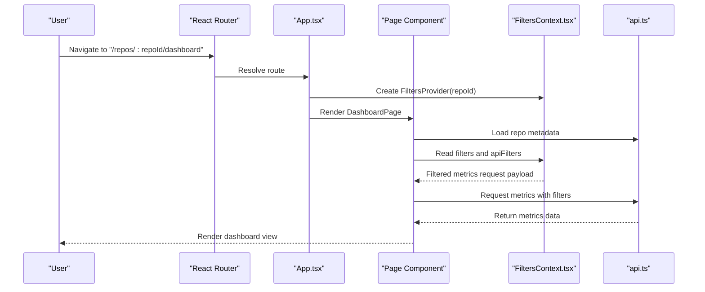
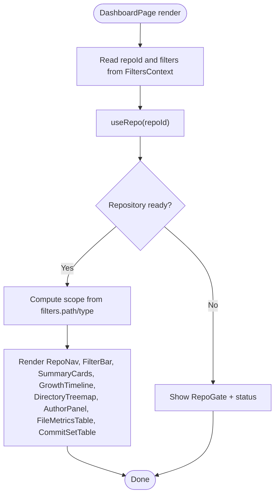
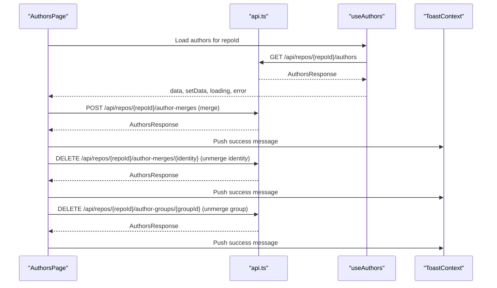
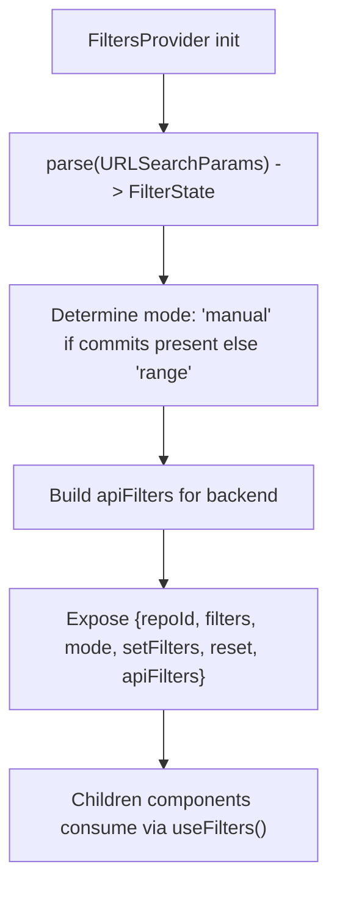
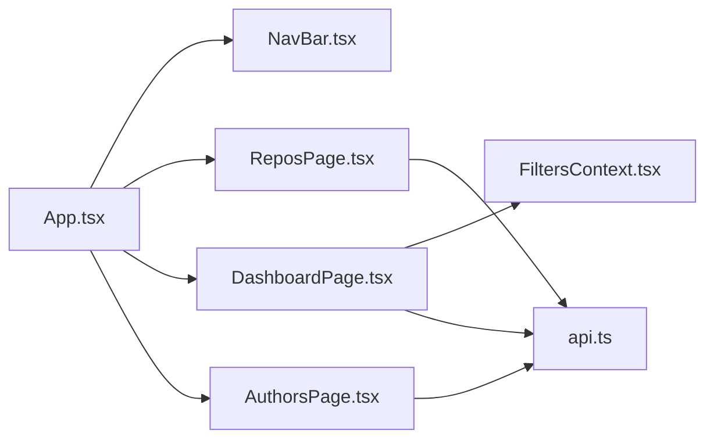

# Pages and Routing

<cite>
**Referenced Files in This Document**
- [App.tsx](file://frontend/src/App.tsx)
- [main.tsx](file://frontend/src/main.tsx)
- [DashboardPage.tsx](file://frontend/src/pages/DashboardPage.tsx)
- [AuthorsPage.tsx](file://frontend/src/pages/AuthorsPage.tsx)
- [ReposPage.tsx](file://frontend/src/pages/ReposPage.tsx)
- [NavBar.tsx](file://frontend/src/components/NavBar.tsx)
- [FiltersContext.tsx](file://frontend/src/state/FiltersContext.tsx)
- [api.ts](file://frontend/src/api.ts)
</cite>

## Table of Contents
1. [Introduction](#introduction)
2. [Project Structure](#project-structure)
3. [Core Components](#core-components)
4. [Architecture Overview](#architecture-overview)
5. [Detailed Component Analysis](#detailed-component-analysis)
6. [Dependency Analysis](#dependency-analysis)
7. [Performance Considerations](#performance-considerations)
8. [Troubleshooting Guide](#troubleshooting-guide)
9. [Conclusion](#conclusion)

## Introduction
This document explains RAT’s frontend page structure and routing system. It focuses on the main pages: DashboardPage, AuthorsPage, and ReposPage. It also documents React Router configuration, navigation patterns, URL-based state synchronization for filters, layout structure, header navigation, and how pages integrate with the global filter context and API client.

## Project Structure
The frontend is a React application using React Router for routing and a small set of shared components and contexts. The entry point renders the root App component, which configures routes and providers.

**Diagram sources**
- [main.tsx:6-13](file://frontend/src/main.tsx#L6-L13)
- [App.tsx:10-37](file://frontend/src/App.tsx#L10-L37)
- [NavBar.tsx:6-23](file://frontend/src/components/NavBar.tsx#L6-L23)
- [DashboardPage.tsx:17-94](file://frontend/src/pages/DashboardPage.tsx#L17-L94)
- [AuthorsPage.tsx:13-311](file://frontend/src/pages/AuthorsPage.tsx#L13-L311)
- [ReposPage.tsx:11-286](file://frontend/src/pages/ReposPage.tsx#L11-L286)
- [FiltersContext.tsx:70-112](file://frontend/src/state/FiltersContext.tsx#L70-L112)
- [api.ts:54-126](file://frontend/src/api.ts#L54-L126)

**Section sources**
- [main.tsx:6-13](file://frontend/src/main.tsx#L6-L13)
- [App.tsx:10-37](file://frontend/src/App.tsx#L10-L37)

## Core Components
- App: Configures BrowserRouter, ToastProvider, top-level NavBar, and all routes. It also wraps dashboard routes with FiltersProvider to supply repository-scoped filter state.
- NavBar: Provides the global top navigation (Repositories link) and per-repository sub-navigation (RepoNav) with breadcrumb-like links between dashboard and authors views.
- FiltersContext: Centralizes filter state for dashboard metrics, syncing it to the URL query string so filters are shareable and bookmarkable.
- api: Typed HTTP client wrapping fetch, exposing endpoints for repositories, authors, commits, paths, and metrics.

Key responsibilities:
- Routing: Map URLs to pages and enforce valid parameters.
- Layout: Render NavBar and per-page RepoNav breadcrumbs.
- State: Provide repoId and filters via context; sync filters to URL.
- Data: Fetch repository metadata, author identities, and metrics through the API client.

**Section sources**
- [App.tsx:10-37](file://frontend/src/App.tsx#L10-L37)
- [NavBar.tsx:6-52](file://frontend/src/components/NavBar.tsx#L6-L52)
- [FiltersContext.tsx:14-118](file://frontend/src/state/FiltersContext.tsx#L14-L118)
- [api.ts:17-126](file://frontend/src/api.ts#L17-L126)

## Architecture Overview
RAT uses a simple SPA architecture:
- React Router defines three primary routes:
  - `/` → ReposPage
  - `/repos/:repoId/dashboard` → DashboardPage (wrapped by FiltersProvider)
  - `/repos/:repoId/authors` → AuthorsPage
- A catch-all route redirects unknown paths back to the home page.
- Repository-scoped pages receive repoId from the URL and use hooks to load repository data and related resources.
- Dashboard metrics are filtered by a URL-synced context that translates user selections into backend-compatible filters.

**Diagram sources**
- [App.tsx:21-37](file://frontend/src/App.tsx#L21-L37)
- [DashboardPage.tsx:17-94](file://frontend/src/pages/DashboardPage.tsx#L17-L94)
- [FiltersContext.tsx:70-112](file://frontend/src/state/FiltersContext.tsx#L70-L112)
- [api.ts:107-126](file://frontend/src/api.ts#L107-L126)

## Detailed Component Analysis

### React Router Configuration and Navigation Patterns
- Root routes:
  - Home: `/` maps to ReposPage.
  - Dashboard: `/repos/:repoId/dashboard` maps to DashboardRoute, which validates repoId and wraps DashboardPage with FiltersProvider.
  - Authors: `/repos/:repoId/authors` maps to AuthorsPage.
  - Fallback: Any unmatched path redirects to `/`.
- Navigation:
  - Global header uses NavLink to highlight the active “Repositories” link.
  - Per-repo navigation uses RepoNav to show breadcrumb-style links between dashboard and authors views.
  - ReposPage navigates programmatically or via Link to repository-specific views.

URL parameters:
- `:repoId`: Numeric identifier used across repository-scoped pages.

Query string handling:
- Dashboard filters are synchronized to the URL query string via FiltersContext. Query keys include start, end, commits, authors, path, type, and gran.

Navigation examples:
- From ReposPage, users can open a ready repository’s dashboard or navigate to its authors page.
- From RepoNav, users can switch between dashboard and authors within the same repository.

**Section sources**
- [App.tsx:10-37](file://frontend/src/App.tsx#L10-L37)
- [NavBar.tsx:6-52](file://frontend/src/components/NavBar.tsx#L6-L52)
- [ReposPage.tsx:247-280](file://frontend/src/pages/ReposPage.tsx#L247-L280)

### DashboardPage
Responsibilities:
- Display repository overview and metrics based on current filters.
- Compose UI sections: summary cards, growth timeline, directory treemap, author panel, file metrics table, and commit set table.
- Show repository status and ingestion progress via RepoGate when not ready.
- Use FiltersContext to read repoId, filters, mode, and apiFilters.

Props and data flow:
- Reads repoId and filters from FiltersContext.
- Uses useRepo hook to load repository metadata and handle loading/error states.
- Renders RepoNav with active tab “dashboard”.
- When repository is ready, composes multiple metric components that consume FiltersContext internally.

Error and loading states:
- Displays ErrorNote if repository fetch fails.
- Shows Loading while fetching or when repository is not yet ready.

Filter scope display:
- Computes a human-readable scope string based on filters.path and filters.type.

Integration points:
- FiltersContext supplies both UI filters and backend-compatible MetricsFilters.
- Metric components call api.metrics with apiFilters derived from FiltersContext.

**Diagram sources**
- [DashboardPage.tsx:17-94](file://frontend/src/pages/DashboardPage.tsx#L17-L94)
- [FiltersContext.tsx:70-112](file://frontend/src/state/FiltersContext.tsx#L70-L112)

**Section sources**
- [DashboardPage.tsx:17-94](file://frontend/src/pages/DashboardPage.tsx#L17-L94)
- [FiltersContext.tsx:70-112](file://frontend/src/state/FiltersContext.tsx#L70-L112)

### AuthorsPage
Responsibilities:
- Manage author identity merging and group management for a repository.
- List author identities, allow selection and merge operations, and manage existing merge groups.
- Show whether .mailmap was applied and provide guidance for manual merges.

Data flow:
- Reads repoId from URL params and loads repository metadata via useRepo.
- Loads author identities and merge groups via useAuthors hook.
- Performs merge/unmerge actions by calling api.mergeAuthors, api.unmergeIdentity, and api.unmergeGroup.
- Updates local state with new author data after successful mutations.

User interactions:
- Select one or more identities to merge into a canonical name.
- Remove an identity from a group or unmerge an entire group.
- Receive toast notifications for success or error outcomes.

Layout:
- Uses RepoNav with active tab “authors”.
- Presents a card-based interface with tables and controls for managing identities and groups.

**Diagram sources**
- [AuthorsPage.tsx:41-87](file://frontend/src/pages/AuthorsPage.tsx#L41-L87)
- [api.ts:68-84](file://frontend/src/api.ts#L68-L84)

**Section sources**
- [AuthorsPage.tsx:13-311](file://frontend/src/pages/AuthorsPage.tsx#L13-L311)
- [api.ts:68-84](file://frontend/src/api.ts#L68-L84)

### ReposPage
Responsibilities:
- Manage repositories: list, upload zip archives, clone from URLs, delete, and monitor ingestion progress.
- Provide navigation to repository-specific dashboard and authors pages.

Data flow:
- Calls api.listRepos to populate the repository list.
- Polls periodically while any repository is active to reflect ingestion progress.
- Handles upload and clone operations, updating the list and showing toast messages.
- Deletes repositories and removes them from local state.

Navigation:
- Uses Link to navigate to `/repos/{id}/dashboard` for ready repositories.
- Uses programmatic navigation to `/repos/{id}/authors` for active repositories.

Status handling:
- Shows StatusBadge and Progress for active repositories.
- Displays error details when available.

**Section sources**
- [ReposPage.tsx:11-286](file://frontend/src/pages/ReposPage.tsx#L11-L286)
- [api.ts:54-66](file://frontend/src/api.ts#L54-L66)

### Global Filter Context and URL Synchronization
FiltersContext provides:
- FilterState shape including date range, selected commits, authors, path, object type, and granularity.
- URL serialization/deserialization to keep filters in sync with the browser’s query string.
- Computed mode (“range” vs “manual”) based on whether commits are explicitly selected.
- Translation of UI filters into backend-compatible MetricsFilters for API calls.

Key behaviors:
- parse() reads query parameters and normalizes values.
- serialize() writes only non-default values to the URL.
- setFilters() updates the URL query string without history stack pollution.
- reset() clears all filters from the URL.
- apiFilters computes start/end timestamps and nullifies fields when in manual mode.

**Diagram sources**
- [FiltersContext.tsx:24-55](file://frontend/src/state/FiltersContext.tsx#L24-L55)
- [FiltersContext.tsx:70-112](file://frontend/src/state/FiltersContext.tsx#L70-L112)

**Section sources**
- [FiltersContext.tsx:14-118](file://frontend/src/state/FiltersContext.tsx#L14-L118)

### Layout Structure, Header Navigation, and Breadcrumbs
- Top-level layout:
  - NavBar renders the brand and global navigation link to Repositories.
- Per-repository layout:
  - RepoNav shows a breadcrumb-like row linking back to all repositories and providing quick access to dashboard and authors views.
  - Active tab highlighting is handled via NavLink’s isActive logic.

Breadcrumb pattern:
- “← All repositories” link followed by repository name and status badge.
- Sub-navigation tabs for “Dashboard” and “Author merging”.

**Section sources**
- [NavBar.tsx:6-52](file://frontend/src/components/NavBar.tsx#L6-L52)

## Dependency Analysis
The following diagram shows how pages depend on shared modules and the API client.

**Diagram sources**
- [App.tsx:1-37](file://frontend/src/App.tsx#L1-L37)
- [NavBar.tsx:1-52](file://frontend/src/components/NavBar.tsx#L1-L52)
- [DashboardPage.tsx:1-94](file://frontend/src/pages/DashboardPage.tsx#L1-L94)
- [AuthorsPage.tsx:1-311](file://frontend/src/pages/AuthorsPage.tsx#L1-L311)
- [ReposPage.tsx:1-286](file://frontend/src/pages/ReposPage.tsx#L1-L286)
- [FiltersContext.tsx:1-118](file://frontend/src/state/FiltersContext.tsx#L1-L118)
- [api.ts:1-126](file://frontend/src/api.ts#L1-L126)

**Section sources**
- [App.tsx:1-37](file://frontend/src/App.tsx#L1-L37)
- [api.ts:1-126](file://frontend/src/api.ts#L1-L126)

## Performance Considerations
- URL-synced filters avoid unnecessary re-renders by replacing query strings instead of pushing history entries.
- Polling interval for repository status is conditional on active repositories to reduce network overhead.
- Filtering mode switches between time-range queries and explicit commit lists, allowing efficient backend filtering.
- Avoid redundant API calls by leveraging memoized values in FiltersContext and hooks where applicable.

[No sources needed since this section provides general guidance]

## Troubleshooting Guide
Common issues and resolutions:
- Invalid repository ID:
  - DashboardRoute validates repoId and redirects to home if invalid. Ensure numeric positive IDs in URLs.
- Missing repository data:
  - Pages show Loading or ErrorNote depending on state. Verify backend availability and correct repoId.
- Filter synchronization problems:
  - Confirm query parameters match expected keys (start, end, commits, authors, path, type, gran). Reset filters to defaults if corrupted.
- API errors:
  - ApiError wraps HTTP errors with status and detail. Inspect toast messages and network responses for specifics.

**Section sources**
- [App.tsx:10-18](file://frontend/src/App.tsx#L10-L18)
- [DashboardPage.tsx:21-34](file://frontend/src/pages/DashboardPage.tsx#L21-L34)
- [api.ts:17-44](file://frontend/src/api.ts#L17-L44)

## Conclusion
RAT’s frontend organizes routing around clear repository-scoped pages with a robust filter context synced to the URL. DashboardPage composes multiple metric views driven by FiltersContext, AuthorsPage manages identity merging through typed API calls, and ReposPage orchestrates repository lifecycle operations. NavBar and RepoNav provide consistent navigation and breadcrumb patterns. The design emphasizes shareable URLs, predictable state synchronization, and clean separation between UI composition and data fetching.

[No sources needed since this section summarizes without analyzing specific files]