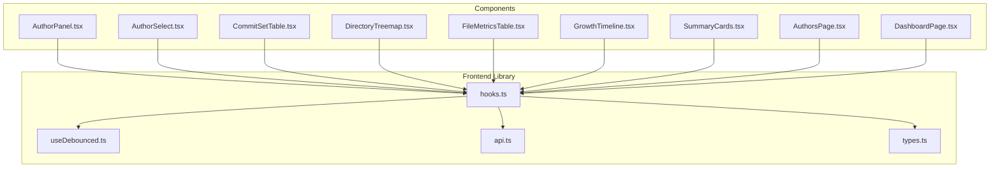
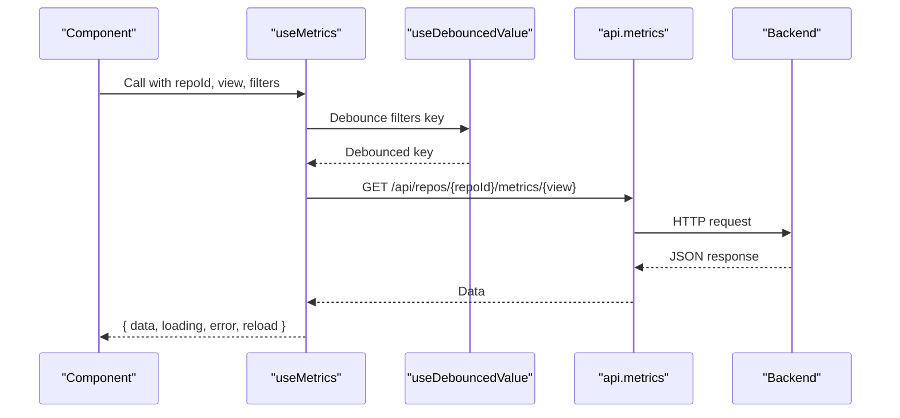
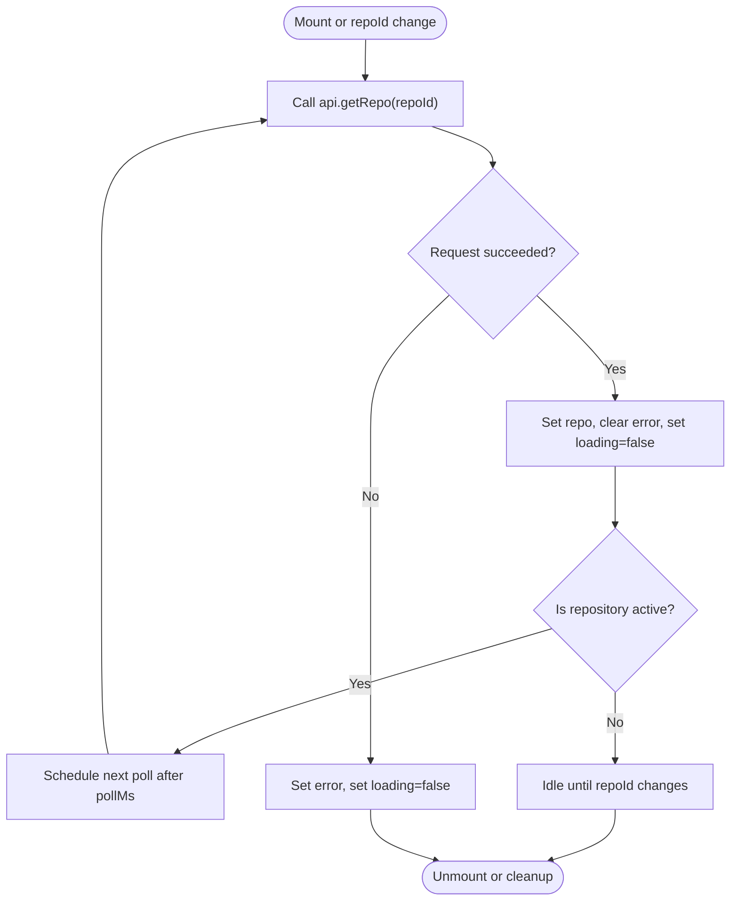
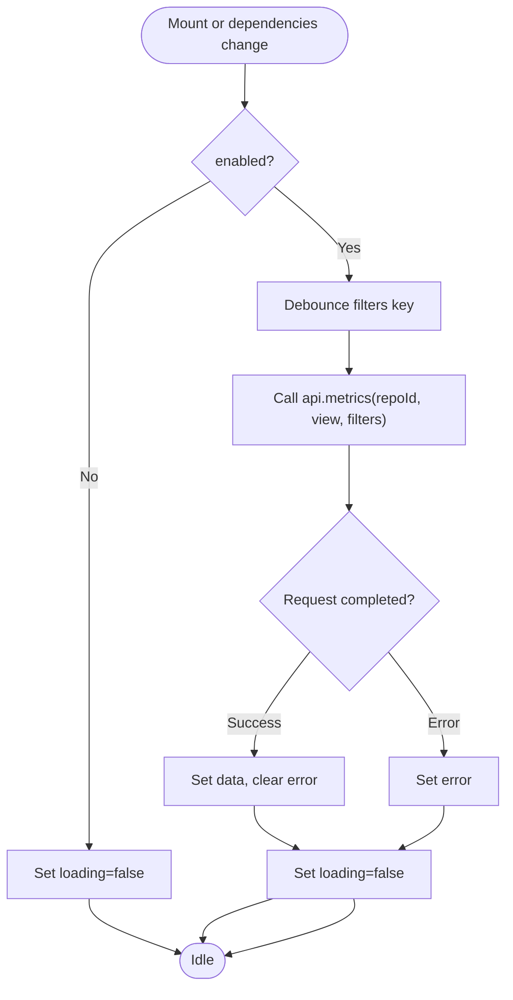
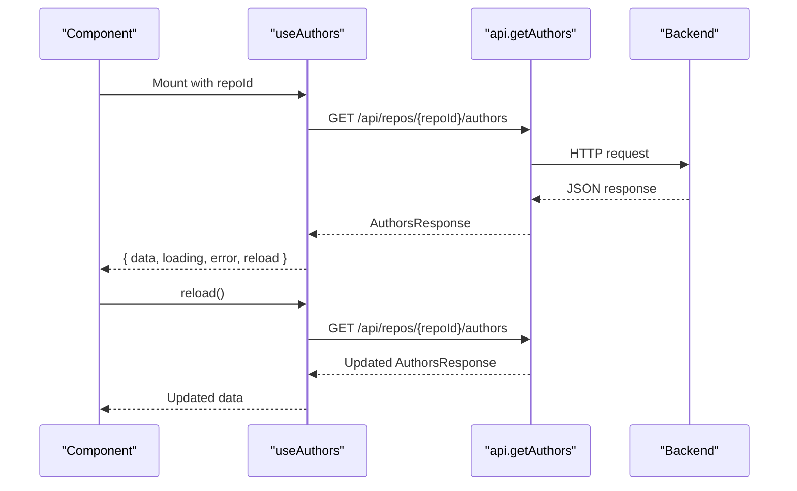
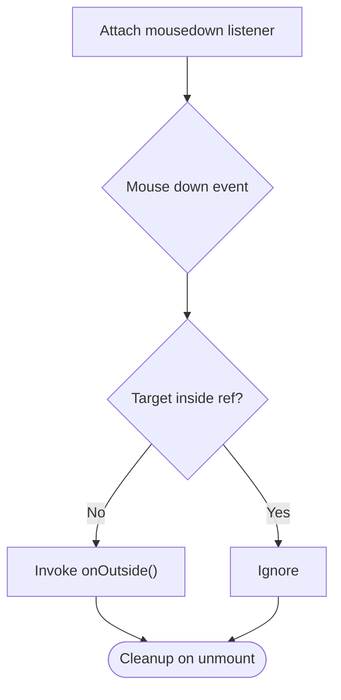
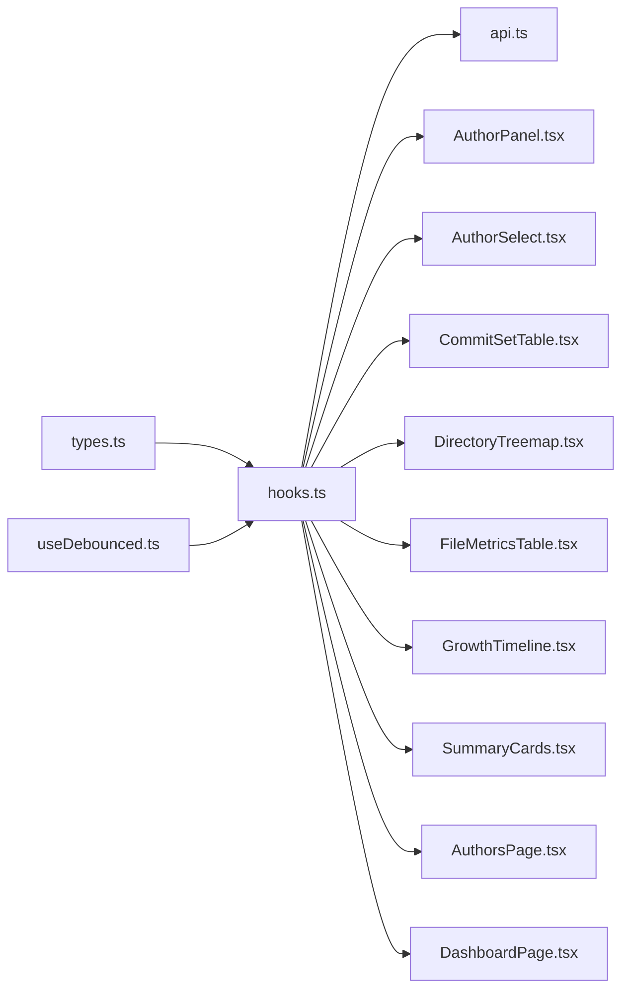

# Custom Hooks

<cite>
**Referenced Files in This Document**
- [hooks.ts](file://frontend/src/lib/hooks.ts)
- [useDebounced.ts](file://frontend/src/lib/useDebounced.ts)
- [api.ts](file://frontend/src/api.ts)
- [types.ts](file://frontend/src/types.ts)
- [AuthorPanel.tsx](file://frontend/src/components/AuthorPanel.tsx)
- [AuthorSelect.tsx](file://frontend/src/components/AuthorSelect.tsx)
- [CommitSetTable.tsx](file://frontend/src/components/CommitSetTable.tsx)
- [DirectoryTreemap.tsx](file://frontend/src/components/DirectoryTreemap.tsx)
- [FileMetricsTable.tsx](file://frontend/src/components/FileMetricsTable.tsx)
- [GrowthTimeline.tsx](file://frontend/src/components/GrowthTimeline.tsx)
- [SummaryCards.tsx](file://frontend/src/components/SummaryCards.tsx)
- [AuthorsPage.tsx](file://frontend/src/pages/AuthorsPage.tsx)
- [DashboardPage.tsx](file://frontend/src/pages/DashboardPage.tsx)
</cite>

## Table of Contents
1. [Introduction](#introduction)
2. [Project Structure](#project-structure)
3. [Core Components](#core-components)
4. [Architecture Overview](#architecture-overview)
5. [Detailed Component Analysis](#detailed-component-analysis)
6. [Dependency Analysis](#dependency-analysis)
7. [Performance Considerations](#performance-considerations)
8. [Troubleshooting Guide](#troubleshooting-guide)
9. [Conclusion](#conclusion)

## Introduction
This document explains the custom React hooks that encapsulate common state management and data fetching patterns in the frontend. The hooks provide:
- Polling repository status while ingestion is active
- SWR-style metrics fetching with debounced filters and stale-data preservation
- Author list fetching with manual reload support
- A click-outside helper for dropdown panels
- A debounced value utility used to throttle filter-driven requests

These hooks integrate with a typed API client and shared types, enabling reusable logic across components such as dashboards, tables, charts, and author tools.

## Project Structure
The hooks live under `frontend/src/lib`, alongside utilities and chart bindings. They depend on:
- `api.ts` for HTTP requests and error handling
- `types.ts` for shared TypeScript models
- `useDebounced.ts` for debouncing filter keys before triggering fetches

**Diagram sources**
- [hooks.ts:1-141](file://frontend/src/lib/hooks.ts#L1-L141)
- [useDebounced.ts:1-12](file://frontend/src/lib/useDebounced.ts#L1-L12)
- [api.ts:1-127](file://frontend/src/api.ts#L1-L127)
- [types.ts:1-172](file://frontend/src/types.ts#L1-L172)
- [AuthorPanel.tsx:1-20](file://frontend/src/components/AuthorPanel.tsx#L1-L20)
- [AuthorSelect.tsx:1-20](file://frontend/src/components/AuthorSelect.tsx#L1-L20)
- [CommitSetTable.tsx:1-30](file://frontend/src/components/CommitSetTable.tsx#L1-L30)
- [DirectoryTreemap.tsx:1-70](file://frontend/src/components/DirectoryTreemap.tsx#L1-L70)
- [FileMetricsTable.tsx:1-30](file://frontend/src/components/FileMetricsTable.tsx#L1-L30)
- [GrowthTimeline.tsx:1-20](file://frontend/src/components/GrowthTimeline.tsx#L1-L20)
- [SummaryCards.tsx:1-40](file://frontend/src/components/SummaryCards.tsx#L1-L40)
- [AuthorsPage.tsx:1-20](file://frontend/src/pages/AuthorsPage.tsx#L1-L20)
- [DashboardPage.tsx:1-25](file://frontend/src/pages/DashboardPage.tsx#L1-L25)

**Section sources**
- [hooks.ts:1-141](file://frontend/src/lib/hooks.ts#L1-L141)
- [useDebounced.ts:1-12](file://frontend/src/lib/useDebounced.ts#L1-L12)
- [api.ts:1-127](file://frontend/src/api.ts#L1-L127)
- [types.ts:1-172](file://frontend/src/types.ts#L1-L172)

## Core Components
This section documents each hook’s purpose, parameters, return values, and usage patterns.

### useRepo(repoId, pollMs = 1500)
Purpose:
- Fetch a single repository by ID
- Keep polling while the repository is in an active ingestion state
- Provide loading and error states

Parameters:
- repoId: number — repository identifier
- pollMs: number (optional, default 1500) — interval between polls when active

Return values:
- repo: RepoInfo | null
- loading: boolean
- error: string | null

Behavior:
- On mount or when repoId changes, it calls the API once
- If the repository status indicates activity, it schedules repeated polling until the status becomes inactive
- Errors are captured and exposed; successful responses clear previous errors
- Cleanup clears pending timers and prevents state updates after unmount

Usage pattern:
- Used at page level to gate UI based on repository readiness
- Example consumers: AuthorsPage, DashboardPage

Error handling:
- Network or backend errors set error and stop further polling
- Consumers should render error messages or fallbacks

Performance considerations:
- Polling only occurs while the repository is active
- Default polling interval balances responsiveness and server load

**Section sources**
- [hooks.ts:13-49](file://frontend/src/lib/hooks.ts#L13-L49)
- [types.ts:13-28](file://frontend/src/types.ts#L13-L28)
- [AuthorsPage.tsx:16-17](file://frontend/src/pages/AuthorsPage.tsx#L16-L17)
- [DashboardPage.tsx:19-19](file://frontend/src/pages/DashboardPage.tsx#L19-L19)

### useMetrics<T>(repoId, view, filters, enabled = true)
Purpose:
- Fetch metric views (summary, files, dirs, authors, timeseries, commits)
- Debounce filter changes to avoid excessive requests
- Preserve stale data while new queries are in flight to prevent UI flashing

Parameters:
- repoId: number
- view: string — one of the supported metric endpoints
- filters: MetricsFilters — query filters
- enabled: boolean (optional, default true) — controls whether to trigger fetches

Return values:
- data: T | null
- loading: boolean
- error: string | null
- reload: () => void — triggers a refetch by incrementing an internal nonce

Behavior:
- Serializes filters into a key and debounces that key before issuing a request
- Drops stale data when repoId changes
- Keeps existing data visible while a new request is in progress
- Supports manual reload via nonce increment

Usage pattern:
- Consumed by chart and table components to display different metric views
- Example consumers: SummaryCards, FileMetricsTable, DirectoryTreemap, GrowthTimeline, CommitSetTable, AuthorPanel

Error handling:
- Errors are stored without clearing previously loaded data
- Consumers can show inline errors or disable interactive elements

Performance considerations:
- Debouncing reduces redundant network calls during rapid filter changes
- Stale data retention improves perceived performance

**Section sources**
- [hooks.ts:51-99](file://frontend/src/lib/hooks.ts#L51-L99)
- [useDebounced.ts:1-12](file://frontend/src/lib/useDebounced.ts#L1-L12)
- [types.ts:76-87](file://frontend/src/types.ts#L76-L87)
- [SummaryCards.tsx:36-36](file://frontend/src/components/SummaryCards.tsx#L36-L36)
- [FileMetricsTable.tsx:22-22](file://frontend/src/components/FileMetricsTable.tsx#L22-L22)
- [DirectoryTreemap.tsx:64-64](file://frontend/src/components/DirectoryTreemap.tsx#L64-L64)
- [GrowthTimeline.tsx:16-16](file://frontend/src/components/GrowthTimeline.tsx#L16-L16)
- [CommitSetTable.tsx:21-21](file://frontend/src/components/CommitSetTable.tsx#L21-L21)
- [AuthorPanel.tsx:15-15](file://frontend/src/components/AuthorPanel.tsx#L15-L15)

### useAuthors(repoId)
Purpose:
- Fetch the list of authors and merge groups for a repository
- Provide manual reload capability

Parameters:
- repoId: number

Return values:
- data: AuthorsResponse | null
- setData: (data: AuthorsResponse) => void — direct setter for optimistic updates
- loading: boolean
- error: string | null
- reload: () => Promise<void> — async function to refetch

Behavior:
- Loads authors on mount or when repoId changes
- Exposes both a setter and a reload function for flexible update strategies

Usage pattern:
- Used where author lists need to be refreshed after merges/unmerges
- Example consumer: AuthorSelect

Error handling:
- Errors are captured and surfaced to consumers

**Section sources**
- [hooks.ts:101-124](file://frontend/src/lib/hooks.ts#L101-L124)
- [types.ts:46-50](file://frontend/src/types.ts#L46-L50)
- [AuthorSelect.tsx:16-16](file://frontend/src/components/AuthorSelect.tsx#L16-L16)

### useClickOutside<T extends HTMLElement>(onOutside)
Purpose:
- Close dropdown panels when clicking outside their container

Parameters:
- onOutside: () => void — callback invoked when a click occurs outside the referenced element

Return values:
- ref: RefObject<T | null> — attach to the root element of the panel

Behavior:
- Listens for mousedown on the document
- Invokes the callback if the click target is not contained within the referenced element
- Uses a ref to always call the latest callback without re-subscribing

Usage pattern:
- Attach to dropdown containers to auto-close them on outside clicks

**Section sources**
- [hooks.ts:126-141](file://frontend/src/lib/hooks.ts#L126-L141)
- [AuthorSelect.tsx:4-4](file://frontend/src/components/AuthorSelect.tsx#L4-L4)

### useDebouncedValue(value, delayMs = 250)
Purpose:
- Return a debounced version of a value, used to throttle filter-driven fetches

Parameters:
- value: T — the source value to debounce
- delayMs: number (optional, default 250) — debounce delay in milliseconds

Return values:
- debounced: T — the delayed value

Behavior:
- Schedules a timeout to update the debounced value after delayMs
- Clears the timeout on cleanup or when inputs change

Usage pattern:
- Used internally by useMetrics to debounce filter keys

**Section sources**
- [useDebounced.ts:1-12](file://frontend/src/lib/useDebounced.ts#L1-L12)
- [hooks.ts:59-60](file://frontend/src/lib/hooks.ts#L59-L60)

## Architecture Overview
The hooks form a thin layer over the typed API client. They manage local state (loading, error, data), coordinate side effects (polling, debouncing), and expose simple interfaces to components.

**Diagram sources**
- [hooks.ts:51-99](file://frontend/src/lib/hooks.ts#L51-L99)
- [useDebounced.ts:1-12](file://frontend/src/lib/useDebounced.ts#L1-L12)
- [api.ts:107-125](file://frontend/src/api.ts#L107-L125)

## Detailed Component Analysis

### Data Fetching Flow: useRepo

**Diagram sources**
- [hooks.ts:13-49](file://frontend/src/lib/hooks.ts#L13-L49)

**Section sources**
- [hooks.ts:13-49](file://frontend/src/lib/hooks.ts#L13-L49)

### Metrics Flow: useMetrics

**Diagram sources**
- [hooks.ts:51-99](file://frontend/src/lib/hooks.ts#L51-L99)
- [useDebounced.ts:1-12](file://frontend/src/lib/useDebounced.ts#L1-L12)

**Section sources**
- [hooks.ts:51-99](file://frontend/src/lib/hooks.ts#L51-L99)
- [useDebounced.ts:1-12](file://frontend/src/lib/useDebounced.ts#L1-L12)

### Authors Flow: useAuthors

**Diagram sources**
- [hooks.ts:101-124](file://frontend/src/lib/hooks.ts#L101-L124)
- [api.ts:68-84](file://frontend/src/api.ts#L68-L84)

**Section sources**
- [hooks.ts:101-124](file://frontend/src/lib/hooks.ts#L101-L124)

### Click Outside Pattern: useClickOutside

**Diagram sources**
- [hooks.ts:126-141](file://frontend/src/lib/hooks.ts#L126-L141)

**Section sources**
- [hooks.ts:126-141](file://frontend/src/lib/hooks.ts#L126-L141)

## Dependency Analysis
The hooks depend on the API client and shared types. Components consume hooks to decouple UI from data-fetching details.

**Diagram sources**
- [hooks.ts:1-141](file://frontend/src/lib/hooks.ts#L1-L141)
- [useDebounced.ts:1-12](file://frontend/src/lib/useDebounced.ts#L1-L12)
- [api.ts:1-127](file://frontend/src/api.ts#L1-L127)
- [types.ts:1-172](file://frontend/src/types.ts#L1-L172)
- [AuthorPanel.tsx:1-20](file://frontend/src/components/AuthorPanel.tsx#L1-L20)
- [AuthorSelect.tsx:1-20](file://frontend/src/components/AuthorSelect.tsx#L1-L20)
- [CommitSetTable.tsx:1-30](file://frontend/src/components/CommitSetTable.tsx#L1-L30)
- [DirectoryTreemap.tsx:1-70](file://frontend/src/components/DirectoryTreemap.tsx#L1-L70)
- [FileMetricsTable.tsx:1-30](file://frontend/src/components/FileMetricsTable.tsx#L1-L30)
- [GrowthTimeline.tsx:1-20](file://frontend/src/components/GrowthTimeline.tsx#L1-L20)
- [SummaryCards.tsx:1-40](file://frontend/src/components/SummaryCards.tsx#L1-L40)
- [AuthorsPage.tsx:1-20](file://frontend/src/pages/AuthorsPage.tsx#L1-L20)
- [DashboardPage.tsx:1-25](file://frontend/src/pages/DashboardPage.tsx#L1-L25)

**Section sources**
- [hooks.ts:1-141](file://frontend/src/lib/hooks.ts#L1-L141)
- [api.ts:1-127](file://frontend/src/api.ts#L1-L127)
- [types.ts:1-172](file://frontend/src/types.ts#L1-L172)

## Performance Considerations
- Debounced filters: useMetrics uses useDebouncedValue to reduce unnecessary requests during rapid filter changes. Tune delayMs to balance responsiveness and bandwidth.
- Stale data retention: useMetrics preserves previously fetched data while new requests are in flight, preventing empty states in charts and tables.
- Conditional polling: useRepo only polls while the repository is in an active ingestion state, minimizing background traffic.
- Manual reload: useMetrics exposes reload to allow explicit refetches without full component remounts.
- Event listener cleanup: useClickOutside removes listeners on unmount to avoid memory leaks.

[No sources needed since this section provides general guidance]

## Troubleshooting Guide
Common issues and resolutions:
- No data appears initially:
  - Check enabled flag in useMetrics; disabled mode stops fetches.
  - Verify repoId and view are correct.
- Frequent network requests:
  - Ensure filters are stable objects; consider memoizing filter objects.
  - Adjust debounce delay in useDebouncedValue if necessary.
- Repository never finishes loading:
  - Inspect repository status; active statuses trigger polling.
  - Confirm backend is reachable and returning valid status transitions.
- Dropdown does not close on outside click:
  - Ensure the ref is attached to the root element of the dropdown.
  - Verify no overlay intercepts mouse events.

**Section sources**
- [hooks.ts:51-99](file://frontend/src/lib/hooks.ts#L51-L99)
- [hooks.ts:13-49](file://frontend/src/lib/hooks.ts#L13-L49)
- [hooks.ts:126-141](file://frontend/src/lib/hooks.ts#L126-L141)

## Conclusion
The custom hooks abstract away repetitive state and side-effect logic, providing consistent patterns for data fetching, debouncing, and UI interactions. By composing these hooks with the typed API client and shared types, components remain focused on presentation while reusing robust behavior across the application.

[No sources needed since this section summarizes without analyzing specific files]