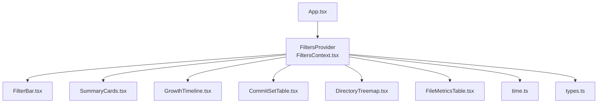
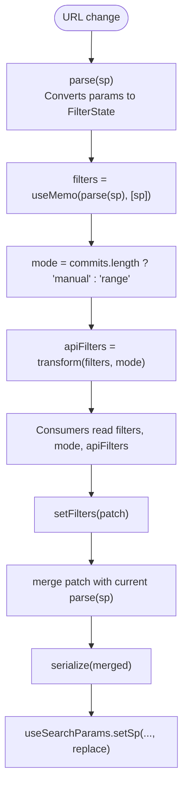
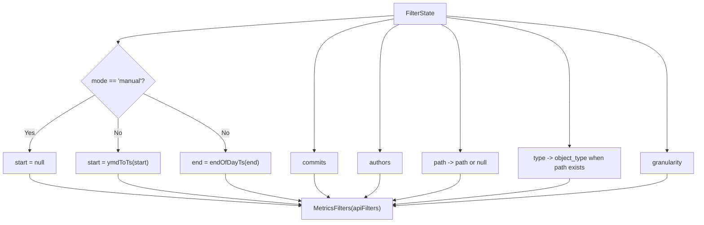
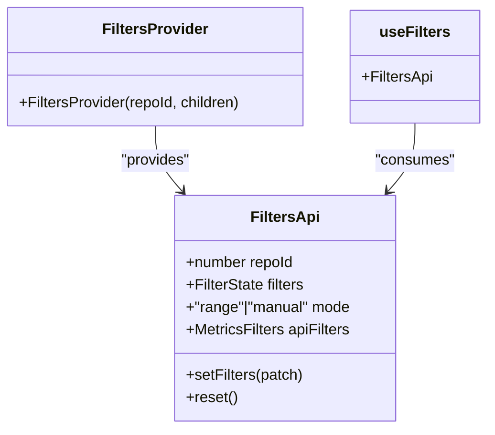
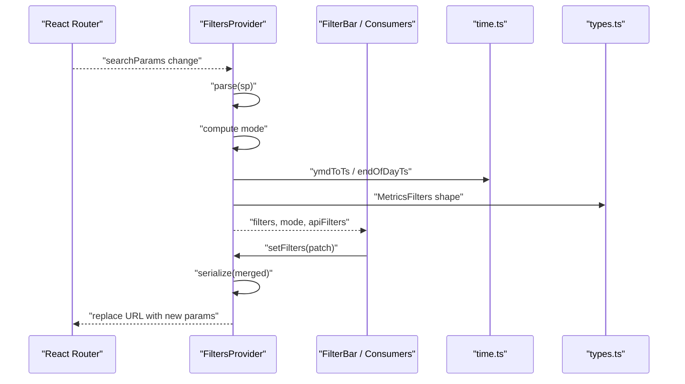
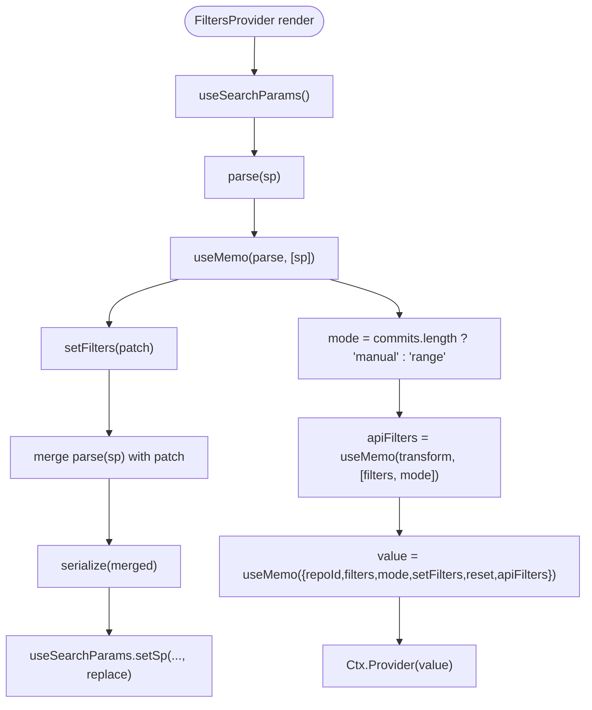
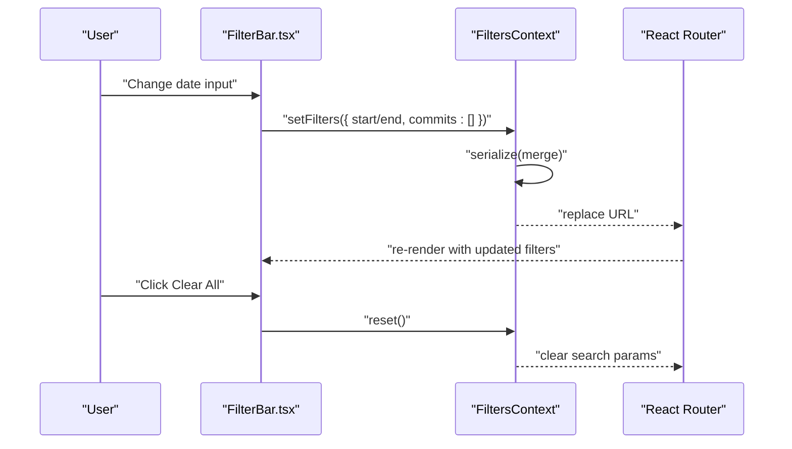
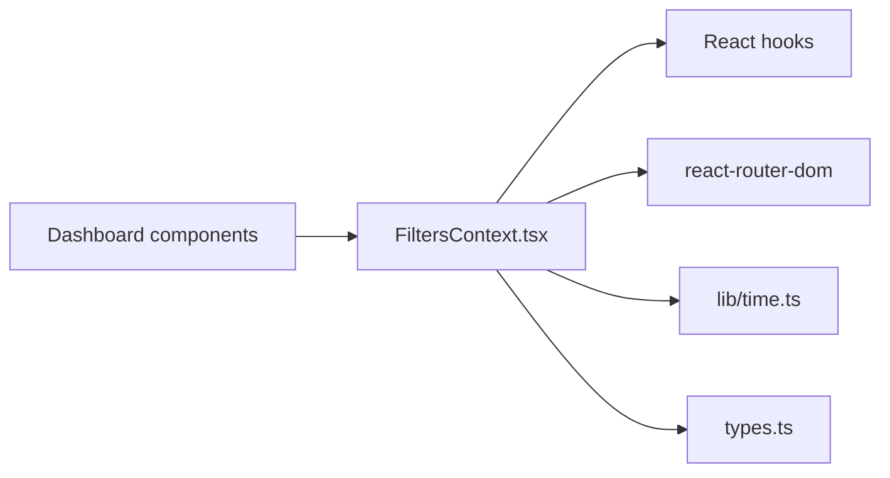

# Filters Context

<cite>
**Referenced Files in This Document**
- [FiltersContext.tsx](file://frontend/src/state/FiltersContext.tsx)
- [FilterBar.tsx](file://frontend/src/components/FilterBar.tsx)
- [time.ts](file://frontend/src/lib/time.ts)
- [types.ts](file://frontend/src/types.ts)
- [App.tsx](file://frontend/src/App.tsx)
- [SummaryCards.tsx](file://frontend/src/components/SummaryCards.tsx)
- [GrowthTimeline.tsx](file://frontend/src/components/GrowthTimeline.tsx)
- [CommitSetTable.tsx](file://frontend/src/components/CommitSetTable.tsx)
- [DirectoryTreemap.tsx](file://frontend/src/components/DirectoryTreemap.tsx)
- [FileMetricsTable.tsx](file://frontend/src/components/FileMetricsTable.tsx)
</cite>

## Table of Contents
1. [Introduction](#introduction)
2. [Project Structure](#project-structure)
3. [Core Components](#core-components)
4. [Architecture Overview](#architecture-overview)
5. [Detailed Component Analysis](#detailed-component-analysis)
6. [Dependency Analysis](#dependency-analysis)
7. [Performance Considerations](#performance-considerations)
8. [Troubleshooting Guide](#troubleshooting-guide)
9. [Conclusion](#conclusion)

## Introduction
The Filters Context is the central state manager for dashboard filters. It keeps filter values synchronized with the URL query string so that every view is shareable and bookmarkable. Consumers read a normalized `filters` object, update it through `setFilters`, and use `apiFilters` to call backend endpoints. The context also exposes a `mode` value that switches between time-range filtering and manual commit selection.

Key responsibilities:
- Parse URL parameters into a typed `FilterState`.
- Serialize `FilterState` back to URL parameters.
- Derive a backend-ready `MetricsFilters` object (`apiFilters`).
- Switch between range mode and manual mode based on whether commits are selected.
- Provide stable references via React hooks for efficient re-renders.

## Project Structure
The Filters Context lives under the frontend state layer and is consumed by multiple dashboard components.

**Diagram sources**
- [App.tsx:10-18](file://frontend/src/App.tsx#L10-L18)
- [FiltersContext.tsx:70-112](file://frontend/src/state/FiltersContext.tsx#L70-L112)
- [FilterBar.tsx:9-11](file://frontend/src/components/FilterBar.tsx#L9-L11)
- [SummaryCards.tsx:35-36](file://frontend/src/components/SummaryCards.tsx#L35-L36)
- [GrowthTimeline.tsx:15-19](file://frontend/src/components/GrowthTimeline.tsx#L15-L19)
- [CommitSetTable.tsx:13-16](file://frontend/src/components/CommitSetTable.tsx#L13-L16)
- [DirectoryTreemap.tsx:59-64](file://frontend/src/components/DirectoryTreemap.tsx#L59-L64)
- [FileMetricsTable.tsx:21-23](file://frontend/src/components/FileMetricsTable.tsx#L21-L23)
- [time.ts:1-44](file://frontend/src/lib/time.ts#L1-L44)
- [types.ts:76-87](file://frontend/src/types.ts#L76-L87)

**Section sources**
- [App.tsx:10-18](file://frontend/src/App.tsx#L10-L18)
- [FiltersContext.tsx:1-119](file://frontend/src/state/FiltersContext.tsx#L1-L119)

## Core Components
This section documents the primary types, parsing logic, serialization, API transformation, and provider contract.

### FilterState Interface
`FilterState` represents the UI-normalized filter model:
- `start`: inclusive start date as `YYYY-MM-DD`.
- `end`: inclusive end date as `YYYY-MM-DD`.
- `commits`: array of commit SHAs; when non-empty, manual mode is active.
- `authors`: array of author keys.
- `path`: scoped path (file or directory).
- `type`: object type, either file or directory.
- `gran`: timeseries granularity, one of day, week, or month.

These fields map directly to URL parameters and are transformed into `MetricsFilters` for API calls.

**Section sources**
- [FiltersContext.tsx:14-22](file://frontend/src/state/FiltersContext.tsx#L14-L22)
- [types.ts:76-87](file://frontend/src/types.ts#L76-L87)

### URL Synchronization: parse() and serialize()
The context synchronizes state with the browser URL using two functions:

- `parse(URLSearchParams)` converts URL parameters into a `FilterState`:
  - Reads `start`, `end`, `commits`, `authors`, `path`, `type`, and `gran`.
  - Normalizes comma-separated lists by trimming and filtering empty entries.
  - Defaults `type` to directory if not explicitly set to file.
  - Validates `gran` against allowed values and defaults to month.

- `serialize(FilterState)` converts a `FilterState` back into URL parameters:
  - Omits empty or default values to keep URLs clean.
  - Joins arrays like `commits` and `authors` into comma-separated strings.
  - Only includes `path` and `type` together when a path is present.
  - Only includes `gran` when it differs from the default month.

**Diagram sources**
- [FiltersContext.tsx:24-55](file://frontend/src/state/FiltersContext.tsx#L24-L55)
- [FiltersContext.tsx:77-89](file://frontend/src/state/FiltersContext.tsx#L77-L89)
- [FiltersContext.tsx:91-104](file://frontend/src/state/FiltersContext.tsx#L91-L104)

**Section sources**
- [FiltersContext.tsx:24-55](file://frontend/src/state/FiltersContext.tsx#L24-L55)

### Mode Switching: Range vs Manual
The context derives a `mode` field:
- `range`: used when no commits are selected; time range applies.
- `manual`: used when at least one commit SHA is selected; time range is ignored for API calls.

UI components can react to this mode to disable date inputs, show hints, or adjust behavior.

**Section sources**
- [FiltersContext.tsx:91-91](file://frontend/src/state/FiltersContext.tsx#L91-L91)
- [FilterBar.tsx:10-11](file://frontend/src/components/FilterBar.tsx#L10-L11)

### apiFilters Transformation
`apiFilters` translates the UI-friendly `FilterState` into the backend contract defined by `MetricsFilters`:
- `start` and `end` become UNIX timestamps in UTC seconds.
- In manual mode, `start` and `end` are set to null so the backend uses only the explicit commit list.
- `commits` and `authors` pass through unchanged.
- `path` becomes null when absent.
- `object_type` is included only when a path scope is active.
- `granularity` carries the selected bucket size.

Time helpers ensure consistent UTC handling:
- `ymdToTs` converts `YYYY-MM-DD` to midnight UTC seconds.
- `endOfDayTs` converts an inclusive end date to the exclusive end of that UTC day.

**Diagram sources**
- [FiltersContext.tsx:93-104](file://frontend/src/state/FiltersContext.tsx#L93-L104)
- [time.ts:11-28](file://frontend/src/lib/time.ts#L11-L28)
- [types.ts:76-87](file://frontend/src/types.ts#L76-L87)

**Section sources**
- [FiltersContext.tsx:93-104](file://frontend/src/state/FiltersContext.tsx#L93-L104)
- [time.ts:11-28](file://frontend/src/lib/time.ts#L11-L28)
- [types.ts:76-87](file://frontend/src/types.ts#L76-L87)

### Provider Contract and Hooks
The provider exposes:
- `repoId`: repository identifier passed from routing.
- `filters`: current parsed filter state.
- `mode`: derived mode between range and manual.
- `setFilters(patch)`: merges partial updates and writes them to the URL.
- `reset()`: clears all filters by replacing the search params with an empty set.
- `apiFilters`: memoized backend-ready filter object.

The `useFilters()` hook reads the context and throws if used outside the provider.

**Diagram sources**
- [FiltersContext.tsx:57-66](file://frontend/src/state/FiltersContext.tsx#L57-L66)
- [FiltersContext.tsx:70-112](file://frontend/src/state/FiltersContext.tsx#L70-L112)
- [FiltersContext.tsx:114-118](file://frontend/src/state/FiltersContext.tsx#L114-L118)

**Section sources**
- [FiltersContext.tsx:57-66](file://frontend/src/state/FiltersContext.tsx#L57-L66)
- [FiltersContext.tsx:70-112](file://frontend/src/state/FiltersContext.tsx#L70-L112)
- [FiltersContext.tsx:114-118](file://frontend/src/state/FiltersContext.tsx#L114-L118)

## Architecture Overview
The Filters Context integrates with React Router’s search params and supplies normalized data to dashboard components.

**Diagram sources**
- [FiltersContext.tsx:24-55](file://frontend/src/state/FiltersContext.tsx#L24-L55)
- [FiltersContext.tsx:77-104](file://frontend/src/state/FiltersContext.tsx#L77-L104)
- [time.ts:11-28](file://frontend/src/lib/time.ts#L11-L28)
- [types.ts:76-87](file://frontend/src/types.ts#L76-L87)

## Detailed Component Analysis

### FiltersContext Implementation
The implementation centers around:
- Parsing URL parameters into a normalized state.
- Serializing state changes back to the URL.
- Deriving a backend-ready filter object.
- Providing stable references for consumers.

Key behaviors:
- `parse` normalizes arrays and validates granularity.
- `serialize` omits defaults and empty values.
- `mode` switches behavior based on commit selection.
- `apiFilters` transforms dates into UTC timestamps and maps UI fields to backend fields.
- `setFilters` merges patches and replaces the URL without pushing history.
- `reset` clears all filters.

**Diagram sources**
- [FiltersContext.tsx:70-112](file://frontend/src/state/FiltersContext.tsx#L70-L112)

**Section sources**
- [FiltersContext.tsx:24-55](file://frontend/src/state/FiltersContext.tsx#L24-L55)
- [FiltersContext.tsx:70-112](file://frontend/src/state/FiltersContext.tsx#L70-L112)

### FilterBar Integration
The FilterBar demonstrates how consumers interact with the context:
- Reads `filters`, `setFilters`, `reset`, and `mode`.
- Disables date inputs when in manual mode.
- Clears commit selection when changing time range inputs.
- Shows a hint when manual mode is active and offers switching back to range mode.

**Diagram sources**
- [FilterBar.tsx:9-19](file://frontend/src/components/FilterBar.tsx#L9-L19)
- [FilterBar.tsx:26-46](file://frontend/src/components/FilterBar.tsx#L26-L46)
- [FilterBar.tsx:63-88](file://frontend/src/components/FilterBar.tsx#L63-L88)
- [FiltersContext.tsx:80-89](file://frontend/src/state/FiltersContext.tsx#L80-L89)

**Section sources**
- [FilterBar.tsx:9-19](file://frontend/src/components/FilterBar.tsx#L9-L19)
- [FilterBar.tsx:26-46](file://frontend/src/components/FilterBar.tsx#L26-L46)
- [FilterBar.tsx:63-88](file://frontend/src/components/FilterBar.tsx#L63-L88)

### Consumption Patterns Across Components
Multiple dashboard components consume the context:
- Summary cards fetch summary metrics using `apiFilters`.
- Growth timeline renders timeseries data using `apiFilters` and reacts to mode.
- Commit set table computes a cache key from `apiFilters`.
- Directory treemap and file metrics table use `apiFilters` to request filtered data.

Examples of consumption:
- Reading `apiFilters` to build API requests.
- Checking `mode` to display contextual footers or hints.
- Using `filters` to reflect current UI state.

**Section sources**
- [SummaryCards.tsx:35-36](file://frontend/src/components/SummaryCards.tsx#L35-L36)
- [GrowthTimeline.tsx:15-19](file://frontend/src/components/GrowthTimeline.tsx#L15-L19)
- [CommitSetTable.tsx:13-16](file://frontend/src/components/CommitSetTable.tsx#L13-L16)
- [DirectoryTreemap.tsx:59-64](file://frontend/src/components/DirectoryTreemap.tsx#L59-L64)
- [FileMetricsTable.tsx:21-23](file://frontend/src/components/FileMetricsTable.tsx#L21-L23)

## Dependency Analysis
The Filters Context depends on:
- React hooks for context, memoization, and callbacks.
- React Router’s `useSearchParams` for URL synchronization.
- Time utilities for UTC conversions and granularity validation.
- Shared types for API contracts and enums.

**Diagram sources**
- [FiltersContext.tsx:8-12](file://frontend/src/state/FiltersContext.tsx#L8-L12)
- [time.ts:1-44](file://frontend/src/lib/time.ts#L1-L44)
- [types.ts:1-87](file://frontend/src/types.ts#L1-L87)

**Section sources**
- [FiltersContext.tsx:8-12](file://frontend/src/state/FiltersContext.tsx#L8-L12)
- [time.ts:1-44](file://frontend/src/lib/time.ts#L1-L44)
- [types.ts:1-87](file://frontend/src/types.ts#L1-L87)

## Performance Considerations
The Filters Context uses several optimizations to minimize unnecessary re-renders:

- `useMemo(parse(sp), [sp])`: Parses URL parameters only when search params change.
- `useCallback(setFilters, [sp, setSp])`: Stabilizes the updater function across renders.
- `useCallback(reset, [setSp])`: Stabilizes the reset function.
- `useMemo(apiFilters, [filters, mode])`: Recomputes backend filters only when relevant inputs change.
- `useMemo(value, [...])`: Provides a stable context value object to avoid consumer rerenders unless dependencies change.

Best practices for consumers:
- Use `apiFilters` directly for API calls to avoid recomputation.
- Avoid creating new objects inside render loops; rely on context-provided stable references.
- Debounce expensive operations downstream if needed (for example, using debounced hooks for network requests).

[No sources needed since this section provides general guidance]

## Troubleshooting Guide
Common issues and resolutions:

- **Using `useFilters` outside the provider**:
  - Symptom: Error thrown indicating the hook must be used inside a provider.
  - Resolution: Wrap your route or component tree with `FiltersProvider`.

- **Manual mode ignores time range**:
  - Symptom: Changing start/end has no effect on results.
  - Explanation: When `commits` is non-empty, `mode` is manual and `apiFilters` sets `start` and `end` to null.
  - Resolution: Clear commits to return to range mode.

- **Invalid granularity**:
  - Symptom: Granularity falls back to month.
  - Explanation: `parse` validates granularity and defaults to month if invalid.
  - Resolution: Ensure URL contains a valid granularity value.

- **Path scope not applied**:
  - Symptom: Object type filter does not appear in API requests.
  - Explanation: `object_type` is included only when a path is present.
  - Resolution: Select a path before expecting object type filtering.

- **URL not updating after filter change**:
  - Symptom: Browser URL remains unchanged after interaction.
  - Explanation: `setFilters` uses `replace: true`; ensure you are checking the current URL rather than relying on history navigation.
  - Resolution: Inspect the current search params or refresh the page to see persisted state.

**Section sources**
- [FiltersContext.tsx:114-118](file://frontend/src/state/FiltersContext.tsx#L114-L118)
- [FiltersContext.tsx:91-104](file://frontend/src/state/FiltersContext.tsx#L91-L104)
- [FiltersContext.tsx:24-40](file://frontend/src/state/FiltersContext.tsx#L24-L40)
- [FiltersContext.tsx:43-55](file://frontend/src/state/FiltersContext.tsx#L43-L55)

## Conclusion
The Filters Context provides a robust, URL-synchronized filter system for the dashboard. It normalizes user interactions into a clear `FilterState`, switches intelligently between range and manual modes, and transforms state into a backend-ready `MetricsFilters` object. By leveraging React’s memoization and callback APIs, it minimizes re-renders while keeping the URL shareable and bookmarkable. Consumers benefit from a simple API surface: read `filters` and `apiFilters`, update via `setFilters`, and reset when needed.

[No sources needed since this section summarizes without analyzing specific files]