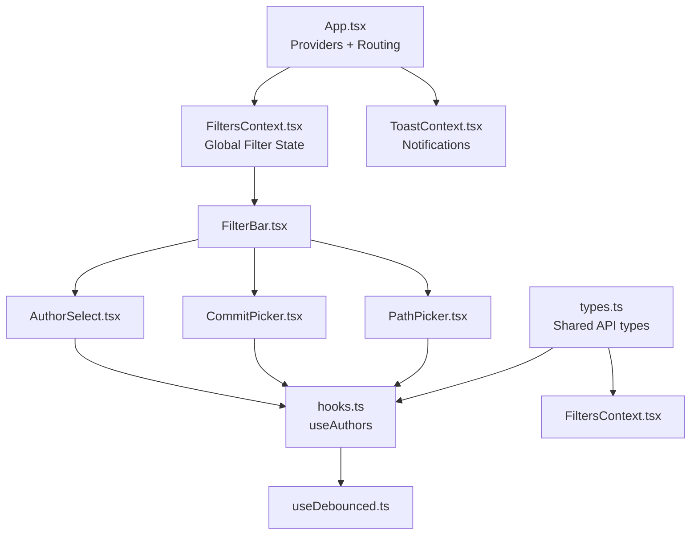
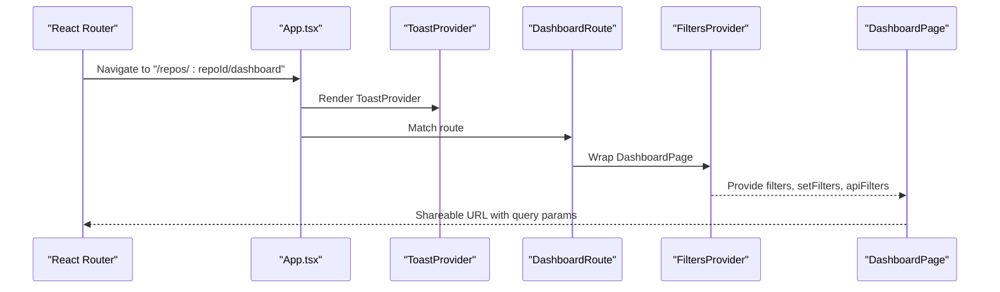
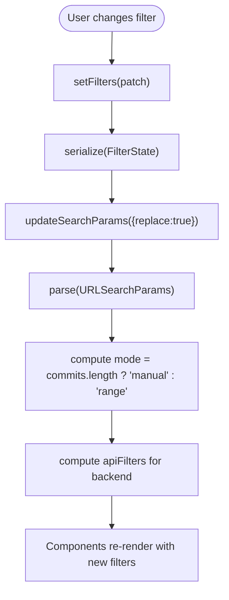
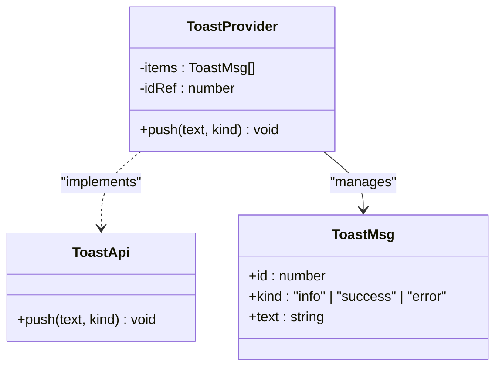
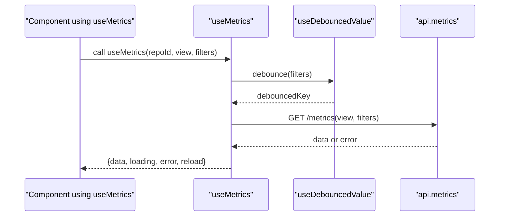
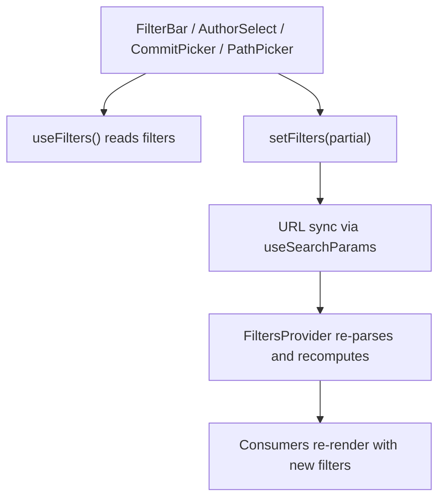
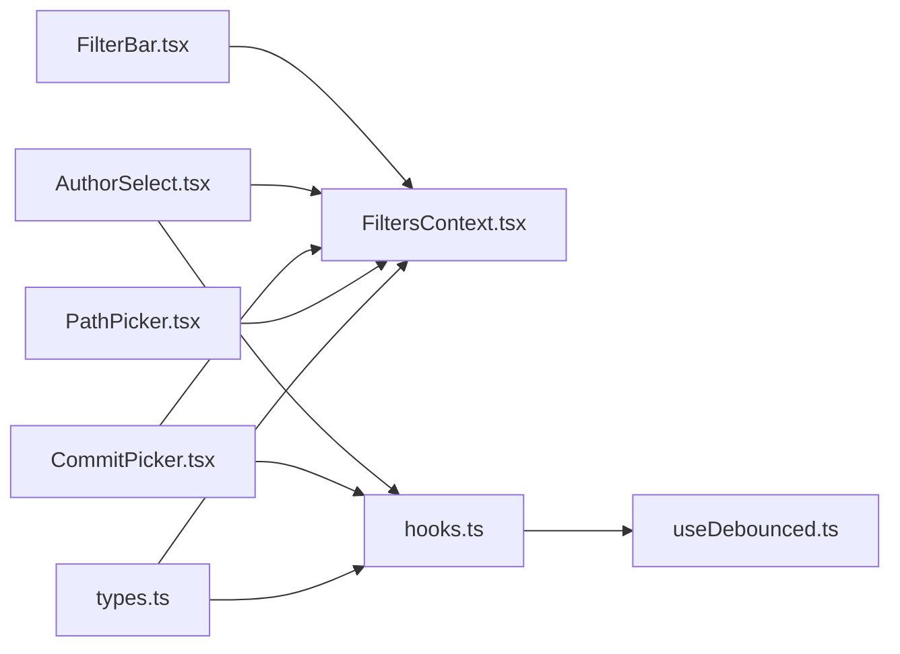

# State Management

<cite>
**Referenced Files in This Document**
- [FiltersContext.tsx](file://frontend/src/state/FiltersContext.tsx)
- [ToastContext.tsx](file://frontend/src/state/ToastContext.tsx)
- [hooks.ts](file://frontend/src/lib/hooks.ts)
- [useDebounced.ts](file://frontend/src/lib/useDebounced.ts)
- [App.tsx](file://frontend/src/App.tsx)
- [FilterBar.tsx](file://frontend/src/components/FilterBar.tsx)
- [AuthorSelect.tsx](file://frontend/src/components/AuthorSelect.tsx)
- [CommitPicker.tsx](file://frontend/src/components/CommitPicker.tsx)
- [PathPicker.tsx](file://frontend/src/components/PathPicker.tsx)
- [types.ts](file://frontend/src/types.ts)
</cite>

## Table of Contents
1. [Introduction](#introduction)
2. [Project Structure](#project-structure)
3. [Core Components](#core-components)
4. [Architecture Overview](#architecture-overview)
5. [Detailed Component Analysis](#detailed-component-analysis)
6. [Dependency Analysis](#dependency-analysis)
7. [Performance Considerations](#performance-considerations)
8. [Troubleshooting Guide](#troubleshooting-guide)
9. [Conclusion](#conclusion)

## Introduction
This document explains RAT’s frontend state management architecture, which is built on React Context and custom hooks. It focuses on:

- Global filter state through `FiltersContext`, including time range filtering, manual commit set selection, author filtering, path scoping, and timeseries granularity.
- User notifications through `ToastContext`.
- Custom data-fetching hooks for repository status, metrics, and authors.
- Debouncing utilities used to reduce network requests during rapid user input.
- URL synchronization so filters are shareable and bookmarkable.
- State persistence strategy and performance optimizations for large datasets.

The goal is to make the system understandable for both developers and product users while providing enough technical depth for maintainability and optimization.

## Project Structure
RAT’s frontend organizes state logic under `src/state` and reusable data patterns under `src/lib`. UI components consume contexts and hooks to render interactive dashboards.

**Diagram sources**
- [App.tsx:10-34](file://frontend/src/App.tsx#L10-L34)
- [FiltersContext.tsx:1-119](file://frontend/src/state/FiltersContext.tsx#L1-L119)
- [ToastContext.tsx:1-48](file://frontend/src/state/ToastContext.tsx#L1-L48)
- [FilterBar.tsx:1-93](file://frontend/src/components/FilterBar.tsx#L1-L93)
- [AuthorSelect.tsx:1-153](file://frontend/src/components/AuthorSelect.tsx#L1-L153)
- [CommitPicker.tsx:1-162](file://frontend/src/components/CommitPicker.tsx#L1-L162)
- [PathPicker.tsx:1-127](file://frontend/src/components/PathPicker.tsx#L1-L127)
- [hooks.ts:1-142](file://frontend/src/lib/hooks.ts#L1-L142)
- [useDebounced.ts:1-12](file://frontend/src/lib/useDebounced.ts#L1-L12)
- [types.ts:1-172](file://frontend/src/types.ts#L1-L172)

**Section sources**
- [App.tsx:1-38](file://frontend/src/App.tsx#L1-L38)
- [FiltersContext.tsx:1-119](file://frontend/src/state/FiltersContext.tsx#L1-L119)
- [ToastContext.tsx:1-48](file://frontend/src/state/ToastContext.tsx#L1-L48)

## Core Components
This section summarizes the primary stateful building blocks.

### FiltersContext
- Provides global filter state shared across dashboard components.
- Synchronizes state with URL query parameters for sharing and bookmarking.
- Exposes a normalized API contract for backend calls.
- Supports two modes:
  - Range mode: uses start/end dates.
  - Manual mode: uses an explicit list of commit SHAs that overrides the time range.

Key responsibilities:
- Parsing and serializing URL parameters.
- Deriving backend-ready filters.
- Providing reset and patch APIs.

**Section sources**
- [FiltersContext.tsx:1-119](file://frontend/src/state/FiltersContext.tsx#L1-L119)

### ToastContext
- Provides a simple notification system for success, error, and info messages.
- Automatically dismisses toasts after a timeout.
- Renders accessible toast elements with ARIA live regions.

**Section sources**
- [ToastContext.tsx:1-48](file://frontend/src/state/ToastContext.tsx#L1-L48)

### Data Fetching Hooks
- `useRepo`: fetches repository metadata and polls while ingestion is active.
- `useMetrics`: fetches metric views with debounced filters and keeps stale data until new data arrives.
- `useAuthors`: fetches and manages author lists with reload capability.
- `useClickOutside`: utility hook for closing dropdowns when clicking outside.

**Section sources**
- [hooks.ts:1-142](file://frontend/src/lib/hooks.ts#L1-L142)

### Debounce Utility
- `useDebouncedValue`: returns a value delayed by a configurable amount, used to throttle search inputs and filter-driven requests.

**Section sources**
- [useDebounced.ts:1-12](file://frontend/src/lib/useDebounced.ts#L1-L12)

## Architecture Overview
The application shell wraps routing and providers. The `FiltersProvider` is scoped per repository route, ensuring filters are isolated per repo. The `ToastProvider` is global.

**Diagram sources**
- [App.tsx:10-34](file://frontend/src/App.tsx#L10-L34)
- [FiltersContext.tsx:70-112](file://frontend/src/state/FiltersContext.tsx#L70-L112)

## Detailed Component Analysis

### FiltersContext: Global Filter State and URL Sync
`FiltersContext` defines a `FilterState` shape and exposes a provider plus a `useFilters` hook. It parses URL parameters into state and serializes state back to the URL. It also computes:

- `mode`: `"range"` or `"manual"`.
- `apiFilters`: a normalized object matching the backend contract.

URL parameters:
- `start`, `end`: date strings (YYYY-MM-DD).
- `commits`: comma-separated SHA list.
- `authors`: comma-separated author keys.
- `path`, `type`: object scope.
- `gran`: timeseries bucket granularity.

**Diagram sources**
- [FiltersContext.tsx:24-55](file://frontend/src/state/FiltersContext.tsx#L24-L55)
- [FiltersContext.tsx:80-104](file://frontend/src/state/FiltersContext.tsx#L80-L104)

#### Time Range Filtering
- In range mode, `start` and `end` define the inclusive UTC day boundaries.
- When manual commit selection exists, the time range is ignored for API calls.

#### Author Selection
- Authors are selected via keys; merged identities collapse into group keys.
- Selecting authors narrows the commit set.

#### Commit Set Management
- Manual commit selection overrides time range.
- Clearing the commit list returns to range mode.

#### Path Scoping
- Users can scope metrics to a specific file or directory.
- The selected path and type are included in the URL and API filters.

#### Granularity
- Timeseries buckets can be day, week, or month.
- Default is month unless explicitly changed.

**Section sources**
- [FiltersContext.tsx:14-66](file://frontend/src/state/FiltersContext.tsx#L14-L66)
- [FiltersContext.tsx:70-119](file://frontend/src/state/FiltersContext.tsx#L70-L119)
- [types.ts:76-87](file://frontend/src/types.ts#L76-L87)

### ToastContext: Notifications and Feedback
`ToastContext` provides a `push(text, kind)` function. Each toast has a unique id, kind, and text. Toasts auto-dismiss after a timeout and are rendered in an accessible container.

**Diagram sources**
- [ToastContext.tsx:5-13](file://frontend/src/state/ToastContext.tsx#L5-L13)
- [ToastContext.tsx:17-47](file://frontend/src/state/ToastContext.tsx#L17-L47)

**Section sources**
- [ToastContext.tsx:1-48](file://frontend/src/state/ToastContext.tsx#L1-L48)

### Custom Hooks: Data Fetching and Common Patterns
`hooks.ts` centralizes common data-fetching patterns:

- `useRepo(repoId, pollMs)`:
  - Fetches repository info.
  - Polls while ingestion is active.
  - Handles loading and error states.

- `useMetrics<T>(repoId, view, filters, enabled)`:
  - Debounces filters before fetching.
  - Keeps stale data visible while new data loads.
  - Exposes a `reload` method to force refetch.

- `useAuthors(repoId)`:
  - Loads author list and supports reloading.

- `useClickOutside(onOutside)`:
  - Closes popovers when clicking outside.

**Diagram sources**
- [hooks.ts:53-99](file://frontend/src/lib/hooks.ts#L53-L99)
- [useDebounced.ts:1-12](file://frontend/src/lib/useDebounced.ts#L1-L12)

**Section sources**
- [hooks.ts:1-142](file://frontend/src/lib/hooks.ts#L1-L142)
- [useDebounced.ts:1-12](file://frontend/src/lib/useDebounced.ts#L1-L12)

### Consuming Contexts and Updating Global State
Components consume `useFilters` to read and update global filter state. Examples include:

- `FilterBar.tsx`:
  - Reads `filters`, `mode`, and `setFilters`.
  - Updates time range, granularity, and clears filters.

- `AuthorSelect.tsx`:
  - Uses `useAuthors` to load options.
  - Toggles author selections and updates `filters.authors`.

- `CommitPicker.tsx`:
  - Searches and paginates commits.
  - Updates `filters.commits` and switches between manual and range modes.

- `PathPicker.tsx`:
  - Searches paths and directories.
  - Updates `filters.path` and `filters.type`.

**Diagram sources**
- [FilterBar.tsx:9-93](file://frontend/src/components/FilterBar.tsx#L9-L93)
- [AuthorSelect.tsx:42-153](file://frontend/src/components/AuthorSelect.tsx#L42-L153)
- [CommitPicker.tsx:14-162](file://frontend/src/components/CommitPicker.tsx#L14-L162)
- [PathPicker.tsx:9-127](file://frontend/src/components/PathPicker.tsx#L9-L127)
- [FiltersContext.tsx:70-119](file://frontend/src/state/FiltersContext.tsx#L70-L119)

**Section sources**
- [FilterBar.tsx:1-93](file://frontend/src/components/FilterBar.tsx#L1-L93)
- [AuthorSelect.tsx:1-153](file://frontend/src/components/AuthorSelect.tsx#L1-L153)
- [CommitPicker.tsx:1-162](file://frontend/src/components/CommitPicker.tsx#L1-L162)
- [PathPicker.tsx:1-127](file://frontend/src/components/PathPicker.tsx#L1-L127)

### Synchronizing State with URL Parameters
Filters are persisted in the URL query string. This enables:

- Sharing links with exact filters applied.
- Bookmarking filtered views.
- Navigating back/forward preserving state.

Serialization rules:
- Only non-default values are added to the URL.
- Empty arrays and defaults are omitted.
- Mode is derived from whether `commits` is populated.

Parsing rules:
- Date fields default to empty strings.
- Arrays are split and trimmed.
- Granularity is validated against allowed values.

**Section sources**
- [FiltersContext.tsx:24-55](file://frontend/src/state/FiltersContext.tsx#L24-L55)
- [FiltersContext.tsx:77-89](file://frontend/src/state/FiltersContext.tsx#L77-L89)

### State Persistence Strategy
Current implementation persists filter state to the URL query string rather than local storage. Benefits:

- Shareable and bookmarkable URLs.
- No client-side persistence conflicts.
- Easy debugging via browser address bar.

Limitations:

- URL length constraints may affect very long commit lists.
- No offline persistence beyond the current session.

Recommendations:

- For extremely large commit sets, consider pagination or server-side selection tokens.
- If offline support is required, add IndexedDB or localStorage with conflict resolution.

**Section sources**
- [FiltersContext.tsx:1-119](file://frontend/src/state/FiltersContext.tsx#L1-L119)

### Performance Optimizations for Large Datasets
Several strategies are already implemented:

- Debounced filter queries:
  - `useMetrics` debounces filter changes to avoid excessive network requests.
  - `useDebouncedValue` delays value emission for search inputs.

- Stale-while-revalidate pattern:
  - `useMetrics` retains previous data while new data loads, preventing chart flicker.

- Polling for repository ingestion:
  - `useRepo` polls only while the repository is actively being processed.

- Pagination and windowed loading:
  - `CommitPicker` uses page size and incremental loading to handle large commit lists.

- Memoization:
  - `FiltersContext` memoizes parsed filters, serialized params, computed mode, and API filters.
  - `AuthorSelect` memoizes author options and filtered results.

Additional recommendations:

- Virtualize large lists (e.g., commit rows, author lists).
- Add request deduplication for identical filter payloads.
- Cache responses with a short TTL keyed by filter signature.
- Limit maximum commit selection size to prevent URL bloat.

**Section sources**
- [hooks.ts:14-49](file://frontend/src/lib/hooks.ts#L14-L49)
- [hooks.ts:53-99](file://frontend/src/lib/hooks.ts#L53-L99)
- [CommitPicker.tsx:11-162](file://frontend/src/components/CommitPicker.tsx#L11-L162)
- [AuthorSelect.tsx:15-40](file://frontend/src/components/AuthorSelect.tsx#L15-L40)
- [FiltersContext.tsx:78-109](file://frontend/src/state/FiltersContext.tsx#L78-L109)

## Dependency Analysis
The following diagram shows how components depend on contexts and hooks.

**Diagram sources**
- [FilterBar.tsx:1-93](file://frontend/src/components/FilterBar.tsx#L1-L93)
- [AuthorSelect.tsx:1-153](file://frontend/src/components/AuthorSelect.tsx#L1-L153)
- [CommitPicker.tsx:1-162](file://frontend/src/components/CommitPicker.tsx#L1-L162)
- [PathPicker.tsx:1-127](file://frontend/src/components/PathPicker.tsx#L1-L127)
- [hooks.ts:1-142](file://frontend/src/lib/hooks.ts#L1-L142)
- [useDebounced.ts:1-12](file://frontend/src/lib/useDebounced.ts#L1-L12)
- [types.ts:1-172](file://frontend/src/types.ts#L1-L172)
- [FiltersContext.tsx:1-119](file://frontend/src/state/FiltersContext.tsx#L1-L119)

**Section sources**
- [FilterBar.tsx:1-93](file://frontend/src/components/FilterBar.tsx#L1-L93)
- [AuthorSelect.tsx:1-153](file://frontend/src/components/AuthorSelect.tsx#L1-L153)
- [CommitPicker.tsx:1-162](file://frontend/src/components/CommitPicker.tsx#L1-L162)
- [PathPicker.tsx:1-127](file://frontend/src/components/PathPicker.tsx#L1-L127)
- [hooks.ts:1-142](file://frontend/src/lib/hooks.ts#L1-L142)
- [useDebounced.ts:1-12](file://frontend/src/lib/useDebounced.ts#L1-L12)
- [types.ts:1-172](file://frontend/src/types.ts#L1-L172)
- [FiltersContext.tsx:1-119](file://frontend/src/state/FiltersContext.tsx#L1-L119)

## Performance Considerations
- Prefer debounced inputs for search and filter changes.
- Keep stale data visible during network requests to improve perceived performance.
- Avoid unnecessary re-renders by memoizing derived values.
- Use pagination and incremental loading for large lists.
- Monitor URL length when allowing large commit selections.
- Consider caching and request deduplication for repeated queries.

[No sources needed since this section provides general guidance]

## Troubleshooting Guide
Common issues and resolutions:

- Using `useFilters` outside `FiltersProvider`:
  - Symptom: Error thrown indicating missing context.
  - Resolution: Ensure the component tree is wrapped by `FiltersProvider`.

- Filters not updating the URL:
  - Check that `setFilters` is called with partial updates.
  - Verify serialization includes expected fields.

- Metrics not refreshing:
  - Confirm `enabled` flag is true.
  - Use the provided `reload` method to force refetch.

- Toasts not appearing:
  - Ensure `ToastProvider` wraps the app shell.
  - Check that `push` is invoked with valid text.

- Large commit lists causing slow UI:
  - Increase debounce delay or limit selection size.
  - Implement virtualization for long lists.

**Section sources**
- [FiltersContext.tsx:114-118](file://frontend/src/state/FiltersContext.tsx#L114-L118)
- [hooks.ts:53-99](file://frontend/src/lib/hooks.ts#L53-L99)
- [ToastContext.tsx:17-47](file://frontend/src/state/ToastContext.tsx#L17-L47)

## Conclusion
RAT’s state management combines React Context for global state and custom hooks for data fetching and common patterns. `FiltersContext` centralizes filter state and synchronizes it with the URL, enabling shareable and bookmarkable views. `ToastContext` provides lightweight user feedback. Debouncing and stale-while-revalidate strategies improve performance and UX. For large datasets, additional optimizations such as virtualization, caching, and request deduplication can further enhance responsiveness.

[No sources needed since this section summarizes without analyzing specific files]