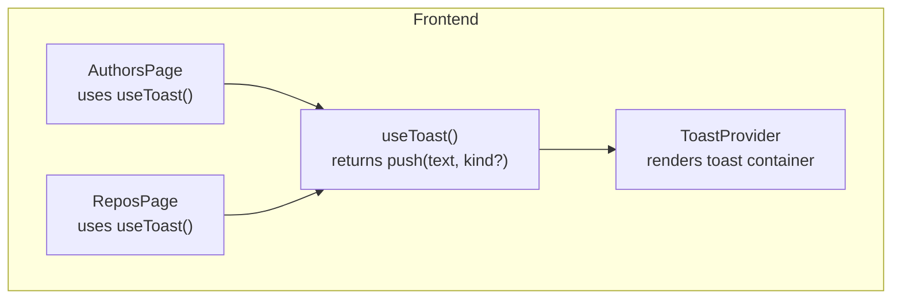
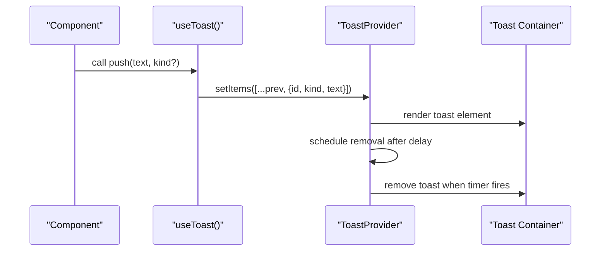
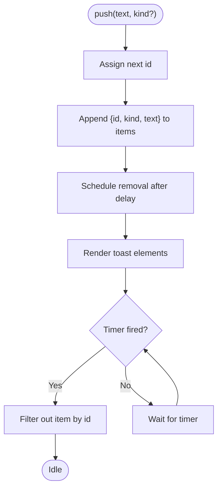
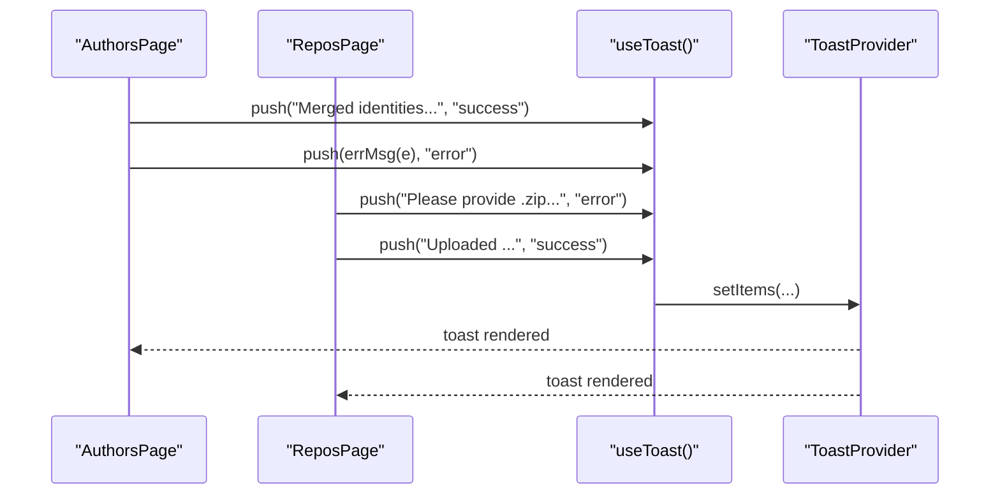
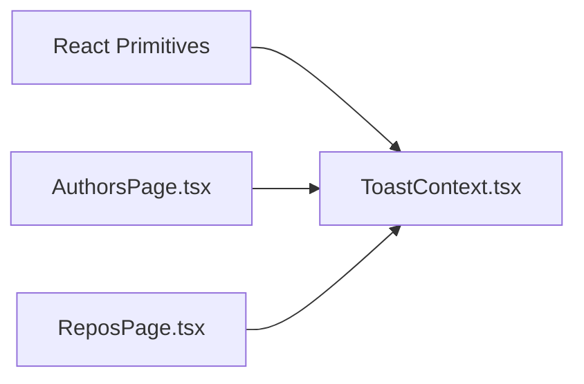

# Toast Context

<cite>
**Referenced Files in This Document**
- [ToastContext.tsx](file://frontend/src/state/ToastContext.tsx)
- [AuthorsPage.tsx](file://frontend/src/pages/AuthorsPage.tsx)
- [ReposPage.tsx](file://frontend/src/pages/ReposPage.tsx)
</cite>

## Table of Contents
1. [Introduction](#introduction)
2. [Project Structure](#project-structure)
3. [Core Components](#core-components)
4. [Architecture Overview](#architecture-overview)
5. [Detailed Component Analysis](#detailed-component-analysis)
6. [Dependency Analysis](#dependency-analysis)
7. [Performance Considerations](#performance-considerations)
8. [Troubleshooting Guide](#troubleshooting-guide)
9. [Conclusion](#conclusion)

## Introduction
This document explains the ToastContext implementation that provides user notifications and feedback across the application. It covers message types, lifecycle management, display configuration, how components trigger toasts, customization options, severity handling, queue behavior, positioning, auto-dismissal, and accessibility considerations for screen readers.

## Project Structure
The toast system is implemented as a small React context provider with a corresponding hook. Consumers import the hook and call a push function to show notifications. The provider renders a container that displays active toasts.

**Diagram sources**
- [ToastContext.tsx:17-47](file://frontend/src/state/ToastContext.tsx#L17-L47)
- [AuthorsPage.tsx:10-21](file://frontend/src/pages/AuthorsPage.tsx#L10-L21)
- [ReposPage.tsx:8-19](file://frontend/src/pages/ReposPage.tsx#L8-L19)

**Section sources**
- [ToastContext.tsx:1-47](file://frontend/src/state/ToastContext.tsx#L1-L47)
- [AuthorsPage.tsx:1-312](file://frontend/src/pages/AuthorsPage.tsx#L1-L312)
- [ReposPage.tsx:1-287](file://frontend/src/pages/ReposPage.tsx#L1-L287)

## Core Components
- ToastMessage model: Represents a single notification with an id, kind (severity), and text content.
- ToastApi: Exposes a push function to enqueue messages.
- ToastProvider: Holds toast state, assigns unique ids, renders the toast container, and schedules auto-dismissal.
- useToast: Hook that returns the ToastApi for consumers.

Key responsibilities:
- State management: Maintains the list of active toasts.
- Lifecycle: Adds new toasts and removes them after a fixed delay.
- Accessibility: Renders a live region so screen readers announce updates.
- Styling hooks: Applies semantic class names per severity.

**Section sources**
- [ToastContext.tsx:5-13](file://frontend/src/state/ToastContext.tsx#L5-L13)
- [ToastContext.tsx:17-47](file://frontend/src/state/ToastContext.tsx#L17-L47)

## Architecture Overview
The toast system follows a simple provider/consumer pattern:
- Provider holds global toast state and renders the visible toasts.
- Consumers call push to enqueue a toast.
- Auto-dismissal is handled by a timer per toast.

**Diagram sources**
- [ToastContext.tsx:21-27](file://frontend/src/state/ToastContext.tsx#L21-L27)
- [ToastContext.tsx:31-42](file://frontend/src/state/ToastContext.tsx#L31-L42)

## Detailed Component Analysis

### Toast Message Model and API
- ToastMsg fields:
  - id: Unique numeric identifier used for rendering keys and removal.
  - kind: Severity type; currently supports info, success, error.
  - text: Human-readable message content.
- ToastApi:
  - push(text: string, kind?: kind): Enqueues a toast. If kind is omitted, defaults to info.

Complexity:
- Adding a toast is O(n) due to array copy on each update.
- Removal is O(n) due to filtering by id.

Optimization opportunities:
- Use a map keyed by id for O(1) lookup and removal.
- Debounce rapid pushes if needed to reduce re-renders.

Error handling:
- No validation is performed on text or kind beyond defaulting kind to info.

**Section sources**
- [ToastContext.tsx:5-13](file://frontend/src/state/ToastContext.tsx#L5-L13)
- [ToastContext.tsx:21-27](file://frontend/src/state/ToastContext.tsx#L21-L27)

### ToastProvider Implementation
Responsibilities:
- State: Maintains items array and a monotonically increasing id counter via useRef.
- Push logic: Creates a new toast, appends it to state, and schedules its removal after a fixed timeout.
- Rendering: Provides the context value and renders a container with role="status" and aria-live="polite". Each toast gets a className combining a base class and the severity kind.

Lifecycle details:
- Auto-dismissal uses window.setTimeout with a fixed duration.
- Removal filters out the toast by id.

Accessibility:
- The container is marked as a live region with polite politeness, suitable for non-blocking status updates.

Styling hooks:
- Each toast div receives a className based on kind, enabling CSS to style success, error, and info differently.

**Diagram sources**
- [ToastContext.tsx:21-27](file://frontend/src/state/ToastContext.tsx#L21-L27)
- [ToastContext.tsx:31-42](file://frontend/src/state/ToastContext.tsx#L31-L42)

**Section sources**
- [ToastContext.tsx:17-47](file://frontend/src/state/ToastContext.tsx#L17-L47)

### Consuming Toasts in Pages
Pages consume the toast system through the useToast hook and call push at appropriate points:
- AuthorsPage:
  - Shows success toasts after merge operations.
  - Shows error toasts when operations fail.
- ReposPage:
  - Shows error toasts for invalid inputs (e.g., wrong file type).
  - Shows success toasts for upload, clone, and delete operations.
  - Shows error toasts on failures.

These usages demonstrate:
- Triggering toasts from async flows.
- Using kind to communicate severity.
- Composing dynamic messages with interpolated values.

**Diagram sources**
- [AuthorsPage.tsx:51-83](file://frontend/src/pages/AuthorsPage.tsx#L51-L83)
- [ReposPage.tsx:47-87](file://frontend/src/pages/ReposPage.tsx#L47-L87)
- [ToastContext.tsx:21-27](file://frontend/src/state/ToastContext.tsx#L21-L27)

**Section sources**
- [AuthorsPage.tsx:10-21](file://frontend/src/pages/AuthorsPage.tsx#L10-L21)
- [AuthorsPage.tsx:51-83](file://frontend/src/pages/AuthorsPage.tsx#L51-L83)
- [ReposPage.tsx:8-19](file://frontend/src/pages/ReposPage.tsx#L8-L19)
- [ReposPage.tsx:47-87](file://frontend/src/pages/ReposPage.tsx#L47-L87)

### Customizing Content and Styling
- Content:
  - Provide any string as text. Interpolation and formatting can be done before calling push.
- Styling:
  - Each toast element receives a className combining a base class and the severity kind.
  - You can add CSS rules targeting the base class and kind-specific classes to customize appearance.
- Severity mapping:
  - info: Default severity when none is provided.
  - success: Indicates a successful operation.
  - error: Indicates a failure or validation issue.

Note: There is no explicit warning severity in the current model. If you need warnings, extend the kind union and handle it in both the provider and your CSS.

**Section sources**
- [ToastContext.tsx:5-8](file://frontend/src/state/ToastContext.tsx#L5-L8)
- [ToastContext.tsx:31-42](file://frontend/src/state/ToastContext.tsx#L31-L42)

### Positioning and Display Configuration
- Positioning:
  - The provider renders a container with a specific class name. Positioning should be handled via CSS applied to this container and individual toast elements.
- Display configuration:
  - Auto-dismissal time is fixed in the implementation.
  - To change timing, adjust the timeout value in the provider’s push logic.
  - To support multiple positions (top-right, bottom-left, etc.), extend the provider to accept a position parameter and apply corresponding styles.

Current behavior:
- All toasts are rendered in a single container.
- Auto-dismissal occurs after a fixed delay.

**Section sources**
- [ToastContext.tsx:31-42](file://frontend/src/state/ToastContext.tsx#L31-L42)
- [ToastContext.tsx:21-27](file://frontend/src/state/ToastContext.tsx#L21-L27)

### Queue Management
- Queue model:
  - Active toasts are stored in an array.
  - New toasts are appended to the end.
  - Removal is by id filter.
- Concurrency:
  - Multiple toasts can be displayed simultaneously.
- Ordering:
  - First-in-first-out order is preserved by appending to the array.

Potential improvements:
- Limit maximum concurrent toasts.
- Deduplicate identical messages within a short time window.
- Support pausing auto-dismissal on hover/focus.

**Section sources**
- [ToastContext.tsx:18-27](file://frontend/src/state/ToastContext.tsx#L18-L27)

### Accessibility Considerations
- Live region:
  - The toast container uses role="status" and aria-live="polite" to announce changes without interrupting users.
- Semantic classes:
  - Kind-based classes allow assistive technologies to infer severity if combined with ARIA attributes or labels.
- Recommendations:
  - Ensure messages are concise and descriptive.
  - Avoid overly long messages that may overwhelm screen reader users.
  - Consider adding aria-labels or roles to individual toasts if more granular announcements are required.

**Section sources**
- [ToastContext.tsx:31-42](file://frontend/src/state/ToastContext.tsx#L31-L42)

## Dependency Analysis
The toast system has minimal dependencies:
- React primitives: createContext, useCallback, useContext, useMemo, useRef, useState.
- Consumers depend only on the exported useToast hook.

**Diagram sources**
- [ToastContext.tsx:2-3](file://frontend/src/state/ToastContext.tsx#L2-L3)
- [AuthorsPage.tsx:10](file://frontend/src/pages/AuthorsPage.tsx#L10)
- [ReposPage.tsx:8](file://frontend/src/pages/ReposPage.tsx#L8)

**Section sources**
- [ToastContext.tsx:1-47](file://frontend/src/state/ToastContext.tsx#L1-L47)
- [AuthorsPage.tsx:1-312](file://frontend/src/pages/AuthorsPage.tsx#L1-L312)
- [ReposPage.tsx:1-287](file://frontend/src/pages/ReposPage.tsx#L1-L287)

## Performance Considerations
- Re-render cost:
  - Each push triggers a state update and re-renders the toast container.
  - For high-frequency notifications, consider debouncing or batching.
- Memory:
  - Timers are created per toast; ensure they are cleared if the provider unmounts early.
- Optimization ideas:
  - Use a map for O(1) lookups and removals.
  - Stabilize callbacks and memoized values to prevent unnecessary re-renders in consumers.

[No sources needed since this section provides general guidance]

## Troubleshooting Guide
Common issues and resolutions:
- Toasts not appearing:
  - Verify the component tree includes ToastProvider wrapping the consumer.
  - Check that the toast container is visible in the DOM and not hidden by CSS.
- Toasts not disappearing:
  - Confirm the timeout logic is executing and not blocked by errors.
  - Ensure the component remains mounted until timers complete.
- Incorrect severity styling:
  - Validate that the kind passed to push matches one of the supported values.
  - Inspect the generated className on toast elements to confirm correct class assignment.
- Screen reader not announcing:
  - Ensure the toast container retains role="status" and aria-live="polite".
  - Keep messages concise and avoid excessive verbosity.

**Section sources**
- [ToastContext.tsx:21-27](file://frontend/src/state/ToastContext.tsx#L21-L27)
- [ToastContext.tsx:31-42](file://frontend/src/state/ToastContext.tsx#L31-L42)

## Conclusion
The ToastContext provides a lightweight, accessible notification system with clear severity semantics and straightforward integration. Components can easily trigger toasts using the useToast hook, and the provider manages lifecycle and display. Extensibility points include adding new severities, customizing positioning and styling via CSS, and refining queue behavior and timing to match product needs.

[No sources needed since this section summarizes without analyzing specific files]