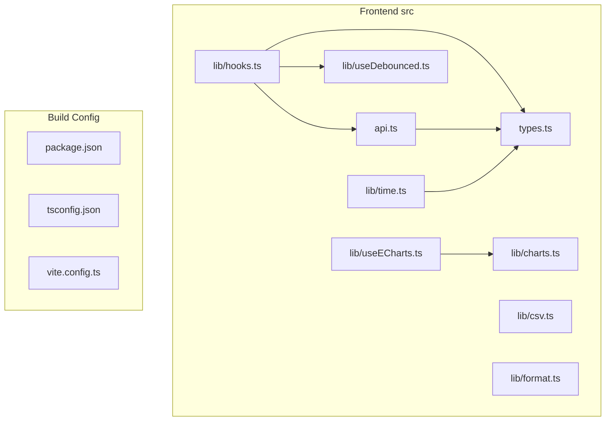
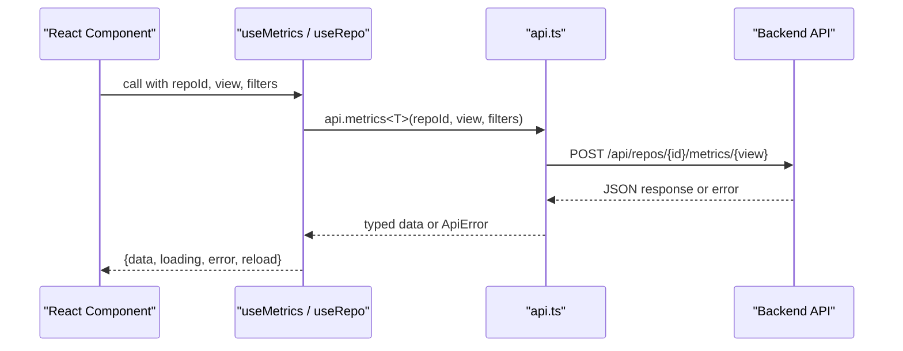
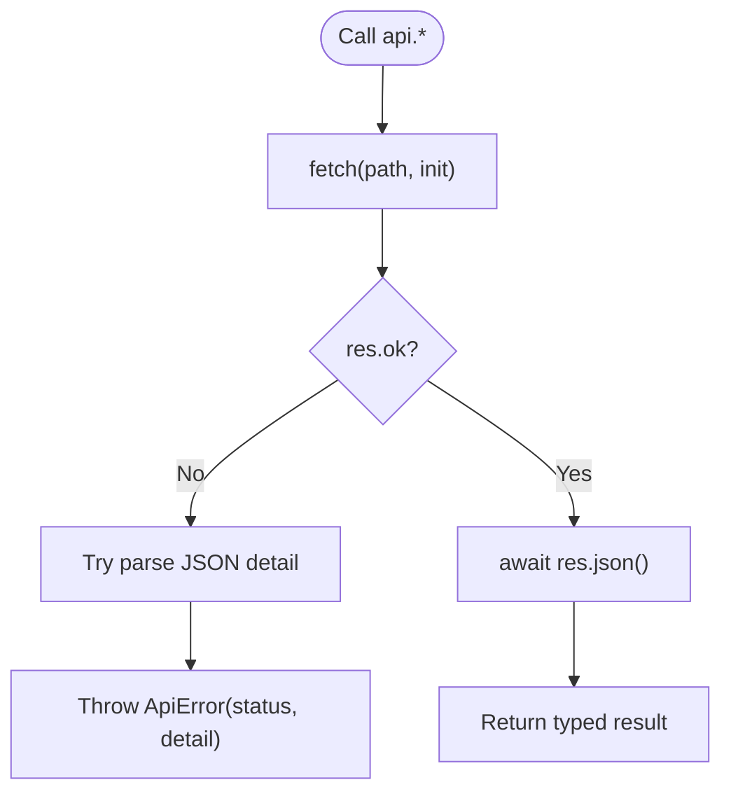
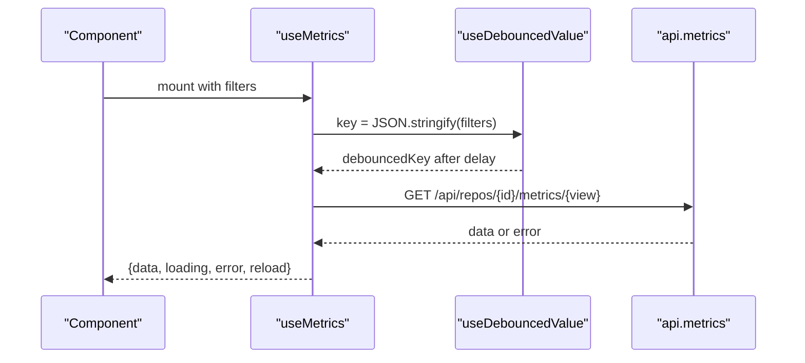
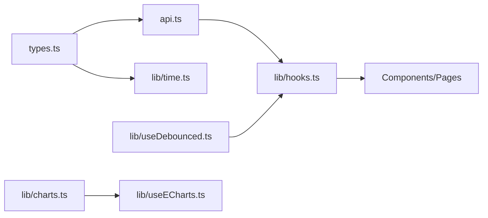

# Utilities and Libraries

<cite>
**Referenced Files in This Document**
- [api.ts](file://frontend/src/api.ts)
- [types.ts](file://frontend/src/types.ts)
- [csv.ts](file://frontend/src/lib/csv.ts)
- [format.ts](file://frontend/src/lib/format.ts)
- [time.ts](file://frontend/src/lib/time.ts)
- [charts.ts](file://frontend/src/lib/charts.ts)
- [hooks.ts](file://frontend/src/lib/hooks.ts)
- [useDebounced.ts](file://frontend/src/lib/useDebounced.ts)
- [useECharts.ts](file://frontend/src/lib/useECharts.ts)
- [package.json](file://frontend/package.json)
- [tsconfig.json](file://frontend/tsconfig.json)
- [vite.config.ts](file://frontend/vite.config.ts)
</cite>

## Table of Contents
1. [Introduction](#introduction)
2. [Project Structure](#project-structure)
3. [Core Components](#core-components)
4. [Architecture Overview](#architecture-overview)
5. [Detailed Component Analysis](#detailed-component-analysis)
6. [Dependency Analysis](#dependency-analysis)
7. [Performance Considerations](#performance-considerations)
8. [Troubleshooting Guide](#troubleshooting-guide)
9. [Conclusion](#conclusion)

## Introduction
This document explains the frontend utility libraries and helper modules that power RAT’s user interface. It focuses on:
- The typed API client for backend communication, request/response handling, and error management.
- Utility functions for CSV export, number/date formatting, time helpers, and chart configuration.
- Shared TypeScript types that mirror backend responses and enforce consistent data structures.
- Build configuration, module organization, and import/export patterns used across the application.

The goal is to help developers understand how to use these utilities, extend them safely with TypeScript, and maintain predictable behavior when integrating new features.

## Project Structure
The relevant frontend code is organized under `frontend/src`:
- `api.ts` — Typed API client and error class.
- `types.ts` — Shared type definitions mirroring backend schemas.
- `lib/` — Reusable utilities:
  - `csv.ts` — CSV download helper.
  - `format.ts` — Number and date formatting helpers.
  - `time.ts` — Calendar and granularity helpers (UTC-focused).
  - `charts.ts` — ECharts palette and shared style defaults.
  - `hooks.ts` — Data-fetching React hooks (polling, debounced metrics, authors).
  - `useDebounced.ts` — Debounced value hook.
  - `useECharts.ts` — ECharts React binding with resize handling.
- Build and module configuration:
  - `package.json` — Scripts and dependencies.
  - `tsconfig.json` — TypeScript compiler options.
  - `vite.config.ts` — Vite dev server proxy and chunk splitting.

**Diagram sources**
- [api.ts:1-127](file://frontend/src/api.ts#L1-L127)
- [types.ts:1-172](file://frontend/src/types.ts#L1-L172)
- [csv.ts:1-22](file://frontend/src/lib/csv.ts#L1-L22)
- [format.ts:1-45](file://frontend/src/lib/format.ts#L1-L45)
- [time.ts:1-44](file://frontend/src/lib/time.ts#L1-L44)
- [charts.ts:1-47](file://frontend/src/lib/charts.ts#L1-L47)
- [hooks.ts:1-142](file://frontend/src/lib/hooks.ts#L1-L142)
- [useDebounced.ts:1-12](file://frontend/src/lib/useDebounced.ts#L1-L12)
- [useECharts.ts:1-55](file://frontend/src/lib/useECharts.ts#L1-L55)
- [package.json:1-25](file://frontend/package.json#L1-L25)
- [tsconfig.json:1-20](file://frontend/tsconfig.json#L1-L20)
- [vite.config.ts:1-27](file://frontend/vite.config.ts#L1-L27)

**Section sources**
- [package.json:1-25](file://frontend/package.json#L1-L25)
- [tsconfig.json:1-20](file://frontend/tsconfig.json#L1-L20)
- [vite.config.ts:1-27](file://frontend/vite.config.ts#L1-L27)

## Core Components
- Typed API client (`api.ts`)
  - Centralized fetch wrapper with JSON serialization and error mapping.
  - Strongly-typed endpoints for repositories, authors, commits, paths, and metrics views.
- Shared types (`types.ts`)
  - Mirrors backend response schemas and enforces consistent shapes across components.
- CSV export (`lib/csv.ts`)
  - Minimal Blob-based CSV download with safe escaping.
- Formatting helpers (`lib/format.ts`)
  - Number, percentage, rate, date, datetime, truncation, and relative path helpers.
- Time helpers (`lib/time.ts`)
  - UTC-centric calendar math, granularity transitions, and bucket boundary calculations.
- Chart utilities (`lib/charts.ts`)
  - Palette, axis/tooltip base styles, and diverging color generator.
- React hooks (`lib/hooks.ts`, `lib/useDebounced.ts`, `lib/useECharts.ts`)
  - Polling repository status, debounced metric queries, author list fetching, click-outside helper, and ECharts lifecycle management.

**Section sources**
- [api.ts:1-127](file://frontend/src/api.ts#L1-L127)
- [types.ts:1-172](file://frontend/src/types.ts#L1-L172)
- [csv.ts:1-22](file://frontend/src/lib/csv.ts#L1-L22)
- [format.ts:1-45](file://frontend/src/lib/format.ts#L1-L45)
- [time.ts:1-44](file://frontend/src/lib/time.ts#L1-L44)
- [charts.ts:1-47](file://frontend/src/lib/charts.ts#L1-L47)
- [hooks.ts:1-142](file://frontend/src/lib/hooks.ts#L1-L142)
- [useDebounced.ts:1-12](file://frontend/src/lib/useDebounced.ts#L1-L12)
- [useECharts.ts:1-55](file://frontend/src/lib/useECharts.ts#L1-L55)

## Architecture Overview
The frontend uses a small, focused architecture:
- Types define contracts between UI and backend.
- The API client encapsulates HTTP calls and errors.
- Hooks orchestrate data fetching, polling, and debouncing.
- Utilities provide formatting, CSV export, and chart styling.
- Vite proxies `/api` requests to the backend during development and serves static assets in production.

**Diagram sources**
- [hooks.ts:51-99](file://frontend/src/lib/hooks.ts#L51-L99)
- [api.ts:26-52](file://frontend/src/api.ts#L26-L52)
- [api.ts:107-125](file://frontend/src/api.ts#L107-L125)

## Detailed Component Analysis

### API Client (`api.ts`)
Responsibilities:
- Provide a generic `request<T>` function that wraps `fetch`, parses JSON, and throws a typed `ApiError`.
- Serialize JSON payloads via a helper.
- Export an `api` object with strongly-typed methods for repositories, authors, commits, paths, and metrics views.

Key behaviors:
- Network failures throw `ApiError` with status 0 and a user-friendly message.
- Non-OK responses attempt to extract a `detail` string from JSON; otherwise fall back to status text.
- All endpoint paths are relative, enabling both Vite dev proxy and production single-port serving.

**Diagram sources**
- [api.ts:17-44](file://frontend/src/api.ts#L17-L44)

Usage examples:
- List repositories: call `api.listRepos()` to get `RepoInfo[]`.
- Get commits with filters: call `api.getCommits(repoId, { q, start, end, limit, offset })`.
- Fetch metrics: call `api.summary(repoId, filters)` or `api.files(repoId, filters)`, etc.

Extending the API client:
- Add a new endpoint by defining a method on the exported `api` object and typing its return value using types from `types.ts`.
- For POST bodies, wrap the payload with the internal `json` helper to set headers and stringify.

Type safety:
- Each method returns a Promise of a specific type, ensuring compile-time checks in components.

Error handling:
- Catch `ApiError` in components or hooks to display meaningful messages.
- Use `e.status` to differentiate network vs server errors.

**Section sources**
- [api.ts:17-52](file://frontend/src/api.ts#L17-L52)
- [api.ts:54-127](file://frontend/src/api.ts#L54-L127)

### Shared Types (`types.ts`)
Purpose:
- Define all data models exchanged with the backend, including repository info, authors, commits, paths, metrics filters, and various metric views.

Highlights:
- Granularity enum-like union: `"day" | "week" | "month"`.
- Repository lifecycle statuses: pending, cloning, extracting, indexing, ready, error.
- Metrics filters support optional range, commit sets, authors, path/object-type scoping, pagination, and change-only filtering.
- Metric responses include derived metrics like added, removed, growth, churn, modifications, modification frequency, and churn rate.

Using types:
- Import types directly where needed (e.g., `MetricsFilters`, `SummaryResponse`).
- Ensure any new backend fields are mirrored here to keep the UI type-safe.

Extending types:
- Add new interfaces for new endpoints and update consumers accordingly.
- Prefer composition (e.g., `DerivedMetrics`) to avoid duplication.

**Section sources**
- [types.ts:1-172](file://frontend/src/types.ts#L1-L172)

### CSV Export (`lib/csv.ts`)
Functionality:
- `downloadCsv(filename, headers, rows)` creates a Blob, generates an object URL, triggers a download, and cleans up resources.
- Safely escapes values containing commas, quotes, or newlines.

Usage example:
- Build a table of file metrics into rows and headers, then call `downloadCsv("metrics.csv", headers, rows)`.

Extending:
- Add optional parameters for custom delimiters or encoding if needed.
- Integrate with pagination by streaming chunks if datasets become large.

**Section sources**
- [csv.ts:1-22](file://frontend/src/lib/csv.ts#L1-L22)

### Formatting Helpers (`lib/format.ts`)
Functions:
- `fmtInt(n)`: formats integers with locale-aware grouping; returns “–” for null/undefined/NaN.
- `fmtSigned(n)`: formats signed integers with explicit “+” sign for positive values.
- `fmtRate(n, digits)`: formats rates with fixed decimal places.
- `fmtPct(n, digits)`: formats percentages.
- `fmtDate(ts)`: formats UNIX seconds to ISO date string (YYYY-MM-DD).
- `fmtDateTime(ts)`: formats UNIX seconds to date + time in UTC.
- `truncate(s, max)`: truncates strings with ellipsis.
- `relPathName(path, scope)`: makes a path relative to a directory scope.

Usage examples:
- Display commit counts with `fmtInt(row.commit_count)`.
- Show author churn as a percentage with `fmtPct(row.churn)`.
- Format timestamps with `fmtDateTime(commit.committer_ts)`.

Extending:
- Add currency or unit formatters following the same null/NaN guard pattern.

**Section sources**
- [format.ts:1-45](file://frontend/src/lib/format.ts#L1-L45)

### Time Helpers (`lib/time.ts`)
Responsibilities:
- Enforce UTC semantics for metric boundaries.
- Convert between YYYY-MM-DD strings and UNIX seconds.
- Compute inclusive/exclusive day boundaries.
- Calculate exclusive end timestamps for timeseries buckets based on granularity.
- Navigate between granularities (“day”, “week”, “month”).

Key functions:
- `ymdToTs(ymd)`: parse date string to UNIX seconds at UTC midnight.
- `tsToYmd(ts)`: convert UNIX seconds to YYYY-MM-DD.
- `endOfDayTs(ymd)`: compute exclusive end of day timestamp.
- `bucketEndTs(bucket, gran)`: compute exclusive end of a bucket.
- `nextGran(gran, dir)`: move forward/backward in granularity.

Usage examples:
- Build filter ranges from date pickers using `ymdToTs` and `endOfDayTs`.
- Translate brush selections into time-range filters using `bucketEndTs`.

Extending:
- Add more granularities by updating `isGran`, `nextGran`, and `bucketEndTs`.

**Section sources**
- [time.ts:1-44](file://frontend/src/lib/time.ts#L1-L44)

### Chart Utilities (`lib/charts.ts`)
Contents:
- Color palette constants for series and UI elements.
- Base axis and tooltip configurations for ECharts.
- `divergingColor(value, maxAbs)`: maps numeric values to colors between red/grey/green.

Usage examples:
- Apply `C.series` to ECharts series arrays.
- Use `axisBase` and `tooltipBase` to standardize chart appearance.
- Generate diverging colors for growth indicators.

Extending:
- Add new theme tokens or helper color generators while keeping consistency.

**Section sources**
- [charts.ts:1-47](file://frontend/src/lib/charts.ts#L1-L47)

### React Hooks (`lib/hooks.ts`, `lib/useDebounced.ts`, `lib/useECharts.ts`)

#### Data-fetching hooks (`hooks.ts`)
- `useRepo(repoId, pollMs)`: fetches repository info and polls until ingestion completes.
- `useMetrics<T>(repoId, view, filters, enabled)`: debounced metric queries with stale data retention.
- `useAuthors(repoId)`: fetches and manages author lists with reload capability.
- `useClickOutside(onOutside)`: closes dropdowns when clicking outside.

Behavior highlights:
- Uses `api` client for all network calls.
- Debounces filter-driven requests to reduce load.
- Keeps previous data visible while new requests are in flight.

**Diagram sources**
- [hooks.ts:51-99](file://frontend/src/lib/hooks.ts#L51-L99)
- [useDebounced.ts:1-12](file://frontend/src/lib/useDebounced.ts#L1-L12)
- [api.ts:107-125](file://frontend/src/api.ts#L107-L125)

#### Debounced value hook (`useDebounced.ts`)
- Returns a delayed version of a value, useful for throttling API calls triggered by user input.

#### ECharts hook (`useECharts.ts`)
- Lazily initializes ECharts when the container mounts.
- Observes container size changes and resizes charts.
- Applies option diffs efficiently and disposes instances on cleanup.

Usage examples:
- Wrap chart containers with `useECharts(option, events)` to manage lifecycle.
- Pass ECharts event handlers through the `events` parameter.

**Section sources**
- [hooks.ts:1-142](file://frontend/src/lib/hooks.ts#L1-L142)
- [useDebounced.ts:1-12](file://frontend/src/lib/useDebounced.ts#L1-L12)
- [useECharts.ts:1-55](file://frontend/src/lib/useECharts.ts#L1-L55)

## Dependency Analysis
High-level relationships:
- `hooks.ts` depends on `api.ts`, `types.ts`, and `useDebounced.ts`.
- `api.ts` depends on `types.ts`.
- `time.ts` depends on `types.ts` for granularity types.
- `useECharts.ts` depends on `echarts` and provides chart integration utilities.
- `charts.ts` provides shared styling consumed by chart implementations.

**Diagram sources**
- [api.ts:1-127](file://frontend/src/api.ts#L1-L127)
- [types.ts:1-172](file://frontend/src/types.ts#L1-L172)
- [time.ts:1-44](file://frontend/src/lib/time.ts#L1-L44)
- [hooks.ts:1-142](file://frontend/src/lib/hooks.ts#L1-L142)
- [useDebounced.ts:1-12](file://frontend/src/lib/useDebounced.ts#L1-L12)
- [charts.ts:1-47](file://frontend/src/lib/charts.ts#L1-L47)
- [useECharts.ts:1-55](file://frontend/src/lib/useECharts.ts#L1-L55)

**Section sources**
- [api.ts:1-127](file://frontend/src/api.ts#L1-L127)
- [types.ts:1-172](file://frontend/src/types.ts#L1-L172)
- [hooks.ts:1-142](file://frontend/src/lib/hooks.ts#L1-L142)
- [time.ts:1-44](file://frontend/src/lib/time.ts#L1-L44)
- [charts.ts:1-47](file://frontend/src/lib/charts.ts#L1-L47)
- [useECharts.ts:1-55](file://frontend/src/lib/useECharts.ts#L1-L55)

## Performance Considerations
- Debounced metric queries prevent excessive network requests when filters change rapidly.
- Stale data retention avoids visual flicker during data refreshes.
- ECharts instance disposal and ResizeObserver usage ensure memory efficiency and responsive resizing.
- Manual chunk splitting separates heavy libraries (ECharts, React) to improve initial load performance.

[No sources needed since this section provides general guidance]

## Troubleshooting Guide
Common issues and resolutions:
- Backend unreachable:
  - The API client throws `ApiError` with status 0 and a descriptive message. Check that the backend is running and reachable.
- Non-OK HTTP responses:
  - Errors include the server-provided `detail` when available; inspect the message to diagnose backend validation or routing issues.
- Development proxy misconfiguration:
  - Ensure `/api` is proxied to the backend port in Vite config.
- Chart not rendering:
  - Verify the container exists before initialization; `useECharts` handles late mounting but requires a DOM element.
- Type mismatches:
  - Align frontend types with backend schema changes in `types.ts`; strict TS settings will surface mismatches early.

**Section sources**
- [api.ts:17-44](file://frontend/src/api.ts#L17-L44)
- [vite.config.ts:6-13](file://frontend/vite.config.ts#L6-L13)
- [useECharts.ts:16-37](file://frontend/src/lib/useECharts.ts#L16-L37)

## Conclusion
RAT’s frontend utilities provide a cohesive foundation for data fetching, formatting, visualization, and type safety:
- The typed API client centralizes backend communication and error handling.
- Shared types ensure consistency between frontend and backend.
- Utility functions simplify common tasks like CSV export, formatting, and time calculations.
- Hooks abstract complex stateful logic such as polling and debounced queries.
- Build configuration optimizes developer experience and runtime performance.

Adhering to these patterns helps maintain a clean, scalable, and type-safe frontend.