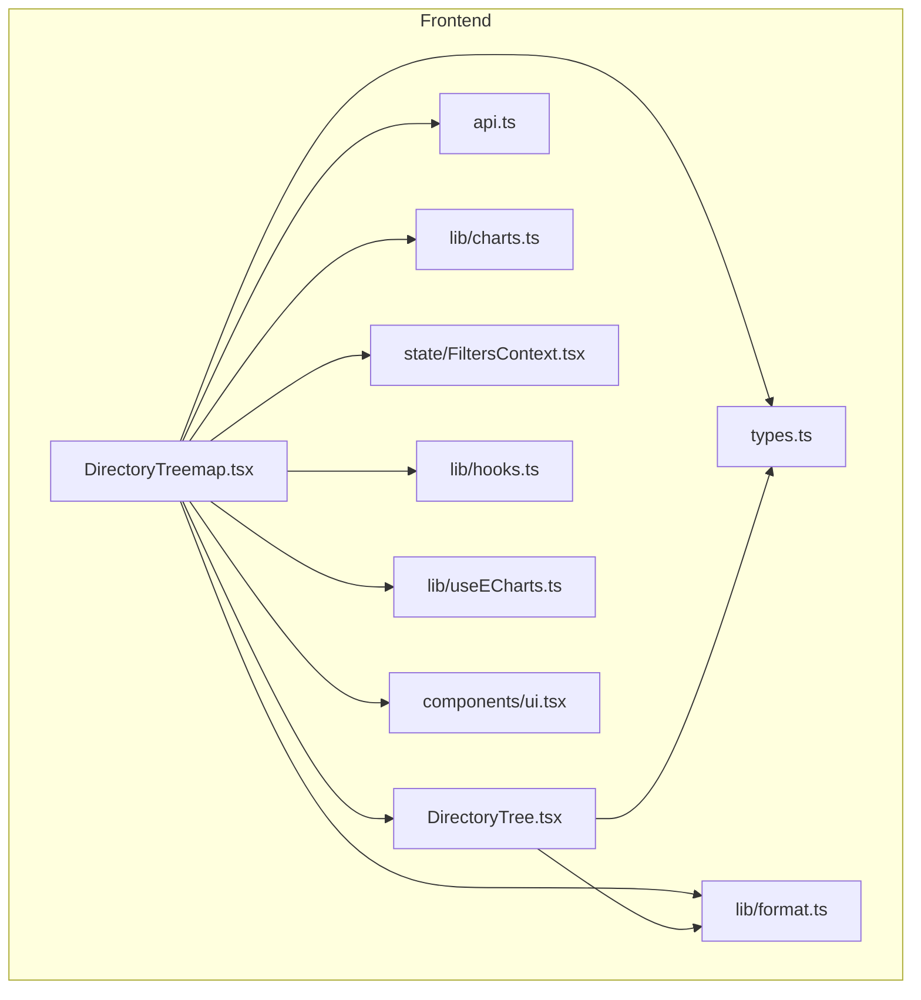
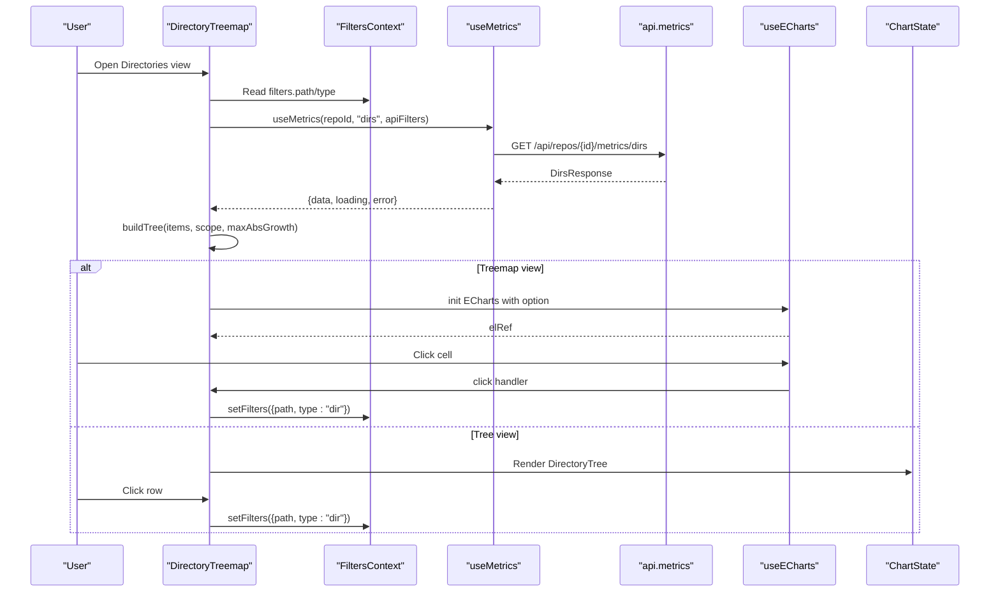
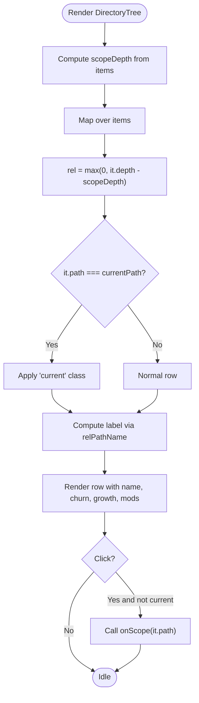
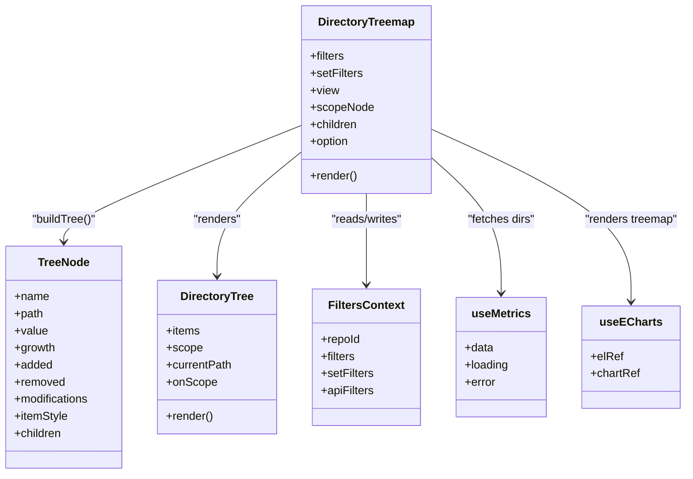
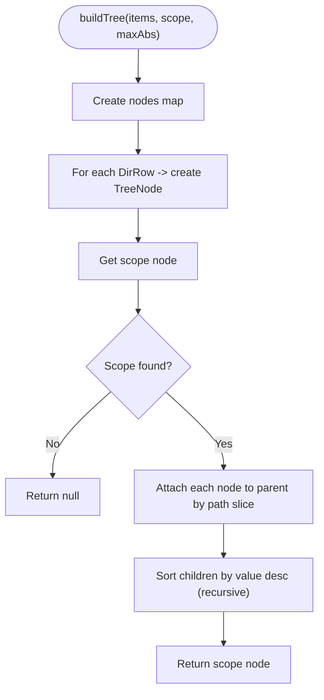
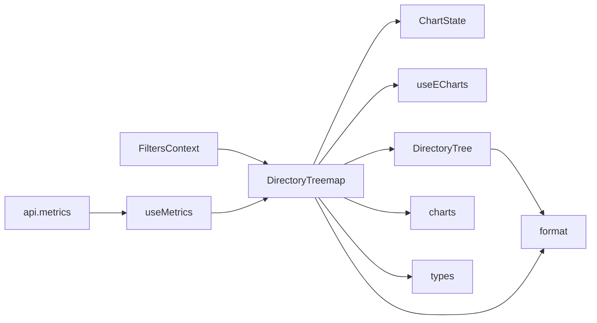

# Directory Tree Component

<cite>
**Referenced Files in This Document**
- [DirectoryTree.tsx](file://frontend/src/components/DirectoryTree.tsx)
- [DirectoryTreemap.tsx](file://frontend/src/components/DirectoryTreemap.tsx)
- [types.ts](file://frontend/src/types.ts)
- [api.ts](file://frontend/src/api.ts)
- [format.ts](file://frontend/src/lib/format.ts)
- [charts.ts](file://frontend/src/lib/charts.ts)
- [FiltersContext.tsx](file://frontend/src/state/FiltersContext.tsx)
- [hooks.ts](file://frontend/src/lib/hooks.ts)
- [useECharts.ts](file://frontend/src/lib/useECharts.ts)
- [ui.tsx](file://frontend/src/components/ui.tsx)
</cite>

## Table of Contents
1. [Introduction](#introduction)
2. [Project Structure](#project-structure)
3. [Core Components](#core-components)
4. [Architecture Overview](#architecture-overview)
5. [Detailed Component Analysis](#detailed-component-analysis)
6. [Dependency Analysis](#dependency-analysis)
7. [Performance Considerations](#performance-considerations)
8. [Troubleshooting Guide](#troubleshooting-guide)
9. [Conclusion](#conclusion)

## Introduction
This document explains the Directory Tree feature used to explore repository directory metrics. It provides two complementary views:
- A treemap visualization where cell size represents churn and color encodes growth.
- A hierarchical tree list showing directories with indentation by depth, along with churn, growth, and modification counts.

Both views allow scoping all metrics to a selected directory, updating filters and re-fetching data accordingly. The component integrates with shared state, API client, charting utilities, and formatting helpers.

## Project Structure
The Directory Tree feature lives under the frontend React application:
- Presentational components: DirectoryTree (tree list), DirectoryTreemap (treemap + tree toggle).
- Shared types define the shape of directory rows and responses.
- Utilities provide number/path formatting, chart colors, and ECharts binding.
- State context manages URL-synced filters that drive data fetching.
- Hooks encapsulate debounced metric fetching and chart lifecycle.

**Diagram sources**
- [DirectoryTreemap.tsx:1-198](file://frontend/src/components/DirectoryTreemap.tsx#L1-L198)
- [DirectoryTree.tsx:1-55](file://frontend/src/components/DirectoryTree.tsx#L1-L55)
- [types.ts:104-121](file://frontend/src/types.ts#L104-L121)
- [api.ts:107-125](file://frontend/src/api.ts#L107-L125)
- [format.ts:39-44](file://frontend/src/lib/format.ts#L39-L44)
- [charts.ts:35-46](file://frontend/src/lib/charts.ts#L35-L46)
- [FiltersContext.tsx:70-112](file://frontend/src/state/FiltersContext.tsx#L70-L112)
- [hooks.ts:51-99](file://frontend/src/lib/hooks.ts#L51-L99)
- [useECharts.ts:9-53](file://frontend/src/lib/useECharts.ts#L9-L53)
- [ui.tsx:36-64](file://frontend/src/components/ui.tsx#L36-L64)

**Section sources**
- [DirectoryTreemap.tsx:1-198](file://frontend/src/components/DirectoryTreemap.tsx#L1-L198)
- [DirectoryTree.tsx:1-55](file://frontend/src/components/DirectoryTree.tsx#L1-L55)
- [types.ts:104-121](file://frontend/src/types.ts#L104-L121)
- [api.ts:107-125](file://frontend/src/api.ts#L107-L125)
- [format.ts:39-44](file://frontend/src/lib/format.ts#L39-L44)
- [charts.ts:35-46](file://frontend/src/lib/charts.ts#L35-L46)
- [FiltersContext.tsx:70-112](file://frontend/src/state/FiltersContext.tsx#L70-L112)
- [hooks.ts:51-99](file://frontend/src/lib/hooks.ts#L51-L99)
- [useECharts.ts:9-53](file://frontend/src/lib/useECharts.ts#L9-L53)
- [ui.tsx:36-64](file://frontend/src/components/ui.tsx#L36-L64)

## Core Components
- DirectoryTree: Renders an indented list of directories with churn, growth, and modifications. Clicking a row scopes metrics to that path.
- DirectoryTreemap: Orchestrates data fetching, builds a hierarchical node structure for ECharts treemap, renders either treemap or tree view, and updates global filters on selection.

Key responsibilities:
- Data shaping: Convert flat directory rows into a nested tree for visualization.
- Filtering: Derive scope from current filters; update filters when users select a directory.
- Visualization: Use ECharts for treemap; render a simple DOM-based tree list otherwise.
- UX: Provide tooltips, empty/error/loading states, and navigation “Up” button.

**Section sources**
- [DirectoryTree.tsx:1-55](file://frontend/src/components/DirectoryTree.tsx#L1-L55)
- [DirectoryTreemap.tsx:1-198](file://frontend/src/components/DirectoryTreemap.tsx#L1-L198)

## Architecture Overview
The Directory Treemap component is the entry point for this feature. It:
- Reads current filters (including selected directory path) from global state.
- Fetches directory metrics via a debounced hook.
- Builds a tree of nodes sized by churn and colored by growth.
- Renders either an ECharts treemap or a DOM tree list based on user preference.
- Updates filters when a directory is clicked, causing dependent charts and tables to refresh.

**Diagram sources**
- [DirectoryTreemap.tsx:58-123](file://frontend/src/components/DirectoryTreemap.tsx#L58-L123)
- [hooks.ts:51-99](file://frontend/src/lib/hooks.ts#L51-L99)
- [api.ts:107-125](file://frontend/src/api.ts#L107-L125)
- [useECharts.ts:9-53](file://frontend/src/lib/useECharts.ts#L9-L53)
- [ui.tsx:36-64](file://frontend/src/components/ui.tsx#L36-L64)
- [FiltersContext.tsx:70-112](file://frontend/src/state/FiltersContext.tsx#L70-L112)

## Detailed Component Analysis

### DirectoryTree Component
Purpose:
- Display directories in a hierarchical list with indentation proportional to depth relative to the current scope.
- Show churn, signed growth, and modification counts per directory.
- Allow scoping metrics by clicking a row.

Behavior highlights:
- Indentation is computed as the difference between each item’s depth and the scope’s depth.
- Current path is highlighted.
- Relative path names are shown using a helper that strips the scope prefix.
- Growth values are color-coded positive/negative.

Props:
- items: Array of DirRow objects.
- scope: Current directory scope path.
- currentPath: Currently selected path.
- onScope: Callback to set a new directory scope.

Data model:
- DirRow includes derived metrics plus path and depth.

Formatting:
- Uses shared formatters for integers and signed numbers.
- Uses relPathName to show paths relative to the scope.

Accessibility and UX:
- Rows have titles explaining behavior.
- Clicking the currently selected row does nothing (prevents redundant updates).

**Diagram sources**
- [DirectoryTree.tsx:17-53](file://frontend/src/components/DirectoryTree.tsx#L17-L53)
- [format.ts:39-44](file://frontend/src/lib/format.ts#L39-L44)

**Section sources**
- [DirectoryTree.tsx:1-55](file://frontend/src/components/DirectoryTree.tsx#L1-L55)
- [types.ts:113-116](file://frontend/src/types.ts#L113-L116)
- [format.ts:39-44](file://frontend/src/lib/format.ts#L39-L44)

### DirectoryTreemap Component
Purpose:
- Provide a dual-mode interface (treemap/tree) for exploring directory-level metrics.
- Build a hierarchical node structure for ECharts treemap.
- Update global filters when a directory is selected.

Key logic:
- Determines effective scope: if a file is selected, scope is empty; otherwise uses filters.path.
- Fetches directory metrics using useMetrics with the “dirs” view.
- Computes max absolute growth to normalize diverging colors.
- Builds a tree map keyed by path, attaches children to parents, sorts children by value, and returns the scope node.
- Configures ECharts treemap series with custom tooltip formatter and styling.
- Handles clicks on treemap cells to set filters to the clicked directory.
- Provides an “Up” button to navigate to parent directory.
- Delegates rendering to either ECharts treemap or DirectoryTree based on view mode.

Data flow:
- FiltersContext supplies repoId, filters, and setFilters.
- useMetrics debounces filter changes and keeps previous data while loading new data.
- api.metrics calls backend endpoint for directory metrics.

**Diagram sources**
- [DirectoryTreemap.tsx:14-56](file://frontend/src/components/DirectoryTreemap.tsx#L14-L56)
- [DirectoryTreemap.tsx:58-198](file://frontend/src/components/DirectoryTreemap.tsx#L58-L198)
- [DirectoryTree.tsx:7-54](file://frontend/src/components/DirectoryTree.tsx#L7-L54)
- [FiltersContext.tsx:70-112](file://frontend/src/state/FiltersContext.tsx#L70-L112)
- [hooks.ts:51-99](file://frontend/src/lib/hooks.ts#L51-L99)
- [useECharts.ts:9-53](file://frontend/src/lib/useECharts.ts#L9-L53)

Algorithm: buildTree
- Input: flat DirRow[] array, current scope path, and maxAbsGrowth.
- Steps:
  - Create a map of nodes keyed by path.
  - For each DirRow, create a TreeNode with value=max(churn,1), growth, added, removed, modifications, and color derived from growth.
  - Retrieve the scope node; if missing, return null.
  - Attach each non-scope node to its parent by slicing the last path segment.
  - Recursively sort children by descending value.
  - Return the scope node.

Complexity:
- Time: O(n) to build nodes and attach children; sorting adds O(k log k) per level where k is number of children at that level. Overall typically close to O(n log n) worst-case depending on tree shape.
- Space: O(n) for the node map and resulting tree.

**Diagram sources**
- [DirectoryTreemap.tsx:26-56](file://frontend/src/components/DirectoryTreemap.tsx#L26-L56)

Rendering modes:
- Treemap: Uses ECharts with a treemap series. Tooltip shows churn, added/removed, growth, and modifications. Click sets filters to the clicked directory.
- Tree: Renders DirectoryTree with items, scope, currentPath, and onScope callback.

Navigation:
- “Up” button navigates to the parent directory of the current filter path.

Empty/Error/Loading:
- Uses ChartState to overlay Loading, Empty, or Error messages without detaching the chart container.

**Section sources**
- [DirectoryTreemap.tsx:1-198](file://frontend/src/components/DirectoryTreemap.tsx#L1-L198)
- [types.ts:113-121](file://frontend/src/types.ts#L113-L121)
- [api.ts:107-125](file://frontend/src/api.ts#L107-L125)
- [hooks.ts:51-99](file://frontend/src/lib/hooks.ts#L51-L99)
- [useECharts.ts:9-53](file://frontend/src/lib/useECharts.ts#L9-L53)
- [ui.tsx:36-64](file://frontend/src/components/ui.tsx#L36-L64)
- [charts.ts:35-46](file://frontend/src/lib/charts.ts#L35-L46)
- [format.ts:3-12](file://frontend/src/lib/format.ts#L3-L12)

## Dependency Analysis
Component relationships:
- DirectoryTreemap depends on:
  - FiltersContext for reading/writing filters.
  - useMetrics for fetching directory metrics.
  - useECharts for ECharts integration.
  - ui.ChartState for consistent loading/error/empty overlays.
  - format and charts for display and coloring.
  - DirectoryTree for the alternate tree view.
- DirectoryTree depends on:
  - format for number and path formatting.
  - types for DirRow.

External contracts:
- Backend endpoint: /api/repos/{repoId}/metrics/dirs with JSON body MetricsFilters.
- Response shape: DirsResponse containing commit_count and items of DirRow.

**Diagram sources**
- [DirectoryTreemap.tsx:1-198](file://frontend/src/components/DirectoryTreemap.tsx#L1-L198)
- [DirectoryTree.tsx:1-55](file://frontend/src/components/DirectoryTree.tsx#L1-L55)
- [api.ts:107-125](file://frontend/src/api.ts#L107-L125)
- [hooks.ts:51-99](file://frontend/src/lib/hooks.ts#L51-L99)
- [useECharts.ts:9-53](file://frontend/src/lib/useECharts.ts#L9-L53)
- [ui.tsx:36-64](file://frontend/src/components/ui.tsx#L36-L64)
- [format.ts:3-12](file://frontend/src/lib/format.ts#L3-L12)
- [charts.ts:35-46](file://frontend/src/lib/charts.ts#L35-L46)
- [types.ts:113-121](file://frontend/src/types.ts#L113-L121)

**Section sources**
- [DirectoryTreemap.tsx:1-198](file://frontend/src/components/DirectoryTreemap.tsx#L1-L198)
- [DirectoryTree.tsx:1-55](file://frontend/src/components/DirectoryTree.tsx#L1-L55)
- [api.ts:107-125](file://frontend/src/api.ts#L107-L125)
- [hooks.ts:51-99](file://frontend/src/lib/hooks.ts#L51-L99)
- [useECharts.ts:9-53](file://frontend/src/lib/useECharts.ts#L9-L53)
- [ui.tsx:36-64](file://frontend/src/components/ui.tsx#L36-L64)
- [format.ts:3-12](file://frontend/src/lib/format.ts#L3-L12)
- [charts.ts:35-46](file://frontend/src/lib/charts.ts#L35-L46)
- [types.ts:113-121](file://frontend/src/types.ts#L113-L121)

## Performance Considerations
- Debounced data fetching: useMetrics debounces filter changes to avoid excessive network requests during rapid interactions.
- Stale data retention: useMetrics keeps previous data until the new request completes, preventing chart flicker.
- Chart lifecycle: useECharts disposes and reinitializes only when necessary and observes container resize to minimize re-renders.
- Tree building: buildTree performs a single pass to construct nodes and then sorts children; for very large trees, consider virtualization or pagination if needed.
- Color computation: divergingColor computes RGB values once per node; ensure maxAbsGrowth is computed efficiently.

[No sources needed since this section provides general guidance]

## Troubleshooting Guide
Common issues and resolutions:
- No data displayed:
  - Ensure a directory (not a file) is selected; the component hides the view when object_type is file.
  - Check FiltersContext path and type; verify URL query params include path and type=dir.
- Treemap not responding to clicks:
  - Confirm useECharts click handler is wired and setFilters is called with the correct path and type.
- Incorrect indentation in tree view:
  - Verify DirRow.depth values and that scopeDepth is computed correctly from the current scope.
- Colors not reflecting growth:
  - Ensure maxAbsGrowth is calculated from the full dataset and passed to buildTree.
- Errors in network requests:
  - Check api.request error handling and backend availability; useMetrics sets error state which is surfaced by ChartState.

Operational tips:
- Use the “Up” button to navigate up one level when deep in the directory hierarchy.
- Switch between treemap and tree views to inspect different aspects of the data.

**Section sources**
- [DirectoryTreemap.tsx:58-198](file://frontend/src/components/DirectoryTreemap.tsx#L58-L198)
- [ui.tsx:36-64](file://frontend/src/components/ui.tsx#L36-L64)
- [hooks.ts:51-99](file://frontend/src/lib/hooks.ts#L51-L99)
- [api.ts:17-44](file://frontend/src/api.ts#L17-L44)

## Conclusion
The Directory Tree feature offers an intuitive way to explore repository directory metrics through both a treemap and a hierarchical tree list. It integrates cleanly with shared state, debounced data fetching, and charting utilities, providing responsive interactions and clear visual encoding of churn and growth. By selecting directories, users can progressively drill down into specific areas of code and understand change patterns across time.

[No sources needed since this section summarizes without analyzing specific files]