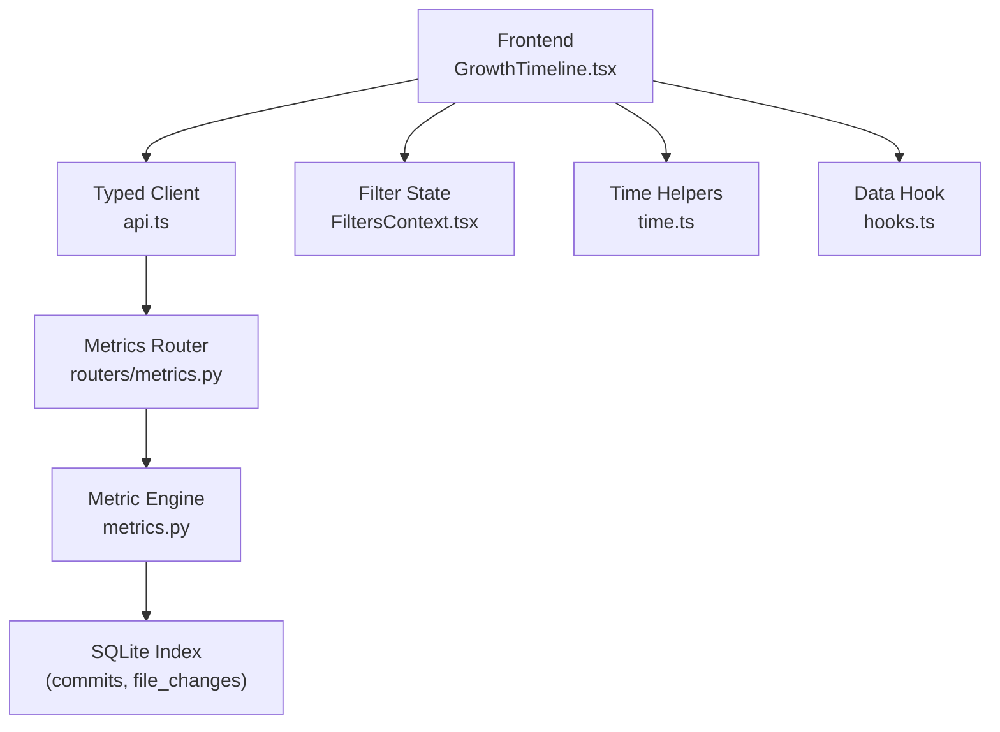
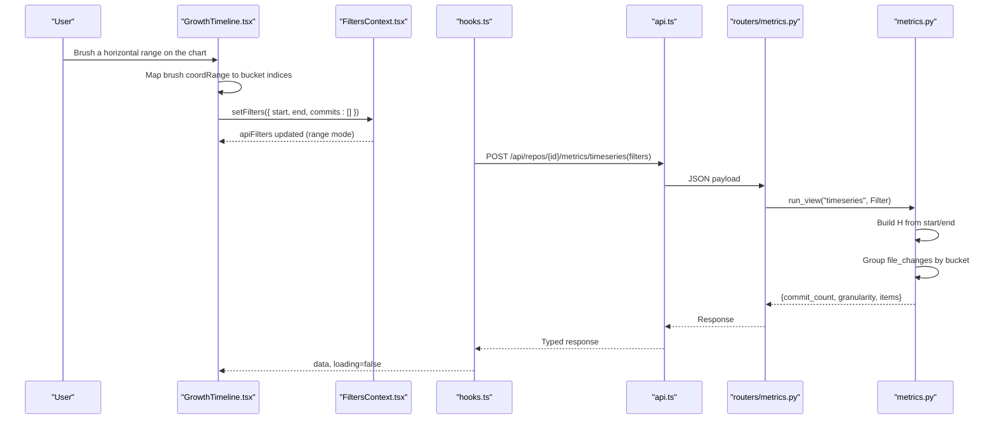
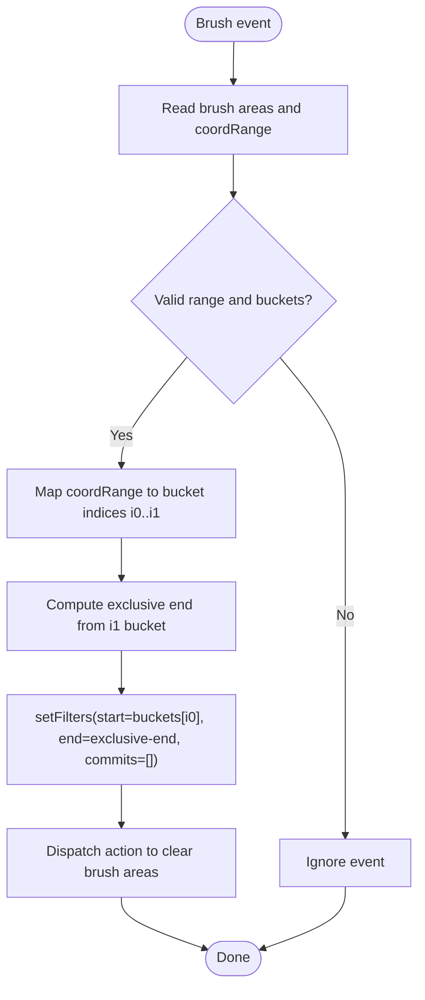
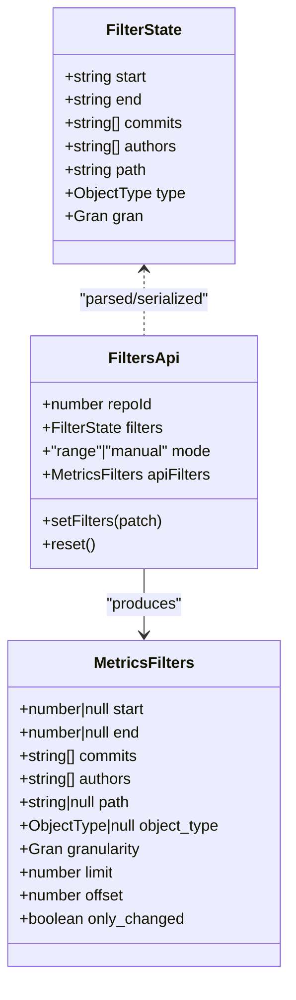
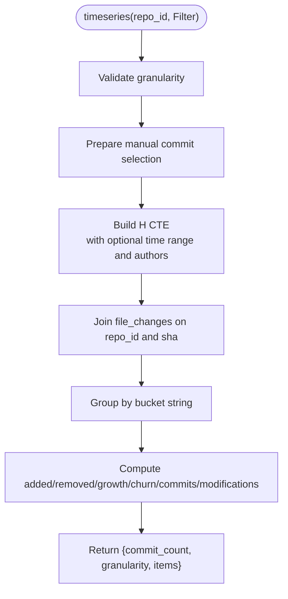
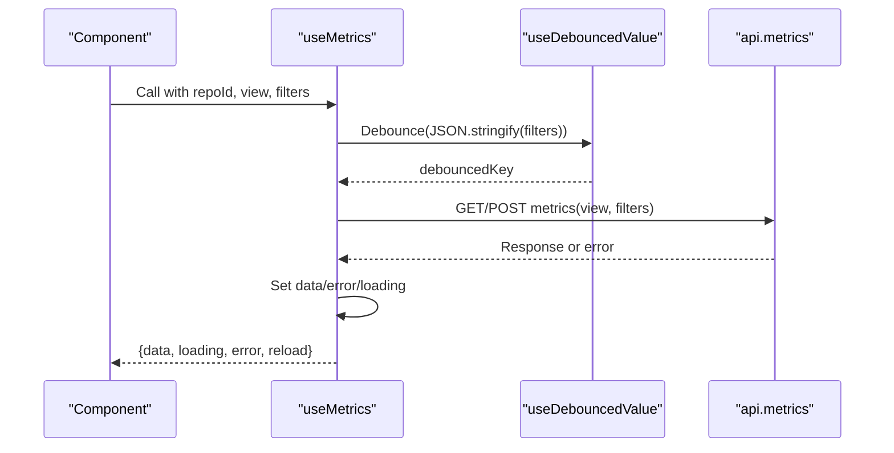
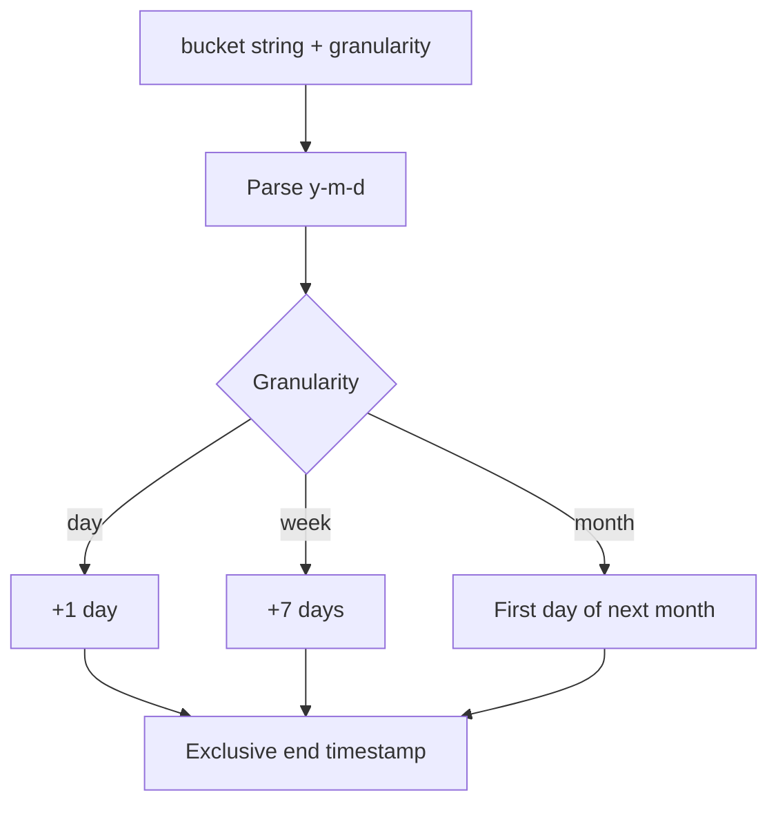
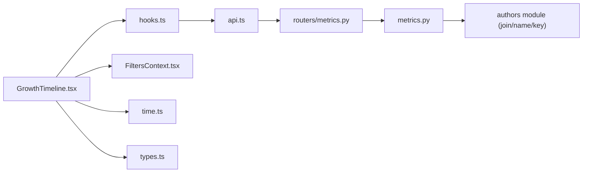

# Growth Timeline Controls

<cite>
**Referenced Files in This Document**
- [README.md](file://README.md)
- [main.py](file://backend/app/main.py)
- [metrics.py](file://backend/app/metrics.py)
- [metrics router](file://backend/app/routers/metrics.py)
- [GrowthTimeline.tsx](file://frontend/src/components/GrowthTimeline.tsx)
- [api.ts](file://frontend/src/api.ts)
- [hooks.ts](file://frontend/src/lib/hooks.ts)
- [FiltersContext.tsx](file://frontend/src/state/FiltersContext.tsx)
- [time.ts](file://frontend/src/lib/time.ts)
- [types.ts](file://frontend/src/types.ts)
</cite>

## Table of Contents
1. [Introduction](#introduction)
2. [Project Structure](#project-structure)
3. [Core Components](#core-components)
4. [Architecture Overview](#architecture-overview)
5. [Detailed Component Analysis](#detailed-component-analysis)
6. [Dependency Analysis](#dependency-analysis)
7. [Performance Considerations](#performance-considerations)
8. [Troubleshooting Guide](#troubleshooting-guide)
9. [Conclusion](#conclusion)

## Introduction
This document explains the **Growth Timeline Controls** feature: how users select a time range on the growth timeline chart, how that selection becomes a commit-set filter, and how the frontend and backend compute and display timeseries metrics for added lines, removed lines, growth, churn, and commit counts.

The growth timeline is one of several dashboard views. It visualizes per-bucket metrics and lets users brush a horizontal range to set the dashboard’s `H_i,j` time-range filter. The selected range is persisted in the URL so every view remains shareable and bookmarkable.

## Project Structure
The growth timeline spans both layers:

- Frontend:
  - `GrowthTimeline.tsx` renders the ECharts-based line chart and handles brush interactions.
  - `api.ts` provides the typed client method for the timeseries metric view.
  - `hooks.ts` debounces filter changes and fetches metrics without flashing stale data.
  - `FiltersContext.tsx` parses/serializes URL filters and converts UI dates into backend timestamps.
  - `time.ts` converts between UTC day strings, UNIX seconds, and bucket end boundaries.
  - `types.ts` defines the TypeScript contract for timeseries responses.

- Backend:
  - `routers/metrics.py` exposes `POST /api/repos/{repo_id}/metrics/timeseries`.
  - `metrics.py` implements the timeseries aggregation, commit-set H construction, and TTL cache.
  - `main.py` mounts routers and serves the SPA.

**Diagram sources**
- [GrowthTimeline.tsx:14-135](file://frontend/src/components/GrowthTimeline.tsx#L14-L135)
- [api.ts:107-125](file://frontend/src/api.ts#L107-L125)
- [metrics router:13-40](file://backend/app/routers/metrics.py#L13-L40)
- [metrics.py:291-329](file://backend/app/metrics.py#L291-L329)
- [FiltersContext.tsx:70-111](file://frontend/src/state/FiltersContext.tsx#L70-L111)
- [time.ts:11-37](file://frontend/src/lib/time.ts#L11-L37)
- [hooks.ts:51-99](file://frontend/src/lib/hooks.ts#L51-L99)

**Section sources**
- [README.md:88-105](file://README.md#L88-L105)
- [main.py:24-27](file://backend/app/main.py#L24-L27)

## Core Components
- **GrowthTimeline component**: Fetches timeseries data, builds an ECharts option with three series (added, removed, growth), enables a toolbox brush, and translates brush coordinates into a date-range filter.
- **Filter state context**: Parses URL parameters (`start`, `end`, `gran`, etc.), computes whether the mode is range or manual, and produces backend-compatible filters.
- **Timeseries metric engine**: Builds commit-set H from optional time range or manual commit list, groups file changes by bucket, and returns per-bucket metrics.
- **API client and hook**: Calls `/api/repos/{id}/metrics/timeseries` with debounced filters and keeps previous data while loading new results.
- **Time utilities**: Convert between UTC day strings and UNIX timestamps, and compute exclusive end boundaries for buckets.

**Section sources**
- [GrowthTimeline.tsx:14-174](file://frontend/src/components/GrowthTimeline.tsx#L14-L174)
- [FiltersContext.tsx:24-111](file://frontend/src/state/FiltersContext.tsx#L24-L111)
- [metrics.py:291-329](file://backend/app/metrics.py#L291-L329)
- [api.ts:107-125](file://frontend/src/api.ts#L107-L125)
- [hooks.ts:51-99](file://frontend/src/lib/hooks.ts#L51-L99)
- [time.ts:11-37](file://frontend/src/lib/time.ts#L11-L37)

## Architecture Overview
The growth timeline control follows a request-response flow driven by user interaction with the chart brush.

**Diagram sources**
- [GrowthTimeline.tsx:118-135](file://frontend/src/components/GrowthTimeline.tsx#L118-L135)
- [FiltersContext.tsx:91-104](file://frontend/src/state/FiltersContext.tsx#L91-L104)
- [hooks.ts:71-95](file://frontend/src/lib/hooks.ts#L71-L95)
- [api.ts:107-125](file://frontend/src/api.ts#L107-L125)
- [metrics router:13-40](file://backend/app/routers/metrics.py#L13-L40)
- [metrics.py:76-109](file://backend/app/metrics.py#L76-L109)
- [metrics.py:291-329](file://backend/app/metrics.py#L291-L329)

## Detailed Component Analysis

### GrowthTimeline Component
The component:
- Reads current filters and repository ID from context.
- Fetches timeseries data using the shared metrics hook.
- Builds an ECharts configuration with:
  - Category x-axis over bucket labels.
  - Three series: added (area), removed (negative area), growth (dashed line).
  - A toolbox brush limited to horizontal dragging.
  - Tooltip formatting showing bucket, added, removed, growth, churn, and commits.
- On brush end:
  - Converts brush coordinate range to bucket indices.
  - Computes inclusive start bucket and exclusive end boundary via bucket helper functions.
  - Updates filters to range mode with `start` and `end` dates, clearing any manual commit list.
  - Clears the painted brush area.
- Provides a “Clear range” button when a range is active.

**Diagram sources**
- [GrowthTimeline.tsx:118-135](file://frontend/src/components/GrowthTimeline.tsx#L118-L135)
- [time.ts:30-37](file://frontend/src/lib/time.ts#L30-L37)

**Section sources**
- [GrowthTimeline.tsx:14-174](file://frontend/src/components/GrowthTimeline.tsx#L14-L174)

### Filter State and Mode
The filter context:
- Parses URL query parameters into a normalized filter state.
- Serializes filter state back to URL parameters.
- Determines mode:
  - `manual`: when a non-empty commit list is present; overrides time range.
  - `range`: otherwise; uses `start` and `end`.
- Produces backend-compatible filters:
  - For range mode, converts UI dates to UNIX timestamps and sets exclusive end.
  - Passes through authors, path, object type, and granularity.

**Diagram sources**
- [FiltersContext.tsx:14-66](file://frontend/src/state/FiltersContext.tsx#L14-L66)
- [FiltersContext.tsx:91-104](file://frontend/src/state/FiltersContext.tsx#L91-L104)
- [types.ts:76-87](file://frontend/src/types.ts#L76-L87)

**Section sources**
- [FiltersContext.tsx:24-111](file://frontend/src/state/FiltersContext.tsx#L24-L111)
- [types.ts:76-87](file://frontend/src/types.ts#L76-L87)

### Timeseries Metric View
The backend timeseries view:
- Validates granularity and defaults to month if invalid.
- Builds commit-set H:
  - Optional manual commit list materialized into a temporary table.
  - Otherwise filters by committer timestamp range.
  - Applies author filtering after merged-author resolution.
- Joins with file changes and groups by bucket string.
- Returns per-bucket metrics including added, removed, growth, churn, commits, and modifications.

**Diagram sources**
- [metrics.py:291-329](file://backend/app/metrics.py#L291-L329)
- [metrics.py:67-109](file://backend/app/metrics.py#L67-L109)

**Section sources**
- [metrics.py:291-329](file://backend/app/metrics.py#L291-L329)

### Data Fetching and Debouncing
The metrics hook:
- Debounces filter keys to avoid excessive requests during rapid filter updates.
- Keeps previous data while a new request is in flight to prevent chart flicker.
- Resets data when the repository changes.
- Exposes a reload nonce to force refetch.

**Diagram sources**
- [hooks.ts:51-99](file://frontend/src/lib/hooks.ts#L51-L99)
- [api.ts:107-125](file://frontend/src/api.ts#L107-L125)

**Section sources**
- [hooks.ts:51-99](file://frontend/src/lib/hooks.ts#L51-L99)

### Time Utilities
Time helpers ensure consistent UTC semantics:
- Convert between UTC day strings and UNIX seconds.
- Compute exclusive end of a day for inclusive “To” dates.
- Compute exclusive end of a bucket based on granularity.

**Diagram sources**
- [time.ts:30-37](file://frontend/src/lib/time.ts#L30-L37)

**Section sources**
- [time.ts:11-37](file://frontend/src/lib/time.ts#L11-L37)

## Dependency Analysis
The growth timeline controls depend on layered modules:

**Diagram sources**
- [GrowthTimeline.tsx:1-12](file://frontend/src/components/GrowthTimeline.tsx#L1-L12)
- [hooks.ts:1-5](file://frontend/src/lib/hooks.ts#L1-L5)
- [api.ts:1-15](file://frontend/src/api.ts#L1-L15)
- [metrics router:1-8](file://backend/app/routers/metrics.py#L1-L8)
- [metrics.py:31-37](file://backend/app/metrics.py#L31-L37)

**Section sources**
- [GrowthTimeline.tsx:1-12](file://frontend/src/components/GrowthTimeline.tsx#L1-L12)
- [hooks.ts:1-5](file://frontend/src/lib/hooks.ts#L1-L5)
- [api.ts:1-15](file://frontend/src/api.ts#L1-L15)
- [metrics router:1-8](file://backend/app/routers/metrics.py#L1-L8)
- [metrics.py:31-37](file://backend/app/metrics.py#L31-L37)

## Performance Considerations
- Frontend:
  - Debounced filter updates reduce unnecessary network calls.
  - Stale data is preserved during loading to avoid empty charts.
  - Brush events are throttled to debounce user interactions.
- Backend:
  - Short-TTL response cache absorbs repeated dashboard queries.
  - Commit-set H is built efficiently with indexes and optional temp tables for manual selections.
  - Bucket grouping uses SQL aggregation over indexed columns.

[No sources needed since this section provides general guidance]

## Troubleshooting Guide
Common issues and resolutions:

- No data displayed after brushing:
  - Verify that the brush produced valid bucket indices and that `buckets.length > 0`.
  - Ensure the filter mode is `range` and not overridden by a manual commit list.
  - Check that the backend repository status is `ready`; otherwise the metrics endpoint rejects the request.

- Range does not update the URL:
  - Confirm that `setFilters` is called with `start` and `end` values and that `commits` is cleared.
  - Ensure the app is wrapped with `FiltersProvider` so URL synchronization works.

- Incorrect end date after brushing:
  - Confirm that `bucketEndTs` is used with the correct granularity.
  - Remember that the backend expects an exclusive end timestamp.

- Chart flickers or shows old data:
  - The hook preserves previous data until the new request completes; verify that the hook is not disabled unintentionally.

**Section sources**
- [GrowthTimeline.tsx:118-143](file://frontend/src/components/GrowthTimeline.tsx#L118-L143)
- [metrics router:24-30](file://backend/app/routers/metrics.py#L24-L30)
- [FiltersContext.tsx:91-104](file://frontend/src/state/FiltersContext.tsx#L91-L104)
- [hooks.ts:66-95](file://frontend/src/lib/hooks.ts#L66-L95)

## Conclusion
The Growth Timeline Controls provide an interactive way to define the commit-set time range `H_i,j`. Users drag a brush on the chart to select a period, which updates the global filter state and triggers a timeseries metrics query. The backend computes aggregated metrics per bucket using efficient SQL and caching, while the frontend maintains responsive UX through debouncing and stale-data preservation. Together, these components deliver a fast, intuitive experience for exploring code growth over time.

[No sources needed since this section summarizes without analyzing specific files]