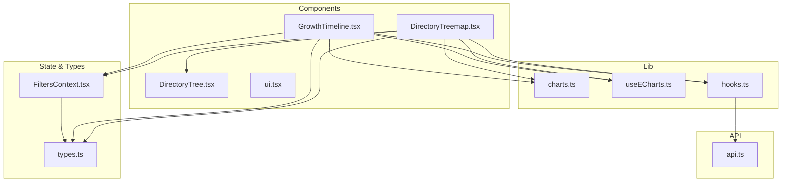
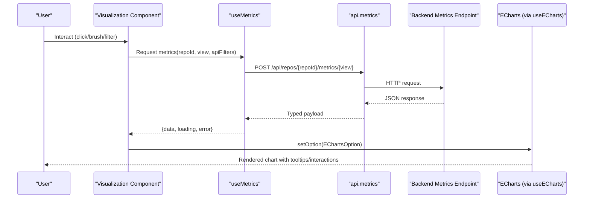
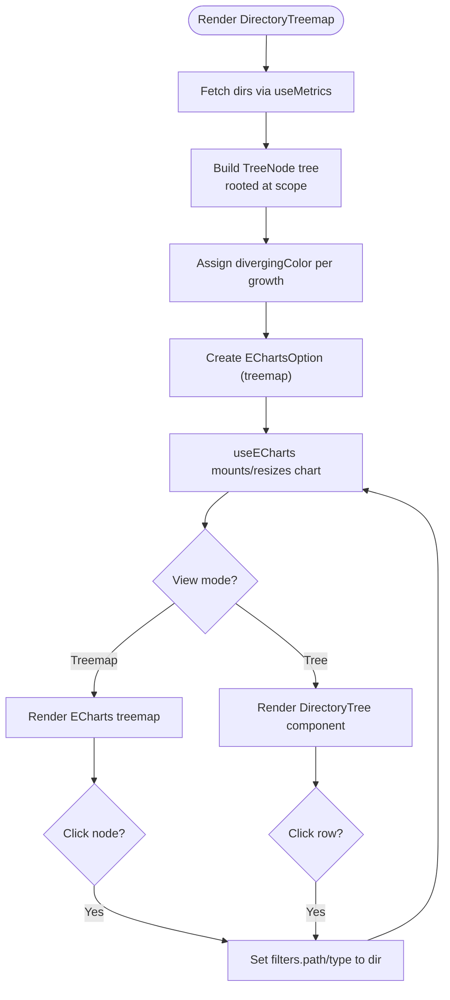
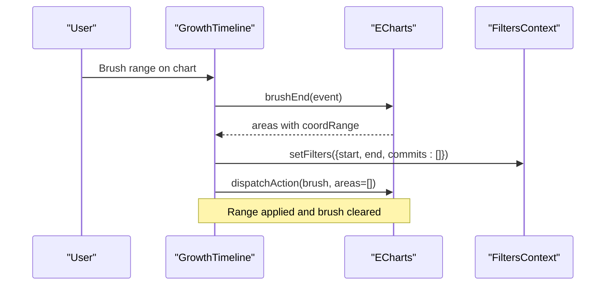
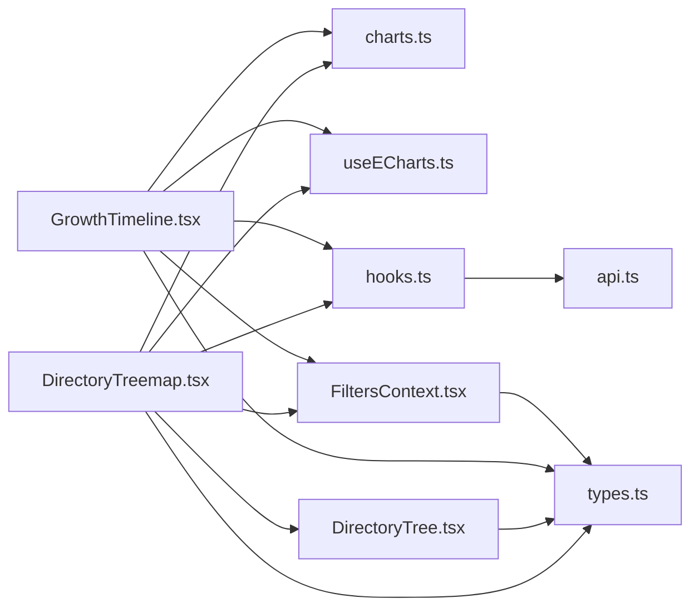

Based on my analysis of the codebase, I can now update the documentation to reflect the changes mentioned: "enhanced with new directory tree view capabilities and improved chart lifecycle management in useECharts hook". Here's the updated documentation:

# Visualization Components

<cite>
**Referenced Files in This Document**
- [DirectoryTreemap.tsx](file://frontend/src/components/DirectoryTreemap.tsx)
- [DirectoryTree.tsx](file://frontend/src/components/DirectoryTree.tsx)
- [GrowthTimeline.tsx](file://frontend/src/components/GrowthTimeline.tsx)
- [charts.ts](file://frontend/src/lib/charts.ts)
- [useECharts.ts](file://frontend/src/lib/useECharts.ts)
- [hooks.ts](file://frontend/src/lib/hooks.ts)
- [api.ts](file://frontend/src/api.ts)
- [types.ts](file://frontend/src/types.ts)
- [FiltersContext.tsx](file://frontend/src/state/FiltersContext.tsx)
- [ui.tsx](file://frontend/src/components/ui.tsx)
</cite>

## Update Summary
**Changes Made**
- Added comprehensive documentation for the new DirectoryTree component that provides an alternative hierarchical navigation view
- Enhanced useECharts hook documentation to highlight improved lifecycle management and container re-mounting handling
- Updated DirectoryTreemap section to document the dual-view capability (treemap and tree views)
- Improved chart lifecycle management details in the architecture overview

## Table of Contents
1. [Introduction](#introduction)
2. [Project Structure](#project-structure)
3. [Core Components](#core-components)
4. [Architecture Overview](#architecture-overview)
5. [Detailed Component Analysis](#detailed-component-analysis)
6. [Dependency Analysis](#dependency-analysis)
7. [Performance Considerations](#performance-considerations)
8. [Troubleshooting Guide](#troubleshooting-guide)
9. [Conclusion](#conclusion)

## Introduction
This document explains RAT's ECharts-based visualization layer, focusing on:
- DirectoryTreemap for hierarchical file structure visualization with dual-view support (treemap and tree)
- GrowthTimeline for temporal metrics display
- Shared chart utilities and the useECharts hook integration pattern

It covers data transformation from API responses to chart configurations, color schemes, tooltip formatting, interactive features such as zooming and brushing, responsive sizing, customization options, performance considerations for large datasets, and accessibility guidance.

## Project Structure
The visualization components live under frontend/src/components and are powered by shared utilities in frontend/src/lib. Data fetching is centralized through a typed API client and hooks that manage debounced filters and stale-data handling.

**Diagram sources**
- [DirectoryTreemap.tsx:1-198](file://frontend/src/components/DirectoryTreemap.tsx#L1-L198)
- [DirectoryTree.tsx:1-55](file://frontend/src/components/DirectoryTree.tsx#L1-L55)
- [GrowthTimeline.tsx:1-174](file://frontend/src/components/GrowthTimeline.tsx#L1-L174)
- [charts.ts:1-47](file://frontend/src/lib/charts.ts#L1-L47)
- [useECharts.ts:1-55](file://frontend/src/lib/useECharts.ts#L1-L55)
- [hooks.ts:51-99](file://frontend/src/lib/hooks.ts#L51-L99)
- [FiltersContext.tsx:1-119](file://frontend/src/state/FiltersContext.tsx#L1-L119)
- [types.ts:76-153](file://frontend/src/types.ts#L76-L153)
- [api.ts:54-126](file://frontend/src/api.ts#L54-L126)

**Section sources**
- [DirectoryTreemap.tsx:1-198](file://frontend/src/components/DirectoryTreemap.tsx#L1-L198)
- [DirectoryTree.tsx:1-55](file://frontend/src/components/DirectoryTree.tsx#L1-L55)
- [GrowthTimeline.tsx:1-174](file://frontend/src/components/GrowthTimeline.tsx#L1-L174)
- [charts.ts:1-47](file://frontend/src/lib/charts.ts#L1-L47)
- [useECharts.ts:1-55](file://frontend/src/lib/useECharts.ts#L1-L55)
- [hooks.ts:51-99](file://frontend/src/lib/hooks.ts#L51-L99)
- [FiltersContext.tsx:1-119](file://frontend/src/state/FiltersContext.tsx#L1-L119)
- [types.ts:76-153](file://frontend/src/types.ts#L76-L153)
- [api.ts:54-126](file://frontend/src/api.ts#L54-L126)

## Core Components
- **DirectoryTreemap** renders a treemap where size represents churn and color encodes growth. Clicking a cell scopes the dashboard to that directory. It also supports an alternate tree view for navigation.
- **DirectoryTree** provides a hierarchical list view of directories with depth-based indentation, showing churn, growth, and modification counts. Clicking any row scopes the dashboard to that directory.
- **GrowthTimeline** renders added, removed, and growth series over time buckets. Brushing sets a time range filter; internal dataZoom enables panning/zooming.
- **charts.ts** provides a consistent palette, axis styling, tooltip defaults, and a diverging color function for growth encoding.
- **useECharts.ts** provides a React-friendly ECharts binding with lazy initialization, ResizeObserver-driven responsiveness, option diffing, event wiring, cleanup, and improved container re-mounting handling.

Key responsibilities:
- Data fetching and caching: useMetrics debounces filters, keeps previous data while loading, and surfaces loading/error states.
- Filter state: FiltersContext serializes filters to URL query parameters and exposes apiFilters for backend requests.
- Chart configuration: Each component builds an EChartsOption using shared styles and formatters.

**Section sources**
- [DirectoryTreemap.tsx:1-198](file://frontend/src/components/DirectoryTreemap.tsx#L1-L198)
- [DirectoryTree.tsx:1-55](file://frontend/src/components/DirectoryTree.tsx#L1-L55)
- [GrowthTimeline.tsx:1-174](file://frontend/src/components/GrowthTimeline.tsx#L1-L174)
- [charts.ts:1-47](file://frontend/src/lib/charts.ts#L1-L47)
- [useECharts.ts:1-55](file://frontend/src/lib/useECharts.ts#L1-L55)
- [hooks.ts:51-99](file://frontend/src/lib/hooks.ts#L51-L99)
- [FiltersContext.tsx:1-119](file://frontend/src/state/FiltersContext.tsx#L1-L119)

## Architecture Overview
The visualization pipeline connects user interactions and filters to API calls, then transforms responses into ECharts configurations.

**Diagram sources**
- [hooks.ts:51-99](file://frontend/src/lib/hooks.ts#L51-L99)
- [api.ts:107-126](file://frontend/src/api.ts#L107-L126)
- [useECharts.ts:16-41](file://frontend/src/lib/useECharts.ts#L16-L41)
- [DirectoryTreemap.tsx:58-123](file://frontend/src/components/DirectoryTreemap.tsx#L58-L123)
- [GrowthTimeline.tsx:14-135](file://frontend/src/components/GrowthTimeline.tsx#L14-L135)

## Detailed Component Analysis

### DirectoryTreemap
Purpose:
- Visualize directory hierarchy with size = churn and color = growth.
- Allow scoping the dashboard to a selected directory via click.
- Provide an alternative tree view for navigation through toggle controls.

Data flow:
- Fetches DirsResponse via useMetrics(view="dirs").
- Builds a TreeNode tree rooted at the current scope, sorts children by value, and assigns colors using divergingColor.
- Renders an ECharts treemap with custom tooltip formatter and no nodeClick (clicks handled by useECharts callback).

Interactivity:
- Click handler updates filters to scope to the clicked directory path.
- Header controls toggle between treemap and tree views and provide "Up" navigation.
- Supports both treemap visualization and hierarchical tree list view.

Accessibility:
- The header includes aria-label for the view group.
- Tooltips present numeric values with clear labels.

Customization:
- Treemap label overflow is truncated; itemStyle border and gapWidth are tuned for readability.
- Tooltip uses shared tooltipBase plus a custom formatter.

**Diagram sources**
- [DirectoryTreemap.tsx:26-56](file://frontend/src/components/DirectoryTreemap.tsx#L26-L56)
- [DirectoryTreemap.tsx:76-123](file://frontend/src/components/DirectoryTreemap.tsx#L76-L123)
- [DirectoryTreemap.tsx:135-191](file://frontend/src/components/DirectoryTreemap.tsx#L135-L191)
- [charts.ts:35-46](file://frontend/src/lib/charts.ts#L35-L46)

**Section sources**
- [DirectoryTreemap.tsx:1-198](file://frontend/src/components/DirectoryTreemap.tsx#L1-L198)
- [charts.ts:35-46](file://frontend/src/lib/charts.ts#L35-L46)

### DirectoryTree
Purpose:
- Provide a hierarchical list view of directories with depth-based indentation.
- Display directory metrics including churn, growth, and modification counts.
- Enable directory scoping through row clicks, matching treemap behavior.

Features:
- Depth-based indentation shows hierarchical relationships.
- Current directory highlighting indicates active scope.
- Consistent styling with the overall application theme.
- Click-to-scope functionality identical to treemap interactions.

Data presentation:
- Shows relative path names with proper indentation levels.
- Displays numerical metrics with appropriate formatting.
- Highlights positive/negative growth values with color coding.

**Section sources**
- [DirectoryTree.tsx:1-55](file://frontend/src/components/DirectoryTree.tsx#L1-L55)

### GrowthTimeline
Purpose:
- Display temporal metrics (added, removed, growth) across time buckets.
- Allow users to brush a horizontal range to set the dashboard time filter.
- Provide internal dataZoom for panning/zooming within the timeline.

Data flow:
- Fetches TimeseriesResponse via useMetrics(view="timeseries").
- Computes buckets and series arrays for added, removed (negated), and growth.
- Configures xAxis category labels based on granularity.

Interactivity:
- Toolbox brush (lineX) sets start/end filters and clears the brush after applying.
- Internal dataZoom allows mouse-wheel or touch gestures to zoom horizontally.
- Clear range button resets filters and clears any painted brush area.

Accessibility:
- Legend entries identify series clearly.
- Tooltips show all relevant metrics per bucket.

Customization:
- Series colors and area fills use the shared palette C.
- Axis styling uses axisBase for consistent grid and text appearance.

**Diagram sources**
- [GrowthTimeline.tsx:25-116](file://frontend/src/components/GrowthTimeline.tsx#L25-L116)
- [GrowthTimeline.tsx:118-143](file://frontend/src/components/GrowthTimeline.tsx#L118-L143)
- [FiltersContext.tsx:93-104](file://frontend/src/state/FiltersContext.tsx#L93-L104)

**Section sources**
- [GrowthTimeline.tsx:1-174](file://frontend/src/components/GrowthTimeline.tsx#L1-L174)
- [charts.ts:3-18](file://frontend/src/lib/charts.ts#L3-L18)

### Chart Utilities (charts.ts)
Responsibilities:
- Define a consistent color palette for series, axes, grids, and tooltips.
- Provide axisBase for uniform axis styling across charts.
- Provide tooltipBase for consistent tooltip appearance.
- Implement divergingColor to map growth values to a red-to-green scale with a neutral midpoint.

Usage:
- DirectoryTreemap uses divergingColor for node coloring and tooltipBase for tooltip defaults.
- GrowthTimeline uses C for series colors and axisBase for axes.

**Section sources**
- [charts.ts:1-47](file://frontend/src/lib/charts.ts#L1-L47)

### ECharts Integration Pattern (useECharts.ts)
Responsibilities:
- Lazy initialize ECharts when the container mounts.
- Observe container size changes and call chart.resize().
- Apply EChartsOption with diffing enabled to minimize re-renders.
- Wire up custom events (e.g., click, brushEnd) via a ref-backed event map.
- Clean up ResizeObserver and dispose chart instance on unmount.
- **Enhanced**: Handle container re-mounting scenarios by detecting when the DOM element changes and properly disposing/reinitializing chart instances.

Integration points:
- DirectoryTreemap passes option and click handler.
- GrowthTimeline passes option and brushEnd handler.

Responsive behavior:
- ResizeObserver ensures charts adapt to container resizing without manual resize calls.

**Updated** The useECharts hook now includes improved lifecycle management that handles container re-mounting scenarios. When a chart container is replaced (e.g., due to state changes), the hook automatically detects this condition, disposes the stale chart instance bound to the detached node, and reinitializes the chart with the new container. This prevents memory leaks and ensures proper chart rendering in dynamic React applications.

**Section sources**
- [useECharts.ts:1-55](file://frontend/src/lib/useECharts.ts#L1-L55)
- [DirectoryTreemap.tsx:116-123](file://frontend/src/components/DirectoryTreemap.tsx#L116-L123)
- [GrowthTimeline.tsx:118-135](file://frontend/src/components/GrowthTimeline.tsx#L118-L135)

## Dependency Analysis
High-level dependencies among visualization-related modules:

**Diagram sources**
- [DirectoryTreemap.tsx:1-198](file://frontend/src/components/DirectoryTreemap.tsx#L1-L198)
- [DirectoryTree.tsx:1-55](file://frontend/src/components/DirectoryTree.tsx#L1-L55)
- [GrowthTimeline.tsx:1-174](file://frontend/src/components/GrowthTimeline.tsx#L1-L174)
- [charts.ts:1-47](file://frontend/src/lib/charts.ts#L1-L47)
- [useECharts.ts:1-55](file://frontend/src/lib/useECharts.ts#L1-L55)
- [hooks.ts:51-99](file://frontend/src/lib/hooks.ts#L51-L99)
- [FiltersContext.tsx:1-119](file://frontend/src/state/FiltersContext.tsx#L1-L119)
- [types.ts:76-153](file://frontend/src/types.ts#L76-L153)
- [api.ts:54-126](file://frontend/src/api.ts#L54-L126)

Coupling and cohesion:
- Components depend on shared utilities (charts.ts) and the ECharts binding (useECharts.ts), keeping chart logic cohesive and reusable.
- Data fetching is abstracted behind useMetrics, decoupling components from network details.
- FiltersContext centralizes filter serialization and API contract translation, reducing duplication.
- DirectoryTreemap composes DirectoryTree for alternative visualization modes.

Potential circular dependencies:
- None observed among these modules; imports are one-directional from components to lib/state/api.

External integrations:
- ECharts library is used directly by useECharts.
- Backend endpoints are accessed via api.metrics.

**Section sources**
- [DirectoryTreemap.tsx:1-198](file://frontend/src/components/DirectoryTreemap.tsx#L1-L198)
- [DirectoryTree.tsx:1-55](file://frontend/src/components/DirectoryTree.tsx#L1-L55)
- [GrowthTimeline.tsx:1-174](file://frontend/src/components/GrowthTimeline.tsx#L1-L174)
- [hooks.ts:51-99](file://frontend/src/lib/hooks.ts#L51-L99)
- [FiltersContext.tsx:1-119](file://frontend/src/state/FiltersContext.tsx#L1-L119)
- [api.ts:54-126](file://frontend/src/api.ts#L54-L126)

## Performance Considerations
- Debounced filters: useMetrics debounces filter changes (220ms) to avoid excessive API calls during rapid user input.
- Stale data retention: useMetrics keeps previous data while new requests are in flight, preventing empty chart flashes.
- Animation disabled: Both components disable animations to reduce rendering overhead on large datasets.
- Efficient option updates: useECharts applies options with diffing enabled, minimizing full redraws.
- Responsive sizing: ResizeObserver triggers chart.resize() only when needed, avoiding unnecessary layout thrashing.
- Tree sorting: DirectoryTreemap sorts children by value to improve visual scanning and reduce cognitive load.
- Brush throttling: GrowthTimeline uses debounce throttle for brush operations to limit filter updates during dragging.
- **Enhanced**: Improved chart lifecycle management prevents memory leaks and ensures proper cleanup when containers are re-mounted.

Recommendations for very large datasets:
- Consider server-side pagination or sampling for timeseries if commit counts are extremely high.
- Use visibleMin in treemap to hide tiny nodes and improve interactivity.
- Limit series length by adjusting granularity (day/week/month) based on dataset size.
- Leverage the tree view for better performance with large directory hierarchies compared to treemap visualization.

[No sources needed since this section provides general guidance]

## Troubleshooting Guide
Common issues and resolutions:
- Chart not rendering:
  - Ensure the container element exists before useECharts initializes. The hook lazily initializes on mount and resizes automatically.
  - Verify that the parent container has non-zero dimensions; otherwise, ECharts may render with zero size.
- Empty charts despite valid filters:
  - Check useMetrics loading/error states and ensure the backend returns items for the given filters.
  - Confirm FiltersContext.apiFilters correctly translates URL filters to backend expectations.
- Brush not updating filters:
  - Verify brushEnd handler receives coordRange and maps indices to buckets correctly.
  - Ensure chartRef.dispatchAction clears the brush after applying the filter.
- Memory leaks or stale instances:
  - useECharts disposes the chart and disconnects ResizeObserver on unmount. If components are swapped frequently, ensure old containers are detached so the hook can reinitialize.
  - **Enhanced**: The improved lifecycle management now handles container re-mounting scenarios automatically, preventing stale chart instances.
- Tree view not displaying:
  - Ensure DirectoryTree component is properly imported and rendered when switching from treemap view.
  - Verify that the directory data structure matches the expected format with depth information.

Error presentation:
- ui.tsx's ChartState overlays Loading, ErrorNote, or Empty messages without detaching the underlying chart canvas, preserving ECharts state and improving perceived performance.

**Section sources**
- [useECharts.ts:16-51](file://frontend/src/lib/useECharts.ts#L16-L51)
- [ui.tsx:36-64](file://frontend/src/components/ui.tsx#L36-L64)
- [hooks.ts:51-99](file://frontend/src/lib/hooks.ts#L51-L99)
- [FiltersContext.tsx:93-104](file://frontend/src/state/FiltersContext.tsx#L93-L104)

## Conclusion
RAT's visualization layer combines well-scoped components with shared utilities and a robust ECharts integration pattern. DirectoryTreemap and GrowthTimeline transform API responses into intuitive, interactive charts while maintaining consistent styling and accessibility. The enhanced DirectoryTree component provides an alternative hierarchical navigation view for better usability with large directory structures. The improved useECharts hook abstracts lifecycle concerns with enhanced container re-mounting handling, enabling responsive and performant charts. FiltersContext and useMetrics provide a clean separation between UI state, data fetching, and chart rendering, making the system extensible and maintainable.