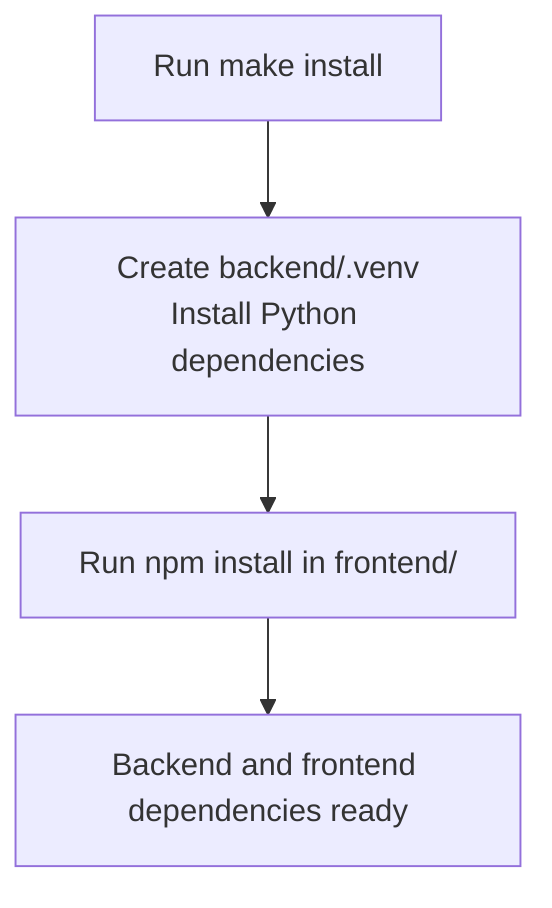
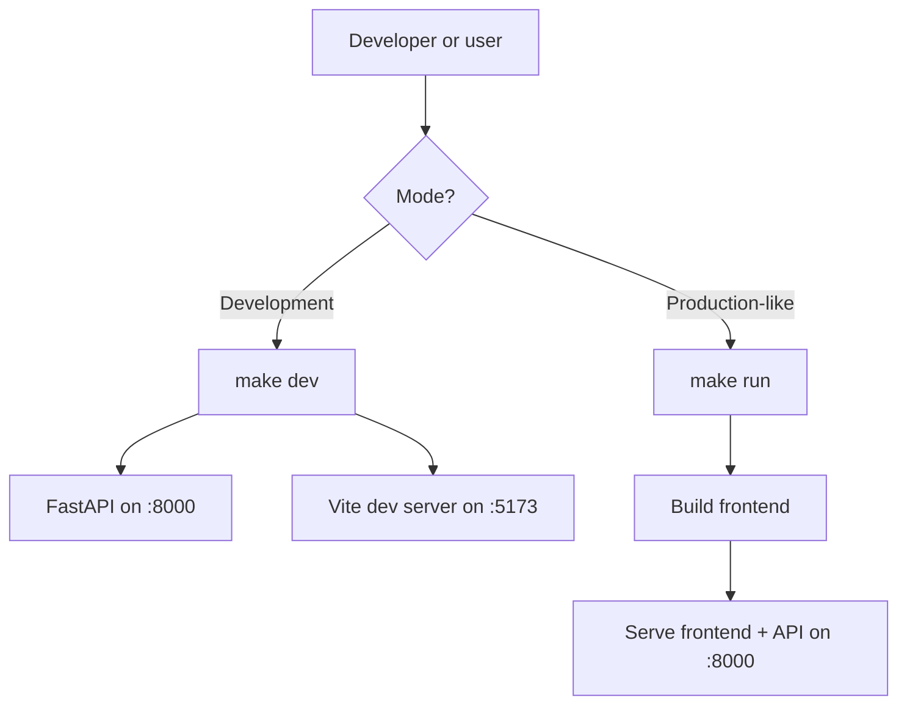
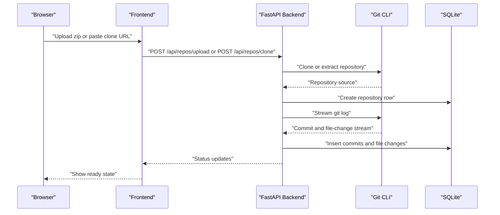
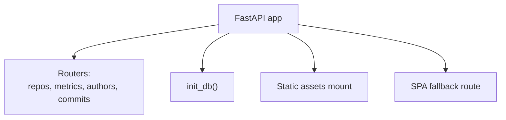
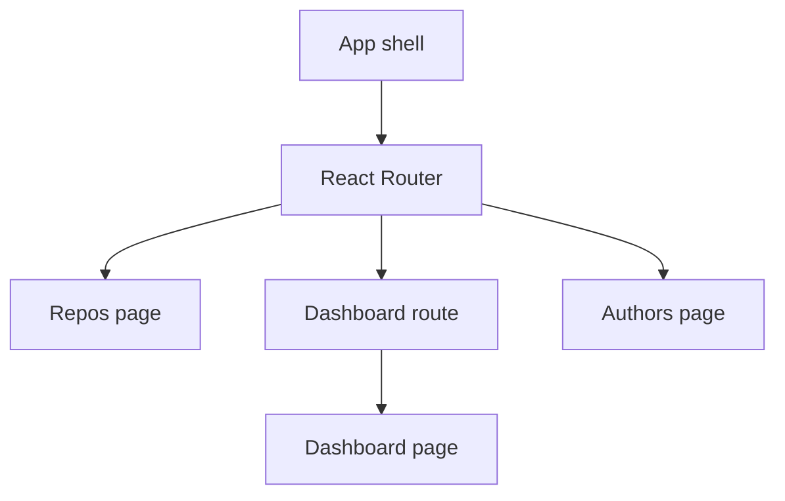
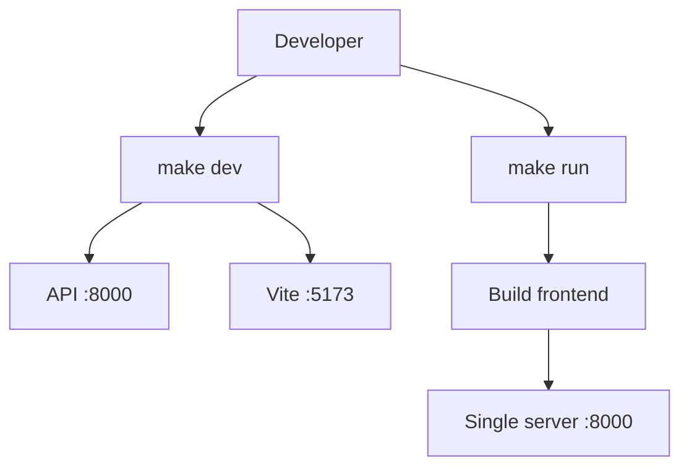
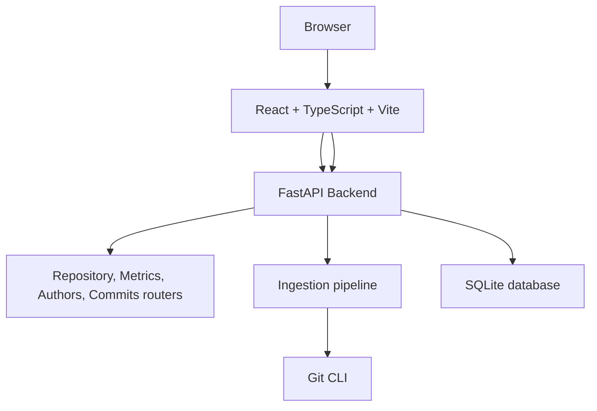
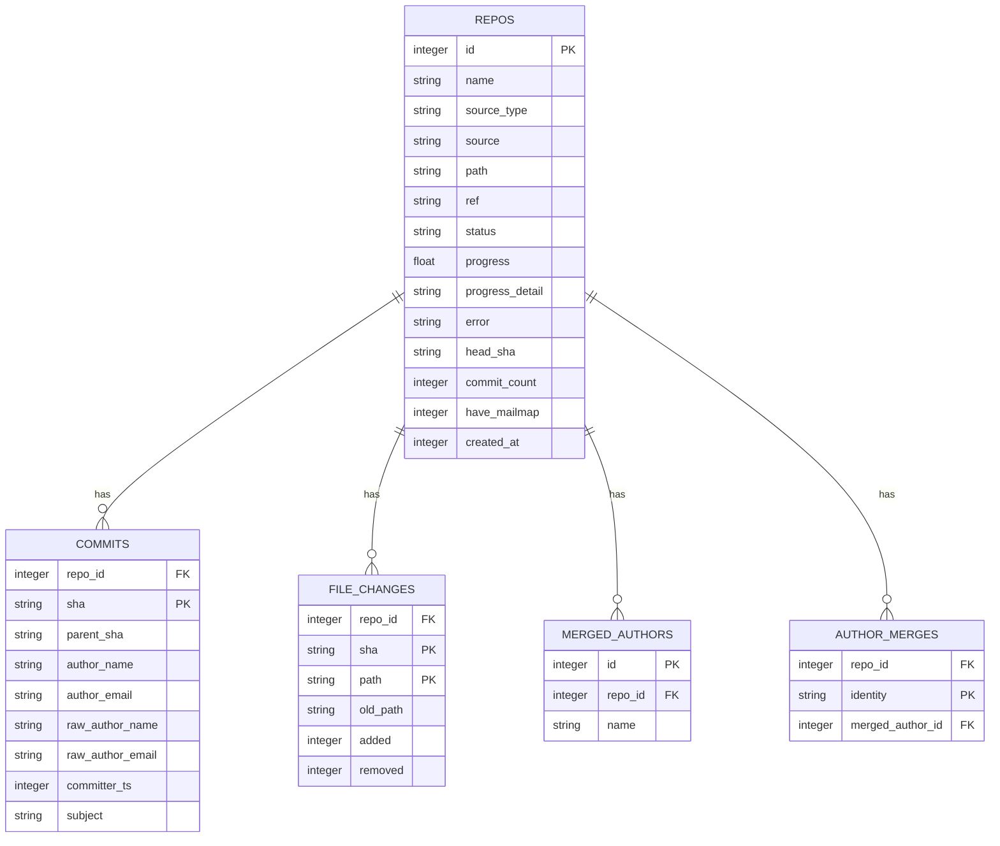
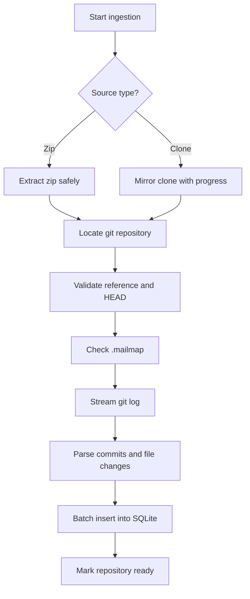
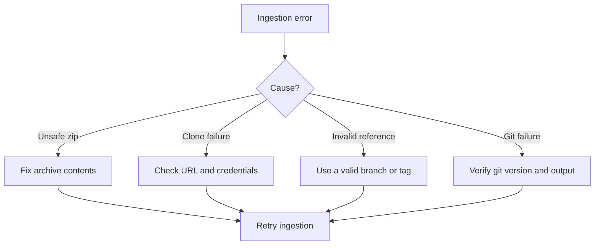

# Getting Started

<cite>
**Referenced Files in This Document**
- [README.md](file://README.md)
- [Makefile](file://Makefile)
- [backend/app/main.py](file://backend/app/main.py)
- [backend/app/config.py](file://backend/app/config.py)
- [backend/app/db.py](file://backend/app/db.py)
- [backend/app/ingest.py](file://backend/app/ingest.py)
- [backend/requirements.txt](file://backend/requirements.txt)
- [frontend/package.json](file://frontend/package.json)
- [frontend/src/App.tsx](file://frontend/src/App.tsx)
</cite>

## Table of Contents
1. [Introduction](#introduction)
2. [Prerequisites](#prerequisites)
3. [Installation](#installation)
4. [Quick Start](#quick-start)
5. [Development Environment](#development-environment)
6. [Running the Application](#running-the-application)
7. [Initial Dashboard Exploration](#initial-dashboard-exploration)
8. [Common Use Cases](#common-use-cases)
9. [Architecture Overview](#architecture-overview)
10. [Troubleshooting Guide](#troubleshooting-guide)
11. [Conclusion](#conclusion)

## Introduction
RAT (Repo Analysis Tool) is a multi-repository web dashboard that transforms git repository history into filterable metrics for files, directories, repositories, commit sets, and authors. You ingest a repository once by uploading a zip or cloning a remote URL; after ingestion, every metric is computed as a fast SQL aggregation over an indexed SQLite database. The entire history is streamed through a single `git log` pass so even large repositories remain interactive.

The backend is Python 3.10+ with FastAPI, SQLite, and git CLI streaming. The frontend is React 18, TypeScript, Vite, and ECharts. A verification script helps spot-check metrics against expected values.

**Section sources**
- [README.md:1-15](file://README.md#L1-L15)

## Prerequisites
Before installing RAT, ensure your system has the following tools available on the command line:

- Python 3.10 or newer
- Node.js 18 or newer
- Git 2.30 or newer

These versions are required because RAT uses modern Python features, Vite-based tooling, and git plumbing commands that rely on stable output formats.

**Section sources**
- [README.md:69](file://README.md#L69)

## Installation
RAT provides Makefile targets to set up both the backend and frontend environments.

Recommended installation steps:

1. Open a terminal in the repository root.
2. Create the Python virtual environment and install backend dependencies:
   - Run `make install`.
   - This creates `backend/.venv`, installs Python packages from `backend/requirements.txt`, and runs `npm install` inside `frontend/`.

What happens during installation:

- The Makefile creates a Python virtual environment under `backend/.venv`.
- It upgrades pip and wheel, then installs FastAPI, Uvicorn, multipart support, pytest, and httpx.
- It installs frontend dependencies declared in `frontend/package.json`.

**Diagram sources**
- [Makefile:25-33](file://Makefile#L25-L33)
- [backend/requirements.txt:1-6](file://backend/requirements.txt#L1-L6)
- [frontend/package.json:1-25](file://frontend/package.json#L1-L25)

After installation, you can verify the setup by running tests:

- Run `make test` to execute the backend test suite.
- Optionally run `make verify ARGS='--api http://localhost:8000 --repo cJSON'` to spot-check metrics against a real repository.

**Section sources**
- [Makefile:12-23](file://Makefile#L12-L23)
- [Makefile:54-58](file://Makefile#L54-L58)
- [README.md:142-156](file://README.md#L142-L156)

## Quick Start
Once prerequisites and installation are complete, follow these steps to explore RAT quickly.

### Step 1: Start the application
Choose one of the following modes:

- Development mode:
  - Run `make dev`.
  - The API starts on port 8000.
  - The Vite development server starts on port 5173.
  - Open `http://localhost:5173` in your browser.

- Production-like single-port mode:
  - Run `make run`.
  - This builds the frontend and serves everything from the FastAPI server on port 8000.
  - Open `http://localhost:8000` in your browser.

**Diagram sources**
- [Makefile:35-52](file://Makefile#L35-L52)
- [frontend/package.json:6-10](file://frontend/package.json#L6-L10)

### Step 2: Add a repository
Open the app and add a repository using either workflow:

- Zip upload workflow:
  - Drag a `.zip` archive containing a git repository onto the upload box.
  - The backend extracts the archive, locates the git repository, and begins indexing.

- Remote clone workflow:
  - Paste a clone URL such as a GitHub repository URL.
  - The backend clones the repository and begins indexing.

While ingestion runs, the UI shows status and progress. When the repository status becomes ready, open the dashboard.

**Diagram sources**
- [README.md:19-21](file://README.md#L19-L21)
- [README.md:67-83](file://README.md#L67-L83)
- [backend/app/ingest.py:97-118](file://backend/app/ingest.py#L97-L118)
- [backend/app/ingest.py:121-138](file://backend/app/ingest.py#L121-L138)
- [backend/app/ingest.py:280-350](file://backend/app/ingest.py#L280-L350)
- [backend/app/ingest.py:362-429](file://backend/app/ingest.py#L362-L429)

### Step 3: Explore the dashboard
When the repository is ready:

- Use the filter bar to select files, directories, time ranges, authors, and commit sets.
- View summary cards for added lines, removed lines, growth, churn, modifications, modification frequency, churn rate, and commit-set size.
- Inspect the growth timeline, directory treemap, authors panel, files table, and commit-set table.

**Section sources**
- [README.md:85-100](file://README.md#L85-L100)

## Development Environment
Use the development workflow when you are changing code rather than just exploring the dashboard.

### Backend development
- The backend is a FastAPI application.
- The entry point mounts routers for repositories, metrics, authors, and commits.
- CORS is configured to allow the Vite development server at `http://localhost:5173`.
- The database schema is initialized at startup.

Key backend behaviors:

- The FastAPI app initializes the database and includes all routers.
- Static assets from the built frontend are mounted when present.
- A catch-all route serves the SPA frontend while excluding `/api/*` routes.

**Diagram sources**
- [backend/app/main.py:13-27](file://backend/app/main.py#L13-L27)
- [backend/app/main.py:29-48](file://backend/app/main.py#L29-L48)

### Frontend development
- The frontend is a React application managed by Vite.
- Scripts include development, build, and preview commands.
- Routing defines pages for repositories, dashboard, and authors.

Key frontend behaviors:

- The app shell wraps routing, navigation, filters, and toast providers.
- Routes map to repository listing, per-repository dashboard, and author merging.
- The dashboard route validates the repository ID before rendering.

**Diagram sources**
- [frontend/package.json:6-10](file://frontend/package.json#L6-L10)
- [frontend/src/App.tsx:10-36](file://frontend/src/App.tsx#L10-L36)

### Configuration paths
RAT stores data and repository artifacts under configurable paths:

- `RAT_DATA_DIR` controls the base data directory.
- `REPOS_DIR` stores cloned or extracted repositories.
- `DB_PATH` points to the SQLite database file.
- `FRONTEND_DIST` points to the built frontend assets.

This separation makes it easy to clean runtime data without affecting source code.

**Section sources**
- [backend/app/config.py:7-14](file://backend/app/config.py#L7-L14)

## Running the Application
You can run RAT in two main ways depending on your needs.

### Development mode
Run `make dev` to start both the API and the frontend simultaneously:

- The FastAPI API listens on port 8000.
- The Vite development server listens on port 5173.
- Hot reloading is enabled for faster iteration.

Use this mode when developing either the backend or frontend.

### Production-like mode
Run `make run` to build the frontend and serve everything from the FastAPI server:

- The frontend is built into `frontend/dist`.
- The backend serves static assets and SPA routes.
- Everything is accessible from port 8000.

Use this mode for testing end-to-end behavior or deploying locally.

**Diagram sources**
- [Makefile:35-52](file://Makefile#L35-L52)

**Section sources**
- [README.md:71-76](file://README.md#L71-L76)
- [Makefile:35-52](file://Makefile#L35-L52)
- [backend/app/main.py:29-48](file://backend/app/main.py#L29-L48)

## Initial Dashboard Exploration
After ingesting a repository, use the dashboard to understand its history.

### Filter bar
The filter bar lets you narrow metrics by:

- Object scope: files or directories.
- Time range: inclusive start and end timestamps in UTC.
- Manual commit selection: a searchable list of commits that overrides the time range.
- Authors: multiple selected authors.
- Granularity: timeseries bucket size such as day, week, or month.

Filters are stored in the URL, making views shareable and bookmarkable.

### Summary cards
Summary cards show aggregate metrics for the current filter set, including:

- Added lines
- Removed lines
- Growth
- Churn
- Number of modified objects
- Modification frequency
- Churn rate
- Commit-set size

### Growth timeline
The growth timeline visualizes added, removed, and growth lines over time. You can brush the chart to adjust the time range interactively.

### Directory treemap
The directory treemap sizes cells by churn and colors them by growth. Clicking a directory scopes all metrics to that path. An upward navigation option lets you return to broader scopes.

### Authors
The authors view shows ownership distribution and modification bars. Selecting an author filters the entire dashboard to their contributions.

### Files and commits
- The files table lists per-file metrics and supports sorting and CSV export.
- The commit-set table shows the commits included in the current filter set, optionally filtered to those touching the current scope.

**Section sources**
- [README.md:85-100](file://README.md#L85-L100)

## Common Use Cases
Here are practical examples of how to use RAT for typical analysis tasks.

### Analyzing a public GitHub repository
1. Start RAT in development or production mode.
2. Open the repository management page.
3. Paste a GitHub URL such as `https://github.com/DaveGamble/cJSON.git`.
4. Wait for the repository to become ready.
5. Open the dashboard and inspect summary cards, growth timeline, and directory treemap.

This workflow is useful for quickly understanding project activity, identifying high-churn areas, and reviewing author contributions.

### Comparing time periods
1. Select a time range in the filter bar.
2. Compare growth and churn across months or weeks.
3. Use the manual commit selection to compare specific releases or milestones.

This approach helps answer questions like whether recent changes increased churn, whether growth slowed down, or whether certain directories became more active.

### Investigating authorship and ownership
1. Open the authors page.
2. Review ownership distribution.
3. Merge identities if needed.
4. Select an author to see their impact across the repository.

Author merging is especially helpful when multiple email addresses or name variations belong to the same person.

### Focusing on a directory
1. Use the directory picker to select a subdirectory.
2. Inspect per-file metrics within that scope.
3. Use the treemap to identify hotspots.
4. Export the files table if you need to analyze results outside the dashboard.

This workflow is effective for code review, refactoring planning, or understanding maintenance burden in a specific area.

**Section sources**
- [README.md:67-83](file://README.md#L67-L83)
- [README.md:85-100](file://README.md#L85-L100)
- [README.md:102-107](file://README.md#L102-L107)

## Architecture Overview
RAT consists of a backend API, a frontend dashboard, a git-based ingestion pipeline, and a SQLite database.

**Diagram sources**
- [backend/app/main.py:13-27](file://backend/app/main.py#L13-L27)
- [backend/app/ingest.py:1-20](file://backend/app/ingest.py#L1-L20)
- [backend/app/db.py:1-11](file://backend/app/db.py#L1-L11)
- [frontend/src/App.tsx:21-36](file://frontend/src/App.tsx#L21-L36)

### Data model overview
The database stores repository metadata, commits, file changes, and author merges.

**Diagram sources**
- [backend/app/db.py:13-70](file://backend/app/db.py#L13-L70)

### Ingestion flow
Ingestion handles both zip uploads and remote cloning, then streams the repository history into SQLite.

**Diagram sources**
- [backend/app/ingest.py:97-118](file://backend/app/ingest.py#L97-L118)
- [backend/app/ingest.py:121-138](file://backend/app/ingest.py#L121-L138)
- [backend/app/ingest.py:141-157](file://backend/app/ingest.py#L141-L157)
- [backend/app/ingest.py:280-350](file://backend/app/ingest.py#L280-L350)
- [backend/app/ingest.py:362-429](file://backend/app/ingest.py#L362-L429)

## Troubleshooting Guide
If something goes wrong during setup or ingestion, check the following areas.

### Prerequisites not met
Symptoms:

- Python commands fail due to missing modules.
- Node commands fail due to unsupported tooling.
- Git commands fail due to outdated plumbing output.

Actions:

- Confirm Python 3.10+, Node 18+, and Git ≥ 2.30 are installed.
- Verify that `python`, `pip`, `node`, `npm`, and `git` are available on the PATH.

**Section sources**
- [README.md:69](file://README.md#L69)

### Backend dependency issues
Symptoms:

- FastAPI or Uvicorn cannot start.
- Tests fail due to missing packages.

Actions:

- Re-run `make install` to recreate the virtual environment and reinstall dependencies.
- Check `backend/requirements.txt` for expected packages.

**Section sources**
- [Makefile:25-33](file://Makefile#L25-L33)
- [backend/requirements.txt:1-6](file://backend/requirements.txt#L1-L6)

### Frontend build or dev server issues
Symptoms:

- Port 5173 does not start.
- Frontend build fails.
- SPA routes return a message about missing frontend assets.

Actions:

- Run `make build` to generate `frontend/dist`.
- In development, use `make dev` instead of `make run`.
- Ensure the frontend dependencies were installed via `npm install`.

**Section sources**
- [backend/app/main.py:29-48](file://backend/app/main.py#L29-L48)
- [frontend/package.json:6-10](file://frontend/package.json#L6-L10)

### Repository ingestion errors
Symptoms:

- Repository status becomes `error`.
- Progress stops during cloning or indexing.
- ZIP upload reports unsafe entries.

Actions:

- For zip uploads, ensure the archive contains a valid git repository and does not contain absolute or traversal paths.
- For remote cloning, verify the URL is reachable and credentials are configured correctly.
- Check that the requested reference exists and has commits.
- Inspect the repository’s error field in the backend status response.

**Diagram sources**
- [backend/app/ingest.py:121-138](file://backend/app/ingest.py#L121-L138)
- [backend/app/ingest.py:399-407](file://backend/app/ingest.py#L399-L407)
- [backend/app/ingest.py:423-429](file://backend/app/ingest.py#L423-L429)

### Cleaning up data
If you want to reset the environment:

- Run `make clean` to remove runtime data, caches, and the frontend build.
- Be aware that this deletes repository data and cached files.

**Section sources**
- [Makefile:60-62](file://Makefile#L60-L62)

## Conclusion
RAT gives you a fast, filterable view of git repository history. After installing prerequisites and running `make install`, you can start the application, ingest repositories via zip upload or remote cloning, and explore metrics through the dashboard. Use the development workflow for coding, the production-like workflow for end-to-end testing, and the common use cases to guide your analysis. When problems arise, check prerequisites, dependencies, frontend builds, and ingestion logs to resolve issues efficiently.