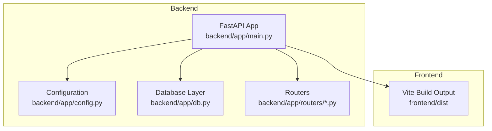
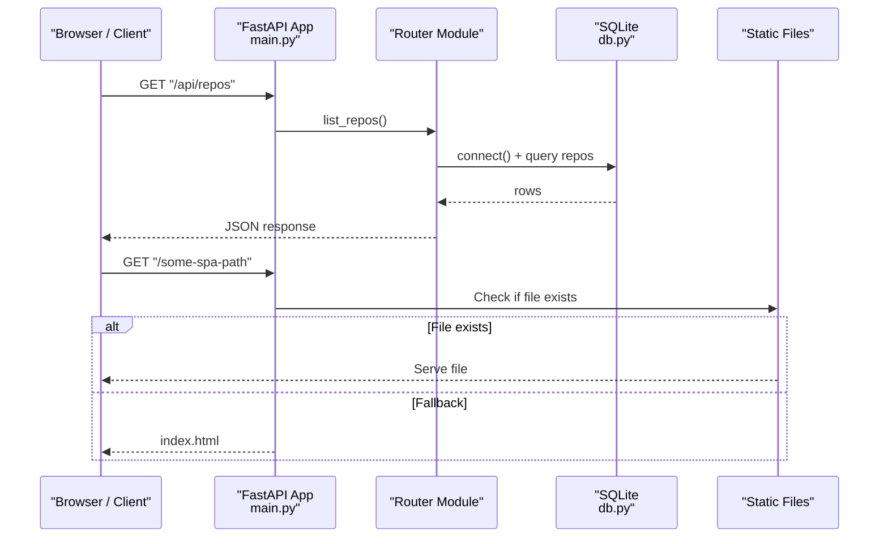
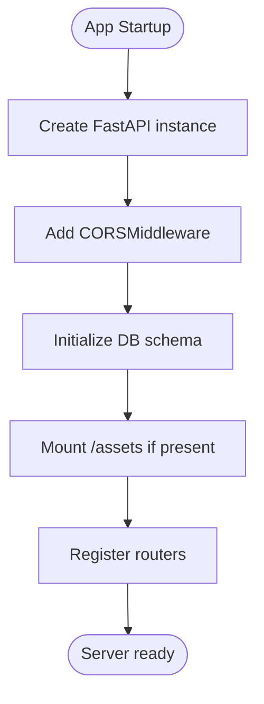
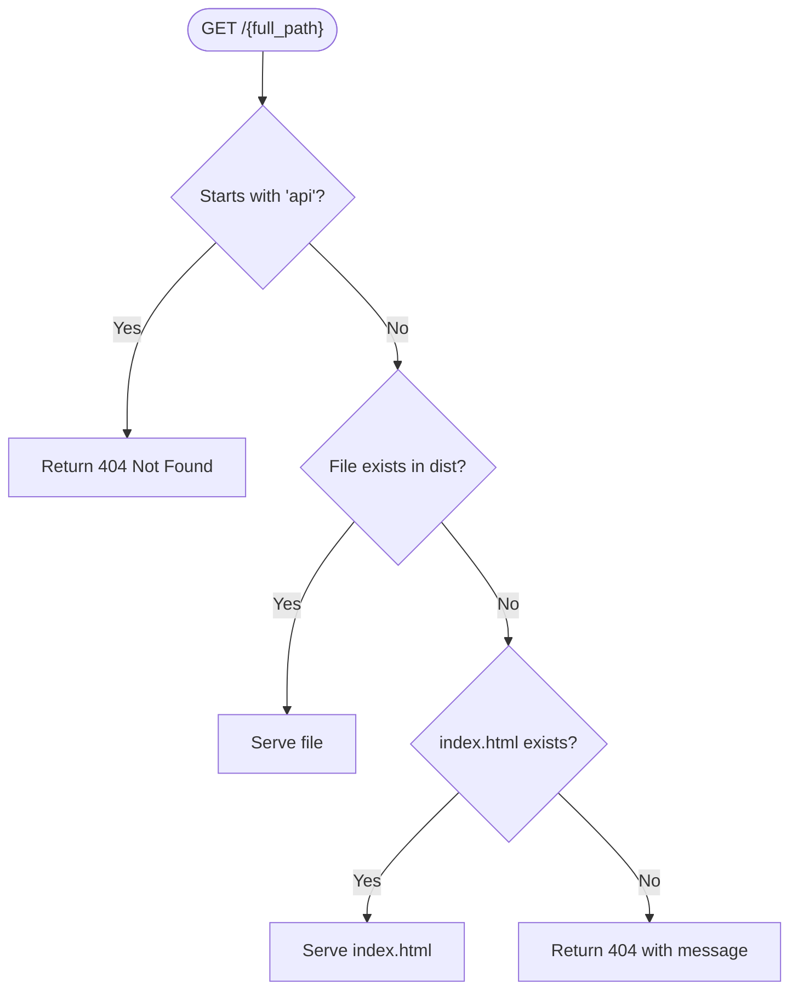
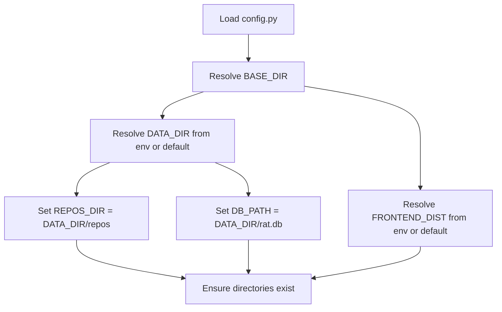
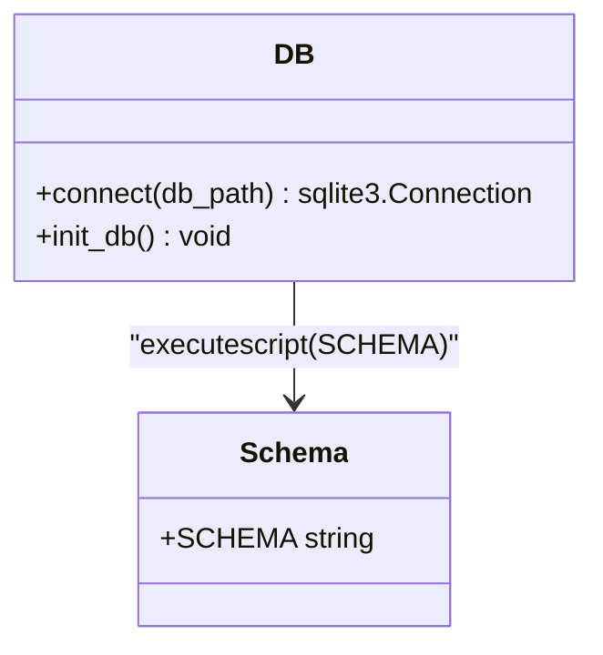
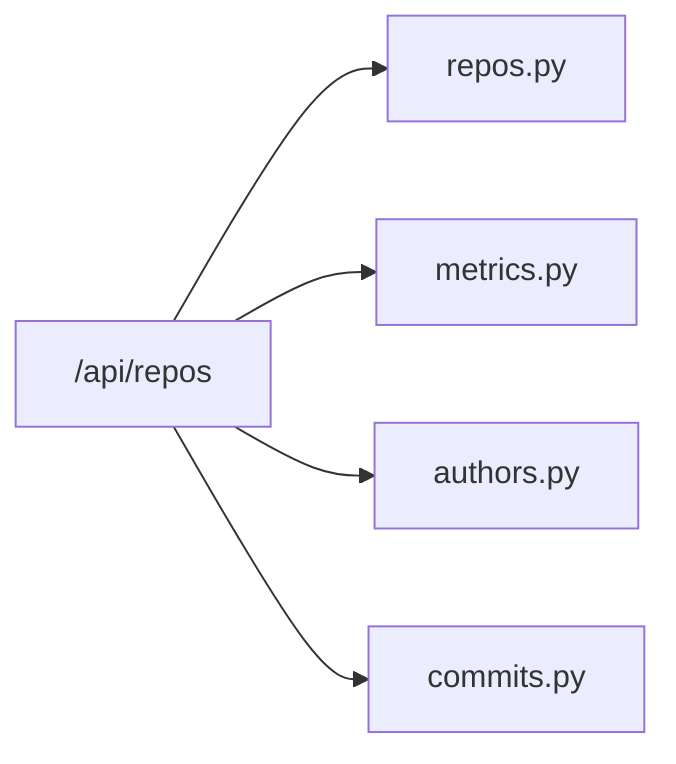
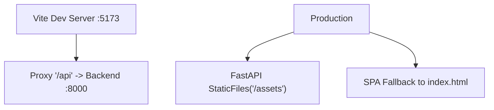
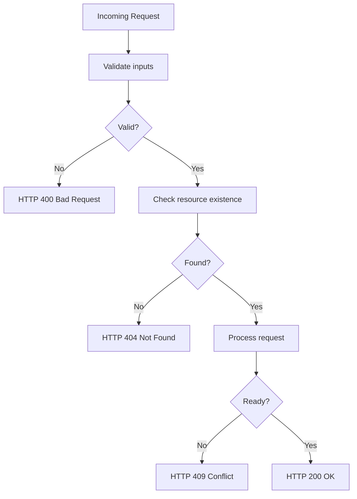
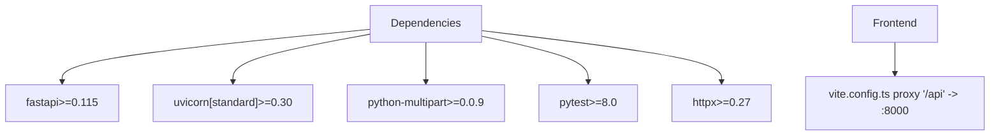

# Application Entry Point & Configuration

<cite>
**Referenced Files in This Document**
- [main.py](file://backend/app/main.py)
- [config.py](file://backend/app/config.py)
- [db.py](file://backend/app/db.py)
- [requirements.txt](file://backend/requirements.txt)
- [vite.config.ts](file://frontend/vite.config.ts)
- [repos.py](file://backend/app/routers/repos.py)
- [metrics.py](file://backend/app/routers/metrics.py)
- [authors.py](file://backend/app/routers/authors.py)
- [commits.py](file://backend/app/routers/commits.py)
</cite>

## Table of Contents
1. [Introduction](#introduction)
2. [Project Structure](#project-structure)
3. [Core Components](#core-components)
4. [Architecture Overview](#architecture-overview)
5. [Detailed Component Analysis](#detailed-component-analysis)
6. [Dependency Analysis](#dependency-analysis)
7. [Performance Considerations](#performance-considerations)
8. [Troubleshooting Guide](#troubleshooting-guide)
9. [Conclusion](#conclusion)

## Introduction
This document explains the FastAPI application entry point and configuration management for the RAT (Repo Analysis Tool). It covers how the application initializes, configures CORS, registers API routers, serves static frontend assets, handles SPA fallback routing, manages environment-driven configuration, integrates with the SQLite database layer, and organizes API routes. It also includes startup examples, error handling strategies, and deployment considerations.

## Project Structure
The backend is a FastAPI application under `backend/app`. The main entry point creates the FastAPI app, adds middleware, initializes the database, mounts static assets, and registers routers. Configuration is centralized in a small module that reads environment variables and resolves paths. The frontend is built by Vite and served statically by the backend when available.

**Diagram sources**
- [main.py:13-49](file://backend/app/main.py#L13-L49)
- [config.py:7-15](file://backend/app/config.py#L7-L15)
- [db.py:74-87](file://backend/app/db.py#L74-L87)
- [repos.py:16-114](file://backend/app/routers/repos.py#L16-L114)
- [metrics.py:10-41](file://backend/app/routers/metrics.py#L10-L41)
- [authors.py:9-50](file://backend/app/routers/authors.py#L9-L50)
- [commits.py:10-103](file://backend/app/routers/commits.py#L10-L103)

**Section sources**
- [main.py:1-49](file://backend/app/main.py#L1-L49)
- [config.py:1-15](file://backend/app/config.py#L1-L15)
- [db.py:1-87](file://backend/app/db.py#L1-L87)
- [vite.config.ts:1-27](file://frontend/vite.config.ts#L1-L27)

## Core Components
- Application entry point: Creates the FastAPI instance, adds CORS middleware, initializes the database, mounts static assets, and registers routers.
- Configuration: Resolves base directories, data locations, repository storage, database path, and frontend distribution path using environment variables.
- Database layer: Provides schema creation and tuned SQLite connections.
- Routers: Organize API endpoints for repositories, metrics, authors, and commits under `/api/repos`.
- Frontend integration: Serves built assets and provides SPA fallback to `index.html`.

**Section sources**
- [main.py:13-49](file://backend/app/main.py#L13-L49)
- [config.py:7-15](file://backend/app/config.py#L7-L15)
- [db.py:74-87](file://backend/app/db.py#L74-L87)
- [repos.py:16-114](file://backend/app/routers/repos.py#L16-L114)
- [metrics.py:10-41](file://backend/app/routers/metrics.py#L10-L41)
- [authors.py:9-50](file://backend/app/routers/authors.py#L9-L50)
- [commits.py:10-103](file://backend/app/routers/commits.py#L10-L103)

## Architecture Overview
The application follows a layered structure:
- HTTP layer: FastAPI app with CORS middleware and static file mounting.
- Routing layer: Feature-based routers under `/api/repos`.
- Domain layer: Metrics computation, author merging, and ingestion orchestration.
- Persistence layer: SQLite with schema initialization and connection helpers.
- Frontend layer: Vite-built SPA served via static files and SPA fallback.

**Diagram sources**
- [main.py:15-49](file://backend/app/main.py#L15-L49)
- [repos.py:43-47](file://backend/app/routers/repos.py#L43-L47)
- [db.py:74-87](file://backend/app/db.py#L74-L87)

## Detailed Component Analysis

### Application Initialization and Middleware
- The FastAPI app is created with title and version metadata.
- CORS middleware is added to allow requests from the local Vite dev server origins.
- The database is initialized at import time to ensure schema availability before serving requests.
- Routers are registered under `/api/repos` for repos, metrics, authors, and commits.
- Static assets are mounted under `/assets` when the frontend build directory exists.

**Diagram sources**
- [main.py:13-27](file://backend/app/main.py#L13-L27)

**Section sources**
- [main.py:13-27](file://backend/app/main.py#L13-L27)

### SPA Fallback Mechanism
- A catch-all route captures all non-API paths.
- Paths starting with `api` return a 404 to avoid intercepting API routes.
- If the requested path maps to an existing file within the frontend distribution, it is served directly.
- Otherwise, `index.html` is returned to enable client-side routing.
- If the frontend is not built, a JSON 404 indicates that the frontend must be built or served via Vite dev server.

**Diagram sources**
- [main.py:33-49](file://backend/app/main.py#L33-L49)

**Section sources**
- [main.py:33-49](file://backend/app/main.py#L33-L49)

### Configuration System and Environment Variables
- Base directory resolution points to the backend package parent.
- Data directory defaults to `backend/data`, configurable via `RAT_DATA_DIR`.
- Repository storage defaults to `backend/data/repos`.
- Database path defaults to `backend/data/rat.db`.
- Frontend distribution path defaults to `frontend/dist`, configurable via `RAT_FRONTEND_DIST`.
- Directories are created automatically on import.

**Diagram sources**
- [config.py:7-15](file://backend/app/config.py#L7-L15)

**Section sources**
- [config.py:7-15](file://backend/app/config.py#L7-L15)

### Database Integration
- Schema defines tables for repositories, commits, file changes, merged authors, and author merges.
- Connection helper enables WAL mode, normal synchronous behavior, and foreign keys.
- `init_db()` runs schema creation on startup.

**Diagram sources**
- [db.py:13-71](file://backend/app/db.py#L13-L71)
- [db.py:74-87](file://backend/app/db.py#L74-L87)

**Section sources**
- [db.py:13-87](file://backend/app/db.py#L13-L87)

### API Routing Organization
All feature routers share the `/api/repos` prefix and are organized by domain:
- Repositories: upload, clone, list, get, delete.
- Metrics: POST per view with shared filter body and caching.
- Authors: list, merge identities, unmerge identity/group.
- Commits: list with search and pagination; path picker for filters.

**Diagram sources**
- [repos.py:16-114](file://backend/app/routers/repos.py#L16-L114)
- [metrics.py:10-41](file://backend/app/routers/metrics.py#L10-L41)
- [authors.py:9-50](file://backend/app/routers/authors.py#L9-L50)
- [commits.py:10-103](file://backend/app/routers/commits.py#L10-L103)

**Section sources**
- [repos.py:16-114](file://backend/app/routers/repos.py#L16-L114)
- [metrics.py:10-41](file://backend/app/routers/metrics.py#L10-L41)
- [authors.py:9-50](file://backend/app/routers/authors.py#L9-L50)
- [commits.py:10-103](file://backend/app/routers/commits.py#L10-L103)

### Static File Serving for the Frontend SPA
- When the frontend build directory contains an `assets` folder, it is mounted at `/assets`.
- The SPA fallback ensures client-side routes resolve to `index.html`.
- During development, Vite proxies `/api` to the backend running on port 8000.

**Diagram sources**
- [main.py:29-31](file://backend/app/main.py#L29-L31)
- [main.py:33-49](file://backend/app/main.py#L33-L49)
- [vite.config.ts:6-14](file://frontend/vite.config.ts#L6-L14)

**Section sources**
- [main.py:29-49](file://backend/app/main.py#L29-L49)
- [vite.config.ts:6-14](file://frontend/vite.config.ts#L6-L14)

### Error Handling Strategies
- Validation errors in routers raise HTTPException with appropriate status codes (e.g., 400 for invalid input, 404 for missing resources, 409 for repository not ready).
- SPA fallback returns 404 for API-like paths and when the frontend is not built.
- Database operations use context managers to ensure proper connection lifecycle.

**Diagram sources**
- [repos.py:50-94](file://backend/app/routers/repos.py#L50-L94)
- [metrics.py:13-41](file://backend/app/routers/metrics.py#L13-L41)
- [main.py:33-49](file://backend/app/main.py#L33-L49)

**Section sources**
- [repos.py:50-94](file://backend/app/routers/repos.py#L50-L94)
- [metrics.py:13-41](file://backend/app/routers/metrics.py#L13-L41)
- [main.py:33-49](file://backend/app/main.py#L33-L49)

## Dependency Analysis
- FastAPI and Uvicorn provide the web server and ASGI runtime.
- python-multipart supports multipart form uploads for repository zips.
- pytest and httpx support testing utilities.
- Frontend uses Vite with React plugin and proxies API calls during development.

**Diagram sources**
- [requirements.txt:1-6](file://backend/requirements.txt#L1-L6)
- [vite.config.ts:6-14](file://frontend/vite.config.ts#L6-L14)

**Section sources**
- [requirements.txt:1-6](file://backend/requirements.txt#L1-L6)
- [vite.config.ts:6-14](file://frontend/vite.config.ts#L6-L14)

## Performance Considerations
- SQLite is configured with WAL mode and NORMAL synchronous behavior for better concurrency and performance.
- Foreign keys are enabled to maintain referential integrity.
- Metrics responses are cached by key to reduce repeated computations.
- Static asset serving avoids unnecessary processing for known paths.
- Pagination and limits are enforced on commit listing and path queries.

[No sources needed since this section provides general guidance]

## Troubleshooting Guide
- Frontend not built:
  - Symptom: Requests to SPA routes return a JSON 404 indicating the frontend is not built.
  - Resolution: Run the frontend build process or serve via Vite dev server.
- CORS issues:
  - Symptom: Browser blocks requests from the dev server.
  - Resolution: Ensure CORS allows the dev server origin (localhost:5173).
- API not reachable:
  - Symptom: SPA tries to call `/api/*` but receives 404.
  - Resolution: Verify Vite proxy configuration forwards `/api` to the backend.
- Database errors:
  - Symptom: 500 errors or inability to read/write data.
  - Resolution: Check database path permissions and ensure `init_db()` ran successfully.

**Section sources**
- [main.py:33-49](file://backend/app/main.py#L33-L49)
- [main.py:15-20](file://backend/app/main.py#L15-L20)
- [vite.config.ts:6-14](file://frontend/vite.config.ts#L6-L14)
- [db.py:74-87](file://backend/app/db.py#L74-L87)

## Conclusion
The FastAPI application provides a clear separation between configuration, routing, and persistence, with robust SPA support and sensible defaults for development and production. Environment variables allow flexible deployment configurations, while the router organization keeps API endpoints modular and maintainable. Proper error handling and performance tuning ensure a reliable user experience across both development and production environments.