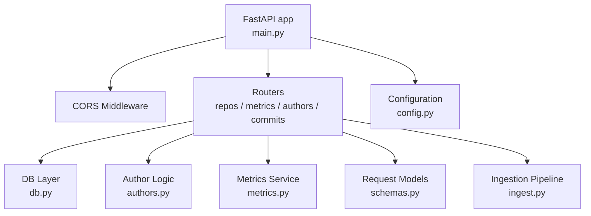
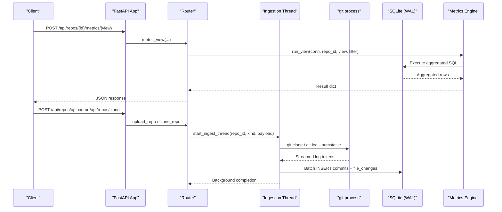
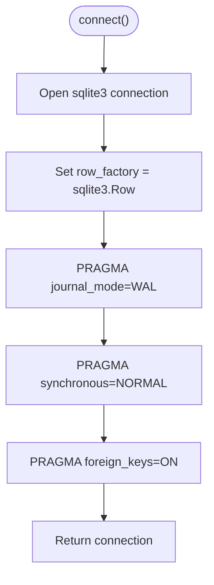
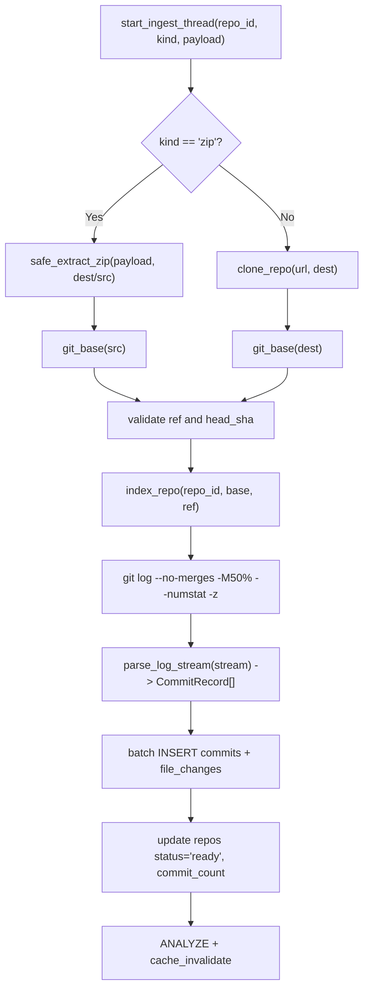
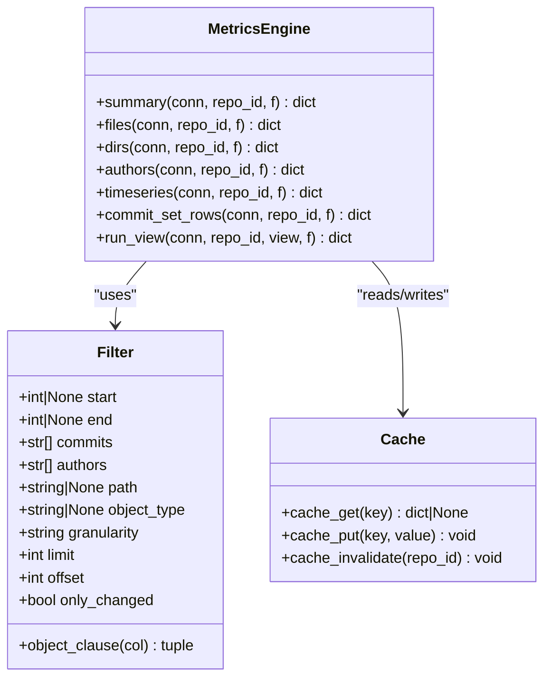
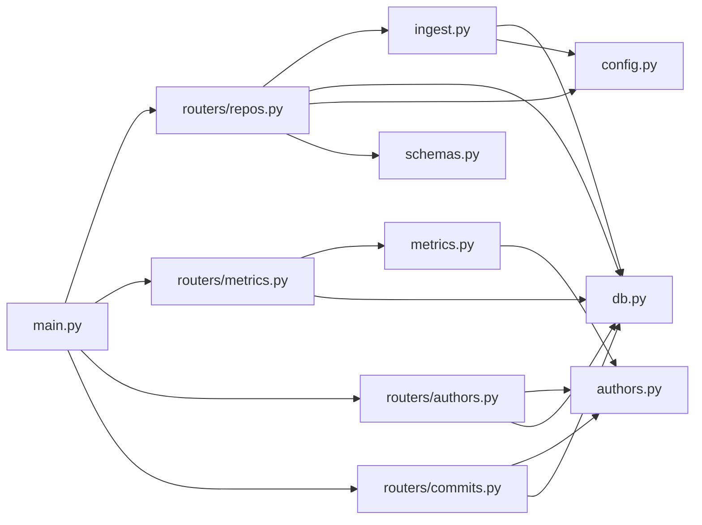

# Backend Architecture

<cite>
**Referenced Files in This Document**
- [main.py](file://backend/app/main.py)
- [config.py](file://backend/app/config.py)
- [db.py](file://backend/app/db.py)
- [ingest.py](file://backend/app/ingest.py)
- [metrics.py](file://backend/app/metrics.py)
- [authors.py](file://backend/app/authors.py)
- [schemas.py](file://backend/app/schemas.py)
- [repos.py](file://backend/app/routers/repos.py)
- [metrics_router.py](file://backend/app/routers/metrics.py)
- [authors_router.py](file://backend/app/routers/authors.py)
- [commits_router.py](file://backend/app/routers/commits.py)
</cite>

## Table of Contents
1. [Introduction](#introduction)
2. [Project Structure](#project-structure)
3. [Core Components](#core-components)
4. [Architecture Overview](#architecture-overview)
5. [Detailed Component Analysis](#detailed-component-analysis)
6. [Dependency Analysis](#dependency-analysis)
7. [Performance Considerations](#performance-considerations)
8. [Troubleshooting Guide](#troubleshooting-guide)
9. [Conclusion](#conclusion)

## Introduction
This document explains the backend architecture of RAT, a FastAPI-based repository analysis tool. It covers the application entry point, modular routing, service layer organization, SQLite storage with WAL mode and transaction handling, the streamed ingestion pipeline for git history, the metrics calculation engine using SQL aggregation, API routing patterns, middleware, error handling, and configuration management. The goal is to make the system understandable for both technical and non-technical readers while preserving precise implementation details.

## Project Structure
The backend lives under `backend/app` and follows a layered design:
- Application bootstrap and middleware are defined at the top level.
- Configuration is centralized.
- Database schema and connection helpers are isolated.
- Ingestion handles repository acquisition and streaming indexing.
- Metrics provide query-time aggregation over committed data.
- Author identity logic supports manual merging without re-indexing.
- Routers expose REST endpoints grouped by feature.
- Pydantic schemas define request models.

**Diagram sources**
- [main.py:13-27](file://backend/app/main.py#L13-L27)
- [config.py:7-15](file://backend/app/config.py#L7-L15)
- [db.py:74-87](file://backend/app/db.py#L74-L87)
- [ingest.py:362-439](file://backend/app/ingest.py#L362-L439)
- [metrics.py:389-400](file://backend/app/metrics.py#L389-L400)
- [authors.py:15-25](file://backend/app/authors.py#L15-L25)
- [repos.py:16-114](file://backend/app/routers/repos.py#L16-L114)
- [metrics_router.py:10-41](file://backend/app/routers/metrics.py#L10-L41)
- [authors_router.py:9-50](file://backend/app/routers/authors.py#L9-L50)
- [commits_router.py:10-103](file://backend/app/routers/commits.py#L10-L103)

**Section sources**
- [main.py:1-49](file://backend/app/main.py#L1-L49)
- [config.py:1-15](file://backend/app/config.py#L1-L15)

## Core Components
- FastAPI application and SPA fallback serve the frontend assets and route API requests.
- Configuration centralizes paths for data, repositories, database file, and frontend distribution.
- Database layer defines schema, provides tuned connections, and initializes tables.
- Ingestion orchestrates cloning or zip extraction, streams git log output, parses it incrementally, and batches writes into SQLite.
- Metrics engine computes aggregates via SQL CTEs and Python post-processing, with a small TTL cache.
- Author logic manages identity merges and exposes shared SQL fragments used across queries.
- Routers implement REST endpoints for repos, metrics, authors, and commits.
- Schemas validate incoming requests.

**Section sources**
- [main.py:13-49](file://backend/app/main.py#L13-L49)
- [config.py:7-15](file://backend/app/config.py#L7-L15)
- [db.py:13-87](file://backend/app/db.py#L13-L87)
- [ingest.py:45-439](file://backend/app/ingest.py#L45-L439)
- [metrics.py:43-435](file://backend/app/metrics.py#L43-L435)
- [authors.py:15-131](file://backend/app/authors.py#L15-L131)
- [schemas.py:9-30](file://backend/app/schemas.py#L9-L30)

## Architecture Overview
At runtime:
- FastAPI starts, adds CORS middleware, initializes the database, mounts static assets, and includes routers.
- Clients call `/api/*` endpoints; all other routes fall back to serving the SPA.
- Repository operations trigger background ingestion threads that clone or extract repositories and stream index them.
- Metrics endpoints compute aggregates on demand, optionally cached.
- Author operations update merge mappings and invalidate caches.

**Diagram sources**
- [main.py:13-49](file://backend/app/main.py#L13-L49)
- [metrics_router.py:13-41](file://backend/app/routers/metrics.py#L13-L41)
- [metrics.py:389-400](file://backend/app/metrics.py#L389-L400)
- [repos.py:50-94](file://backend/app/routers/repos.py#L50-L94)
- [ingest.py:280-355](file://backend/app/ingest.py#L280-L355)
- [db.py:74-87](file://backend/app/db.py#L74-L87)

## Detailed Component Analysis

### FastAPI Application and Routing
- The app registers CORS middleware allowing the local dev frontend.
- Database initialization runs at startup.
- Routers are included for repos, metrics, authors, and commits.
- A catch-all route serves the built SPA unless the path starts with `api`.

Key behaviors:
- Static assets are mounted when present.
- Non-API paths resolve to `index.html` if available.
- API paths intentionally return 404 from the SPA fallback.

**Section sources**
- [main.py:13-49](file://backend/app/main.py#L13-L49)

### Configuration Management
- Centralized constants derive from environment variables or defaults.
- Data directory, repos directory, database path, and frontend dist path are configured.
- Directories are created lazily at import time.

Operational notes:
- Override `RAT_DATA_DIR` to relocate persistent data.
- Override `RAT_FRONTEND_DIST` to serve a custom-built frontend.

**Section sources**
- [config.py:7-15](file://backend/app/config.py#L7-L15)

### Database Abstraction Layer
Responsibilities:
- Define schema for repositories, commits, file changes, merged authors, and author merges.
- Provide a tuned connection helper enabling WAL mode, synchronous tuning, and foreign keys.
- Initialize schema once at startup.

Design highlights:
- All tables use `repo_id` scoping for multi-repository support.
- Indexes optimize time-range and email lookups.
- `WITHOUT ROWID` reduces storage for large fact tables.
- Connection uses `sqlite.Row` for dict-like access.

**Diagram sources**
- [db.py:74-81](file://backend/app/db.py#L74-L81)

Transaction handling:
- Routers typically open a connection per request and rely on context managers (`with db.connect()`) to commit or rollback.
- Ingestion uses explicit transactions around batched inserts.

**Section sources**
- [db.py:13-87](file://backend/app/db.py#L13-L87)

### Ingestion Pipeline
Goals:
- Acquire repositories either by cloning a URL or extracting a zip archive.
- Stream the full git history in one pass and persist commits and file changes efficiently.
- Provide progress updates and cancellation support.

Pipeline stages:
1. Acquisition:
   - Clone: mirror clone with progress parsing.
   - Zip: safe extraction with traversal protection.
2. Reference validation:
   - Resolve HEAD and detect presence of `.mailmap`.
3. Streaming index:
   - Run `git log` with numstat and NUL-delimited format.
   - Incrementally parse tokens into commit records and file changes.
   - Batch insert into SQLite to minimize round-trips.
4. Completion:
   - Update repository status, commit count, and invalidate metrics cache.

Memory optimization techniques:
- NUL-token iterator reads chunks and yields tokens without loading the entire stream.
- Batching thresholds limit memory growth during parsing.
- Binary files are skipped to avoid measuring unmeasured diffs.
- Temporary mailmap file is cleaned up after use.

Error handling:
- Custom `IngestError` wraps user-actionable failures.
- Progress callbacks reflect real-time state; abort checks kill the process safely.

**Diagram sources**
- [ingest.py:97-157](file://backend/app/ingest.py#L97-L157)
- [ingest.py:280-355](file://backend/app/ingest.py#L280-L355)
- [ingest.py:362-439](file://backend/app/ingest.py#L362-L439)

**Section sources**
- [ingest.py:45-439](file://backend/app/ingest.py#L45-L439)

### Metrics Calculation Engine
Responsibilities:
- Implement formulas for added, removed, growth, churn, modifications, modification frequency, churn rate, and ownership.
- Provide views for summary, per-file, per-directory, per-author, timeseries, and commit set listing.
- Support filters: time range, manual commit selection, author filtering, object path/type, granularity, pagination, and only-changed commits.

SQL aggregation patterns:
- A common CTE builds the commit set `H` with author resolution via shared SQL fragments.
- Object membership uses exact match for files and prefix ranges for directories.
- Aggregations leverage `SUM`, `COUNT(DISTINCT ...)`, and conditional expressions.
- Timeseries buckets use date formatting functions for day/week/month.

Formula validation:
- Derived metrics are computed consistently through a helper function.
- Directory metrics de-duplicate modifications per commit to avoid double-counting.

Performance optimizations:
- Shared CTE construction avoids repeated subqueries.
- Temporary table materializes manual commit selections.
- Limits and offsets constrain result sets.
- Small in-process TTL cache stores expensive results keyed by view and normalized payload.

**Diagram sources**
- [metrics.py:43-128](file://backend/app/metrics.py#L43-L128)
- [metrics.py:135-386](file://backend/app/metrics.py#L135-L386)
- [metrics.py:407-435](file://backend/app/metrics.py#L407-L435)

**Section sources**
- [metrics.py:1-435](file://backend/app/metrics.py#L1-L435)

### Author Identity and Merge Management
Responsibilities:
- Maintain raw and mailmap-resolved author fields per commit.
- Allow manual merging of identities into groups without re-indexing.
- Expose shared SQL fragments for consistent author key/name computation across queries.

Design highlights:
- `AUTHOR_JOIN`, `AUTHOR_KEY_SQL`, and `AUTHOR_NAME_SQL` are reused by metrics and commit list queries.
- Merge operations unify existing groups and clean empty groups.
- Unmerge operations remove identity-to-group mappings and orphaned groups.

**Section sources**
- [authors.py:15-131](file://backend/app/authors.py#L15-L131)

### API Routing Patterns
Patterns:
- Feature-scoped routers under `/api/repos` with tags for grouping.
- Consistent repository existence checks before operations.
- Request validation via Pydantic models.
- Background tasks for long-running ingestion.
- Cache invalidation after mutating operations.

Endpoints overview:
- Repositories:
  - List repositories.
  - Upload zip archive.
  - Clone from URL.
  - Get repository metadata.
  - Delete repository.
- Metrics:
  - Single endpoint per view with shared filter body.
- Authors:
  - List authors and groups.
  - Merge identities into a group.
  - Unmerge identity or group.
- Commits:
  - Paginated commit search with optional time filters.
  - Path picker returning files and derived directories.

Error handling:
- HTTPException for client errors (invalid input, not found).
- Conflict responses when querying metrics for repositories not yet ready.
- Validation errors surfaced from Pydantic models.

**Section sources**
- [repos.py:16-114](file://backend/app/routers/repos.py#L16-L114)
- [metrics_router.py:10-41](file://backend/app/routers/metrics.py#L10-L41)
- [authors_router.py:9-50](file://backend/app/routers/authors.py#L9-L50)
- [commits_router.py:10-103](file://backend/app/routers/commits.py#L10-L103)
- [schemas.py:9-30](file://backend/app/schemas.py#L9-L30)

## Dependency Analysis
High-level dependencies:
- Routers depend on `db`, `metrics`, `authors`, and `schemas`.
- Metrics depends on `authors` for shared SQL fragments.
- Ingestion depends on `db` and `config`.
- Main wires everything together and mounts routers.

**Diagram sources**
- [main.py:9-27](file://backend/app/main.py#L9-L27)
- [repos.py:11-14](file://backend/app/routers/repos.py#L11-L14)
- [metrics_router.py:8-9](file://backend/app/routers/metrics.py#L8-L9)
- [authors_router.py:6-7](file://backend/app/routers/authors.py#L6-L7)
- [commits_router.py:6-8](file://backend/app/routers/commits.py#L6-L8)
- [metrics.py:37-37](file://backend/app/metrics.py#L37-L37)
- [ingest.py:35-36](file://backend/app/ingest.py#L35-L36)

**Section sources**
- [main.py:9-27](file://backend/app/main.py#L9-L27)
- [repos.py:11-14](file://backend/app/routers/repos.py#L11-L14)
- [metrics_router.py:8-9](file://backend/app/routers/metrics.py#L8-L9)
- [authors_router.py:6-7](file://backend/app/routers/authors.py#L6-L7)
- [commits_router.py:6-8](file://backend/app/routers/commits.py#L6-L8)
- [metrics.py:37-37](file://backend/app/metrics.py#L37-L37)
- [ingest.py:35-36](file://backend/app/ingest.py#L35-L36)

## Performance Considerations
- SQLite WAL mode improves concurrency and read performance.
- `synchronous=NORMAL` balances durability and throughput.
- Foreign keys enabled ensure referential integrity.
- Streaming ingestion keeps memory usage flat by processing tokens incrementally.
- Batched inserts reduce transaction overhead.
- Metrics queries reuse CTEs and temporary tables to avoid redundant work.
- In-memory TTL cache reduces repeated expensive aggregations.
- Time-series bucketing leverages SQLite date functions for efficient grouping.
- Limits and offsets bound result sizes for responsive APIs.

[No sources needed since this section provides general guidance]

## Troubleshooting Guide
Common issues and resolutions:
- Frontend not served:
  - Ensure the frontend is built or the Vite dev server is running.
  - Check that `FRONTEND_DIST` points to a valid build directory.
- Repository ingestion fails:
  - Inspect repository status and error field returned by repository endpoints.
  - Validate URLs and credentials; ensure `git` is available.
  - For zip uploads, verify archives are valid and do not contain unsafe entries.
- Metrics unavailable:
  - Wait until repository status becomes `ready`.
  - Invalidate cache after ingestion or author merges.
- Slow queries:
  - Use appropriate filters (time range, path, authors).
  - Reduce limits and consider monthly granularity for broad trends.

Operational tips:
- Monitor repository status via the repository list endpoint.
- Use the path picker to confirm indexed objects exist.
- Clear or adjust the metrics cache size if memory pressure occurs.

**Section sources**
- [main.py:33-49](file://backend/app/main.py#L33-L49)
- [repos.py:50-114](file://backend/app/routers/repos.py#L50-L114)
- [metrics_router.py:13-41](file://backend/app/routers/metrics.py#L13-L41)
- [ingest.py:362-439](file://backend/app/ingest.py#L362-L439)

## Conclusion
RAT’s backend combines a clear FastAPI structure with a robust ingestion pipeline and a powerful SQL-driven metrics engine. The design emphasizes streaming efficiency, batched persistence, and query-time aggregation, while providing flexible author identity management and a simple caching strategy. With WAL-enabled SQLite, careful transaction handling, and well-scoped routers, the system scales across multiple repositories and supports interactive exploration of repository metrics.