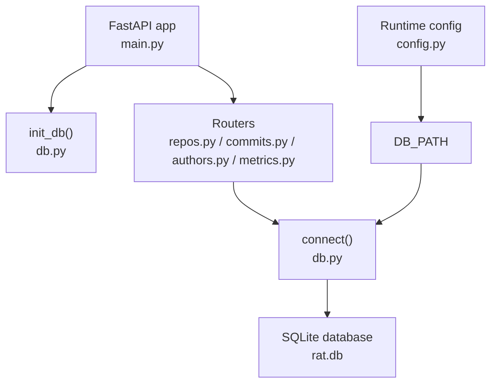
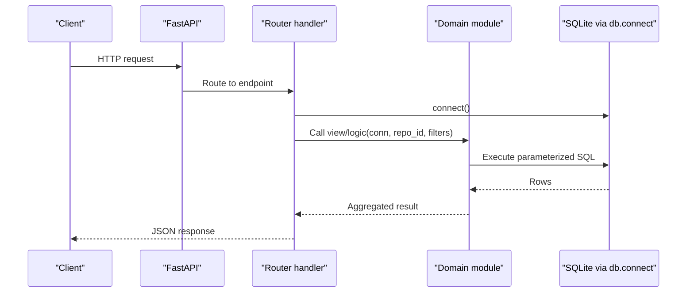
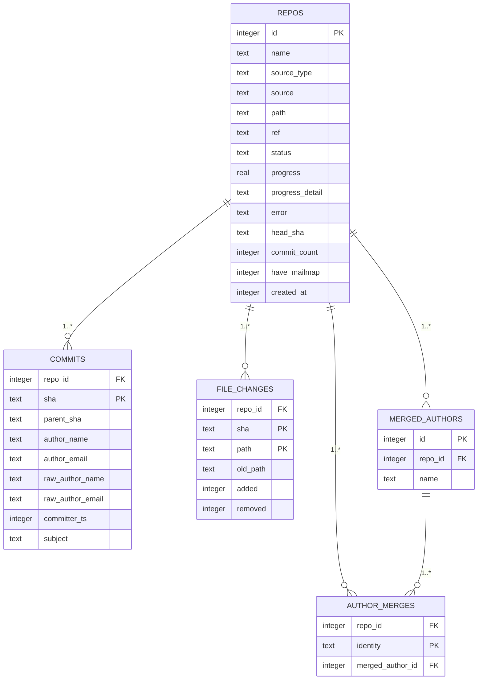
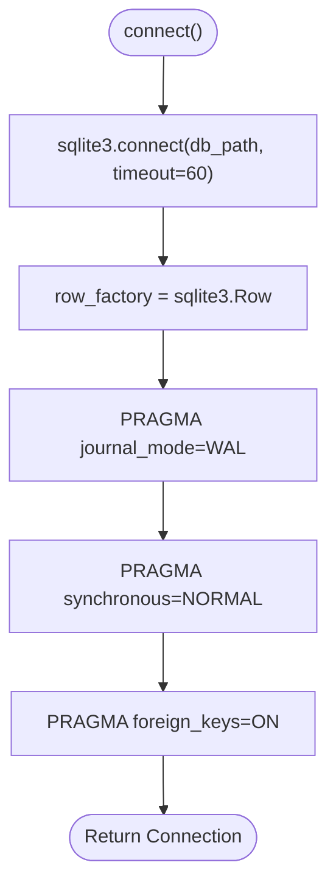
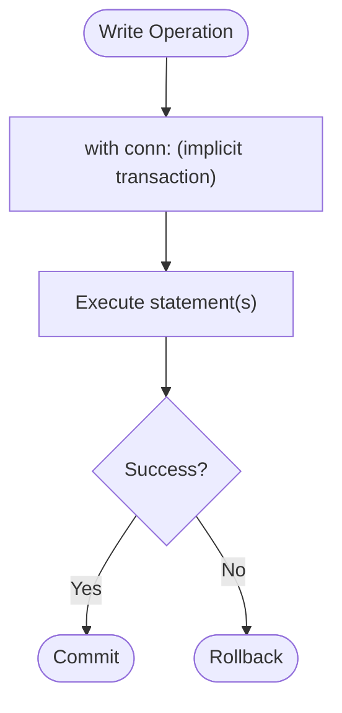
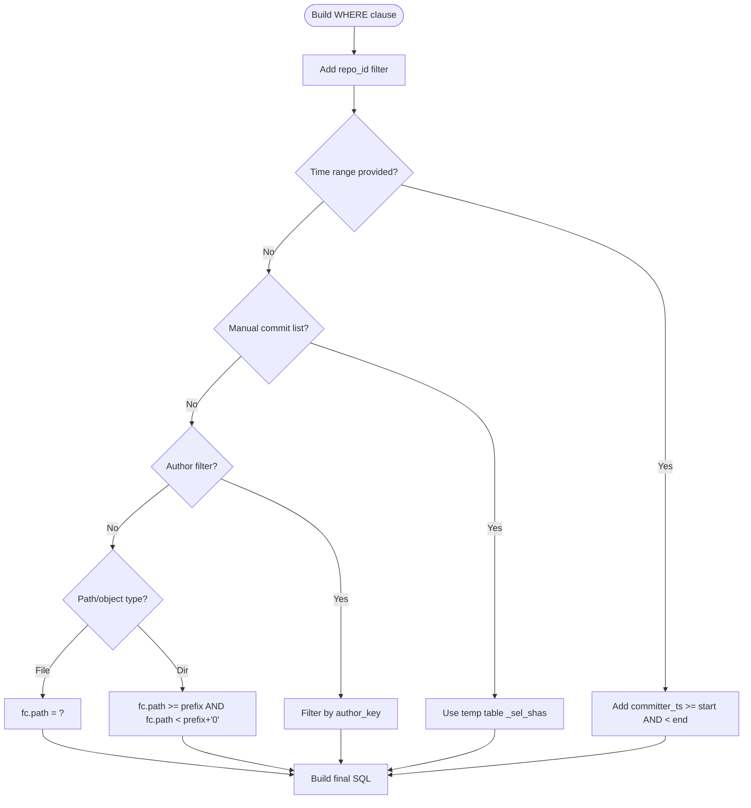
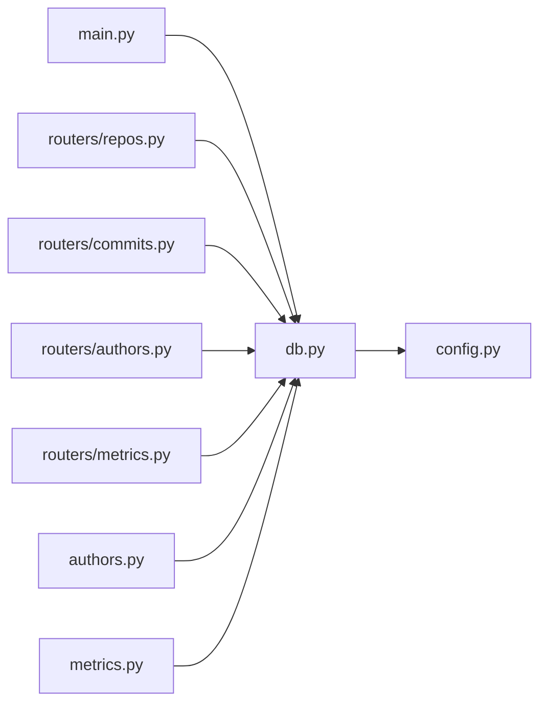

# Database Layer & Schema Management

<cite>
**Referenced Files in This Document**
- [db.py](file://backend/app/db.py)
- [config.py](file://backend/app/config.py)
- [main.py](file://backend/app/main.py)
- [repos.py](file://backend/app/routers/repos.py)
- [commits.py](file://backend/app/routers/commits.py)
- [authors.py](file://backend/app/authors.py)
- [metrics.py](file://backend/app/metrics.py)
- [schemas.py](file://backend/app/schemas.py)
</cite>

## Table of Contents
1. [Introduction](#introduction)
2. [Project Structure](#project-structure)
3. [Core Components](#core-components)
4. [Architecture Overview](#architecture-overview)
5. [Detailed Component Analysis](#detailed-component-analysis)
6. [Dependency Analysis](#dependency-analysis)
7. [Performance Considerations](#performance-considerations)
8. [Troubleshooting Guide](#troubleshooting-guide)
9. [Conclusion](#conclusion)

## Introduction
This document explains the SQLite database layer and schema management for the repository analysis tool. It covers the data model for repositories, commits, file changes, author merges, and metrics; how connections are configured for concurrent access; how transactions are used; how the database is initialized; and which query patterns and indexes support performance. It also provides practical guidance for common operations and consistency best practices.

## Project Structure
The backend stores all metric-related data in a single SQLite database. The database path is derived from runtime configuration, and the FastAPI application initializes the schema at startup. Each feature area (repositories, commits, authors, metrics) exposes API endpoints that open short-lived connections through a shared helper.

**Diagram sources**
- [main.py:10-27](file://backend/app/main.py#L10-L27)
- [db.py:74-86](file://backend/app/db.py#L74-L86)
- [config.py:7-10](file://backend/app/config.py#L7-L10)

**Section sources**
- [main.py:1-49](file://backend/app/main.py#L1-L49)
- [config.py:1-15](file://backend/app/config.py#L1-L15)
- [db.py:1-86](file://backend/app/db.py#L1-L86)

## Core Components
- Database connection helper: creates tuned SQLite connections with WAL mode, synchronous tuning, and foreign key enforcement.
- Schema definition: tables for repositories, commits, file changes, merged authors, and author merge mappings.
- Initialization routine: runs the schema script on startup.
- Configuration: defines the database file location under a configurable data directory.
- Feature routers: repositories, commits, authors, and metrics endpoints use the connection helper and execute SQL queries.

Key responsibilities:
- `db.connect` centralizes connection options and row factory behavior.
- `db.init_db` ensures the schema exists before any request handling.
- Routers encapsulate business logic and call into domain modules (`authors`, `metrics`) while using `db.connect`.

**Section sources**
- [db.py:13-86](file://backend/app/db.py#L13-L86)
- [config.py:7-10](file://backend/app/config.py#L7-L10)
- [main.py:13-27](file://backend/app/main.py#L13-L27)

## Architecture Overview
The system follows a layered approach:
- Application entry point initializes the database and mounts routers.
- Routers validate inputs, enforce repository existence, and delegate to domain modules.
- Domain modules build parameterized SQL queries against the SQLite database.
- A small in-process TTL cache accelerates repeated metric queries.

**Diagram sources**
- [main.py:22-27](file://backend/app/main.py#L22-L27)
- [repos.py:43-94](file://backend/app/routers/repos.py#L43-L94)
- [metrics.py:399-400](file://backend/app/metrics.py#L399-L400)
- [db.py:74-81](file://backend/app/db.py#L74-L81)

## Detailed Component Analysis

### Schema Design
The schema models repositories, commits, file changes, and author identity merges. All metric data is keyed by `repo_id`, enabling multi-repository filtering.

**Diagram sources**
- [db.py:13-70](file://backend/app/db.py#L13-L70)

Schema highlights:
- `repos`: tracks repository metadata, ingestion state, and aggregate counts.
- `commits`: primary key is `(repo_id, sha)` and uses `WITHOUT ROWID` for efficient lookups.
- `file_changes`: records per-commit file diffs; primary key is `(repo_id, sha, path)`.
- `merged_authors` and `author_merges`: store manual author identity merges without re-indexing commits.

Indexes:
- `idx_commits_ts` on `(repo_id, committer_ts)` supports time-range queries.
- `idx_commits_email` on `(repo_id, author_email)` supports author-based filtering.
- `idx_fc_path` on `(repo_id, path)` supports path-scoped aggregations.

Constraints:
- Foreign keys are enforced globally via PRAGMA.
- `ON DELETE CASCADE` keeps related rows consistent when a repository is deleted.

**Section sources**
- [db.py:13-70](file://backend/app/db.py#L13-L70)

### Connection Configuration and Concurrency
Connection setup:
- Uses `sqlite3.connect` with a timeout.
- Enables WAL journal mode for concurrent readers and writers.
- Sets `synchronous=NORMAL` for balanced durability/performance.
- Enables foreign key constraints.
- Uses `Row` factory for dict-like access.

Concurrency model:
- One connection per request/thread is acceptable.
- No global connection pool is implemented; each route opens its own connection and closes it after use.

**Diagram sources**
- [db.py:74-81](file://backend/app/db.py#L74-L81)

**Section sources**
- [db.py:74-81](file://backend/app/db.py#L74-L81)

### Transaction Management Patterns
Transaction usage varies by operation:
- Write-heavy operations (e.g., merging authors) use explicit transaction blocks to ensure atomicity.
- Simple reads wrap queries in context managers to auto-commit or rollback as appropriate.
- Repository creation explicitly commits after insert.

Examples:
- Author merge/unmerge operations use `with conn:` to group multiple statements atomically.
- Repository deletion uses an inner transaction block around the delete statement.

**Diagram sources**
- [authors.py:76-109](file://backend/app/authors.py#L76-L109)
- [authors.py:112-130](file://backend/app/authors.py#L112-L130)
- [repos.py:103-113](file://backend/app/routers/repos.py#L103-L113)

**Section sources**
- [authors.py:63-130](file://backend/app/authors.py#L63-L130)
- [repos.py:34-40](file://backend/app/routers/repos.py#L34-L40)
- [repos.py:103-113](file://backend/app/routers/repos.py#L103-L113)

### Database Initialization and Migration Handling
Initialization:
- `init_db()` runs during application startup and executes the full schema script.
- The schema uses `CREATE TABLE IF NOT EXISTS`, making it safe to run repeatedly.

Migration handling:
- There is no explicit migration framework; schema evolution must be additive and backward-compatible.
- New tables or columns should be introduced with defaults and optional fields to avoid breaking existing clients.

Best practice:
- Keep schema scripts idempotent.
- Avoid destructive DDL in hot paths.
- Validate new indexes do not conflict with existing ones.

**Section sources**
- [main.py:22](file://backend/app/main.py#L22)
- [db.py:84-86](file://backend/app/db.py#L84-L86)

### Query Patterns and Indexing Strategy
Common query patterns:
- Repository listing and lookup by ID.
- Commit listing with search, time range, and pagination.
- Path discovery across `file_changes`.
- Author listing with merge resolution.
- Metric views computing aggregates over commit sets and file changes.

Indexing strategy:
- Time-range queries rely on `idx_commits_ts`.
- Author email lookups benefit from `idx_commits_email`.
- Path-scoped aggregation benefits from `idx_fc_path`.

Parameterization:
- All user-supplied values are passed as parameters to prevent injection and leverage prepared statements.

**Diagram sources**
- [metrics.py:67-109](file://backend/app/metrics.py#L67-L109)
- [commits.py:20-49](file://backend/app/routers/commits.py#L20-L49)

**Section sources**
- [metrics.py:67-109](file://backend/app/metrics.py#L67-L109)
- [commits.py:13-60](file://backend/app/routers/commits.py#L13-L60)

### Data Integrity Constraints
- Foreign keys are enabled globally; referential integrity between `repos`, `commits`, `file_changes`, `merged_authors`, and `author_merges` is enforced.
- Primary keys define unique identities for commits and file changes.
- `ON DELETE CASCADE` ensures orphaned rows are removed when a repository is deleted.

Operational implications:
- Deleting a repository removes associated commits, file changes, author merges, and merged author entries automatically.
- Manual author merges can be updated or removed without altering commit history.

**Section sources**
- [db.py:31-70](file://backend/app/db.py#L31-L70)
- [db.py:78-80](file://backend/app/db.py#L78-L80)

### Common Database Operations and Best Practices

#### Repository Operations
- List repositories: ordered by creation time and ID.
- Create repository: inserts a pending record and starts background ingestion.
- Delete repository: deletes the row and cleans up on-disk data and caches.

Best practices:
- Always check repository existence before mutating related data.
- Use explicit transactions for multi-step writes.

**Section sources**
- [repos.py:43-47](file://backend/app/routers/repos.py#L43-L47)
- [repos.py:50-94](file://backend/app/routers/repos.py#L50-L94)
- [repos.py:103-113](file://backend/app/routers/repos.py#L103-L113)

#### Commit Listing and Filtering
- Supports free-text search across SHA, subject, author name, and email.
- Supports time range filtering using `committer_ts`.
- Returns paginated results with total count.

Best practices:
- Limit search scope with repo_id.
- Use indices on `committer_ts` and `author_email` for performance.

**Section sources**
- [commits.py:13-60](file://backend/app/routers/commits.py#L13-L60)

#### Author Identity Merging
- Lists authors with resolved merge groups.
- Merges multiple identities into one group atomically.
- Unmerges identities or entire groups.

Best practices:
- Normalize identities to lowercase emails.
- Ensure merge operations are wrapped in transactions.

**Section sources**
- [authors.py:28-60](file://backend/app/authors.py#L28-L60)
- [authors.py:63-130](file://backend/app/authors.py#L63-L130)

#### Metrics Views
- Provides summary, files, dirs, authors, timeseries, and commits views.
- Uses CTEs and temporary tables for flexible filtering.
- Applies object scoping (file or directory subtree).
- Includes an in-process TTL cache for expensive views.

Best practices:
- Prefer time-range filters to reduce dataset size.
- Use path scoping to limit aggregation scope.
- Leverage caching for repeated identical queries.

**Section sources**
- [metrics.py:43-109](file://backend/app/metrics.py#L43-L109)
- [metrics.py:135-396](file://backend/app/metrics.py#L135-L396)
- [metrics.py:407-434](file://backend/app/metrics.py#L407-L434)

## Dependency Analysis
The database layer is used by all routers and domain modules. The following diagram shows the main dependencies:

**Diagram sources**
- [db.py:11-11](file://backend/app/db.py#L11-L11)
- [main.py:10-27](file://backend/app/main.py#L10-L27)
- [repos.py:11-14](file://backend/app/routers/repos.py#L11-L14)
- [commits.py:6-8](file://backend/app/routers/commits.py#L6-L8)
- [authors.py:4-7](file://backend/app/routers/authors.py#L4-L7)
- [metrics.py:6-8](file://backend/app/routers/metrics.py#L6-L8)

Coupling and cohesion:
- High cohesion within each router/module; low coupling through the `db.connect` interface.
- Minimal circular dependencies; domain modules depend on `db` but not on routers.

External integration points:
- Filesystem for repository storage and frontend assets.
- In-process cache for metric results.

**Section sources**
- [main.py:1-49](file://backend/app/main.py#L1-L49)
- [db.py:1-86](file://backend/app/db.py#L1-L86)

## Performance Considerations
- WAL mode improves concurrency by allowing readers to proceed while writers update the database.
- `synchronous=NORMAL` reduces fsync overhead while maintaining reasonable durability.
- Parameterized queries and proper indexing reduce CPU and I/O costs.
- Temporary tables materialize manual commit selections to avoid large IN lists.
- In-process TTL cache avoids recomputation for repeated metric queries.

Recommendations:
- Keep queries scoped by `repo_id` and time ranges.
- Use path scoping for large repositories.
- Monitor index usage and add composite indexes if new query patterns emerge.
- Tune cache TTL and max size based on workload characteristics.

[No sources needed since this section provides general guidance]

## Troubleshooting Guide
Common issues and resolutions:
- Foreign key constraint violations: ensure referenced repositories exist before inserting related rows; verify cascade deletes behave as expected.
- Lock contention: confirm WAL mode is active and long-running transactions are avoided.
- Slow queries: verify filters use indexed columns (`committer_ts`, `author_email`, `path`).
- Missing data after repository deletion: confirm cascade deletes remove related rows; clear caches if stale data persists.

Operational checks:
- Verify `journal_mode=WAL` and `foreign_keys=ON` on every connection.
- Confirm schema initialization ran successfully at startup.
- Validate that cache invalidation occurs after mutations affecting metrics.

**Section sources**
- [db.py:78-80](file://backend/app/db.py#L78-L80)
- [metrics.py:429-434](file://backend/app/metrics.py#L429-L434)

## Conclusion
The SQLite database layer provides a compact, well-indexed schema for repository analytics with strong concurrency controls via WAL mode and robust transaction patterns. The design separates concerns cleanly: routers handle HTTP concerns, domain modules implement query logic, and the database helper centralizes connection configuration. With careful use of parameterized queries, targeted indexes, and caching, the system delivers responsive metrics while preserving data integrity across repositories, commits, file changes, and author merges.

[No sources needed since this section summarizes without analyzing specific files]