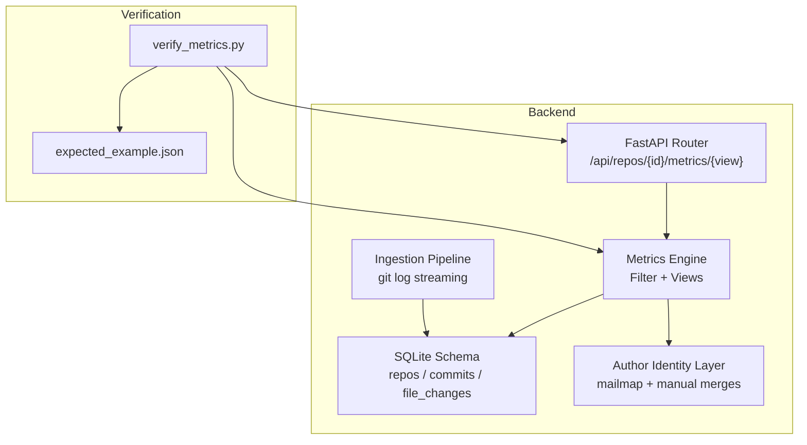
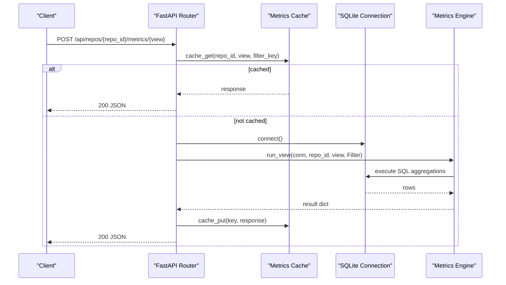
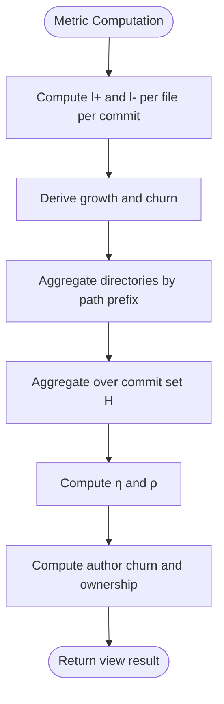
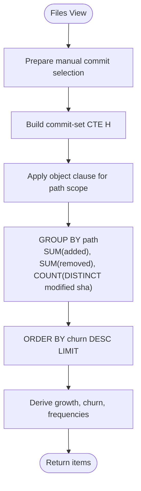
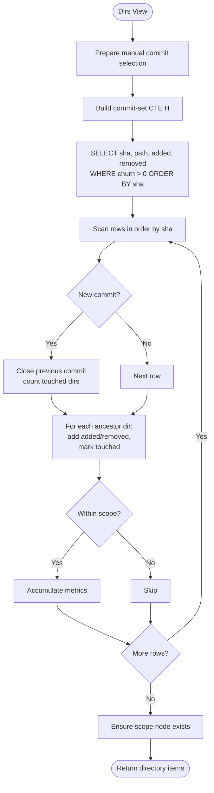
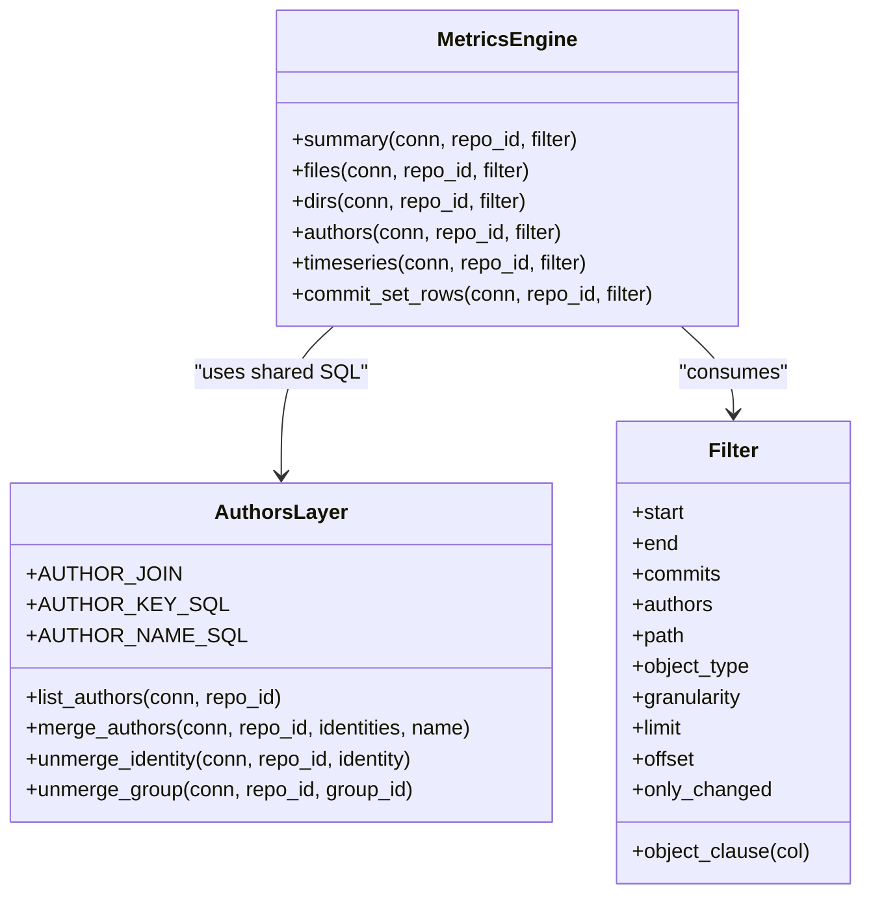
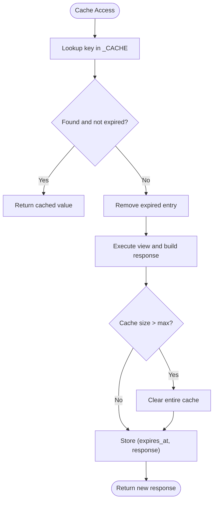
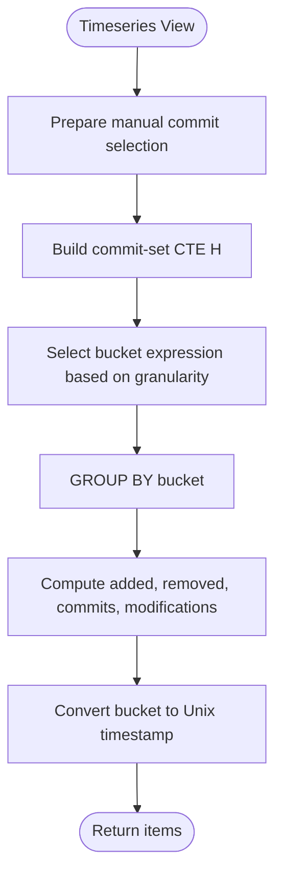
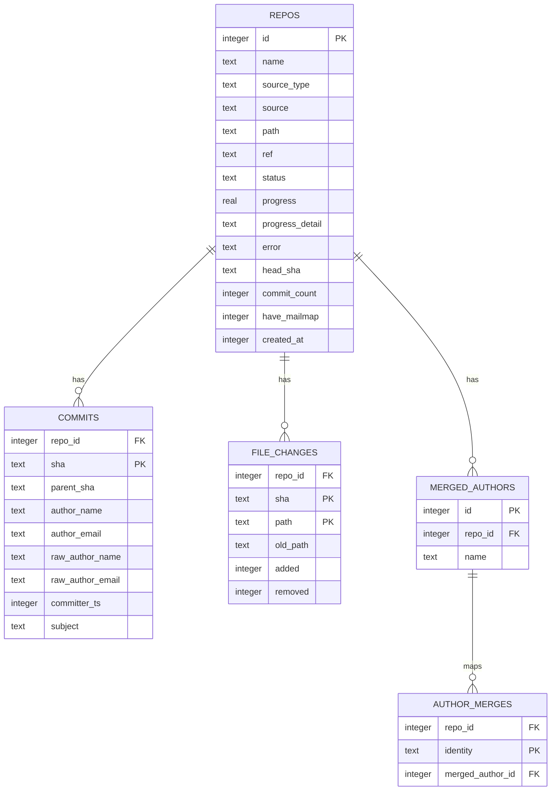
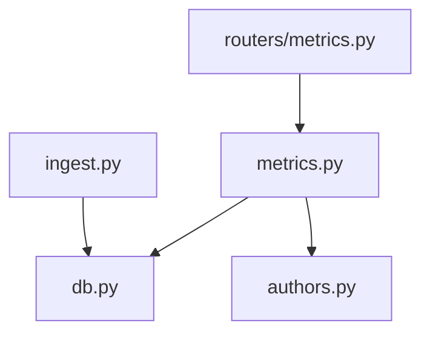

# Metrics Calculation Engine

<cite>
**Referenced Files in This Document**
- [README.md](file://README.md)
- [metrics.py](file://backend/app/metrics.py)
- [routers/metrics.py](file://backend/app/routers/metrics.py)
- [db.py](file://backend/app/db.py)
- [ingest.py](file://backend/app/ingest.py)
- [authors.py](file://backend/app/authors.py)
- [test_metrics.py](file://backend/tests/test_metrics.py)
- [verify_metrics.py](file://scripts/verify_metrics.py)
- [expected_example.json](file://scripts/expected_example.json)
</cite>

## Table of Contents
1. [Introduction](#introduction)
2. [Project Structure](#project-structure)
3. [Core Components](#core-components)
4. [Architecture Overview](#architecture-overview)
5. [Detailed Component Analysis](#detailed-component-analysis)
6. [Dependency Analysis](#dependency-analysis)
7. [Performance Considerations](#performance-considerations)
8. [Troubleshooting Guide](#troubleshooting-guide)
9. [Conclusion](#conclusion)
10. [Appendices](#appendices)

## Introduction
This document explains the metrics calculation engine that turns a Git repository’s history into file-level, directory-level, author-level, commit-set, and time-series metrics. The engine is SQL-driven: raw commit and diff data are streamed from Git once during ingestion, stored in SQLite, and then aggregated by carefully constructed queries.

The metric formulas are defined in one place and enforced by golden tests. Directory aggregation uses path-prefix semantics with per-commit de-duplication. Author ownership is computed over merged identities at query time without re-indexing. A short-lived response cache reduces repeated dashboard load.

## Project Structure
The backend contains the ingestion pipeline, database schema, author identity handling, metric formula definitions, FastAPI routers, and tests. The verification script can run against a live server or ingest locally for spot checks.

**Diagram sources**
- [routers/metrics.py:13-40](file://backend/app/routers/metrics.py#L13-L40)
- [metrics.py:43-109](file://backend/app/metrics.py#L43-L109)
- [db.py:13-57](file://backend/app/db.py#L13-L57)
- [ingest.py:280-350](file://backend/app/ingest.py#L280-L350)
- [authors.py:15-25](file://backend/app/authors.py#L15-L25)
- [verify_metrics.py:56-107](file://scripts/verify_metrics.py#L56-L107)
- [expected_example.json:1-37](file://scripts/expected_example.json#L1-L37)

**Section sources**
- [README.md:1-38](file://README.md#L1-L38)
- [README.md:198-208](file://README.md#L198-L208)

## Core Components
- Filter model: defines commit-set selection, object scope, granularity, pagination, and change-only filtering.
- View functions: `summary`, `files`, `dirs`, `authors`, `timeseries`, `commit_set_rows`.
- Commit-set CTE: builds H with optional manual commit selection, time range, and author merging.
- Aggregation helpers: derived metrics such as growth, churn, modification frequency, and churn rate.
- Cache layer: process-local TTL cache keyed by repository, view, and serialized filter.
- Database layer: schema, indexes, WAL mode, and connection setup.
- Ingestion layer: streamed parsing of `git log --numstat` output into `commits` and `file_changes`.
- Author identity layer: mailmap-resolved identities plus manual merge groups applied via shared SQL fragments.

**Section sources**
- [metrics.py:43-128](file://backend/app/metrics.py#L43-L128)
- [metrics.py:135-396](file://backend/app/metrics.py#L135-L396)
- [metrics.py:407-435](file://backend/app/metrics.py#L407-L435)
- [db.py:13-87](file://backend/app/db.py#L13-L87)
- [ingest.py:164-274](file://backend/app/ingest.py#L164-L274)
- [authors.py:15-25](file://backend/app/authors.py#L15-L25)

## Architecture Overview
The request flow starts at the router, validates the view, applies caching, opens a database connection, constructs a `Filter`, executes the selected view, wraps the result, and stores it in the cache.

**Diagram sources**
- [routers/metrics.py:13-40](file://backend/app/routers/metrics.py#L13-L40)
- [metrics.py:399-400](file://backend/app/metrics.py#L399-L400)
- [metrics.py:412-426](file://backend/app/metrics.py#L412-L426)

## Detailed Component Analysis

### Formula Definitions
File-level metrics per commit versus its first parent:
- Added lines: `l⁺`
- Removed lines: `l⁻`
- Growth: `δ = l⁺ − l⁻`
- Churn: `λ = l⁺ + l⁻`
- Modification indicator: `I_n(h,o) = 1 ⇔ λ_h,o > 0`

Directory metrics per commit are recursive sums over the subtree; evaluated as path-prefix aggregation.

Commit-set metrics for subset `H`:
- Sums of `l⁺_H,o`, `l⁻_H,o`, `δ_H,o`, `λ_H,o`
- Modifications: `n_H,o = Σ_{h∈H} I_n(h,o)`
- Modification frequency: `η = n_H,o / |H|` (zero when `|H| = 0`)
- Churn rate: `ρ = λ_H,o / |H|` (zero when `|H| = 0`)

Authorship after merging:
- Indicator: `I(a,h) = 1 ⇔ a = h[a]`
- Author modifications: `n_H,o,a = Σ_h I(a,h)·I_n(h,o)`
- Author churn: `λ_H,o,a = Σ_h λ_h,o·I(a,h)`
- Ownership: `ω = λ_H,o,a / λ_H,o` (zero when `λ_H,o = 0`)

These definitions are implemented by the metrics module and locked by golden tests.

**Diagram sources**
- [metrics.py:1-28](file://backend/app/metrics.py#L1-L28)
- [metrics.py:117-128](file://backend/app/metrics.py#L117-L128)
- [metrics.py:186-248](file://backend/app/metrics.py#L186-L248)
- [metrics.py:251-279](file://backend/app/metrics.py#L251-L279)

**Section sources**
- [README.md:39-65](file://README.md#L39-L65)
- [metrics.py:1-28](file://backend/app/metrics.py#L1-L28)
- [test_metrics.py:81-91](file://backend/tests/test_metrics.py#L81-L91)

### File-Level Metrics
The `files` view aggregates added, removed, and modifications per file under the current scope. Results are sorted by churn descending and limited to avoid excessive payloads.

Key behaviors:
- Scope resolution supports both files and directories.
- Per-file modification count counts distinct commits where churn is positive.
- Derived metrics use the total commit count `|H|`.

**Diagram sources**
- [metrics.py:158-183](file://backend/app/metrics.py#L158-L183)

**Section sources**
- [metrics.py:158-183](file://backend/app/metrics.py#L158-L183)
- [test_metrics.py:160-179](file://backend/tests/test_metrics.py#L160-L179)

### Directory Aggregation Strategy
Directory metrics require correct de-duplication: if a single commit touches multiple files within the same directory, it should count as one modification for that directory. The implementation performs an ordered scan over changed files and accumulates ancestor directories while tracking touched paths per commit.

Important aspects:
- Input is ordered by commit SHA to enable per-commit de-duplication.
- Only changes with non-zero churn are considered.
- Path scoping uses a prefix check to include only relevant ancestors.
- The scope node itself is always reported even if no direct changes exist.

**Diagram sources**
- [metrics.py:186-248](file://backend/app/metrics.py#L186-L248)

**Section sources**
- [metrics.py:186-248](file://backend/app/metrics.py#L186-L248)
- [test_metrics.py:181-206](file://backend/tests/test_metrics.py#L181-L206)

### Author Ownership Calculations
Author metrics compute:
- Distinct commits per author key
- Distinct modifications per author over the object scope
- Total churn per author
- Ownership as author churn divided by total churn

Author identity resolution combines:
- Mailmap-resolved names and emails
- Manual merge groups represented by keys like `m:<group_id>`
- Individual identities represented by keys like `i:<lowercased email>`

The shared SQL fragments ensure consistent identity resolution across all views.

**Diagram sources**
- [authors.py:15-25](file://backend/app/authors.py#L15-L25)
- [authors.py:28-131](file://backend/app/authors.py#L28-L131)
- [metrics.py:43-109](file://backend/app/metrics.py#L43-L109)
- [metrics.py:251-279](file://backend/app/metrics.py#L251-L279)

**Section sources**
- [authors.py:15-25](file://backend/app/authors.py#L15-L25)
- [metrics.py:251-279](file://backend/app/metrics.py#L251-L279)
- [test_metrics.py:212-270](file://backend/tests/test_metrics.py#L212-L270)

### SQL-Based Aggregation Patterns
Common patterns across views:
- Commit-set CTE: filters commits by repository, manual selection, time range, and author identity.
- Object clause: restricts aggregation to a specific file or directory subtree using equality or path-range predicates.
- Aggregations:
  - `SUM(added)`, `SUM(removed)`
  - `COUNT(DISTINCT sha)` for commits
  - `COUNT(DISTINCT CASE WHEN churn > 0 THEN sha END)` for modifications
- Derived metrics: growth, churn, modification frequency, churn rate computed in Python after SQL aggregation.

Example pattern locations:
- Commit-set CTE construction: [metrics.py:76-109](file://backend/app/metrics.py#L76-L109)
- Summary aggregation: [metrics.py:141-155](file://backend/app/metrics.py#L141-L155)
- Files aggregation: [metrics.py:164-183](file://backend/app/metrics.py#L164-L183)
- Authors aggregation: [metrics.py:256-279](file://backend/app/metrics.py#L256-L279)

**Section sources**
- [metrics.py:76-109](file://backend/app/metrics.py#L76-L109)
- [metrics.py:141-155](file://backend/app/metrics.py#L141-L155)
- [metrics.py:164-183](file://backend/app/metrics.py#L164-L183)
- [metrics.py:256-279](file://backend/app/metrics.py#L256-L279)

### Query Optimization Techniques
- Index usage:
  - `(repo_id, committer_ts)` for time-range filtering
  - `(repo_id, path)` for path-scoped scans
  - Primary key `(repo_id, sha, path)` for efficient joins
- Ordered scan for directory de-duplication avoids expensive grouping on commit boundaries.
- Path scoping uses index-friendly range predicates: `path >= 'dir/' AND path < 'dir0'`.
- Manual commit selection materialized into a temporary table to support `IN` lookups efficiently.
- Bounded limits prevent large result sets.

**Section sources**
- [db.py:44-57](file://backend/app/db.py#L44-L57)
- [metrics.py:67-74](file://backend/app/metrics.py#L67-L74)
- [metrics.py:186-248](file://backend/app/metrics.py#L186-L248)

### Caching Mechanisms
A process-local dictionary caches responses with:
- Key: `(repo_id, view, serialized_filter)`
- Value: `(expiration_time, response_dict)`
- TTL: 30 seconds
- Max size: 256 entries; full clear when exceeded
- Invalidation:
  - Global clear
  - Repository-specific invalidation

The router reads and writes this cache around view execution.

**Diagram sources**
- [metrics.py:407-435](file://backend/app/metrics.py#L407-L435)
- [routers/metrics.py:18-22](file://backend/app/routers/metrics.py#L18-L22)
- [routers/metrics.py:38-40](file://backend/app/routers/metrics.py#L38-L40)

**Section sources**
- [metrics.py:407-435](file://backend/app/metrics.py#L407-L435)
- [routers/metrics.py:18-22](file://backend/app/routers/metrics.py#L18-L22)
- [routers/metrics.py:38-40](file://backend/app/routers/metrics.py#L38-L40)

### Time-Series Analysis Capabilities
The timeseries view aggregates metrics over buckets:
- Day: calendar day string
- Month: first-day-of-month string
- Week: ISO-style week start date computed from weekday offset

Each bucket returns:
- Bucket label and timestamp
- Added, removed, growth, churn
- Commits and modifications

Granularity defaults to month and is validated before execution.

**Diagram sources**
- [metrics.py:282-329](file://backend/app/metrics.py#L282-L329)

**Section sources**
- [metrics.py:282-329](file://backend/app/metrics.py#L282-L329)
- [test_metrics.py:289-296](file://backend/tests/test_metrics.py#L289-L296)

### Statistical Computations
Derived statistics are computed after SQL aggregation:
- Growth: difference between added and removed
- Churn: sum of added and removed
- Modification frequency: modifications divided by commit count
- Churn rate: churn divided by commit count
- Ownership: author churn divided by total churn

These computations handle zero denominators gracefully by returning zero.

**Section sources**
- [metrics.py:117-128](file://backend/app/metrics.py#L117-L128)
- [metrics.py:270-279](file://backend/app/metrics.py#L270-L279)

### Relationship Between Raw Commit Data and Aggregated Metrics
Raw data ingestion produces:
- `commits`: repository ID, SHA, parent SHA, author fields, committer timestamp, subject
- `file_changes`: repository ID, SHA, path, old path for renames, added, removed

Aggregation joins these tables through `repo_id` and `sha`, applying filters and scopes to produce metrics.

**Diagram sources**
- [db.py:13-71](file://backend/app/db.py#L13-L71)

**Section sources**
- [ingest.py:280-350](file://backend/app/ingest.py#L280-L350)
- [db.py:13-71](file://backend/app/db.py#L13-L71)

## Dependency Analysis
The metrics engine depends on:
- Database schema and indexes
- Author identity resolution
- Router validation and caching
- Ingestion pipeline for raw data population

**Diagram sources**
- [routers/metrics.py:1-40](file://backend/app/routers/metrics.py#L1-L40)
- [metrics.py:37-38](file://backend/app/metrics.py#L37-L38)
- [db.py:1-12](file://backend/app/db.py#L1-L12)
- [ingest.py:35-36](file://backend/app/ingest.py#L35-L36)

**Section sources**
- [routers/metrics.py:1-40](file://backend/app/routers/metrics.py#L1-L40)
- [metrics.py:37-38](file://backend/app/metrics.py#L37-L38)
- [db.py:1-12](file://backend/app/db.py#L1-L12)
- [ingest.py:35-36](file://backend/app/ingest.py#L35-L36)

## Performance Considerations
- One subprocess per repository for indexing; never per commit.
- NUL-delimited stream parsed incrementally with bounded memory.
- Batched inserts in WAL mode reduce write overhead.
- Rename detection cost paid once at ingest; queries hit indexes only.
- Directory metrics computed by a single ordered scan with per-commit de-duplication.
- Path scoping uses index-friendly range predicates.
- Short-TTL response cache absorbs repeated dashboard queries.

Measured latencies demonstrate interactive performance even for large repositories.

**Section sources**
- [README.md:170-196](file://README.md#L170-L196)
- [ingest.py:280-350](file://backend/app/ingest.py#L280-L350)
- [db.py:74-81](file://backend/app/db.py#L74-L81)

## Troubleshooting Guide
Common issues and diagnostics:
- Unknown metric view: router raises a 404 with the unknown view name.
- Repository not found: router raises a 404 when the repository row does not exist.
- Repository not ready: router raises a 409 when the repository status is not `ready`.
- Ingestion errors: ingestion pipeline raises user-actionable exceptions; status updates reflect errors.
- Cache staleness: after ingestion, cache is invalidated per repository to avoid stale results.

Debugging steps:
- Verify repository status and progress via repository endpoints.
- Inspect ingestion logs and error messages surfaced in repository metadata.
- Use the verification script to compare expected values against actual results.
- Check golden tests to validate formula correctness on deterministic fixtures.

**Section sources**
- [routers/metrics.py:14-30](file://backend/app/routers/metrics.py#L14-L30)
- [ingest.py:45-66](file://backend/app/ingest.py#L45-L66)
- [ingest.py:419-422](file://backend/app/ingest.py#L419-L422)
- [verify_metrics.py:68-81](file://scripts/verify_metrics.py#L68-L81)
- [test_metrics.py:31-74](file://backend/tests/test_metrics.py#L31-L74)

## Conclusion
The metrics calculation engine provides a robust, SQL-centric approach to repository analytics. It enforces precise formulas, supports flexible filtering, and delivers fast aggregation through indexed queries and careful algorithmic design. Directory de-duplication, author identity merging, and time-series bucketing are implemented consistently. The system balances correctness with performance, backed by golden tests and verification scripts.

## Appendices

### Custom Metric Definitions
To define a new metric:
- Extend the formula documentation in the metrics module header.
- Add computation logic in the appropriate view function.
- Include golden test assertions in the test suite.
- Update verification expectations if needed.

Example extension points:
- New view function registered in the views mapping.
- New filter field with corresponding SQL fragment.
- New derived metric computed in `_derive` or view-specific logic.

**Section sources**
- [metrics.py:1-28](file://backend/app/metrics.py#L1-L28)
- [metrics.py:389-400](file://backend/app/metrics.py#L389-L400)
- [test_metrics.py:1-5](file://backend/tests/test_metrics.py#L1-L5)

### Performance Tuning Strategies
- Adjust batch sizes during ingestion to balance memory and throughput.
- Tune SQLite pragmas for workload characteristics.
- Increase cache TTL for read-heavy dashboards.
- Limit result sizes using pagination parameters.
- Prefer time-range filters and path scoping to reduce scan scope.

**Section sources**
- [ingest.py:306-343](file://backend/app/ingest.py#L306-L343)
- [db.py:74-81](file://backend/app/db.py#L74-L81)
- [metrics.py:407-435](file://backend/app/metrics.py#L407-L435)

### Debugging Metric Calculations
Use the verification script to:
- Run against a live server or ingest locally.
- Print summary, top files, directories, and authors.
- Compare against expected values with toleranced floats.

Golden tests provide deterministic validation of:
- Ingested rows and rename semantics
- Summary metrics
- Time-range boundaries
- Manual commit selection
- Empty commit sets
- Author filtering and ownership
- Timeseries buckets
- Commit-set rows

**Section sources**
- [verify_metrics.py:1-31](file://scripts/verify_metrics.py#L1-L31)
- [verify_metrics.py:157-241](file://scripts/verify_metrics.py#L157-L241)
- [test_metrics.py:81-310](file://backend/tests/test_metrics.py#L81-L310)
- [expected_example.json:1-37](file://scripts/expected_example.json#L1-L37)