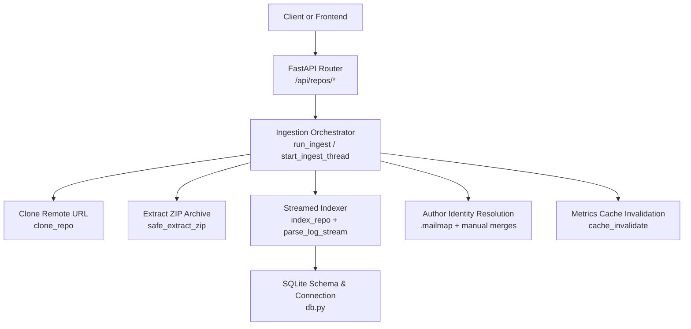
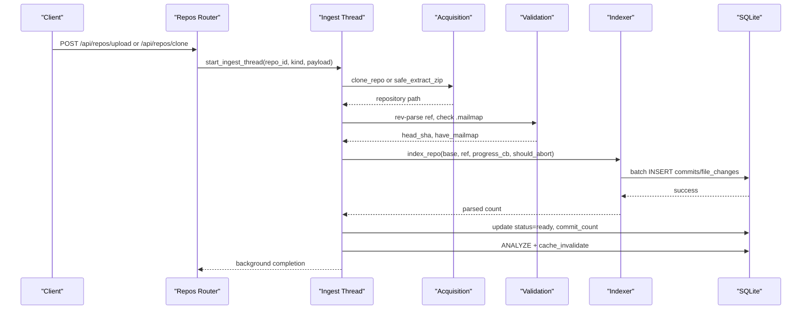
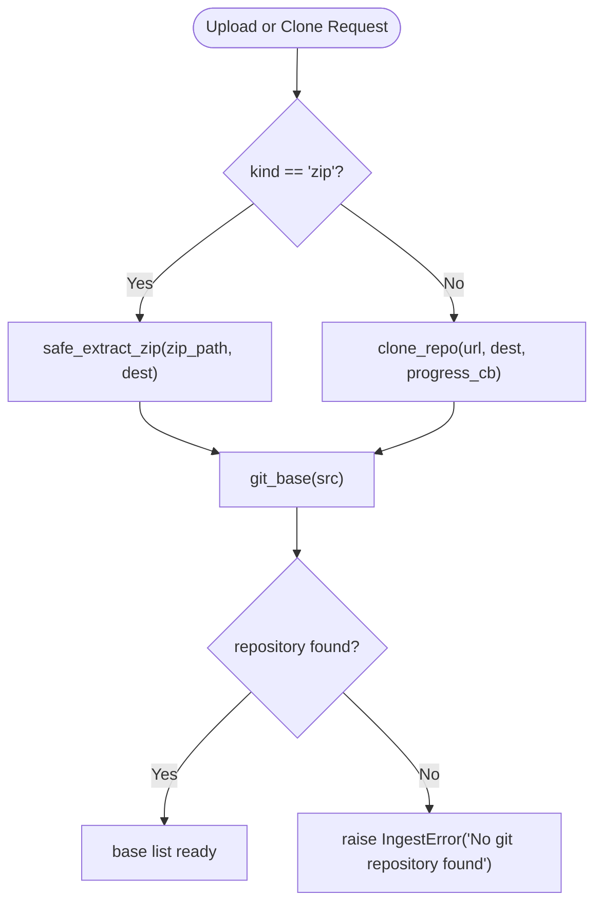
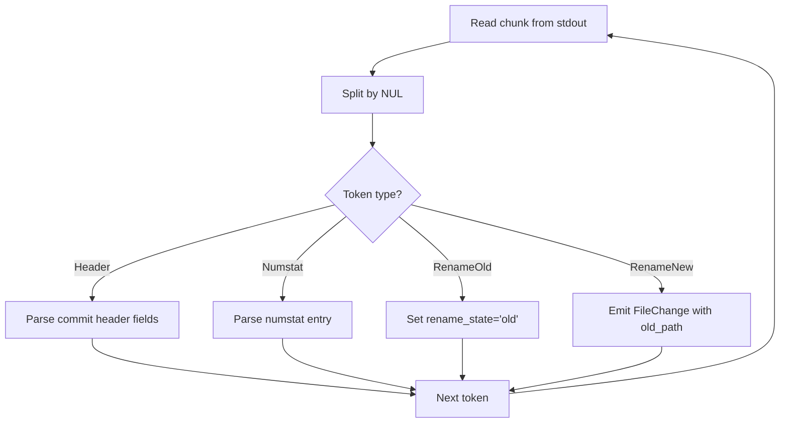
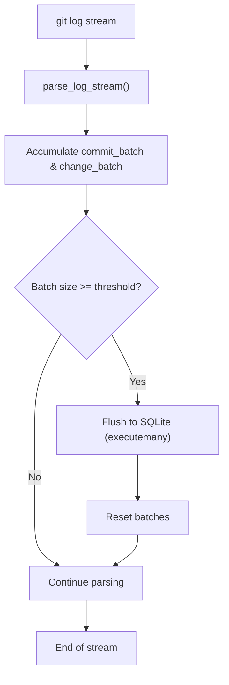
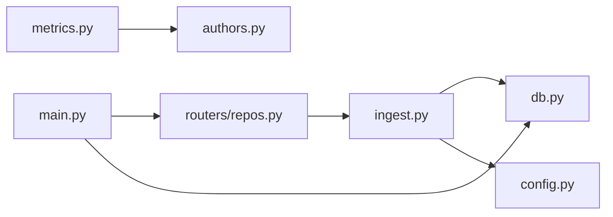

# Repository Ingestion Pipeline

<cite>
**Referenced Files in This Document**
- [README.md](file://README.md)
- [main.py](file://backend/app/main.py)
- [config.py](file://backend/app/config.py)
- [db.py](file://backend/app/db.py)
- [ingest.py](file://backend/app/ingest.py)
- [repos.py](file://backend/app/routers/repos.py)
- [authors.py](file://backend/app/authors.py)
- [metrics.py](file://backend/app/metrics.py)
- [schemas.py](file://backend/app/schemas.py)
- [test_parser.py](file://backend/tests/test_parser.py)
</cite>

## Table of Contents
1. [Introduction](#introduction)
2. [Project Structure](#project-structure)
3. [Core Components](#core-components)
4. [Architecture Overview](#architecture-overview)
5. [Detailed Component Analysis](#detailed-component-analysis)
6. [Dependency Analysis](#dependency-analysis)
7. [Performance Considerations](#performance-considerations)
8. [Troubleshooting Guide](#troubleshooting-guide)
9. [Conclusion](#conclusion)
10. [Appendices](#appendices)

## Introduction
This document explains the repository ingestion pipeline that turns a Git history into indexed metrics. The system supports two ingestion sources:
- Cloning from remote Git URLs using a full mirror clone.
- Uploading a ZIP archive containing a Git repository.

The core design goal is memory-efficient, streamed indexing: the entire commit history is parsed in one `git log` pass, with incremental parsing and batched SQLite inserts. Author identity resolution uses `.mailmap` when present, while manual author merging is applied at query time without re-indexing.

Key ingestion behaviors include:
- Streamed NUL-delimited token parsing of `git log --numstat -z`.
- Batch insertion of commits and file changes.
- Progress tracking for cloning and indexing.
- Safe ZIP extraction with traversal protection.
- Mailmap extraction and application during indexing.
- Commit validation via reference resolution and non-merge counting.
- Error handling for network failures, corrupted repositories, and partial ingestion.

## Project Structure
The backend is a FastAPI application under `backend/app`. The ingestion pipeline lives primarily in `ingest.py`, with supporting modules for database schema (`db.py`), configuration (`config.py`), API routing (`routers/repos.py`), author identity handling (`authors.py`), and metric computation (`metrics.py`). The frontend is separate and consumes REST endpoints; this document focuses on the backend ingestion pipeline.

**Diagram sources**
- [main.py:22-27](file://backend/app/main.py#L22-L27)
- [repos.py:50-94](file://backend/app/routers/repos.py#L50-L94)
- [ingest.py:362-439](file://backend/app/ingest.py#L362-L439)
- [db.py:13-87](file://backend/app/db.py#L13-L87)
- [authors.py:15-25](file://backend/app/authors.py#L15-L25)
- [metrics.py:403-435](file://backend/app/metrics.py#L403-L435)

**Section sources**
- [README.md:1-15](file://README.md#L1-L15)
- [main.py:1-49](file://backend/app/main.py#L1-L49)
- [config.py:1-15](file://backend/app/config.py#L1-L15)

## Core Components
- **Repository acquisition**: Handles both ZIP upload and remote URL cloning. ZIP files are validated and safely extracted; remote URLs are mirrored with progress parsing.
- **Git plumbing helpers**: Provide environment isolation, safe invocation of Git commands, and repository discovery for worktrees, bare repos, and extracted archives.
- **Streamed parser**: Parses the NUL-delimited output of `git log --numstat -z` incrementally, handling normal changes, binary files, renames, and unicode paths.
- **Indexing orchestrator**: Streams parsed records into SQLite using batched inserts, tracks progress, applies mailmap-based author resolution, and validates references.
- **Author identity handling**: Applies `.mailmap` during ingest and supports manual merge groups resolved at query time.
- **Database layer**: Defines schema, indexes, WAL mode, and connection helpers.
- **Metrics engine**: Computes file, directory, author, timeseries, and commit-set metrics over the indexed data.

**Section sources**
- [ingest.py:1-439](file://backend/app/ingest.py#L1-L439)
- [db.py:13-87](file://backend/app/db.py#L13-L87)
- [authors.py:1-131](file://backend/app/authors.py#L1-L131)
- [metrics.py:1-435](file://backend/app/metrics.py#L1-L435)

## Architecture Overview
The ingestion pipeline follows a staged flow:
1. API endpoint receives upload or clone request.
2. Background thread starts ingestion.
3. Acquisition phase clones or extracts the repository.
4. Validation phase resolves reference and checks for `.mailmap`.
5. Indexing phase streams `git log`, parses records, and batches inserts.
6. Completion phase updates status, analyzes indexes, and invalidates caches.

**Diagram sources**
- [repos.py:50-94](file://backend/app/routers/repos.py#L50-L94)
- [ingest.py:362-439](file://backend/app/ingest.py#L362-L439)
- [db.py:13-87](file://backend/app/db.py#L13-L87)

## Detailed Component Analysis

### Repository Acquisition: Cloning and ZIP Upload
- **Cloning**: Uses `git clone --mirror --progress` to create a full mirror. Progress lines are parsed to report percentage and detail messages. Network errors result in an ingestion error.
- **ZIP upload**: Validates file suffix, stores the uploaded file temporarily, verifies it is a valid ZIP, then extracts it safely. Absolute paths and traversal attempts are rejected.
- **Repository discovery**: Detects `.git` directories, `HEAD`, or `objects` folders, including nested repositories within the archive.

**Diagram sources**
- [ingest.py:97-157](file://backend/app/ingest.py#L97-L157)
- [ingest.py:69-90](file://backend/app/ingest.py#L69-L90)
- [repos.py:50-94](file://backend/app/routers/repos.py#L50-L94)

**Section sources**
- [ingest.py:97-157](file://backend/app/ingest.py#L97-L157)
- [repos.py:50-94](file://backend/app/routers/repos.py#L50-L94)

### Streamed Git Log Parsing Mechanism
The parser reads the NUL-delimited stream from `git log --no-merges -M50% --numstat -z --format=<header> <ref>` incrementally:
- Tokens are split by NUL bytes without loading the entire stream into memory.
- Commit headers are matched by a regex pattern and decoded into `CommitRecord` objects.
- File change entries are parsed for added/removed lines, with special handling for:
  - Binary files (skipped).
  - Renames (pure rename vs rename+edit).
  - Unicode and spaces in paths.
- Rename state machine handles sequences where an empty path token is followed by old and new paths.

**Diagram sources**
- [ingest.py:190-274](file://backend/app/ingest.py#L190-L274)
- [test_parser.py:24-72](file://backend/tests/test_parser.py#L24-L72)

**Section sources**
- [ingest.py:190-274](file://backend/app/ingest.py#L190-L274)
- [test_parser.py:1-72](file://backend/tests/test_parser.py#L1-L72)

### Memory-Efficient Processing of Large Repositories
- **Bounded memory parsing**: `_nul_tokens` reads fixed-size chunks and yields tokens incrementally.
- **Batched inserts**: Commits and file changes are accumulated in lists and flushed to SQLite when thresholds are reached (e.g., 10k file changes or 5k commits).
- **WAL mode**: SQLite operates in Write-Ahead Logging mode for better concurrency and performance.
- **Single subprocess**: One Git process per repository avoids per-commit overhead.

**Diagram sources**
- [ingest.py:306-343](file://backend/app/ingest.py#L306-L343)
- [db.py:74-81](file://backend/app/db.py#L74-L81)

**Section sources**
- [ingest.py:306-343](file://backend/app/ingest.py#L306-L343)
- [db.py:74-81](file://backend/app/db.py#L74-L81)

### Batch Insertion Strategies
- **Commit batch**: Up to 5,000 commits are buffered before insertion.
- **File change batch**: Up to 10,000 file changes are buffered.
- **Atomic transactions**: Each flush occurs within a transaction context to ensure consistency.
- **Upsert semantics**: `INSERT OR REPLACE` ensures idempotent re-ingestion.

**Section sources**
- [ingest.py:306-343](file://backend/app/ingest.py#L306-L343)

### Repository Cloning Process from Remote URLs
- **Mirror clone**: Uses `git clone --mirror` to capture all refs and history.
- **Progress parsing**: Regex extracts percentage from stderr lines; initial "Cloning into" message sets progress to 0%.
- **Environment isolation**: Disables terminal prompts and sets locale for deterministic output.
- **Error handling**: Non-zero return codes raise ingestion errors with descriptive messages.

**Section sources**
- [ingest.py:97-118](file://backend/app/ingest.py#L97-L118)

### ZIP File Upload Handling
- **Temporary storage**: Uploaded files are stored in temporary files with unique prefixes.
- **Validation**: Checks file suffix and verifies ZIP integrity.
- **Safe extraction**: Prevents absolute paths and directory traversal attacks.
- **Cleanup**: Temporary files are removed after ingestion completes.

**Section sources**
- [repos.py:50-78](file://backend/app/routers/repos.py#L50-L78)
- [ingest.py:121-138](file://backend/app/ingest.py#L121-L138)

### Progress Tracking Mechanisms
- **Clone progress**: Parsed from Git's stderr progress lines.
- **Indexing progress**: Tracks parsed commits against total commit count.
- **Status updates**: Background thread updates repository status, progress percentage, and detail messages.
- **Abort support**: Optional `should_abort` callback allows cancellation during long-running operations.

**Section sources**
- [ingest.py:100-118](file://backend/app/ingest.py#L100-L118)
- [ingest.py:339-342](file://backend/app/ingest.py#L339-L342)
- [ingest.py:368-375](file://backend/app/ingest.py#L368-L375)

### Mailmap Processing for Author Identity Resolution
- **Mailmap extraction**: Reads `.mailmap` from the repository reference and writes it to a temporary file.
- **Application**: Passes mailmap via `-c mailmap.file=` to Git during log generation.
- **Storage**: Marks repositories as having mailmap support for UI indicators.
- **Manual merging**: Complements mailmap with manual merge groups resolved at query time.

**Section sources**
- [ingest.py:141-157](file://backend/app/ingest.py#L141-L157)
- [ingest.py:287-292](file://backend/app/ingest.py#L287-L292)
- [authors.py:15-25](file://backend/app/authors.py#L15-L25)

### Commit Validation and Data Transformation Pipelines
- **Reference validation**: Ensures the requested reference exists and has commits.
- **Non-merge counting**: Uses `rev-list --count --no-merges` to determine total commits.
- **Data transformation**: Converts raw Git output into structured `CommitRecord` and `FileChange` objects.
- **Schema compliance**: Enforces primary keys and foreign key constraints in SQLite.

**Section sources**
- [ingest.py:399-407](file://backend/app/ingest.py#L399-L407)
- [ingest.py:280-292](file://backend/app/ingest.py#L280-L292)
- [db.py:31-55](file://backend/app/db.py#L31-L55)

## Dependency Analysis
The ingestion pipeline has clear dependency relationships:
- **Routers depend on ingestion**: API endpoints trigger background ingestion threads.
- **Ingestion depends on database**: All persistent state flows through the SQLite layer.
- **Authors module integrates with metrics**: Author identity resolution is applied in metric queries.
- **Configuration centralizes paths**: Database and repository locations are defined in config.

**Diagram sources**
- [main.py:22-27](file://backend/app/main.py#L22-L27)
- [repos.py:11-14](file://backend/app/routers/repos.py#L11-L14)
- [ingest.py:35-36](file://backend/app/ingest.py#L35-L36)
- [metrics.py:37-37](file://backend/app/metrics.py#L37-L37)

**Section sources**
- [main.py:22-27](file://backend/app/main.py#L22-L27)
- [repos.py:11-14](file://backend/app/routers/repos.py#L11-L14)
- [ingest.py:35-36](file://backend/app/ingest.py#L35-L36)
- [metrics.py:37-37](file://backend/app/metrics.py#L37-L37)

## Performance Considerations
- **Streaming architecture**: Single Git subprocess per repository with incremental parsing prevents memory spikes.
- **Batch optimization**: Large batches reduce database round-trips while maintaining bounded memory usage.
- **Index utilization**: Queries leverage composite indexes on `(repo_id, committer_ts)` and `(repo_id, path)`.
- **Cache strategy**: Short-TTL response cache absorbs repeated dashboard queries.
- **Directory metrics optimization**: Ordered scan with per-commit de-duplication minimizes redundant calculations.

[No sources needed since this section provides general guidance]

## Troubleshooting Guide
Common ingestion issues and their handling:

### Network Failures During Cloning
- **Symptoms**: Cloning fails with authentication or connectivity errors.
- **Handling**: `clone_repo` raises `IngestError` with descriptive message.
- **Resolution**: Verify credentials, network access, and repository URL format.

### Corrupted ZIP Archives
- **Symptoms**: Invalid ZIP format or unsafe path entries.
- **Handling**: `safe_extract_zip` validates ZIP integrity and rejects traversal attempts.
- **Resolution**: Ensure ZIP contains a valid Git repository structure.

### Partial Ingestion Scenarios
- **Symptoms**: Ingestion interrupted due to cancellation or errors.
- **Handling**: Background thread updates status to "error" with error details.
- **Resolution**: Re-trigger ingestion; upsert semantics ensure idempotent re-processing.

### Missing References
- **Symptoms**: Requested Git reference does not exist.
- **Handling**: Reference validation raises `IngestError`.
- **Resolution**: Verify branch/tag name and repository accessibility.

**Section sources**
- [ingest.py:117-118](file://backend/app/ingest.py#L117-L118)
- [ingest.py:128-132](file://backend/app/ingest.py#L128-L132)
- [ingest.py:400-401](file://backend/app/ingest.py#L400-L401)
- [ingest.py:423-429](file://backend/app/ingest.py#L423-L429)

## Conclusion
The repository ingestion pipeline provides a robust, memory-efficient solution for analyzing Git histories. By combining streamed parsing, batched database operations, and flexible author identity resolution, it scales to large repositories while maintaining interactive query performance. The modular architecture separates concerns between acquisition, parsing, indexing, and querying, enabling customization and monitoring of each stage.

[No sources needed since this section summarizes without analyzing specific files]

## Appendices

### Customizing Ingestion Behavior
- **Adjust batch sizes**: Modify thresholds in `index_repo` for different performance characteristics.
- **Custom progress callbacks**: Extend progress reporting with additional metrics or logging.
- **Abort mechanisms**: Implement custom `should_abort` logic for resource management.
- **Environment variables**: Configure data directories and frontend distribution paths via environment variables.

### Monitoring Pipeline Performance
- **Database metrics**: Monitor SQLite WAL mode performance and index usage.
- **Process monitoring**: Track Git subprocess CPU and memory usage.
- **Progress endpoints**: Poll `/api/repos/{id}` for real-time ingestion status.
- **Cache hit rates**: Monitor metrics cache effectiveness for repeated queries.

**Section sources**
- [ingest.py:333-343](file://backend/app/ingest.py#L333-L343)
- [config.py:7-11](file://backend/app/config.py#L7-L11)
- [metrics.py:407-435](file://backend/app/metrics.py#L407-L435)