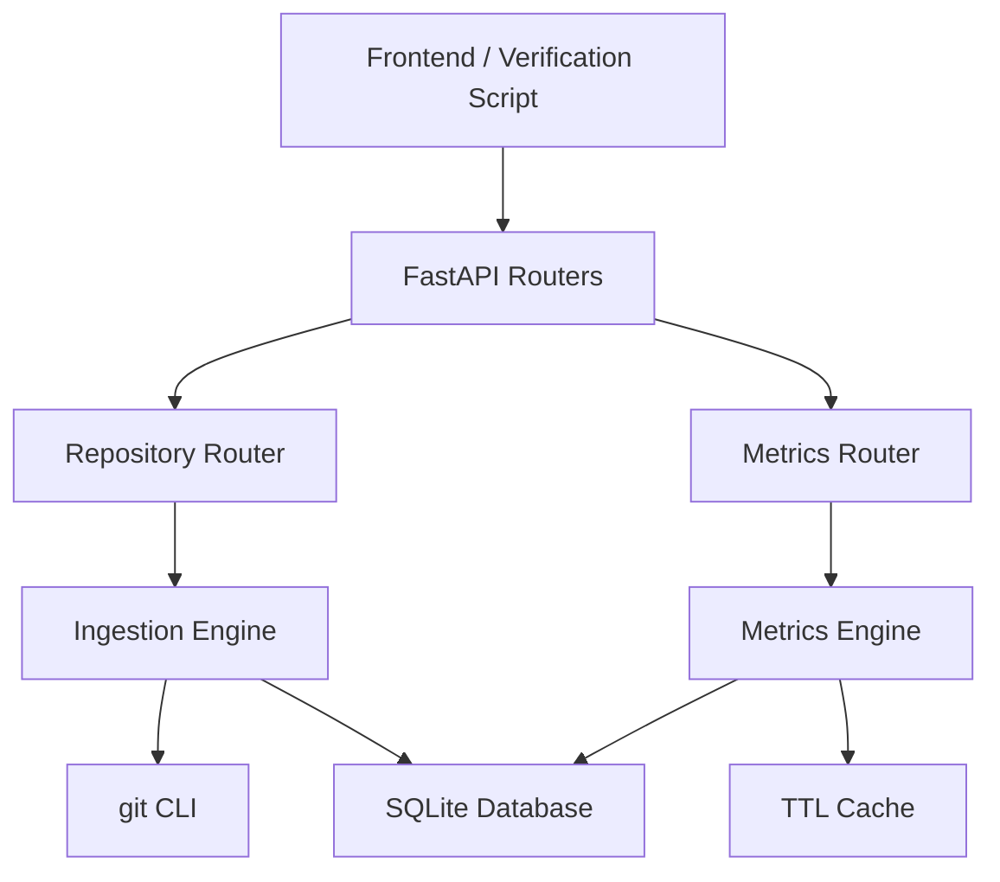
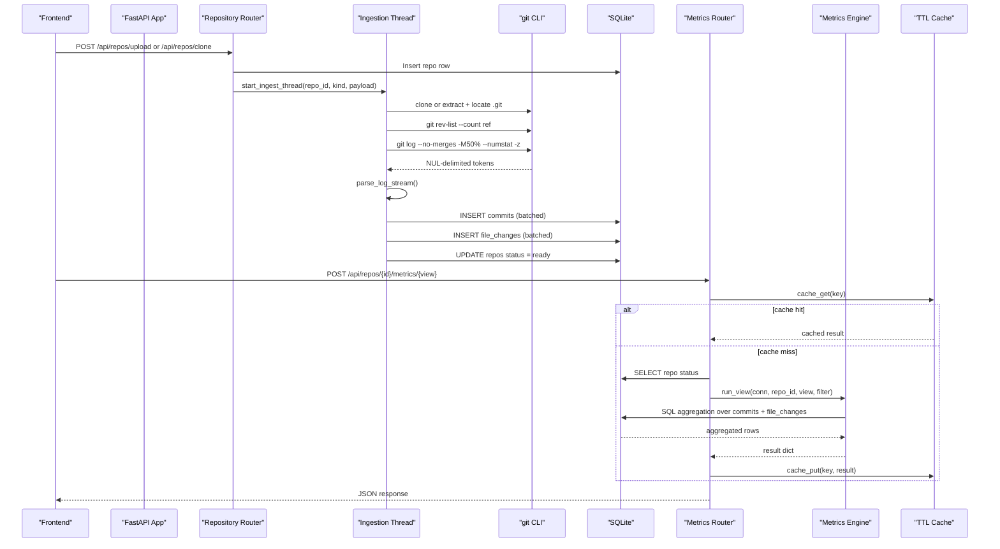
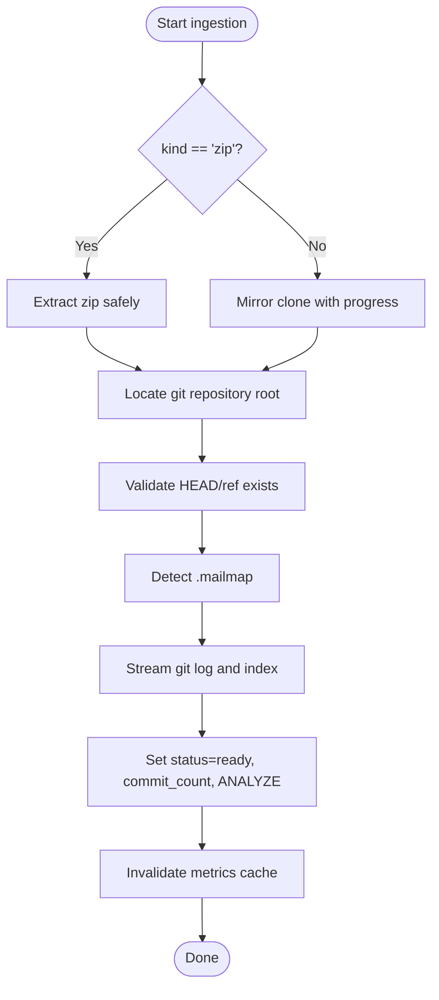
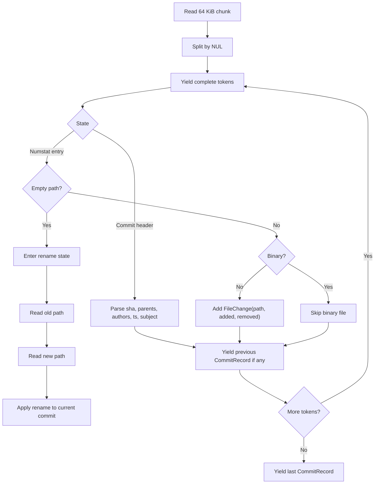
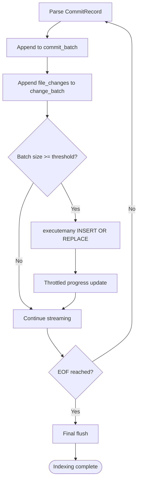
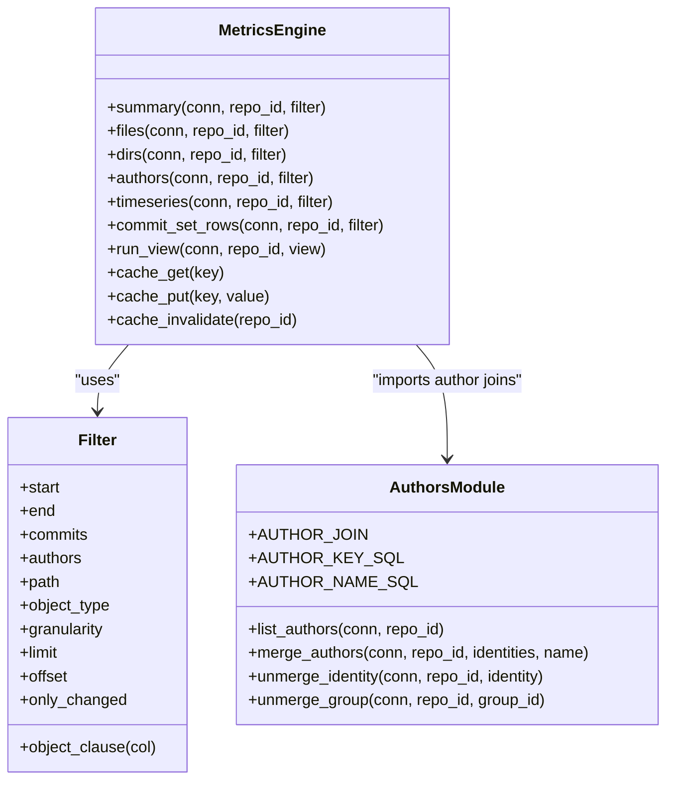
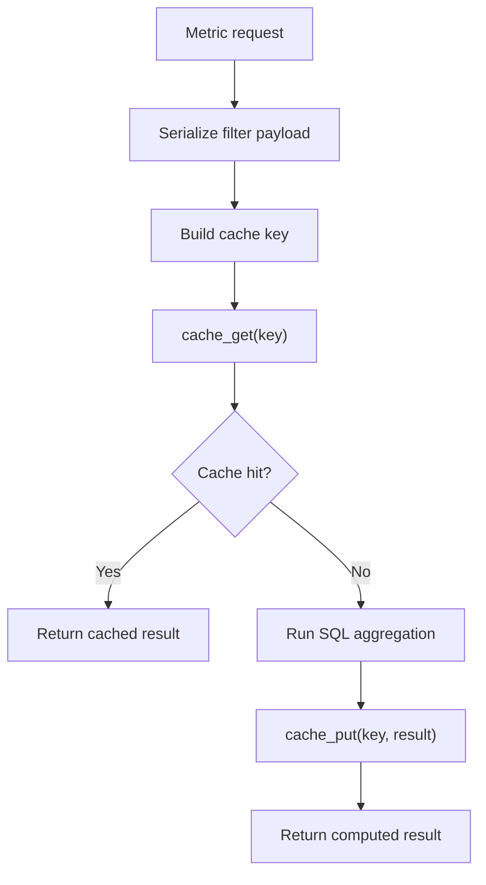
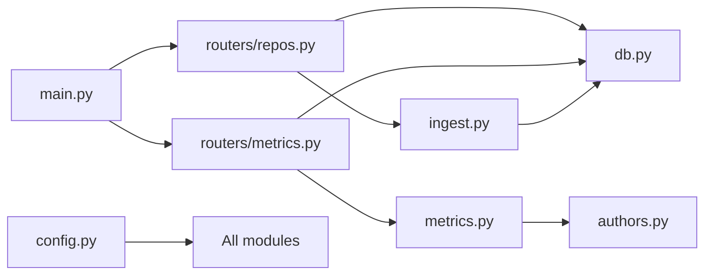
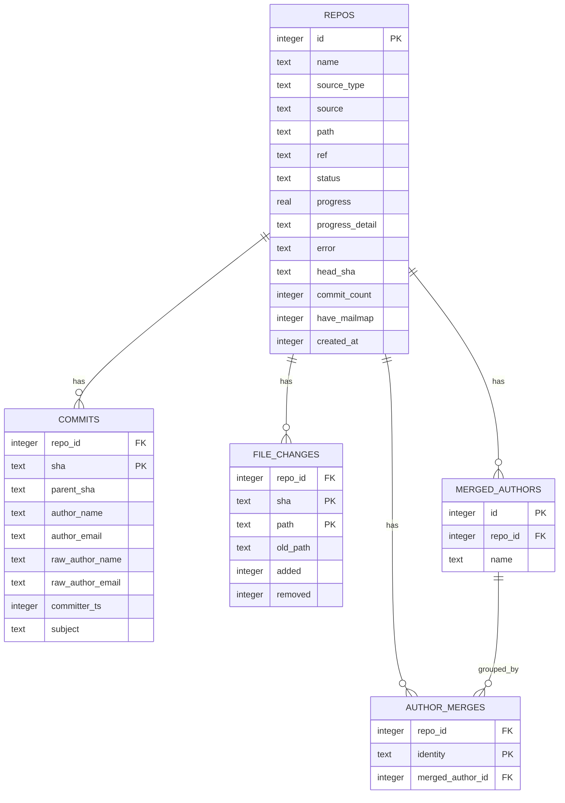

# Data Processing Pipeline

<cite>
**Referenced Files in This Document**
- [README.md](file://README.md)
- [main.py](file://backend/app/main.py)
- [config.py](file://backend/app/config.py)
- [db.py](file://backend/app/db.py)
- [ingest.py](file://backend/app/ingest.py)
- [authors.py](file://backend/app/authors.py)
- [metrics.py](file://backend/app/metrics.py)
- [repos.py](file://backend/app/routers/repos.py)
- [metrics_router.py](file://backend/app/routers/metrics.py)
- [test_parser.py](file://backend/tests/test_parser.py)
- [test_metrics.py](file://backend/tests/test_metrics.py)
- [verify_metrics.py](file://scripts/verify_metrics.py)
</cite>

## Table of Contents
1. [Introduction](#introduction)
2. [Project Structure](#project-structure)
3. [Core Components](#core-components)
4. [Architecture Overview](#architecture-overview)
5. [Detailed Component Analysis](#detailed-component-analysis)
6. [Dependency Analysis](#dependency-analysis)
7. [Performance Considerations](#performance-considerations)
8. [Troubleshooting Guide](#troubleshooting-guide)
9. [Conclusion](#conclusion)
10. [Appendices](#appendices)

## Introduction
This document explains RAT’s end-to-end data processing pipeline: how a git repository is acquired, streamed through `git log`, transformed into SQLite rows, and then aggregated into file, directory, author, commit-set, and timeseries metrics. It focuses on the streamed parsing mechanism, batched indexing, memory-efficient algorithms, SQL aggregation queries, caching, validation, and scalability strategies for large codebases.

The system is designed so that ingestion happens once per repository, while every dashboard metric is a fast SQL aggregation over an indexed SQLite database. The README describes this as a single streamed `git log` pass with bounded memory usage and interactive query performance even for repositories with tens of thousands of commits.

**Section sources**
- [README.md:1-15](file://README.md#L1-L15)
- [README.md:170-196](file://README.md#L170-L196)

## Project Structure
RAT is a FastAPI backend plus a React frontend. The data pipeline lives primarily in the backend:

- Application entry point mounts routers and initializes the database.
- Repository management handles zip upload and remote cloning.
- Ingestion acquires the repository, streams `git log`, parses it incrementally, and writes batches to SQLite.
- Author identity handling supports `.mailmap` resolution and manual merging at query time.
- Metrics defines formulas, SQL views, and a short TTL cache.
- Tests lock parser behavior and golden metric values.
- A verification script can run against a server or ingest locally into an isolated data directory.

**Diagram sources**
- [main.py:13-27](file://backend/app/main.py#L13-L27)
- [repos.py:16-113](file://backend/app/routers/repos.py#L16-L113)
- [metrics_router.py:10-40](file://backend/app/routers/metrics.py#L10-L40)
- [ingest.py:280-439](file://backend/app/ingest.py#L280-L439)
- [metrics.py:389-435](file://backend/app/metrics.py#L389-L435)

**Section sources**
- [main.py:1-49](file://backend/app/main.py#L1-L49)
- [config.py:1-15](file://backend/app/config.py#L1-L15)
- [README.md:198-208](file://README.md#L198-L208)

## Core Components
The pipeline has five core layers:

1. **Acquisition layer**: Accepts a zip archive or git URL, validates inputs, extracts safely, clones with progress reporting, and locates the repository root.
2. **Streaming ingestion layer**: Runs one `git log --numstat -z` subprocess per repository, tokenizes NUL-delimited output, parses commit headers and file changes, and applies rename/binary semantics.
3. **Storage layer**: Writes committed metadata and file change records into SQLite with WAL mode, indexes, and foreign keys.
4. **Author identity layer**: Applies `.mailmap` during ingestion and supports manual merge groups resolved at query time.
5. **Metrics engine**: Implements formula definitions as SQL aggregations, de-duplicates directory modifications per commit, and caches repeated dashboard queries.

Key responsibilities and design choices:

- One background thread per ingestion job; never one process per commit.
- Incremental parsing of the `git log` stream with bounded memory.
- Batched inserts (commits and file changes) to reduce transaction overhead.
- Indexes optimized for time-range filtering, path scoping, and commit lookups.
- Query-time author merging avoids re-indexing.
- Short-TTL response cache absorbs repeated dashboard requests.

**Section sources**
- [ingest.py:1-20](file://backend/app/ingest.py#L1-L20)
- [ingest.py:97-158](file://backend/app/ingest.py#L97-L158)
- [ingest.py:190-274](file://backend/app/ingest.py#L190-L274)
- [ingest.py:280-355](file://backend/app/ingest.py#L280-L355)
- [db.py:13-57](file://backend/app/db.py#L13-L57)
- [authors.py:1-26](file://backend/app/authors.py#L1-L26)
- [metrics.py:1-28](file://backend/app/metrics.py#L1-L28)

## Architecture Overview
The end-to-end flow from repository acquisition to metric response is:

**Diagram sources**
- [repos.py:50-94](file://backend/app/routers/repos.py#L50-L94)
- [ingest.py:97-158](file://backend/app/ingest.py#L97-L158)
- [ingest.py:280-439](file://backend/app/ingest.py#L280-L439)
- [metrics_router.py:13-40](file://backend/app/routers/metrics.py#L13-L40)
- [metrics.py:399-435](file://backend/app/metrics.py#L399-L435)

## Detailed Component Analysis

### Repository Acquisition and Background Ingestion
The repository router accepts two ingestion modes:

- **Zip upload**: Validates the uploaded file, stores it temporarily, verifies it is a valid zip, creates a pending repository row, and starts a background ingestion thread.
- **Clone URL**: Validates the URL format, derives a display name, creates a pending repository row, and starts a background ingestion thread.

The ingestion thread performs:

1. Extract or clone into a repository directory under `REPOS_DIR`.
2. Locate the git repository root, supporting worktrees, bare repos, and extracted `.git` directories.
3. Validate the reference exists.
4. Detect whether `.mailmap` is present and mark the repository accordingly.
5. Stream index the history.
6. Update repository status to `ready`, set commit count, analyze indexes, and invalidate the metrics cache.

Error handling surfaces ingestion failures to the UI via repository status and error fields.

**Diagram sources**
- [repos.py:50-94](file://backend/app/routers/repos.py#L50-L94)
- [ingest.py:362-439](file://backend/app/ingest.py#L362-L439)

**Section sources**
- [repos.py:50-94](file://backend/app/routers/repos.py#L50-L94)
- [ingest.py:97-158](file://backend/app/ingest.py#L97-L158)
- [ingest.py:362-439](file://backend/app/ingest.py#L362-L439)

### Streamed Git Log Parsing Mechanism
The ingestion engine runs one `git log` subprocess per repository and reads its stdout as a binary stream. The command uses:

- `--no-merges` to exclude merge commits from indexing.
- `-M50%` to delegate rename detection to git.
- `--numstat` to get added/removed line counts per path.
- `-z` to produce NUL-delimited tokens.
- A custom `--format` producing sha, parents, author fields, committer timestamp, and subject.

The parser implements a bounded-memory state machine:

- `_nul_tokens` yields tokens split by NUL without loading the full stream.
- `parse_log_stream` transitions between commit header parsing and file change parsing.
- Rename entries are handled by a two-token state (`old` then `new`) after an empty-path numstat token.
- Binary files are skipped entirely.
- Pure renames are stored as zero-added/zero-removed changes with `old_path`.
- Unicode paths are decoded with error replacement.

**Diagram sources**
- [ingest.py:190-274](file://backend/app/ingest.py#L190-L274)

**Section sources**
- [ingest.py:1-20](file://backend/app/ingest.py#L1-L20)
- [ingest.py:190-274](file://backend/app/ingest.py#L190-L274)
- [test_parser.py:1-72](file://backend/tests/test_parser.py#L1-L72)

### Batch Processing Strategies for Large Repositories
Large repositories are handled by batching both commit records and file change records before inserting them into SQLite:

- Commit batches flush when either the commit list reaches a threshold or the file change list reaches a larger threshold.
- File changes are inserted alongside their commit SHA.
- Progress reporting is throttled to avoid excessive updates.
- The total commit count is obtained via `git rev-list --count` before streaming, enabling percentage progress.
- If ingestion is cancelled or the repository disappears, the subprocess is killed and an ingestion error is raised.

This design keeps memory usage flat because only a small number of parsed records are held in Python lists at any time, while the bulk of the history flows through the parser and into SQLite.

**Diagram sources**
- [ingest.py:280-355](file://backend/app/ingest.py#L280-L355)

**Section sources**
- [ingest.py:280-355](file://backend/app/ingest.py#L280-L355)

### Memory-Efficient Algorithms
Several design decisions minimize memory pressure:

- Streaming `git log` output is read in fixed-size chunks.
- NUL-delimited tokens are yielded incrementally.
- Only one `CommitRecord` is active at a time.
- File changes are appended to the current commit and flushed in batches.
- No full history is materialized in Python objects.
- SQLite WAL mode allows concurrent readers while indexing continues.
- Directory metrics use an ordered scan with per-commit de-duplication rather than loading all changes into memory for each directory.

These choices allow repositories with tens of thousands of commits to be indexed interactively.

**Section sources**
- [ingest.py:190-274](file://backend/app/ingest.py#L190-L274)
- [ingest.py:306-355](file://backend/app/ingest.py#L306-L355)
- [db.py:74-81](file://backend/app/db.py#L74-L81)
- [metrics.py:186-248](file://backend/app/metrics.py#L186-L248)

### Metrics Calculation Engine and Formula Definitions
The metrics module is the single source of truth for RAT’s formulas. For a commit `h` versus its first parent `h[p]`:

| Quantity | Definition |
|---|---|
| Added lines | `l⁺` |
| Removed lines | `l⁻` |
| Growth | `δ = l⁺ − l⁻` |
| Churn | `λ = l⁺ + l⁻` |
| Modification indicator | `I_n(h,o) = 1 ⇔ λ_h,o > 0` |

Directory metrics are recursive sums over the subtree, evaluated as path-prefix aggregation.

For a commit set `H`:

| Metric | Definition |
|---|---|
| `l⁺_H,o` | Sum of added lines over `H` |
| `n_H,o` | Number of distinct commits modifying object `o` |
| Modification frequency | `η = n_H,o / |H|`, zero when `|H| = 0` |
| Churn rate | `ρ = λ_H,o / |H|`, zero when `|H| = 0` |

Authorship metrics after merging:

| Metric | Definition |
|---|---|
| `I(a,h)` | 1 if author `a` matches commit author |
| `n_H,o,a` | Author-modified commits for object `o` |
| `λ_H,o,a` | Author churn for object `o` |
| Ownership | `ω = λ_H,o,a / λ_H,o`, zero when total churn is zero |

The implementation provides these views:

- `summary`: aggregate added, removed, growth, churn, modifications, modification frequency, churn rate.
- `files`: per-file metrics grouped by path.
- `dirs`: per-directory metrics with per-commit modification de-duplication.
- `authors`: per-author modifications, churn, ownership.
- `timeseries`: bucketed metrics by day, week, or month.
- `commits`: paged commit-set rows with optional object-level stats.

**Diagram sources**
- [metrics.py:43-128](file://backend/app/metrics.py#L43-L128)
- [metrics.py:135-396](file://backend/app/metrics.py#L135-L396)
- [authors.py:15-26](file://backend/app/authors.py#L15-L26)
- [authors.py:28-131](file://backend/app/authors.py#L28-L131)

**Section sources**
- [metrics.py:1-28](file://backend/app/metrics.py#L1-L28)
- [metrics.py:43-128](file://backend/app/metrics.py#L43-L128)
- [metrics.py:135-396](file://backend/app/metrics.py#L135-L396)
- [README.md:39-65](file://README.md#L39-L65)

### SQL Aggregation Queries
Each view builds a common table expression for the commit set `H`, optionally filtered by:

- Manual commit selection via a temporary table.
- Time range using inclusive `start` and exclusive `end` on `committer_ts`.
- Author filters using merged-author keys.
- Object scope using exact path match for files or prefix range for directories.

Important query characteristics:

- `summary` aggregates added, removed, and distinct modified commits.
- `files` groups by path and orders by churn.
- `dirs` fetches changed rows ordered by SHA, then de-duplicates modifications per commit while walking ancestor directories.
- `authors` groups by merged author key and computes ownership relative to total churn.
- `timeseries` buckets by day, week, or month using SQLite date functions.
- `commits` returns paged commit rows with optional object-scoped touch counts.

Path scoping for directories uses an index-friendly range: `path >= 'dir/' AND path < 'dir0'`.

**Section sources**
- [metrics.py:67-114](file://backend/app/metrics.py#L67-L114)
- [metrics.py:135-183](file://backend/app/metrics.py#L135-L183)
- [metrics.py:186-248](file://backend/app/metrics.py#L186-L248)
- [metrics.py:251-329](file://backend/app/metrics.py#L251-L329)
- [metrics.py:332-386](file://backend/app/metrics.py#L332-L386)

### Caching Strategies
The metrics router wraps each metric request with a cache key composed of:

- Repository ID
- View name
- Serialized filter payload

The cache is an in-process dictionary with:

- A 30-second TTL.
- A maximum size limit that triggers clearing when exceeded.
- Invalidation by repository ID after ingestion completes or a repository is deleted.

This cache absorbs repeated dashboard queries without recomputing expensive aggregations.

**Diagram sources**
- [metrics_router.py:13-40](file://backend/app/routers/metrics.py#L13-L40)
- [metrics.py:407-435](file://backend/app/metrics.py#L407-L435)

**Section sources**
- [metrics_router.py:13-40](file://backend/app/routers/metrics.py#L13-L40)
- [metrics.py:407-435](file://backend/app/metrics.py#L407-L435)

### Data Validation and Transformation Processes
Validation and transformation occur at multiple stages:

1. **Input validation**:
   - Zip uploads require a `.zip` or `.git` suffix and must be valid zip archives.
   - Clone URLs must start with supported schemes.
   - Uploads reject unsafe archive entries and zip-slip traversal.

2. **Repository discovery**:
   - The ingestion engine probes for `.git`, `HEAD`, or `objects` directories.
   - It selects a working git base and raises an error if none is found.

3. **Git plumbing validation**:
   - Reference existence is checked before indexing.
   - `git log` return codes are validated.
   - Subprocess stderr is captured and surfaced as ingestion errors.

4. **Parsing transformation**:
   - Commit headers are parsed into structured records.
   - File changes are transformed into `FileChange` objects.
   - Binary files are skipped.
   - Renames are normalized to the new path with `old_path` preserved.

5. **Database transformation**:
   - Commits and file changes are inserted with `INSERT OR REPLACE`.
   - Foreign keys are enforced.
   - Journal mode is set to WAL for concurrency.

6. **Query-time transformation**:
   - Author merges are applied via SQL joins.
   - Directory metrics de-duplicate modifications per commit.
   - Empty commit sets return zeroed metrics instead of errors.

**Section sources**
- [repos.py:50-94](file://backend/app/routers/repos.py#L50-L94)
- [ingest.py:121-158](file://backend/app/ingest.py#L121-L158)
- [ingest.py:69-90](file://backend/app/ingest.py#L69-L90)
- [ingest.py:280-355](file://backend/app/ingest.py#L280-L355)
- [db.py:74-87](file://backend/app/db.py#L74-L87)
- [metrics.py:117-128](file://backend/app/metrics.py#L117-L128)

### Quality Assurance Mechanisms
RAT includes several layers of quality assurance:

- **Parser tests**: Lock the exact `git log --numstat -z` token format, including normal additions, binary files, pure renames, rename-plus-edits, binary renames, unicode paths, deletions, empty commits, and initial commits.
- **Golden metric tests**: Assert hand-computed values for summary, file, directory, author, timeseries, and commit-set views against a deterministic fixture repository.
- **Verification script**: Can run against a live server or ingest locally, print reports, compare expected values with toleranced floats, and exit non-zero on failures.
- **Repository status tracking**: Ingestion progress, detail messages, and error fields are persisted and exposed through the API.

**Section sources**
- [test_parser.py:1-72](file://backend/tests/test_parser.py#L1-L72)
- [test_metrics.py:1-310](file://backend/tests/test_metrics.py#L1-L310)
- [verify_metrics.py:1-31](file://scripts/verify_metrics.py#L1-L31)
- [verify_metrics.py:194-241](file://scripts/verify_metrics.py#L194-L241)
- [ingest.py:362-439](file://backend/app/ingest.py#L362-L439)

## Dependency Analysis
The backend modules have clear separation of concerns:

- `main.py` wires FastAPI, CORS, static assets, and routers.
- `config.py` centralizes runtime paths.
- `db.py` owns schema, connection tuning, and initialization.
- `routers/repos.py` owns repository lifecycle endpoints.
- `routers/metrics.py` owns metric query endpoints and caching.
- `ingest.py` owns acquisition, streaming parsing, and indexing.
- `authors.py` owns identity merging logic and shared SQL fragments.
- `metrics.py` owns formulas, views, and cache helpers.

**Diagram sources**
- [main.py:9-27](file://backend/app/main.py#L9-L27)
- [config.py:7-15](file://backend/app/config.py#L7-L15)
- [repos.py:9-14](file://backend/app/routers/repos.py#L9-L14)
- [metrics_router.py:6-9](file://backend/app/routers/metrics.py#L6-L9)
- [ingest.py:35-36](file://backend/app/ingest.py#L35-L36)
- [metrics.py:37-37](file://backend/app/metrics.py#L37-L37)

Potential coupling points:

- `ingest.py` imports `db` and `config`.
- `metrics.py` imports `authors` for shared author SQL.
- `routers/repos.py` imports `ingest`, `db`, `metrics`, and `schemas`.
- `routers/metrics.py` imports `db`, `metrics`, and `schemas`.
- `main.py` imports `db`, `config`, and all routers.

There are no circular imports among the core pipeline modules; `metrics.cache_invalidate` is imported lazily inside ingestion to avoid cycles.

**Section sources**
- [main.py:9-27](file://backend/app/main.py#L9-L27)
- [ingest.py:35-36](file://backend/app/ingest.py#L35-L36)
- [metrics.py:37-37](file://backend/app/metrics.py#L37-L37)
- [repos.py:9-14](file://backend/app/routers/repos.py#L9-L14)
- [metrics_router.py:6-9](file://backend/app/routers/metrics.py#L6-L9)

## Performance Considerations
RAT’s performance model is built around three pillars:

1. **One subprocess per repository**: Indexing spawns one `git log` process per repository, not per commit.
2. **Streaming and batching**: The NUL stream is parsed incrementally and inserted in batches of up to 10,000 file changes and 5,000 commits.
3. **Indexed SQL aggregation**: Queries hit precomputed tables and indexes, avoiding expensive diff computation at query time.

Measured characteristics include:

- Clone and index throughput scaling with repository size.
- Directory metrics computed by a single ordered scan with per-commit de-duplication.
- Path scoping using index-friendly ranges.
- A 30-second response cache absorbing repeated dashboard queries.
- End-to-end verification running quickly for small repositories and remaining practical for larger ones.

Optimization techniques already implemented:

- SQLite WAL mode and synchronous NORMAL for faster writes.
- Foreign keys enabled for referential integrity.
- Indexes on `repo_id + committer_ts`, `repo_id + author_email`, and `repo_id + path`.
- Primary keys on `(repo_id, sha)` and `(repo_id, sha, path)`.
- Late import of `cache_invalidate` to avoid startup cycles.
- Bounded cache size with TTL-based eviction.

Scalability approaches for large codebases:

- Keep ingestion single-threaded per repository to avoid race conditions on the same repository’s data.
- Use time-range and manual commit filters to reduce `|H|`.
- Prefer directory scoping with prefix ranges.
- Rely on the cache for repeated dashboard loads.
- Monitor repository status and progress to detect stalled ingestion.

[No sources needed since this section provides general guidance]

## Troubleshooting Guide
Common issues and their likely causes:

- **Repository not found**: The repository ID does not exist in the database.
- **Repository not ready**: The repository is still cloning, extracting, or indexing; wait until status is `ready`.
- **Unknown metric view**: The requested view name is not one of the supported views.
- **Invalid zip upload**: The uploaded file is missing, not a zip, or contains unsafe entries.
- **Invalid clone URL**: The URL does not start with a supported scheme.
- **No git repository found**: The uploaded archive does not contain a recognizable git repository.
- **Reference has no commits**: The specified ref does not resolve to a commit.
- **git log failed while indexing**: The underlying `git log` subprocess returned a non-zero status; check repository health and git version.
- **Ingestion cancelled**: The repository was deleted or the ingestion was aborted while indexing.

Debugging steps:

1. Check `/api/repos/{id}` for status, progress, detail, and error fields.
2. Verify the repository exists and is marked `ready`.
3. Inspect the ingestion error message for git-related diagnostics.
4. Run the verification script in local mode with an isolated data directory to reproduce ingestion and metrics outside the main server.
5. Compare results against expected values using the verification script’s expected-value mode.

**Section sources**
- [metrics_router.py:13-40](file://backend/app/routers/metrics.py#L13-L40)
- [repos.py:50-94](file://backend/app/routers/repos.py#L50-L94)
- [ingest.py:45-66](file://backend/app/ingest.py#L45-L66)
- [ingest.py:302-355](file://backend/app/ingest.py#L302-L355)
- [ingest.py:362-439](file://backend/app/ingest.py#L362-L439)
- [verify_metrics.py:68-107](file://scripts/verify_metrics.py#L68-L107)
- [verify_metrics.py:114-150](file://scripts/verify_metrics.py#L114-L150)

## Conclusion
RAT’s data processing pipeline separates acquisition, streaming ingestion, storage, identity resolution, and metric computation into focused modules. The most important architectural decision is delegating diffing and rename detection to `git log` while keeping Python’s role limited to incremental parsing and batched SQLite writes. This enables memory-efficient indexing of large repositories and fast, index-driven metric queries.

The metrics engine is the authoritative implementation of RAT’s formulas, backed by comprehensive tests and a verification script. Caching reduces repeated query costs, while author merging remains flexible because it is applied at query time rather than during indexing. Together, these components form a scalable, testable, and maintainable pipeline for turning git history into actionable repository analytics.

[No sources needed since this section summarizes without analyzing specific files]

## Appendices

### Appendix A: Database Schema Summary
The schema defines repository metadata, commit records, file changes, and author merge mappings.

**Diagram sources**
- [db.py:13-71](file://backend/app/db.py#L13-L71)

**Section sources**
- [db.py:13-71](file://backend/app/db.py#L13-L71)

### Appendix B: Supported Metric Views and Filters
Supported views:

- `summary`
- `files`
- `dirs`
- `authors`
- `timeseries`
- `commits`

Supported filter fields:

- `start`: inclusive UNIX timestamp.
- `end`: exclusive UNIX timestamp.
- `commits`: manual commit SHA list overriding time range.
- `authors`: author keys such as `i:<email>` or `m:<group_id>`.
- `path`: file or directory scope.
- `object_type`: `file` or `dir`.
- `granularity`: `day`, `week`, or `month`.
- `limit`: page size.
- `offset`: pagination offset.
- `only_changed`: restrict commits view to commits touching the selected object.

**Section sources**
- [metrics.py:43-54](file://backend/app/metrics.py#L43-L54)
- [metrics.py:389-396](file://backend/app/metrics.py#L389-L396)
- [README.md:128-142](file://README.md#L128-L142)