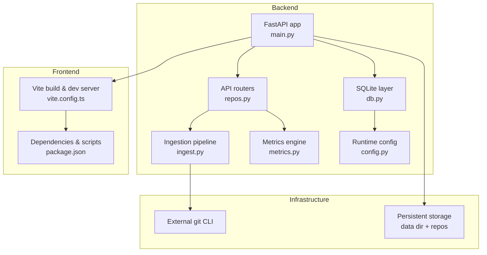
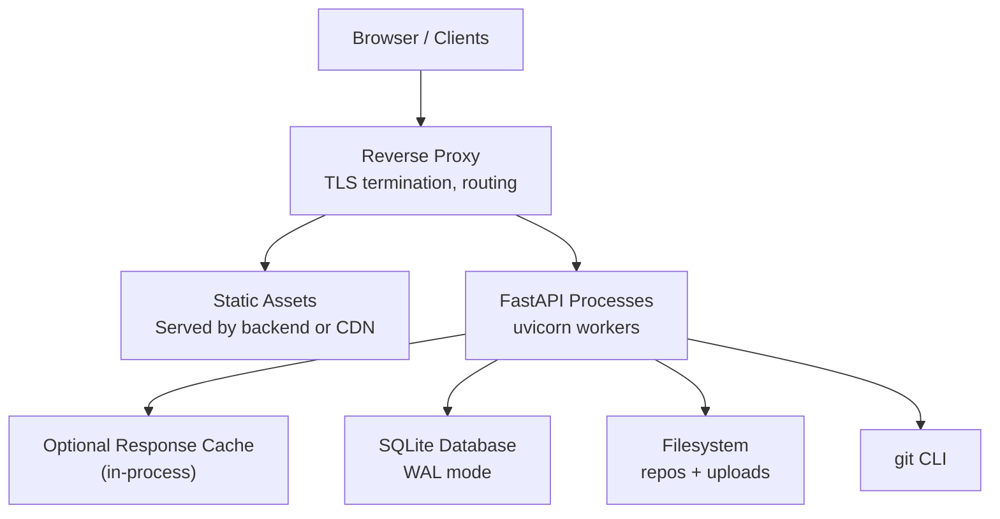
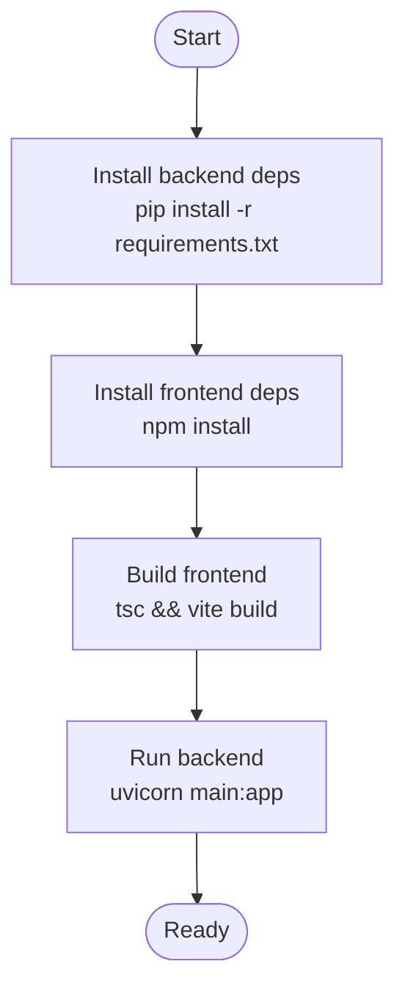
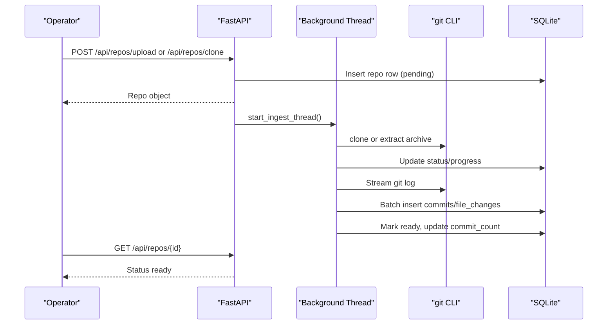

# Deployment Architecture

<cite>
**Referenced Files in This Document**
- [README.md](file://README.md)
- [Makefile](file://Makefile)
- [backend/app/main.py](file://backend/app/main.py)
- [backend/app/config.py](file://backend/app/config.py)
- [backend/app/db.py](file://backend/app/db.py)
- [backend/app/ingest.py](file://backend/app/ingest.py)
- [backend/app/metrics.py](file://backend/app/metrics.py)
- [backend/app/routers/repos.py](file://backend/app/routers/repos.py)
- [backend/requirements.txt](file://backend/requirements.txt)
- [frontend/package.json](file://frontend/package.json)
- [frontend/vite.config.ts](file://frontend/vite.config.ts)
</cite>

## Table of Contents
1. [Introduction](#introduction)
2. [Project Structure](#project-structure)
3. [Core Components](#core-components)
4. [Architecture Overview](#architecture-overview)
5. [Detailed Component Analysis](#detailed-component-analysis)
6. [Dependency Analysis](#dependency-analysis)
7. [Performance Considerations](#performance-considerations)
8. [Troubleshooting Guide](#troubleshooting-guide)
9. [Conclusion](#conclusion)
10. [Appendices](#appendices)

## Introduction
This document describes the production deployment architecture for RAT, a multi-repository web dashboard that indexes git history into SQLite and serves interactive metrics through a FastAPI backend and a React frontend built with Vite. It covers containerization options, environment configuration, build and dependency management, scaling considerations, monitoring and logging strategies, health checks, operational procedures, performance tuning, database optimization, and security considerations.

RAT’s runtime model is:
- Backend: Python 3.10+, FastAPI, uvicorn, SQLite (WAL), and an external `git` CLI used for cloning and streaming history indexing.
- Frontend: React 18, TypeScript, Vite, ECharts.
- Data: A single SQLite database per deployment, storing repository metadata, commits, file changes, author merges, and a short-lived in-process response cache.

The project provides Makefile targets for development, building, running, testing, and verification, which can be adapted into CI/CD pipelines and container images.

**Section sources**
- [README.md:1-15](file://README.md#L1-L15)
- [README.md:67-76](file://README.md#L67-L76)
- [README.md:170-196](file://README.md#L170-L196)

## Project Structure
At a high level, RAT consists of:
- `backend/app`: FastAPI application, routers, ingestion pipeline, metrics engine, schema, and configuration.
- `frontend/src`: React application, components, pages, API client, and state.
- `scripts`: Verification utilities.
- `Makefile`: Unified entry points for install, dev, build, run, test, verify, and clean.



**Diagram sources**
- [backend/app/main.py:1-49](file://backend/app/main.py#L1-L49)
- [backend/app/routers/repos.py:1-114](file://backend/app/routers/repos.py#L1-L114)
- [backend/app/ingest.py:1-439](file://backend/app/ingest.py#L1-L439)
- [backend/app/metrics.py:1-435](file://backend/app/metrics.py#L1-L435)
- [backend/app/db.py:1-87](file://backend/app/db.py#L1-L87)
- [backend/app/config.py:1-15](file://backend/app/config.py#L1-L15)
- [frontend/vite.config.ts:1-27](file://frontend/vite.config.ts#L1-L27)
- [frontend/package.json:1-25](file://frontend/package.json#L1-L25)

**Section sources**
- [README.md:198-208](file://README.md#L198-L208)
- [Makefile:1-63](file://Makefile#L1-L63)

## Core Components
- FastAPI application: Initializes CORS, mounts static assets, includes routers, and serves the SPA fallback.
- Repository ingestion: Background threads handle zip extraction or remote clone, then stream `git log` output to SQLite with batched inserts.
- Metrics engine: Implements all metric formulas and views over SQLite, including summary, files, directories, authors, timeseries, and commit-set rows.
- Database layer: Defines schema, creates tables/indexes, and opens tuned SQLite connections with WAL mode.
- Configuration: Reads environment variables for data directory and frontend distribution path.
- Frontend build: Vite builds React/TypeScript assets; optional manual chunking for ECharts and React.

Key responsibilities:
- Ingestion isolates long-running git operations from request handling via background threads.
- Metrics are computed via SQL aggregations over indexed tables.
- The SPA fallback allows serving the built frontend from the same process when assets exist.

**Section sources**
- [backend/app/main.py:1-49](file://backend/app/main.py#L1-L49)
- [backend/app/ingest.py:1-439](file://backend/app/ingest.py#L1-L439)
- [backend/app/metrics.py:1-435](file://backend/app/metrics.py#L1-L435)
- [backend/app/db.py:1-87](file://backend/app/db.py#L1-L87)
- [backend/app/config.py:1-15](file://backend/app/config.py#L1-L15)
- [frontend/vite.config.ts:1-27](file://frontend/vite.config.ts#L1-L27)

## Architecture Overview
Production deployment typically involves:
- A reverse proxy (e.g., Nginx/Traefik) terminating TLS and routing `/api` to the backend and static assets to the frontend.
- One or more backend processes behind a process manager (systemd/supervisor) or orchestrator (Kubernetes).
- Persistent volumes for SQLite and repository archives.
- Optional caching layer if horizontal scaling is introduced.



**Diagram sources**
- [backend/app/main.py:29-48](file://backend/app/main.py#L29-L48)
- [backend/app/config.py:7-15](file://backend/app/config.py#L7-L15)
- [backend/app/db.py:74-87](file://backend/app/db.py#L74-L87)
- [backend/app/ingest.py:38-66](file://backend/app/ingest.py#L38-L66)

## Detailed Component Analysis

### Build Process and Dependency Management
- Backend dependencies are managed via pip and pinned in `requirements.txt`.
- Frontend dependencies are managed via npm and locked in `package-lock.json`, with scripts defined in `package.json`.
- The Makefile coordinates Python venv creation, pip installs, npm installs, frontend build, and uvicorn execution.

Build steps:
- Install backend: Create venv, upgrade pip/wheel, install requirements.
- Install frontend: Run npm install.
- Build frontend: Type-check and build into `frontend/dist`.
- Run backend: Serve API and optionally serve built frontend on port 8000.



**Diagram sources**
- [Makefile:25-52](file://Makefile#L25-L52)
- [backend/requirements.txt:1-6](file://backend/requirements.txt#L1-L6)
- [frontend/package.json:1-25](file://frontend/package.json#L1-L25)

**Section sources**
- [Makefile:25-52](file://Makefile#L25-L52)
- [backend/requirements.txt:1-6](file://backend/requirements.txt#L1-L6)
- [frontend/package.json:1-25](file://frontend/package.json#L1-L25)

### Containerization Options
Recommended approaches:
- Multi-stage Docker image:
  - Stage 1: Node image to install frontend dependencies and build assets into `frontend/dist`.
  - Stage 2: Python image to install backend dependencies and copy built frontend assets.
- Runtime:
  - Use uvicorn with multiple workers as needed.
  - Mount persistent volume for `RAT_DATA_DIR`.
  - Ensure `git` is available in the runtime image.

Environment variables:
- `RAT_DATA_DIR`: Path to SQLite and repository storage.
- `RAT_FRONTEND_DIST`: Path to built frontend assets served by the backend.

Operational notes:
- Set `FRONTEND_DIST` to point at the mounted dist directory if you prefer to serve assets externally.
- Configure CORS origins appropriately for your domain(s).

**Section sources**
- [backend/app/config.py:7-15](file://backend/app/config.py#L7-L15)
- [backend/app/main.py:15-20](file://backend/app/main.py#L15-L20)
- [backend/app/main.py:29-48](file://backend/app/main.py#L29-L48)

### Environment Configuration Management
Configuration is minimal and environment-driven:
- `RAT_DATA_DIR` controls where SQLite and repositories are stored.
- `RAT_FRONTEND_DIST` controls where the backend looks for built frontend assets.
- Directory creation is automatic at startup.

For production:
- Provide these via container orchestration secrets or environment variable stores.
- Ensure the filesystem is writable and has sufficient capacity for large repositories.

**Section sources**
- [backend/app/config.py:7-15](file://backend/app/config.py#L7-L15)

### Scaling Considerations
Current design characteristics:
- Single-process FastAPI app with synchronous SQLite access.
- Background threading for ingestion tasks.
- In-process TTL cache for expensive queries.

Scaling implications:
- Horizontal scaling requires either:
  - Shared persistent storage for SQLite and repos, with care for SQLite concurrency limits.
  - Externalizing the response cache (e.g., Redis) to share across replicas.
- For heavy workloads, consider:
  - Increasing worker count judiciously.
  - Offloading ingestion to a separate worker queue (Celery/RQ) to avoid blocking API requests.
  - Using read replicas or materialized views if query patterns demand it.

**Section sources**
- [backend/app/metrics.py:403-435](file://backend/app/metrics.py#L403-L435)
- [backend/app/ingest.py:362-439](file://backend/app/ingest.py#L362-L439)

### Monitoring and Logging Strategies
Observability recommendations:
- Application logs:
  - Enable structured logging in uvicorn and FastAPI middleware.
  - Log ingestion lifecycle events (cloning, extracting, indexing, errors).
- Health endpoints:
  - Add explicit `/health` and `/ready` endpoints returning service status and DB connectivity.
- Metrics:
  - Expose Prometheus-compatible metrics for request latency, error rates, ingestion progress, and cache hit ratios.
- Tracing:
  - Add distributed tracing around ingestion and metric queries to identify bottlenecks.

Operational procedures:
- Monitor disk usage for SQLite and repository storage.
- Alert on ingestion failures and long-running clones/indexing jobs.
- Periodically vacuum/analyze SQLite to maintain performance.

[No sources needed since this section provides general guidance]

### Health Check Endpoints
Current behavior:
- No dedicated health endpoint exists.
- The SPA fallback returns a specific JSON detail when frontend assets are missing.

Recommended additions:
- `/health`: Returns HTTP 200 with basic service info.
- `/ready`: Checks DB connectivity and reports readiness.
- Integrate with orchestrators (Kubernetes liveness/readiness probes).

**Section sources**
- [backend/app/main.py:33-48](file://backend/app/main.py#L33-L48)

### Operational Procedures
Common tasks:
- Deploy:
  - Build frontend assets.
  - Start backend with uvicorn.
  - Configure reverse proxy and persistent storage.
- Ingest repositories:
  - Upload zip or clone URL via API.
  - Poll repository status until ready.
- Maintenance:
  - Delete repositories to free disk space.
  - Analyze database periodically.



**Diagram sources**
- [backend/app/routers/repos.py:50-94](file://backend/app/routers/repos.py#L50-L94)
- [backend/app/ingest.py:362-439](file://backend/app/ingest.py#L362-L439)

**Section sources**
- [backend/app/routers/repos.py:43-114](file://backend/app/routers/repos.py#L43-L114)
- [backend/app/ingest.py:362-439](file://backend/app/ingest.py#L362-L439)

## Dependency Analysis
External dependencies:
- Backend:
  - fastapi, uvicorn, python-multipart, pytest, httpx.
- Frontend:
  - react, react-dom, react-router-dom, echarts, vite, typescript.

Runtime dependencies:
- `git` CLI must be installed and accessible in PATH.
- SQLite is part of the Python standard library; no extra package required.

```mermaid
graph LR
BE["Backend"]
FE["Frontend"]
Ext["External Dependencies"]
BE --> |fastapi, uvicorn, multipart| Ext
FE --> |react, echarts, vite, ts| Ext
BE --> |sqlite3 (stdlib)| Ext
BE --> |git CLI| Ext
```

**Diagram sources**
- [backend/requirements.txt:1-6](file://backend/requirements.txt#L1-L6)
- [frontend/package.json:1-25](file://frontend/package.json#L1-L25)
- [backend/app/ingest.py:38-66](file://backend/app/ingest.py#L38-L66)

**Section sources**
- [backend/requirements.txt:1-6](file://backend/requirements.txt#L1-L6)
- [frontend/package.json:1-25](file://frontend/package.json#L1-L25)

## Performance Considerations
- Indexing strategy:
  - One subprocess per repository for indexing; streamed parsing keeps memory bounded.
  - Batched SQLite inserts reduce overhead.
- Query performance:
  - Short-TTL in-process cache absorbs repeated dashboard queries.
  - Indexed columns optimize time-range and path-scoped queries.
- Measured latencies:
  - Views generally stay under 500 ms on fresh indices.

Tuning guidelines:
- Increase uvicorn workers based on CPU cores and I/O characteristics.
- Tune SQLite pragmas if necessary (already set to WAL and NORMAL sync).
- Precompute or cache frequently accessed aggregates if workload patterns allow.
- Monitor ingestion throughput and adjust batch sizes if needed.

**Section sources**
- [README.md:170-196](file://README.md#L170-L196)
- [backend/app/metrics.py:403-435](file://backend/app/metrics.py#L403-L435)
- [backend/app/db.py:74-87](file://backend/app/db.py#L74-L87)
- [backend/app/ingest.py:328-350](file://backend/app/ingest.py#L328-L350)

## Troubleshooting Guide
Common issues and resolutions:
- Missing frontend assets:
  - The SPA fallback returns a JSON detail indicating the frontend is not built.
  - Resolve by running the frontend build step before starting the backend.
- Ingestion failures:
  - Errors during clone, extraction, or indexing are surfaced to the UI via repository status.
  - Check stderr/stdout from git commands and ensure credentials/network access.
- SQLite contention:
  - WAL mode improves concurrency; monitor lock timeouts and adjust connection settings if needed.
- Disk space exhaustion:
  - Large repositories consume significant storage; monitor and prune unused repos.

Operational checks:
- Verify repository status via API.
- Inspect ingestion logs for detailed error messages.
- Validate database integrity and analyze statistics periodically.

**Section sources**
- [backend/app/main.py:33-48](file://backend/app/main.py#L33-L48)
- [backend/app/ingest.py:423-429](file://backend/app/ingest.py#L423-L429)
- [backend/app/db.py:74-87](file://backend/app/db.py#L74-L87)

## Conclusion
RAT’s deployment architecture centers on a FastAPI backend backed by SQLite and a React frontend built with Vite. Production deployments should use a reverse proxy, persistent storage for data and repositories, and ensure `git` availability. Scaling horizontally requires careful handling of SQLite concurrency and shared caches. Observability, health checks, and operational procedures should be added to support robust production environments. Performance is optimized through efficient indexing, batching, and caching, but workload-specific tuning may be necessary.

[No sources needed since this section summarizes without analyzing specific files]

## Appendices

### API Endpoints Summary
- Repository management:
  - List repositories.
  - Upload zip archive.
  - Clone remote repository.
  - Get repository status.
  - Delete repository.
- Metrics:
  - Compute various views over filtered commit sets.

Reference:
- See the README for full API reference and filter body structure.

**Section sources**
- [README.md:111-142](file://README.md#L111-L142)

### Security Considerations
- Archive validation:
  - Zip-slip traversal protection prevents unsafe paths during extraction.
- Git invocation:
  - Disables terminal prompts and system config to avoid hangs and unintended side effects.
- CORS:
  - Restrict allowed origins to trusted domains in production.
- Authentication/Authorization:
  - Add authentication middleware and role-based access control for sensitive operations.
- Secrets management:
  - Store credentials for private repositories securely (e.g., SSH keys, tokens) and pass them via secure mechanisms.

**Section sources**
- [backend/app/ingest.py:121-139](file://backend/app/ingest.py#L121-L139)
- [backend/app/ingest.py:53-66](file://backend/app/ingest.py#L53-L66)
- [backend/app/main.py:15-20](file://backend/app/main.py#L15-L20)