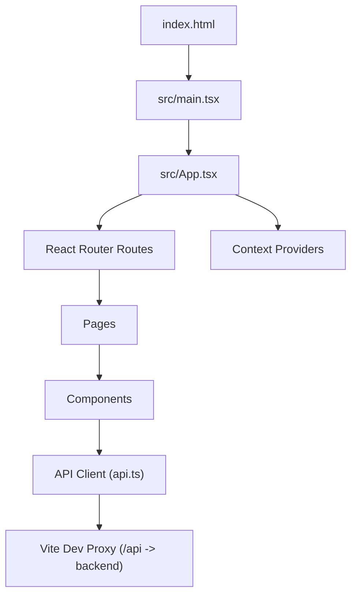
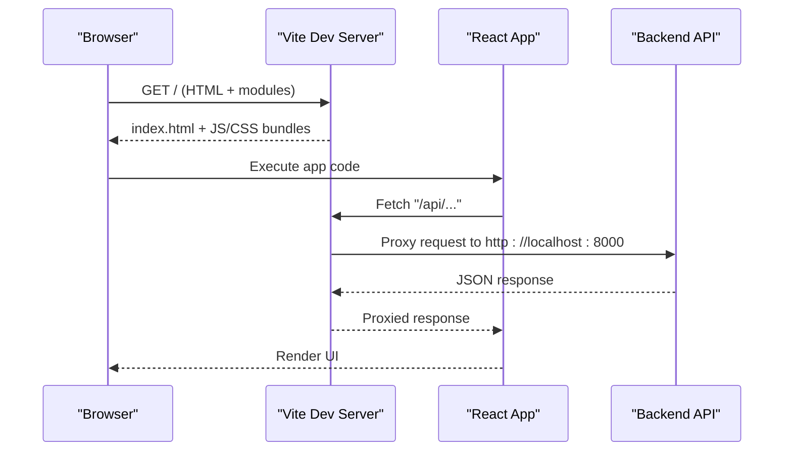
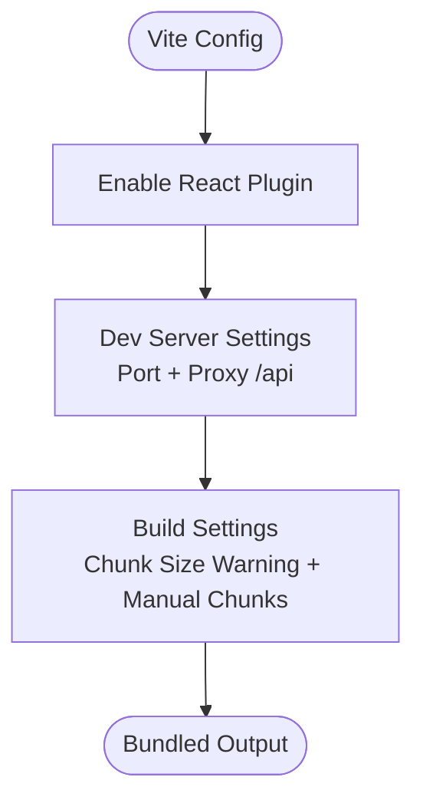
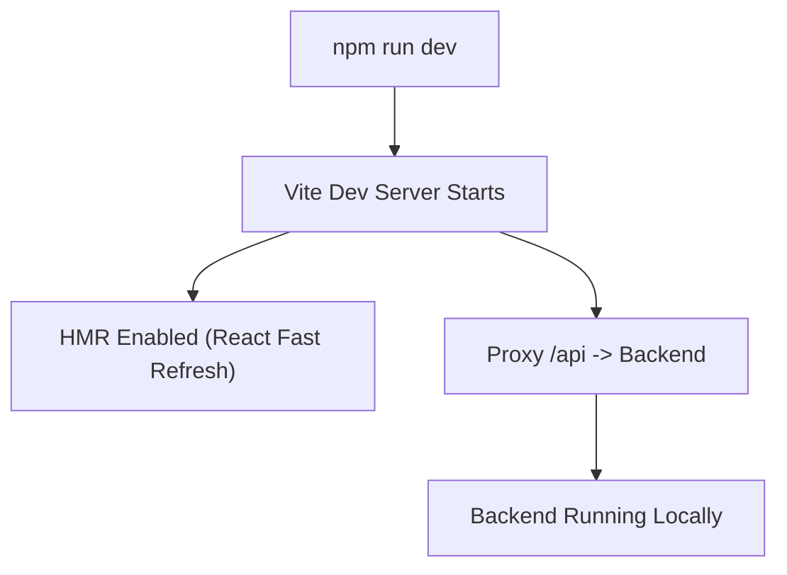
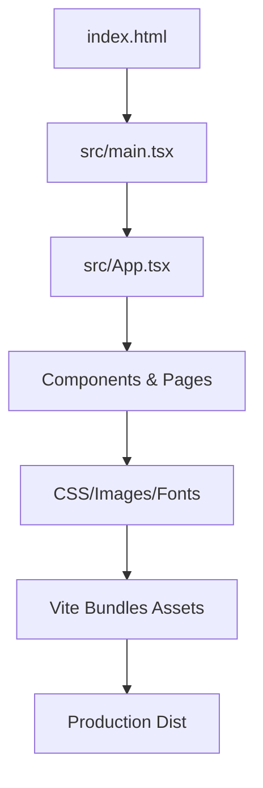
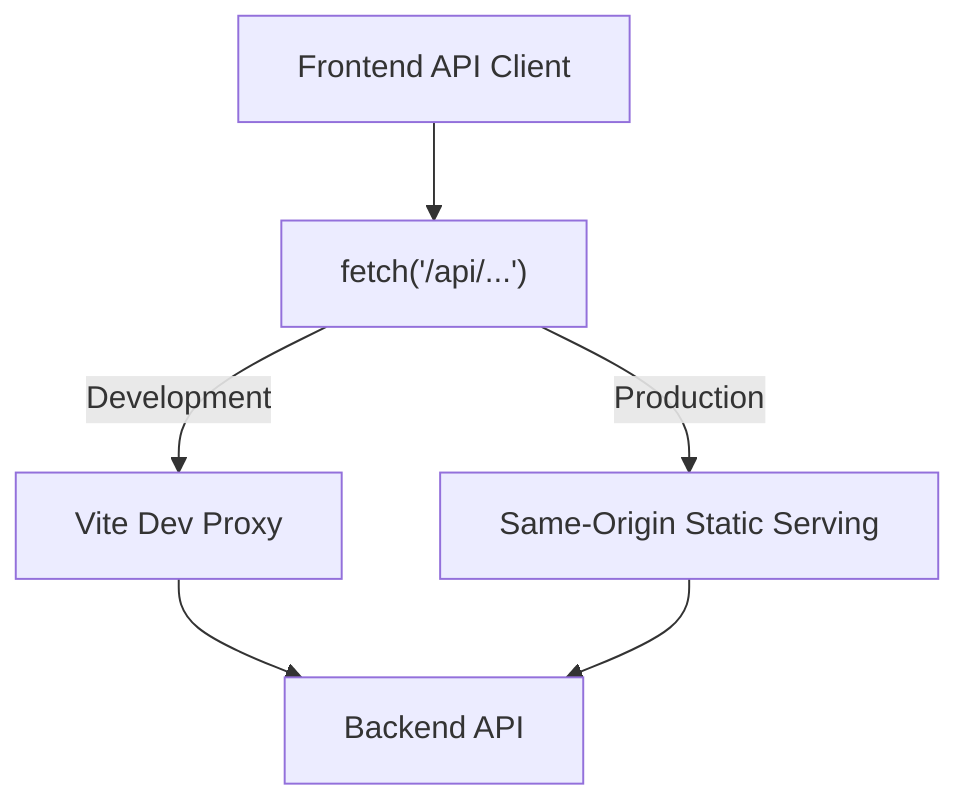
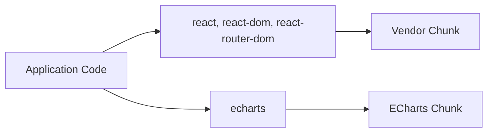

# Build Configuration

<cite>
**Referenced Files in This Document**
- [package.json](file://frontend/package.json)
- [vite.config.ts](file://frontend/vite.config.ts)
- [tsconfig.json](file://frontend/tsconfig.json)
- [index.html](file://frontend/index.html)
- [main.tsx](file://frontend/src/main.tsx)
- [App.tsx](file://frontend/src/App.tsx)
- [api.ts](file://frontend/src/api.ts)
</cite>

## Table of Contents
1. [Introduction](#introduction)
2. [Project Structure](#project-structure)
3. [Core Components](#core-components)
4. [Architecture Overview](#architecture-overview)
5. [Detailed Component Analysis](#detailed-component-analysis)
6. [Dependency Analysis](#dependency-analysis)
7. [Performance Considerations](#performance-considerations)
8. [Troubleshooting Guide](#troubleshooting-guide)
9. [Conclusion](#conclusion)

## Introduction
This document explains the frontend build system for the project, which uses Vite and TypeScript with React. It covers the development server setup, hot module replacement (HMR), asset pipeline configuration, TypeScript compilation settings, path aliasing strategy, type checking workflow, environment variables, API proxying, production optimizations, and guidance for extending the configuration.

## Project Structure
The frontend is a Vite + React application written in TypeScript. The entry point is an HTML file that loads the main TypeScript module, which mounts the React application into the DOM.

**Diagram sources**
- [index.html:12-14](file://frontend/index.html#L12-L14)
- [main.tsx:1-14](file://frontend/src/main.tsx#L1-L14)
- [App.tsx:1-38](file://frontend/src/App.tsx#L1-L38)
- [api.ts:1-127](file://frontend/src/api.ts#L1-L127)
- [vite.config.ts:6-14](file://frontend/vite.config.ts#L6-L14)

**Section sources**
- [index.html:1-17](file://frontend/index.html#L1-L17)
- [main.tsx:1-14](file://frontend/src/main.tsx#L1-L14)
- [App.tsx:1-38](file://frontend/src/App.tsx#L1-L38)

## Core Components
- Vite configuration: defines plugins, dev server, proxy, and build options.
- TypeScript configuration: sets compiler options, strictness, JSX mode, and module resolution.
- Package scripts: define development, type-checked builds, and preview workflows.
- Application bootstrap: HTML shell and React root mounting.
- API client: typed fetch wrapper using relative paths to work with both dev proxy and production static serving.

Key responsibilities:
- Development server and HMR are provided by Vite out of the box.
- TypeScript is used for type checking without emitting files during build.
- Asset pipeline is handled by Vite’s default bundling and optimization.

**Section sources**
- [package.json:6-23](file://frontend/package.json#L6-L23)
- [vite.config.ts:1-27](file://frontend/vite.config.ts#L1-L27)
- [tsconfig.json:1-20](file://frontend/tsconfig.json#L1-L20)
- [index.html:1-17](file://frontend/index.html#L1-L17)
- [main.tsx:1-14](file://frontend/src/main.tsx#L1-L14)
- [api.ts:1-127](file://frontend/src/api.ts#L1-L127)

## Architecture Overview
The frontend runs on a local development server powered by Vite. During development, requests to `/api/*` are proxied to the backend server. In production, the built assets are served statically and API calls use relative URLs, relying on the same-origin deployment.

**Diagram sources**
- [vite.config.ts:6-14](file://frontend/vite.config.ts#L6-L14)
- [api.ts:26-44](file://frontend/src/api.ts#L26-L44)
- [index.html:12-14](file://frontend/index.html#L12-L14)

## Detailed Component Analysis

### Vite Configuration
- Plugins: React plugin is enabled for JSX support and fast refresh.
- Development server:
  - Port set explicitly.
  - Proxy configured to forward `/api` requests to the backend at `http://localhost:8000`.
- Build:
  - Chunk size warning limit tuned.
  - Manual chunks defined to split vendor libraries (ECharts and React stack) for better caching and parallel loading.

**Diagram sources**
- [vite.config.ts:4-25](file://frontend/vite.config.ts#L4-L25)

**Section sources**
- [vite.config.ts:1-27](file://frontend/vite.config.ts#L1-L27)

### TypeScript Compilation and Type Checking
- Target and modules: Targets modern JavaScript (ES2020) and uses ESNext modules optimized for bundlers.
- Module resolution: Uses bundler-friendly resolution; JSON imports are enabled.
- Strictness: Strict mode is enabled; unused locals/parameters warnings are disabled; switch fallthrough checks are enabled.
- JSX: Uses React’s automatic JSX runtime.
- Isolation and emit: Isolated modules enabled; no emit so Vite handles output.
- Include scope: Only the `src` directory is included.

Type checking strategy:
- The build script runs the TypeScript compiler in type-check-only mode before building, ensuring type safety without generating extra artifacts.

Path aliases:
- No explicit path aliases are configured. Relative imports are used throughout the application. If needed, add a `paths` mapping under `compilerOptions` and ensure your editor supports it.

Environment types:
- Vite environment variable types can be extended via a dedicated declaration file if required.

**Section sources**
- [tsconfig.json:1-20](file://frontend/tsconfig.json#L1-L20)
- [package.json:6-10](file://frontend/package.json#L6-L10)

### Development Server and Hot Module Replacement
- The development server starts on a fixed port and serves the app with HMR enabled by default.
- React Fast Refresh is provided by the React plugin, enabling component updates without full page reloads.
- API proxying: Requests starting with `/api` are forwarded to the backend server, allowing seamless local development against the real API.

**Diagram sources**
- [package.json:7-7](file://frontend/package.json#L7-L7)
- [vite.config.ts:6-14](file://frontend/vite.config.ts#L6-L14)

**Section sources**
- [package.json:6-10](file://frontend/package.json#L6-L10)
- [vite.config.ts:6-14](file://frontend/vite.config.ts#L6-L14)

### Asset Pipeline
- Entry point: The HTML file includes a module script tag pointing to the main TypeScript entry.
- Bundling: Vite automatically processes CSS, images, fonts, and other assets referenced from source files.
- Optimization: Production builds minify and tree-shake code; manual chunks improve cacheability for large libraries.

**Diagram sources**
- [index.html:12-14](file://frontend/index.html#L12-L14)
- [main.tsx:1-14](file://frontend/src/main.tsx#L1-L14)
- [App.tsx:1-38](file://frontend/src/App.tsx#L1-L38)
- [vite.config.ts:15-25](file://frontend/vite.config.ts#L15-L25)

**Section sources**
- [index.html:1-17](file://frontend/index.html#L1-L17)
- [main.tsx:1-14](file://frontend/src/main.tsx#L1-L14)
- [vite.config.ts:15-25](file://frontend/vite.config.ts#L15-L25)

### API Client and Environment Variables
- The API client uses relative paths (`/api/...`) so the same code works in development (proxied) and production (same-origin).
- Error handling wraps network failures and non-OK responses into a typed error object.
- Environment variables:
  - No `.env` files are present in the repository.
  - To configure environment-specific values, create `.env`, `.env.development`, or `.env.production` files and reference them via `import.meta.env.VITE_*` in the frontend code.
  - Ensure any new variables are declared in the Vite environment type declarations to get proper IntelliSense.

**Diagram sources**
- [api.ts:26-44](file://frontend/src/api.ts#L26-L44)
- [vite.config.ts:8-12](file://frontend/vite.config.ts#L8-L12)

**Section sources**
- [api.ts:1-127](file://frontend/src/api.ts#L1-L127)

### Scripts and Workflows
- Development: Starts the Vite dev server with HMR and proxying.
- Build: Runs TypeScript type checking only, then builds the production bundle.
- Preview: Serves the production build locally for verification.

Recommended workflow:
- Use the development script during active development.
- Run the build script to validate types and generate optimized assets.
- Use the preview script to inspect the production build locally.

**Section sources**
- [package.json:6-10](file://frontend/package.json#L6-L10)

## Dependency Analysis
The frontend depends on React, React DOM, React Router, and ECharts. The build splits these dependencies into separate chunks to improve caching and load performance.

**Diagram sources**
- [package.json:11-22](file://frontend/package.json#L11-L22)
- [vite.config.ts:17-23](file://frontend/vite.config.ts#L17-L23)

**Section sources**
- [package.json:11-22](file://frontend/package.json#L11-L22)
- [vite.config.ts:17-23](file://frontend/vite.config.ts#L17-L23)

## Performance Considerations
- Manual chunks: Large third-party libraries are isolated into their own chunks to leverage browser caching and reduce initial payload.
- Chunk size warnings: The threshold is tuned to alert when chunks grow too large.
- Tree shaking and minification: Handled automatically by Vite in production builds.
- Avoid unnecessary dependencies: Keep the dependency surface minimal to reduce bundle size.

[No sources needed since this section provides general guidance]

## Troubleshooting Guide
Common issues and resolutions:
- Missing root element:
  - Symptom: Runtime error indicating the root element is missing.
  - Cause: The HTML does not contain the expected container element.
  - Resolution: Ensure the HTML includes the root element and the script tag points to the correct entry.
- Backend unreachable:
  - Symptom: Network errors when calling API endpoints.
  - Cause: Backend not running or CORS/proxy misconfiguration.
  - Resolution: Verify the backend is running on the expected port and the dev proxy target is correct.
- Type errors during build:
  - Symptom: Build fails due to TypeScript errors.
  - Cause: Type mismatches or invalid usage.
  - Resolution: Fix reported type errors; the build script enforces type checking before bundling.
- Path aliases not resolving:
  - Symptom: Import paths fail to resolve.
  - Cause: No path aliases configured.
  - Resolution: Add `paths` mappings in TypeScript config and update imports accordingly.
- Environment variables not available:
  - Symptom: Accessing `import.meta.env` yields undefined.
  - Cause: Variable not prefixed with `VITE_` or not defined in the appropriate `.env` file.
  - Resolution: Define variables with the `VITE_` prefix and restart the dev server.

**Section sources**
- [main.tsx:6-8](file://frontend/src/main.tsx#L6-L8)
- [api.ts:26-44](file://frontend/src/api.ts#L26-L44)
- [package.json:8-8](file://frontend/package.json#L8-L8)
- [vite.config.ts:8-12](file://frontend/vite.config.ts#L8-L12)

## Conclusion
The frontend build is a lean Vite + TypeScript setup focused on developer experience and production efficiency. It leverages HMR, strict type checking, and sensible defaults while providing clear extension points for environment variables, proxies, and chunk splitting. Following the guidance here will help you extend the configuration confidently and troubleshoot common issues effectively.