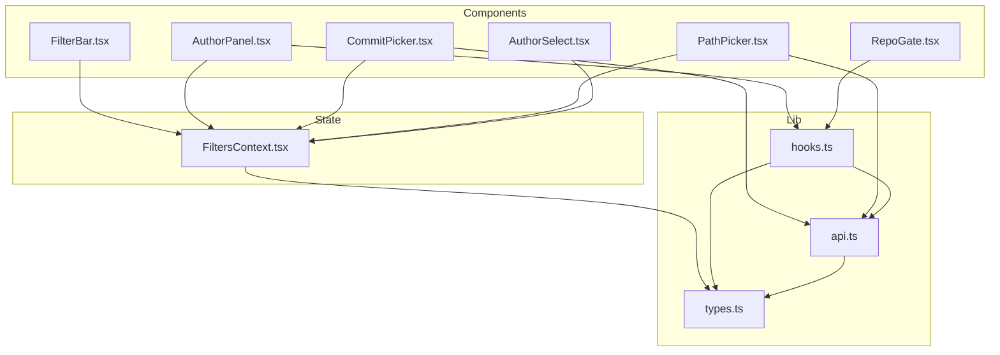
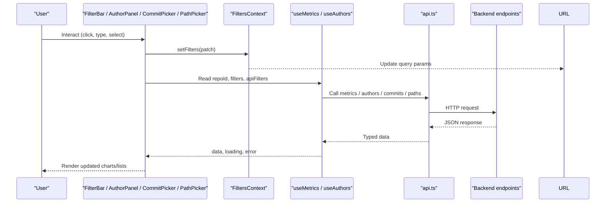
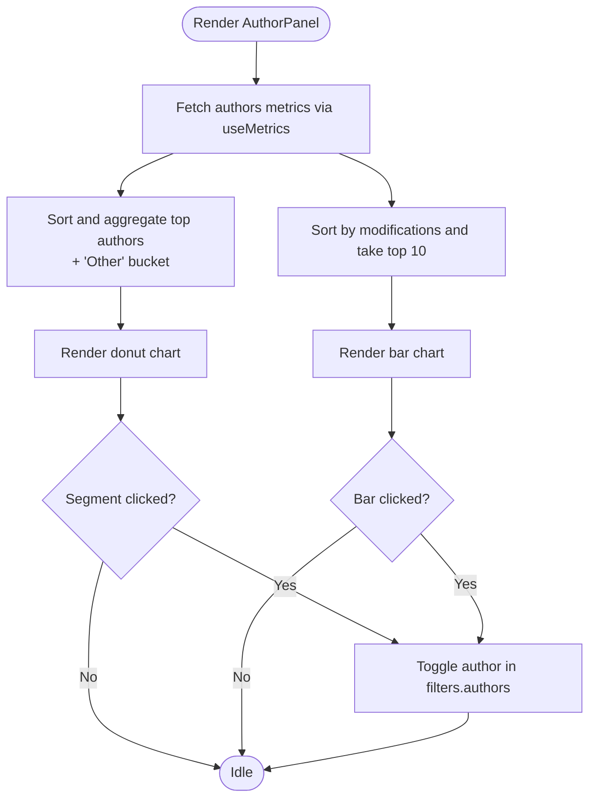
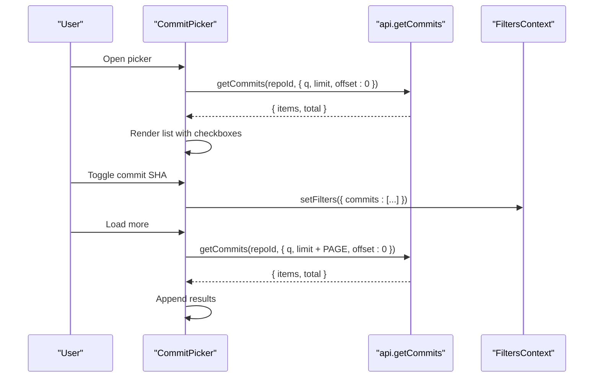
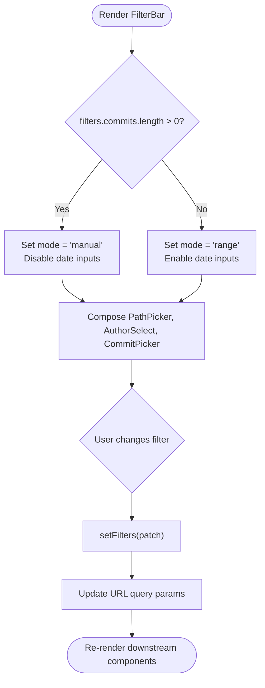
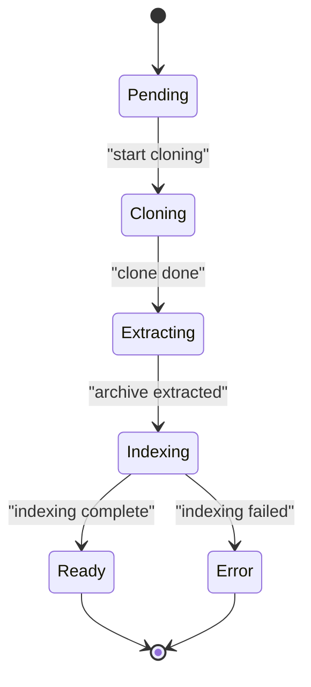
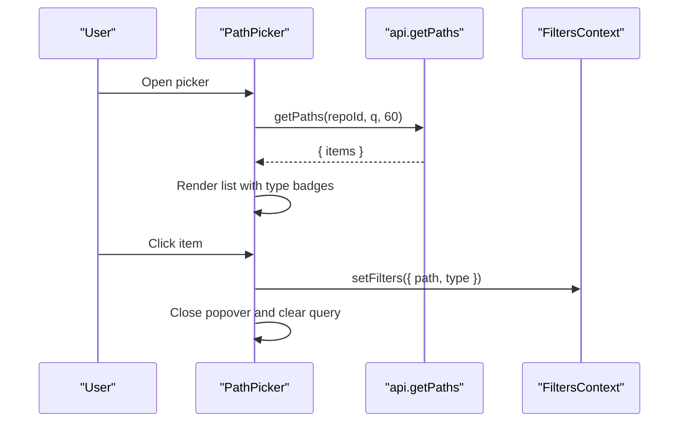
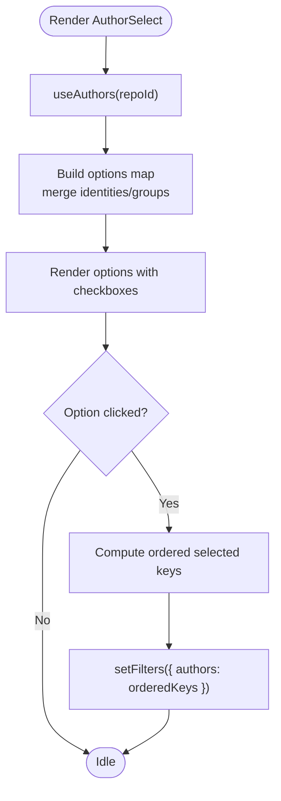
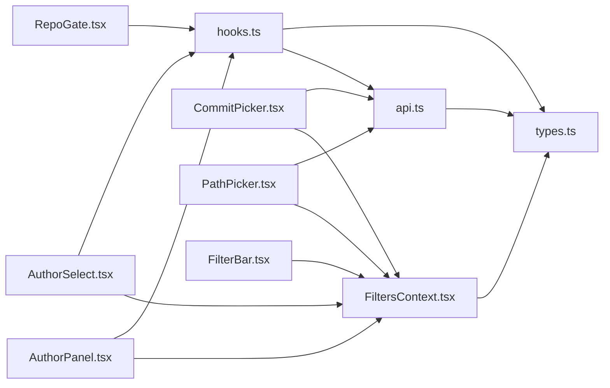

# Business Logic Components

<cite>
**Referenced Files in This Document**
- [AuthorPanel.tsx](file://frontend/src/components/AuthorPanel.tsx)
- [CommitPicker.tsx](file://frontend/src/components/CommitPicker.tsx)
- [FilterBar.tsx](file://frontend/src/components/FilterBar.tsx)
- [RepoGate.tsx](file://frontend/src/components/RepoGate.tsx)
- [PathPicker.tsx](file://frontend/src/components/PathPicker.tsx)
- [AuthorSelect.tsx](file://frontend/src/components/AuthorSelect.tsx)
- [FiltersContext.tsx](file://frontend/src/state/FiltersContext.tsx)
- [hooks.ts](file://frontend/src/lib/hooks.ts)
- [api.ts](file://frontend/src/api.ts)
- [types.ts](file://frontend/src/types.ts)
</cite>

## Table of Contents
1. [Introduction](#introduction)
2. [Project Structure](#project-structure)
3. [Core Components](#core-components)
4. [Architecture Overview](#architecture-overview)
5. [Detailed Component Analysis](#detailed-component-analysis)
6. [Dependency Analysis](#dependency-analysis)
7. [Performance Considerations](#performance-considerations)
8. [Troubleshooting Guide](#troubleshooting-guide)
9. [Conclusion](#conclusion)

## Introduction
This document explains the business logic components that manage complex user interactions and data flow for repository analytics: AuthorPanel, CommitPicker, FilterBar, RepoGate, PathPicker, and their supporting AuthorSelect component. It focuses on how these components filter data, select commits and paths, control repository access, and integrate with a global filter context that syncs state to the URL.

The goal is to make it easy to understand:
- How filters are composed across dimensions (time range, manual commit list, authors, path scope, granularity).
- How selection state is managed and persisted.
- How data flows from UI interactions through the API to charts and tables.
- How repository ingestion status gates access to metrics.

## Project Structure
The relevant frontend code is organized into:
- `src/components`: UI components implementing filtering, selection, and visualization controls.
- `src/state`: Global state providers and contexts.
- `src/lib`: Shared hooks and utilities.
- `src/api.ts`: Typed HTTP client.
- `src/types.ts`: Shared TypeScript interfaces for API payloads and filters.

**Diagram sources**
- [FilterBar.tsx:1-93](file://frontend/src/components/FilterBar.tsx#L1-L93)
- [AuthorPanel.tsx:1-199](file://frontend/src/components/AuthorPanel.tsx#L1-L199)
- [CommitPicker.tsx:1-162](file://frontend/src/components/CommitPicker.tsx#L1-L162)
- [PathPicker.tsx:1-127](file://frontend/src/components/PathPicker.tsx#L1-L127)
- [RepoGate.tsx:1-41](file://frontend/src/components/RepoGate.tsx#L1-L41)
- [AuthorSelect.tsx:1-153](file://frontend/src/components/AuthorSelect.tsx#L1-L153)
- [FiltersContext.tsx:1-119](file://frontend/src/state/FiltersContext.tsx#L1-L119)
- [hooks.ts:1-142](file://frontend/src/lib/hooks.ts#L1-L142)
- [api.ts:1-127](file://frontend/src/api.ts#L1-L127)
- [types.ts:1-172](file://frontend/src/types.ts#L1-L172)

**Section sources**
- [FilterBar.tsx:1-93](file://frontend/src/components/FilterBar.tsx#L1-L93)
- [FiltersContext.tsx:1-119](file://frontend/src/state/FiltersContext.tsx#L1-L119)
- [hooks.ts:1-142](file://frontend/src/lib/hooks.ts#L1-L142)
- [api.ts:1-127](file://frontend/src/api.ts#L1-L127)
- [types.ts:1-172](file://frontend/src/types.ts#L1-L172)

## Core Components
This section summarizes each component’s role, props, state, events, and integration points.

- AuthorPanel
  - Purpose: Visualize author ownership and modifications; toggle authors into the active filter.
  - Data source: Metrics view “authors” via `useMetrics`.
  - State: Selected authors derived from global filter context.
  - Events: Clicking chart segments toggles author filter; clear button resets authors.
  - Integration: Reads `repoId`, `filters`, `setFilters` from `useFilters`; writes back to `filters.authors`.

- CommitPicker
  - Purpose: Manual multi-select of commits by search and pagination.
  - Data source: `api.getCommits(repoId, { q, limit, offset })`.
  - State: Local open/close, query, rows, total, limit, loading, error.
  - Events: Toggle commit selection; clear selection; load more; close on outside click or Escape.
  - Integration: Updates `filters.commits` via `setFilters`.

- FilterBar
  - Purpose: Multi-dimensional filter UI combining path picker, time range, granularity, authors, and commits.
  - State: Derived default-state check; mode (“range” vs “manual”) from context.
  - Events: Update start/end/granularity/authors/commits; reset all filters; switch between manual and range modes.
  - Integration: Composes `PathPicker`, `AuthorSelect`, `CommitPicker`; reads/writes via `useFilters`.

- RepoGate
  - Purpose: Display ingestion status and progress; gate access while repository is being processed.
  - Props: `repo: RepoInfo`.
  - Behavior: Shows status text, spinner during active states, progress bar, error note if failed.
  - Integration: Uses `isRepoActive` helper; does not mutate global filters.

- PathPicker
  - Purpose: Search and select a file or directory as object scope.
  - Data source: `api.getPaths(repoId, q, limit)`.
  - State: Local open/close, query, items, loading, error.
  - Events: Select item; clear to root; keyboard Enter/Escape handling.
  - Integration: Updates `filters.path` and `filters.type` via `setFilters`.

- AuthorSelect
  - Purpose: Multi-select authors with merged identities and local search.
  - Data source: `useAuthors(repoId)` hook.
  - State: Local open/close, query, computed visible options.
  - Events: Toggle author key; clear selection; close on outside click.
  - Integration: Updates `filters.authors` via `setFilters`.

**Section sources**
- [AuthorPanel.tsx:13-199](file://frontend/src/components/AuthorPanel.tsx#L13-L199)
- [CommitPicker.tsx:14-162](file://frontend/src/components/CommitPicker.tsx#L14-L162)
- [FilterBar.tsx:9-93](file://frontend/src/components/FilterBar.tsx#L9-L93)
- [RepoGate.tsx:15-41](file://frontend/src/components/RepoGate.tsx#L15-L41)
- [PathPicker.tsx:9-127](file://frontend/src/components/PathPicker.tsx#L9-L127)
- [AuthorSelect.tsx:42-153](file://frontend/src/components/AuthorSelect.tsx#L42-L153)

## Architecture Overview
The global filter context is the single source of truth for dashboard filters. Components read from it and dispatch patches to update it. The context serializes filters to the URL query string, making views shareable and bookmarkable.

**Diagram sources**
- [FiltersContext.tsx:14-119](file://frontend/src/state/FiltersContext.tsx#L14-L119)
- [hooks.ts:53-99](file://frontend/src/lib/hooks.ts#L53-L99)
- [hooks.ts:101-124](file://frontend/src/lib/hooks.ts#L101-L124)
- [api.ts:54-127](file://frontend/src/api.ts#L54-L127)

## Detailed Component Analysis

### AuthorPanel
AuthorPanel renders two ECharts visualizations:
- A donut chart showing author ownership distribution, including an aggregated “Other” group when there are many authors.
- A horizontal bar chart ranking authors by modification count.

Key behaviors:
- Selection: Clicking a segment toggles the corresponding author key in `filters.authors`.
- Aggregation: When there are more than eight authors, the bottom entries are collapsed into an “Other” entry.
- Clearing: A clear button sets `filters.authors` to an empty array.
- Data fetching: Uses `useMetrics(repoId, "authors", apiFilters)` to fetch author metrics based on current filters.

Complexity notes:
- Sorting and aggregation run on the dataset size N; sorting is O(N log N), slicing is O(N).
- Chart options are memoized to avoid unnecessary re-renders.

**Diagram sources**
- [AuthorPanel.tsx:21-38](file://frontend/src/components/AuthorPanel.tsx#L21-L38)
- [AuthorPanel.tsx:89-146](file://frontend/src/components/AuthorPanel.tsx#L89-L146)
- [AuthorPanel.tsx:148-168](file://frontend/src/components/AuthorPanel.tsx#L148-L168)

**Section sources**
- [AuthorPanel.tsx:13-199](file://frontend/src/components/AuthorPanel.tsx#L13-L199)
- [hooks.ts:53-99](file://frontend/src/lib/hooks.ts#L53-L99)
- [types.ts:123-136](file://frontend/src/types.ts#L123-L136)

### CommitPicker
CommitPicker provides a searchable, paginated list of commits. It supports:
- Debounced search input.
- Pagination via “Load more” up to a maximum window.
- Multi-select with checkboxes and a selected count.
- Clearing selections.
- Closing on outside click or pressing Escape.

Data flow:
- On open or query change, it calls `api.getCommits(repoId, { q, limit, offset: 0 })`.
- Selected SHAs are stored in `filters.commits`.
- When manual commits are selected, the global mode becomes “manual”, disabling time range inputs in FilterBar.

**Diagram sources**
- [CommitPicker.tsx:30-51](file://frontend/src/components/CommitPicker.tsx#L30-L51)
- [CommitPicker.tsx:55-60](file://frontend/src/components/CommitPicker.tsx#L55-L60)
- [CommitPicker.tsx:140-148](file://frontend/src/components/CommitPicker.tsx#L140-L148)
- [api.ts:87-99](file://frontend/src/api.ts#L87-L99)

**Section sources**
- [CommitPicker.tsx:14-162](file://frontend/src/components/CommitPicker.tsx#L14-L162)
- [api.ts:87-99](file://frontend/src/api.ts#L87-L99)
- [types.ts:52-64](file://frontend/src/types.ts#L52-L64)

### FilterBar
FilterBar composes multiple filter controls:
- PathPicker for object scope.
- Date inputs for start and end (disabled when manual commit list is active).
- Granularity selector (day, week, month).
- AuthorSelect for author filtering.
- CommitPicker for manual commit selection.
- Reset button to clear all filters.

Behavioral highlights:
- Mode detection: If `filters.commits` is non-empty, mode is “manual”; otherwise “range”.
- Default state detection: Computes whether all filters are at defaults to disable the reset button.
- Hint banner: When manual mode is active, shows a hint explaining that time range is ignored.

**Diagram sources**
- [FilterBar.tsx:9-20](file://frontend/src/components/FilterBar.tsx#L9-L20)
- [FilterBar.tsx:21-93](file://frontend/src/components/FilterBar.tsx#L21-L93)
- [FiltersContext.tsx:91-104](file://frontend/src/state/FiltersContext.tsx#L91-L104)

**Section sources**
- [FilterBar.tsx:9-93](file://frontend/src/components/FilterBar.tsx#L9-L93)
- [FiltersContext.tsx:14-119](file://frontend/src/state/FiltersContext.tsx#L14-L119)

### RepoGate
RepoGate displays repository ingestion status and progress:
- Status badge and human-readable message based on `repo.status`.
- Auto-refresh indicator while status is active.
- Progress bar and detail text.
- Error note when status is “error”.

It uses `isRepoActive` to determine whether to show auto-refresh indicators and progress.

**Diagram sources**
- [RepoGate.tsx:6-13](file://frontend/src/components/RepoGate.tsx#L6-L13)
- [RepoGate.tsx:15-41](file://frontend/src/components/RepoGate.tsx#L15-L41)
- [hooks.ts:7-11](file://frontend/src/lib/hooks.ts#L7-L11)

**Section sources**
- [RepoGate.tsx:15-41](file://frontend/src/components/RepoGate.tsx#L15-L41)
- [hooks.ts:7-11](file://frontend/src/lib/hooks.ts#L7-L11)
- [types.ts:5-28](file://frontend/src/types.ts#L5-L28)

### PathPicker
PathPicker allows searching and selecting files or directories:
- Debounced search input.
- Calls `api.getPaths(repoId, q, 60)` to retrieve matching paths.
- Displays type badges (“dir” vs “file”).
- Selecting an item updates `filters.path` and `filters.type`.
- Keyboard support: Enter selects first result; Escape closes popover.

**Diagram sources**
- [PathPicker.tsx:20-40](file://frontend/src/components/PathPicker.tsx#L20-L40)
- [PathPicker.tsx:50-54](file://frontend/src/components/PathPicker.tsx#L50-L54)
- [api.ts:100-105](file://frontend/src/api.ts#L100-L105)

**Section sources**
- [PathPicker.tsx:9-127](file://frontend/src/components/PathPicker.tsx#L9-L127)
- [api.ts:100-105](file://frontend/src/api.ts#L100-L105)
- [types.ts:66-74](file://frontend/src/types.ts#L66-L74)

### AuthorSelect
AuthorSelect provides a searchable multi-select for authors:
- Merges identities into groups where applicable.
- Maintains stable ordering of selected keys based on option list order.
- Local search by name or email.
- Clears selection via a dedicated button.

**Diagram sources**
- [AuthorSelect.tsx:15-40](file://frontend/src/components/AuthorSelect.tsx#L15-L40)
- [AuthorSelect.tsx:60-67](file://frontend/src/components/AuthorSelect.tsx#L60-L67)
- [hooks.ts:101-124](file://frontend/src/lib/hooks.ts#L101-L124)

**Section sources**
- [AuthorSelect.tsx:15-153](file://frontend/src/components/AuthorSelect.tsx#L15-L153)
- [hooks.ts:101-124](file://frontend/src/lib/hooks.ts#L101-L124)
- [types.ts:30-50](file://frontend/src/types.ts#L30-L50)

## Dependency Analysis
The following diagram maps component dependencies to shared modules:

**Diagram sources**
- [AuthorPanel.tsx:1-199](file://frontend/src/components/AuthorPanel.tsx#L1-L199)
- [CommitPicker.tsx:1-162](file://frontend/src/components/CommitPicker.tsx#L1-L162)
- [PathPicker.tsx:1-127](file://frontend/src/components/PathPicker.tsx#L1-L127)
- [AuthorSelect.tsx:1-153](file://frontend/src/components/AuthorSelect.tsx#L1-L153)
- [FilterBar.tsx:1-93](file://frontend/src/components/FilterBar.tsx#L1-L93)
- [RepoGate.tsx:1-41](file://frontend/src/components/RepoGate.tsx#L1-L41)
- [FiltersContext.tsx:1-119](file://frontend/src/state/FiltersContext.tsx#L1-L119)
- [hooks.ts:1-142](file://frontend/src/lib/hooks.ts#L1-L142)
- [api.ts:1-127](file://frontend/src/api.ts#L1-L127)
- [types.ts:1-172](file://frontend/src/types.ts#L1-L172)

**Section sources**
- [AuthorPanel.tsx:1-199](file://frontend/src/components/AuthorPanel.tsx#L1-L199)
- [CommitPicker.tsx:1-162](file://frontend/src/components/CommitPicker.tsx#L1-L162)
- [PathPicker.tsx:1-127](file://frontend/src/components/PathPicker.tsx#L1-L127)
- [AuthorSelect.tsx:1-153](file://frontend/src/components/AuthorSelect.tsx#L1-L153)
- [FilterBar.tsx:1-93](file://frontend/src/components/FilterBar.tsx#L1-L93)
- [RepoGate.tsx:1-41](file://frontend/src/components/RepoGate.tsx#L1-L41)
- [FiltersContext.tsx:1-119](file://frontend/src/state/FiltersContext.tsx#L1-L119)
- [hooks.ts:1-142](file://frontend/src/lib/hooks.ts#L1-L142)
- [api.ts:1-127](file://frontend/src/api.ts#L1-L127)
- [types.ts:1-172](file://frontend/src/types.ts#L1-L172)

## Performance Considerations
- Debouncing: Query inputs in CommitPicker, PathPicker, and metrics fetching are debounced to reduce network requests and UI churn.
- Memoization: Chart options and computed lists are memoized to prevent unnecessary recalculations.
- Pagination: CommitPicker limits initial page size and caps maximum window to balance responsiveness and memory usage.
- Stale data handling: `useMetrics` keeps previous data while new queries are in flight to avoid flashing empty charts.
- Polling: Repository status polling is throttled and cleaned up on unmount.

[No sources needed since this section provides general guidance]

## Troubleshooting Guide
Common issues and resolutions:
- No data displayed in charts
  - Verify that `filters` are valid and not overly restrictive.
  - Check that `apiFilters` are correctly serialized by FiltersContext.
  - Inspect network requests to ensure backend returns expected payloads.

- CommitPicker shows no matches
  - Confirm search query is correct and backend endpoint `/api/repos/{id}/commits` is reachable.
  - Ensure pagination parameters are within allowed limits.

- PathPicker returns no results
  - Validate repository indexing status using RepoGate; paths may be unavailable until indexing completes.
  - Check that `repoId` is correct and passed to `api.getPaths`.

- AuthorSelect shows no authors
  - Ensure repository has completed ingestion and author index exists.
  - Verify `api.getAuthors` returns data.

- Manual commit selection overrides time range unexpectedly
  - Remember that when `filters.commits` is non-empty, mode is “manual” and time range inputs are disabled.
  - Use the “Use the time range instead” hint in FilterBar to clear manual selection.

**Section sources**
- [CommitPicker.tsx:30-51](file://frontend/src/components/CommitPicker.tsx#L30-L51)
- [PathPicker.tsx:20-40](file://frontend/src/components/PathPicker.tsx#L20-L40)
- [AuthorSelect.tsx:15-40](file://frontend/src/components/AuthorSelect.tsx#L15-L40)
- [FilterBar.tsx:74-89](file://frontend/src/components/FilterBar.tsx#L74-L89)
- [RepoGate.tsx:15-41](file://frontend/src/components/RepoGate.tsx#L15-L41)
- [hooks.ts:53-99](file://frontend/src/lib/hooks.ts#L53-L99)

## Conclusion
These business logic components form a cohesive system for filtering and exploring repository metrics:
- FilterBar orchestrates multi-dimensional filtering and integrates specialized pickers.
- AuthorPanel and AuthorSelect provide author-centric insights and selection.
- CommitPicker enables precise manual commit selection.
- PathPicker scopes analysis to specific files or directories.
- RepoGate ensures users are informed about repository ingestion status.
- FiltersContext centralizes state management and URL synchronization, enabling shareable views and consistent data flow across components.

By composing these components and leveraging the global filter context, the application delivers a responsive, powerful interface for repository analytics.

[No sources needed since this section summarizes without analyzing specific files]