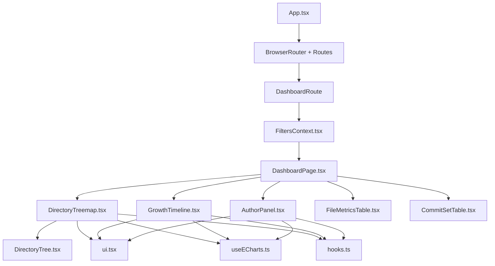
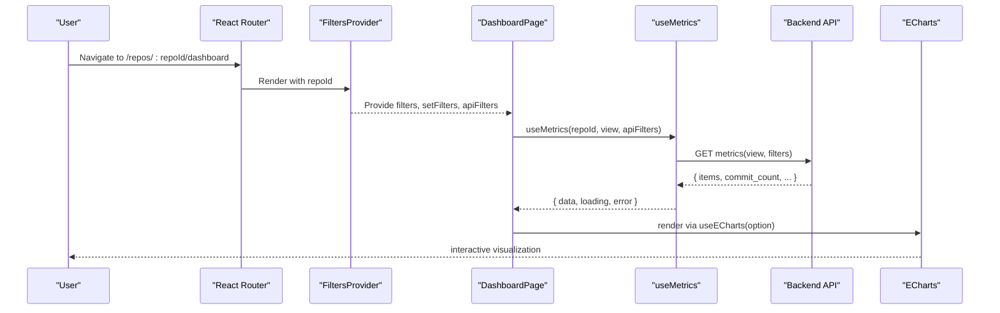
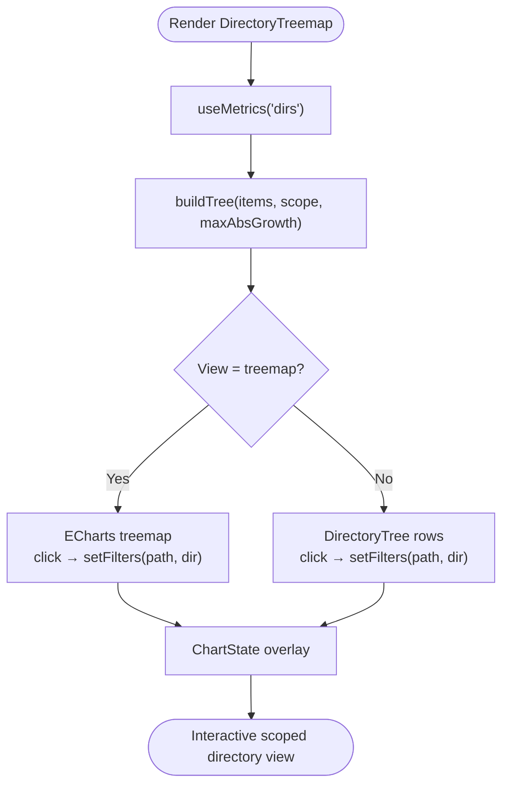
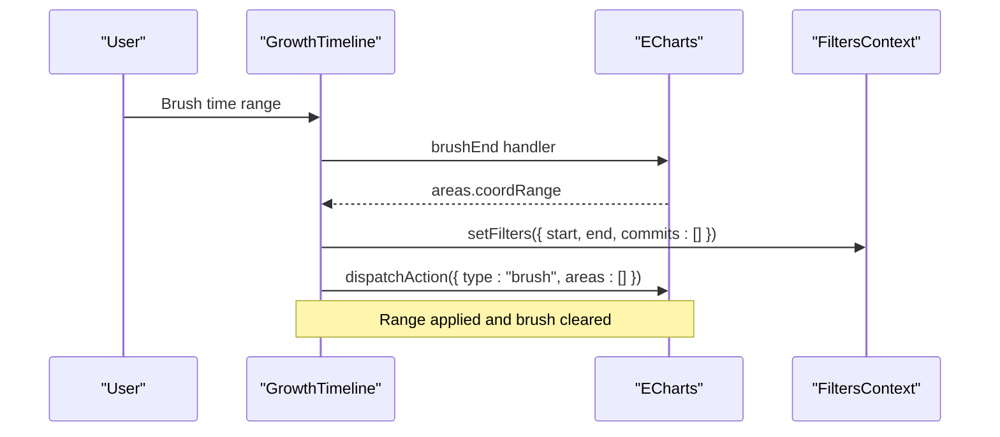
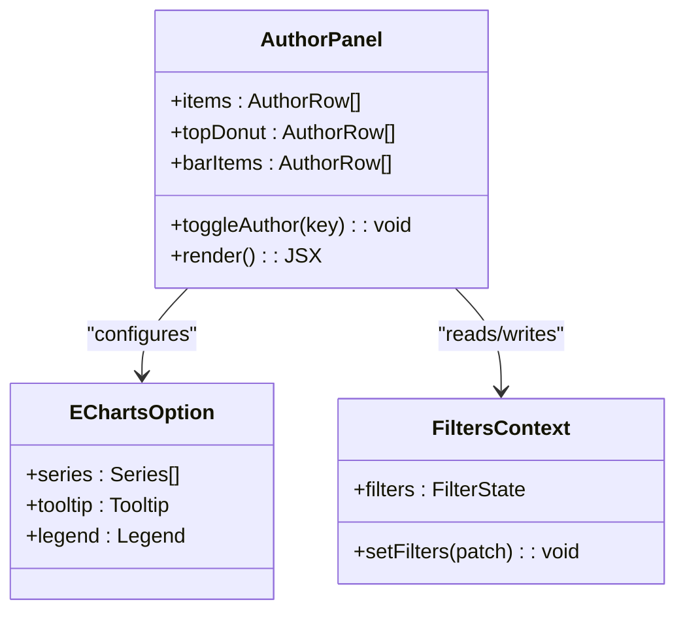
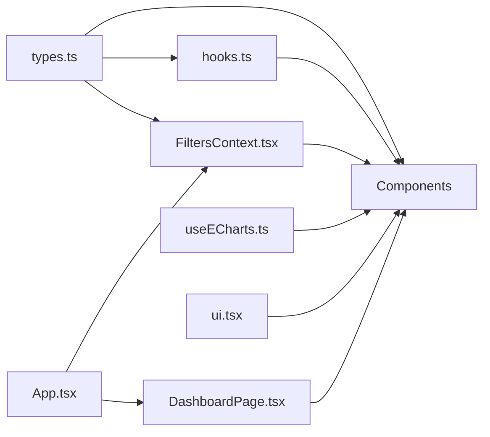

# Component System

<cite>
**Referenced Files in This Document**
- [App.tsx](file://frontend/src/App.tsx)
- [DashboardPage.tsx](file://frontend/src/pages/DashboardPage.tsx)
- [FiltersContext.tsx](file://frontend/src/state/FiltersContext.tsx)
- [hooks.ts](file://frontend/src/lib/hooks.ts)
- [useECharts.ts](file://frontend/src/lib/useECharts.ts)
- [types.ts](file://frontend/src/types.ts)
- [ui.tsx](file://frontend/src/components/ui.tsx)
- [DirectoryTreemap.tsx](file://frontend/src/components/DirectoryTreemap.tsx)
- [DirectoryTree.tsx](file://frontend/src/components/DirectoryTree.tsx)
- [GrowthTimeline.tsx](file://frontend/src/components/GrowthTimeline.tsx)
- [AuthorPanel.tsx](file://frontend/src/components/AuthorPanel.tsx)
</cite>

## Table of Contents
1. [Introduction](#introduction)
2. [Project Structure](#project-structure)
3. [Core Components](#core-components)
4. [Architecture Overview](#architecture-overview)
5. [Detailed Component Analysis](#detailed-component-analysis)
6. [Dependency Analysis](#dependency-analysis)
7. [Performance Considerations](#performance-considerations)
8. [Troubleshooting Guide](#troubleshooting-guide)
9. [Conclusion](#conclusion)

## Introduction
This document explains the React component system architecture for the frontend dashboard. It covers:
- The separation between presentational primitives and container-like page components
- Shared state management through a URL-synced filter context
- Data fetching patterns and chart integration
- Reusable UI primitives and their customization options
- Lifecycle, event handling, and state lifting strategies
- Detailed analysis of complex components: DirectoryTreemap, GrowthTimeline, and AuthorPanel

The goal is to make the codebase understandable for both new contributors and maintainers while providing actionable guidance on extending or customizing components.

## Project Structure
The frontend is organized by feature and layer:
- `components/` contains reusable UI components and presentational primitives
- `pages/` contains route-level pages that compose components
- `state/` provides global state via React Context (filters and toast notifications)
- `lib/` holds shared hooks, utilities, and ECharts bindings
- `types.ts` defines shared API types used across components

**Diagram sources**
- [App.tsx:10-31](file://frontend/src/App.tsx#L10-L31)
- [DashboardPage.tsx:17-95](file://frontend/src/pages/DashboardPage.tsx#L17-L95)
- [FiltersContext.tsx:70-112](file://frontend/src/state/FiltersContext.tsx#L70-L112)
- [DirectoryTreemap.tsx:58-197](file://frontend/src/components/DirectoryTreemap.tsx#L58-L197)
- [GrowthTimeline.tsx:14-173](file://frontend/src/components/GrowthTimeline.tsx#L14-L173)
- [AuthorPanel.tsx:13-198](file://frontend/src/components/AuthorPanel.tsx#L13-L198)
- [DirectoryTree.tsx:7-54](file://frontend/src/components/DirectoryTree.tsx#L7-L54)
- [ui.tsx:36-64](file://frontend/src/components/ui.tsx#L36-L64)
- [useECharts.ts:9-53](file://frontend/src/lib/useECharts.ts#L9-L53)
- [hooks.ts:53-99](file://frontend/src/lib/hooks.ts#L53-L99)

**Section sources**
- [App.tsx:1-38](file://frontend/src/App.tsx#L1-L38)
- [DashboardPage.tsx:1-95](file://frontend/src/pages/DashboardPage.tsx#L1-L95)

## Core Components
This section outlines the main building blocks and responsibilities:

- FiltersContext
  - Centralized, URL-synced filter state
  - Provides repoId, filters, mode ("range" | "manual"), setFilters, reset, and apiFilters
  - Serializes/deserializes query parameters for shareable links

- Data Fetching Hooks
  - useRepo: polls repository status until ready or error
  - useMetrics: SWR-style metrics fetch with debounced filters and stale data retention
  - useAuthors: fetches author list with reload capability

- ECharts Binding
  - useECharts: lazy initialization, resize observation, option diffing, and event wiring

- Presentational Primitives
  - StatusBadge, Progress, Empty, ErrorNote, Loading, ChartState
  - ChartState composes loading/error/empty overlays without detaching chart canvases

- Page Composition
  - DashboardPage composes FilterBar, SummaryCards, GrowthTimeline, DirectoryTreemap, AuthorPanel, FileMetricsTable, CommitSetTable

**Section sources**
- [FiltersContext.tsx:14-118](file://frontend/src/state/FiltersContext.tsx#L14-L118)
- [hooks.ts:13-124](file://frontend/src/lib/hooks.ts#L13-L124)
- [useECharts.ts:9-53](file://frontend/src/lib/useECharts.ts#L9-L53)
- [ui.tsx:5-64](file://frontend/src/components/ui.tsx#L5-L64)
- [DashboardPage.tsx:17-95](file://frontend/src/pages/DashboardPage.tsx#L17-L95)

## Architecture Overview
The application follows a clear separation of concerns:
- Routing and providers live at the app shell level
- Pages orchestrate domain-specific components
- Components consume shared state via context and fetch data via hooks
- Charts are rendered through a stable ECharts binding hook

**Diagram sources**
- [App.tsx:10-31](file://frontend/src/App.tsx#L10-L31)
- [FiltersContext.tsx:70-112](file://frontend/src/state/FiltersContext.tsx#L70-L112)
- [DashboardPage.tsx:17-95](file://frontend/src/pages/DashboardPage.tsx#L17-L95)
- [hooks.ts:53-99](file://frontend/src/lib/hooks.ts#L53-L99)
- [useECharts.ts:9-53](file://frontend/src/lib/useECharts.ts#L9-L53)

## Detailed Component Analysis

### Presentational Primitives (ui.tsx)
Shared UI primitives provide consistent visual states and small reusable widgets:
- StatusBadge: displays repository ingestion status with semantic classes
- Progress: renders a progress bar from a normalized 0..1 value
- Empty: generic empty-state wrapper
- ErrorNote: error message display
- Loading: spinner with optional label
- ChartState: orchestrates overlay states for charts while keeping children mounted to avoid expensive reinitialization

Customization options:
- StatusBadge accepts RepoStatus
- Progress accepts numeric value
- Loading accepts optional label
- ChartState accepts loading, error, empty flags, optional emptyMessage, and children

Complexity considerations:
- ChartState avoids detaching chart DOM nodes; this prevents costly re-init when toggling overlays

**Section sources**
- [ui.tsx:5-64](file://frontend/src/components/ui.tsx#L5-L64)

### DirectoryTreemap
Responsibilities:
- Fetch directory metrics and build a treemap/tree view
- Allow scoping metrics to a selected directory
- Switch between treemap and tree views
- Integrate with ECharts for treemap rendering and with DirectoryTree for list view

Key behaviors:
- Builds an internal tree structure from flat items, sorts by churn, and colors by growth
- Uses useECharts for treemap interaction; click events update filters to scope by directory
- Uses DirectoryTree for non-treemap view; row clicks also scope by directory
- Wraps content with ChartState for loading/error/empty states

Props and interactions:
- No external props; reads repoId, filters, setFilters from FiltersContext
- Events:
  - Treemap cell click → setFilters({ path, type: "dir" })
  - Tree row click → setFilters({ path, type: "dir" })
  - Up button → navigate to parent directory

Data flow:
- useMetrics("dirs") returns DirsResponse
- buildTree transforms items into TreeNode hierarchy
- ECharts option configures treemap series and tooltip formatting

**Diagram sources**
- [DirectoryTreemap.tsx:26-56](file://frontend/src/components/DirectoryTreemap.tsx#L26-L56)
- [DirectoryTreemap.tsx:58-197](file://frontend/src/components/DirectoryTreemap.tsx#L58-L197)
- [DirectoryTree.tsx:7-54](file://frontend/src/components/DirectoryTree.tsx#L7-L54)
- [ui.tsx:36-64](file://frontend/src/components/ui.tsx#L36-L64)

**Section sources**
- [DirectoryTreemap.tsx:1-198](file://frontend/src/components/DirectoryTreemap.tsx#L1-L198)
- [DirectoryTree.tsx:1-55](file://frontend/src/components/DirectoryTree.tsx#L1-L55)
- [types.ts:113-121](file://frontend/src/types.ts#L113-L121)

### GrowthTimeline
Responsibilities:
- Visualize added/removed/growth over time buckets
- Allow brushing a time range to set the dashboard’s H_i,j filter
- Clear the brush and range filter

Key behaviors:
- Computes ECharts option with line series for added, removed, growth
- Configures toolbox brush and dataZoom
- On brushEnd, computes bucket indices and updates filters.start/end
- Clears brush area after setting filters

Events:
- Brush end → setFilters({ start, end, commits: [] })
- Clear range button → setFilters({ start: "", end: "" }) and clears brush

Integration:
- Uses useMetrics("timeseries") for timeseries data
- Wraps chart with ChartState

**Diagram sources**
- [GrowthTimeline.tsx:25-116](file://frontend/src/components/GrowthTimeline.tsx#L25-L116)
- [GrowthTimeline.tsx:118-143](file://frontend/src/components/GrowthTimeline.tsx#L118-L143)
- [FiltersContext.tsx:93-104](file://frontend/src/state/FiltersContext.tsx#L93-L104)

**Section sources**
- [GrowthTimeline.tsx:1-174](file://frontend/src/components/GrowthTimeline.tsx#L1-L174)
- [types.ts:138-153](file://frontend/src/types.ts#L138-L153)

### AuthorPanel
Responsibilities:
- Show ownership distribution via a donut chart
- Show top authors by modifications via a horizontal bar chart
- Toggle author selection to filter metrics

Key behaviors:
- Aggregates top authors and groups remaining into “Other”
- Renders two ECharts instances: pie (donut) and bar
- Click handlers toggle author keys in filters.authors
- Provides a clear button to remove all author filters

Events:
- Donut/bar click → toggle author key in filters.authors
- Clear button → setFilters({ authors: [] })

Integration:
- Uses useMetrics("authors") for author metrics
- Wraps charts with ChartState

**Diagram sources**
- [AuthorPanel.tsx:21-38](file://frontend/src/components/AuthorPanel.tsx#L21-L38)
- [AuthorPanel.tsx:42-87](file://frontend/src/components/AuthorPanel.tsx#L42-L87)
- [AuthorPanel.tsx:89-146](file://frontend/src/components/AuthorPanel.tsx#L89-L146)
- [AuthorPanel.tsx:148-168](file://frontend/src/components/AuthorPanel.tsx#L148-L168)
- [FiltersContext.tsx:14-22](file://frontend/src/state/FiltersContext.tsx#L14-L22)

**Section sources**
- [AuthorPanel.tsx:1-199](file://frontend/src/components/AuthorPanel.tsx#L1-L199)
- [types.ts:123-136](file://frontend/src/types.ts#L123-L136)

### DirectoryTree
Responsibilities:
- Display directories in depth order with indentation relative to current scope
- Highlight current path and allow scoping by clicking rows

Props:
- items: DirRow[]
- scope: string (current directory scope)
- currentPath: string (highlighted path)
- onScope: (path: string) => void

Behavior:
- Calculates relative depth for indentation
- Formats labels using relPathName
- Handles click to scope unless already current

**Section sources**
- [DirectoryTree.tsx:1-55](file://frontend/src/components/DirectoryTree.tsx#L1-L55)
- [types.ts:113-116](file://frontend/src/types.ts#L113-L116)

### DashboardPage
Responsibilities:
- Orchestrate repository gate, filter bar, summary cards, timeline, directory treemap, author panel, file metrics table, and commit set table
- Handle repository loading and error states

Integration:
- Reads repoId and filters from FiltersContext
- Uses useRepo to load repository info
- Composes child components within conditional rendering based on repository status

**Section sources**
- [DashboardPage.tsx:1-95](file://frontend/src/pages/DashboardPage.tsx#L1-L95)

## Dependency Analysis
High-level dependencies among core modules:

**Diagram sources**
- [types.ts:1-172](file://frontend/src/types.ts#L1-L172)
- [hooks.ts:1-142](file://frontend/src/lib/hooks.ts#L1-L142)
- [FiltersContext.tsx:1-119](file://frontend/src/state/FiltersContext.tsx#L1-L119)
- [useECharts.ts:1-55](file://frontend/src/lib/useECharts.ts#L1-L55)
- [ui.tsx:1-65](file://frontend/src/components/ui.tsx#L1-L65)
- [App.tsx:1-38](file://frontend/src/App.tsx#L1-L38)
- [DashboardPage.tsx:1-95](file://frontend/src/pages/DashboardPage.tsx#L1-L95)

Coupling and cohesion:
- Components depend on FiltersContext for shared state and on hooks for data fetching
- ECharts binding is isolated in useECharts and consumed by multiple chart components
- Presentational primitives in ui.tsx are reused across components for consistent UX

Potential circular dependencies:
- None observed; imports are unidirectional from pages/components to lib/state/types

External dependencies:
- ECharts library for chart rendering
- React Router for navigation and search params

**Section sources**
- [types.ts:1-172](file://frontend/src/types.ts#L1-L172)
- [hooks.ts:1-142](file://frontend/src/lib/hooks.ts#L1-L142)
- [FiltersContext.tsx:1-119](file://frontend/src/state/FiltersContext.tsx#L1-L119)
- [useECharts.ts:1-55](file://frontend/src/lib/useECharts.ts#L1-L55)
- [ui.tsx:1-65](file://frontend/src/components/ui.tsx#L1-L65)
- [App.tsx:1-38](file://frontend/src/App.tsx#L1-L38)
- [DashboardPage.tsx:1-95](file://frontend/src/pages/DashboardPage.tsx#L1-L95)

## Performance Considerations
- Debounced metric queries: useMetrics debounces filter changes to reduce network requests and prevent chart flashing
- Stale data retention: useMetrics keeps previous data while new queries are in flight
- Chart instance reuse: useECharts disposes and reinitializes only when necessary; ResizeObserver ensures correct sizing
- ChartState overlay strategy: keeps chart children mounted to avoid expensive re-initialization when toggling overlays
- Sorting and aggregation: DirectoryTreemap sorts children by churn; AuthorPanel aggregates “Other” group to limit legend size

[No sources needed since this section provides general guidance]

## Troubleshooting Guide
Common issues and resolutions:
- Missing FiltersProvider
  - Symptom: useFilters throws an error
  - Resolution: Ensure FiltersProvider wraps the route/component tree
- Repository not found or still ingesting
  - Symptom: Dashboard shows loading or repository status messages
  - Resolution: Verify repository ingestion status and wait until ready
- Chart not updating
  - Symptom: ECharts does not reflect new options
  - Resolution: Check that useECharts receives updated option objects and that elRef is attached to a mounted div
- Time range not applying
  - Symptom: Brushing timeline does not change filters
  - Resolution: Confirm brushEnd handler sets filters.start/end and clears brush action

**Section sources**
- [FiltersContext.tsx:114-118](file://frontend/src/state/FiltersContext.tsx#L114-L118)
- [DashboardPage.tsx:17-34](file://frontend/src/pages/DashboardPage.tsx#L17-L34)
- [useECharts.ts:16-37](file://frontend/src/lib/useECharts.ts#L16-L37)
- [GrowthTimeline.tsx:118-143](file://frontend/src/components/GrowthTimeline.tsx#L118-L143)

## Conclusion
The component system cleanly separates presentation from state and data fetching. FiltersContext centralizes URL-synced state, hooks encapsulate data logic, and useECharts abstracts chart lifecycle. Complex components like DirectoryTreemap, GrowthTimeline, and AuthorPanel demonstrate robust event handling, state lifting via setFilters, and consistent chart state management through ChartState. This architecture supports scalability, testability, and maintainability while providing a smooth user experience for exploring repository metrics.

[No sources needed since this section summarizes without analyzing specific files]