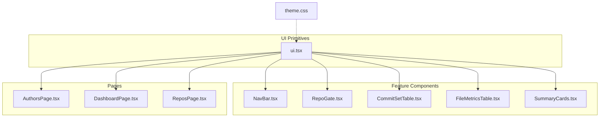
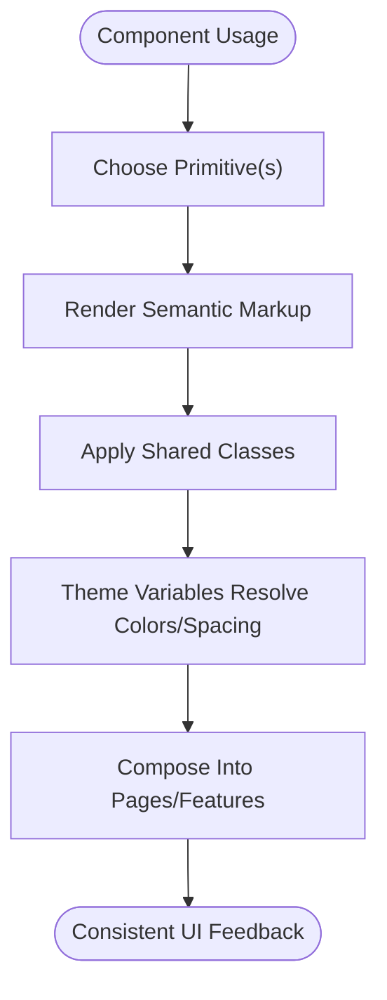
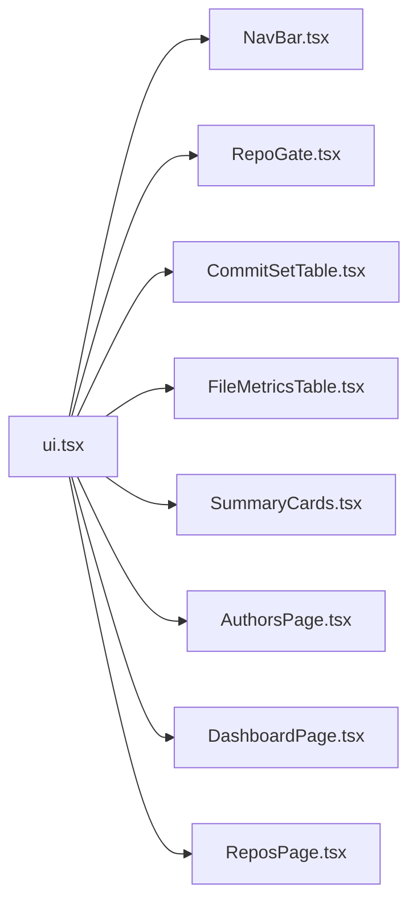

# UI Primitives

<cite>
**Referenced Files in This Document**   
- [ui.tsx](file://frontend/src/components/ui.tsx)
- [theme.css](file://frontend/src/theme.css)
- [NavBar.tsx](file://frontend/src/components/NavBar.tsx)
- [RepoGate.tsx](file://frontend/src/components/RepoGate.tsx)
- [CommitSetTable.tsx](file://frontend/src/components/CommitSetTable.tsx)
- [FileMetricsTable.tsx](file://frontend/src/components/FileMetricsTable.tsx)
- [SummaryCards.tsx](file://frontend/src/components/SummaryCards.tsx)
- [AuthorsPage.tsx](file://frontend/src/pages/AuthorsPage.tsx)
- [DashboardPage.tsx](file://frontend/src/pages/DashboardPage.tsx)
- [ReposPage.tsx](file://frontend/src/pages/ReposPage.tsx)
</cite>

## Table of Contents
1. [Introduction](#introduction)
2. [Project Structure](#project-structure)
3. [Core Components](#core-components)
4. [Architecture Overview](#architecture-overview)
5. [Detailed Component Analysis](#detailed-component-analysis)
6. [Dependency Analysis](#dependency-analysis)
7. [Performance Considerations](#performance-considerations)
8. [Troubleshooting Guide](#troubleshooting-guide)
9. [Conclusion](#conclusion)

## Introduction
This document describes the core UI primitive components defined in `ui.tsx`. These primitives provide consistent, reusable building blocks for status indicators, progress feedback, empty/error states, and chart state management across the application. The design system is driven by CSS variables in `theme.css`, which define colors, spacing, typography, and component styles.

The primitives emphasize:
- Consistent visual language through shared classes and theme variables
- Clear user feedback with loading, error, and empty states
- Lightweight composition patterns that keep pages and feature components simple
- Accessibility-friendly semantics such as titles and semantic containers

## Project Structure
The UI primitives live under `frontend/src/components/ui.tsx` and are consumed by feature components and pages throughout the frontend. Their appearance is controlled by global styles in `frontend/src/theme.css`.

**Diagram sources**
- [ui.tsx:1-65](file://frontend/src/components/ui.tsx#L1-L65)
- [theme.css:1-326](file://frontend/src/theme.css#L1-L326)
- [NavBar.tsx:1-20](file://frontend/src/components/NavBar.tsx#L1-L20)
- [RepoGate.tsx:1-20](file://frontend/src/components/RepoGate.tsx#L1-L20)
- [CommitSetTable.tsx:1-20](file://frontend/src/components/CommitSetTable.tsx#L1-L20)
- [FileMetricsTable.tsx:1-20](file://frontend/src/components/FileMetricsTable.tsx#L1-L20)
- [SummaryCards.tsx:1-20](file://frontend/src/components/SummaryCards.tsx#L1-L20)
- [AuthorsPage.tsx:1-20](file://frontend/src/pages/AuthorsPage.tsx#L1-L20)
- [DashboardPage.tsx:1-20](file://frontend/src/pages/DashboardPage.tsx#L1-L20)
- [ReposPage.tsx:1-20](file://frontend/src/pages/ReposPage.tsx#L1-L20)

**Section sources**
- [ui.tsx:1-65](file://frontend/src/components/ui.tsx#L1-L65)
- [theme.css:1-326](file://frontend/src/theme.css#L1-L326)

## Core Components
The following primitives are exported from `ui.tsx`:

- StatusBadge
- Progress
- Empty
- ErrorNote
- Loading
- ChartState

Each component is small, focused on presentation, and styled via shared CSS classes. They compose well together to build richer UIs without duplicating styles or logic.

**Section sources**
- [ui.tsx:5-64](file://frontend/src/components/ui.tsx#L5-L64)

## Architecture Overview
The primitives follow a layered approach:
- Presentation layer: React components render semantic markup and apply utility classes.
- Styling layer: Global CSS variables and class rules define colors, spacing, and behavior.
- Composition layer: Feature components and pages combine primitives to express common states like loading, error, and empty data.

[No sources needed since this diagram shows conceptual workflow, not actual code structure]

## Detailed Component Analysis

### StatusBadge
Purpose:
- Displays a compact status indicator using a badge style.
- Maps a string status value to one of three semantic color variants: positive, negative, or warning.

Props:
- status: Required. One of the repository status values used by the app.

Styling:
- Uses the `.badge` base class plus a variant class (`pos`, `neg`, or `warn`) based on the status value.
- Colors and backgrounds are provided by theme variables for consistency.

Accessibility:
- Renders a `` with text content representing the status.
- For richer accessibility, consider adding an `aria-label` describing the meaning of the status when used in context.

Usage examples:
- Used in navigation to show repository status at a glance.
- Used in repository gate to reflect current repo health.

Customization:
- Override badge colors by adjusting the relevant CSS variables for positive, negative, and warning themes.
- Adjust padding or font size by extending the `.badge` class if needed.

**Section sources**
- [ui.tsx:5-9](file://frontend/src/components/ui.tsx#L5-L9)
- [theme.css:136-145](file://frontend/src/theme.css#L136-L145)
- [NavBar.tsx:1-20](file://frontend/src/components/NavBar.tsx#L1-L20)
- [RepoGate.tsx:1-20](file://frontend/src/components/RepoGate.tsx#L1-L20)

### Progress
Purpose:
- Visualizes a numeric progress value between 0 and 1.
- Normalizes input to ensure safe rendering.

Props:
- value: Required. Numeric percentage expressed as a fraction (0–1). Non-finite values default to 0.

Styling:
- Uses `.progress` container and an inner `` whose width reflects the normalized percentage.
- Gradient fill and rounded corners are applied via CSS.

Accessibility:
- Adds a `title` attribute showing the computed percentage for screen readers and tooltips.

Usage examples:
- Shows ingestion or analysis progress in repository setup flows.

Customization:
- Change gradient colors by overriding the progress bar background in CSS.
- Adjust height or border radius by modifying the `.progress` class.

**Section sources**
- [ui.tsx:11-18](file://frontend/src/components/ui.tsx#L11-L18)
- [theme.css:158-164](file://frontend/src/theme.css#L158-L164)
- [RepoGate.tsx:1-20](file://frontend/src/components/RepoGate.tsx#L1-L20)

### Empty
Purpose:
- Provides a centered placeholder for “no data” scenarios.

Props:
- children: Optional. Any content to display inside the empty state container.

Styling:
- Uses the `.empty` class for centering, muted text, and padding.

Accessibility:
- Semantically represents a message area; pair with descriptive text for clarity.

Usage examples:
- Shown when filters return no results or datasets are unavailable.

Customization:
- Customize text color, padding, or alignment by extending `.empty`.

**Section sources**
- [ui.tsx:20-22](file://frontend/src/components/ui.tsx#L20-L22)
- [theme.css:310-313](file://frontend/src/theme.css#L310-L313)
- [CommitSetTable.tsx:1-20](file://frontend/src/components/CommitSetTable.tsx#L1-L20)
- [FileMetricsTable.tsx:1-20](file://frontend/src/components/FileMetricsTable.tsx#L1-L20)
- [AuthorsPage.tsx:1-20](file://frontend/src/pages/AuthorsPage.tsx#L1-L20)
- [ReposPage.tsx:1-20](file://frontend/src/pages/ReposPage.tsx#L1-L20)

### ErrorNote
Purpose:
- Displays an error message with a distinct visual style.

Props:
- children: Optional. Error message content.

Styling:
- Uses the `.error-note` class with a soft red background and contrasting text.

Accessibility:
- Use as a container for error messages; ensure surrounding context explains the error.

Usage examples:
- Shown when API calls fail or invalid data is encountered.

Customization:
- Adjust background and border colors by overriding the error note styles or related CSS variables.

**Section sources**
- [ui.tsx:24-26](file://frontend/src/components/ui.tsx#L24-L26)
- [theme.css:314-317](file://frontend/src/theme.css#L314-L317)
- [CommitSetTable.tsx:1-20](file://frontend/src/components/CommitSetTable.tsx#L1-L20)
- [FileMetricsTable.tsx:1-20](file://frontend/src/components/FileMetricsTable.tsx#L1-L20)
- [SummaryCards.tsx:1-20](file://frontend/src/components/SummaryCards.tsx#L1-L20)
- [DashboardPage.tsx:1-20](file://frontend/src/pages/DashboardPage.tsx#L1-L20)
- [ReposPage.tsx:1-20](file://frontend/src/pages/ReposPage.tsx#L1-L20)

### Loading
Purpose:
- Indicates asynchronous work in progress with a spinner and optional label.

Props:
- label: Optional. Text displayed next to the spinner. Defaults to a localized loading message.

Styling:
- Uses the `.empty` container for layout and a `.spinner` element for animation.

Accessibility:
- The spinner is decorative; include meaningful text in the label so users understand the action in progress.

Usage examples:
- Shown while fetching metrics or analyzing repositories.

Customization:
- Modify spinner color or animation speed by updating the spinner keyframes and colors in CSS.

**Section sources**
- [ui.tsx:28-34](file://frontend/src/components/ui.tsx#L28-L34)
- [theme.css:166-171](file://frontend/src/theme.css#L166-L171)
- [CommitSetTable.tsx:1-20](file://frontend/src/components/CommitSetTable.tsx#L1-L20)
- [FileMetricsTable.tsx:1-20](file://frontend/src/components/FileMetricsTable.tsx#L1-L20)
- [AuthorsPage.tsx:1-20](file://frontend/src/pages/AuthorsPage.tsx#L1-L20)
- [DashboardPage.tsx:1-20](file://frontend/src/pages/DashboardPage.tsx#L1-L20)
- [ReposPage.tsx:1-20](file://frontend/src/pages/ReposPage.tsx#L1-L20)

### ChartState
Purpose:
- Manages overlay states for chart components: loading, error, and empty.
- Ensures the underlying chart remains mounted to avoid expensive re-initialization.

Props:
- loading: Boolean indicating whether data is being fetched.
- error: String error message or null.
- empty: Boolean indicating whether data exists but is empty.
- emptyMessage: Optional override for the default empty message.
- children: The chart component itself, always rendered underneath overlays.

Behavior:
- If there is an error, an error overlay is shown.
- If loading and empty, a loading overlay is shown.
- If only empty, an empty overlay is shown with a default or custom message.
- Otherwise, the chart renders normally without overlays.

Accessibility:
- Overlays communicate state clearly; ensure chart components themselves expose appropriate roles and labels.

Usage examples:
- Wraps ECharts-based charts to handle lifecycle states consistently.

Customization:
- Adjust overlay background opacity, padding, or z-index by modifying `.chart-state` and `.chart-overlay` styles.

**Section sources**
- [ui.tsx:36-64](file://frontend/src/components/ui.tsx#L36-L64)
- [theme.css:247-252](file://frontend/src/theme.css#L247-L252)
- [AuthorPanel.tsx:1-20](file://frontend/src/components/AuthorPanel.tsx#L1-L20)
- [DirectoryTreemap.tsx:1-20](file://frontend/src/components/DirectoryTreemap.tsx#L1-L20)
- [GrowthTimeline.tsx:1-20](file://frontend/src/components/GrowthTimeline.tsx#L1-L20)

## Dependency Analysis
The primitives have minimal internal dependencies and rely on shared CSS classes and theme variables. Consumers import them directly where needed.

**Diagram sources**
- [ui.tsx:1-65](file://frontend/src/components/ui.tsx#L1-L65)
- [NavBar.tsx:1-20](file://frontend/src/components/NavBar.tsx#L1-L20)
- [RepoGate.tsx:1-20](file://frontend/src/components/RepoGate.tsx#L1-L20)
- [CommitSetTable.tsx:1-20](file://frontend/src/components/CommitSetTable.tsx#L1-L20)
- [FileMetricsTable.tsx:1-20](file://frontend/src/components/FileMetricsTable.tsx#L1-L20)
- [SummaryCards.tsx:1-20](file://frontend/src/components/SummaryCards.tsx#L1-L20)
- [AuthorsPage.tsx:1-20](file://frontend/src/pages/AuthorsPage.tsx#L1-L20)
- [DashboardPage.tsx:1-20](file://frontend/src/pages/DashboardPage.tsx#L1-L20)
- [ReposPage.tsx:1-20](file://frontend/src/pages/ReposPage.tsx#L1-L20)

**Section sources**
- [ui.tsx:1-65](file://frontend/src/components/ui.tsx#L1-L65)

## Performance Considerations
- ChartState keeps the chart component mounted beneath overlays to avoid costly re-initialization when toggling states.
- Progress uses a simple inline width style for smooth transitions without heavy computations.
- Primitives are lightweight and avoid unnecessary re-renders by keeping props minimal and stateless where possible.

[No sources needed since this section provides general guidance]

## Troubleshooting Guide
Common issues and resolutions:
- Progress appears incorrect: Ensure the value prop is a finite number between 0 and 1. Non-finite values default to 0.
- Empty or error overlays not appearing: Verify that the correct combination of `loading`, `error`, and `empty` props is passed to ChartState.
- Spinner not visible: Confirm that the `.spinner` class is present and that animations are not blocked by CSS overrides.
- Badge colors mismatched: Check that the status value matches expected variants and that theme variables for positive, negative, and warning are correctly set.

**Section sources**
- [ui.tsx:11-18](file://frontend/src/components/ui.tsx#L11-L18)
- [ui.tsx:36-64](file://frontend/src/components/ui.tsx#L36-L64)
- [theme.css:166-171](file://frontend/src/theme.css#L166-L171)
- [theme.css:247-252](file://frontend/src/theme.css#L247-L252)

## Conclusion
The UI primitives in `ui.tsx` provide a cohesive foundation for consistent, accessible, and responsive user feedback across the application. By leveraging shared CSS classes and theme variables, they maintain visual harmony and simplify customization. Features and pages can compose these primitives to deliver clear states for loading, errors, and empty data, while ChartState ensures efficient chart rendering during state transitions.

[No sources needed since this section summarizes without analyzing specific files]