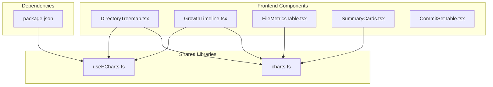
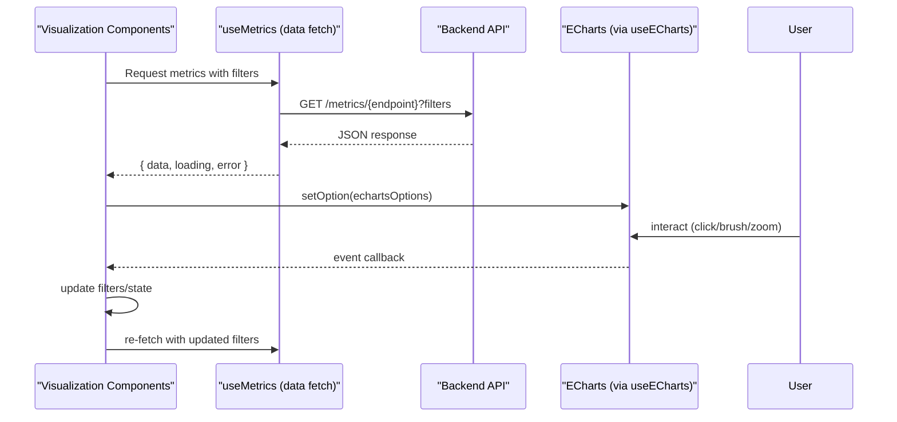
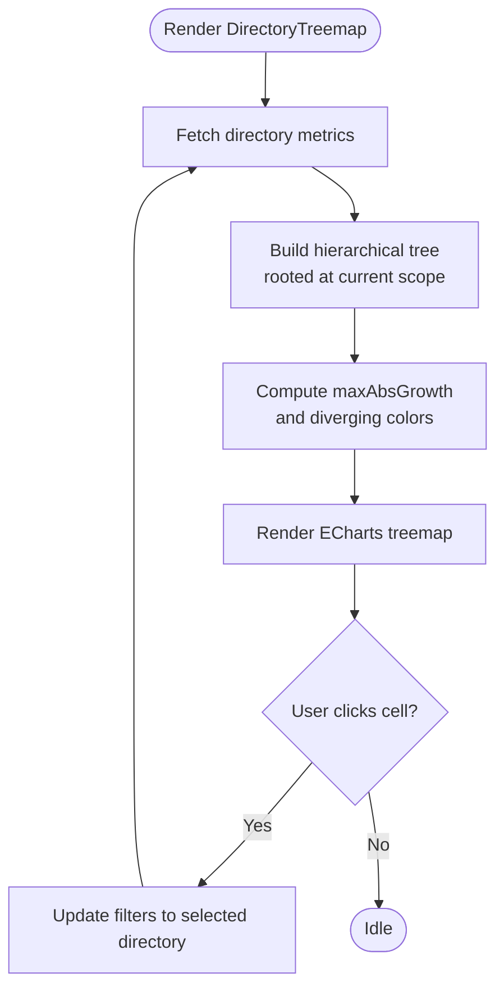
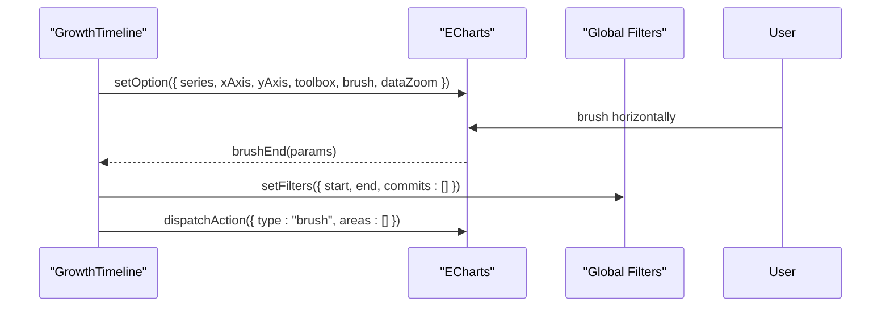
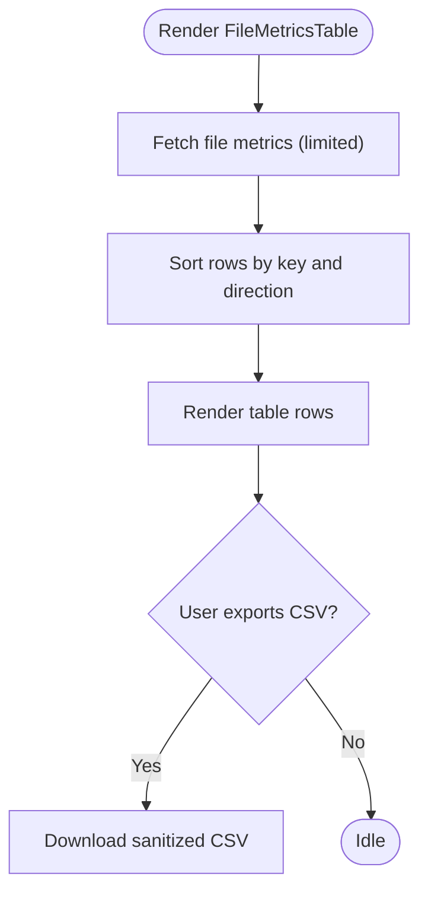
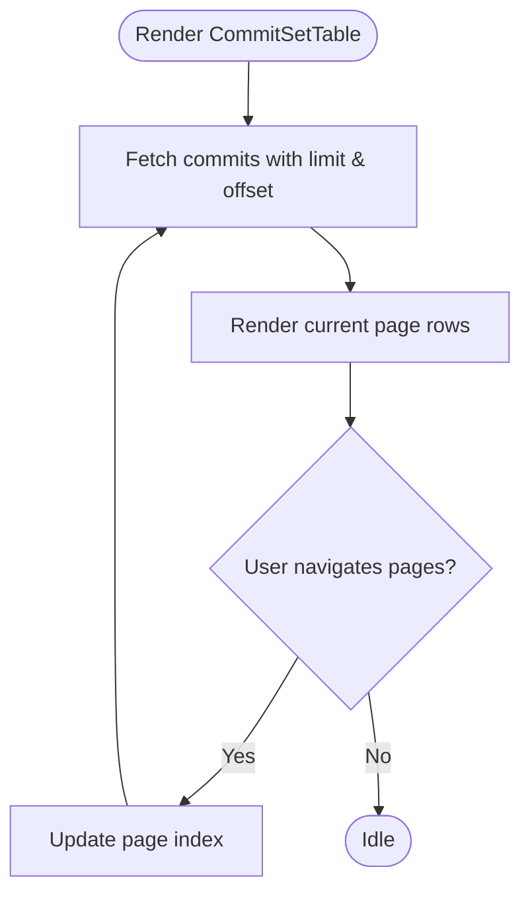
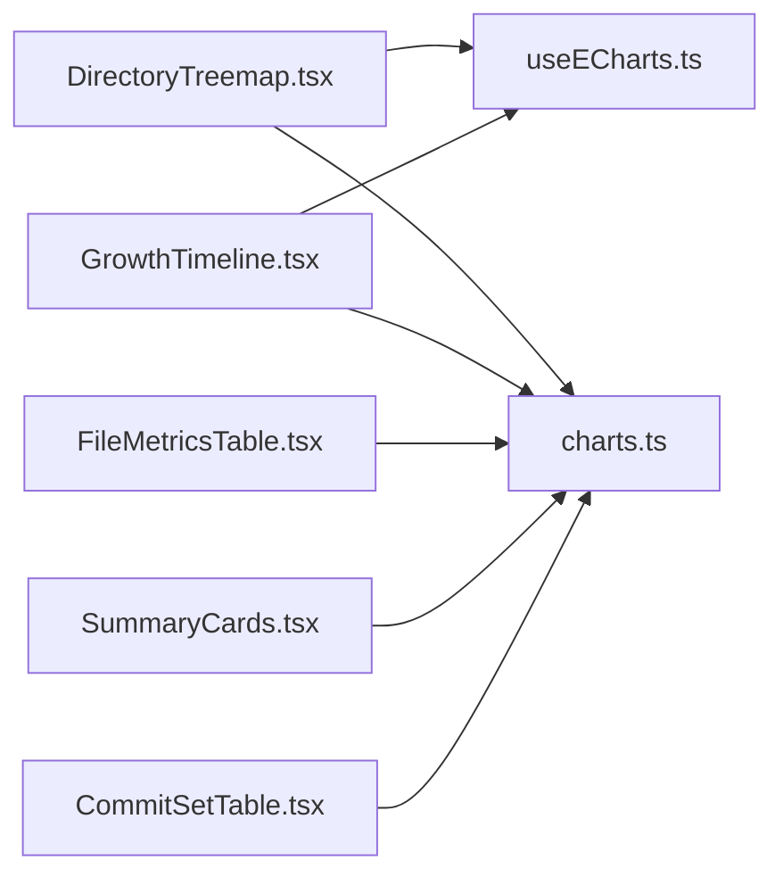

# Visualization Components

<cite>
**Referenced Files in This Document**
- [DirectoryTreemap.tsx](file://frontend/src/components/DirectoryTreemap.tsx)
- [GrowthTimeline.tsx](file://frontend/src/components/GrowthTimeline.tsx)
- [FileMetricsTable.tsx](file://frontend/src/components/FileMetricsTable.tsx)
- [SummaryCards.tsx](file://frontend/src/components/SummaryCards.tsx)
- [CommitSetTable.tsx](file://frontend/src/components/CommitSetTable.tsx)
- [useECharts.ts](file://frontend/src/lib/useECharts.ts)
- [charts.ts](file://frontend/src/lib/charts.ts)
- [package.json](file://frontend/package.json)
</cite>

## Table of Contents
1. [Introduction](#introduction)
2. [Project Structure](#project-structure)
3. [Core Components](#core-components)
4. [Architecture Overview](#architecture-overview)
5. [Detailed Component Analysis](#detailed-component-analysis)
6. [Dependency Analysis](#dependency-analysis)
7. [Performance Considerations](#performance-considerations)
8. [Troubleshooting Guide](#troubleshooting-guide)
9. [Conclusion](#conclusion)

## Introduction
This document explains the visualization components that render complex data representations for repository metrics. It covers:
- DirectoryTreemap: an interactive treemap and tree view for directory-level churn and growth, integrated with ECharts.
- GrowthTimeline: a time-series chart for added, removed, and growth lines over time buckets, with brush-based filtering.
- FileMetricsTable: a sortable, exportable table of per-file metrics.
- SummaryCards: key metric cards summarizing commit-set statistics.
- CommitSetTable: a paged list of commits with optional scope-only filtering.

It also documents data transformation pipelines, chart configuration options, interactivity features such as zooming and brushing, performance optimizations for large datasets, and examples for customization and user interaction handling.

## Project Structure
The visualization layer lives under the frontend React application. The relevant files are:
- Components: DirectoryTreemap, GrowthTimeline, FileMetricsTable, SummaryCards, CommitSetTable.
- Library helpers: useECharts (ECharts React binding), charts (shared palette and helpers).
- Dependencies: ECharts is declared in package.json.

**Diagram sources**
- [DirectoryTreemap.tsx:1-198](file://frontend/src/components/DirectoryTreemap.tsx#L1-L198)
- [GrowthTimeline.tsx:1-174](file://frontend/src/components/GrowthTimeline.tsx#L1-L174)
- [FileMetricsTable.tsx:1-152](file://frontend/src/components/FileMetricsTable.tsx#L1-L152)
- [SummaryCards.tsx:1-84](file://frontend/src/components/SummaryCards.tsx#L1-L84)
- [CommitSetTable.tsx:1-130](file://frontend/src/components/CommitSetTable.tsx#L1-L130)
- [useECharts.ts:1-55](file://frontend/src/lib/useECharts.ts#L1-L55)
- [charts.ts:1-47](file://frontend/src/lib/charts.ts#L1-L47)
- [package.json:11-15](file://frontend/package.json#L11-L15)

**Section sources**
- [DirectoryTreemap.tsx:1-198](file://frontend/src/components/DirectoryTreemap.tsx#L1-L198)
- [GrowthTimeline.tsx:1-174](file://frontend/src/components/GrowthTimeline.tsx#L1-L174)
- [FileMetricsTable.tsx:1-152](file://frontend/src/components/FileMetricsTable.tsx#L1-L152)
- [SummaryCards.tsx:1-84](file://frontend/src/components/SummaryCards.tsx#L1-L84)
- [CommitSetTable.tsx:1-130](file://frontend/src/components/CommitSetTable.tsx#L1-L130)
- [useECharts.ts:1-55](file://frontend/src/lib/useECharts.ts#L1-L55)
- [charts.ts:1-47](file://frontend/src/lib/charts.ts#L1-L47)
- [package.json:11-15](file://frontend/package.json#L11-L15)

## Core Components
- DirectoryTreemap renders a treemap where area represents churn and color encodes growth. Clicking a cell scopes metrics to that directory. It also supports a tree view alternative.
- GrowthTimeline renders a line chart of added, removed, and growth over time buckets. Brushing on the x-axis sets a time range filter; internal zoom is enabled via dataZoom.
- FileMetricsTable displays per-file metrics with client-side sorting and CSV export.
- SummaryCards shows seven commit-set metrics plus commit count, with skeleton loading states.
- CommitSetTable lists commits with pagination and an optional “only changed” toggle scoped to the current selection.

Key shared utilities:
- useECharts: lazy ECharts initialization, resize observation, event wiring, and option diffing.
- charts: shared color palette, axis defaults, tooltip styling, and diverging color helper for growth encoding.

**Section sources**
- [DirectoryTreemap.tsx:1-198](file://frontend/src/components/DirectoryTreemap.tsx#L1-L198)
- [GrowthTimeline.tsx:1-174](file://frontend/src/components/GrowthTimeline.tsx#L1-L174)
- [FileMetricsTable.tsx:1-152](file://frontend/src/components/FileMetricsTable.tsx#L1-L152)
- [SummaryCards.tsx:1-84](file://frontend/src/components/SummaryCards.tsx#L1-L84)
- [CommitSetTable.tsx:1-130](file://frontend/src/components/CommitSetTable.tsx#L1-L130)
- [useECharts.ts:1-55](file://frontend/src/lib/useECharts.ts#L1-L55)
- [charts.ts:1-47](file://frontend/src/lib/charts.ts#L1-L47)

## Architecture Overview
The visualization components follow a consistent pattern:
- Data fetching: components call a shared hook to request metrics from the backend API using repo-scoped filters.
- Transformation: components transform raw responses into chart-ready structures or table rows.
- Rendering: components render either ECharts instances (via useECharts) or React tables/cards.
- Interactivity: user actions update global filters (time range, path, type), which propagate back to data requests.

**Diagram sources**
- [DirectoryTreemap.tsx:58-123](file://frontend/src/components/DirectoryTreemap.tsx#L58-L123)
- [GrowthTimeline.tsx:14-135](file://frontend/src/components/GrowthTimeline.tsx#L14-L135)
- [useECharts.ts:9-53](file://frontend/src/lib/useECharts.ts#L9-L53)

## Detailed Component Analysis

### DirectoryTreemap
Purpose:
- Visualize directory structure by churn (area) and growth (color).
- Allow scoping all metrics to a selected directory.
- Provide a fallback tree view when treemap is not applicable.

Data pipeline:
- Fetches directory metrics via a dedicated endpoint.
- Builds a hierarchical tree rooted at the current scope.
- Computes max absolute growth to normalize diverging colors.

Chart configuration highlights:
- Treemap series with disabled animations, custom label style, item borders, and gap width.
- Tooltip formatter showing churn, added/removed, growth, and modifications.
- Click handler updates global filters to scope metrics to the clicked directory.

Interactivity:
- Click-to-scope directories.
- Toggle between treemap and tree views.
- “Up” navigation to parent directory.

Customization examples:
- Adjust visibleMin to control minimum node size.
- Modify label.overflow or fontSize for dense directories.
- Change itemStyle.borderColor or borderWidth for visual emphasis.

**Diagram sources**
- [DirectoryTreemap.tsx:26-56](file://frontend/src/components/DirectoryTreemap.tsx#L26-L56)
- [DirectoryTreemap.tsx:76-123](file://frontend/src/components/DirectoryTreemap.tsx#L76-L123)

**Section sources**
- [DirectoryTreemap.tsx:1-198](file://frontend/src/components/DirectoryTreemap.tsx#L1-L198)
- [charts.ts:35-46](file://frontend/src/lib/charts.ts#L35-L46)

### GrowthTimeline
Purpose:
- Show time-series metrics (added, removed, growth) across time buckets.
- Enable users to select a time range via brushing, which sets the dashboard’s H_i,j filter.

Data pipeline:
- Fetches timeseries metrics.
- Maps bucket labels based on granularity (month vs day).

Chart configuration highlights:
- Line series for added, removed (negative), and growth with area fills and dashed growth line.
- Axis styling via shared axisBase and color palette C.
- Toolbox brush configured for horizontal selection; debounce throttle reduces filter updates.
- dataZoom enables internal zooming along the x-axis.

Interactivity:
- BrushEnd maps coordinate range to start/end dates and clears the brush visually.
- Clear range button resets filters and brush state.
- Granularity-aware label formatting.

Customization examples:
- Change brushMode or add multiple brushes for multi-range selection.
- Adjust throttleDelay to balance responsiveness and performance.
- Customize areaStyle opacity or line widths for emphasis.

**Diagram sources**
- [GrowthTimeline.tsx:25-116](file://frontend/src/components/GrowthTimeline.tsx#L25-L116)
- [GrowthTimeline.tsx:118-143](file://frontend/src/components/GrowthTimeline.tsx#L118-L143)

**Section sources**
- [GrowthTimeline.tsx:1-174](file://frontend/src/components/GrowthTimeline.tsx#L1-L174)
- [charts.ts:3-18](file://frontend/src/lib/charts.ts#L3-L18)
- [charts.ts:20-33](file://frontend/src/lib/charts.ts#L20-L33)

### FileMetricsTable
Purpose:
- Display per-file metrics with client-side sorting and CSV export.

Data pipeline:
- Fetches file metrics with a limit to cap dataset size.
- Sorts rows in-memory by selected column and direction.

Features:
- Sortable columns including path, added, removed, growth, churn, modifications, modification_frequency, churn_rate.
- CSV export with sanitized filename and formatted numeric fields.

Customization examples:
- Increase limit to show more rows (trade-off with performance).
- Add additional computed columns (e.g., normalized churn rate).
- Extend sort keys and implement stable sorting for ties.

**Diagram sources**
- [FileMetricsTable.tsx:20-40](file://frontend/src/components/FileMetricsTable.tsx#L20-L40)
- [FileMetricsTable.tsx:62-87](file://frontend/src/components/FileMetricsTable.tsx#L62-L87)

**Section sources**
- [FileMetricsTable.tsx:1-152](file://frontend/src/components/FileMetricsTable.tsx#L1-L152)

### SummaryCards
Purpose:
- Present key commit-set metrics: added, removed, growth, churn, modifications, modification frequency, churn rate, and commit count.

Behavior:
- Uses skeleton placeholders while loading.
- Displays contextual footnotes explaining each metric’s meaning.
- Reflects current scope and mode (manual vs range).

Customization examples:
- Add conditional styling for negative growth.
- Include tooltips explaining formulas.
- Group related metrics into sections.

**Section sources**
- [SummaryCards.tsx:1-84](file://frontend/src/components/SummaryCards.tsx#L1-L84)

### CommitSetTable
Purpose:
- List commits in the current filter set H, optionally restricted to those touching the selected object.

Behavior:
- Paged server-side retrieval with PAGE_SIZE.
- Toggle to filter only commits that touch the scope.
- Shows from/to indices and page navigation controls.

Customization examples:
- Adjust PAGE_SIZE for denser or lighter pages.
- Add search/filter within the client-side page.
- Integrate commit detail expansion.

**Diagram sources**
- [CommitSetTable.tsx:12-31](file://frontend/src/components/CommitSetTable.tsx#L12-L31)
- [CommitSetTable.tsx:102-122](file://frontend/src/components/CommitSetTable.tsx#L102-L122)

**Section sources**
- [CommitSetTable.tsx:1-130](file://frontend/src/components/CommitSetTable.tsx#L1-L130)

## Dependency Analysis
Components depend on:
- useECharts for ECharts lifecycle management and event handling.
- charts for shared styling and color utilities.
- Global filters context to synchronize interactions across components.

**Diagram sources**
- [DirectoryTreemap.tsx:1-198](file://frontend/src/components/DirectoryTreemap.tsx#L1-L198)
- [GrowthTimeline.tsx:1-174](file://frontend/src/components/GrowthTimeline.tsx#L1-L174)
- [FileMetricsTable.tsx:1-152](file://frontend/src/components/FileMetricsTable.tsx#L1-L152)
- [SummaryCards.tsx:1-84](file://frontend/src/components/SummaryCards.tsx#L1-L84)
- [CommitSetTable.tsx:1-130](file://frontend/src/components/CommitSetTable.tsx#L1-L130)
- [useECharts.ts:1-55](file://frontend/src/lib/useECharts.ts#L1-L55)
- [charts.ts:1-47](file://frontend/src/lib/charts.ts#L1-L47)

**Section sources**
- [useECharts.ts:1-55](file://frontend/src/lib/useECharts.ts#L1-L55)
- [charts.ts:1-47](file://frontend/src/lib/charts.ts#L1-L47)

## Performance Considerations
- Disable animations: Both DirectoryTreemap and GrowthTimeline disable animations to improve rendering speed for large datasets.
- Limit dataset sizes: FileMetricsTable caps fetched rows to reduce memory and layout costs.
- Debounce brush updates: GrowthTimeline uses a debounce throttle on brush events to avoid excessive filter updates.
- Efficient tree building: DirectoryTreemap builds a Map-based hierarchy and sorts children once, minimizing repeated computations.
- ResizeObserver: useECharts observes container size changes and resizes charts efficiently without manual listeners.
- Option diffing: useECharts calls setOption with incremental updates to minimize re-renders.

Recommendations:
- For very large treemaps, increase visibleMin to hide small nodes and reduce DOM nodes.
- Consider virtualized tables if FileMetricsTable needs to display thousands of rows.
- Tune brush throttleDelay based on expected interaction frequency.
- Use memoization hooks (already present) to prevent unnecessary recomputations.

[No sources needed since this section provides general guidance]

## Troubleshooting Guide
Common issues and resolutions:
- Chart not rendering: Ensure the container div mounts before initializing ECharts; useECharts handles late mounting and re-mount scenarios.
- Events not firing: Verify event names match ECharts event types and that callbacks are provided to useECharts.
- Brush does not update filters: Check brushEnd logic mapping coordRange to bucket indices and ensure buckets array is non-empty.
- Sorting anomalies: Confirm sort keys exist on row objects and handle string vs number comparisons appropriately.
- CSV export empty: Validate that rows array contains data and that downloadCsv receives valid headers and rows.

**Section sources**
- [useECharts.ts:16-37](file://frontend/src/lib/useECharts.ts#L16-L37)
- [GrowthTimeline.tsx:118-135](file://frontend/src/components/GrowthTimeline.tsx#L118-L135)
- [FileMetricsTable.tsx:29-40](file://frontend/src/components/FileMetricsTable.tsx#L29-L40)
- [FileMetricsTable.tsx:62-87](file://frontend/src/components/FileMetricsTable.tsx#L62-L87)

## Conclusion
These visualization components provide a cohesive, interactive experience for exploring repository metrics:
- DirectoryTreemap offers intuitive scoping through clickable treemap cells and a tree view alternative.
- GrowthTimeline enables time-range selection via brushing and supports internal zooming.
- FileMetricsTable delivers sortable, exportable tabular insights.
- SummaryCards presents concise, contextual metrics.
- CommitSetTable exposes the underlying commit set with pagination and scope filtering.

Together, they leverage ECharts for rich visualizations, shared styling for consistency, and global filters for cross-component synchronization. With careful tuning of limits, debouncing, and chart options, these components scale well to large datasets while remaining responsive and accessible.

[No sources needed since this section summarizes without analyzing specific files]