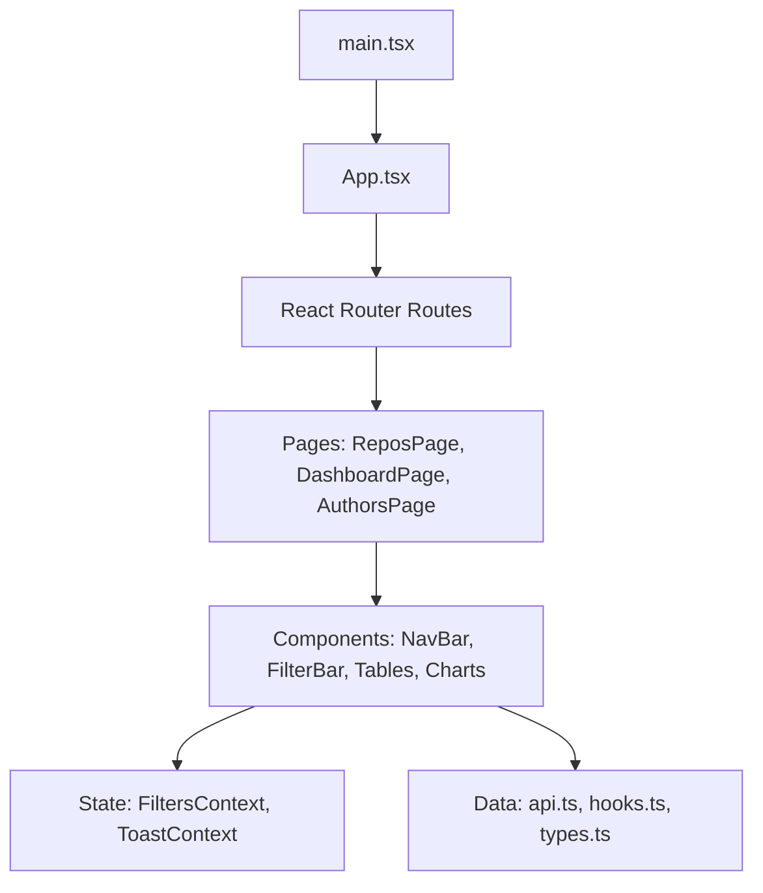
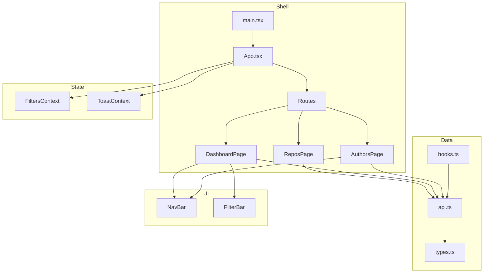
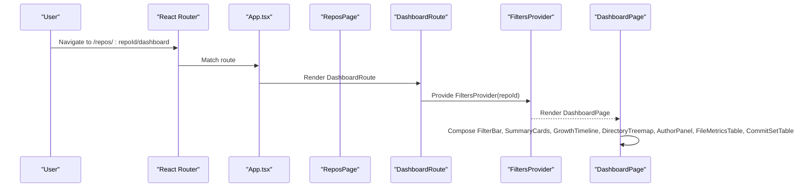
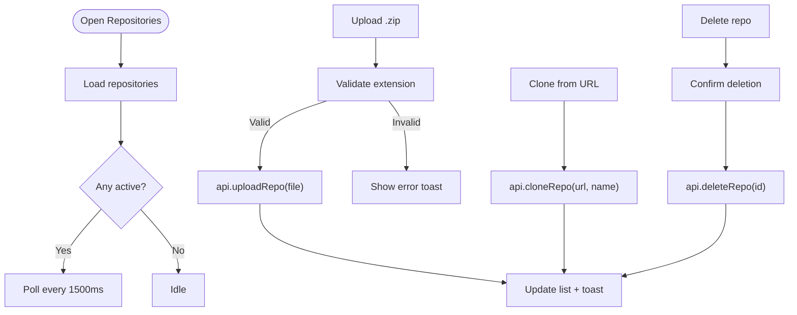
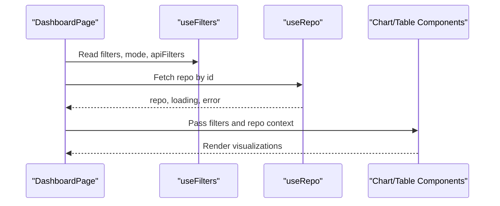
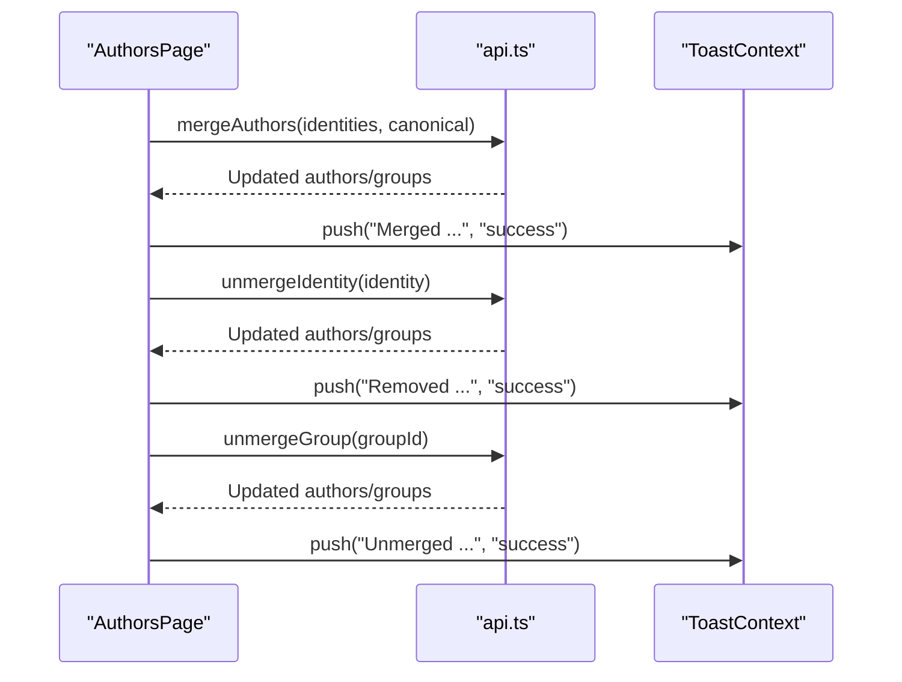
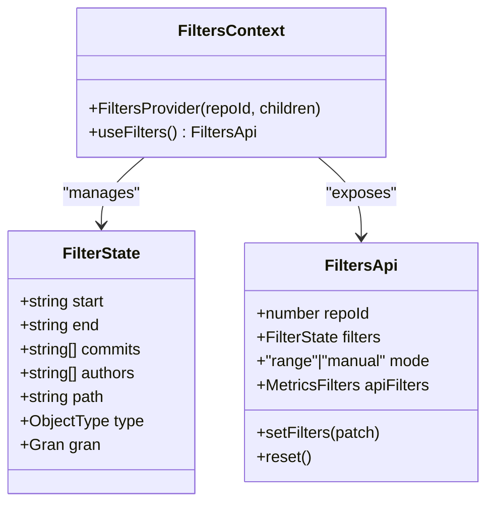
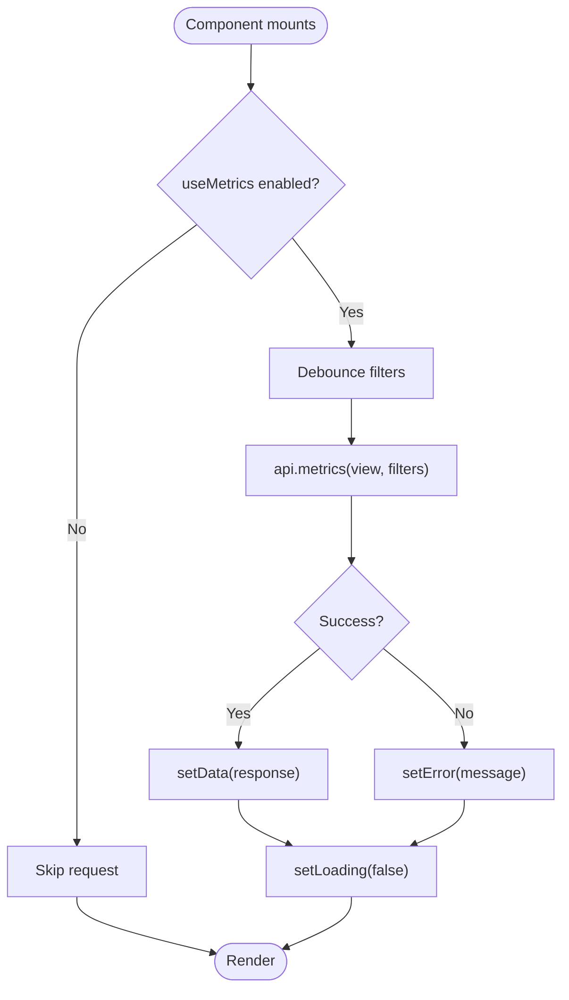
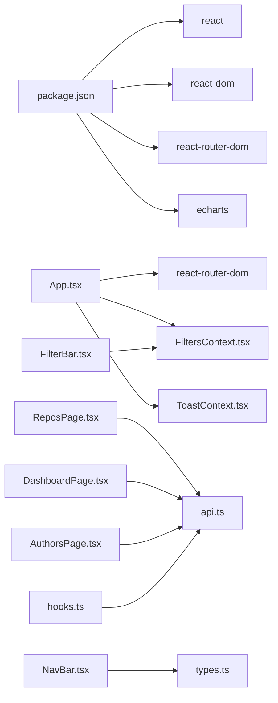

# Frontend Architecture

<cite>
**Referenced Files in This Document**
- [main.tsx](file://frontend/src/main.tsx)
- [App.tsx](file://frontend/src/App.tsx)
- [package.json](file://frontend/package.json)
- [vite.config.ts](file://frontend/vite.config.ts)
- [tsconfig.json](file://frontend/tsconfig.json)
- [api.ts](file://frontend/src/api.ts)
- [types.ts](file://frontend/src/types.ts)
- [hooks.ts](file://frontend/src/lib/hooks.ts)
- [FiltersContext.tsx](file://frontend/src/state/FiltersContext.tsx)
- [ToastContext.tsx](file://frontend/src/state/ToastContext.tsx)
- [DashboardPage.tsx](file://frontend/src/pages/DashboardPage.tsx)
- [AuthorsPage.tsx](file://frontend/src/pages/AuthorsPage.tsx)
- [ReposPage.tsx](file://frontend/src/pages/ReposPage.tsx)
- [NavBar.tsx](file://frontend/src/components/NavBar.tsx)
- [FilterBar.tsx](file://frontend/src/components/FilterBar.tsx)
</cite>

## Table of Contents
1. [Introduction](#introduction)
2. [Project Structure](#project-structure)
3. [Core Components](#core-components)
4. [Architecture Overview](#architecture-overview)
5. [Detailed Component Analysis](#detailed-component-analysis)
6. [Dependency Analysis](#dependency-analysis)
7. [Performance Considerations](#performance-considerations)
8. [Troubleshooting Guide](#troubleshooting-guide)
9. [Conclusion](#conclusion)

## Introduction
This document describes the frontend architecture of RAT, a React 18 application built with TypeScript and Vite. It explains the component hierarchy, routing with React Router, state management via Context API, data fetching patterns, ECharts integration points, and build configuration. The goal is to make the system understandable for both developers and non-technical readers while providing precise references to source files.

## Project Structure
The frontend follows a feature-oriented layout:
- Entry point and app shell: main.tsx and App.tsx
- Pages: Repositories, Dashboard, Authors
- Shared components: navigation, filters, tables, charts
- State: URL-synced filters and toast notifications
- Data layer: typed API client and shared types
- Build: Vite + React plugin, TypeScript compiler options

**Diagram sources**
- [main.tsx:1-14](file://frontend/src/main.tsx#L1-L14)
- [App.tsx:1-38](file://frontend/src/App.tsx#L1-L38)
- [ReposPage.tsx:1-287](file://frontend/src/pages/ReposPage.tsx#L1-L287)
- [DashboardPage.tsx:1-95](file://frontend/src/pages/DashboardPage.tsx#L1-L95)
- [AuthorsPage.tsx:1-312](file://frontend/src/pages/AuthorsPage.tsx#L1-L312)
- [NavBar.tsx:1-53](file://frontend/src/components/NavBar.tsx#L1-L53)
- [FilterBar.tsx:1-93](file://frontend/src/components/FilterBar.tsx#L1-L93)
- [FiltersContext.tsx:1-119](file://frontend/src/state/FiltersContext.tsx#L1-L119)
- [ToastContext.tsx:1-48](file://frontend/src/state/ToastContext.tsx#L1-L48)
- [api.ts:1-127](file://frontend/src/api.ts#L1-L127)
- [hooks.ts:1-142](file://frontend/src/lib/hooks.ts#L1-L142)
- [types.ts:1-172](file://frontend/src/types.ts#L1-L172)

**Section sources**
- [main.tsx:1-14](file://frontend/src/main.tsx#L1-L14)
- [App.tsx:1-38](file://frontend/src/App.tsx#L1-L38)

## Core Components
- Application shell and routing:
  - App wraps the app in BrowserRouter, provides global providers (ToastProvider, FiltersProvider), and defines routes for repositories, dashboard, and authors.
- Pages:
  - ReposPage manages repository ingestion (upload/clone), lists indexed repos, and navigates into repo-scoped pages.
  - DashboardPage composes filter controls, summary cards, growth timeline, directory treemap, author panel, file metrics table, and commit set table.
  - AuthorsPage handles identity merging and group management using the authors API.
- Navigation:
  - NavBar renders top-level navigation; RepoNav renders per-repo breadcrumbs and sub-navigation.
- Filters:
  - FilterBar composes path picker, date range inputs, granularity selector, author selection, and commit picker. All changes are persisted to the URL query string via FiltersContext.
- State:
  - FiltersContext synchronizes filter state with the URL and exposes an API for consumers.
  - ToastContext provides a simple notification system.
- Data layer:
  - api.ts is a typed client wrapping fetch with error handling and JSON helpers.
  - hooks.ts provides useRepo (polling), useMetrics (debounced SWR-style), useAuthors, and UI helpers like useClickOutside.
  - types.ts mirrors backend schemas and response shapes.

**Section sources**
- [App.tsx:10-37](file://frontend/src/App.tsx#L10-L37)
- [ReposPage.tsx:11-287](file://frontend/src/pages/ReposPage.tsx#L11-L287)
- [DashboardPage.tsx:17-95](file://frontend/src/pages/DashboardPage.tsx#L17-L95)
- [AuthorsPage.tsx:13-312](file://frontend/src/pages/AuthorsPage.tsx#L13-L312)
- [NavBar.tsx:6-53](file://frontend/src/components/NavBar.tsx#L6-L53)
- [FilterBar.tsx:9-93](file://frontend/src/components/FilterBar.tsx#L9-L93)
- [FiltersContext.tsx:14-119](file://frontend/src/state/FiltersContext.tsx#L14-L119)
- [ToastContext.tsx:5-48](file://frontend/src/state/ToastContext.tsx#L5-L48)
- [api.ts:17-127](file://frontend/src/api.ts#L17-L127)
- [hooks.ts:7-142](file://frontend/src/lib/hooks.ts#L7-L142)
- [types.ts:1-172](file://frontend/src/types.ts#L1-L172)

## Architecture Overview
The application uses React Router for navigation, Context API for cross-cutting state, and a typed API client for data access. Charts are rendered through ECharts via a dedicated hook and utilities.

**Diagram sources**
- [main.tsx:1-14](file://frontend/src/main.tsx#L1-L14)
- [App.tsx:1-38](file://frontend/src/App.tsx#L1-L38)
- [ReposPage.tsx:1-287](file://frontend/src/pages/ReposPage.tsx#L1-L287)
- [DashboardPage.tsx:1-95](file://frontend/src/pages/DashboardPage.tsx#L1-L95)
- [AuthorsPage.tsx:1-312](file://frontend/src/pages/AuthorsPage.tsx#L1-L312)
- [NavBar.tsx:1-53](file://frontend/src/components/NavBar.tsx#L1-L53)
- [FilterBar.tsx:1-93](file://frontend/src/components/FilterBar.tsx#L1-L93)
- [FiltersContext.tsx:1-119](file://frontend/src/state/FiltersContext.tsx#L1-L119)
- [ToastContext.tsx:1-48](file://frontend/src/state/ToastContext.tsx#L1-L48)
- [api.ts:1-127](file://frontend/src/api.ts#L1-L127)
- [hooks.ts:1-142](file://frontend/src/lib/hooks.ts#L1-L142)
- [types.ts:1-172](file://frontend/src/types.ts#L1-L172)

## Detailed Component Analysis

### Routing and Navigation Flow
- Routes:
  - "/" maps to ReposPage.
  - "/repos/:repoId/dashboard" maps to a route wrapper that validates repoId and provides FiltersProvider around DashboardPage.
  - "/repos/:repoId/authors" maps to AuthorsPage.
  - Wildcard redirects to root.
- Navigation:
  - NavBar links to Repositories.
  - RepoNav shows per-repo breadcrumb and active link styling for Dashboard and Authors.

**Diagram sources**
- [App.tsx:10-37](file://frontend/src/App.tsx#L10-L37)
- [DashboardPage.tsx:17-95](file://frontend/src/pages/DashboardPage.tsx#L17-L95)

**Section sources**
- [App.tsx:10-37](file://frontend/src/App.tsx#L10-L37)
- [NavBar.tsx:6-53](file://frontend/src/components/NavBar.tsx#L6-L53)

### Repository Management Page
- Responsibilities:
  - List repositories, upload zip archives, clone from URLs, delete repositories.
  - Poll active repositories at intervals and display progress.
  - Navigate to dashboard or authors page when ready.
- Event handling:
  - Drag-and-drop and file input trigger upload.
  - Form submissions trigger clone/delete operations.
  - Toasts provide feedback on success/error.

**Diagram sources**
- [ReposPage.tsx:22-89](file://frontend/src/pages/ReposPage.tsx#L22-L89)
- [api.ts:54-66](file://frontend/src/api.ts#L54-L66)

**Section sources**
- [ReposPage.tsx:11-287](file://frontend/src/pages/ReposPage.tsx#L11-L287)

### Dashboard Composition
- Responsibilities:
  - Display repository metadata and scope.
  - Provide filter controls and compose visualization panels.
- Data flow:
  - useRepo loads repository info with polling.
  - useFilters reads URL-synced filters and computes apiFilters for queries.
  - Child components consume filters and render charts/tables.

**Diagram sources**
- [DashboardPage.tsx:17-95](file://frontend/src/pages/DashboardPage.tsx#L17-L95)
- [FiltersContext.tsx:70-119](file://frontend/src/state/FiltersContext.tsx#L70-L119)
- [hooks.ts:14-49](file://frontend/src/lib/hooks.ts#L14-L49)

**Section sources**
- [DashboardPage.tsx:17-95](file://frontend/src/pages/DashboardPage.tsx#L17-L95)

### Author Merging Page
- Responsibilities:
  - Display author identities and merge groups.
  - Allow selecting multiple identities to merge into a canonical name.
  - Unmerge individual identities or entire groups.
- Event handling:
  - Toggle selection, bulk actions, and confirmations.
  - Toasts reflect outcomes.

**Diagram sources**
- [AuthorsPage.tsx:41-87](file://frontend/src/pages/AuthorsPage.tsx#L41-L87)
- [api.ts:68-84](file://frontend/src/api.ts#L68-L84)
- [ToastContext.tsx:17-43](file://frontend/src/state/ToastContext.tsx#L17-L43)

**Section sources**
- [AuthorsPage.tsx:13-312](file://frontend/src/pages/AuthorsPage.tsx#L13-L312)

### Filter Bar and URL-Synced State
- Responsibilities:
  - Provide controls for path scope, time range, granularity, authors, and manual commit selection.
  - Persist all filter changes to the URL query string.
- State model:
  - FilterState includes start, end, commits, authors, path, type, gran.
  - Mode switches between "range" and "manual" based on whether commits are selected.
  - apiFilters translates UI filters into backend contract (UNIX timestamps, exclusive end).

**Diagram sources**
- [FiltersContext.tsx:14-119](file://frontend/src/state/FiltersContext.tsx#L14-L119)
- [FilterBar.tsx:9-93](file://frontend/src/components/FilterBar.tsx#L9-L93)
- [types.ts:3-4](file://frontend/src/types.ts#L3-L4)

**Section sources**
- [FilterBar.tsx:9-93](file://frontend/src/components/FilterBar.tsx#L9-L93)
- [FiltersContext.tsx:24-119](file://frontend/src/state/FiltersContext.tsx#L24-L119)

### Data Fetching Hooks
- useRepo:
  - Loads a single repository and polls while status is active.
- useMetrics:
  - Debounces filter changes, keeps stale data until new data arrives, and supports manual reload.
- useAuthors:
  - Loads and updates author identities and groups.
- useClickOutside:
  - Utility for closing dropdowns on outside clicks.

**Diagram sources**
- [hooks.ts:51-99](file://frontend/src/lib/hooks.ts#L51-L99)
- [api.ts:107-125](file://frontend/src/api.ts#L107-L125)

**Section sources**
- [hooks.ts:14-142](file://frontend/src/lib/hooks.ts#L14-L142)

### Toast Notifications
- Provides a simple push-based notification system with auto-dismiss after a timeout.
- Consumers call useToast().push(text, kind) to show info/success/error messages.

**Section sources**
- [ToastContext.tsx:17-48](file://frontend/src/state/ToastContext.tsx#L17-L48)

### Visualization Layer and ECharts Integration
- The dashboard composes chart components such as GrowthTimeline and DirectoryTreemap. These components integrate ECharts through a dedicated hook and utilities.
- Chart customization and responsive behavior are implemented within chart-specific modules and hooks.

[No sources needed since this section does not analyze specific files]

## Dependency Analysis
- External dependencies:
  - react, react-dom, react-router-dom for UI and routing.
  - echarts for chart rendering.
- Internal dependencies:
  - Pages depend on components, state contexts, and data hooks.
  - Components depend on types and APIs.
  - API client depends on shared types.

**Diagram sources**
- [package.json:11-22](file://frontend/package.json#L11-L22)
- [App.tsx:1-38](file://frontend/src/App.tsx#L1-L38)
- [ReposPage.tsx:1-287](file://frontend/src/pages/ReposPage.tsx#L1-L287)
- [DashboardPage.tsx:1-95](file://frontend/src/pages/DashboardPage.tsx#L1-L95)
- [AuthorsPage.tsx:1-312](file://frontend/src/pages/AuthorsPage.tsx#L1-L312)
- [NavBar.tsx:1-53](file://frontend/src/components/NavBar.tsx#L1-L53)
- [FilterBar.tsx:1-93](file://frontend/src/components/FilterBar.tsx#L1-L93)
- [hooks.ts:1-142](file://frontend/src/lib/hooks.ts#L1-L142)
- [api.ts:1-127](file://frontend/src/api.ts#L1-L127)
- [types.ts:1-172](file://frontend/src/types.ts#L1-L172)

**Section sources**
- [package.json:11-22](file://frontend/package.json#L11-L22)

## Performance Considerations
- Build optimization:
  - Manual chunks separate echarts and React/router libraries to improve caching and initial load performance.
  - Chunk size warning limit configured to avoid oversized bundles.
- Runtime optimizations:
  - useMetrics debounces filter changes to reduce network requests during rapid interactions.
  - useRepo polls only while repository status is active, preventing unnecessary requests.
  - Stale data kept in useMetrics prevents chart flicker during refetches.

**Section sources**
- [vite.config.ts:15-25](file://frontend/vite.config.ts#L15-L25)
- [hooks.ts:51-99](file://frontend/src/lib/hooks.ts#L51-L99)
- [hooks.ts:14-49](file://frontend/src/lib/hooks.ts#L14-L49)

## Troubleshooting Guide
- Missing root element:
  - If the DOM node #root is absent, the app throws an error at startup.
- Backend connectivity:
  - The API client wraps fetch errors and HTTP errors into ApiError with status and detail.
  - In development, ensure the Vite dev server proxies /api to the backend.
- Repository not found:
  - DashboardPage displays a Loading state when repo is null and an ErrorNote when an error occurs.
- Invalid route parameters:
  - DashboardRoute validates repoId and redirects to root if invalid.

**Section sources**
- [main.tsx:6-13](file://frontend/src/main.tsx#L6-L13)
- [api.ts:17-44](file://frontend/src/api.ts#L17-L44)
- [vite.config.ts:6-13](file://frontend/vite.config.ts#L6-L13)
- [DashboardPage.tsx:21-34](file://frontend/src/pages/DashboardPage.tsx#L21-L34)
- [App.tsx:10-18](file://frontend/src/App.tsx#L10-L18)

## Conclusion
RAT’s frontend combines React 18, TypeScript, and Vite with a clear separation of concerns: routing in App.tsx, page composition in pages/, reusable components in components/, URL-synced state in state/, and a typed API client in api.ts. The architecture emphasizes shareable URLs for filters, robust data fetching with debouncing and polling, and modular chart integration. Build-time chunking and runtime optimizations help maintain performance as the application grows.