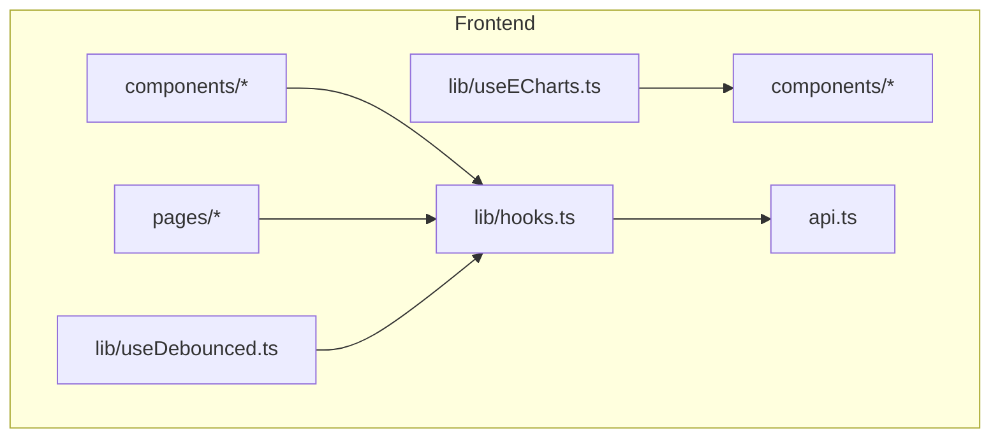
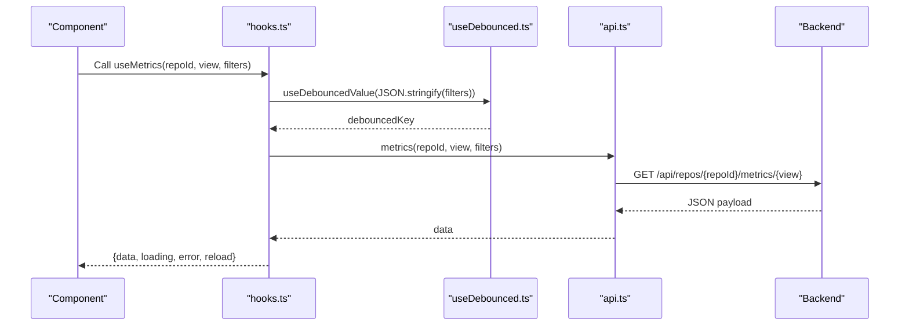
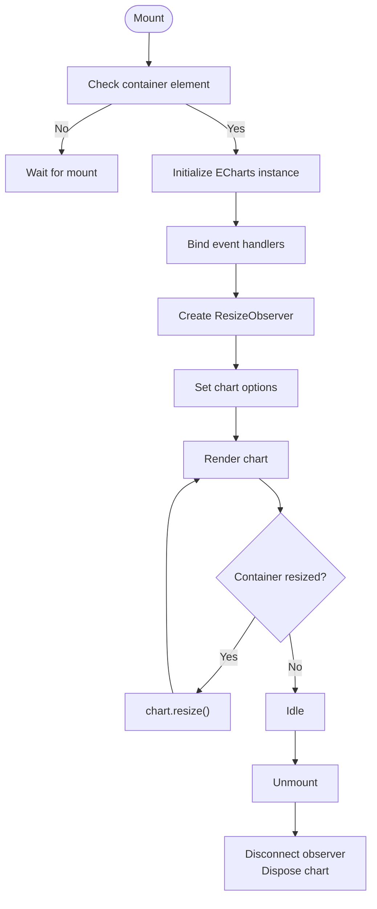
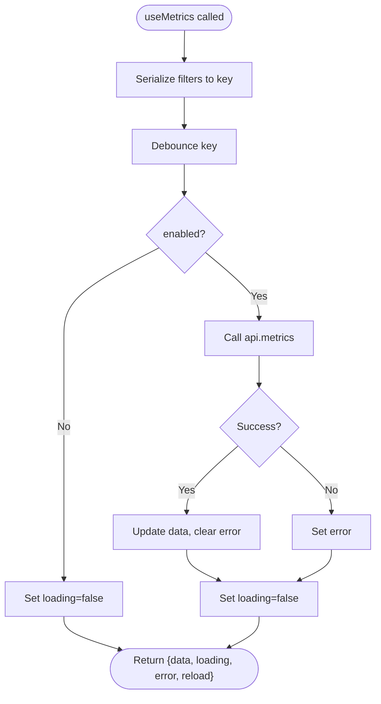
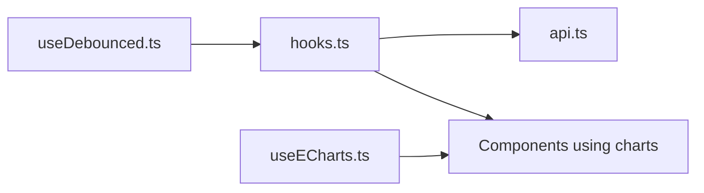

# Custom Hooks

<cite>
**Referenced Files in This Document**   
- [useDebounced.ts](file://frontend/src/lib/useDebounced.ts)
- [useECharts.ts](file://frontend/src/lib/useECharts.ts)
- [hooks.ts](file://frontend/src/lib/hooks.ts)
- [api.ts](file://frontend/src/api.ts)
</cite>

## Table of Contents
1. [Introduction](#introduction)
2. [Project Structure](#project-structure)
3. [Core Components](#core-components)
4. [Architecture Overview](#architecture-overview)
5. [Detailed Component Analysis](#detailed-component-analysis)
6. [Dependency Analysis](#dependency-analysis)
7. [Performance Considerations](#performance-considerations)
8. [Troubleshooting Guide](#troubleshooting-guide)
9. [Conclusion](#conclusion)

## Introduction
This document explains the custom React hooks that encapsulate common state management patterns and data fetching logic in the frontend. It focuses on:
- Performance optimization with debounced input handling via useDebouncedValue.
- Chart lifecycle management and responsive behavior via useECharts.
- Data fetching, polling, error handling, and API integration patterns through shared hooks in hooks.ts.
- Usage examples, parameter specifications, and best practices for composing these hooks together.

The goal is to help both new and experienced developers understand how to use these hooks effectively, avoid common pitfalls, and compose them into robust UI features.

## Project Structure
The relevant code lives under the frontend source tree:
- lib/useDebounced.ts: Debounce utility hook.
- lib/useECharts.ts: ECharts lifecycle and responsiveness hook.
- lib/hooks.ts: Data-fetching hooks (repository status polling, metrics with debounce, authors list), plus a click-outside helper.
- api.ts: Typed API client wrapping fetch with error normalization.

**Diagram sources**
- [hooks.ts:1-142](file://frontend/src/lib/hooks.ts#L1-L142)
- [useDebounced.ts:1-12](file://frontend/src/lib/useDebounced.ts#L1-L12)
- [useECharts.ts:1-55](file://frontend/src/lib/useECharts.ts#L1-L55)
- [api.ts:1-127](file://frontend/src/api.ts#L1-L127)

**Section sources**
- [hooks.ts:1-142](file://frontend/src/lib/hooks.ts#L1-L142)
- [useDebounced.ts:1-12](file://frontend/src/lib/useDebounced.ts#L1-L12)
- [useECharts.ts:1-55](file://frontend/src/lib/useECharts.ts#L1-L55)
- [api.ts:1-127](file://frontend/src/api.ts#L1-L127)

## Core Components
- useDebouncedValue: Returns a value delayed by a configurable number of milliseconds. Ideal for filtering inputs that trigger expensive operations like API calls or chart updates.
- useECharts: Manages an ECharts instance inside a DOM node, handles lazy initialization, event binding, resize observation, and cleanup.
- useRepo: Fetches repository info and polls while ingestion is active.
- useMetrics: Performs metric queries with debounced filters, keeps previous data until new data arrives, and exposes reload.
- useAuthors: Fetches author lists with loading/error states and manual reload.
- useClickOutside: Utility hook to close dropdowns when clicking outside.

**Section sources**
- [useDebounced.ts:1-12](file://frontend/src/lib/useDebounced.ts#L1-L12)
- [useECharts.ts:1-55](file://frontend/src/lib/useECharts.ts#L1-L55)
- [hooks.ts:1-142](file://frontend/src/lib/hooks.ts#L1-L142)

## Architecture Overview
The hooks layer composes small, focused utilities into higher-level behaviors:
- useDebouncedValue provides stable, throttled values for filter-driven requests.
- useMetrics uses useDebouncedValue to serialize rapid filter changes before calling api.metrics.
- useRepo implements polling based on repository status.
- useECharts wraps ECharts lifecycle and integrates with component rendering.
- api.ts centralizes HTTP requests and normalizes errors.

**Diagram sources**
- [hooks.ts:51-99](file://frontend/src/lib/hooks.ts#L51-L99)
- [useDebounced.ts:1-12](file://frontend/src/lib/useDebounced.ts#L1-L12)
- [api.ts:107-125](file://frontend/src/api.ts#L107-L125)

## Detailed Component Analysis

### useDebouncedValue
Purpose:
- Delay the propagation of a changing value by a specified delay.
- Prevents excessive re-renders and network requests during rapid user input.

Parameters:
- value: The current value to debounce.
- delayMs: Optional delay in milliseconds; defaults to 250.

Returns:
- The debounced value.

Behavior:
- Uses useState to hold the debounced value.
- Uses useEffect to schedule a timeout whenever value or delayMs changes.
- Clears the timeout on cleanup to avoid stale updates.

Usage example:
- Wrap filter objects or search strings before passing them to useMetrics or other data-fetching hooks.

Best practices:
- Keep delayMs reasonable (e.g., 200–300 ms) to balance responsiveness and performance.
- Avoid debouncing values that must be reflected immediately (e.g., toggles).

**Section sources**
- [useDebounced.ts:1-12](file://frontend/src/lib/useDebounced.ts#L1-L12)

### useECharts
Purpose:
- Manage ECharts instance lifecycle within a React component.
- Provide responsive resizing and event handling.

Parameters:
- option: EChartsOption describing the chart configuration.
- events: Optional map of event names to handlers.

Returns:
- elRef: Ref to attach to the container div.
- chartRef: Ref to the underlying ECharts instance.

Lifecycle details:
- Lazy initialization: Creates the chart only when the container element exists.
- Event binding: Attaches provided events to the chart instance.
- Resize handling: Uses ResizeObserver to call chart.resize() on container size changes.
- Cleanup: Disconnects observers and disposes the chart on unmount.
- Re-mount safety: Disposes and reinitializes if the container node changes.

Usage example:
- Render a div with ref={elRef}, then pass option to useECharts(option, events).

Best practices:
- Ensure the container has explicit dimensions so ResizeObserver can compute sizes correctly.
- Avoid mutating chart options directly; always pass updated option objects to keep diffs clean.
- Dispose is handled automatically; do not manually dispose unless you replace the entire chart instance.

**Diagram sources**
- [useECharts.ts:9-53](file://frontend/src/lib/useECharts.ts#L9-L53)

**Section sources**
- [useECharts.ts:1-55](file://frontend/src/lib/useECharts.ts#L1-L55)

### useRepo
Purpose:
- Fetch repository information and poll while ingestion is in progress.

Parameters:
- repoId: Repository identifier.
- pollMs: Polling interval in milliseconds; defaults to 1500.

Returns:
- repo: Current repository info or null.
- loading: Boolean indicating initial load or polling.
- error: Error message string or null.

Behavior:
- Loads repository once on mount.
- If the repository status indicates active ingestion, schedules periodic reloads.
- Cleans up timers and avoids state updates after unmount.

Usage example:
- Use in repository detail pages to show ingestion progress and refresh UI accordingly.

Best practices:
- Adjust pollMs based on expected ingestion duration and server load.
- Combine with user-facing indicators (progress bars, spinners) for better UX.

**Section sources**
- [hooks.ts:13-49](file://frontend/src/lib/hooks.ts#L13-L49)

### useMetrics
Purpose:
- Fetch metric data with debounced filters and preserve previous data until new data arrives.

Parameters:
- repoId: Repository identifier.
- view: Metric view name (e.g., summary, files, dirs, timeseries).
- filters: Filter object used to query metrics.
- enabled: Controls whether the request runs; useful for conditional fetching.

Returns:
- data: Parsed metric data or null.
- loading: Boolean indicating in-flight request.
- error: Error message string or null.
- reload: Function to force a reload by incrementing an internal nonce.

Behavior:
- Serializes filters to a key and debounces it using useDebouncedValue.
- Drops stale data when repoId changes to prevent cross-repo contamination.
- Keeps previous data while a new request is in flight to avoid empty charts.
- Exposes reload to allow manual refresh.

Usage example:
- Pass filters from a filter bar; combine with useECharts to render charts without flicker.

Best practices:
- Keep filters minimal and stable to reduce unnecessary re-renders.
- Use enabled to gate requests behind user interactions or feature flags.

**Diagram sources**
- [hooks.ts:51-99](file://frontend/src/lib/hooks.ts#L51-L99)
- [useDebounced.ts:1-12](file://frontend/src/lib/useDebounced.ts#L1-L12)
- [api.ts:107-125](file://frontend/src/api.ts#L107-L125)

**Section sources**
- [hooks.ts:51-99](file://frontend/src/lib/hooks.ts#L51-L99)

### useAuthors
Purpose:
- Fetch and manage author list data for a repository.

Parameters:
- repoId: Repository identifier.

Returns:
- data: Authors response or null.
- setData: Direct setter for authors data.
- loading: Boolean indicating in-flight request.
- error: Error message string or null.
- reload: Function to reload authors.

Behavior:
- Loads authors on mount.
- Provides manual reload capability.
- Normalizes errors and sets loading state appropriately.

Usage example:
- Use in author selection panels or merge workflows.

Best practices:
- Prefer using reload over setData for consistency with loading/error states.
- Combine with useClickOutside for dropdown panels managing author merges.

**Section sources**
- [hooks.ts:101-124](file://frontend/src/lib/hooks.ts#L101-L124)

### useClickOutside
Purpose:
- Close dropdowns or popovers when clicking outside their container.

Parameters:
- onOutside: Callback invoked when a click occurs outside the referenced element.

Returns:
- ref: Ref to attach to the container element.

Behavior:
- Listens for mousedown on the document.
- Invokes onOutside if the click target is not contained by the referenced element.
- Cleans up event listeners on unmount.

Usage example:
- Attach to dropdown containers to auto-close when users click elsewhere.

Best practices:
- Ensure the container is focusable or interactive if needed for accessibility.
- Avoid attaching multiple overlapping click-outside handlers without care.

**Section sources**
- [hooks.ts:126-141](file://frontend/src/lib/hooks.ts#L126-L141)

## Dependency Analysis
The hooks depend on each other and on the API client:
- useMetrics depends on useDebouncedValue and api.metrics.
- useRepo and useAuthors depend on api endpoints.
- useECharts depends on ECharts library and DOM APIs.

**Diagram sources**
- [hooks.ts:1-142](file://frontend/src/lib/hooks.ts#L1-L142)
- [useDebounced.ts:1-12](file://frontend/src/lib/useDebounced.ts#L1-L12)
- [useECharts.ts:1-55](file://frontend/src/lib/useECharts.ts#L1-L55)
- [api.ts:1-127](file://frontend/src/api.ts#L1-L127)

**Section sources**
- [hooks.ts:1-142](file://frontend/src/lib/hooks.ts#L1-L142)
- [useDebounced.ts:1-12](file://frontend/src/lib/useDebounced.ts#L1-L12)
- [useECharts.ts:1-55](file://frontend/src/lib/useECharts.ts#L1-L55)
- [api.ts:1-127](file://frontend/src/api.ts#L1-L127)

## Performance Considerations
- Debounce filters: Use useDebouncedValue to throttle frequent filter changes, reducing redundant API calls and chart re-renders.
- Preserve previous data: useMetrics retains prior data while new requests are in flight, preventing empty chart flashes.
- Polling intervals: Tune pollMs in useRepo to balance responsiveness and server load.
- Resize handling: useECharts uses ResizeObserver to efficiently handle container resizing without heavy layout thrashing.
- Cleanup: All hooks properly clean up timers, observers, and event listeners to avoid memory leaks.

[No sources needed since this section provides general guidance]

## Troubleshooting Guide
Common issues and resolutions:
- Charts not resizing: Ensure the container has explicit width/height and is visible when initialized. useECharts relies on ResizeObserver; hidden or zero-sized containers will not trigger updates.
- Stale data across repositories: useMetrics clears data when repoId changes; verify that repoId updates are correct and not being reused unintentionally.
- Network errors: api.ts throws ApiError with normalized messages; catch and display user-friendly messages in components.
- Polling loops: If useRepo continues polling unexpectedly, ensure the repository status transitions out of active states or disable polling by controlling component lifecycle.
- Dropdowns not closing: Verify useClickOutside ref is attached to the correct container and that no overlay intercepts clicks.

**Section sources**
- [api.ts:17-44](file://frontend/src/api.ts#L17-L44)
- [hooks.ts:13-49](file://frontend/src/lib/hooks.ts#L13-L49)
- [hooks.ts:51-99](file://frontend/src/lib/hooks.ts#L51-L99)
- [useECharts.ts:9-53](file://frontend/src/lib/useECharts.ts#L9-L53)

## Conclusion
These custom hooks provide a cohesive foundation for performance-optimized input handling, robust data fetching with polling and debouncing, and reliable chart lifecycle management. By composing useDebouncedValue, useMetrics, useRepo, useAuthors, and useECharts, you can build responsive, maintainable UI features that scale well with complex data flows and user interactions. Follow the usage examples and best practices outlined above to ensure consistent behavior and optimal performance.

[No sources needed since this section summarizes without analyzing specific files]