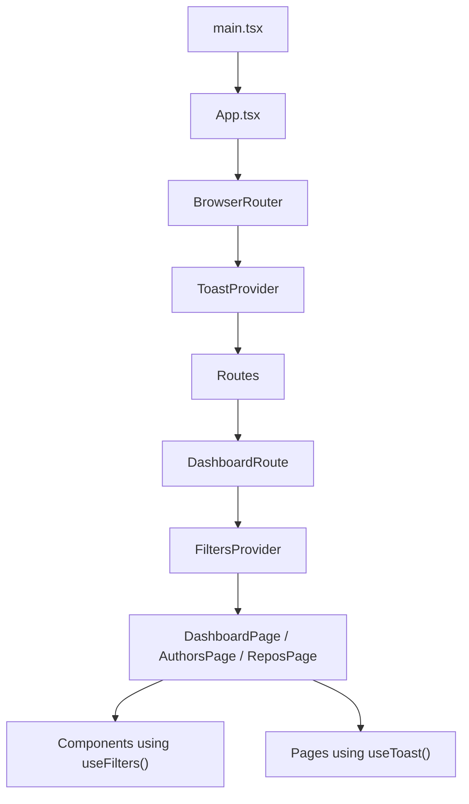
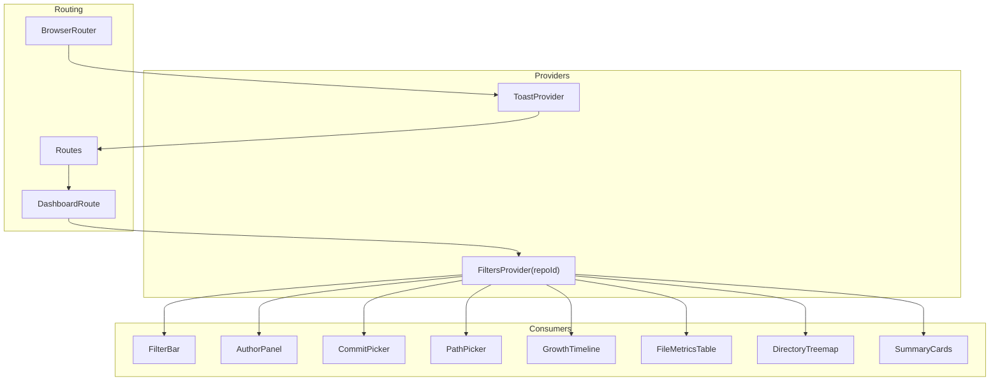
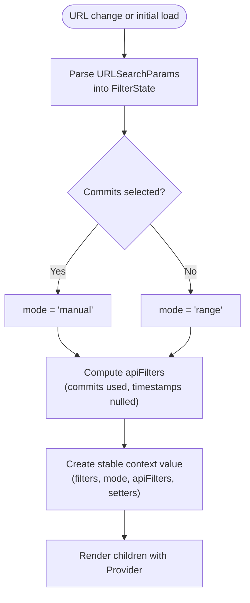
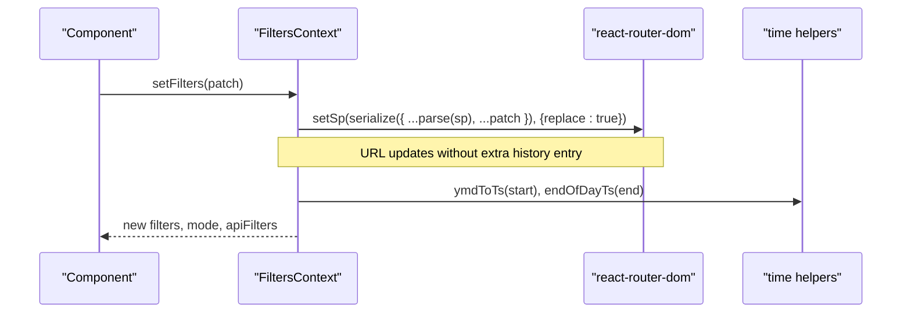
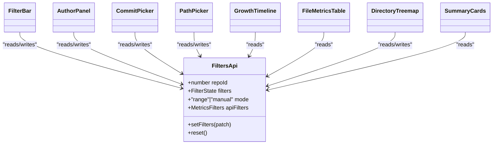
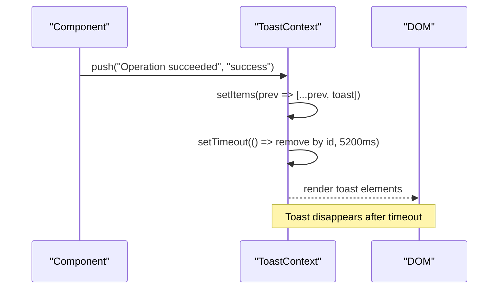
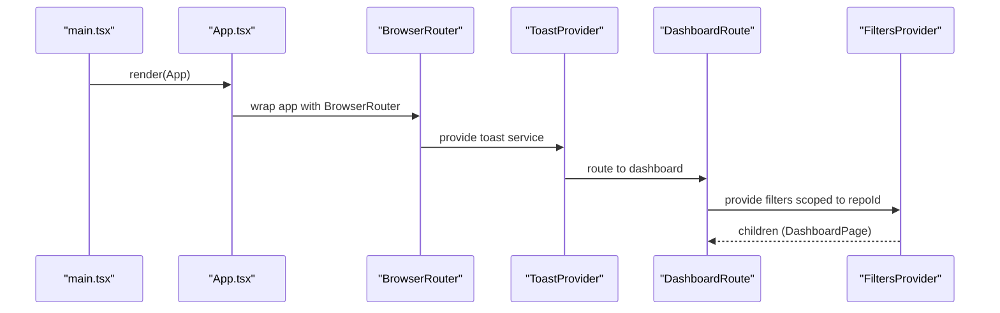
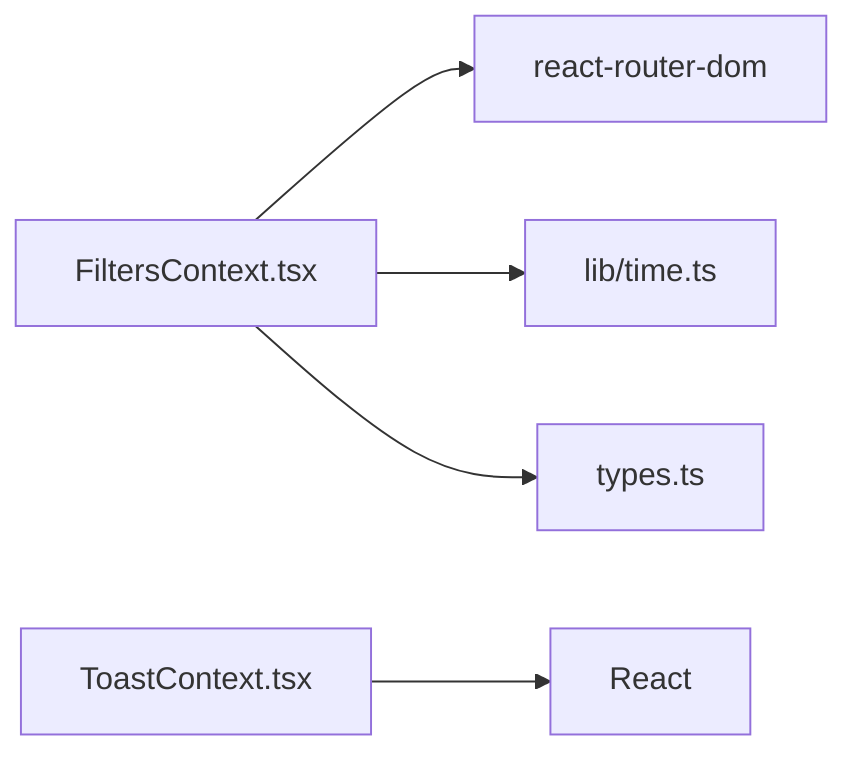

# Global State Contexts

<cite>
**Referenced Files in This Document**
- [FiltersContext.tsx](file://frontend/src/state/FiltersContext.tsx)
- [ToastContext.tsx](file://frontend/src/state/ToastContext.tsx)
- [App.tsx](file://frontend/src/App.tsx)
- [main.tsx](file://frontend/src/main.tsx)
- [types.ts](file://frontend/src/types.ts)
- [useDebounced.ts](file://frontend/src/lib/useDebounced.ts)
- [FilterBar.tsx](file://frontend/src/components/FilterBar.tsx)
- [AuthorPanel.tsx](file://frontend/src/components/AuthorPanel.tsx)
- [CommitPicker.tsx](file://frontend/src/components/CommitPicker.tsx)
- [DirectoryTreemap.tsx](file://frontend/src/components/DirectoryTreemap.tsx)
- [FileMetricsTable.tsx](file://frontend/src/components/FileMetricsTable.tsx)
- [GrowthTimeline.tsx](file://frontend/src/components/GrowthTimeline.tsx)
- [PathPicker.tsx](file://frontend/src/components/PathPicker.tsx)
- [SummaryCards.tsx](file://frontend/src/components/SummaryCards.tsx)
</cite>

## Table of Contents
1. [Introduction](#introduction)
2. [Project Structure](#project-structure)
3. [Core Components](#core-components)
4. [Architecture Overview](#architecture-overview)
5. [Detailed Component Analysis](#detailed-component-analysis)
6. [Dependency Analysis](#dependency-analysis)
7. [Performance Considerations](#performance-considerations)
8. [Troubleshooting Guide](#troubleshooting-guide)
9. [Conclusion](#conclusion)

## Introduction
This document explains the global state management layer built with React Context API. It focuses on two contexts:

- FiltersContext: application-wide filter state for time ranges, commit selections, author filters, path scoping, and granularity. It synchronizes state with the browser URL so that any view is shareable and bookmarkable.
- ToastContext: lightweight user feedback system for success, error, and info notifications.

It also covers provider setup, consumption patterns across components, and performance techniques such as selective re-renders and debouncing.

## Project Structure
The relevant frontend structure for this documentation is:

**Diagram sources**
- [main.tsx:9-13](file://frontend/src/main.tsx#L9-L13)
- [App.tsx:21-37](file://frontend/src/App.tsx#L21-L37)
- [App.tsx:10-19](file://frontend/src/App.tsx#L10-L19)

**Section sources**
- [main.tsx:1-14](file://frontend/src/main.tsx#L1-L14)
- [App.tsx:1-38](file://frontend/src/App.tsx#L1-L38)

## Core Components
- FiltersContext provides:
  - FilterState: start/end dates, selected commits, authors, path, object type (file/dir), and granularity.
  - URL synchronization via react-router-dom’s useSearchParams.
  - Computed apiFilters tailored for backend requests.
  - Mode selection between range-based and manual commit selection.
- ToastContext provides:
  - push(text, kind) to enqueue a toast notification.
  - Auto-dismissal after a timeout.
  - Accessible toast container with aria-live.

**Section sources**
- [FiltersContext.tsx:14-66](file://frontend/src/state/FiltersContext.tsx#L14-L66)
- [ToastContext.tsx:5-15](file://frontend/src/state/ToastContext.tsx#L5-L15)

## Architecture Overview
The providers are mounted near the root of the app:

- ToastProvider wraps all routes to make toasts globally available.
- FiltersProvider is mounted only under dashboard routes, scoped to a specific repository.

**Diagram sources**
- [App.tsx:21-37](file://frontend/src/App.tsx#L21-L37)
- [App.tsx:10-19](file://frontend/src/App.tsx#L10-L19)
- [FilterBar.tsx:10-10](file://frontend/src/components/FilterBar.tsx#L10-L10)
- [AuthorPanel.tsx:14-14](file://frontend/src/components/AuthorPanel.tsx#L14-L14)
- [CommitPicker.tsx:15-15](file://frontend/src/components/CommitPicker.tsx#L15-L15)
- [PathPicker.tsx:10-10](file://frontend/src/components/PathPicker.tsx#L10-L10)
- [GrowthTimeline.tsx:15-15](file://frontend/src/components/GrowthTimeline.tsx#L15-L15)
- [FileMetricsTable.tsx:21-21](file://frontend/src/components/FileMetricsTable.tsx#L21-L21)
- [DirectoryTreemap.tsx:59-59](file://frontend/src/components/DirectoryTreemap.tsx#L59-L59)
- [SummaryCards.tsx:35-35](file://frontend/src/components/SummaryCards.tsx#L35-L35)

## Detailed Component Analysis

### FiltersContext: Filter State and URL Synchronization
FiltersContext maintains a normalized FilterState and keeps it synchronized with the URL query string. Consumers read from context and update via setFilters; changes are serialized into the URL.

Key responsibilities:
- Parse URL parameters into FilterState.
- Serialize FilterState back to URL parameters.
- Compute derived mode ("range" vs "manual") based on whether commits are explicitly selected.
- Provide apiFilters adapted for backend calls, including timestamp conversion and nulling out unused fields.

**Diagram sources**
- [FiltersContext.tsx:24-55](file://frontend/src/state/FiltersContext.tsx#L24-L55)
- [FiltersContext.tsx:91-109](file://frontend/src/state/FiltersContext.tsx#L91-L109)

#### URL Parameter Contract
- start, end: date strings representing inclusive UTC days.
- commits: comma-separated SHAs; presence switches mode to manual.
- authors: comma-separated author keys.
- path + type: object scope; type defaults to directory when path is present.
- gran: timeseries bucket granularity; default month.

Serialization rules:
- Only non-empty values are written to the URL.
- When path is set, both path and type are persisted together.
- gran is omitted if it equals the default month.

**Section sources**
- [FiltersContext.tsx:1-12](file://frontend/src/state/FiltersContext.tsx#L1-L12)
- [FiltersContext.tsx:24-55](file://frontend/src/state/FiltersContext.tsx#L24-L55)

#### Provider Implementation Details
- Uses useSearchParams to bind state to the URL.
- Wraps parse in useMemo keyed by sp to avoid unnecessary recomputation.
- setFilters merges patches and updates the URL with replace to avoid history bloat.
- reset clears the URL query string.
- apiFilters converts date strings to UNIX timestamps and maps UI types to backend contract.

**Diagram sources**
- [FiltersContext.tsx:77-89](file://frontend/src/state/FiltersContext.tsx#L77-L89)
- [FiltersContext.tsx:93-104](file://frontend/src/state/FiltersContext.tsx#L93-L104)

#### Consumption Patterns
Common patterns across components:
- Read-only consumers: access filters and apiFilters for rendering and data fetching.
- Updaters: call setFilters with partial updates to adjust time range, authors, path, or granularity.
- Reset: clear filters to return to default URL state.

Examples of usage points:
- Filter controls: FilterBar, AuthorPanel, CommitPicker, PathPicker.
- Data consumers: GrowthTimeline, FileMetricsTable, DirectoryTreemap, SummaryCards.

**Diagram sources**
- [FiltersContext.tsx:57-66](file://frontend/src/state/FiltersContext.tsx#L57-L66)
- [FilterBar.tsx:10-10](file://frontend/src/components/FilterBar.tsx#L10-L10)
- [AuthorPanel.tsx:14-14](file://frontend/src/components/AuthorPanel.tsx#L14-L14)
- [CommitPicker.tsx:15-15](file://frontend/src/components/CommitPicker.tsx#L15-L15)
- [PathPicker.tsx:10-10](file://frontend/src/components/PathPicker.tsx#L10-L10)
- [GrowthTimeline.tsx:15-15](file://frontend/src/components/GrowthTimeline.tsx#L15-L15)
- [FileMetricsTable.tsx:21-21](file://frontend/src/components/FileMetricsTable.tsx#L21-L21)
- [DirectoryTreemap.tsx:59-59](file://frontend/src/components/DirectoryTreemap.tsx#L59-L59)
- [SummaryCards.tsx:35-35](file://frontend/src/components/SummaryCards.tsx#L35-L35)

**Section sources**
- [FiltersContext.tsx:68-119](file://frontend/src/state/FiltersContext.tsx#L68-L119)
- [FilterBar.tsx:10-10](file://frontend/src/components/FilterBar.tsx#L10-L10)
- [AuthorPanel.tsx:14-14](file://frontend/src/components/AuthorPanel.tsx#L14-L14)
- [CommitPicker.tsx:15-15](file://frontend/src/components/CommitPicker.tsx#L15-L15)
- [PathPicker.tsx:10-10](file://frontend/src/components/PathPicker.tsx#L10-L10)
- [GrowthTimeline.tsx:15-15](file://frontend/src/components/GrowthTimeline.tsx#L15-L15)
- [FileMetricsTable.tsx:21-21](file://frontend/src/components/FileMetricsTable.tsx#L21-L21)
- [DirectoryTreemap.tsx:59-59](file://frontend/src/components/DirectoryTreemap.tsx#L59-L59)
- [SummaryCards.tsx:35-35](file://frontend/src/components/SummaryCards.tsx#L35-L35)

### ToastContext: User Feedback Management
ToastContext provides a simple push API to display transient notifications. Notifications auto-dismiss after a fixed delay and are rendered in an accessible container.

Key behaviors:
- push(text, kind?) enqueues a toast with a unique id.
- Each toast is removed automatically after a timeout.
- The toast container uses aria-live="polite" for screen reader accessibility.

**Diagram sources**
- [ToastContext.tsx:17-43](file://frontend/src/state/ToastContext.tsx#L17-L43)

**Section sources**
- [ToastContext.tsx:1-48](file://frontend/src/state/ToastContext.tsx#L1-L48)

### Provider Setup and App Integration
- main.tsx mounts StrictMode and renders App.
- App.tsx configures routing and providers:
  - ToastProvider wraps the entire app shell.
  - DashboardRoute wraps dashboard pages with FiltersProvider(repoId).

**Diagram sources**
- [main.tsx:9-13](file://frontend/src/main.tsx#L9-L13)
- [App.tsx:21-37](file://frontend/src/App.tsx#L21-L37)
- [App.tsx:10-19](file://frontend/src/App.tsx#L10-L19)

**Section sources**
- [main.tsx:1-14](file://frontend/src/main.tsx#L1-L14)
- [App.tsx:1-38](file://frontend/src/App.tsx#L1-L38)

## Dependency Analysis
FiltersContext depends on:
- react-router-dom for URL binding.
- time utilities for date parsing and timestamp conversion.
- shared types for Gran, ObjectType, and MetricsFilters.

ToastContext has no external runtime dependencies beyond React.

**Diagram sources**
- [FiltersContext.tsx:8-12](file://frontend/src/state/FiltersContext.tsx#L8-L12)
- [ToastContext.tsx:1-3](file://frontend/src/state/ToastContext.tsx#L1-L3)
- [types.ts:1-4](file://frontend/src/types.ts#L1-L4)

**Section sources**
- [FiltersContext.tsx:8-12](file://frontend/src/state/FiltersContext.tsx#L8-L12)
- [ToastContext.tsx:1-3](file://frontend/src/state/ToastContext.tsx#L1-L3)
- [types.ts:1-4](file://frontend/src/types.ts#L1-L4)

## Performance Considerations
- Selective re-renders:
  - FiltersContext memoizes parse results, apiFilters, and the provider value to minimize downstream re-renders.
  - setFilters is wrapped in useCallback to keep referential stability.
- URL-driven updates:
  - Using replace:true avoids polluting browser history during filter updates.
- Debouncing data fetches:
  - Use useDebouncedValue to delay expensive operations triggered by filter changes.
- Toast performance:
  - Toast items are stored in a single state array; removal is O(n) but acceptable given small counts.
  - Auto-dismiss uses setTimeout per toast; consider batching if many toasts appear rapidly.

Recommended practices:
- Consume only the fields you need from useFilters to reduce re-renders.
- Group related filter updates into a single setFilters call.
- Debounce heavy computations or network requests that depend on filters.

**Section sources**
- [FiltersContext.tsx:77-109](file://frontend/src/state/FiltersContext.tsx#L77-L109)
- [useDebounced.ts:1-11](file://frontend/src/lib/useDebounced.ts#L1-L11)
- [ToastContext.tsx:17-43](file://frontend/src/state/ToastContext.tsx#L17-L43)

## Troubleshooting Guide
- Error: useFilters must be used inside a FiltersProvider
  - Cause: Calling useFilters outside a FiltersProvider scope.
  - Fix: Ensure the component tree includes FiltersProvider around the consumer.
- Unexpected mode behavior
  - Cause: Commits list presence toggles mode to manual, overriding time range.
  - Fix: Clear commits to return to range mode, or explicitly manage mode through commits.
- URL not updating
  - Cause: setFilters not called or patch missing fields.
  - Fix: Verify setFilters is invoked with correct patch; ensure serialize handles the field.
- Toast not appearing
  - Cause: ToastProvider not mounted or CSS classes missing.
  - Fix: Confirm ToastProvider wraps the app shell and styles are loaded.

**Section sources**
- [FiltersContext.tsx:114-118](file://frontend/src/state/FiltersContext.tsx#L114-L118)
- [ToastContext.tsx:17-43](file://frontend/src/state/ToastContext.tsx#L17-L43)

## Conclusion
FiltersContext and ToastContext provide a robust, URL-synchronized global state foundation for the application. FiltersContext centralizes filter logic, normalizes state, and exposes a clean API for consumers, while ToastContext offers a simple, accessible notification system. By leveraging memoization, selective consumption, and debouncing, the application achieves predictable performance and maintainability.